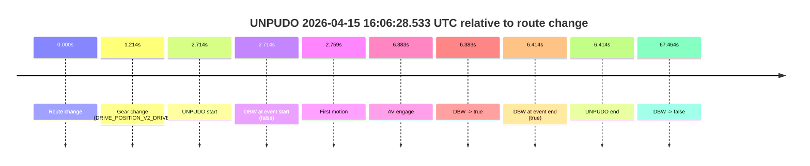
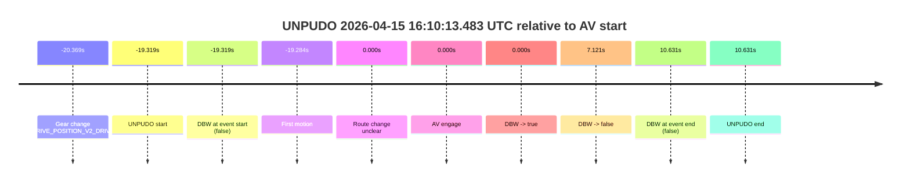
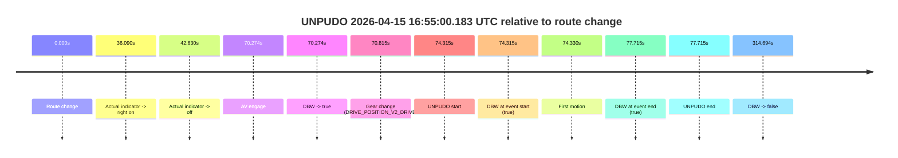
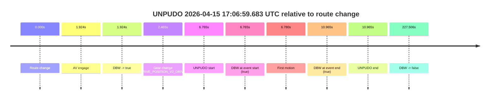
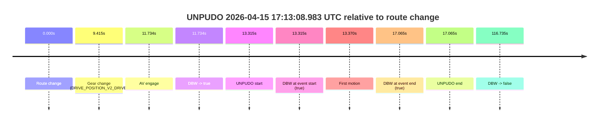
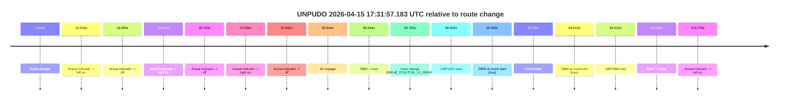

# Run Report: fme10011/2026-04-15--15-39-22--gen2-av-1eff82a8-d97f-4d8e-be75-4f5d130fd5f1

| Field | Value |
|---|---|
| Run ID | `fme10011/2026-04-15--15-39-22--gen2-av-1eff82a8-d97f-4d8e-be75-4f5d130fd5f1` |
| Date | `2026-04-15` |
| Model(s) | `armadillo-amethyst-squeaky` |
| Author | `guy.geva` |
| Event count | `7` |

## unpudo 2026-04-15 16:06:28.533 UTC

| Field | Value |
|---|---|
| Model | `armadillo-amethyst-squeaky` |
| Author | `guy.geva` |
| Run ID | `fme10011/2026-04-15--15-39-22--gen2-av-1eff82a8-d97f-4d8e-be75-4f5d130fd5f1` |
| Date | `2026-04-15` |
| Time (UTC) | `16:06:28.533` |
| Event type | `unpudo` |
| Disengagement type | `none observed` |
| Route change | `found` |
| Console | [run](https://console.sso.wayve.ai/run/fme10011/2026-04-15--15-39-22--gen2-av-1eff82a8-d97f-4d8e-be75-4f5d130fd5f1?id=&time-unixus=1776269188533298) |
| Foxglove | [segment](https://app.foxglove.dev/wayve-on-prem/p/prj_0dX18KZdVHg1fmmI/view?ds=foxglove-stream&ds.deviceName=fme10011&ds.start=2026-04-15T16%3A06%3A15.819720Z&ds.end=2026-04-15T16%3A07%3A43.283254Z&layoutId=lay_0e7VD4WIKDQGU73Y&time=2026-04-15T16%3A06%3A28.533298Z) |

### Event card: accidental

- Accidental: AV ownership is present for less than `2s`, so this is treated as an accidental brush with the maneuver rather than a meaningful model attempt.

| Event | Time (UTC) | Delta from route change |
|---|---:|---:|
| Route change | 2026-04-15 16:06:25.819 | `0.000s` |
| Gear change (DRIVE_POSITION_V2_DRIVE) | 2026-04-15 16:06:27.033 | `1.214s` |
| UNPUDO start | 2026-04-15 16:06:28.533 | `2.714s` |
| DBW at event start (false) | 2026-04-15 16:06:28.533 | `2.714s` |
| First motion | 2026-04-15 16:06:28.578 | `2.759s` |
| AV engage | 2026-04-15 16:06:32.202 | `6.383s` |
| DBW -> true | 2026-04-15 16:06:32.202 | `6.383s` |
| DBW at event end (true) | 2026-04-15 16:06:32.233 | `6.414s` |
| UNPUDO end | 2026-04-15 16:06:32.233 | `6.414s` |
| DBW -> false | 2026-04-15 16:07:33.283 | `67.464s` |

| Metric | Value |
|---|---|
| Outcome | `accidental` |
| Effective failure type | `none` |
| Route change status | `found` |
| DBW at event start | `false` |
| DBW at event end | `true` |
| Predicted gear at AV start | `DRIVE_POSITION_V2_DRIVE` |
| Actual gear at AV start | `DRIVE_POSITION_V2_DRIVE` |
| Predicted gear at event start | `DRIVE_POSITION_V2_DRIVE` |
| Actual gear at event start | `DRIVE_POSITION_V2_DRIVE` |
| Planned indicator direction | `INDICATORS_STATE_V2_OFF` |
| Controller indicator direction | `INDICATORS_STATE_V2_OFF` |
| Actual indicator direction | `INDICATORS_STATE_V2_OFF` |
| Actual indicator at maneuver end | `INDICATORS_STATE_V2_OFF` |
| Driver accel help in AV | `false` |
| Driver accel help timestamp | `n/a` |
| Max accel pedal pct in AV | `0.0%` |
| Max brake pedal pct in AV | `0.0%` |
| Max speed mps in AV | `4.094` |
| Success timing baseline | `route change` |
| Route -> AV | `6.383s` |
| AV -> event start | `-3.669s` |
| AV -> first motion | `-3.624s` |
| Success baseline -> event start | `2.714s` |
| Success baseline -> first motion | `2.759s` |
| AV duration before disengagement | `61.081s` |
| Trajectory waypoint count | `36` |
| Driving-plan step count | `11` |

The scored portion starts from the AV-owned window, not from the pre-AV setup. Route-change search in the stopped pre-event segment was `found`, with the baseline therefore set to route change. At the event anchor the model predicts `DRIVE_POSITION_V2_DRIVE` and the actual gear is `DRIVE_POSITION_V2_DRIVE`. The effective model outcome is `accidental` because `the AV-owned portion is shorter than 2s`.

### Resolution

| Field | Value |
|---|---|
| Final outcome | `accidental` |
| Do we agree with this label? | `yes` |
| Source disengagement type | `none observed` |
| Resolved effective failure type | `none` |
| Confidence | `high` |

## unpudo 2026-04-15 16:10:13.483 UTC

| Field | Value |
|---|---|
| Model | `armadillo-amethyst-squeaky` |
| Author | `guy.geva` |
| Run ID | `fme10011/2026-04-15--15-39-22--gen2-av-1eff82a8-d97f-4d8e-be75-4f5d130fd5f1` |
| Date | `2026-04-15` |
| Time (UTC) | `16:10:13.483` |
| Event type | `unpudo` |
| Disengagement type | `failed_to_unpudo` |
| Route change | `unclear` |
| Console | [run](https://console.sso.wayve.ai/run/fme10011/2026-04-15--15-39-22--gen2-av-1eff82a8-d97f-4d8e-be75-4f5d130fd5f1?id=&time-unixus=1776269413483321) |
| Foxglove | [segment](https://app.foxglove.dev/wayve-on-prem/p/prj_0dX18KZdVHg1fmmI/view?ds=foxglove-stream&ds.deviceName=fme10011&ds.start=2026-04-15T16%3A10%3A02.433303Z&ds.end=2026-04-15T16%3A10%3A53.433308Z&layoutId=lay_0e7VD4WIKDQGU73Y&time=2026-04-15T16%3A10%3A13.483321Z) |

### Event card: fail

- Fail: AV owns part of the segment, but the event still resolves as a model-performance failure under the AV-only scoring rule.

| Event | Time (UTC) | Delta from AV start |
|---|---:|---:|
| Gear change (DRIVE_POSITION_V2_DRIVE) | 2026-04-15 16:10:12.433 | `-20.369s` |
| UNPUDO start | 2026-04-15 16:10:13.483 | `-19.319s` |
| DBW at event start (false) | 2026-04-15 16:10:13.483 | `-19.319s` |
| First motion | 2026-04-15 16:10:13.518 | `-19.284s` |
| Route change unclear | 2026-04-15 16:10:32.802 | `0.000s` |
| AV engage | 2026-04-15 16:10:32.802 | `0.000s` |
| DBW -> true | 2026-04-15 16:10:32.802 | `0.000s` |
| DBW -> false | 2026-04-15 16:10:39.923 | `7.121s` |
| DBW at event end (false) | 2026-04-15 16:10:43.433 | `10.631s` |
| UNPUDO end | 2026-04-15 16:10:43.433 | `10.631s` |

| Metric | Value |
|---|---|
| Outcome | `fail` |
| Effective failure type | `failed_to_unpudo` |
| Route change status | `unclear` |
| DBW at event start | `false` |
| DBW at event end | `false` |
| Predicted gear at AV start | `DRIVE_POSITION_V2_DRIVE` |
| Actual gear at AV start | `DRIVE_POSITION_V2_PARK` |
| Predicted gear at event start | `DRIVE_POSITION_V2_DRIVE` |
| Actual gear at event start | `DRIVE_POSITION_V2_DRIVE` |
| Planned indicator direction | `INDICATORS_STATE_V2_OFF` |
| Controller indicator direction | `INDICATORS_STATE_V2_OFF` |
| Actual indicator direction | `INDICATORS_STATE_V2_OFF` |
| Actual indicator at maneuver end | `INDICATORS_STATE_V2_OFF` |
| Driver accel help in AV | `false` |
| Driver accel help timestamp | `n/a` |
| Max accel pedal pct in AV | `0.0%` |
| Max brake pedal pct in AV | `8.0%` |
| Max speed mps in AV | `0.000` |
| Success timing baseline | `AV start` |
| Route -> AV | `n/a` |
| AV -> event start | `-19.319s` |
| AV -> first motion | `-19.284s` |
| Success baseline -> event start | `-19.319s` |
| Success baseline -> first motion | `-19.284s` |
| AV duration before disengagement | `7.121s` |
| Trajectory waypoint count | `37` |
| Driving-plan step count | `11` |

The scored portion starts from the AV-owned window, not from the pre-AV setup. Route-change search in the stopped pre-event segment was `unclear`, with the baseline therefore set to AV start. At the event anchor the model predicts `DRIVE_POSITION_V2_DRIVE` and the actual gear is `DRIVE_POSITION_V2_DRIVE`. The effective model outcome is `fail` because `failed_to_unpudo`.

### Resolution

| Field | Value |
|---|---|
| Final outcome | `fail` |
| Do we agree with this label? | `yes` |
| Source disengagement type | `failed_to_unpudo` |
| Resolved effective failure type | `failed_to_unpudo` |
| Confidence | `medium` |

## unpudo 2026-04-15 16:55:00.183 UTC

| Field | Value |
|---|---|
| Model | `armadillo-amethyst-squeaky` |
| Author | `guy.geva` |
| Run ID | `fme10011/2026-04-15--15-39-22--gen2-av-1eff82a8-d97f-4d8e-be75-4f5d130fd5f1` |
| Date | `2026-04-15` |
| Time (UTC) | `16:55:00.183` |
| Event type | `unpudo` |
| Disengagement type | `none observed` |
| Route change | `found` |
| Console | [run](https://console.sso.wayve.ai/run/fme10011/2026-04-15--15-39-22--gen2-av-1eff82a8-d97f-4d8e-be75-4f5d130fd5f1?id=&time-unixus=1776272100183291) |
| Foxglove | [segment](https://app.foxglove.dev/wayve-on-prem/p/prj_0dX18KZdVHg1fmmI/view?ds=foxglove-stream&ds.deviceName=fme10011&ds.start=2026-04-15T16%3A53%3A35.868268Z&ds.end=2026-04-15T16%3A59%3A10.562270Z&layoutId=lay_0e7VD4WIKDQGU73Y&time=2026-04-15T16%3A55%3A00.183291Z) |

### Event card: pass

- Pass: AV owns the credited unpudo through the official event window, the gear state is aligned at the anchor, and the vehicle moves without driver accelerator help in AV.

| Event | Time (UTC) | Delta from route change |
|---|---:|---:|
| Route change | 2026-04-15 16:53:45.868 | `0.000s` |
| Actual indicator -> right on | 2026-04-15 16:54:21.958 | `36.090s` |
| Actual indicator -> off | 2026-04-15 16:54:28.497 | `42.630s` |
| AV engage | 2026-04-15 16:54:56.142 | `70.274s` |
| DBW -> true | 2026-04-15 16:54:56.142 | `70.274s` |
| Gear change (DRIVE_POSITION_V2_DRIVE) | 2026-04-15 16:54:56.683 | `70.815s` |
| UNPUDO start | 2026-04-15 16:55:00.183 | `74.315s` |
| DBW at event start (true) | 2026-04-15 16:55:00.183 | `74.315s` |
| First motion | 2026-04-15 16:55:00.198 | `74.330s` |
| DBW at event end (true) | 2026-04-15 16:55:03.583 | `77.715s` |
| UNPUDO end | 2026-04-15 16:55:03.583 | `77.715s` |
| DBW -> false | 2026-04-15 16:59:00.562 | `314.694s` |

| Metric | Value |
|---|---|
| Outcome | `pass` |
| Effective failure type | `none` |
| Route change status | `found` |
| DBW at event start | `true` |
| DBW at event end | `true` |
| Predicted gear at AV start | `DRIVE_POSITION_V2_DRIVE` |
| Actual gear at AV start | `DRIVE_POSITION_V2_PARK` |
| Predicted gear at event start | `DRIVE_POSITION_V2_DRIVE` |
| Actual gear at event start | `DRIVE_POSITION_V2_DRIVE` |
| Planned indicator direction | `INDICATORS_STATE_V2_OFF` |
| Controller indicator direction | `INDICATORS_STATE_V2_OFF` |
| Actual indicator direction | `INDICATORS_STATE_V2_OFF` |
| Actual indicator at maneuver end | `INDICATORS_STATE_V2_OFF` |
| Driver accel help in AV | `false` |
| Driver accel help timestamp | `n/a` |
| Max accel pedal pct in AV | `0.0%` |
| Max brake pedal pct in AV | `0.0%` |
| Max speed mps in AV | `5.006` |
| Success timing baseline | `route change` |
| Route -> AV | `70.274s` |
| AV -> event start | `4.041s` |
| AV -> first motion | `4.055s` |
| Success baseline -> event start | `74.315s` |
| Success baseline -> first motion | `74.330s` |
| AV duration before disengagement | `244.420s` |
| Trajectory waypoint count | `37` |
| Driving-plan step count | `11` |

The scored portion starts from the AV-owned window, not from the pre-AV setup. Route-change search in the stopped pre-event segment was `found`, with the baseline therefore set to route change. At the event anchor the model predicts `DRIVE_POSITION_V2_DRIVE` and the actual gear is `DRIVE_POSITION_V2_DRIVE`. The effective model outcome is `pass` because `the credited maneuver stays AV-owned through the official event end`.

### Resolution

| Field | Value |
|---|---|
| Final outcome | `pass` |
| Do we agree with this label? | `yes` |
| Source disengagement type | `none observed` |
| Resolved effective failure type | `none` |
| Confidence | `high` |

## unpudo 2026-04-15 17:04:25.633 UTC

| Field | Value |
|---|---|
| Model | `armadillo-amethyst-squeaky` |
| Author | `guy.geva` |
| Run ID | `fme10011/2026-04-15--15-39-22--gen2-av-1eff82a8-d97f-4d8e-be75-4f5d130fd5f1` |
| Date | `2026-04-15` |
| Time (UTC) | `17:04:25.633` |
| Event type | `unpudo` |
| Disengagement type | `none observed` |
| Route change | `found` |
| Console | [run](https://console.sso.wayve.ai/run/fme10011/2026-04-15--15-39-22--gen2-av-1eff82a8-d97f-4d8e-be75-4f5d130fd5f1?id=&time-unixus=1776272665633321) |
| Foxglove | [segment](https://app.foxglove.dev/wayve-on-prem/p/prj_0dX18KZdVHg1fmmI/view?ds=foxglove-stream&ds.deviceName=fme10011&ds.start=2026-04-15T17%3A04%3A05.818375Z&ds.end=2026-04-15T17%3A06%3A22.101785Z&layoutId=lay_0e7VD4WIKDQGU73Y&time=2026-04-15T17%3A04%3A25.633321Z) |

### Event card: pass

- Pass: AV owns the credited unpudo through the official event window, the gear state is aligned at the anchor, and the vehicle moves without driver accelerator help in AV.

| Event | Time (UTC) | Delta from route change |
|---|---:|---:|
| Route change | 2026-04-15 17:04:15.818 | `0.000s` |
| AV engage | 2026-04-15 17:04:21.042 | `5.224s` |
| DBW -> true | 2026-04-15 17:04:21.042 | `5.224s` |
| Gear change (DRIVE_POSITION_V2_DRIVE) | 2026-04-15 17:04:21.583 | `5.765s` |
| UNPUDO start | 2026-04-15 17:04:25.633 | `9.815s` |
| DBW at event start (true) | 2026-04-15 17:04:25.633 | `9.815s` |
| First motion | 2026-04-15 17:04:25.678 | `9.860s` |
| DBW at event end (true) | 2026-04-15 17:04:29.733 | `13.915s` |
| UNPUDO end | 2026-04-15 17:04:29.733 | `13.915s` |
| DBW -> false | 2026-04-15 17:06:12.101 | `116.283s` |

| Metric | Value |
|---|---|
| Outcome | `pass` |
| Effective failure type | `none` |
| Route change status | `found` |
| DBW at event start | `true` |
| DBW at event end | `true` |
| Predicted gear at AV start | `DRIVE_POSITION_V2_DRIVE` |
| Actual gear at AV start | `DRIVE_POSITION_V2_PARK` |
| Predicted gear at event start | `DRIVE_POSITION_V2_DRIVE` |
| Actual gear at event start | `DRIVE_POSITION_V2_DRIVE` |
| Planned indicator direction | `INDICATORS_STATE_V2_OFF` |
| Controller indicator direction | `INDICATORS_STATE_V2_OFF` |
| Actual indicator direction | `INDICATORS_STATE_V2_OFF` |
| Actual indicator at maneuver end | `INDICATORS_STATE_V2_OFF` |
| Driver accel help in AV | `false` |
| Driver accel help timestamp | `n/a` |
| Max accel pedal pct in AV | `0.0%` |
| Max brake pedal pct in AV | `0.0%` |
| Max speed mps in AV | `3.883` |
| Success timing baseline | `route change` |
| Route -> AV | `5.224s` |
| AV -> event start | `4.591s` |
| AV -> first motion | `4.635s` |
| Success baseline -> event start | `9.815s` |
| Success baseline -> first motion | `9.860s` |
| AV duration before disengagement | `111.059s` |
| Trajectory waypoint count | `36` |
| Driving-plan step count | `11` |

The scored portion starts from the AV-owned window, not from the pre-AV setup. Route-change search in the stopped pre-event segment was `found`, with the baseline therefore set to route change. At the event anchor the model predicts `DRIVE_POSITION_V2_DRIVE` and the actual gear is `DRIVE_POSITION_V2_DRIVE`. The effective model outcome is `pass` because `the credited maneuver stays AV-owned through the official event end`.

### Resolution

| Field | Value |
|---|---|
| Final outcome | `pass` |
| Do we agree with this label? | `yes` |
| Source disengagement type | `none observed` |
| Resolved effective failure type | `none` |
| Confidence | `high` |

## unpudo 2026-04-15 17:06:59.683 UTC

| Field | Value |
|---|---|
| Model | `armadillo-amethyst-squeaky` |
| Author | `guy.geva` |
| Run ID | `fme10011/2026-04-15--15-39-22--gen2-av-1eff82a8-d97f-4d8e-be75-4f5d130fd5f1` |
| Date | `2026-04-15` |
| Time (UTC) | `17:06:59.683` |
| Event type | `unpudo` |
| Disengagement type | `none observed` |
| Route change | `found` |
| Console | [run](https://console.sso.wayve.ai/run/fme10011/2026-04-15--15-39-22--gen2-av-1eff82a8-d97f-4d8e-be75-4f5d130fd5f1?id=&time-unixus=1776272819683324) |
| Foxglove | [segment](https://app.foxglove.dev/wayve-on-prem/p/prj_0dX18KZdVHg1fmmI/view?ds=foxglove-stream&ds.deviceName=fme10011&ds.start=2026-04-15T17%3A06%3A42.918289Z&ds.end=2026-04-15T17%3A10%3A50.423856Z&layoutId=lay_0e7VD4WIKDQGU73Y&time=2026-04-15T17%3A06%3A59.683324Z) |

### Event card: pass

- Pass: AV owns the credited unpudo through the official event window, the gear state is aligned at the anchor, and the vehicle moves without driver accelerator help in AV.

| Event | Time (UTC) | Delta from route change |
|---|---:|---:|
| Route change | 2026-04-15 17:06:52.918 | `0.000s` |
| AV engage | 2026-04-15 17:06:54.842 | `1.924s` |
| DBW -> true | 2026-04-15 17:06:54.842 | `1.924s` |
| Gear change (DRIVE_POSITION_V2_DRIVE) | 2026-04-15 17:06:55.383 | `2.465s` |
| UNPUDO start | 2026-04-15 17:06:59.683 | `6.765s` |
| DBW at event start (true) | 2026-04-15 17:06:59.683 | `6.765s` |
| First motion | 2026-04-15 17:06:59.698 | `6.780s` |
| DBW at event end (true) | 2026-04-15 17:07:03.883 | `10.965s` |
| UNPUDO end | 2026-04-15 17:07:03.883 | `10.965s` |
| DBW -> false | 2026-04-15 17:10:40.423 | `227.506s` |

| Metric | Value |
|---|---|
| Outcome | `pass` |
| Effective failure type | `none` |
| Route change status | `found` |
| DBW at event start | `true` |
| DBW at event end | `true` |
| Predicted gear at AV start | `DRIVE_POSITION_V2_DRIVE` |
| Actual gear at AV start | `DRIVE_POSITION_V2_PARK` |
| Predicted gear at event start | `DRIVE_POSITION_V2_DRIVE` |
| Actual gear at event start | `DRIVE_POSITION_V2_DRIVE` |
| Planned indicator direction | `INDICATORS_STATE_V2_OFF` |
| Controller indicator direction | `INDICATORS_STATE_V2_OFF` |
| Actual indicator direction | `INDICATORS_STATE_V2_OFF` |
| Actual indicator at maneuver end | `INDICATORS_STATE_V2_OFF` |
| Driver accel help in AV | `false` |
| Driver accel help timestamp | `n/a` |
| Max accel pedal pct in AV | `0.0%` |
| Max brake pedal pct in AV | `0.0%` |
| Max speed mps in AV | `3.958` |
| Success timing baseline | `route change` |
| Route -> AV | `1.924s` |
| AV -> event start | `4.841s` |
| AV -> first motion | `4.856s` |
| Success baseline -> event start | `6.765s` |
| Success baseline -> first motion | `6.780s` |
| AV duration before disengagement | `225.581s` |
| Trajectory waypoint count | `37` |
| Driving-plan step count | `11` |

The scored portion starts from the AV-owned window, not from the pre-AV setup. Route-change search in the stopped pre-event segment was `found`, with the baseline therefore set to route change. At the event anchor the model predicts `DRIVE_POSITION_V2_DRIVE` and the actual gear is `DRIVE_POSITION_V2_DRIVE`. The effective model outcome is `pass` because `the credited maneuver stays AV-owned through the official event end`.

### Resolution

| Field | Value |
|---|---|
| Final outcome | `pass` |
| Do we agree with this label? | `yes` |
| Source disengagement type | `none observed` |
| Resolved effective failure type | `none` |
| Confidence | `high` |

## unpudo 2026-04-15 17:13:08.983 UTC

| Field | Value |
|---|---|
| Model | `armadillo-amethyst-squeaky` |
| Author | `guy.geva` |
| Run ID | `fme10011/2026-04-15--15-39-22--gen2-av-1eff82a8-d97f-4d8e-be75-4f5d130fd5f1` |
| Date | `2026-04-15` |
| Time (UTC) | `17:13:08.983` |
| Event type | `unpudo` |
| Disengagement type | `none observed` |
| Route change | `found` |
| Console | [run](https://console.sso.wayve.ai/run/fme10011/2026-04-15--15-39-22--gen2-av-1eff82a8-d97f-4d8e-be75-4f5d130fd5f1?id=&time-unixus=1776273188983305) |
| Foxglove | [segment](https://app.foxglove.dev/wayve-on-prem/p/prj_0dX18KZdVHg1fmmI/view?ds=foxglove-stream&ds.deviceName=fme10011&ds.start=2026-04-15T17%3A12%3A45.668303Z&ds.end=2026-04-15T17%3A15%3A02.403703Z&layoutId=lay_0e7VD4WIKDQGU73Y&time=2026-04-15T17%3A13%3A08.983305Z) |

### Event card: pass

- Pass: AV owns the credited unpudo through the official event window, the gear state is aligned at the anchor, and the vehicle moves without driver accelerator help in AV.

| Event | Time (UTC) | Delta from route change |
|---|---:|---:|
| Route change | 2026-04-15 17:12:55.668 | `0.000s` |
| Gear change (DRIVE_POSITION_V2_DRIVE) | 2026-04-15 17:13:05.083 | `9.415s` |
| AV engage | 2026-04-15 17:13:07.402 | `11.734s` |
| DBW -> true | 2026-04-15 17:13:07.402 | `11.734s` |
| UNPUDO start | 2026-04-15 17:13:08.983 | `13.315s` |
| DBW at event start (true) | 2026-04-15 17:13:08.983 | `13.315s` |
| First motion | 2026-04-15 17:13:09.037 | `13.370s` |
| DBW at event end (true) | 2026-04-15 17:13:12.733 | `17.065s` |
| UNPUDO end | 2026-04-15 17:13:12.733 | `17.065s` |
| DBW -> false | 2026-04-15 17:14:52.403 | `116.735s` |

| Metric | Value |
|---|---|
| Outcome | `pass` |
| Effective failure type | `none` |
| Route change status | `found` |
| DBW at event start | `true` |
| DBW at event end | `true` |
| Predicted gear at AV start | `DRIVE_POSITION_V2_DRIVE` |
| Actual gear at AV start | `DRIVE_POSITION_V2_DRIVE` |
| Predicted gear at event start | `DRIVE_POSITION_V2_DRIVE` |
| Actual gear at event start | `DRIVE_POSITION_V2_DRIVE` |
| Planned indicator direction | `INDICATORS_STATE_V2_OFF` |
| Controller indicator direction | `INDICATORS_STATE_V2_OFF` |
| Actual indicator direction | `INDICATORS_STATE_V2_OFF` |
| Actual indicator at maneuver end | `INDICATORS_STATE_V2_OFF` |
| Driver accel help in AV | `false` |
| Driver accel help timestamp | `n/a` |
| Max accel pedal pct in AV | `0.0%` |
| Max brake pedal pct in AV | `0.0%` |
| Max speed mps in AV | `4.531` |
| Success timing baseline | `route change` |
| Route -> AV | `11.734s` |
| AV -> event start | `1.581s` |
| AV -> first motion | `1.635s` |
| Success baseline -> event start | `13.315s` |
| Success baseline -> first motion | `13.370s` |
| AV duration before disengagement | `105.001s` |
| Trajectory waypoint count | `37` |
| Driving-plan step count | `11` |

The scored portion starts from the AV-owned window, not from the pre-AV setup. Route-change search in the stopped pre-event segment was `found`, with the baseline therefore set to route change. At the event anchor the model predicts `DRIVE_POSITION_V2_DRIVE` and the actual gear is `DRIVE_POSITION_V2_DRIVE`. The effective model outcome is `pass` because `the credited maneuver stays AV-owned through the official event end`.

### Resolution

| Field | Value |
|---|---|
| Final outcome | `pass` |
| Do we agree with this label? | `yes` |
| Source disengagement type | `none observed` |
| Resolved effective failure type | `none` |
| Confidence | `high` |

## unpudo 2026-04-15 17:31:57.183 UTC

| Field | Value |
|---|---|
| Model | `armadillo-amethyst-squeaky` |
| Author | `guy.geva` |
| Run ID | `fme10011/2026-04-15--15-39-22--gen2-av-1eff82a8-d97f-4d8e-be75-4f5d130fd5f1` |
| Date | `2026-04-15` |
| Time (UTC) | `17:31:57.183` |
| Event type | `unpudo` |
| Disengagement type | `none observed` |
| Route change | `found` |
| Console | [run](https://console.sso.wayve.ai/run/fme10011/2026-04-15--15-39-22--gen2-av-1eff82a8-d97f-4d8e-be75-4f5d130fd5f1?id=&time-unixus=1776274317183312) |
| Foxglove | [segment](https://app.foxglove.dev/wayve-on-prem/p/prj_0dX18KZdVHg1fmmI/view?ds=foxglove-stream&ds.deviceName=fme10011&ds.start=2026-04-15T17%3A30%3A16.718484Z&ds.end=2026-04-15T17%3A34%3A13.402415Z&layoutId=lay_0e7VD4WIKDQGU73Y&time=2026-04-15T17%3A31%3A57.183312Z) |

### Event card: pass

- Pass: AV owns the credited unpudo through the official event window, the gear state is aligned at the anchor, and the vehicle moves without driver accelerator help in AV.

| Event | Time (UTC) | Delta from route change |
|---|---:|---:|
| Route change | 2026-04-15 17:30:26.718 | `0.000s` |
| Actual indicator -> left on | 2026-04-15 17:30:39.237 | `12.519s` |
| Actual indicator -> off | 2026-04-15 17:30:44.718 | `18.000s` |
| Actual indicator -> right on | 2026-04-15 17:30:46.237 | `19.519s` |
| Actual indicator -> off | 2026-04-15 17:30:56.458 | `29.740s` |
| Actual indicator -> right on | 2026-04-15 17:31:14.357 | `47.639s` |
| Actual indicator -> off | 2026-04-15 17:31:18.658 | `51.940s` |
| AV engage | 2026-04-15 17:31:52.362 | `85.644s` |
| DBW -> true | 2026-04-15 17:31:52.362 | `85.644s` |
| Gear change (DRIVE_POSITION_V2_DRIVE) | 2026-04-15 17:31:52.483 | `85.765s` |
| UNPUDO start | 2026-04-15 17:31:57.183 | `90.465s` |
| DBW at event start (true) | 2026-04-15 17:31:57.183 | `90.465s` |
| First motion | 2026-04-15 17:31:57.258 | `90.540s` |
| DBW at event end (true) | 2026-04-15 17:32:00.733 | `94.015s` |
| UNPUDO end | 2026-04-15 17:32:00.733 | `94.015s` |
| DBW -> false | 2026-04-15 17:34:03.402 | `216.684s` |
| Actual indicator -> left on | 2026-04-15 17:34:10.197 | `223.479s` |

| Metric | Value |
|---|---|
| Outcome | `pass` |
| Effective failure type | `none` |
| Route change status | `found` |
| DBW at event start | `true` |
| DBW at event end | `true` |
| Predicted gear at AV start | `DRIVE_POSITION_V2_DRIVE` |
| Actual gear at AV start | `DRIVE_POSITION_V2_PARK` |
| Predicted gear at event start | `DRIVE_POSITION_V2_DRIVE` |
| Actual gear at event start | `DRIVE_POSITION_V2_DRIVE` |
| Planned indicator direction | `INDICATORS_STATE_V2_LEFT_ON` |
| Controller indicator direction | `INDICATORS_STATE_V2_LEFT_ON` |
| Actual indicator direction | `INDICATORS_STATE_V2_OFF` |
| Actual indicator at maneuver end | `INDICATORS_STATE_V2_OFF` |
| Driver accel help in AV | `false` |
| Driver accel help timestamp | `n/a` |
| Max accel pedal pct in AV | `0.0%` |
| Max brake pedal pct in AV | `0.0%` |
| Max speed mps in AV | `4.489` |
| Success timing baseline | `route change` |
| Route -> AV | `85.644s` |
| AV -> event start | `4.821s` |
| AV -> first motion | `4.896s` |
| Success baseline -> event start | `90.465s` |
| Success baseline -> first motion | `90.540s` |
| AV duration before disengagement | `131.040s` |
| Trajectory waypoint count | `37` |
| Driving-plan step count | `11` |

The scored portion starts from the AV-owned window, not from the pre-AV setup. Route-change search in the stopped pre-event segment was `found`, with the baseline therefore set to route change. At the event anchor the model predicts `DRIVE_POSITION_V2_DRIVE` and the actual gear is `DRIVE_POSITION_V2_DRIVE`. The effective model outcome is `pass` because `the credited maneuver stays AV-owned through the official event end`.

### Resolution

| Field | Value |
|---|---|
| Final outcome | `pass` |
| Do we agree with this label? | `yes` |
| Source disengagement type | `none observed` |
| Resolved effective failure type | `none` |
| Confidence | `high` |
