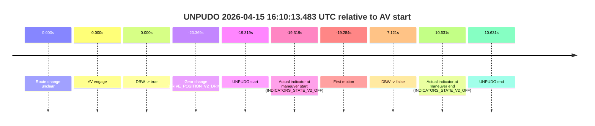
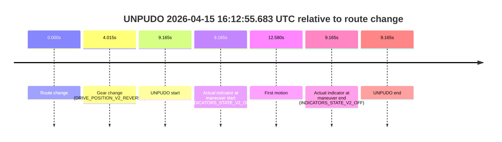
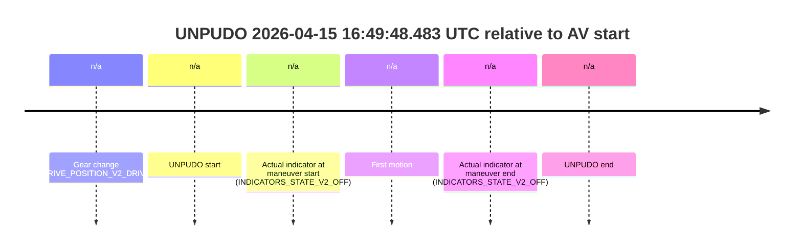
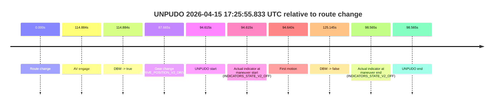

# Run Report: fme10011/2026-04-15--15-39-22--gen2-av-1eff82a8-d97f-4d8e-be75-4f5d130fd5f1

| Field | Value |
|---|---|
| Run ID | `fme10011/2026-04-15--15-39-22--gen2-av-1eff82a8-d97f-4d8e-be75-4f5d130fd5f1` |
| Date | `2026-04-15` |
| Model(s) | `armadillo-amethyst-squeaky` |
| Author | `guy.geva` |
| Event count | `24` |

## unpudo 2026-04-15 15:49:16.983 UTC

| Field | Value |
|---|---|
| Model | `armadillo-amethyst-squeaky` |
| Author | `guy.geva` |
| Run ID | `fme10011/2026-04-15--15-39-22--gen2-av-1eff82a8-d97f-4d8e-be75-4f5d130fd5f1` |
| Date | `2026-04-15` |
| Time (UTC) | `15:49:16.983` |
| Event type | `unpudo` |
| Disengagement type | `none observed` |
| Route change | `found` |
| Console | [run](https://console.sso.wayve.ai/run/fme10011/2026-04-15--15-39-22--gen2-av-1eff82a8-d97f-4d8e-be75-4f5d130fd5f1?id=&time-unixus=1776268156983317) |
| Foxglove | [segment](https://app.foxglove.dev/wayve-on-prem/p/prj_0dX18KZdVHg1fmmI/view?ds=foxglove-stream&ds.deviceName=fme10011&ds.start=2026-04-15T15%3A48%3A58.768356Z&ds.end=2026-04-15T15%3A50%3A05.742416Z&layoutId=lay_0e7VD4WIKDQGU73Y&time=2026-04-15T15%3A49%3A16.983317Z) |

### Event card: accidental

- Accidental: AV ownership is present for less than `2s`, so this is treated as an accidental brush with the maneuver rather than a meaningful model attempt.

| Event | Time (UTC) | Delta from route change |
|---|---:|---:|
| Route change | 2026-04-15 15:49:08.768 | `0.000s` |
| AV engage | 2026-04-15 15:49:23.282 | `14.514s` |
| DBW -> true | 2026-04-15 15:49:23.282 | `14.514s` |
| Gear change (DRIVE_POSITION_V2_DRIVE) | 2026-04-15 15:49:09.683 | `0.915s` |
| UNPUDO start | 2026-04-15 15:49:16.983 | `8.215s` |
| Actual indicator at maneuver start (INDICATORS_STATE_V2_LEFT_ON) | 2026-04-15 15:49:16.983 | `8.215s` |
| First motion | 2026-04-15 15:49:17.118 | `8.350s` |
| DBW -> false | 2026-04-15 15:49:55.742 | `46.974s` |
| Actual indicator at maneuver end (INDICATORS_STATE_V2_OFF) | 2026-04-15 15:49:20.783 | `12.015s` |
| UNPUDO end | 2026-04-15 15:49:20.783 | `12.015s` |


| Metric | Value |
|---|---|
| Outcome | `accidental` |
| Effective failure type | `none` |
| Route change status | `found` |
| DBW at event start | `false` |
| DBW at event end | `false` |
| Predicted gear at AV start | `DRIVE_POSITION_V2_DRIVE` |
| Actual gear at AV start | `DRIVE_POSITION_V2_DRIVE` |
| Predicted gear at event start | `DRIVE_POSITION_V2_DRIVE` |
| Actual gear at event start | `DRIVE_POSITION_V2_DRIVE` |
| Planned indicator direction | `INDICATORS_STATE_V2_LEFT_ON` |
| Controller indicator direction | `INDICATORS_STATE_V2_LEFT_ON` |
| Actual indicator direction | `INDICATORS_STATE_V2_LEFT_ON` |
| Actual indicator at maneuver end | `INDICATORS_STATE_V2_OFF` |
| Driver accel help in AV | `false` |
| Driver accel help timestamp | `n/a` |
| Max accel pedal pct in AV | `0.0%` |
| Max brake pedal pct in AV | `0.0%` |
| Max speed mps in AV | `0.000` |
| Route -> AV | `14.514s` |
| AV -> event start | `-6.299s` |
| AV -> first motion | `-6.164s` |
| AV duration before disengagement | `32.460s` |
| Trajectory waypoint count | `37` |
| Driving-plan step count | `11` |

The scored portion starts from the AV-owned window, not from the pre-AV setup. Route-change search in the stopped pre-event segment was `found`, with the baseline therefore set to route change. At the event anchor the model predicts `DRIVE_POSITION_V2_DRIVE` and the actual gear is `DRIVE_POSITION_V2_DRIVE`. The effective model outcome is `accidental` because `the AV-owned portion is shorter than 2s`.

### Resolution

| Field | Value |
|---|---|
| Final outcome | `accidental` |
| Do we agree with this label? | `yes` |
| Source disengagement type | `none observed` |
| Resolved effective failure type | `none` |
| Confidence | `high` |

## unpudo 2026-04-15 15:50:45.783 UTC

| Field | Value |
|---|---|
| Model | `armadillo-amethyst-squeaky` |
| Author | `guy.geva` |
| Run ID | `fme10011/2026-04-15--15-39-22--gen2-av-1eff82a8-d97f-4d8e-be75-4f5d130fd5f1` |
| Date | `2026-04-15` |
| Time (UTC) | `15:50:45.783` |
| Event type | `unpudo` |
| Disengagement type | `none observed` |
| Route change | `found` |
| Console | [run](https://console.sso.wayve.ai/run/fme10011/2026-04-15--15-39-22--gen2-av-1eff82a8-d97f-4d8e-be75-4f5d130fd5f1?id=&time-unixus=1776268245783313) |
| Foxglove | [segment](https://app.foxglove.dev/wayve-on-prem/p/prj_0dX18KZdVHg1fmmI/view?ds=foxglove-stream&ds.deviceName=fme10011&ds.start=2026-04-15T15%3A48%3A58.768356Z&ds.end=2026-04-15T15%3A51%3A12.902606Z&layoutId=lay_0e7VD4WIKDQGU73Y&time=2026-04-15T15%3A50%3A45.783313Z) |

### Event card: accidental

- Accidental: AV ownership is present for less than `2s`, so this is treated as an accidental brush with the maneuver rather than a meaningful model attempt.

| Event | Time (UTC) | Delta from route change |
|---|---:|---:|
| Route change | 2026-04-15 15:49:08.768 | `0.000s` |
| AV engage | 2026-04-15 15:50:52.223 | `103.455s` |
| DBW -> true | 2026-04-15 15:50:52.223 | `103.455s` |
| Gear change (DRIVE_POSITION_V2_DRIVE) | 2026-04-15 15:50:35.233 | `86.465s` |
| UNPUDO start | 2026-04-15 15:50:45.783 | `97.015s` |
| Actual indicator at maneuver start (INDICATORS_STATE_V2_LEFT_ON) | 2026-04-15 15:50:45.783 | `97.015s` |
| First motion | 2026-04-15 15:50:45.797 | `97.030s` |
| DBW -> false | 2026-04-15 15:51:02.902 | `114.134s` |
| Actual indicator at maneuver end (INDICATORS_STATE_V2_OFF) | 2026-04-15 15:50:49.933 | `101.165s` |
| UNPUDO end | 2026-04-15 15:50:49.933 | `101.165s` |


| Metric | Value |
|---|---|
| Outcome | `accidental` |
| Effective failure type | `none` |
| Route change status | `found` |
| DBW at event start | `false` |
| DBW at event end | `false` |
| Predicted gear at AV start | `DRIVE_POSITION_V2_DRIVE` |
| Actual gear at AV start | `DRIVE_POSITION_V2_DRIVE` |
| Predicted gear at event start | `DRIVE_POSITION_V2_DRIVE` |
| Actual gear at event start | `DRIVE_POSITION_V2_DRIVE` |
| Planned indicator direction | `INDICATORS_STATE_V2_LEFT_ON` |
| Controller indicator direction | `INDICATORS_STATE_V2_LEFT_ON` |
| Actual indicator direction | `INDICATORS_STATE_V2_LEFT_ON` |
| Actual indicator at maneuver end | `INDICATORS_STATE_V2_OFF` |
| Driver accel help in AV | `false` |
| Driver accel help timestamp | `n/a` |
| Max accel pedal pct in AV | `0.0%` |
| Max brake pedal pct in AV | `0.0%` |
| Max speed mps in AV | `0.000` |
| Route -> AV | `103.455s` |
| AV -> event start | `-6.440s` |
| AV -> first motion | `-6.426s` |
| AV duration before disengagement | `10.679s` |
| Trajectory waypoint count | `37` |
| Driving-plan step count | `11` |

The scored portion starts from the AV-owned window, not from the pre-AV setup. Route-change search in the stopped pre-event segment was `found`, with the baseline therefore set to route change. At the event anchor the model predicts `DRIVE_POSITION_V2_DRIVE` and the actual gear is `DRIVE_POSITION_V2_DRIVE`. The effective model outcome is `accidental` because `the AV-owned portion is shorter than 2s`.

### Resolution

| Field | Value |
|---|---|
| Final outcome | `accidental` |
| Do we agree with this label? | `yes` |
| Source disengagement type | `none observed` |
| Resolved effective failure type | `none` |
| Confidence | `high` |

## unpudo 2026-04-15 15:51:39.633 UTC

| Field | Value |
|---|---|
| Model | `armadillo-amethyst-squeaky` |
| Author | `guy.geva` |
| Run ID | `fme10011/2026-04-15--15-39-22--gen2-av-1eff82a8-d97f-4d8e-be75-4f5d130fd5f1` |
| Date | `2026-04-15` |
| Time (UTC) | `15:51:39.633` |
| Event type | `unpudo` |
| Disengagement type | `failed_to_unpudo` |
| Route change | `found` |
| Console | [run](https://console.sso.wayve.ai/run/fme10011/2026-04-15--15-39-22--gen2-av-1eff82a8-d97f-4d8e-be75-4f5d130fd5f1?id=&time-unixus=1776268299633319) |
| Foxglove | [segment](https://app.foxglove.dev/wayve-on-prem/p/prj_0dX18KZdVHg1fmmI/view?ds=foxglove-stream&ds.deviceName=fme10011&ds.start=2026-04-15T15%3A50%3A22.318233Z&ds.end=2026-04-15T15%3A53%3A23.183392Z&layoutId=lay_0e7VD4WIKDQGU73Y&time=2026-04-15T15%3A51%3A39.633319Z) |

### Event card: accidental

- Accidental: AV ownership is present for less than `2s`, so this is treated as an accidental brush with the maneuver rather than a meaningful model attempt.

| Event | Time (UTC) | Delta from route change |
|---|---:|---:|
| Route change | 2026-04-15 15:50:32.318 | `0.000s` |
| AV engage | 2026-04-15 15:51:46.223 | `73.905s` |
| DBW -> true | 2026-04-15 15:51:46.223 | `73.905s` |
| Gear change (DRIVE_POSITION_V2_DRIVE) | 2026-04-15 15:51:30.883 | `58.565s` |
| UNPUDO start | 2026-04-15 15:51:39.633 | `67.315s` |
| Actual indicator at maneuver start (INDICATORS_STATE_V2_OFF) | 2026-04-15 15:51:39.633 | `67.315s` |
| First motion | 2026-04-15 15:51:39.677 | `67.360s` |
| DBW -> false | 2026-04-15 15:53:13.183 | `160.865s` |
| Actual indicator at maneuver end (INDICATORS_STATE_V2_OFF) | 2026-04-15 15:51:43.733 | `71.415s` |
| UNPUDO end | 2026-04-15 15:51:43.733 | `71.415s` |


| Metric | Value |
|---|---|
| Outcome | `accidental` |
| Effective failure type | `none` |
| Route change status | `found` |
| DBW at event start | `false` |
| DBW at event end | `false` |
| Predicted gear at AV start | `DRIVE_POSITION_V2_DRIVE` |
| Actual gear at AV start | `DRIVE_POSITION_V2_DRIVE` |
| Predicted gear at event start | `DRIVE_POSITION_V2_DRIVE` |
| Actual gear at event start | `DRIVE_POSITION_V2_DRIVE` |
| Planned indicator direction | `INDICATORS_STATE_V2_LEFT_ON` |
| Controller indicator direction | `INDICATORS_STATE_V2_LEFT_ON` |
| Actual indicator direction | `INDICATORS_STATE_V2_OFF` |
| Actual indicator at maneuver end | `INDICATORS_STATE_V2_OFF` |
| Driver accel help in AV | `false` |
| Driver accel help timestamp | `n/a` |
| Max accel pedal pct in AV | `0.0%` |
| Max brake pedal pct in AV | `0.0%` |
| Max speed mps in AV | `0.000` |
| Route -> AV | `73.905s` |
| AV -> event start | `-6.590s` |
| AV -> first motion | `-6.546s` |
| AV duration before disengagement | `86.960s` |
| Trajectory waypoint count | `38` |
| Driving-plan step count | `11` |

The scored portion starts from the AV-owned window, not from the pre-AV setup. Route-change search in the stopped pre-event segment was `found`, with the baseline therefore set to route change. At the event anchor the model predicts `DRIVE_POSITION_V2_DRIVE` and the actual gear is `DRIVE_POSITION_V2_DRIVE`. The effective model outcome is `accidental` because `the AV-owned portion is shorter than 2s`.

### Resolution

| Field | Value |
|---|---|
| Final outcome | `accidental` |
| Do we agree with this label? | `yes` |
| Source disengagement type | `failed_to_unpudo` |
| Resolved effective failure type | `none` |
| Confidence | `high` |

## unpudo 2026-04-15 16:06:28.533 UTC

| Field | Value |
|---|---|
| Model | `armadillo-amethyst-squeaky` |
| Author | `guy.geva` |
| Run ID | `fme10011/2026-04-15--15-39-22--gen2-av-1eff82a8-d97f-4d8e-be75-4f5d130fd5f1` |
| Date | `2026-04-15` |
| Time (UTC) | `16:06:28.533` |
| Event type | `unpudo` |
| Disengagement type | `none observed` |
| Route change | `found` |
| Console | [run](https://console.sso.wayve.ai/run/fme10011/2026-04-15--15-39-22--gen2-av-1eff82a8-d97f-4d8e-be75-4f5d130fd5f1?id=&time-unixus=1776269188533298) |
| Foxglove | [segment](https://app.foxglove.dev/wayve-on-prem/p/prj_0dX18KZdVHg1fmmI/view?ds=foxglove-stream&ds.deviceName=fme10011&ds.start=2026-04-15T16%3A06%3A15.819720Z&ds.end=2026-04-15T16%3A07%3A43.283254Z&layoutId=lay_0e7VD4WIKDQGU73Y&time=2026-04-15T16%3A06%3A28.533298Z) |

### Event card: accidental

- Accidental: AV ownership is present for less than `2s`, so this is treated as an accidental brush with the maneuver rather than a meaningful model attempt.

| Event | Time (UTC) | Delta from route change |
|---|---:|---:|
| Route change | 2026-04-15 16:06:25.819 | `0.000s` |
| AV engage | 2026-04-15 16:06:32.202 | `6.383s` |
| DBW -> true | 2026-04-15 16:06:32.202 | `6.383s` |
| Gear change (DRIVE_POSITION_V2_DRIVE) | 2026-04-15 16:06:27.033 | `1.214s` |
| UNPUDO start | 2026-04-15 16:06:28.533 | `2.714s` |
| Actual indicator at maneuver start (INDICATORS_STATE_V2_OFF) | 2026-04-15 16:06:28.533 | `2.714s` |
| First motion | 2026-04-15 16:06:28.578 | `2.759s` |
| DBW -> false | 2026-04-15 16:07:33.283 | `67.464s` |
| Actual indicator at maneuver end (INDICATORS_STATE_V2_OFF) | 2026-04-15 16:06:32.233 | `6.414s` |
| UNPUDO end | 2026-04-15 16:06:32.233 | `6.414s` |


| Metric | Value |
|---|---|
| Outcome | `accidental` |
| Effective failure type | `none` |
| Route change status | `found` |
| DBW at event start | `false` |
| DBW at event end | `true` |
| Predicted gear at AV start | `DRIVE_POSITION_V2_DRIVE` |
| Actual gear at AV start | `DRIVE_POSITION_V2_DRIVE` |
| Predicted gear at event start | `DRIVE_POSITION_V2_DRIVE` |
| Actual gear at event start | `DRIVE_POSITION_V2_DRIVE` |
| Planned indicator direction | `INDICATORS_STATE_V2_OFF` |
| Controller indicator direction | `INDICATORS_STATE_V2_OFF` |
| Actual indicator direction | `INDICATORS_STATE_V2_OFF` |
| Actual indicator at maneuver end | `INDICATORS_STATE_V2_OFF` |
| Driver accel help in AV | `false` |
| Driver accel help timestamp | `n/a` |
| Max accel pedal pct in AV | `0.0%` |
| Max brake pedal pct in AV | `0.0%` |
| Max speed mps in AV | `4.094` |
| Route -> AV | `6.383s` |
| AV -> event start | `-3.669s` |
| AV -> first motion | `-3.624s` |
| AV duration before disengagement | `61.081s` |
| Trajectory waypoint count | `36` |
| Driving-plan step count | `11` |

The scored portion starts from the AV-owned window, not from the pre-AV setup. Route-change search in the stopped pre-event segment was `found`, with the baseline therefore set to route change. At the event anchor the model predicts `DRIVE_POSITION_V2_DRIVE` and the actual gear is `DRIVE_POSITION_V2_DRIVE`. The effective model outcome is `accidental` because `the AV-owned portion is shorter than 2s`.

### Resolution

| Field | Value |
|---|---|
| Final outcome | `accidental` |
| Do we agree with this label? | `yes` |
| Source disengagement type | `none observed` |
| Resolved effective failure type | `none` |
| Confidence | `high` |

## unpudo 2026-04-15 16:10:13.483 UTC

| Field | Value |
|---|---|
| Model | `armadillo-amethyst-squeaky` |
| Author | `guy.geva` |
| Run ID | `fme10011/2026-04-15--15-39-22--gen2-av-1eff82a8-d97f-4d8e-be75-4f5d130fd5f1` |
| Date | `2026-04-15` |
| Time (UTC) | `16:10:13.483` |
| Event type | `unpudo` |
| Disengagement type | `failed_to_unpudo` |
| Route change | `unclear` |
| Console | [run](https://console.sso.wayve.ai/run/fme10011/2026-04-15--15-39-22--gen2-av-1eff82a8-d97f-4d8e-be75-4f5d130fd5f1?id=&time-unixus=1776269413483321) |
| Foxglove | [segment](https://app.foxglove.dev/wayve-on-prem/p/prj_0dX18KZdVHg1fmmI/view?ds=foxglove-stream&ds.deviceName=fme10011&ds.start=2026-04-15T16%3A10%3A02.433303Z&ds.end=2026-04-15T16%3A10%3A53.433308Z&layoutId=lay_0e7VD4WIKDQGU73Y&time=2026-04-15T16%3A10%3A13.483321Z) |

### Event card: non-av

- Non-AV: the detected unpudo starts outside AV ownership, so it is kept for coverage but excluded from model success / failure scoring.

| Event | Time (UTC) | Delta from AV start |
|---|---:|---:|
| Route change unclear | 2026-04-15 16:10:32.802 | `0.000s` |
| AV engage | 2026-04-15 16:10:32.802 | `0.000s` |
| DBW -> true | 2026-04-15 16:10:32.802 | `0.000s` |
| Gear change (DRIVE_POSITION_V2_DRIVE) | 2026-04-15 16:10:12.433 | `-20.369s` |
| UNPUDO start | 2026-04-15 16:10:13.483 | `-19.319s` |
| Actual indicator at maneuver start (INDICATORS_STATE_V2_OFF) | 2026-04-15 16:10:13.483 | `-19.319s` |
| First motion | 2026-04-15 16:10:13.518 | `-19.284s` |
| DBW -> false | 2026-04-15 16:10:39.923 | `7.121s` |
| Actual indicator at maneuver end (INDICATORS_STATE_V2_OFF) | 2026-04-15 16:10:43.433 | `10.631s` |
| UNPUDO end | 2026-04-15 16:10:43.433 | `10.631s` |



| Metric | Value |
|---|---|
| Outcome | `non-av` |
| Effective failure type | `none` |
| Route change status | `unclear` |
| DBW at event start | `false` |
| DBW at event end | `false` |
| Predicted gear at AV start | `DRIVE_POSITION_V2_DRIVE` |
| Actual gear at AV start | `DRIVE_POSITION_V2_PARK` |
| Predicted gear at event start | `DRIVE_POSITION_V2_DRIVE` |
| Actual gear at event start | `DRIVE_POSITION_V2_DRIVE` |
| Planned indicator direction | `INDICATORS_STATE_V2_OFF` |
| Controller indicator direction | `INDICATORS_STATE_V2_OFF` |
| Actual indicator direction | `INDICATORS_STATE_V2_OFF` |
| Actual indicator at maneuver end | `INDICATORS_STATE_V2_OFF` |
| Driver accel help in AV | `false` |
| Driver accel help timestamp | `n/a` |
| Max accel pedal pct in AV | `0.0%` |
| Max brake pedal pct in AV | `8.0%` |
| Max speed mps in AV | `0.000` |
| Route -> AV | `n/a` |
| AV -> event start | `-19.319s` |
| AV -> first motion | `-19.284s` |
| AV duration before disengagement | `7.121s` |
| Trajectory waypoint count | `37` |
| Driving-plan step count | `11` |

The scored portion starts from the AV-owned window, not from the pre-AV setup. Route-change search in the stopped pre-event segment was `unclear`, with the baseline therefore set to AV start. At the event anchor the model predicts `DRIVE_POSITION_V2_DRIVE` and the actual gear is `DRIVE_POSITION_V2_DRIVE`. The effective model outcome is `non-av` because `the event does not begin in AV ownership`.

### Resolution

| Field | Value |
|---|---|
| Final outcome | `non-av` |
| Do we agree with this label? | `yes` |
| Source disengagement type | `failed_to_unpudo` |
| Resolved effective failure type | `none` |
| Confidence | `medium` |

## unpudo 2026-04-15 16:12:55.683 UTC

| Field | Value |
|---|---|
| Model | `armadillo-amethyst-squeaky` |
| Author | `guy.geva` |
| Run ID | `fme10011/2026-04-15--15-39-22--gen2-av-1eff82a8-d97f-4d8e-be75-4f5d130fd5f1` |
| Date | `2026-04-15` |
| Time (UTC) | `16:12:55.683` |
| Event type | `unpudo` |
| Disengagement type | `none observed` |
| Route change | `found` |
| Console | [run](https://console.sso.wayve.ai/run/fme10011/2026-04-15--15-39-22--gen2-av-1eff82a8-d97f-4d8e-be75-4f5d130fd5f1?id=&time-unixus=1776269575683294) |
| Foxglove | [segment](https://app.foxglove.dev/wayve-on-prem/p/prj_0dX18KZdVHg1fmmI/view?ds=foxglove-stream&ds.deviceName=fme10011&ds.start=2026-04-15T16%3A12%3A36.518419Z&ds.end=2026-04-15T16%3A13%3A05.683294Z&layoutId=lay_0e7VD4WIKDQGU73Y&time=2026-04-15T16%3A12%3A55.683294Z) |

### Event card: non-av

- Non-AV: the detected unpudo starts outside AV ownership, so it is kept for coverage but excluded from model success / failure scoring.

| Event | Time (UTC) | Delta from route change |
|---|---:|---:|
| Route change | 2026-04-15 16:12:46.518 | `0.000s` |
| Gear change (DRIVE_POSITION_V2_REVERSE) | 2026-04-15 16:12:50.533 | `4.015s` |
| UNPUDO start | 2026-04-15 16:12:55.683 | `9.165s` |
| Actual indicator at maneuver start (INDICATORS_STATE_V2_OFF) | 2026-04-15 16:12:55.683 | `9.165s` |
| First motion | 2026-04-15 16:12:59.098 | `12.580s` |
| Actual indicator at maneuver end (INDICATORS_STATE_V2_OFF) | 2026-04-15 16:12:55.683 | `9.165s` |
| UNPUDO end | 2026-04-15 16:12:55.683 | `9.165s` |



| Metric | Value |
|---|---|
| Outcome | `non-av` |
| Effective failure type | `none` |
| Route change status | `found` |
| DBW at event start | `false` |
| DBW at event end | `false` |
| Predicted gear at AV start | `n/a` |
| Actual gear at AV start | `n/a` |
| Predicted gear at event start | `DRIVE_POSITION_V2_REVERSE` |
| Actual gear at event start | `DRIVE_POSITION_V2_REVERSE` |
| Planned indicator direction | `INDICATORS_STATE_V2_OFF` |
| Controller indicator direction | `INDICATORS_STATE_V2_OFF` |
| Actual indicator direction | `INDICATORS_STATE_V2_OFF` |
| Actual indicator at maneuver end | `INDICATORS_STATE_V2_OFF` |
| Driver accel help in AV | `false` |
| Driver accel help timestamp | `n/a` |
| Max accel pedal pct in AV | `0.0%` |
| Max brake pedal pct in AV | `0.0%` |
| Max speed mps in AV | `0.000` |
| Route -> AV | `n/a` |
| AV -> event start | `n/a` |
| AV -> first motion | `n/a` |
| AV duration before disengagement | `n/a` |
| Trajectory waypoint count | `37` |
| Driving-plan step count | `11` |

The scored portion starts from the AV-owned window, not from the pre-AV setup. Route-change search in the stopped pre-event segment was `found`, with the baseline therefore set to route change. At the event anchor the model predicts `DRIVE_POSITION_V2_REVERSE` and the actual gear is `DRIVE_POSITION_V2_REVERSE`. The effective model outcome is `non-av` because `the event does not begin in AV ownership`.

### Resolution

| Field | Value |
|---|---|
| Final outcome | `non-av` |
| Do we agree with this label? | `yes` |
| Source disengagement type | `none observed` |
| Resolved effective failure type | `none` |
| Confidence | `high` |

## unpudo 2026-04-15 16:34:43.233 UTC

| Field | Value |
|---|---|
| Model | `armadillo-amethyst-squeaky` |
| Author | `guy.geva` |
| Run ID | `fme10011/2026-04-15--15-39-22--gen2-av-1eff82a8-d97f-4d8e-be75-4f5d130fd5f1` |
| Date | `2026-04-15` |
| Time (UTC) | `16:34:43.233` |
| Event type | `unpudo` |
| Disengagement type | `none observed` |
| Route change | `found` |
| Console | [run](https://console.sso.wayve.ai/run/fme10011/2026-04-15--15-39-22--gen2-av-1eff82a8-d97f-4d8e-be75-4f5d130fd5f1?id=&time-unixus=1776270883233317) |
| Foxglove | [segment](https://app.foxglove.dev/wayve-on-prem/p/prj_0dX18KZdVHg1fmmI/view?ds=foxglove-stream&ds.deviceName=fme10011&ds.start=2026-04-15T16%3A34%3A29.669711Z&ds.end=2026-04-15T16%3A35%3A51.863663Z&layoutId=lay_0e7VD4WIKDQGU73Y&time=2026-04-15T16%3A34%3A43.233317Z) |

### Event card: accidental

- Accidental: AV ownership is present for less than `2s`, so this is treated as an accidental brush with the maneuver rather than a meaningful model attempt.

| Event | Time (UTC) | Delta from route change |
|---|---:|---:|
| Route change | 2026-04-15 16:34:39.669 | `0.000s` |
| AV engage | 2026-04-15 16:34:51.363 | `11.694s` |
| DBW -> true | 2026-04-15 16:34:51.363 | `11.694s` |
| Gear change (DRIVE_POSITION_V2_DRIVE) | 2026-04-15 16:34:41.783 | `2.114s` |
| UNPUDO start | 2026-04-15 16:34:43.233 | `3.564s` |
| Actual indicator at maneuver start (INDICATORS_STATE_V2_OFF) | 2026-04-15 16:34:43.233 | `3.564s` |
| First motion | 2026-04-15 16:34:43.257 | `3.588s` |
| DBW -> false | 2026-04-15 16:35:41.863 | `62.194s` |
| Actual indicator at maneuver end (INDICATORS_STATE_V2_OFF) | 2026-04-15 16:34:46.883 | `7.214s` |
| UNPUDO end | 2026-04-15 16:34:46.883 | `7.214s` |


| Metric | Value |
|---|---|
| Outcome | `accidental` |
| Effective failure type | `none` |
| Route change status | `found` |
| DBW at event start | `false` |
| DBW at event end | `false` |
| Predicted gear at AV start | `DRIVE_POSITION_V2_DRIVE` |
| Actual gear at AV start | `DRIVE_POSITION_V2_DRIVE` |
| Predicted gear at event start | `DRIVE_POSITION_V2_DRIVE` |
| Actual gear at event start | `DRIVE_POSITION_V2_DRIVE` |
| Planned indicator direction | `INDICATORS_STATE_V2_LEFT_ON` |
| Controller indicator direction | `INDICATORS_STATE_V2_LEFT_ON` |
| Actual indicator direction | `INDICATORS_STATE_V2_OFF` |
| Actual indicator at maneuver end | `INDICATORS_STATE_V2_OFF` |
| Driver accel help in AV | `false` |
| Driver accel help timestamp | `n/a` |
| Max accel pedal pct in AV | `0.0%` |
| Max brake pedal pct in AV | `0.0%` |
| Max speed mps in AV | `0.000` |
| Route -> AV | `11.694s` |
| AV -> event start | `-8.130s` |
| AV -> first motion | `-8.106s` |
| AV duration before disengagement | `50.500s` |
| Trajectory waypoint count | `38` |
| Driving-plan step count | `11` |

The scored portion starts from the AV-owned window, not from the pre-AV setup. Route-change search in the stopped pre-event segment was `found`, with the baseline therefore set to route change. At the event anchor the model predicts `DRIVE_POSITION_V2_DRIVE` and the actual gear is `DRIVE_POSITION_V2_DRIVE`. The effective model outcome is `accidental` because `the AV-owned portion is shorter than 2s`.

### Resolution

| Field | Value |
|---|---|
| Final outcome | `accidental` |
| Do we agree with this label? | `yes` |
| Source disengagement type | `none observed` |
| Resolved effective failure type | `none` |
| Confidence | `high` |

## unpudo 2026-04-15 16:36:38.483 UTC

| Field | Value |
|---|---|
| Model | `armadillo-amethyst-squeaky` |
| Author | `guy.geva` |
| Run ID | `fme10011/2026-04-15--15-39-22--gen2-av-1eff82a8-d97f-4d8e-be75-4f5d130fd5f1` |
| Date | `2026-04-15` |
| Time (UTC) | `16:36:38.483` |
| Event type | `unpudo` |
| Disengagement type | `failed_to_unpudo` |
| Route change | `found` |
| Console | [run](https://console.sso.wayve.ai/run/fme10011/2026-04-15--15-39-22--gen2-av-1eff82a8-d97f-4d8e-be75-4f5d130fd5f1?id=&time-unixus=1776270998483313) |
| Foxglove | [segment](https://app.foxglove.dev/wayve-on-prem/p/prj_0dX18KZdVHg1fmmI/view?ds=foxglove-stream&ds.deviceName=fme10011&ds.start=2026-04-15T16%3A34%3A29.669711Z&ds.end=2026-04-15T16%3A39%3A00.422972Z&layoutId=lay_0e7VD4WIKDQGU73Y&time=2026-04-15T16%3A36%3A38.483313Z) |

### Event card: accidental

- Accidental: AV ownership is present for less than `2s`, so this is treated as an accidental brush with the maneuver rather than a meaningful model attempt.

| Event | Time (UTC) | Delta from route change |
|---|---:|---:|
| Route change | 2026-04-15 16:34:39.669 | `0.000s` |
| AV engage | 2026-04-15 16:36:46.122 | `126.453s` |
| DBW -> true | 2026-04-15 16:36:46.122 | `126.453s` |
| Gear change (DRIVE_POSITION_V2_DRIVE) | 2026-04-15 16:36:30.433 | `110.764s` |
| UNPUDO start | 2026-04-15 16:36:38.483 | `118.814s` |
| Actual indicator at maneuver start (INDICATORS_STATE_V2_OFF) | 2026-04-15 16:36:38.483 | `118.814s` |
| First motion | 2026-04-15 16:36:38.517 | `118.848s` |
| DBW -> false | 2026-04-15 16:38:50.422 | `250.753s` |
| Actual indicator at maneuver end (INDICATORS_STATE_V2_OFF) | 2026-04-15 16:36:41.583 | `121.914s` |
| UNPUDO end | 2026-04-15 16:36:41.583 | `121.914s` |


| Metric | Value |
|---|---|
| Outcome | `accidental` |
| Effective failure type | `none` |
| Route change status | `found` |
| DBW at event start | `false` |
| DBW at event end | `false` |
| Predicted gear at AV start | `DRIVE_POSITION_V2_DRIVE` |
| Actual gear at AV start | `DRIVE_POSITION_V2_DRIVE` |
| Predicted gear at event start | `DRIVE_POSITION_V2_DRIVE` |
| Actual gear at event start | `DRIVE_POSITION_V2_DRIVE` |
| Planned indicator direction | `INDICATORS_STATE_V2_LEFT_ON` |
| Controller indicator direction | `INDICATORS_STATE_V2_LEFT_ON` |
| Actual indicator direction | `INDICATORS_STATE_V2_OFF` |
| Actual indicator at maneuver end | `INDICATORS_STATE_V2_OFF` |
| Driver accel help in AV | `false` |
| Driver accel help timestamp | `n/a` |
| Max accel pedal pct in AV | `0.0%` |
| Max brake pedal pct in AV | `0.0%` |
| Max speed mps in AV | `0.000` |
| Route -> AV | `126.453s` |
| AV -> event start | `-7.640s` |
| AV -> first motion | `-7.605s` |
| AV duration before disengagement | `124.300s` |
| Trajectory waypoint count | `37` |
| Driving-plan step count | `11` |

The scored portion starts from the AV-owned window, not from the pre-AV setup. Route-change search in the stopped pre-event segment was `found`, with the baseline therefore set to route change. At the event anchor the model predicts `DRIVE_POSITION_V2_DRIVE` and the actual gear is `DRIVE_POSITION_V2_DRIVE`. The effective model outcome is `accidental` because `the AV-owned portion is shorter than 2s`.

### Resolution

| Field | Value |
|---|---|
| Final outcome | `accidental` |
| Do we agree with this label? | `yes` |
| Source disengagement type | `failed_to_unpudo` |
| Resolved effective failure type | `none` |
| Confidence | `high` |

## unpudo 2026-04-15 16:41:47.083 UTC

| Field | Value |
|---|---|
| Model | `armadillo-amethyst-squeaky` |
| Author | `guy.geva` |
| Run ID | `fme10011/2026-04-15--15-39-22--gen2-av-1eff82a8-d97f-4d8e-be75-4f5d130fd5f1` |
| Date | `2026-04-15` |
| Time (UTC) | `16:41:47.083` |
| Event type | `unpudo` |
| Disengagement type | `failed_to_pudo` |
| Route change | `unclear` |
| Console | [run](https://console.sso.wayve.ai/run/fme10011/2026-04-15--15-39-22--gen2-av-1eff82a8-d97f-4d8e-be75-4f5d130fd5f1?id=&time-unixus=1776271307083302) |
| Foxglove | [segment](https://app.foxglove.dev/wayve-on-prem/p/prj_0dX18KZdVHg1fmmI/view?ds=foxglove-stream&ds.deviceName=fme10011&ds.start=2026-04-15T16%3A41%3A30.433305Z&ds.end=2026-04-15T16%3A41%3A57.083302Z&layoutId=lay_0e7VD4WIKDQGU73Y&time=2026-04-15T16%3A41%3A47.083302Z) |

### Event card: non-av

- Non-AV: the detected unpudo starts outside AV ownership, so it is kept for coverage but excluded from model success / failure scoring.

| Event | Time (UTC) | Delta from AV start |
|---|---:|---:|
| Gear change (DRIVE_POSITION_V2_REVERSE) | 2026-04-15 16:41:40.433 | `n/a` |
| UNPUDO start | 2026-04-15 16:41:47.083 | `n/a` |
| Actual indicator at maneuver start (INDICATORS_STATE_V2_OFF) | 2026-04-15 16:41:47.083 | `n/a` |
| First motion | 2026-04-15 16:41:55.997 | `n/a` |
| Actual indicator at maneuver end (INDICATORS_STATE_V2_OFF) | 2026-04-15 16:41:47.083 | `n/a` |
| UNPUDO end | 2026-04-15 16:41:47.083 | `n/a` |


| Metric | Value |
|---|---|
| Outcome | `non-av` |
| Effective failure type | `none` |
| Route change status | `unclear` |
| DBW at event start | `false` |
| DBW at event end | `false` |
| Predicted gear at AV start | `n/a` |
| Actual gear at AV start | `n/a` |
| Predicted gear at event start | `DRIVE_POSITION_V2_REVERSE` |
| Actual gear at event start | `DRIVE_POSITION_V2_REVERSE` |
| Planned indicator direction | `INDICATORS_STATE_V2_OFF` |
| Controller indicator direction | `INDICATORS_STATE_V2_OFF` |
| Actual indicator direction | `INDICATORS_STATE_V2_OFF` |
| Actual indicator at maneuver end | `INDICATORS_STATE_V2_OFF` |
| Driver accel help in AV | `false` |
| Driver accel help timestamp | `n/a` |
| Max accel pedal pct in AV | `0.0%` |
| Max brake pedal pct in AV | `0.0%` |
| Max speed mps in AV | `0.000` |
| Route -> AV | `n/a` |
| AV -> event start | `n/a` |
| AV -> first motion | `n/a` |
| AV duration before disengagement | `n/a` |
| Trajectory waypoint count | `37` |
| Driving-plan step count | `11` |

The scored portion starts from the AV-owned window, not from the pre-AV setup. Route-change search in the stopped pre-event segment was `unclear`, with the baseline therefore set to AV start. At the event anchor the model predicts `DRIVE_POSITION_V2_REVERSE` and the actual gear is `DRIVE_POSITION_V2_REVERSE`. The effective model outcome is `non-av` because `the event does not begin in AV ownership`.

### Resolution

| Field | Value |
|---|---|
| Final outcome | `non-av` |
| Do we agree with this label? | `yes` |
| Source disengagement type | `failed_to_pudo` |
| Resolved effective failure type | `none` |
| Confidence | `medium` |

## unpudo 2026-04-15 16:46:09.133 UTC

| Field | Value |
|---|---|
| Model | `armadillo-amethyst-squeaky` |
| Author | `guy.geva` |
| Run ID | `fme10011/2026-04-15--15-39-22--gen2-av-1eff82a8-d97f-4d8e-be75-4f5d130fd5f1` |
| Date | `2026-04-15` |
| Time (UTC) | `16:46:09.133` |
| Event type | `unpudo` |
| Disengagement type | `none observed` |
| Route change | `found` |
| Console | [run](https://console.sso.wayve.ai/run/fme10011/2026-04-15--15-39-22--gen2-av-1eff82a8-d97f-4d8e-be75-4f5d130fd5f1?id=&time-unixus=1776271569133306) |
| Foxglove | [segment](https://app.foxglove.dev/wayve-on-prem/p/prj_0dX18KZdVHg1fmmI/view?ds=foxglove-stream&ds.deviceName=fme10011&ds.start=2026-04-15T16%3A45%3A53.018287Z&ds.end=2026-04-15T16%3A49%3A57.082952Z&layoutId=lay_0e7VD4WIKDQGU73Y&time=2026-04-15T16%3A46%3A09.133306Z) |

### Event card: accidental

- Accidental: AV ownership is present for less than `2s`, so this is treated as an accidental brush with the maneuver rather than a meaningful model attempt.

| Event | Time (UTC) | Delta from route change |
|---|---:|---:|
| Route change | 2026-04-15 16:46:03.018 | `0.000s` |
| AV engage | 2026-04-15 16:46:21.722 | `18.704s` |
| DBW -> true | 2026-04-15 16:46:21.722 | `18.704s` |
| Gear change (DRIVE_POSITION_V2_REVERSE) | 2026-04-15 16:46:04.233 | `1.215s` |
| UNPUDO start | 2026-04-15 16:46:09.133 | `6.115s` |
| Actual indicator at maneuver start (INDICATORS_STATE_V2_OFF) | 2026-04-15 16:46:09.133 | `6.115s` |
| First motion | 2026-04-15 16:46:14.637 | `11.620s` |
| DBW -> false | 2026-04-15 16:49:47.082 | `224.065s` |
| Actual indicator at maneuver end (INDICATORS_STATE_V2_OFF) | 2026-04-15 16:46:17.783 | `14.765s` |
| UNPUDO end | 2026-04-15 16:46:17.783 | `14.765s` |


| Metric | Value |
|---|---|
| Outcome | `accidental` |
| Effective failure type | `none` |
| Route change status | `found` |
| DBW at event start | `false` |
| DBW at event end | `false` |
| Predicted gear at AV start | `DRIVE_POSITION_V2_DRIVE` |
| Actual gear at AV start | `DRIVE_POSITION_V2_DRIVE` |
| Predicted gear at event start | `DRIVE_POSITION_V2_REVERSE` |
| Actual gear at event start | `DRIVE_POSITION_V2_REVERSE` |
| Planned indicator direction | `INDICATORS_STATE_V2_OFF` |
| Controller indicator direction | `INDICATORS_STATE_V2_OFF` |
| Actual indicator direction | `INDICATORS_STATE_V2_OFF` |
| Actual indicator at maneuver end | `INDICATORS_STATE_V2_OFF` |
| Driver accel help in AV | `false` |
| Driver accel help timestamp | `n/a` |
| Max accel pedal pct in AV | `0.0%` |
| Max brake pedal pct in AV | `0.0%` |
| Max speed mps in AV | `0.000` |
| Route -> AV | `18.704s` |
| AV -> event start | `-12.589s` |
| AV -> first motion | `-7.084s` |
| AV duration before disengagement | `205.361s` |
| Trajectory waypoint count | `36` |
| Driving-plan step count | `11` |

The scored portion starts from the AV-owned window, not from the pre-AV setup. Route-change search in the stopped pre-event segment was `found`, with the baseline therefore set to route change. At the event anchor the model predicts `DRIVE_POSITION_V2_REVERSE` and the actual gear is `DRIVE_POSITION_V2_REVERSE`. The effective model outcome is `accidental` because `the AV-owned portion is shorter than 2s`.

### Resolution

| Field | Value |
|---|---|
| Final outcome | `accidental` |
| Do we agree with this label? | `yes` |
| Source disengagement type | `none observed` |
| Resolved effective failure type | `none` |
| Confidence | `high` |

## unpudo 2026-04-15 16:49:48.483 UTC

| Field | Value |
|---|---|
| Model | `armadillo-amethyst-squeaky` |
| Author | `guy.geva` |
| Run ID | `fme10011/2026-04-15--15-39-22--gen2-av-1eff82a8-d97f-4d8e-be75-4f5d130fd5f1` |
| Date | `2026-04-15` |
| Time (UTC) | `16:49:48.483` |
| Event type | `unpudo` |
| Disengagement type | `failed_to_pudo` |
| Route change | `unclear` |
| Console | [run](https://console.sso.wayve.ai/run/fme10011/2026-04-15--15-39-22--gen2-av-1eff82a8-d97f-4d8e-be75-4f5d130fd5f1?id=&time-unixus=1776271788483324) |
| Foxglove | [segment](https://app.foxglove.dev/wayve-on-prem/p/prj_0dX18KZdVHg1fmmI/view?ds=foxglove-stream&ds.deviceName=fme10011&ds.start=2026-04-15T16%3A49%3A35.833302Z&ds.end=2026-04-15T16%3A50%3A02.933307Z&layoutId=lay_0e7VD4WIKDQGU73Y&time=2026-04-15T16%3A49%3A48.483324Z) |

### Event card: non-av

- Non-AV: the detected unpudo starts outside AV ownership, so it is kept for coverage but excluded from model success / failure scoring.

| Event | Time (UTC) | Delta from AV start |
|---|---:|---:|
| Gear change (DRIVE_POSITION_V2_DRIVE) | 2026-04-15 16:49:45.833 | `n/a` |
| UNPUDO start | 2026-04-15 16:49:48.483 | `n/a` |
| Actual indicator at maneuver start (INDICATORS_STATE_V2_OFF) | 2026-04-15 16:49:48.483 | `n/a` |
| First motion | 2026-04-15 16:49:48.538 | `n/a` |
| Actual indicator at maneuver end (INDICATORS_STATE_V2_OFF) | 2026-04-15 16:49:52.933 | `n/a` |
| UNPUDO end | 2026-04-15 16:49:52.933 | `n/a` |



| Metric | Value |
|---|---|
| Outcome | `non-av` |
| Effective failure type | `none` |
| Route change status | `unclear` |
| DBW at event start | `false` |
| DBW at event end | `false` |
| Predicted gear at AV start | `n/a` |
| Actual gear at AV start | `n/a` |
| Predicted gear at event start | `DRIVE_POSITION_V2_DRIVE` |
| Actual gear at event start | `DRIVE_POSITION_V2_DRIVE` |
| Planned indicator direction | `INDICATORS_STATE_V2_OFF` |
| Controller indicator direction | `INDICATORS_STATE_V2_OFF` |
| Actual indicator direction | `INDICATORS_STATE_V2_OFF` |
| Actual indicator at maneuver end | `INDICATORS_STATE_V2_OFF` |
| Driver accel help in AV | `false` |
| Driver accel help timestamp | `n/a` |
| Max accel pedal pct in AV | `0.0%` |
| Max brake pedal pct in AV | `0.0%` |
| Max speed mps in AV | `0.000` |
| Route -> AV | `n/a` |
| AV -> event start | `n/a` |
| AV -> first motion | `n/a` |
| AV duration before disengagement | `n/a` |
| Trajectory waypoint count | `37` |
| Driving-plan step count | `11` |

The scored portion starts from the AV-owned window, not from the pre-AV setup. Route-change search in the stopped pre-event segment was `unclear`, with the baseline therefore set to AV start. At the event anchor the model predicts `DRIVE_POSITION_V2_DRIVE` and the actual gear is `DRIVE_POSITION_V2_DRIVE`. The effective model outcome is `non-av` because `the event does not begin in AV ownership`.

### Resolution

| Field | Value |
|---|---|
| Final outcome | `non-av` |
| Do we agree with this label? | `yes` |
| Source disengagement type | `failed_to_pudo` |
| Resolved effective failure type | `none` |
| Confidence | `medium` |

## unpudo 2026-04-15 16:55:00.183 UTC

| Field | Value |
|---|---|
| Model | `armadillo-amethyst-squeaky` |
| Author | `guy.geva` |
| Run ID | `fme10011/2026-04-15--15-39-22--gen2-av-1eff82a8-d97f-4d8e-be75-4f5d130fd5f1` |
| Date | `2026-04-15` |
| Time (UTC) | `16:55:00.183` |
| Event type | `unpudo` |
| Disengagement type | `none observed` |
| Route change | `found` |
| Console | [run](https://console.sso.wayve.ai/run/fme10011/2026-04-15--15-39-22--gen2-av-1eff82a8-d97f-4d8e-be75-4f5d130fd5f1?id=&time-unixus=1776272100183291) |
| Foxglove | [segment](https://app.foxglove.dev/wayve-on-prem/p/prj_0dX18KZdVHg1fmmI/view?ds=foxglove-stream&ds.deviceName=fme10011&ds.start=2026-04-15T16%3A53%3A35.868268Z&ds.end=2026-04-15T16%3A59%3A10.562270Z&layoutId=lay_0e7VD4WIKDQGU73Y&time=2026-04-15T16%3A55%3A00.183291Z) |

### Event card: pass

- Pass: AV owns the credited unpudo through the official event window, the gear state is aligned at the anchor, and the vehicle moves without driver accelerator help in AV.

| Event | Time (UTC) | Delta from route change |
|---|---:|---:|
| Route change | 2026-04-15 16:53:45.868 | `0.000s` |
| AV engage | 2026-04-15 16:54:56.142 | `70.274s` |
| DBW -> true | 2026-04-15 16:54:56.142 | `70.274s` |
| Gear change (DRIVE_POSITION_V2_DRIVE) | 2026-04-15 16:54:56.683 | `70.815s` |
| UNPUDO start | 2026-04-15 16:55:00.183 | `74.315s` |
| Actual indicator at maneuver start (INDICATORS_STATE_V2_OFF) | 2026-04-15 16:55:00.183 | `74.315s` |
| First motion | 2026-04-15 16:55:00.198 | `74.330s` |
| DBW -> false | 2026-04-15 16:59:00.562 | `314.694s` |
| Actual indicator at maneuver end (INDICATORS_STATE_V2_OFF) | 2026-04-15 16:55:03.583 | `77.715s` |
| UNPUDO end | 2026-04-15 16:55:03.583 | `77.715s` |


| Metric | Value |
|---|---|
| Outcome | `pass` |
| Effective failure type | `none` |
| Route change status | `found` |
| DBW at event start | `true` |
| DBW at event end | `true` |
| Predicted gear at AV start | `DRIVE_POSITION_V2_DRIVE` |
| Actual gear at AV start | `DRIVE_POSITION_V2_PARK` |
| Predicted gear at event start | `DRIVE_POSITION_V2_DRIVE` |
| Actual gear at event start | `DRIVE_POSITION_V2_DRIVE` |
| Planned indicator direction | `INDICATORS_STATE_V2_OFF` |
| Controller indicator direction | `INDICATORS_STATE_V2_OFF` |
| Actual indicator direction | `INDICATORS_STATE_V2_OFF` |
| Actual indicator at maneuver end | `INDICATORS_STATE_V2_OFF` |
| Driver accel help in AV | `false` |
| Driver accel help timestamp | `n/a` |
| Max accel pedal pct in AV | `0.0%` |
| Max brake pedal pct in AV | `8.0%` |
| Max speed mps in AV | `5.006` |
| Route -> AV | `70.274s` |
| AV -> event start | `4.041s` |
| AV -> first motion | `4.055s` |
| AV duration before disengagement | `244.420s` |
| Trajectory waypoint count | `37` |
| Driving-plan step count | `11` |

The scored portion starts from the AV-owned window, not from the pre-AV setup. Route-change search in the stopped pre-event segment was `found`, with the baseline therefore set to route change. At the event anchor the model predicts `DRIVE_POSITION_V2_DRIVE` and the actual gear is `DRIVE_POSITION_V2_DRIVE`. The effective model outcome is `pass` because `the credited maneuver stays AV-owned through the official event end`.

### Resolution

| Field | Value |
|---|---|
| Final outcome | `pass` |
| Do we agree with this label? | `yes` |
| Source disengagement type | `none observed` |
| Resolved effective failure type | `none` |
| Confidence | `high` |

## unpudo 2026-04-15 17:04:25.633 UTC

| Field | Value |
|---|---|
| Model | `armadillo-amethyst-squeaky` |
| Author | `guy.geva` |
| Run ID | `fme10011/2026-04-15--15-39-22--gen2-av-1eff82a8-d97f-4d8e-be75-4f5d130fd5f1` |
| Date | `2026-04-15` |
| Time (UTC) | `17:04:25.633` |
| Event type | `unpudo` |
| Disengagement type | `none observed` |
| Route change | `found` |
| Console | [run](https://console.sso.wayve.ai/run/fme10011/2026-04-15--15-39-22--gen2-av-1eff82a8-d97f-4d8e-be75-4f5d130fd5f1?id=&time-unixus=1776272665633321) |
| Foxglove | [segment](https://app.foxglove.dev/wayve-on-prem/p/prj_0dX18KZdVHg1fmmI/view?ds=foxglove-stream&ds.deviceName=fme10011&ds.start=2026-04-15T17%3A04%3A05.818375Z&ds.end=2026-04-15T17%3A06%3A22.101785Z&layoutId=lay_0e7VD4WIKDQGU73Y&time=2026-04-15T17%3A04%3A25.633321Z) |

### Event card: pass

- Pass: AV owns the credited unpudo through the official event window, the gear state is aligned at the anchor, and the vehicle moves without driver accelerator help in AV.

| Event | Time (UTC) | Delta from route change |
|---|---:|---:|
| Route change | 2026-04-15 17:04:15.818 | `0.000s` |
| AV engage | 2026-04-15 17:04:21.042 | `5.224s` |
| DBW -> true | 2026-04-15 17:04:21.042 | `5.224s` |
| Gear change (DRIVE_POSITION_V2_DRIVE) | 2026-04-15 17:04:21.583 | `5.765s` |
| UNPUDO start | 2026-04-15 17:04:25.633 | `9.815s` |
| Actual indicator at maneuver start (INDICATORS_STATE_V2_OFF) | 2026-04-15 17:04:25.633 | `9.815s` |
| First motion | 2026-04-15 17:04:25.678 | `9.860s` |
| DBW -> false | 2026-04-15 17:06:12.101 | `116.283s` |
| Actual indicator at maneuver end (INDICATORS_STATE_V2_OFF) | 2026-04-15 17:04:29.733 | `13.915s` |
| UNPUDO end | 2026-04-15 17:04:29.733 | `13.915s` |


| Metric | Value |
|---|---|
| Outcome | `pass` |
| Effective failure type | `none` |
| Route change status | `found` |
| DBW at event start | `true` |
| DBW at event end | `true` |
| Predicted gear at AV start | `DRIVE_POSITION_V2_DRIVE` |
| Actual gear at AV start | `DRIVE_POSITION_V2_PARK` |
| Predicted gear at event start | `DRIVE_POSITION_V2_DRIVE` |
| Actual gear at event start | `DRIVE_POSITION_V2_DRIVE` |
| Planned indicator direction | `INDICATORS_STATE_V2_OFF` |
| Controller indicator direction | `INDICATORS_STATE_V2_OFF` |
| Actual indicator direction | `INDICATORS_STATE_V2_OFF` |
| Actual indicator at maneuver end | `INDICATORS_STATE_V2_OFF` |
| Driver accel help in AV | `false` |
| Driver accel help timestamp | `n/a` |
| Max accel pedal pct in AV | `0.0%` |
| Max brake pedal pct in AV | `8.0%` |
| Max speed mps in AV | `3.883` |
| Route -> AV | `5.224s` |
| AV -> event start | `4.591s` |
| AV -> first motion | `4.635s` |
| AV duration before disengagement | `111.059s` |
| Trajectory waypoint count | `36` |
| Driving-plan step count | `11` |

The scored portion starts from the AV-owned window, not from the pre-AV setup. Route-change search in the stopped pre-event segment was `found`, with the baseline therefore set to route change. At the event anchor the model predicts `DRIVE_POSITION_V2_DRIVE` and the actual gear is `DRIVE_POSITION_V2_DRIVE`. The effective model outcome is `pass` because `the credited maneuver stays AV-owned through the official event end`.

### Resolution

| Field | Value |
|---|---|
| Final outcome | `pass` |
| Do we agree with this label? | `yes` |
| Source disengagement type | `none observed` |
| Resolved effective failure type | `none` |
| Confidence | `high` |

## unpudo 2026-04-15 17:06:59.683 UTC

| Field | Value |
|---|---|
| Model | `armadillo-amethyst-squeaky` |
| Author | `guy.geva` |
| Run ID | `fme10011/2026-04-15--15-39-22--gen2-av-1eff82a8-d97f-4d8e-be75-4f5d130fd5f1` |
| Date | `2026-04-15` |
| Time (UTC) | `17:06:59.683` |
| Event type | `unpudo` |
| Disengagement type | `none observed` |
| Route change | `found` |
| Console | [run](https://console.sso.wayve.ai/run/fme10011/2026-04-15--15-39-22--gen2-av-1eff82a8-d97f-4d8e-be75-4f5d130fd5f1?id=&time-unixus=1776272819683324) |
| Foxglove | [segment](https://app.foxglove.dev/wayve-on-prem/p/prj_0dX18KZdVHg1fmmI/view?ds=foxglove-stream&ds.deviceName=fme10011&ds.start=2026-04-15T17%3A06%3A42.918289Z&ds.end=2026-04-15T17%3A10%3A50.423856Z&layoutId=lay_0e7VD4WIKDQGU73Y&time=2026-04-15T17%3A06%3A59.683324Z) |

### Event card: pass

- Pass: AV owns the credited unpudo through the official event window, the gear state is aligned at the anchor, and the vehicle moves without driver accelerator help in AV.

| Event | Time (UTC) | Delta from route change |
|---|---:|---:|
| Route change | 2026-04-15 17:06:52.918 | `0.000s` |
| AV engage | 2026-04-15 17:06:54.842 | `1.924s` |
| DBW -> true | 2026-04-15 17:06:54.842 | `1.924s` |
| Gear change (DRIVE_POSITION_V2_DRIVE) | 2026-04-15 17:06:55.383 | `2.465s` |
| UNPUDO start | 2026-04-15 17:06:59.683 | `6.765s` |
| Actual indicator at maneuver start (INDICATORS_STATE_V2_OFF) | 2026-04-15 17:06:59.683 | `6.765s` |
| First motion | 2026-04-15 17:06:59.698 | `6.780s` |
| DBW -> false | 2026-04-15 17:10:40.423 | `227.506s` |
| Actual indicator at maneuver end (INDICATORS_STATE_V2_OFF) | 2026-04-15 17:07:03.883 | `10.965s` |
| UNPUDO end | 2026-04-15 17:07:03.883 | `10.965s` |


| Metric | Value |
|---|---|
| Outcome | `pass` |
| Effective failure type | `none` |
| Route change status | `found` |
| DBW at event start | `true` |
| DBW at event end | `true` |
| Predicted gear at AV start | `DRIVE_POSITION_V2_DRIVE` |
| Actual gear at AV start | `DRIVE_POSITION_V2_PARK` |
| Predicted gear at event start | `DRIVE_POSITION_V2_DRIVE` |
| Actual gear at event start | `DRIVE_POSITION_V2_DRIVE` |
| Planned indicator direction | `INDICATORS_STATE_V2_OFF` |
| Controller indicator direction | `INDICATORS_STATE_V2_OFF` |
| Actual indicator direction | `INDICATORS_STATE_V2_OFF` |
| Actual indicator at maneuver end | `INDICATORS_STATE_V2_OFF` |
| Driver accel help in AV | `false` |
| Driver accel help timestamp | `n/a` |
| Max accel pedal pct in AV | `0.0%` |
| Max brake pedal pct in AV | `8.0%` |
| Max speed mps in AV | `3.958` |
| Route -> AV | `1.924s` |
| AV -> event start | `4.841s` |
| AV -> first motion | `4.856s` |
| AV duration before disengagement | `225.581s` |
| Trajectory waypoint count | `37` |
| Driving-plan step count | `11` |

The scored portion starts from the AV-owned window, not from the pre-AV setup. Route-change search in the stopped pre-event segment was `found`, with the baseline therefore set to route change. At the event anchor the model predicts `DRIVE_POSITION_V2_DRIVE` and the actual gear is `DRIVE_POSITION_V2_DRIVE`. The effective model outcome is `pass` because `the credited maneuver stays AV-owned through the official event end`.

### Resolution

| Field | Value |
|---|---|
| Final outcome | `pass` |
| Do we agree with this label? | `yes` |
| Source disengagement type | `none observed` |
| Resolved effective failure type | `none` |
| Confidence | `high` |

## unpudo 2026-04-15 17:11:14.033 UTC

| Field | Value |
|---|---|
| Model | `armadillo-amethyst-squeaky` |
| Author | `guy.geva` |
| Run ID | `fme10011/2026-04-15--15-39-22--gen2-av-1eff82a8-d97f-4d8e-be75-4f5d130fd5f1` |
| Date | `2026-04-15` |
| Time (UTC) | `17:11:14.033` |
| Event type | `unpudo` |
| Disengagement type | `none observed` |
| Route change | `unclear` |
| Console | [run](https://console.sso.wayve.ai/run/fme10011/2026-04-15--15-39-22--gen2-av-1eff82a8-d97f-4d8e-be75-4f5d130fd5f1?id=&time-unixus=1776273074033318) |
| Foxglove | [segment](https://app.foxglove.dev/wayve-on-prem/p/prj_0dX18KZdVHg1fmmI/view?ds=foxglove-stream&ds.deviceName=fme10011&ds.start=2026-04-15T17%3A11%3A00.083304Z&ds.end=2026-04-15T17%3A11%3A31.083303Z&layoutId=lay_0e7VD4WIKDQGU73Y&time=2026-04-15T17%3A11%3A14.033318Z) |

### Event card: non-av

- Non-AV: the detected unpudo starts outside AV ownership, so it is kept for coverage but excluded from model success / failure scoring.

| Event | Time (UTC) | Delta from AV start |
|---|---:|---:|
| Gear change (DRIVE_POSITION_V2_REVERSE) | 2026-04-15 17:11:10.083 | `n/a` |
| UNPUDO start | 2026-04-15 17:11:14.033 | `n/a` |
| Actual indicator at maneuver start (INDICATORS_STATE_V2_OFF) | 2026-04-15 17:11:14.033 | `n/a` |
| First motion | 2026-04-15 17:11:16.837 | `n/a` |
| Actual indicator at maneuver end (INDICATORS_STATE_V2_OFF) | 2026-04-15 17:11:21.083 | `n/a` |
| UNPUDO end | 2026-04-15 17:11:21.083 | `n/a` |


| Metric | Value |
|---|---|
| Outcome | `non-av` |
| Effective failure type | `none` |
| Route change status | `unclear` |
| DBW at event start | `false` |
| DBW at event end | `false` |
| Predicted gear at AV start | `n/a` |
| Actual gear at AV start | `n/a` |
| Predicted gear at event start | `DRIVE_POSITION_V2_REVERSE` |
| Actual gear at event start | `DRIVE_POSITION_V2_REVERSE` |
| Planned indicator direction | `INDICATORS_STATE_V2_OFF` |
| Controller indicator direction | `INDICATORS_STATE_V2_OFF` |
| Actual indicator direction | `INDICATORS_STATE_V2_OFF` |
| Actual indicator at maneuver end | `INDICATORS_STATE_V2_OFF` |
| Driver accel help in AV | `false` |
| Driver accel help timestamp | `n/a` |
| Max accel pedal pct in AV | `0.0%` |
| Max brake pedal pct in AV | `0.0%` |
| Max speed mps in AV | `0.000` |
| Route -> AV | `n/a` |
| AV -> event start | `n/a` |
| AV -> first motion | `n/a` |
| AV duration before disengagement | `n/a` |
| Trajectory waypoint count | `38` |
| Driving-plan step count | `11` |

The scored portion starts from the AV-owned window, not from the pre-AV setup. Route-change search in the stopped pre-event segment was `unclear`, with the baseline therefore set to AV start. At the event anchor the model predicts `DRIVE_POSITION_V2_REVERSE` and the actual gear is `DRIVE_POSITION_V2_REVERSE`. The effective model outcome is `non-av` because `the event does not begin in AV ownership`.

### Resolution

| Field | Value |
|---|---|
| Final outcome | `non-av` |
| Do we agree with this label? | `yes` |
| Source disengagement type | `none observed` |
| Resolved effective failure type | `none` |
| Confidence | `medium` |

## unpudo 2026-04-15 17:13:08.983 UTC

| Field | Value |
|---|---|
| Model | `armadillo-amethyst-squeaky` |
| Author | `guy.geva` |
| Run ID | `fme10011/2026-04-15--15-39-22--gen2-av-1eff82a8-d97f-4d8e-be75-4f5d130fd5f1` |
| Date | `2026-04-15` |
| Time (UTC) | `17:13:08.983` |
| Event type | `unpudo` |
| Disengagement type | `none observed` |
| Route change | `found` |
| Console | [run](https://console.sso.wayve.ai/run/fme10011/2026-04-15--15-39-22--gen2-av-1eff82a8-d97f-4d8e-be75-4f5d130fd5f1?id=&time-unixus=1776273188983305) |
| Foxglove | [segment](https://app.foxglove.dev/wayve-on-prem/p/prj_0dX18KZdVHg1fmmI/view?ds=foxglove-stream&ds.deviceName=fme10011&ds.start=2026-04-15T17%3A12%3A45.668303Z&ds.end=2026-04-15T17%3A15%3A02.403703Z&layoutId=lay_0e7VD4WIKDQGU73Y&time=2026-04-15T17%3A13%3A08.983305Z) |

### Event card: pass

- Pass: AV owns the credited unpudo through the official event window, the gear state is aligned at the anchor, and the vehicle moves without driver accelerator help in AV.

| Event | Time (UTC) | Delta from route change |
|---|---:|---:|
| Route change | 2026-04-15 17:12:55.668 | `0.000s` |
| AV engage | 2026-04-15 17:13:07.402 | `11.734s` |
| DBW -> true | 2026-04-15 17:13:07.402 | `11.734s` |
| Gear change (DRIVE_POSITION_V2_DRIVE) | 2026-04-15 17:13:05.083 | `9.415s` |
| UNPUDO start | 2026-04-15 17:13:08.983 | `13.315s` |
| Actual indicator at maneuver start (INDICATORS_STATE_V2_OFF) | 2026-04-15 17:13:08.983 | `13.315s` |
| First motion | 2026-04-15 17:13:09.037 | `13.370s` |
| DBW -> false | 2026-04-15 17:14:52.403 | `116.735s` |
| Actual indicator at maneuver end (INDICATORS_STATE_V2_OFF) | 2026-04-15 17:13:12.733 | `17.065s` |
| UNPUDO end | 2026-04-15 17:13:12.733 | `17.065s` |


| Metric | Value |
|---|---|
| Outcome | `pass` |
| Effective failure type | `none` |
| Route change status | `found` |
| DBW at event start | `true` |
| DBW at event end | `true` |
| Predicted gear at AV start | `DRIVE_POSITION_V2_DRIVE` |
| Actual gear at AV start | `DRIVE_POSITION_V2_DRIVE` |
| Predicted gear at event start | `DRIVE_POSITION_V2_DRIVE` |
| Actual gear at event start | `DRIVE_POSITION_V2_DRIVE` |
| Planned indicator direction | `INDICATORS_STATE_V2_OFF` |
| Controller indicator direction | `INDICATORS_STATE_V2_OFF` |
| Actual indicator direction | `INDICATORS_STATE_V2_OFF` |
| Actual indicator at maneuver end | `INDICATORS_STATE_V2_OFF` |
| Driver accel help in AV | `false` |
| Driver accel help timestamp | `n/a` |
| Max accel pedal pct in AV | `0.0%` |
| Max brake pedal pct in AV | `8.0%` |
| Max speed mps in AV | `4.531` |
| Route -> AV | `11.734s` |
| AV -> event start | `1.581s` |
| AV -> first motion | `1.635s` |
| AV duration before disengagement | `105.001s` |
| Trajectory waypoint count | `37` |
| Driving-plan step count | `11` |

The scored portion starts from the AV-owned window, not from the pre-AV setup. Route-change search in the stopped pre-event segment was `found`, with the baseline therefore set to route change. At the event anchor the model predicts `DRIVE_POSITION_V2_DRIVE` and the actual gear is `DRIVE_POSITION_V2_DRIVE`. The effective model outcome is `pass` because `the credited maneuver stays AV-owned through the official event end`.

### Resolution

| Field | Value |
|---|---|
| Final outcome | `pass` |
| Do we agree with this label? | `yes` |
| Source disengagement type | `none observed` |
| Resolved effective failure type | `none` |
| Confidence | `high` |

## unpudo 2026-04-15 17:16:10.133 UTC

| Field | Value |
|---|---|
| Model | `armadillo-amethyst-squeaky` |
| Author | `guy.geva` |
| Run ID | `fme10011/2026-04-15--15-39-22--gen2-av-1eff82a8-d97f-4d8e-be75-4f5d130fd5f1` |
| Date | `2026-04-15` |
| Time (UTC) | `17:16:10.133` |
| Event type | `unpudo` |
| Disengagement type | `none observed` |
| Route change | `unclear` |
| Console | [run](https://console.sso.wayve.ai/run/fme10011/2026-04-15--15-39-22--gen2-av-1eff82a8-d97f-4d8e-be75-4f5d130fd5f1?id=&time-unixus=1776273370133312) |
| Foxglove | [segment](https://app.foxglove.dev/wayve-on-prem/p/prj_0dX18KZdVHg1fmmI/view?ds=foxglove-stream&ds.deviceName=fme10011&ds.start=2026-04-15T17%3A15%3A58.733308Z&ds.end=2026-04-15T17%3A16%3A20.133312Z&layoutId=lay_0e7VD4WIKDQGU73Y&time=2026-04-15T17%3A16%3A10.133312Z) |

### Event card: non-av

- Non-AV: the detected unpudo starts outside AV ownership, so it is kept for coverage but excluded from model success / failure scoring.

| Event | Time (UTC) | Delta from AV start |
|---|---:|---:|
| Gear change (DRIVE_POSITION_V2_DRIVE) | 2026-04-15 17:16:08.733 | `n/a` |
| UNPUDO start | 2026-04-15 17:16:10.133 | `n/a` |
| Actual indicator at maneuver start (INDICATORS_STATE_V2_OFF) | 2026-04-15 17:16:10.133 | `n/a` |
| First motion | 2026-04-15 17:16:10.158 | `n/a` |
| Actual indicator at maneuver end (INDICATORS_STATE_V2_OFF) | 2026-04-15 17:16:10.133 | `n/a` |
| UNPUDO end | 2026-04-15 17:16:10.133 | `n/a` |


| Metric | Value |
|---|---|
| Outcome | `non-av` |
| Effective failure type | `none` |
| Route change status | `unclear` |
| DBW at event start | `false` |
| DBW at event end | `false` |
| Predicted gear at AV start | `n/a` |
| Actual gear at AV start | `n/a` |
| Predicted gear at event start | `DRIVE_POSITION_V2_DRIVE` |
| Actual gear at event start | `DRIVE_POSITION_V2_DRIVE` |
| Planned indicator direction | `INDICATORS_STATE_V2_OFF` |
| Controller indicator direction | `INDICATORS_STATE_V2_OFF` |
| Actual indicator direction | `INDICATORS_STATE_V2_OFF` |
| Actual indicator at maneuver end | `INDICATORS_STATE_V2_OFF` |
| Driver accel help in AV | `false` |
| Driver accel help timestamp | `n/a` |
| Max accel pedal pct in AV | `0.0%` |
| Max brake pedal pct in AV | `0.0%` |
| Max speed mps in AV | `0.000` |
| Route -> AV | `n/a` |
| AV -> event start | `n/a` |
| AV -> first motion | `n/a` |
| AV duration before disengagement | `n/a` |
| Trajectory waypoint count | `36` |
| Driving-plan step count | `11` |

The scored portion starts from the AV-owned window, not from the pre-AV setup. Route-change search in the stopped pre-event segment was `unclear`, with the baseline therefore set to AV start. At the event anchor the model predicts `DRIVE_POSITION_V2_DRIVE` and the actual gear is `DRIVE_POSITION_V2_DRIVE`. The effective model outcome is `non-av` because `the event does not begin in AV ownership`.

### Resolution

| Field | Value |
|---|---|
| Final outcome | `non-av` |
| Do we agree with this label? | `yes` |
| Source disengagement type | `none observed` |
| Resolved effective failure type | `none` |
| Confidence | `medium` |

## unpudo 2026-04-15 17:18:30.733 UTC

| Field | Value |
|---|---|
| Model | `armadillo-amethyst-squeaky` |
| Author | `guy.geva` |
| Run ID | `fme10011/2026-04-15--15-39-22--gen2-av-1eff82a8-d97f-4d8e-be75-4f5d130fd5f1` |
| Date | `2026-04-15` |
| Time (UTC) | `17:18:30.733` |
| Event type | `unpudo` |
| Disengagement type | `failed_to_unpudo` |
| Route change | `found` |
| Console | [run](https://console.sso.wayve.ai/run/fme10011/2026-04-15--15-39-22--gen2-av-1eff82a8-d97f-4d8e-be75-4f5d130fd5f1?id=&time-unixus=1776273510733294) |
| Foxglove | [segment](https://app.foxglove.dev/wayve-on-prem/p/prj_0dX18KZdVHg1fmmI/view?ds=foxglove-stream&ds.deviceName=fme10011&ds.start=2026-04-15T17%3A16%3A41.718461Z&ds.end=2026-04-15T17%3A21%3A10.381710Z&layoutId=lay_0e7VD4WIKDQGU73Y&time=2026-04-15T17%3A18%3A30.733294Z) |

### Event card: accidental

- Accidental: AV ownership is present for less than `2s`, so this is treated as an accidental brush with the maneuver rather than a meaningful model attempt.

| Event | Time (UTC) | Delta from route change |
|---|---:|---:|
| Route change | 2026-04-15 17:16:51.718 | `0.000s` |
| AV engage | 2026-04-15 17:18:45.662 | `113.944s` |
| DBW -> true | 2026-04-15 17:18:45.662 | `113.944s` |
| Gear change (DRIVE_POSITION_V2_DRIVE) | 2026-04-15 17:18:23.883 | `92.165s` |
| UNPUDO start | 2026-04-15 17:18:30.733 | `99.015s` |
| Actual indicator at maneuver start (INDICATORS_STATE_V2_OFF) | 2026-04-15 17:18:30.733 | `99.015s` |
| First motion | 2026-04-15 17:18:30.757 | `99.039s` |
| DBW -> false | 2026-04-15 17:21:00.381 | `248.663s` |
| Actual indicator at maneuver end (INDICATORS_STATE_V2_RIGHT_ON) | 2026-04-15 17:18:39.883 | `108.165s` |
| UNPUDO end | 2026-04-15 17:18:39.883 | `108.165s` |


| Metric | Value |
|---|---|
| Outcome | `accidental` |
| Effective failure type | `none` |
| Route change status | `found` |
| DBW at event start | `false` |
| DBW at event end | `false` |
| Predicted gear at AV start | `DRIVE_POSITION_V2_DRIVE` |
| Actual gear at AV start | `DRIVE_POSITION_V2_DRIVE` |
| Predicted gear at event start | `DRIVE_POSITION_V2_DRIVE` |
| Actual gear at event start | `DRIVE_POSITION_V2_DRIVE` |
| Planned indicator direction | `INDICATORS_STATE_V2_LEFT_ON` |
| Controller indicator direction | `INDICATORS_STATE_V2_LEFT_ON` |
| Actual indicator direction | `INDICATORS_STATE_V2_OFF` |
| Actual indicator at maneuver end | `INDICATORS_STATE_V2_RIGHT_ON` |
| Driver accel help in AV | `false` |
| Driver accel help timestamp | `n/a` |
| Max accel pedal pct in AV | `0.0%` |
| Max brake pedal pct in AV | `0.0%` |
| Max speed mps in AV | `0.000` |
| Route -> AV | `113.944s` |
| AV -> event start | `-14.929s` |
| AV -> first motion | `-14.905s` |
| AV duration before disengagement | `134.719s` |
| Trajectory waypoint count | `36` |
| Driving-plan step count | `11` |

The scored portion starts from the AV-owned window, not from the pre-AV setup. Route-change search in the stopped pre-event segment was `found`, with the baseline therefore set to route change. At the event anchor the model predicts `DRIVE_POSITION_V2_DRIVE` and the actual gear is `DRIVE_POSITION_V2_DRIVE`. The effective model outcome is `accidental` because `the AV-owned portion is shorter than 2s`.

### Resolution

| Field | Value |
|---|---|
| Final outcome | `accidental` |
| Do we agree with this label? | `yes` |
| Source disengagement type | `failed_to_unpudo` |
| Resolved effective failure type | `none` |
| Confidence | `high` |

## unpudo 2026-04-15 17:21:42.133 UTC

| Field | Value |
|---|---|
| Model | `armadillo-amethyst-squeaky` |
| Author | `guy.geva` |
| Run ID | `fme10011/2026-04-15--15-39-22--gen2-av-1eff82a8-d97f-4d8e-be75-4f5d130fd5f1` |
| Date | `2026-04-15` |
| Time (UTC) | `17:21:42.133` |
| Event type | `unpudo` |
| Disengagement type | `failed_to_unpudo` |
| Route change | `found` |
| Console | [run](https://console.sso.wayve.ai/run/fme10011/2026-04-15--15-39-22--gen2-av-1eff82a8-d97f-4d8e-be75-4f5d130fd5f1?id=&time-unixus=1776273702133307) |
| Foxglove | [segment](https://app.foxglove.dev/wayve-on-prem/p/prj_0dX18KZdVHg1fmmI/view?ds=foxglove-stream&ds.deviceName=fme10011&ds.start=2026-04-15T17%3A21%3A22.018331Z&ds.end=2026-04-15T17%3A25%3A21.122368Z&layoutId=lay_0e7VD4WIKDQGU73Y&time=2026-04-15T17%3A21%3A42.133307Z) |

### Event card: accidental

- Accidental: AV ownership is present for less than `2s`, so this is treated as an accidental brush with the maneuver rather than a meaningful model attempt.

| Event | Time (UTC) | Delta from route change |
|---|---:|---:|
| Route change | 2026-04-15 17:21:32.018 | `0.000s` |
| AV engage | 2026-04-15 17:21:57.802 | `25.784s` |
| DBW -> true | 2026-04-15 17:21:57.802 | `25.784s` |
| Gear change (DRIVE_POSITION_V2_DRIVE) | 2026-04-15 17:21:34.433 | `2.415s` |
| UNPUDO start | 2026-04-15 17:21:42.133 | `10.115s` |
| Actual indicator at maneuver start (INDICATORS_STATE_V2_OFF) | 2026-04-15 17:21:42.133 | `10.115s` |
| First motion | 2026-04-15 17:21:42.177 | `10.160s` |
| DBW -> false | 2026-04-15 17:25:11.122 | `219.104s` |
| Actual indicator at maneuver end (INDICATORS_STATE_V2_LEFT_ON) | 2026-04-15 17:21:45.383 | `13.365s` |
| UNPUDO end | 2026-04-15 17:21:45.383 | `13.365s` |


| Metric | Value |
|---|---|
| Outcome | `accidental` |
| Effective failure type | `none` |
| Route change status | `found` |
| DBW at event start | `false` |
| DBW at event end | `false` |
| Predicted gear at AV start | `DRIVE_POSITION_V2_DRIVE` |
| Actual gear at AV start | `DRIVE_POSITION_V2_DRIVE` |
| Predicted gear at event start | `DRIVE_POSITION_V2_DRIVE` |
| Actual gear at event start | `DRIVE_POSITION_V2_DRIVE` |
| Planned indicator direction | `INDICATORS_STATE_V2_LEFT_ON` |
| Controller indicator direction | `INDICATORS_STATE_V2_LEFT_ON` |
| Actual indicator direction | `INDICATORS_STATE_V2_OFF` |
| Actual indicator at maneuver end | `INDICATORS_STATE_V2_LEFT_ON` |
| Driver accel help in AV | `false` |
| Driver accel help timestamp | `n/a` |
| Max accel pedal pct in AV | `0.0%` |
| Max brake pedal pct in AV | `0.0%` |
| Max speed mps in AV | `0.000` |
| Route -> AV | `25.784s` |
| AV -> event start | `-15.669s` |
| AV -> first motion | `-15.625s` |
| AV duration before disengagement | `193.320s` |
| Trajectory waypoint count | `36` |
| Driving-plan step count | `11` |

The scored portion starts from the AV-owned window, not from the pre-AV setup. Route-change search in the stopped pre-event segment was `found`, with the baseline therefore set to route change. At the event anchor the model predicts `DRIVE_POSITION_V2_DRIVE` and the actual gear is `DRIVE_POSITION_V2_DRIVE`. The effective model outcome is `accidental` because `the AV-owned portion is shorter than 2s`.

### Resolution

| Field | Value |
|---|---|
| Final outcome | `accidental` |
| Do we agree with this label? | `yes` |
| Source disengagement type | `failed_to_unpudo` |
| Resolved effective failure type | `none` |
| Confidence | `high` |

## unpudo 2026-04-15 17:25:55.833 UTC

| Field | Value |
|---|---|
| Model | `armadillo-amethyst-squeaky` |
| Author | `guy.geva` |
| Run ID | `fme10011/2026-04-15--15-39-22--gen2-av-1eff82a8-d97f-4d8e-be75-4f5d130fd5f1` |
| Date | `2026-04-15` |
| Time (UTC) | `17:25:55.833` |
| Event type | `unpudo` |
| Disengagement type | `failed_to_unpudo` |
| Route change | `found` |
| Console | [run](https://console.sso.wayve.ai/run/fme10011/2026-04-15--15-39-22--gen2-av-1eff82a8-d97f-4d8e-be75-4f5d130fd5f1?id=&time-unixus=1776273955833316) |
| Foxglove | [segment](https://app.foxglove.dev/wayve-on-prem/p/prj_0dX18KZdVHg1fmmI/view?ds=foxglove-stream&ds.deviceName=fme10011&ds.start=2026-04-15T17%3A24%3A11.218274Z&ds.end=2026-04-15T17%3A26%3A36.363300Z&layoutId=lay_0e7VD4WIKDQGU73Y&time=2026-04-15T17%3A25%3A55.833316Z) |

### Event card: accidental

- Accidental: AV ownership is present for less than `2s`, so this is treated as an accidental brush with the maneuver rather than a meaningful model attempt.

| Event | Time (UTC) | Delta from route change |
|---|---:|---:|
| Route change | 2026-04-15 17:24:21.218 | `0.000s` |
| AV engage | 2026-04-15 17:26:16.102 | `114.884s` |
| DBW -> true | 2026-04-15 17:26:16.102 | `114.884s` |
| Gear change (DRIVE_POSITION_V2_DRIVE) | 2026-04-15 17:25:48.883 | `87.665s` |
| UNPUDO start | 2026-04-15 17:25:55.833 | `94.615s` |
| Actual indicator at maneuver start (INDICATORS_STATE_V2_OFF) | 2026-04-15 17:25:55.833 | `94.615s` |
| First motion | 2026-04-15 17:25:55.857 | `94.640s` |
| DBW -> false | 2026-04-15 17:26:26.363 | `125.145s` |
| Actual indicator at maneuver end (INDICATORS_STATE_V2_OFF) | 2026-04-15 17:25:59.783 | `98.565s` |
| UNPUDO end | 2026-04-15 17:25:59.783 | `98.565s` |



| Metric | Value |
|---|---|
| Outcome | `accidental` |
| Effective failure type | `none` |
| Route change status | `found` |
| DBW at event start | `false` |
| DBW at event end | `false` |
| Predicted gear at AV start | `DRIVE_POSITION_V2_DRIVE` |
| Actual gear at AV start | `DRIVE_POSITION_V2_DRIVE` |
| Predicted gear at event start | `DRIVE_POSITION_V2_DRIVE` |
| Actual gear at event start | `DRIVE_POSITION_V2_DRIVE` |
| Planned indicator direction | `INDICATORS_STATE_V2_LEFT_ON` |
| Controller indicator direction | `INDICATORS_STATE_V2_LEFT_ON` |
| Actual indicator direction | `INDICATORS_STATE_V2_OFF` |
| Actual indicator at maneuver end | `INDICATORS_STATE_V2_OFF` |
| Driver accel help in AV | `false` |
| Driver accel help timestamp | `n/a` |
| Max accel pedal pct in AV | `0.0%` |
| Max brake pedal pct in AV | `0.0%` |
| Max speed mps in AV | `0.000` |
| Route -> AV | `114.884s` |
| AV -> event start | `-20.269s` |
| AV -> first motion | `-20.244s` |
| AV duration before disengagement | `10.261s` |
| Trajectory waypoint count | `38` |
| Driving-plan step count | `11` |

The scored portion starts from the AV-owned window, not from the pre-AV setup. Route-change search in the stopped pre-event segment was `found`, with the baseline therefore set to route change. At the event anchor the model predicts `DRIVE_POSITION_V2_DRIVE` and the actual gear is `DRIVE_POSITION_V2_DRIVE`. The effective model outcome is `accidental` because `the AV-owned portion is shorter than 2s`.

### Resolution

| Field | Value |
|---|---|
| Final outcome | `accidental` |
| Do we agree with this label? | `yes` |
| Source disengagement type | `failed_to_unpudo` |
| Resolved effective failure type | `none` |
| Confidence | `high` |

## unpudo 2026-04-15 17:28:25.583 UTC

| Field | Value |
|---|---|
| Model | `armadillo-amethyst-squeaky` |
| Author | `guy.geva` |
| Run ID | `fme10011/2026-04-15--15-39-22--gen2-av-1eff82a8-d97f-4d8e-be75-4f5d130fd5f1` |
| Date | `2026-04-15` |
| Time (UTC) | `17:28:25.583` |
| Event type | `unpudo` |
| Disengagement type | `none observed` |
| Route change | `found` |
| Console | [run](https://console.sso.wayve.ai/run/fme10011/2026-04-15--15-39-22--gen2-av-1eff82a8-d97f-4d8e-be75-4f5d130fd5f1?id=&time-unixus=1776274105583296) |
| Foxglove | [segment](https://app.foxglove.dev/wayve-on-prem/p/prj_0dX18KZdVHg1fmmI/view?ds=foxglove-stream&ds.deviceName=fme10011&ds.start=2026-04-15T17%3A28%3A12.118301Z&ds.end=2026-04-15T17%3A28%3A35.583296Z&layoutId=lay_0e7VD4WIKDQGU73Y&time=2026-04-15T17%3A28%3A25.583296Z) |

### Event card: non-av

- Non-AV: the detected unpudo starts outside AV ownership, so it is kept for coverage but excluded from model success / failure scoring.

| Event | Time (UTC) | Delta from route change |
|---|---:|---:|
| Route change | 2026-04-15 17:28:22.118 | `0.000s` |
| Gear change (DRIVE_POSITION_V2_DRIVE) | 2026-04-15 17:28:23.483 | `1.365s` |
| UNPUDO start | 2026-04-15 17:28:25.583 | `3.465s` |
| Actual indicator at maneuver start (INDICATORS_STATE_V2_OFF) | 2026-04-15 17:28:25.583 | `3.465s` |
| First motion | 2026-04-15 17:28:25.597 | `3.480s` |
| Actual indicator at maneuver end (INDICATORS_STATE_V2_OFF) | 2026-04-15 17:28:25.583 | `3.465s` |
| UNPUDO end | 2026-04-15 17:28:25.583 | `3.465s` |

```mermaid
timeline
    title UNPUDO 2026-04-15 17:28:25.583 UTC relative to route change
    0.000s : Route change
    1.365s : Gear change (DRIVE_POSITION_V2_DRIVE)
    3.465s : UNPUDO start
    3.465s : Actual indicator at maneuver start (INDICATORS_STATE_V2_OFF)
    3.480s : First motion
    3.465s : Actual indicator at maneuver end (INDICATORS_STATE_V2_OFF)
    3.465s : UNPUDO end
```

| Metric | Value |
|---|---|
| Outcome | `non-av` |
| Effective failure type | `none` |
| Route change status | `found` |
| DBW at event start | `false` |
| DBW at event end | `false` |
| Predicted gear at AV start | `n/a` |
| Actual gear at AV start | `n/a` |
| Predicted gear at event start | `DRIVE_POSITION_V2_DRIVE` |
| Actual gear at event start | `DRIVE_POSITION_V2_DRIVE` |
| Planned indicator direction | `INDICATORS_STATE_V2_LEFT_ON` |
| Controller indicator direction | `INDICATORS_STATE_V2_LEFT_ON` |
| Actual indicator direction | `INDICATORS_STATE_V2_OFF` |
| Actual indicator at maneuver end | `INDICATORS_STATE_V2_OFF` |
| Driver accel help in AV | `false` |
| Driver accel help timestamp | `n/a` |
| Max accel pedal pct in AV | `0.0%` |
| Max brake pedal pct in AV | `0.0%` |
| Max speed mps in AV | `0.000` |
| Route -> AV | `n/a` |
| AV -> event start | `n/a` |
| AV -> first motion | `n/a` |
| AV duration before disengagement | `n/a` |
| Trajectory waypoint count | `37` |
| Driving-plan step count | `11` |

The scored portion starts from the AV-owned window, not from the pre-AV setup. Route-change search in the stopped pre-event segment was `found`, with the baseline therefore set to route change. At the event anchor the model predicts `DRIVE_POSITION_V2_DRIVE` and the actual gear is `DRIVE_POSITION_V2_DRIVE`. The effective model outcome is `non-av` because `the event does not begin in AV ownership`.

### Resolution

| Field | Value |
|---|---|
| Final outcome | `non-av` |
| Do we agree with this label? | `yes` |
| Source disengagement type | `none observed` |
| Resolved effective failure type | `none` |
| Confidence | `high` |

## unpudo 2026-04-15 17:30:37.783 UTC

| Field | Value |
|---|---|
| Model | `armadillo-amethyst-squeaky` |
| Author | `guy.geva` |
| Run ID | `fme10011/2026-04-15--15-39-22--gen2-av-1eff82a8-d97f-4d8e-be75-4f5d130fd5f1` |
| Date | `2026-04-15` |
| Time (UTC) | `17:30:37.783` |
| Event type | `unpudo` |
| Disengagement type | `failed_to_unpudo` |
| Route change | `found` |
| Console | [run](https://console.sso.wayve.ai/run/fme10011/2026-04-15--15-39-22--gen2-av-1eff82a8-d97f-4d8e-be75-4f5d130fd5f1?id=&time-unixus=1776274237783312) |
| Foxglove | [segment](https://app.foxglove.dev/wayve-on-prem/p/prj_0dX18KZdVHg1fmmI/view?ds=foxglove-stream&ds.deviceName=fme10011&ds.start=2026-04-15T17%3A30%3A16.718484Z&ds.end=2026-04-15T17%3A31%3A23.382275Z&layoutId=lay_0e7VD4WIKDQGU73Y&time=2026-04-15T17%3A30%3A37.783312Z) |

### Event card: accidental

- Accidental: AV ownership is present for less than `2s`, so this is treated as an accidental brush with the maneuver rather than a meaningful model attempt.

| Event | Time (UTC) | Delta from route change |
|---|---:|---:|
| Route change | 2026-04-15 17:30:26.718 | `0.000s` |
| AV engage | 2026-04-15 17:30:59.522 | `32.804s` |
| DBW -> true | 2026-04-15 17:30:59.522 | `32.804s` |
| Gear change (DRIVE_POSITION_V2_DRIVE) | 2026-04-15 17:30:31.383 | `4.665s` |
| UNPUDO start | 2026-04-15 17:30:37.783 | `11.065s` |
| Actual indicator at maneuver start (INDICATORS_STATE_V2_OFF) | 2026-04-15 17:30:37.783 | `11.065s` |
| First motion | 2026-04-15 17:30:37.818 | `11.100s` |
| DBW -> false | 2026-04-15 17:31:13.382 | `46.664s` |
| Actual indicator at maneuver end (INDICATORS_STATE_V2_OFF) | 2026-04-15 17:30:44.833 | `18.115s` |
| UNPUDO end | 2026-04-15 17:30:44.833 | `18.115s` |

```mermaid
timeline
    title UNPUDO 2026-04-15 17:30:37.783 UTC relative to route change
    0.000s : Route change
    32.804s : AV engage
    32.804s : DBW -> true
    4.665s : Gear change (DRIVE_POSITION_V2_DRIVE)
    11.065s : UNPUDO start
    11.065s : Actual indicator at maneuver start (INDICATORS_STATE_V2_OFF)
    11.100s : First motion
    46.664s : DBW -> false
    18.115s : Actual indicator at maneuver end (INDICATORS_STATE_V2_OFF)
    18.115s : UNPUDO end
```

| Metric | Value |
|---|---|
| Outcome | `accidental` |
| Effective failure type | `none` |
| Route change status | `found` |
| DBW at event start | `false` |
| DBW at event end | `false` |
| Predicted gear at AV start | `DRIVE_POSITION_V2_DRIVE` |
| Actual gear at AV start | `DRIVE_POSITION_V2_DRIVE` |
| Predicted gear at event start | `DRIVE_POSITION_V2_DRIVE` |
| Actual gear at event start | `DRIVE_POSITION_V2_DRIVE` |
| Planned indicator direction | `INDICATORS_STATE_V2_LEFT_ON` |
| Controller indicator direction | `INDICATORS_STATE_V2_LEFT_ON` |
| Actual indicator direction | `INDICATORS_STATE_V2_OFF` |
| Actual indicator at maneuver end | `INDICATORS_STATE_V2_OFF` |
| Driver accel help in AV | `false` |
| Driver accel help timestamp | `n/a` |
| Max accel pedal pct in AV | `0.0%` |
| Max brake pedal pct in AV | `0.0%` |
| Max speed mps in AV | `0.000` |
| Route -> AV | `32.804s` |
| AV -> event start | `-21.739s` |
| AV -> first motion | `-21.704s` |
| AV duration before disengagement | `13.860s` |
| Trajectory waypoint count | `37` |
| Driving-plan step count | `11` |

The scored portion starts from the AV-owned window, not from the pre-AV setup. Route-change search in the stopped pre-event segment was `found`, with the baseline therefore set to route change. At the event anchor the model predicts `DRIVE_POSITION_V2_DRIVE` and the actual gear is `DRIVE_POSITION_V2_DRIVE`. The effective model outcome is `accidental` because `the AV-owned portion is shorter than 2s`.

### Resolution

| Field | Value |
|---|---|
| Final outcome | `accidental` |
| Do we agree with this label? | `yes` |
| Source disengagement type | `failed_to_unpudo` |
| Resolved effective failure type | `none` |
| Confidence | `high` |

## unpudo 2026-04-15 17:31:57.183 UTC

| Field | Value |
|---|---|
| Model | `armadillo-amethyst-squeaky` |
| Author | `guy.geva` |
| Run ID | `fme10011/2026-04-15--15-39-22--gen2-av-1eff82a8-d97f-4d8e-be75-4f5d130fd5f1` |
| Date | `2026-04-15` |
| Time (UTC) | `17:31:57.183` |
| Event type | `unpudo` |
| Disengagement type | `none observed` |
| Route change | `found` |
| Console | [run](https://console.sso.wayve.ai/run/fme10011/2026-04-15--15-39-22--gen2-av-1eff82a8-d97f-4d8e-be75-4f5d130fd5f1?id=&time-unixus=1776274317183312) |
| Foxglove | [segment](https://app.foxglove.dev/wayve-on-prem/p/prj_0dX18KZdVHg1fmmI/view?ds=foxglove-stream&ds.deviceName=fme10011&ds.start=2026-04-15T17%3A30%3A16.718484Z&ds.end=2026-04-15T17%3A34%3A13.402415Z&layoutId=lay_0e7VD4WIKDQGU73Y&time=2026-04-15T17%3A31%3A57.183312Z) |

### Event card: pass

- Pass: AV owns the credited unpudo through the official event window, the gear state is aligned at the anchor, and the vehicle moves without driver accelerator help in AV.

| Event | Time (UTC) | Delta from route change |
|---|---:|---:|
| Route change | 2026-04-15 17:30:26.718 | `0.000s` |
| AV engage | 2026-04-15 17:31:52.362 | `85.644s` |
| DBW -> true | 2026-04-15 17:31:52.362 | `85.644s` |
| Gear change (DRIVE_POSITION_V2_DRIVE) | 2026-04-15 17:31:52.483 | `85.765s` |
| UNPUDO start | 2026-04-15 17:31:57.183 | `90.465s` |
| Actual indicator at maneuver start (INDICATORS_STATE_V2_OFF) | 2026-04-15 17:31:57.183 | `90.465s` |
| First motion | 2026-04-15 17:31:57.258 | `90.540s` |
| DBW -> false | 2026-04-15 17:34:03.402 | `216.684s` |
| Actual indicator at maneuver end (INDICATORS_STATE_V2_OFF) | 2026-04-15 17:32:00.733 | `94.015s` |
| UNPUDO end | 2026-04-15 17:32:00.733 | `94.015s` |

```mermaid
timeline
    title UNPUDO 2026-04-15 17:31:57.183 UTC relative to route change
    0.000s : Route change
    85.644s : AV engage
    85.644s : DBW -> true
    85.765s : Gear change (DRIVE_POSITION_V2_DRIVE)
    90.465s : UNPUDO start
    90.465s : Actual indicator at maneuver start (INDICATORS_STATE_V2_OFF)
    90.540s : First motion
    216.684s : DBW -> false
    94.015s : Actual indicator at maneuver end (INDICATORS_STATE_V2_OFF)
    94.015s : UNPUDO end
```

| Metric | Value |
|---|---|
| Outcome | `pass` |
| Effective failure type | `none` |
| Route change status | `found` |
| DBW at event start | `true` |
| DBW at event end | `true` |
| Predicted gear at AV start | `DRIVE_POSITION_V2_DRIVE` |
| Actual gear at AV start | `DRIVE_POSITION_V2_PARK` |
| Predicted gear at event start | `DRIVE_POSITION_V2_DRIVE` |
| Actual gear at event start | `DRIVE_POSITION_V2_DRIVE` |
| Planned indicator direction | `INDICATORS_STATE_V2_LEFT_ON` |
| Controller indicator direction | `INDICATORS_STATE_V2_LEFT_ON` |
| Actual indicator direction | `INDICATORS_STATE_V2_OFF` |
| Actual indicator at maneuver end | `INDICATORS_STATE_V2_OFF` |
| Driver accel help in AV | `false` |
| Driver accel help timestamp | `n/a` |
| Max accel pedal pct in AV | `0.0%` |
| Max brake pedal pct in AV | `8.0%` |
| Max speed mps in AV | `4.489` |
| Route -> AV | `85.644s` |
| AV -> event start | `4.821s` |
| AV -> first motion | `4.896s` |
| AV duration before disengagement | `131.040s` |
| Trajectory waypoint count | `37` |
| Driving-plan step count | `11` |

The scored portion starts from the AV-owned window, not from the pre-AV setup. Route-change search in the stopped pre-event segment was `found`, with the baseline therefore set to route change. At the event anchor the model predicts `DRIVE_POSITION_V2_DRIVE` and the actual gear is `DRIVE_POSITION_V2_DRIVE`. The effective model outcome is `pass` because `the credited maneuver stays AV-owned through the official event end`.

### Resolution

| Field | Value |
|---|---|
| Final outcome | `pass` |
| Do we agree with this label? | `yes` |
| Source disengagement type | `none observed` |
| Resolved effective failure type | `none` |
| Confidence | `high` |

## unpudo 2026-04-15 17:38:51.283 UTC

| Field | Value |
|---|---|
| Model | `armadillo-amethyst-squeaky` |
| Author | `guy.geva` |
| Run ID | `fme10011/2026-04-15--15-39-22--gen2-av-1eff82a8-d97f-4d8e-be75-4f5d130fd5f1` |
| Date | `2026-04-15` |
| Time (UTC) | `17:38:51.283` |
| Event type | `unpudo` |
| Disengagement type | `failed_to_unpudo` |
| Route change | `found` |
| Console | [run](https://console.sso.wayve.ai/run/fme10011/2026-04-15--15-39-22--gen2-av-1eff82a8-d97f-4d8e-be75-4f5d130fd5f1?id=&time-unixus=1776274731283314) |
| Foxglove | [segment](https://app.foxglove.dev/wayve-on-prem/p/prj_0dX18KZdVHg1fmmI/view?ds=foxglove-stream&ds.deviceName=fme10011&ds.start=2026-04-15T17%3A38%3A32.718290Z&ds.end=2026-04-15T17%3A39%3A05.533303Z&layoutId=lay_0e7VD4WIKDQGU73Y&time=2026-04-15T17%3A38%3A51.283314Z) |

### Event card: accidental

- Accidental: AV ownership is present for less than `2s`, so this is treated as an accidental brush with the maneuver rather than a meaningful model attempt.

| Event | Time (UTC) | Delta from route change |
|---|---:|---:|
| Route change | 2026-04-15 17:38:42.718 | `0.000s` |
| AV engage | 2026-04-15 17:39:00.983 | `18.265s` |
| DBW -> true | 2026-04-15 17:39:00.983 | `18.265s` |
| Gear change (DRIVE_POSITION_V2_DRIVE) | 2026-04-15 17:38:43.683 | `0.965s` |
| UNPUDO start | 2026-04-15 17:38:51.283 | `8.565s` |
| Actual indicator at maneuver start (INDICATORS_STATE_V2_OFF) | 2026-04-15 17:38:51.283 | `8.565s` |
| First motion | 2026-04-15 17:38:51.337 | `8.620s` |
| Actual indicator at maneuver end (INDICATORS_STATE_V2_OFF) | 2026-04-15 17:38:55.533 | `12.815s` |
| UNPUDO end | 2026-04-15 17:38:55.533 | `12.815s` |

```mermaid
timeline
    title UNPUDO 2026-04-15 17:38:51.283 UTC relative to route change
    0.000s : Route change
    18.265s : AV engage
    18.265s : DBW -> true
    0.965s : Gear change (DRIVE_POSITION_V2_DRIVE)
    8.565s : UNPUDO start
    8.565s : Actual indicator at maneuver start (INDICATORS_STATE_V2_OFF)
    8.620s : First motion
    12.815s : Actual indicator at maneuver end (INDICATORS_STATE_V2_OFF)
    12.815s : UNPUDO end
```

| Metric | Value |
|---|---|
| Outcome | `accidental` |
| Effective failure type | `none` |
| Route change status | `found` |
| DBW at event start | `false` |
| DBW at event end | `false` |
| Predicted gear at AV start | `DRIVE_POSITION_V2_DRIVE` |
| Actual gear at AV start | `DRIVE_POSITION_V2_DRIVE` |
| Predicted gear at event start | `DRIVE_POSITION_V2_DRIVE` |
| Actual gear at event start | `DRIVE_POSITION_V2_DRIVE` |
| Planned indicator direction | `INDICATORS_STATE_V2_LEFT_ON` |
| Controller indicator direction | `INDICATORS_STATE_V2_LEFT_ON` |
| Actual indicator direction | `INDICATORS_STATE_V2_OFF` |
| Actual indicator at maneuver end | `INDICATORS_STATE_V2_OFF` |
| Driver accel help in AV | `false` |
| Driver accel help timestamp | `n/a` |
| Max accel pedal pct in AV | `0.0%` |
| Max brake pedal pct in AV | `0.0%` |
| Max speed mps in AV | `0.000` |
| Route -> AV | `18.265s` |
| AV -> event start | `-9.700s` |
| AV -> first motion | `-9.645s` |
| AV duration before disengagement | `n/a` |
| Trajectory waypoint count | `37` |
| Driving-plan step count | `11` |

The scored portion starts from the AV-owned window, not from the pre-AV setup. Route-change search in the stopped pre-event segment was `found`, with the baseline therefore set to route change. At the event anchor the model predicts `DRIVE_POSITION_V2_DRIVE` and the actual gear is `DRIVE_POSITION_V2_DRIVE`. The effective model outcome is `accidental` because `the AV-owned portion is shorter than 2s`.

### Resolution

| Field | Value |
|---|---|
| Final outcome | `accidental` |
| Do we agree with this label? | `yes` |
| Source disengagement type | `failed_to_unpudo` |
| Resolved effective failure type | `none` |
| Confidence | `high` |
