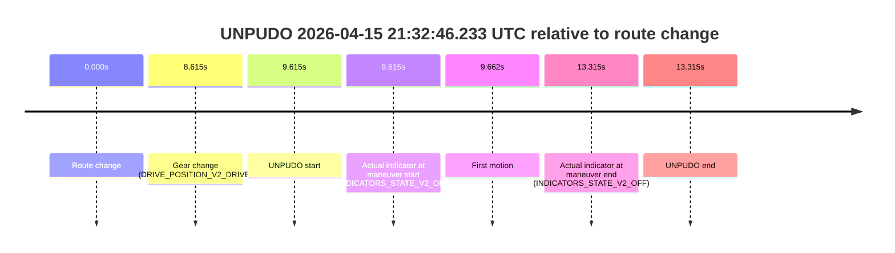
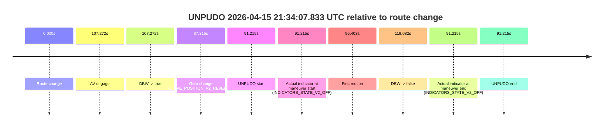
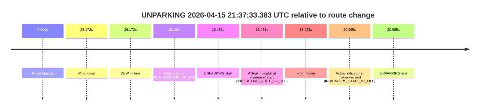

# Run Report: fme10011/2026-04-15--21-10-15--gen2-av-901617c3-1e17-4ca1-bd97-f87ceeff4e4b

| Field | Value |
|---|---|
| Run ID | `fme10011/2026-04-15--21-10-15--gen2-av-901617c3-1e17-4ca1-bd97-f87ceeff4e4b` |
| Date | `2026-04-15` |
| Model(s) | `satisfied-amber-moose` |
| Author | `guy.geva` |
| Event count | `5` |

## unpudo 2026-04-15 21:26:41.133 UTC

| Field | Value |
|---|---|
| Model | `satisfied-amber-moose` |
| Author | `guy.geva` |
| Run ID | `fme10011/2026-04-15--21-10-15--gen2-av-901617c3-1e17-4ca1-bd97-f87ceeff4e4b` |
| Date | `2026-04-15` |
| Time (UTC) | `21:26:41.133` |
| Event type | `unpudo` |
| Disengagement type | `none observed` |
| Route change | `found` |
| Console | [run](https://console.sso.wayve.ai/run/fme10011/2026-04-15--21-10-15--gen2-av-901617c3-1e17-4ca1-bd97-f87ceeff4e4b?id=&time-unixus=1776288401133298) |
| Foxglove | [segment](https://app.foxglove.dev/wayve-on-prem/p/prj_0dX18KZdVHg1fmmI/view?ds=foxglove-stream&ds.deviceName=fme10011&ds.start=2026-04-15T21%3A26%3A02.618291Z&ds.end=2026-04-15T21%3A28%3A51.270758Z&layoutId=lay_0e7VD4WIKDQGU73Y&time=2026-04-15T21%3A26%3A41.133298Z) |

### Event card: fail

- Fail: the credited unpudo does not stay AV-owned. The event window starts with DBW false, and the maneuver outcome lands outside a clean AV-owned segment.

| Event | Time (UTC) | Delta from route change |
|---|---:|---:|
| Route change | 2026-04-15 21:26:12.618 | `0.000s` |
| AV engage | 2026-04-15 21:26:52.730 | `40.112s` |
| DBW -> true | 2026-04-15 21:26:52.730 | `40.112s` |
| Gear change (DRIVE_POSITION_V2_DRIVE) | 2026-04-15 21:26:38.983 | `26.365s` |
| UNPUDO start | 2026-04-15 21:26:41.133 | `28.515s` |
| Actual indicator at maneuver start (INDICATORS_STATE_V2_OFF) | 2026-04-15 21:26:41.133 | `28.515s` |
| First motion | 2026-04-15 21:26:41.180 | `28.562s` |
| DBW -> false | 2026-04-15 21:28:41.270 | `148.652s` |
| Actual indicator at maneuver end (INDICATORS_STATE_V2_OFF) | 2026-04-15 21:26:48.183 | `35.565s` |
| UNPUDO end | 2026-04-15 21:26:48.183 | `35.565s` |

| Metric | Value |
|---|---|
| Outcome | `fail` |
| Effective failure type | `completed_outside_av` |
| Route change status | `found` |
| DBW at event start | `false` |
| DBW at event end | `false` |
| Predicted gear at AV start | `DRIVE_POSITION_V2_DRIVE` |
| Actual gear at AV start | `DRIVE_POSITION_V2_DRIVE` |
| Predicted gear at event start | `DRIVE_POSITION_V2_DRIVE` |
| Actual gear at event start | `DRIVE_POSITION_V2_DRIVE` |
| Planned indicator direction | `INDICATORS_STATE_V2_OFF` |
| Controller indicator direction | `INDICATORS_STATE_V2_OFF` |
| Actual indicator direction | `INDICATORS_STATE_V2_OFF` |
| Actual indicator at maneuver end | `INDICATORS_STATE_V2_OFF` |
| Driver accel help in AV | `false` |
| Driver accel help timestamp | `n/a` |
| Max accel pedal pct in AV | `0.0%` |
| Max brake pedal pct in AV | `0.0%` |
| Max speed mps in AV | `0.000` |
| Route -> AV | `40.112s` |
| AV -> event start | `-11.597s` |
| AV -> first motion | `-11.550s` |
| AV duration before disengagement | `108.540s` |
| Trajectory waypoint count | `36` |
| Driving-plan step count | `11` |

The scored portion starts from the AV-owned window, not from the pre-AV setup. Route-change search in the stopped pre-event segment was `found`, with the baseline therefore set to route change. At the event anchor the model predicts `DRIVE_POSITION_V2_DRIVE` and the actual gear is `DRIVE_POSITION_V2_DRIVE`. The effective model outcome is `fail` because `completed_outside_av`.

### Resolution

| Field | Value |
|---|---|
| Final outcome | `fail` |
| Do we agree with this label? | `yes` |
| Source disengagement type | `none observed` |
| Resolved effective failure type | `completed_outside_av` |
| Confidence | `high` |

## unpudo 2026-04-15 21:28:46.383 UTC

| Field | Value |
|---|---|
| Model | `satisfied-amber-moose` |
| Author | `guy.geva` |
| Run ID | `fme10011/2026-04-15--21-10-15--gen2-av-901617c3-1e17-4ca1-bd97-f87ceeff4e4b` |
| Date | `2026-04-15` |
| Time (UTC) | `21:28:46.383` |
| Event type | `unpudo` |
| Disengagement type | `failed_to_unpudo` |
| Route change | `found` |
| Console | [run](https://console.sso.wayve.ai/run/fme10011/2026-04-15--21-10-15--gen2-av-901617c3-1e17-4ca1-bd97-f87ceeff4e4b?id=&time-unixus=1776288526383313) |
| Foxglove | [segment](https://app.foxglove.dev/wayve-on-prem/p/prj_0dX18KZdVHg1fmmI/view?ds=foxglove-stream&ds.deviceName=fme10011&ds.start=2026-04-15T21%3A28%3A24.218258Z&ds.end=2026-04-15T21%3A30%3A26.190547Z&layoutId=lay_0e7VD4WIKDQGU73Y&time=2026-04-15T21%3A28%3A46.383313Z) |

### Event card: fail

- Fail: AV owns part of the segment, but the event still resolves as a model-performance failure under the AV-only scoring rule.

| Event | Time (UTC) | Delta from route change |
|---|---:|---:|
| Route change | 2026-04-15 21:28:34.218 | `0.000s` |
| AV engage | 2026-04-15 21:28:56.770 | `22.553s` |
| DBW -> true | 2026-04-15 21:28:56.770 | `22.553s` |
| Gear change (DRIVE_POSITION_V2_REVERSE) | 2026-04-15 21:28:34.533 | `0.315s` |
| UNPUDO start | 2026-04-15 21:28:46.383 | `12.165s` |
| Actual indicator at maneuver start (INDICATORS_STATE_V2_OFF) | 2026-04-15 21:28:46.383 | `12.165s` |
| First motion | 2026-04-15 21:28:51.160 | `16.942s` |
| DBW -> false | 2026-04-15 21:30:16.190 | `101.972s` |
| Actual indicator at maneuver end (INDICATORS_STATE_V2_OFF) | 2026-04-15 21:28:56.733 | `22.515s` |
| UNPUDO end | 2026-04-15 21:28:56.733 | `22.515s` |

| Metric | Value |
|---|---|
| Outcome | `fail` |
| Effective failure type | `failed_to_unpudo` |
| Route change status | `found` |
| DBW at event start | `false` |
| DBW at event end | `false` |
| Predicted gear at AV start | `DRIVE_POSITION_V2_DRIVE` |
| Actual gear at AV start | `DRIVE_POSITION_V2_DRIVE` |
| Predicted gear at event start | `DRIVE_POSITION_V2_REVERSE` |
| Actual gear at event start | `DRIVE_POSITION_V2_REVERSE` |
| Planned indicator direction | `INDICATORS_STATE_V2_OFF` |
| Controller indicator direction | `INDICATORS_STATE_V2_OFF` |
| Actual indicator direction | `INDICATORS_STATE_V2_OFF` |
| Actual indicator at maneuver end | `INDICATORS_STATE_V2_OFF` |
| Driver accel help in AV | `false` |
| Driver accel help timestamp | `n/a` |
| Max accel pedal pct in AV | `0.0%` |
| Max brake pedal pct in AV | `0.0%` |
| Max speed mps in AV | `0.000` |
| Route -> AV | `22.553s` |
| AV -> event start | `-10.388s` |
| AV -> first motion | `-5.611s` |
| AV duration before disengagement | `79.420s` |
| Trajectory waypoint count | `37` |
| Driving-plan step count | `11` |

The scored portion starts from the AV-owned window, not from the pre-AV setup. Route-change search in the stopped pre-event segment was `found`, with the baseline therefore set to route change. At the event anchor the model predicts `DRIVE_POSITION_V2_REVERSE` and the actual gear is `DRIVE_POSITION_V2_REVERSE`. The effective model outcome is `fail` because `failed_to_unpudo`.

### Resolution

| Field | Value |
|---|---|
| Final outcome | `fail` |
| Do we agree with this label? | `yes` |
| Source disengagement type | `failed_to_unpudo` |
| Resolved effective failure type | `failed_to_unpudo` |
| Confidence | `high` |

## unpudo 2026-04-15 21:32:46.233 UTC

| Field | Value |
|---|---|
| Model | `satisfied-amber-moose` |
| Author | `guy.geva` |
| Run ID | `fme10011/2026-04-15--21-10-15--gen2-av-901617c3-1e17-4ca1-bd97-f87ceeff4e4b` |
| Date | `2026-04-15` |
| Time (UTC) | `21:32:46.233` |
| Event type | `unpudo` |
| Disengagement type | `failed_to_unpudo` |
| Route change | `found` |
| Console | [run](https://console.sso.wayve.ai/run/fme10011/2026-04-15--21-10-15--gen2-av-901617c3-1e17-4ca1-bd97-f87ceeff4e4b?id=&time-unixus=1776288766233308) |
| Foxglove | [segment](https://app.foxglove.dev/wayve-on-prem/p/prj_0dX18KZdVHg1fmmI/view?ds=foxglove-stream&ds.deviceName=fme10011&ds.start=2026-04-15T21%3A32%3A26.618335Z&ds.end=2026-04-15T21%3A32%3A59.933304Z&layoutId=lay_0e7VD4WIKDQGU73Y&time=2026-04-15T21%3A32%3A46.233308Z) |

### Event card: fail

- Fail: AV owns part of the segment, but the event still resolves as a model-performance failure under the AV-only scoring rule.

| Event | Time (UTC) | Delta from route change |
|---|---:|---:|
| Route change | 2026-04-15 21:32:36.618 | `0.000s` |
| Gear change (DRIVE_POSITION_V2_DRIVE) | 2026-04-15 21:32:45.233 | `8.615s` |
| UNPUDO start | 2026-04-15 21:32:46.233 | `9.615s` |
| Actual indicator at maneuver start (INDICATORS_STATE_V2_OFF) | 2026-04-15 21:32:46.233 | `9.615s` |
| First motion | 2026-04-15 21:32:46.280 | `9.662s` |
| Actual indicator at maneuver end (INDICATORS_STATE_V2_OFF) | 2026-04-15 21:32:49.933 | `13.315s` |
| UNPUDO end | 2026-04-15 21:32:49.933 | `13.315s` |

| Metric | Value |
|---|---|
| Outcome | `fail` |
| Effective failure type | `failed_to_unpudo` |
| Route change status | `found` |
| DBW at event start | `false` |
| DBW at event end | `false` |
| Predicted gear at AV start | `n/a` |
| Actual gear at AV start | `n/a` |
| Predicted gear at event start | `DRIVE_POSITION_V2_DRIVE` |
| Actual gear at event start | `DRIVE_POSITION_V2_DRIVE` |
| Planned indicator direction | `INDICATORS_STATE_V2_OFF` |
| Controller indicator direction | `INDICATORS_STATE_V2_OFF` |
| Actual indicator direction | `INDICATORS_STATE_V2_OFF` |
| Actual indicator at maneuver end | `INDICATORS_STATE_V2_OFF` |
| Driver accel help in AV | `false` |
| Driver accel help timestamp | `n/a` |
| Max accel pedal pct in AV | `0.0%` |
| Max brake pedal pct in AV | `0.0%` |
| Max speed mps in AV | `0.000` |
| Route -> AV | `n/a` |
| AV -> event start | `n/a` |
| AV -> first motion | `n/a` |
| AV duration before disengagement | `n/a` |
| Trajectory waypoint count | `36` |
| Driving-plan step count | `11` |

The scored portion starts from the AV-owned window, not from the pre-AV setup. Route-change search in the stopped pre-event segment was `found`, with the baseline therefore set to route change. At the event anchor the model predicts `DRIVE_POSITION_V2_DRIVE` and the actual gear is `DRIVE_POSITION_V2_DRIVE`. The effective model outcome is `fail` because `failed_to_unpudo`.

### Resolution

| Field | Value |
|---|---|
| Final outcome | `fail` |
| Do we agree with this label? | `yes` |
| Source disengagement type | `failed_to_unpudo` |
| Resolved effective failure type | `failed_to_unpudo` |
| Confidence | `high` |

## unpudo 2026-04-15 21:34:07.833 UTC

| Field | Value |
|---|---|
| Model | `satisfied-amber-moose` |
| Author | `guy.geva` |
| Run ID | `fme10011/2026-04-15--21-10-15--gen2-av-901617c3-1e17-4ca1-bd97-f87ceeff4e4b` |
| Date | `2026-04-15` |
| Time (UTC) | `21:34:07.833` |
| Event type | `unpudo` |
| Disengagement type | `failed_to_pudo` |
| Route change | `found` |
| Console | [run](https://console.sso.wayve.ai/run/fme10011/2026-04-15--21-10-15--gen2-av-901617c3-1e17-4ca1-bd97-f87ceeff4e4b?id=&time-unixus=1776288847833300) |
| Foxglove | [segment](https://app.foxglove.dev/wayve-on-prem/p/prj_0dX18KZdVHg1fmmI/view?ds=foxglove-stream&ds.deviceName=fme10011&ds.start=2026-04-15T21%3A32%3A26.618335Z&ds.end=2026-04-15T21%3A34%3A45.650751Z&layoutId=lay_0e7VD4WIKDQGU73Y&time=2026-04-15T21%3A34%3A07.833300Z) |

### Event card: fail

- Fail: AV owns part of the segment, but the event still resolves as a model-performance failure under the AV-only scoring rule.

| Event | Time (UTC) | Delta from route change |
|---|---:|---:|
| Route change | 2026-04-15 21:32:36.618 | `0.000s` |
| AV engage | 2026-04-15 21:34:23.890 | `107.272s` |
| DBW -> true | 2026-04-15 21:34:23.890 | `107.272s` |
| Gear change (DRIVE_POSITION_V2_REVERSE) | 2026-04-15 21:34:03.933 | `87.315s` |
| UNPUDO start | 2026-04-15 21:34:07.833 | `91.215s` |
| Actual indicator at maneuver start (INDICATORS_STATE_V2_OFF) | 2026-04-15 21:34:07.833 | `91.215s` |
| First motion | 2026-04-15 21:34:12.021 | `95.403s` |
| DBW -> false | 2026-04-15 21:34:35.650 | `119.032s` |
| Actual indicator at maneuver end (INDICATORS_STATE_V2_OFF) | 2026-04-15 21:34:07.833 | `91.215s` |
| UNPUDO end | 2026-04-15 21:34:07.833 | `91.215s` |

| Metric | Value |
|---|---|
| Outcome | `fail` |
| Effective failure type | `failed_to_pudo` |
| Route change status | `found` |
| DBW at event start | `false` |
| DBW at event end | `false` |
| Predicted gear at AV start | `DRIVE_POSITION_V2_PARK` |
| Actual gear at AV start | `DRIVE_POSITION_V2_PARK` |
| Predicted gear at event start | `DRIVE_POSITION_V2_REVERSE` |
| Actual gear at event start | `DRIVE_POSITION_V2_REVERSE` |
| Planned indicator direction | `INDICATORS_STATE_V2_OFF` |
| Controller indicator direction | `INDICATORS_STATE_V2_OFF` |
| Actual indicator direction | `INDICATORS_STATE_V2_OFF` |
| Actual indicator at maneuver end | `INDICATORS_STATE_V2_OFF` |
| Driver accel help in AV | `false` |
| Driver accel help timestamp | `n/a` |
| Max accel pedal pct in AV | `0.0%` |
| Max brake pedal pct in AV | `0.0%` |
| Max speed mps in AV | `0.000` |
| Route -> AV | `107.272s` |
| AV -> event start | `-16.057s` |
| AV -> first motion | `-11.870s` |
| AV duration before disengagement | `11.760s` |
| Trajectory waypoint count | `36` |
| Driving-plan step count | `11` |

The scored portion starts from the AV-owned window, not from the pre-AV setup. Route-change search in the stopped pre-event segment was `found`, with the baseline therefore set to route change. At the event anchor the model predicts `DRIVE_POSITION_V2_REVERSE` and the actual gear is `DRIVE_POSITION_V2_REVERSE`. The effective model outcome is `fail` because `failed_to_pudo`.

### Resolution

| Field | Value |
|---|---|
| Final outcome | `fail` |
| Do we agree with this label? | `yes` |
| Source disengagement type | `failed_to_pudo` |
| Resolved effective failure type | `failed_to_pudo` |
| Confidence | `high` |

## unparking 2026-04-15 21:37:33.383 UTC

| Field | Value |
|---|---|
| Model | `satisfied-amber-moose` |
| Author | `guy.geva` |
| Run ID | `fme10011/2026-04-15--21-10-15--gen2-av-901617c3-1e17-4ca1-bd97-f87ceeff4e4b` |
| Date | `2026-04-15` |
| Time (UTC) | `21:37:33.383` |
| Event type | `unparking` |
| Disengagement type | `none observed` |
| Route change | `found` |
| Console | [run](https://console.sso.wayve.ai/run/fme10011/2026-04-15--21-10-15--gen2-av-901617c3-1e17-4ca1-bd97-f87ceeff4e4b?id=&time-unixus=1776289053383307) |
| Foxglove | [segment](https://app.foxglove.dev/wayve-on-prem/p/prj_0dX18KZdVHg1fmmI/view?ds=foxglove-stream&ds.deviceName=fme10011&ds.start=2026-04-15T21%3A37%3A06.918279Z&ds.end=2026-04-15T21%3A37%3A47.883321Z&layoutId=lay_0e7VD4WIKDQGU73Y&time=2026-04-15T21%3A37%3A33.383307Z) |

### Event card: fail

- Fail: the credited unparking does not stay AV-owned. The event window starts with DBW false, and the maneuver outcome lands outside a clean AV-owned segment.

| Event | Time (UTC) | Delta from route change |
|---|---:|---:|
| Route change | 2026-04-15 21:37:16.918 | `0.000s` |
| AV engage | 2026-04-15 21:37:43.090 | `26.172s` |
| DBW -> true | 2026-04-15 21:37:43.090 | `26.172s` |
| Gear change (DRIVE_POSITION_V2_DRIVE) | 2026-04-15 21:37:32.083 | `15.165s` |
| UNPARKING start | 2026-04-15 21:37:33.383 | `16.465s` |
| Actual indicator at maneuver start (INDICATORS_STATE_V2_OFF) | 2026-04-15 21:37:33.383 | `16.465s` |
| First motion | 2026-04-15 21:37:33.400 | `16.483s` |
| Actual indicator at maneuver end (INDICATORS_STATE_V2_OFF) | 2026-04-15 21:37:37.883 | `20.965s` |
| UNPARKING end | 2026-04-15 21:37:37.883 | `20.965s` |

| Metric | Value |
|---|---|
| Outcome | `fail` |
| Effective failure type | `completed_outside_av` |
| Route change status | `found` |
| DBW at event start | `false` |
| DBW at event end | `false` |
| Predicted gear at AV start | `DRIVE_POSITION_V2_DRIVE` |
| Actual gear at AV start | `DRIVE_POSITION_V2_DRIVE` |
| Predicted gear at event start | `DRIVE_POSITION_V2_DRIVE` |
| Actual gear at event start | `DRIVE_POSITION_V2_DRIVE` |
| Planned indicator direction | `INDICATORS_STATE_V2_OFF` |
| Controller indicator direction | `INDICATORS_STATE_V2_OFF` |
| Actual indicator direction | `INDICATORS_STATE_V2_OFF` |
| Actual indicator at maneuver end | `INDICATORS_STATE_V2_OFF` |
| Driver accel help in AV | `false` |
| Driver accel help timestamp | `n/a` |
| Max accel pedal pct in AV | `0.0%` |
| Max brake pedal pct in AV | `0.0%` |
| Max speed mps in AV | `0.000` |
| Route -> AV | `26.172s` |
| AV -> event start | `-9.707s` |
| AV -> first motion | `-9.690s` |
| AV duration before disengagement | `n/a` |
| Trajectory waypoint count | `37` |
| Driving-plan step count | `11` |

The scored portion starts from the AV-owned window, not from the pre-AV setup. Route-change search in the stopped pre-event segment was `found`, with the baseline therefore set to route change. At the event anchor the model predicts `DRIVE_POSITION_V2_DRIVE` and the actual gear is `DRIVE_POSITION_V2_DRIVE`. The effective model outcome is `fail` because `completed_outside_av`.

### Resolution

| Field | Value |
|---|---|
| Final outcome | `fail` |
| Do we agree with this label? | `yes` |
| Source disengagement type | `none observed` |
| Resolved effective failure type | `completed_outside_av` |
| Confidence | `high` |
