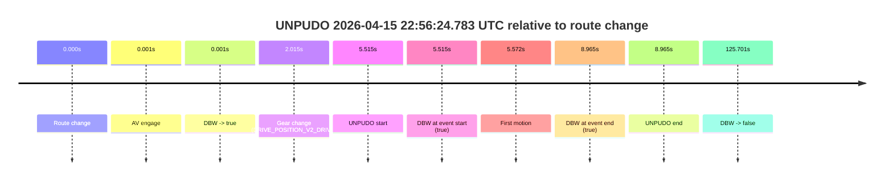
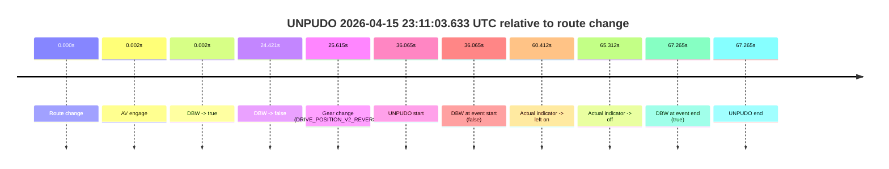
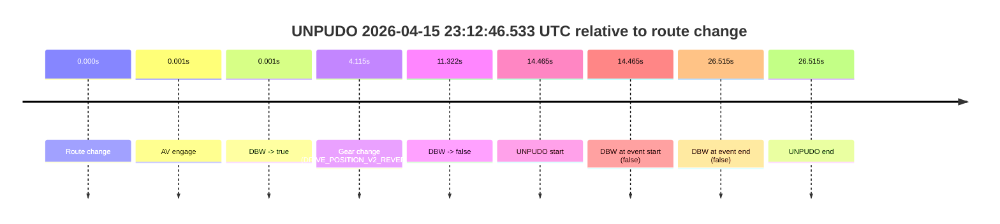
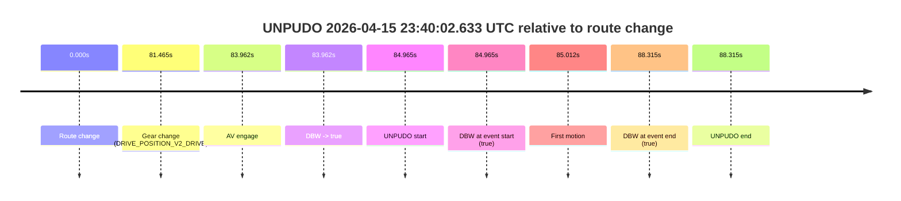

# Run Report: fme10011/2026-04-15--22-24-04--gen2-av-6ee369a1-c300-4a59-841e-63afd7898e63

| Field | Value |
|---|---|
| Run ID | `fme10011/2026-04-15--22-24-04--gen2-av-6ee369a1-c300-4a59-841e-63afd7898e63` |
| Date | `2026-04-15` |
| Model(s) | `eel-teal-outspoken` |
| Author | `zak` |
| Event count | `5` |

## unpudo 2026-04-15 22:56:24.783 UTC

| Field | Value |
|---|---|
| Model | `eel-teal-outspoken` |
| Author | `zak` |
| Run ID | `fme10011/2026-04-15--22-24-04--gen2-av-6ee369a1-c300-4a59-841e-63afd7898e63` |
| Date | `2026-04-15` |
| Time (UTC) | `22:56:24.783` |
| Event type | `unpudo` |
| Disengagement type | `none observed` |
| Route change | `found` |
| Console | [run](https://console.sso.wayve.ai/run/fme10011/2026-04-15--22-24-04--gen2-av-6ee369a1-c300-4a59-841e-63afd7898e63?id=&time-unixus=1776293784783303) |
| Foxglove | [segment](https://app.foxglove.dev/wayve-on-prem/p/prj_0dX18KZdVHg1fmmI/view?ds=foxglove-stream&ds.deviceName=fme10011&ds.start=2026-04-15T22%3A56%3A09.268267Z&ds.end=2026-04-15T22%3A58%3A34.969512Z&layoutId=lay_0e7VD4WIKDQGU73Y&time=2026-04-15T22%3A56%3A24.783303Z) |

### Event card: pass

- Pass: AV owns the credited unpudo from route change through the official unpudo window, the gear state is aligned at the anchor, and the vehicle moves without driver accelerator help in AV.

| Event | Time (UTC) | Delta from route change |
|---|---:|---:|
| Route change | 2026-04-15 22:56:19.268 | `0.000s` |
| AV engage | 2026-04-15 22:56:19.269 | `0.001s` |
| DBW -> true | 2026-04-15 22:56:19.269 | `0.001s` |
| Gear change (DRIVE_POSITION_V2_DRIVE) | 2026-04-15 22:56:21.283 | `2.015s` |
| UNPUDO start | 2026-04-15 22:56:24.783 | `5.515s` |
| DBW at event start (true) | 2026-04-15 22:56:24.783 | `5.515s` |
| First motion | 2026-04-15 22:56:24.840 | `5.572s` |
| DBW at event end (true) | 2026-04-15 22:56:28.233 | `8.965s` |
| UNPUDO end | 2026-04-15 22:56:28.233 | `8.965s` |
| DBW -> false | 2026-04-15 22:58:24.969 | `125.701s` |

| Metric | Value |
|---|---|
| Outcome | `pass` |
| Effective failure type | `none` |
| Route change status | `found` |
| DBW at event start | `true` |
| DBW at event end | `true` |
| Predicted gear at AV start | `DRIVE_POSITION_V2_PARK` |
| Actual gear at AV start | `DRIVE_POSITION_V2_PARK` |
| Predicted gear at event start | `DRIVE_POSITION_V2_DRIVE` |
| Actual gear at event start | `DRIVE_POSITION_V2_DRIVE` |
| Planned indicator direction | `INDICATORS_STATE_V2_LEFT_ON` |
| Controller indicator direction | `INDICATORS_STATE_V2_LEFT_ON` |
| Actual indicator direction | `INDICATORS_STATE_V2_OFF` |
| Actual indicator at maneuver end | `INDICATORS_STATE_V2_OFF` |
| Driver accel help in AV | `false` |
| Driver accel help timestamp | `n/a` |
| Max accel pedal pct in AV | `0.0%` |
| Max brake pedal pct in AV | `8.0%` |
| Max speed mps in AV | `5.381` |
| Success timing baseline | `route change` |
| Route -> AV | `0.001s` |
| AV -> event start | `5.514s` |
| AV -> first motion | `5.571s` |
| Success baseline -> event start | `5.515s` |
| Success baseline -> first motion | `5.572s` |
| AV duration before disengagement | `125.700s` |
| Trajectory waypoint count | `37` |
| Driving-plan step count | `11` |

The scored portion starts from the AV-owned window, not from the pre-AV setup. Route-change search in the stopped pre-event segment was `found`, with the baseline therefore set to route change. At the event anchor the model predicts `DRIVE_POSITION_V2_DRIVE` and the actual gear is `DRIVE_POSITION_V2_DRIVE`. The effective model outcome is `pass` because `the credited unpudo stays AV-owned through the official unpudo window.`

### Resolution

| Field | Value |
|---|---|
| Final outcome | `pass` |
| Do we agree with this label? | `yes` |
| Source disengagement type | `none observed` |
| Resolved effective failure type | `none` |
| Confidence | `high` |

## unpudo 2026-04-15 23:11:03.633 UTC

| Field | Value |
|---|---|
| Model | `eel-teal-outspoken` |
| Author | `zak` |
| Run ID | `fme10011/2026-04-15--22-24-04--gen2-av-6ee369a1-c300-4a59-841e-63afd7898e63` |
| Date | `2026-04-15` |
| Time (UTC) | `23:11:03.633` |
| Event type | `unpudo` |
| Disengagement type | `failed_to_unpudo` |
| Route change | `found` |
| Console | [run](https://console.sso.wayve.ai/run/fme10011/2026-04-15--22-24-04--gen2-av-6ee369a1-c300-4a59-841e-63afd7898e63?id=&time-unixus=1776294663633316) |
| Foxglove | [segment](https://app.foxglove.dev/wayve-on-prem/p/prj_0dX18KZdVHg1fmmI/view?ds=foxglove-stream&ds.deviceName=fme10011&ds.start=2026-04-15T23%3A10%3A17.568249Z&ds.end=2026-04-15T23%3A11%3A44.833319Z&layoutId=lay_0e7VD4WIKDQGU73Y&time=2026-04-15T23%3A11%3A03.633316Z) |

### Event card: fail

- Fail: AV owns part of the segment, but the event still resolves as a model-performance failure under the AV-only scoring rule.

| Event | Time (UTC) | Delta from route change |
|---|---:|---:|
| Route change | 2026-04-15 23:10:27.568 | `0.000s` |
| AV engage | 2026-04-15 23:10:27.569 | `0.002s` |
| DBW -> true | 2026-04-15 23:10:27.569 | `0.002s` |
| DBW -> false | 2026-04-15 23:10:51.989 | `24.421s` |
| Gear change (DRIVE_POSITION_V2_REVERSE) | 2026-04-15 23:10:53.183 | `25.615s` |
| UNPUDO start | 2026-04-15 23:11:03.633 | `36.065s` |
| DBW at event start (false) | 2026-04-15 23:11:03.633 | `36.065s` |
| Actual indicator -> left on | 2026-04-15 23:11:27.980 | `60.412s` |
| Actual indicator -> off | 2026-04-15 23:11:32.880 | `65.312s` |
| DBW at event end (true) | 2026-04-15 23:11:34.833 | `67.265s` |
| UNPUDO end | 2026-04-15 23:11:34.833 | `67.265s` |

| Metric | Value |
|---|---|
| Outcome | `fail` |
| Effective failure type | `failed_to_unpudo` |
| Route change status | `found` |
| DBW at event start | `false` |
| DBW at event end | `true` |
| Predicted gear at AV start | `DRIVE_POSITION_V2_PARK` |
| Actual gear at AV start | `DRIVE_POSITION_V2_PARK` |
| Predicted gear at event start | `DRIVE_POSITION_V2_REVERSE` |
| Actual gear at event start | `DRIVE_POSITION_V2_REVERSE` |
| Planned indicator direction | `INDICATORS_STATE_V2_OFF` |
| Controller indicator direction | `INDICATORS_STATE_V2_OFF` |
| Actual indicator direction | `INDICATORS_STATE_V2_OFF` |
| Actual indicator at maneuver end | `INDICATORS_STATE_V2_OFF` |
| Driver accel help in AV | `false` |
| Driver accel help timestamp | `n/a` |
| Max accel pedal pct in AV | `0.0%` |
| Max brake pedal pct in AV | `8.3%` |
| Max speed mps in AV | `0.000` |
| Success timing baseline | `route change` |
| Route -> AV | `0.002s` |
| AV -> event start | `36.064s` |
| AV -> first motion | `n/a` |
| Success baseline -> event start | `36.065s` |
| Success baseline -> first motion | `n/a` |
| AV duration before disengagement | `24.420s` |
| Trajectory waypoint count | `38` |
| Driving-plan step count | `11` |

The scored portion starts from the AV-owned window, not from the pre-AV setup. Route-change search in the stopped pre-event segment was `found`, with the baseline therefore set to route change. At the event anchor the model predicts `DRIVE_POSITION_V2_REVERSE` and the actual gear is `DRIVE_POSITION_V2_REVERSE`. The effective model outcome is `fail` because `failed_to_unpudo.`

### Resolution

| Field | Value |
|---|---|
| Final outcome | `fail` |
| Do we agree with this label? | `yes` |
| Source disengagement type | `failed_to_unpudo` |
| Resolved effective failure type | `failed_to_unpudo` |
| Confidence | `high` |

## unpudo 2026-04-15 23:12:46.533 UTC

| Field | Value |
|---|---|
| Model | `eel-teal-outspoken` |
| Author | `zak` |
| Run ID | `fme10011/2026-04-15--22-24-04--gen2-av-6ee369a1-c300-4a59-841e-63afd7898e63` |
| Date | `2026-04-15` |
| Time (UTC) | `23:12:46.533` |
| Event type | `unpudo` |
| Disengagement type | `failed_to_unpudo` |
| Route change | `found` |
| Console | [run](https://console.sso.wayve.ai/run/fme10011/2026-04-15--22-24-04--gen2-av-6ee369a1-c300-4a59-841e-63afd7898e63?id=&time-unixus=1776294766533301) |
| Foxglove | [segment](https://app.foxglove.dev/wayve-on-prem/p/prj_0dX18KZdVHg1fmmI/view?ds=foxglove-stream&ds.deviceName=fme10011&ds.start=2026-04-15T23%3A12%3A22.068608Z&ds.end=2026-04-15T23%3A13%3A08.583318Z&layoutId=lay_0e7VD4WIKDQGU73Y&time=2026-04-15T23%3A12%3A46.533301Z) |

### Event card: fail

- Fail: AV owns part of the segment, but the event still resolves as a model-performance failure under the AV-only scoring rule.

| Event | Time (UTC) | Delta from route change |
|---|---:|---:|
| Route change | 2026-04-15 23:12:32.068 | `0.000s` |
| AV engage | 2026-04-15 23:12:32.069 | `0.001s` |
| DBW -> true | 2026-04-15 23:12:32.069 | `0.001s` |
| Gear change (DRIVE_POSITION_V2_REVERSE) | 2026-04-15 23:12:36.183 | `4.115s` |
| DBW -> false | 2026-04-15 23:12:43.390 | `11.322s` |
| UNPUDO start | 2026-04-15 23:12:46.533 | `14.465s` |
| DBW at event start (false) | 2026-04-15 23:12:46.533 | `14.465s` |
| DBW at event end (false) | 2026-04-15 23:12:58.583 | `26.515s` |
| UNPUDO end | 2026-04-15 23:12:58.583 | `26.515s` |

| Metric | Value |
|---|---|
| Outcome | `fail` |
| Effective failure type | `failed_to_unpudo` |
| Route change status | `found` |
| DBW at event start | `false` |
| DBW at event end | `false` |
| Predicted gear at AV start | `DRIVE_POSITION_V2_PARK` |
| Actual gear at AV start | `DRIVE_POSITION_V2_PARK` |
| Predicted gear at event start | `DRIVE_POSITION_V2_REVERSE` |
| Actual gear at event start | `DRIVE_POSITION_V2_REVERSE` |
| Planned indicator direction | `INDICATORS_STATE_V2_OFF` |
| Controller indicator direction | `INDICATORS_STATE_V2_OFF` |
| Actual indicator direction | `INDICATORS_STATE_V2_OFF` |
| Actual indicator at maneuver end | `INDICATORS_STATE_V2_OFF` |
| Driver accel help in AV | `false` |
| Driver accel help timestamp | `n/a` |
| Max accel pedal pct in AV | `0.0%` |
| Max brake pedal pct in AV | `8.0%` |
| Max speed mps in AV | `0.000` |
| Success timing baseline | `route change` |
| Route -> AV | `0.001s` |
| AV -> event start | `14.464s` |
| AV -> first motion | `n/a` |
| Success baseline -> event start | `14.465s` |
| Success baseline -> first motion | `n/a` |
| AV duration before disengagement | `11.320s` |
| Trajectory waypoint count | `38` |
| Driving-plan step count | `11` |

The scored portion starts from the AV-owned window, not from the pre-AV setup. Route-change search in the stopped pre-event segment was `found`, with the baseline therefore set to route change. At the event anchor the model predicts `DRIVE_POSITION_V2_REVERSE` and the actual gear is `DRIVE_POSITION_V2_REVERSE`. The effective model outcome is `fail` because `failed_to_unpudo.`

### Resolution

| Field | Value |
|---|---|
| Final outcome | `fail` |
| Do we agree with this label? | `yes` |
| Source disengagement type | `failed_to_unpudo` |
| Resolved effective failure type | `failed_to_unpudo` |
| Confidence | `high` |

## unpudo 2026-04-15 23:30:31.483 UTC

| Field | Value |
|---|---|
| Model | `eel-teal-outspoken` |
| Author | `zak` |
| Run ID | `fme10011/2026-04-15--22-24-04--gen2-av-6ee369a1-c300-4a59-841e-63afd7898e63` |
| Date | `2026-04-15` |
| Time (UTC) | `23:30:31.483` |
| Event type | `unpudo` |
| Disengagement type | `none observed` |
| Route change | `found` |
| Console | [run](https://console.sso.wayve.ai/run/fme10011/2026-04-15--22-24-04--gen2-av-6ee369a1-c300-4a59-841e-63afd7898e63?id=&time-unixus=1776295831483311) |
| Foxglove | [segment](https://app.foxglove.dev/wayve-on-prem/p/prj_0dX18KZdVHg1fmmI/view?ds=foxglove-stream&ds.deviceName=fme10011&ds.start=2026-04-15T23%3A30%3A16.118248Z&ds.end=2026-04-15T23%3A31%3A13.649529Z&layoutId=lay_0e7VD4WIKDQGU73Y&time=2026-04-15T23%3A30%3A31.483311Z) |

### Event card: pass

- Pass: AV owns the credited unpudo from route change through the official unpudo window, the gear state is aligned at the anchor, and the vehicle moves without driver accelerator help in AV.

| Event | Time (UTC) | Delta from route change |
|---|---:|---:|
| Route change | 2026-04-15 23:30:26.118 | `0.000s` |
| AV engage | 2026-04-15 23:30:26.119 | `0.001s` |
| DBW -> true | 2026-04-15 23:30:26.119 | `0.001s` |
| Gear change (DRIVE_POSITION_V2_DRIVE) | 2026-04-15 23:30:27.983 | `1.865s` |
| UNPUDO start | 2026-04-15 23:30:31.483 | `5.365s` |
| DBW at event start (true) | 2026-04-15 23:30:31.483 | `5.365s` |
| First motion | 2026-04-15 23:30:31.520 | `5.403s` |
| DBW at event end (true) | 2026-04-15 23:30:35.033 | `8.915s` |
| UNPUDO end | 2026-04-15 23:30:35.033 | `8.915s` |
| DBW -> false | 2026-04-15 23:31:03.649 | `37.531s` |

| Metric | Value |
|---|---|
| Outcome | `pass` |
| Effective failure type | `none` |
| Route change status | `found` |
| DBW at event start | `true` |
| DBW at event end | `true` |
| Predicted gear at AV start | `DRIVE_POSITION_V2_PARK` |
| Actual gear at AV start | `DRIVE_POSITION_V2_PARK` |
| Predicted gear at event start | `DRIVE_POSITION_V2_DRIVE` |
| Actual gear at event start | `DRIVE_POSITION_V2_DRIVE` |
| Planned indicator direction | `INDICATORS_STATE_V2_LEFT_ON` |
| Controller indicator direction | `INDICATORS_STATE_V2_LEFT_ON` |
| Actual indicator direction | `INDICATORS_STATE_V2_OFF` |
| Actual indicator at maneuver end | `INDICATORS_STATE_V2_OFF` |
| Driver accel help in AV | `false` |
| Driver accel help timestamp | `n/a` |
| Max accel pedal pct in AV | `0.0%` |
| Max brake pedal pct in AV | `8.0%` |
| Max speed mps in AV | `4.775` |
| Success timing baseline | `route change` |
| Route -> AV | `0.001s` |
| AV -> event start | `5.364s` |
| AV -> first motion | `5.401s` |
| Success baseline -> event start | `5.365s` |
| Success baseline -> first motion | `5.403s` |
| AV duration before disengagement | `37.530s` |
| Trajectory waypoint count | `37` |
| Driving-plan step count | `11` |

The scored portion starts from the AV-owned window, not from the pre-AV setup. Route-change search in the stopped pre-event segment was `found`, with the baseline therefore set to route change. At the event anchor the model predicts `DRIVE_POSITION_V2_DRIVE` and the actual gear is `DRIVE_POSITION_V2_DRIVE`. The effective model outcome is `pass` because `the credited unpudo stays AV-owned through the official unpudo window.`

### Resolution

| Field | Value |
|---|---|
| Final outcome | `pass` |
| Do we agree with this label? | `yes` |
| Source disengagement type | `none observed` |
| Resolved effective failure type | `none` |
| Confidence | `high` |

## unpudo 2026-04-15 23:40:02.633 UTC

| Field | Value |
|---|---|
| Model | `eel-teal-outspoken` |
| Author | `zak` |
| Run ID | `fme10011/2026-04-15--22-24-04--gen2-av-6ee369a1-c300-4a59-841e-63afd7898e63` |
| Date | `2026-04-15` |
| Time (UTC) | `23:40:02.633` |
| Event type | `unpudo` |
| Disengagement type | `none observed` |
| Route change | `found` |
| Console | [run](https://console.sso.wayve.ai/run/fme10011/2026-04-15--22-24-04--gen2-av-6ee369a1-c300-4a59-841e-63afd7898e63?id=&time-unixus=1776296402633295) |
| Foxglove | [segment](https://app.foxglove.dev/wayve-on-prem/p/prj_0dX18KZdVHg1fmmI/view?ds=foxglove-stream&ds.deviceName=fme10011&ds.start=2026-04-15T23%3A38%3A27.668243Z&ds.end=2026-04-15T23%3A40%3A15.983328Z&layoutId=lay_0e7VD4WIKDQGU73Y&time=2026-04-15T23%3A40%3A02.633295Z) |

### Event card: pass

- Pass: AV owns the credited unpudo from route change through the official unpudo window, the gear state is aligned at the anchor, and the vehicle moves without driver accelerator help in AV.

| Event | Time (UTC) | Delta from route change |
|---|---:|---:|
| Route change | 2026-04-15 23:38:37.668 | `0.000s` |
| Gear change (DRIVE_POSITION_V2_DRIVE) | 2026-04-15 23:39:59.133 | `81.465s` |
| AV engage | 2026-04-15 23:40:01.630 | `83.962s` |
| DBW -> true | 2026-04-15 23:40:01.630 | `83.962s` |
| UNPUDO start | 2026-04-15 23:40:02.633 | `84.965s` |
| DBW at event start (true) | 2026-04-15 23:40:02.633 | `84.965s` |
| First motion | 2026-04-15 23:40:02.680 | `85.012s` |
| DBW at event end (true) | 2026-04-15 23:40:05.983 | `88.315s` |
| UNPUDO end | 2026-04-15 23:40:05.983 | `88.315s` |

| Metric | Value |
|---|---|
| Outcome | `pass` |
| Effective failure type | `none` |
| Route change status | `found` |
| DBW at event start | `true` |
| DBW at event end | `true` |
| Predicted gear at AV start | `DRIVE_POSITION_V2_DRIVE` |
| Actual gear at AV start | `DRIVE_POSITION_V2_DRIVE` |
| Predicted gear at event start | `DRIVE_POSITION_V2_DRIVE` |
| Actual gear at event start | `DRIVE_POSITION_V2_DRIVE` |
| Planned indicator direction | `INDICATORS_STATE_V2_LEFT_ON` |
| Controller indicator direction | `INDICATORS_STATE_V2_LEFT_ON` |
| Actual indicator direction | `INDICATORS_STATE_V2_OFF` |
| Actual indicator at maneuver end | `INDICATORS_STATE_V2_OFF` |
| Driver accel help in AV | `false` |
| Driver accel help timestamp | `n/a` |
| Max accel pedal pct in AV | `0.0%` |
| Max brake pedal pct in AV | `8.0%` |
| Max speed mps in AV | `5.850` |
| Success timing baseline | `route change` |
| Route -> AV | `83.962s` |
| AV -> event start | `1.003s` |
| AV -> first motion | `1.050s` |
| Success baseline -> event start | `84.965s` |
| Success baseline -> first motion | `85.012s` |
| AV duration before disengagement | `n/a` |
| Trajectory waypoint count | `38` |
| Driving-plan step count | `11` |

The scored portion starts from the AV-owned window, not from the pre-AV setup. Route-change search in the stopped pre-event segment was `found`, with the baseline therefore set to route change. At the event anchor the model predicts `DRIVE_POSITION_V2_DRIVE` and the actual gear is `DRIVE_POSITION_V2_DRIVE`. The effective model outcome is `pass` because `the credited unpudo stays AV-owned through the official unpudo window.`

### Resolution

| Field | Value |
|---|---|
| Final outcome | `pass` |
| Do we agree with this label? | `yes` |
| Source disengagement type | `none observed` |
| Resolved effective failure type | `none` |
| Confidence | `high` |
