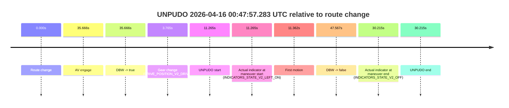
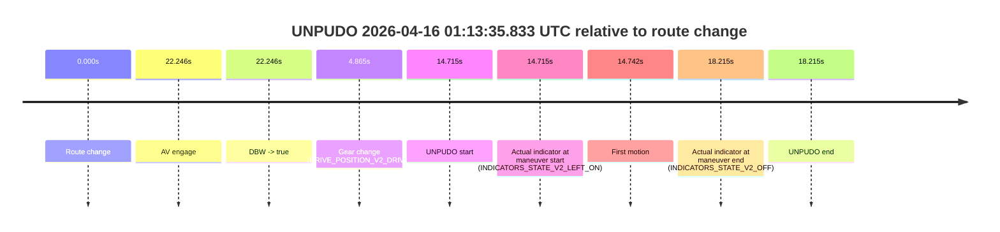

# Run Report: fme10011/2026-04-16--00-34-10--gen2-av-d3fac238-8e56-470e-82dc-d55f68b0468c

| Field | Value |
|---|---|
| Run ID | `fme10011/2026-04-16--00-34-10--gen2-av-d3fac238-8e56-470e-82dc-d55f68b0468c` |
| Date | `2026-04-16` |
| Model(s) | `satisfied-amber-moose` |
| Author | `guy.geva` |
| Event count | `3` |

## unpudo 2026-04-16 00:47:57.283 UTC

| Field | Value |
|---|---|
| Model | `satisfied-amber-moose` |
| Author | `guy.geva` |
| Run ID | `fme10011/2026-04-16--00-34-10--gen2-av-d3fac238-8e56-470e-82dc-d55f68b0468c` |
| Date | `2026-04-16` |
| Time (UTC) | `00:47:57.283` |
| Event type | `unpudo` |
| Disengagement type | `failed_to_unpudo` |
| Route change | `found` |
| Console | [run](https://console.sso.wayve.ai/run/fme10011/2026-04-16--00-34-10--gen2-av-d3fac238-8e56-470e-82dc-d55f68b0468c?id=&time-unixus=1776300477283316) |
| Foxglove | [segment](https://app.foxglove.dev/wayve-on-prem/p/prj_0dX18KZdVHg1fmmI/view?ds=foxglove-stream&ds.deviceName=fme10011&ds.start=2026-04-16T00%3A47%3A36.018248Z&ds.end=2026-04-16T00%3A48%3A43.585585Z&layoutId=lay_0e7VD4WIKDQGU73Y&time=2026-04-16T00%3A47%3A57.283316Z) |

### Event card: fail

- Fail: AV owns part of the segment, but the event still resolves as a model-performance failure under the AV-only scoring rule.

| Event | Time (UTC) | Delta from route change |
|---|---:|---:|
| Route change | 2026-04-16 00:47:46.018 | `0.000s` |
| AV engage | 2026-04-16 00:48:21.684 | `35.666s` |
| DBW -> true | 2026-04-16 00:48:21.684 | `35.666s` |
| Gear change (DRIVE_POSITION_V2_DRIVE) | 2026-04-16 00:47:49.783 | `3.765s` |
| UNPUDO start | 2026-04-16 00:47:57.283 | `11.265s` |
| Actual indicator at maneuver start (INDICATORS_STATE_V2_LEFT_ON) | 2026-04-16 00:47:57.283 | `11.265s` |
| First motion | 2026-04-16 00:47:57.380 | `11.362s` |
| DBW -> false | 2026-04-16 00:48:33.585 | `47.567s` |
| Actual indicator at maneuver end (INDICATORS_STATE_V2_OFF) | 2026-04-16 00:48:16.233 | `30.215s` |
| UNPUDO end | 2026-04-16 00:48:16.233 | `30.215s` |

| Metric | Value |
|---|---|
| Outcome | `fail` |
| Effective failure type | `failed_to_unpudo` |
| Route change status | `found` |
| DBW at event start | `false` |
| DBW at event end | `false` |
| Predicted gear at AV start | `DRIVE_POSITION_V2_DRIVE` |
| Actual gear at AV start | `DRIVE_POSITION_V2_DRIVE` |
| Predicted gear at event start | `DRIVE_POSITION_V2_DRIVE` |
| Actual gear at event start | `DRIVE_POSITION_V2_DRIVE` |
| Planned indicator direction | `INDICATORS_STATE_V2_OFF` |
| Controller indicator direction | `INDICATORS_STATE_V2_OFF` |
| Actual indicator direction | `INDICATORS_STATE_V2_LEFT_ON` |
| Actual indicator at maneuver end | `INDICATORS_STATE_V2_OFF` |
| Driver accel help in AV | `false` |
| Driver accel help timestamp | `n/a` |
| Max accel pedal pct in AV | `0.0%` |
| Max brake pedal pct in AV | `0.0%` |
| Max speed mps in AV | `0.000` |
| Route -> AV | `35.666s` |
| AV -> event start | `-24.401s` |
| AV -> first motion | `-24.304s` |
| AV duration before disengagement | `11.901s` |
| Trajectory waypoint count | `37` |
| Driving-plan step count | `11` |

The scored portion starts from the AV-owned window, not from the pre-AV setup. Route-change search in the stopped pre-event segment was `found`, with the baseline therefore set to route change. At the event anchor the model predicts `DRIVE_POSITION_V2_DRIVE` and the actual gear is `DRIVE_POSITION_V2_DRIVE`. The effective model outcome is `fail` because `failed_to_unpudo`.

### Resolution

| Field | Value |
|---|---|
| Final outcome | `fail` |
| Do we agree with this label? | `yes` |
| Source disengagement type | `failed_to_unpudo` |
| Resolved effective failure type | `failed_to_unpudo` |
| Confidence | `high` |

## unpudo 2026-04-16 00:51:56.533 UTC

| Field | Value |
|---|---|
| Model | `satisfied-amber-moose` |
| Author | `guy.geva` |
| Run ID | `fme10011/2026-04-16--00-34-10--gen2-av-d3fac238-8e56-470e-82dc-d55f68b0468c` |
| Date | `2026-04-16` |
| Time (UTC) | `00:51:56.533` |
| Event type | `unpudo` |
| Disengagement type | `failed_to_unpudo` |
| Route change | `found` |
| Console | [run](https://console.sso.wayve.ai/run/fme10011/2026-04-16--00-34-10--gen2-av-d3fac238-8e56-470e-82dc-d55f68b0468c?id=&time-unixus=1776300716533317) |
| Foxglove | [segment](https://app.foxglove.dev/wayve-on-prem/p/prj_0dX18KZdVHg1fmmI/view?ds=foxglove-stream&ds.deviceName=fme10011&ds.start=2026-04-16T00%3A49%3A52.418237Z&ds.end=2026-04-16T00%3A53%3A15.604549Z&layoutId=lay_0e7VD4WIKDQGU73Y&time=2026-04-16T00%3A51%3A56.533317Z) |

### Event card: fail

- Fail: AV owns part of the segment, but the event still resolves as a model-performance failure under the AV-only scoring rule.

| Event | Time (UTC) | Delta from route change |
|---|---:|---:|
| Route change | 2026-04-16 00:50:02.418 | `0.000s` |
| AV engage | 2026-04-16 00:52:17.944 | `135.526s` |
| DBW -> true | 2026-04-16 00:52:17.944 | `135.526s` |
| Gear change (DRIVE_POSITION_V2_REVERSE) | 2026-04-16 00:51:46.083 | `103.665s` |
| UNPUDO start | 2026-04-16 00:51:56.533 | `114.115s` |
| Actual indicator at maneuver start (INDICATORS_STATE_V2_OFF) | 2026-04-16 00:51:56.533 | `114.115s` |
| First motion | 2026-04-16 00:52:09.780 | `127.362s` |
| DBW -> false | 2026-04-16 00:53:05.604 | `183.186s` |
| Actual indicator at maneuver end (INDICATORS_STATE_V2_OFF) | 2026-04-16 00:52:12.733 | `130.315s` |
| UNPUDO end | 2026-04-16 00:52:12.733 | `130.315s` |

| Metric | Value |
|---|---|
| Outcome | `fail` |
| Effective failure type | `failed_to_unpudo` |
| Route change status | `found` |
| DBW at event start | `false` |
| DBW at event end | `false` |
| Predicted gear at AV start | `DRIVE_POSITION_V2_DRIVE` |
| Actual gear at AV start | `DRIVE_POSITION_V2_DRIVE` |
| Predicted gear at event start | `DRIVE_POSITION_V2_REVERSE` |
| Actual gear at event start | `DRIVE_POSITION_V2_REVERSE` |
| Planned indicator direction | `INDICATORS_STATE_V2_OFF` |
| Controller indicator direction | `INDICATORS_STATE_V2_OFF` |
| Actual indicator direction | `INDICATORS_STATE_V2_OFF` |
| Actual indicator at maneuver end | `INDICATORS_STATE_V2_OFF` |
| Driver accel help in AV | `false` |
| Driver accel help timestamp | `n/a` |
| Max accel pedal pct in AV | `0.0%` |
| Max brake pedal pct in AV | `0.0%` |
| Max speed mps in AV | `0.000` |
| Route -> AV | `135.526s` |
| AV -> event start | `-21.411s` |
| AV -> first motion | `-8.164s` |
| AV duration before disengagement | `47.660s` |
| Trajectory waypoint count | `36` |
| Driving-plan step count | `11` |

The scored portion starts from the AV-owned window, not from the pre-AV setup. Route-change search in the stopped pre-event segment was `found`, with the baseline therefore set to route change. At the event anchor the model predicts `DRIVE_POSITION_V2_REVERSE` and the actual gear is `DRIVE_POSITION_V2_REVERSE`. The effective model outcome is `fail` because `failed_to_unpudo`.

### Resolution

| Field | Value |
|---|---|
| Final outcome | `fail` |
| Do we agree with this label? | `yes` |
| Source disengagement type | `failed_to_unpudo` |
| Resolved effective failure type | `failed_to_unpudo` |
| Confidence | `high` |

## unpudo 2026-04-16 01:13:35.833 UTC

| Field | Value |
|---|---|
| Model | `satisfied-amber-moose` |
| Author | `guy.geva` |
| Run ID | `fme10011/2026-04-16--00-34-10--gen2-av-d3fac238-8e56-470e-82dc-d55f68b0468c` |
| Date | `2026-04-16` |
| Time (UTC) | `01:13:35.833` |
| Event type | `unpudo` |
| Disengagement type | `failed_to_unpudo` |
| Route change | `found` |
| Console | [run](https://console.sso.wayve.ai/run/fme10011/2026-04-16--00-34-10--gen2-av-d3fac238-8e56-470e-82dc-d55f68b0468c?id=&time-unixus=1776302015833317) |
| Foxglove | [segment](https://app.foxglove.dev/wayve-on-prem/p/prj_0dX18KZdVHg1fmmI/view?ds=foxglove-stream&ds.deviceName=fme10011&ds.start=2026-04-16T01%3A13%3A11.118219Z&ds.end=2026-04-16T01%3A13%3A49.333314Z&layoutId=lay_0e7VD4WIKDQGU73Y&time=2026-04-16T01%3A13%3A35.833317Z) |

### Event card: fail

- Fail: AV owns part of the segment, but the event still resolves as a model-performance failure under the AV-only scoring rule.

| Event | Time (UTC) | Delta from route change |
|---|---:|---:|
| Route change | 2026-04-16 01:13:21.118 | `0.000s` |
| AV engage | 2026-04-16 01:13:43.364 | `22.246s` |
| DBW -> true | 2026-04-16 01:13:43.364 | `22.246s` |
| Gear change (DRIVE_POSITION_V2_DRIVE) | 2026-04-16 01:13:25.983 | `4.865s` |
| UNPUDO start | 2026-04-16 01:13:35.833 | `14.715s` |
| Actual indicator at maneuver start (INDICATORS_STATE_V2_LEFT_ON) | 2026-04-16 01:13:35.833 | `14.715s` |
| First motion | 2026-04-16 01:13:35.860 | `14.742s` |
| Actual indicator at maneuver end (INDICATORS_STATE_V2_OFF) | 2026-04-16 01:13:39.333 | `18.215s` |
| UNPUDO end | 2026-04-16 01:13:39.333 | `18.215s` |

| Metric | Value |
|---|---|
| Outcome | `fail` |
| Effective failure type | `failed_to_unpudo` |
| Route change status | `found` |
| DBW at event start | `false` |
| DBW at event end | `false` |
| Predicted gear at AV start | `DRIVE_POSITION_V2_DRIVE` |
| Actual gear at AV start | `DRIVE_POSITION_V2_DRIVE` |
| Predicted gear at event start | `DRIVE_POSITION_V2_DRIVE` |
| Actual gear at event start | `DRIVE_POSITION_V2_DRIVE` |
| Planned indicator direction | `INDICATORS_STATE_V2_LEFT_ON` |
| Controller indicator direction | `INDICATORS_STATE_V2_LEFT_ON` |
| Actual indicator direction | `INDICATORS_STATE_V2_LEFT_ON` |
| Actual indicator at maneuver end | `INDICATORS_STATE_V2_OFF` |
| Driver accel help in AV | `false` |
| Driver accel help timestamp | `n/a` |
| Max accel pedal pct in AV | `0.0%` |
| Max brake pedal pct in AV | `0.0%` |
| Max speed mps in AV | `0.000` |
| Route -> AV | `22.246s` |
| AV -> event start | `-7.531s` |
| AV -> first motion | `-7.504s` |
| AV duration before disengagement | `n/a` |
| Trajectory waypoint count | `38` |
| Driving-plan step count | `11` |

The scored portion starts from the AV-owned window, not from the pre-AV setup. Route-change search in the stopped pre-event segment was `found`, with the baseline therefore set to route change. At the event anchor the model predicts `DRIVE_POSITION_V2_DRIVE` and the actual gear is `DRIVE_POSITION_V2_DRIVE`. The effective model outcome is `fail` because `failed_to_unpudo`.

### Resolution

| Field | Value |
|---|---|
| Final outcome | `fail` |
| Do we agree with this label? | `yes` |
| Source disengagement type | `failed_to_unpudo` |
| Resolved effective failure type | `failed_to_unpudo` |
| Confidence | `high` |
