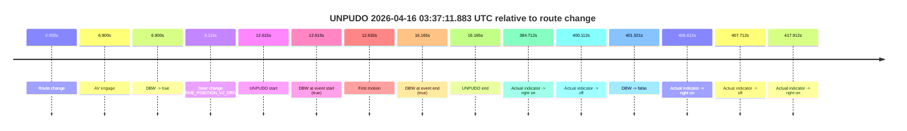
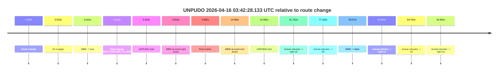
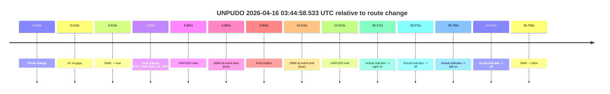
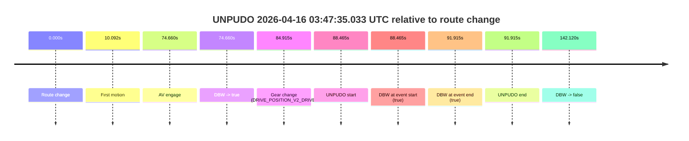
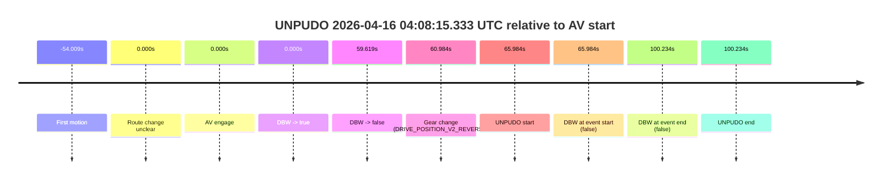
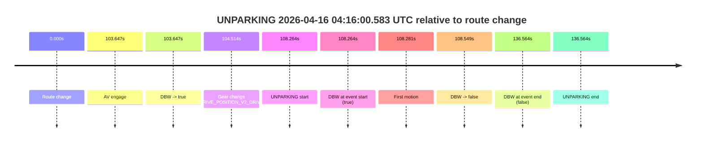

# Run Report: fme10011/2026-04-16--03-28-37--gen2-av-65561e16-b03f-4917-918e-7731511c190f

| Field | Value |
|---|---|
| Run ID | `fme10011/2026-04-16--03-28-37--gen2-av-65561e16-b03f-4917-918e-7731511c190f` |
| Date | `2026-04-16` |
| Model(s) | `eel-teal-outspoken` |
| Author | `zak` |
| Event count | `6` |

## unpudo 2026-04-16 03:37:11.883 UTC

| Field | Value |
|---|---|
| Model | `eel-teal-outspoken` |
| Author | `zak` |
| Run ID | `fme10011/2026-04-16--03-28-37--gen2-av-65561e16-b03f-4917-918e-7731511c190f` |
| Date | `2026-04-16` |
| Time (UTC) | `03:37:11.883` |
| Event type | `unpudo` |
| Disengagement type | `none observed` |
| Route change | `found` |
| Console | [run](https://console.sso.wayve.ai/run/fme10011/2026-04-16--03-28-37--gen2-av-65561e16-b03f-4917-918e-7731511c190f?id=&time-unixus=1776310631883308) |
| Foxglove | [segment](https://app.foxglove.dev/wayve-on-prem/p/prj_0dX18KZdVHg1fmmI/view?ds=foxglove-stream&ds.deviceName=fme10011&ds.start=2026-04-16T03%3A36%3A49.268266Z&ds.end=2026-04-16T03%3A43%3A51.189186Z&layoutId=lay_0e7VD4WIKDQGU73Y&time=2026-04-16T03%3A37%3A11.883308Z) |

### Event card: pass

- Pass: AV owns the credited unpudo from route change through the official unpudo window, the gear state is aligned at the anchor, and the vehicle moves without driver accelerator help in AV.

| Event | Time (UTC) | Delta from route change |
|---|---:|---:|
| Route change | 2026-04-16 03:36:59.268 | `0.000s` |
| AV engage | 2026-04-16 03:37:06.168 | `6.900s` |
| DBW -> true | 2026-04-16 03:37:06.168 | `6.900s` |
| Gear change (DRIVE_POSITION_V2_DRIVE) | 2026-04-16 03:37:08.383 | `9.115s` |
| UNPUDO start | 2026-04-16 03:37:11.883 | `12.615s` |
| DBW at event start (true) | 2026-04-16 03:37:11.883 | `12.615s` |
| First motion | 2026-04-16 03:37:11.900 | `12.632s` |
| DBW at event end (true) | 2026-04-16 03:37:15.433 | `16.165s` |
| UNPUDO end | 2026-04-16 03:37:15.433 | `16.165s` |
| Actual indicator -> right on | 2026-04-16 03:43:23.980 | `384.712s` |
| Actual indicator -> off | 2026-04-16 03:43:39.380 | `400.112s` |
| DBW -> false | 2026-04-16 03:43:41.189 | `401.921s` |
| Actual indicator -> right on | 2026-04-16 03:43:45.880 | `406.612s` |
| Actual indicator -> off | 2026-04-16 03:43:46.980 | `407.712s` |
| Actual indicator -> right on | 2026-04-16 03:43:57.180 | `417.912s` |

| Metric | Value |
|---|---|
| Outcome | `pass` |
| Effective failure type | `none` |
| Route change status | `found` |
| DBW at event start | `true` |
| DBW at event end | `true` |
| Predicted gear at AV start | `DRIVE_POSITION_V2_PARK` |
| Actual gear at AV start | `DRIVE_POSITION_V2_PARK` |
| Predicted gear at event start | `DRIVE_POSITION_V2_DRIVE` |
| Actual gear at event start | `DRIVE_POSITION_V2_DRIVE` |
| Planned indicator direction | `INDICATORS_STATE_V2_OFF` |
| Controller indicator direction | `INDICATORS_STATE_V2_OFF` |
| Actual indicator direction | `INDICATORS_STATE_V2_OFF` |
| Actual indicator at maneuver end | `INDICATORS_STATE_V2_OFF` |
| Driver accel help in AV | `false` |
| Driver accel help timestamp | `n/a` |
| Max accel pedal pct in AV | `0.0%` |
| Max brake pedal pct in AV | `8.0%` |
| Max speed mps in AV | `4.561` |
| Success timing baseline | `route change` |
| Route -> AV | `6.900s` |
| AV -> event start | `5.715s` |
| AV -> first motion | `5.732s` |
| Success baseline -> event start | `12.615s` |
| Success baseline -> first motion | `12.632s` |
| AV duration before disengagement | `395.021s` |
| Trajectory waypoint count | `37` |
| Driving-plan step count | `11` |

The scored portion starts from the AV-owned window, not from the pre-AV setup. Route-change search in the stopped pre-event segment was `found`, with the baseline therefore set to route change. At the event anchor the model predicts `DRIVE_POSITION_V2_DRIVE` and the actual gear is `DRIVE_POSITION_V2_DRIVE`. The effective model outcome is `pass` because `the credited unpudo stays AV-owned through the official unpudo window.`

### Resolution

| Field | Value |
|---|---|
| Final outcome | `pass` |
| Do we agree with this label? | `yes` |
| Source disengagement type | `none observed` |
| Resolved effective failure type | `none` |
| Confidence | `high` |

## unpudo 2026-04-16 03:42:28.133 UTC

| Field | Value |
|---|---|
| Model | `eel-teal-outspoken` |
| Author | `zak` |
| Run ID | `fme10011/2026-04-16--03-28-37--gen2-av-65561e16-b03f-4917-918e-7731511c190f` |
| Date | `2026-04-16` |
| Time (UTC) | `03:42:28.133` |
| Event type | `unpudo` |
| Disengagement type | `none observed` |
| Route change | `found` |
| Console | [run](https://console.sso.wayve.ai/run/fme10011/2026-04-16--03-28-37--gen2-av-65561e16-b03f-4917-918e-7731511c190f?id=&time-unixus=1776310948133289) |
| Foxglove | [segment](https://app.foxglove.dev/wayve-on-prem/p/prj_0dX18KZdVHg1fmmI/view?ds=foxglove-stream&ds.deviceName=fme10011&ds.start=2026-04-16T03%3A42%3A12.218312Z&ds.end=2026-04-16T03%3A43%3A51.189186Z&layoutId=lay_0e7VD4WIKDQGU73Y&time=2026-04-16T03%3A42%3A28.133289Z) |

### Event card: pass

- Pass: AV owns the credited unpudo from route change through the official unpudo window, the gear state is aligned at the anchor, and the vehicle moves without driver accelerator help in AV.

| Event | Time (UTC) | Delta from route change |
|---|---:|---:|
| Route change | 2026-04-16 03:42:22.218 | `0.000s` |
| AV engage | 2026-04-16 03:42:22.228 | `0.010s` |
| DBW -> true | 2026-04-16 03:42:22.228 | `0.010s` |
| Gear change (DRIVE_POSITION_V2_DRIVE) | 2026-04-16 03:42:24.633 | `2.415s` |
| UNPUDO start | 2026-04-16 03:42:28.133 | `5.915s` |
| DBW at event start (true) | 2026-04-16 03:42:28.133 | `5.915s` |
| First motion | 2026-04-16 03:42:28.180 | `5.962s` |
| DBW at event end (true) | 2026-04-16 03:42:36.283 | `14.065s` |
| UNPUDO end | 2026-04-16 03:42:36.283 | `14.065s` |
| Actual indicator -> right on | 2026-04-16 03:43:23.980 | `61.762s` |
| Actual indicator -> off | 2026-04-16 03:43:39.380 | `77.162s` |
| DBW -> false | 2026-04-16 03:43:41.189 | `78.971s` |
| Actual indicator -> right on | 2026-04-16 03:43:45.880 | `83.662s` |
| Actual indicator -> off | 2026-04-16 03:43:46.980 | `84.762s` |
| Actual indicator -> right on | 2026-04-16 03:43:57.180 | `94.962s` |

| Metric | Value |
|---|---|
| Outcome | `pass` |
| Effective failure type | `none` |
| Route change status | `found` |
| DBW at event start | `true` |
| DBW at event end | `true` |
| Predicted gear at AV start | `DRIVE_POSITION_V2_PARK` |
| Actual gear at AV start | `DRIVE_POSITION_V2_PARK` |
| Predicted gear at event start | `DRIVE_POSITION_V2_DRIVE` |
| Actual gear at event start | `DRIVE_POSITION_V2_DRIVE` |
| Planned indicator direction | `INDICATORS_STATE_V2_LEFT_ON` |
| Controller indicator direction | `INDICATORS_STATE_V2_LEFT_ON` |
| Actual indicator direction | `INDICATORS_STATE_V2_OFF` |
| Actual indicator at maneuver end | `INDICATORS_STATE_V2_OFF` |
| Driver accel help in AV | `false` |
| Driver accel help timestamp | `n/a` |
| Max accel pedal pct in AV | `0.0%` |
| Max brake pedal pct in AV | `8.1%` |
| Max speed mps in AV | `3.578` |
| Success timing baseline | `route change` |
| Route -> AV | `0.010s` |
| AV -> event start | `5.905s` |
| AV -> first motion | `5.952s` |
| Success baseline -> event start | `5.915s` |
| Success baseline -> first motion | `5.962s` |
| AV duration before disengagement | `78.961s` |
| Trajectory waypoint count | `38` |
| Driving-plan step count | `11` |

The scored portion starts from the AV-owned window, not from the pre-AV setup. Route-change search in the stopped pre-event segment was `found`, with the baseline therefore set to route change. At the event anchor the model predicts `DRIVE_POSITION_V2_DRIVE` and the actual gear is `DRIVE_POSITION_V2_DRIVE`. The effective model outcome is `pass` because `the credited unpudo stays AV-owned through the official unpudo window.`

### Resolution

| Field | Value |
|---|---|
| Final outcome | `pass` |
| Do we agree with this label? | `yes` |
| Source disengagement type | `none observed` |
| Resolved effective failure type | `none` |
| Confidence | `high` |

## unpudo 2026-04-16 03:44:58.533 UTC

| Field | Value |
|---|---|
| Model | `eel-teal-outspoken` |
| Author | `zak` |
| Run ID | `fme10011/2026-04-16--03-28-37--gen2-av-65561e16-b03f-4917-918e-7731511c190f` |
| Date | `2026-04-16` |
| Time (UTC) | `03:44:58.533` |
| Event type | `unpudo` |
| Disengagement type | `none observed` |
| Route change | `found` |
| Console | [run](https://console.sso.wayve.ai/run/fme10011/2026-04-16--03-28-37--gen2-av-65561e16-b03f-4917-918e-7731511c190f?id=&time-unixus=1776311098533321) |
| Foxglove | [segment](https://app.foxglove.dev/wayve-on-prem/p/prj_0dX18KZdVHg1fmmI/view?ds=foxglove-stream&ds.deviceName=fme10011&ds.start=2026-04-16T03%3A44%3A41.668263Z&ds.end=2026-04-16T03%3A45%3A58.367906Z&layoutId=lay_0e7VD4WIKDQGU73Y&time=2026-04-16T03%3A44%3A58.533321Z) |

### Event card: pass

- Pass: AV owns the credited unpudo from route change through the official unpudo window, the gear state is aligned at the anchor, and the vehicle moves without driver accelerator help in AV.

| Event | Time (UTC) | Delta from route change |
|---|---:|---:|
| Route change | 2026-04-16 03:44:51.668 | `0.000s` |
| AV engage | 2026-04-16 03:44:51.678 | `0.010s` |
| DBW -> true | 2026-04-16 03:44:51.678 | `0.010s` |
| Gear change (DRIVE_POSITION_V2_DRIVE) | 2026-04-16 03:44:55.033 | `3.365s` |
| UNPUDO start | 2026-04-16 03:44:58.533 | `6.865s` |
| DBW at event start (true) | 2026-04-16 03:44:58.533 | `6.865s` |
| First motion | 2026-04-16 03:44:58.560 | `6.892s` |
| DBW at event end (true) | 2026-04-16 03:45:02.283 | `10.615s` |
| UNPUDO end | 2026-04-16 03:45:02.283 | `10.615s` |
| Actual indicator -> right on | 2026-04-16 03:45:22.040 | `30.372s` |
| Actual indicator -> off | 2026-04-16 03:45:30.240 | `38.572s` |
| Actual indicator -> left on | 2026-04-16 03:45:30.460 | `38.792s` |
| Actual indicator -> off | 2026-04-16 03:45:34.080 | `42.412s` |
| DBW -> false | 2026-04-16 03:45:48.367 | `56.700s` |

| Metric | Value |
|---|---|
| Outcome | `pass` |
| Effective failure type | `none` |
| Route change status | `found` |
| DBW at event start | `true` |
| DBW at event end | `true` |
| Predicted gear at AV start | `DRIVE_POSITION_V2_PARK` |
| Actual gear at AV start | `DRIVE_POSITION_V2_PARK` |
| Predicted gear at event start | `DRIVE_POSITION_V2_DRIVE` |
| Actual gear at event start | `DRIVE_POSITION_V2_DRIVE` |
| Planned indicator direction | `INDICATORS_STATE_V2_OFF` |
| Controller indicator direction | `INDICATORS_STATE_V2_OFF` |
| Actual indicator direction | `INDICATORS_STATE_V2_OFF` |
| Actual indicator at maneuver end | `INDICATORS_STATE_V2_OFF` |
| Driver accel help in AV | `false` |
| Driver accel help timestamp | `n/a` |
| Max accel pedal pct in AV | `0.0%` |
| Max brake pedal pct in AV | `8.0%` |
| Max speed mps in AV | `4.078` |
| Success timing baseline | `route change` |
| Route -> AV | `0.010s` |
| AV -> event start | `6.855s` |
| AV -> first motion | `6.882s` |
| Success baseline -> event start | `6.865s` |
| Success baseline -> first motion | `6.892s` |
| AV duration before disengagement | `56.690s` |
| Trajectory waypoint count | `37` |
| Driving-plan step count | `11` |

The scored portion starts from the AV-owned window, not from the pre-AV setup. Route-change search in the stopped pre-event segment was `found`, with the baseline therefore set to route change. At the event anchor the model predicts `DRIVE_POSITION_V2_DRIVE` and the actual gear is `DRIVE_POSITION_V2_DRIVE`. The effective model outcome is `pass` because `the credited unpudo stays AV-owned through the official unpudo window.`

### Resolution

| Field | Value |
|---|---|
| Final outcome | `pass` |
| Do we agree with this label? | `yes` |
| Source disengagement type | `none observed` |
| Resolved effective failure type | `none` |
| Confidence | `high` |

## unpudo 2026-04-16 03:47:35.033 UTC

| Field | Value |
|---|---|
| Model | `eel-teal-outspoken` |
| Author | `zak` |
| Run ID | `fme10011/2026-04-16--03-28-37--gen2-av-65561e16-b03f-4917-918e-7731511c190f` |
| Date | `2026-04-16` |
| Time (UTC) | `03:47:35.033` |
| Event type | `unpudo` |
| Disengagement type | `none observed` |
| Route change | `found` |
| Console | [run](https://console.sso.wayve.ai/run/fme10011/2026-04-16--03-28-37--gen2-av-65561e16-b03f-4917-918e-7731511c190f?id=&time-unixus=1776311255033317) |
| Foxglove | [segment](https://app.foxglove.dev/wayve-on-prem/p/prj_0dX18KZdVHg1fmmI/view?ds=foxglove-stream&ds.deviceName=fme10011&ds.start=2026-04-16T03%3A45%3A56.568249Z&ds.end=2026-04-16T03%3A48%3A38.688608Z&layoutId=lay_0e7VD4WIKDQGU73Y&time=2026-04-16T03%3A47%3A35.033317Z) |

### Event card: pass

- Pass: AV owns the credited unpudo from route change through the official unpudo window, the gear state is aligned at the anchor, and the vehicle moves without driver accelerator help in AV.

| Event | Time (UTC) | Delta from route change |
|---|---:|---:|
| Route change | 2026-04-16 03:46:06.568 | `0.000s` |
| First motion | 2026-04-16 03:46:16.660 | `10.092s` |
| AV engage | 2026-04-16 03:47:21.228 | `74.660s` |
| DBW -> true | 2026-04-16 03:47:21.228 | `74.660s` |
| Gear change (DRIVE_POSITION_V2_DRIVE) | 2026-04-16 03:47:31.483 | `84.915s` |
| UNPUDO start | 2026-04-16 03:47:35.033 | `88.465s` |
| DBW at event start (true) | 2026-04-16 03:47:35.033 | `88.465s` |
| DBW at event end (true) | 2026-04-16 03:47:38.483 | `91.915s` |
| UNPUDO end | 2026-04-16 03:47:38.483 | `91.915s` |
| DBW -> false | 2026-04-16 03:48:28.688 | `142.120s` |

| Metric | Value |
|---|---|
| Outcome | `pass` |
| Effective failure type | `none` |
| Route change status | `found` |
| DBW at event start | `true` |
| DBW at event end | `true` |
| Predicted gear at AV start | `DRIVE_POSITION_V2_PARK` |
| Actual gear at AV start | `DRIVE_POSITION_V2_PARK` |
| Predicted gear at event start | `DRIVE_POSITION_V2_DRIVE` |
| Actual gear at event start | `DRIVE_POSITION_V2_DRIVE` |
| Planned indicator direction | `INDICATORS_STATE_V2_LEFT_ON` |
| Controller indicator direction | `INDICATORS_STATE_V2_LEFT_ON` |
| Actual indicator direction | `INDICATORS_STATE_V2_OFF` |
| Actual indicator at maneuver end | `INDICATORS_STATE_V2_OFF` |
| Driver accel help in AV | `false` |
| Driver accel help timestamp | `n/a` |
| Max accel pedal pct in AV | `0.0%` |
| Max brake pedal pct in AV | `8.0%` |
| Max speed mps in AV | `5.811` |
| Success timing baseline | `route change` |
| Route -> AV | `74.660s` |
| AV -> event start | `13.805s` |
| AV -> first motion | `-64.568s` |
| Success baseline -> event start | `88.465s` |
| Success baseline -> first motion | `10.092s` |
| AV duration before disengagement | `67.460s` |
| Trajectory waypoint count | `37` |
| Driving-plan step count | `11` |

The scored portion starts from the AV-owned window, not from the pre-AV setup. Route-change search in the stopped pre-event segment was `found`, with the baseline therefore set to route change. At the event anchor the model predicts `DRIVE_POSITION_V2_DRIVE` and the actual gear is `DRIVE_POSITION_V2_DRIVE`. The effective model outcome is `pass` because `the credited unpudo stays AV-owned through the official unpudo window.`

### Resolution

| Field | Value |
|---|---|
| Final outcome | `pass` |
| Do we agree with this label? | `yes` |
| Source disengagement type | `none observed` |
| Resolved effective failure type | `none` |
| Confidence | `high` |

## unpudo 2026-04-16 04:08:15.333 UTC

| Field | Value |
|---|---|
| Model | `eel-teal-outspoken` |
| Author | `zak` |
| Run ID | `fme10011/2026-04-16--03-28-37--gen2-av-65561e16-b03f-4917-918e-7731511c190f` |
| Date | `2026-04-16` |
| Time (UTC) | `04:08:15.333` |
| Event type | `unpudo` |
| Disengagement type | `failed_to_pudo` |
| Route change | `unclear` |
| Console | [run](https://console.sso.wayve.ai/run/fme10011/2026-04-16--03-28-37--gen2-av-65561e16-b03f-4917-918e-7731511c190f?id=&time-unixus=1776312495333302) |
| Foxglove | [segment](https://app.foxglove.dev/wayve-on-prem/p/prj_0dX18KZdVHg1fmmI/view?ds=foxglove-stream&ds.deviceName=fme10011&ds.start=2026-04-16T04%3A06%3A59.349393Z&ds.end=2026-04-16T04%3A08%3A59.583314Z&layoutId=lay_0e7VD4WIKDQGU73Y&time=2026-04-16T04%3A08%3A15.333302Z) |

### Event card: fail

- Fail: AV owns part of the segment, but the event still resolves as a model-performance failure under the AV-only scoring rule.

| Event | Time (UTC) | Delta from AV start |
|---|---:|---:|
| First motion | 2026-04-16 04:06:15.340 | `-54.009s` |
| Route change unclear | 2026-04-16 04:07:09.349 | `0.000s` |
| AV engage | 2026-04-16 04:07:09.349 | `0.000s` |
| DBW -> true | 2026-04-16 04:07:09.349 | `0.000s` |
| DBW -> false | 2026-04-16 04:08:08.968 | `59.619s` |
| Gear change (DRIVE_POSITION_V2_REVERSE) | 2026-04-16 04:08:10.333 | `60.984s` |
| UNPUDO start | 2026-04-16 04:08:15.333 | `65.984s` |
| DBW at event start (false) | 2026-04-16 04:08:15.333 | `65.984s` |
| DBW at event end (false) | 2026-04-16 04:08:49.583 | `100.234s` |
| UNPUDO end | 2026-04-16 04:08:49.583 | `100.234s` |

| Metric | Value |
|---|---|
| Outcome | `fail` |
| Effective failure type | `failed_to_pudo` |
| Route change status | `unclear` |
| DBW at event start | `false` |
| DBW at event end | `false` |
| Predicted gear at AV start | `DRIVE_POSITION_V2_DRIVE` |
| Actual gear at AV start | `DRIVE_POSITION_V2_DRIVE` |
| Predicted gear at event start | `DRIVE_POSITION_V2_REVERSE` |
| Actual gear at event start | `DRIVE_POSITION_V2_REVERSE` |
| Planned indicator direction | `INDICATORS_STATE_V2_OFF` |
| Controller indicator direction | `INDICATORS_STATE_V2_OFF` |
| Actual indicator direction | `INDICATORS_STATE_V2_OFF` |
| Actual indicator at maneuver end | `INDICATORS_STATE_V2_OFF` |
| Driver accel help in AV | `false` |
| Driver accel help timestamp | `n/a` |
| Max accel pedal pct in AV | `0.0%` |
| Max brake pedal pct in AV | `6.2%` |
| Max speed mps in AV | `16.272` |
| Success timing baseline | `AV start` |
| Route -> AV | `n/a` |
| AV -> event start | `65.984s` |
| AV -> first motion | `-54.009s` |
| Success baseline -> event start | `65.984s` |
| Success baseline -> first motion | `-54.009s` |
| AV duration before disengagement | `59.619s` |
| Trajectory waypoint count | `37` |
| Driving-plan step count | `11` |

The scored portion starts from the AV-owned window, not from the pre-AV setup. Route-change search in the stopped pre-event segment was `unclear`, with the baseline therefore set to AV start. At the event anchor the model predicts `DRIVE_POSITION_V2_REVERSE` and the actual gear is `DRIVE_POSITION_V2_REVERSE`. The effective model outcome is `fail` because `failed_to_pudo.`

### Resolution

| Field | Value |
|---|---|
| Final outcome | `fail` |
| Do we agree with this label? | `yes` |
| Source disengagement type | `failed_to_pudo` |
| Resolved effective failure type | `failed_to_pudo` |
| Confidence | `medium` |

## unparking 2026-04-16 04:16:00.583 UTC

| Field | Value |
|---|---|
| Model | `eel-teal-outspoken` |
| Author | `zak` |
| Run ID | `fme10011/2026-04-16--03-28-37--gen2-av-65561e16-b03f-4917-918e-7731511c190f` |
| Date | `2026-04-16` |
| Time (UTC) | `04:16:00.583` |
| Event type | `unparking` |
| Disengagement type | `uncategorised` |
| Route change | `found` |
| Console | [run](https://console.sso.wayve.ai/run/fme10011/2026-04-16--03-28-37--gen2-av-65561e16-b03f-4917-918e-7731511c190f?id=&time-unixus=1776312960583300) |
| Foxglove | [segment](https://app.foxglove.dev/wayve-on-prem/p/prj_0dX18KZdVHg1fmmI/view?ds=foxglove-stream&ds.deviceName=fme10011&ds.start=2026-04-16T04%3A14%3A02.319759Z&ds.end=2026-04-16T04%3A16%3A38.883317Z&layoutId=lay_0e7VD4WIKDQGU73Y&time=2026-04-16T04%3A16%3A00.583300Z) |

### Event card: accidental

- Accidental: AV ownership is present for less than `2s`, so this is treated as an accidental brush with the maneuver rather than a meaningful model attempt.

| Event | Time (UTC) | Delta from route change |
|---|---:|---:|
| Route change | 2026-04-16 04:14:12.319 | `0.000s` |
| AV engage | 2026-04-16 04:15:55.967 | `103.647s` |
| DBW -> true | 2026-04-16 04:15:55.967 | `103.647s` |
| Gear change (DRIVE_POSITION_V2_DRIVE) | 2026-04-16 04:15:56.833 | `104.514s` |
| UNPARKING start | 2026-04-16 04:16:00.583 | `108.264s` |
| DBW at event start (true) | 2026-04-16 04:16:00.583 | `108.264s` |
| First motion | 2026-04-16 04:16:00.600 | `108.281s` |
| DBW -> false | 2026-04-16 04:16:00.868 | `108.549s` |
| DBW at event end (false) | 2026-04-16 04:16:28.883 | `136.564s` |
| UNPARKING end | 2026-04-16 04:16:28.883 | `136.564s` |

| Metric | Value |
|---|---|
| Outcome | `accidental` |
| Effective failure type | `none` |
| Route change status | `found` |
| DBW at event start | `true` |
| DBW at event end | `false` |
| Predicted gear at AV start | `DRIVE_POSITION_V2_PARK` |
| Actual gear at AV start | `DRIVE_POSITION_V2_PARK` |
| Predicted gear at event start | `DRIVE_POSITION_V2_DRIVE` |
| Actual gear at event start | `DRIVE_POSITION_V2_DRIVE` |
| Planned indicator direction | `INDICATORS_STATE_V2_OFF` |
| Controller indicator direction | `INDICATORS_STATE_V2_OFF` |
| Actual indicator direction | `INDICATORS_STATE_V2_OFF` |
| Actual indicator at maneuver end | `INDICATORS_STATE_V2_OFF` |
| Driver accel help in AV | `false` |
| Driver accel help timestamp | `n/a` |
| Max accel pedal pct in AV | `0.0%` |
| Max brake pedal pct in AV | `0.0%` |
| Max speed mps in AV | `0.589` |
| Success timing baseline | `route change` |
| Route -> AV | `103.647s` |
| AV -> event start | `4.616s` |
| AV -> first motion | `4.633s` |
| Success baseline -> event start | `108.264s` |
| Success baseline -> first motion | `108.281s` |
| AV duration before disengagement | `4.901s` |
| Trajectory waypoint count | `36` |
| Driving-plan step count | `11` |

The scored portion starts from the AV-owned window, not from the pre-AV setup. Route-change search in the stopped pre-event segment was `found`, with the baseline therefore set to route change. At the event anchor the model predicts `DRIVE_POSITION_V2_DRIVE` and the actual gear is `DRIVE_POSITION_V2_DRIVE`. The effective model outcome is `accidental` because `the AV-owned portion is shorter than 2s.`

### Resolution

| Field | Value |
|---|---|
| Final outcome | `accidental` |
| Do we agree with this label? | `yes` |
| Source disengagement type | `uncategorised` |
| Resolved effective failure type | `none` |
| Confidence | `high` |
