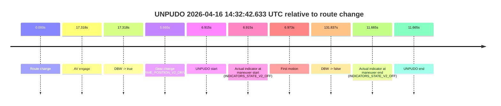
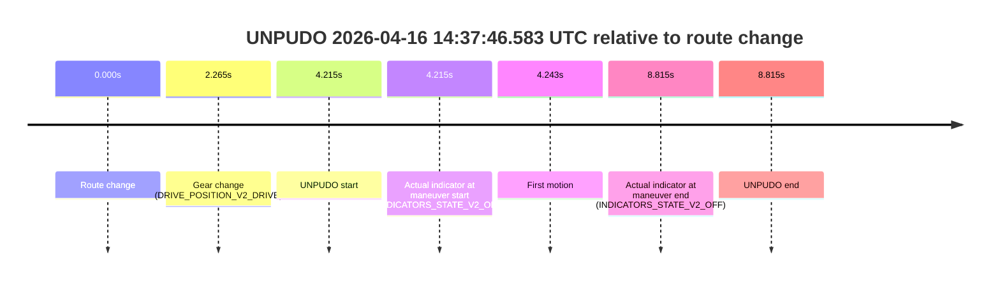
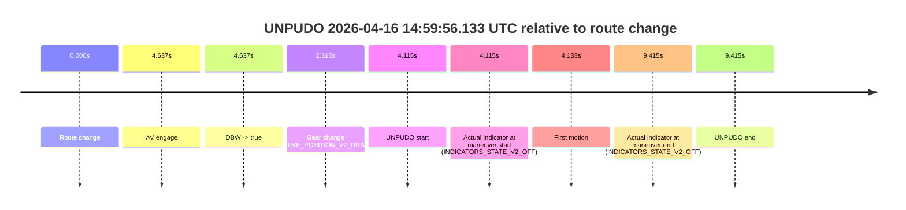

# Run Report: fme10011/2026-04-16--14-17-15--gen2-av-75aea222-2da3-4f92-a4b7-a7383009bf4e

| Field | Value |
|---|---|
| Run ID | `fme10011/2026-04-16--14-17-15--gen2-av-75aea222-2da3-4f92-a4b7-a7383009bf4e` |
| Date | `2026-04-16` |
| Model(s) | `armadillo-amethyst-squeaky` |
| Author | `guy.geva` |
| Event count | `7` |

## unpudo 2026-04-16 14:32:42.633 UTC

| Field | Value |
|---|---|
| Model | `armadillo-amethyst-squeaky` |
| Author | `guy.geva` |
| Run ID | `fme10011/2026-04-16--14-17-15--gen2-av-75aea222-2da3-4f92-a4b7-a7383009bf4e` |
| Date | `2026-04-16` |
| Time (UTC) | `14:32:42.633` |
| Event type | `unpudo` |
| Disengagement type | `none observed` |
| Route change | `found` |
| Console | [run](https://console.sso.wayve.ai/run/fme10011/2026-04-16--14-17-15--gen2-av-75aea222-2da3-4f92-a4b7-a7383009bf4e?id=&time-unixus=1776349962633318) |
| Foxglove | [segment](https://app.foxglove.dev/wayve-on-prem/p/prj_0dX18KZdVHg1fmmI/view?ds=foxglove-stream&ds.deviceName=fme10011&ds.start=2026-04-16T14%3A32%3A25.718255Z&ds.end=2026-04-16T14%3A34%3A57.555188Z&layoutId=lay_0e7VD4WIKDQGU73Y&time=2026-04-16T14%3A32%3A42.633318Z) |

### Event card: fail

- Fail: the credited unpudo does not stay AV-owned. The event window starts with DBW false, and the maneuver outcome lands outside a clean AV-owned segment.

| Event | Time (UTC) | Delta from route change |
|---|---:|---:|
| Route change | 2026-04-16 14:32:35.718 | `0.000s` |
| AV engage | 2026-04-16 14:32:53.036 | `17.318s` |
| DBW -> true | 2026-04-16 14:32:53.036 | `17.318s` |
| Gear change (DRIVE_POSITION_V2_DRIVE) | 2026-04-16 14:32:41.383 | `5.665s` |
| UNPUDO start | 2026-04-16 14:32:42.633 | `6.915s` |
| Actual indicator at maneuver start (INDICATORS_STATE_V2_OFF) | 2026-04-16 14:32:42.633 | `6.915s` |
| First motion | 2026-04-16 14:32:42.691 | `6.973s` |
| DBW -> false | 2026-04-16 14:34:47.555 | `131.837s` |
| Actual indicator at maneuver end (INDICATORS_STATE_V2_OFF) | 2026-04-16 14:32:47.383 | `11.665s` |
| UNPUDO end | 2026-04-16 14:32:47.383 | `11.665s` |

| Metric | Value |
|---|---|
| Outcome | `fail` |
| Effective failure type | `completed_outside_av` |
| Route change status | `found` |
| DBW at event start | `false` |
| DBW at event end | `false` |
| Predicted gear at AV start | `DRIVE_POSITION_V2_DRIVE` |
| Actual gear at AV start | `DRIVE_POSITION_V2_DRIVE` |
| Predicted gear at event start | `DRIVE_POSITION_V2_DRIVE` |
| Actual gear at event start | `DRIVE_POSITION_V2_DRIVE` |
| Planned indicator direction | `INDICATORS_STATE_V2_OFF` |
| Controller indicator direction | `INDICATORS_STATE_V2_OFF` |
| Actual indicator direction | `INDICATORS_STATE_V2_OFF` |
| Actual indicator at maneuver end | `INDICATORS_STATE_V2_OFF` |
| Driver accel help in AV | `false` |
| Driver accel help timestamp | `n/a` |
| Max accel pedal pct in AV | `0.0%` |
| Max brake pedal pct in AV | `0.0%` |
| Max speed mps in AV | `0.000` |
| Route -> AV | `17.318s` |
| AV -> event start | `-10.403s` |
| AV -> first motion | `-10.345s` |
| AV duration before disengagement | `114.519s` |
| Trajectory waypoint count | `35` |
| Driving-plan step count | `11` |

The scored portion starts from the AV-owned window, not from the pre-AV setup. Route-change search in the stopped pre-event segment was `found`, with the baseline therefore set to route change. At the event anchor the model predicts `DRIVE_POSITION_V2_DRIVE` and the actual gear is `DRIVE_POSITION_V2_DRIVE`. The effective model outcome is `fail` because `completed_outside_av`.

### Resolution

| Field | Value |
|---|---|
| Final outcome | `fail` |
| Do we agree with this label? | `yes` |
| Source disengagement type | `none observed` |
| Resolved effective failure type | `completed_outside_av` |
| Confidence | `high` |

## unpudo 2026-04-16 14:37:46.583 UTC

| Field | Value |
|---|---|
| Model | `armadillo-amethyst-squeaky` |
| Author | `guy.geva` |
| Run ID | `fme10011/2026-04-16--14-17-15--gen2-av-75aea222-2da3-4f92-a4b7-a7383009bf4e` |
| Date | `2026-04-16` |
| Time (UTC) | `14:37:46.583` |
| Event type | `unpudo` |
| Disengagement type | `none observed` |
| Route change | `found` |
| Console | [run](https://console.sso.wayve.ai/run/fme10011/2026-04-16--14-17-15--gen2-av-75aea222-2da3-4f92-a4b7-a7383009bf4e?id=&time-unixus=1776350266583300) |
| Foxglove | [segment](https://app.foxglove.dev/wayve-on-prem/p/prj_0dX18KZdVHg1fmmI/view?ds=foxglove-stream&ds.deviceName=fme10011&ds.start=2026-04-16T14%3A37%3A32.368263Z&ds.end=2026-04-16T14%3A38%3A01.183297Z&layoutId=lay_0e7VD4WIKDQGU73Y&time=2026-04-16T14%3A37%3A46.583300Z) |

### Event card: fail

- Fail: the credited unpudo does not stay AV-owned. The event window starts with DBW false, and the maneuver outcome lands outside a clean AV-owned segment.

| Event | Time (UTC) | Delta from route change |
|---|---:|---:|
| Route change | 2026-04-16 14:37:42.368 | `0.000s` |
| Gear change (DRIVE_POSITION_V2_DRIVE) | 2026-04-16 14:37:44.633 | `2.265s` |
| UNPUDO start | 2026-04-16 14:37:46.583 | `4.215s` |
| Actual indicator at maneuver start (INDICATORS_STATE_V2_OFF) | 2026-04-16 14:37:46.583 | `4.215s` |
| First motion | 2026-04-16 14:37:46.611 | `4.243s` |
| Actual indicator at maneuver end (INDICATORS_STATE_V2_OFF) | 2026-04-16 14:37:51.183 | `8.815s` |
| UNPUDO end | 2026-04-16 14:37:51.183 | `8.815s` |

| Metric | Value |
|---|---|
| Outcome | `fail` |
| Effective failure type | `not_av_owned` |
| Route change status | `found` |
| DBW at event start | `false` |
| DBW at event end | `false` |
| Predicted gear at AV start | `n/a` |
| Actual gear at AV start | `n/a` |
| Predicted gear at event start | `DRIVE_POSITION_V2_DRIVE` |
| Actual gear at event start | `DRIVE_POSITION_V2_DRIVE` |
| Planned indicator direction | `INDICATORS_STATE_V2_OFF` |
| Controller indicator direction | `INDICATORS_STATE_V2_OFF` |
| Actual indicator direction | `INDICATORS_STATE_V2_OFF` |
| Actual indicator at maneuver end | `INDICATORS_STATE_V2_OFF` |
| Driver accel help in AV | `false` |
| Driver accel help timestamp | `n/a` |
| Max accel pedal pct in AV | `0.0%` |
| Max brake pedal pct in AV | `0.0%` |
| Max speed mps in AV | `0.000` |
| Route -> AV | `n/a` |
| AV -> event start | `n/a` |
| AV -> first motion | `n/a` |
| AV duration before disengagement | `n/a` |
| Trajectory waypoint count | `36` |
| Driving-plan step count | `11` |

The scored portion starts from the AV-owned window, not from the pre-AV setup. Route-change search in the stopped pre-event segment was `found`, with the baseline therefore set to route change. At the event anchor the model predicts `DRIVE_POSITION_V2_DRIVE` and the actual gear is `DRIVE_POSITION_V2_DRIVE`. The effective model outcome is `fail` because `not_av_owned`.

### Resolution

| Field | Value |
|---|---|
| Final outcome | `fail` |
| Do we agree with this label? | `yes` |
| Source disengagement type | `none observed` |
| Resolved effective failure type | `not_av_owned` |
| Confidence | `high` |

## unpudo 2026-04-16 14:46:21.833 UTC

| Field | Value |
|---|---|
| Model | `armadillo-amethyst-squeaky` |
| Author | `guy.geva` |
| Run ID | `fme10011/2026-04-16--14-17-15--gen2-av-75aea222-2da3-4f92-a4b7-a7383009bf4e` |
| Date | `2026-04-16` |
| Time (UTC) | `14:46:21.833` |
| Event type | `unpudo` |
| Disengagement type | `none observed` |
| Route change | `found` |
| Console | [run](https://console.sso.wayve.ai/run/fme10011/2026-04-16--14-17-15--gen2-av-75aea222-2da3-4f92-a4b7-a7383009bf4e?id=&time-unixus=1776350781833296) |
| Foxglove | [segment](https://app.foxglove.dev/wayve-on-prem/p/prj_0dX18KZdVHg1fmmI/view?ds=foxglove-stream&ds.deviceName=fme10011&ds.start=2026-04-16T14%3A46%3A04.868274Z&ds.end=2026-04-16T14%3A47%3A11.636692Z&layoutId=lay_0e7VD4WIKDQGU73Y&time=2026-04-16T14%3A46%3A21.833296Z) |

### Event card: fail

- Fail: the credited unpudo does not stay AV-owned. The event window starts with DBW false, and the maneuver outcome lands outside a clean AV-owned segment.

| Event | Time (UTC) | Delta from route change |
|---|---:|---:|
| Route change | 2026-04-16 14:46:14.868 | `0.000s` |
| AV engage | 2026-04-16 14:46:42.195 | `27.327s` |
| DBW -> true | 2026-04-16 14:46:42.195 | `27.327s` |
| Gear change (DRIVE_POSITION_V2_DRIVE) | 2026-04-16 14:46:20.083 | `5.215s` |
| UNPUDO start | 2026-04-16 14:46:21.833 | `6.965s` |
| Actual indicator at maneuver start (INDICATORS_STATE_V2_OFF) | 2026-04-16 14:46:21.833 | `6.965s` |
| First motion | 2026-04-16 14:46:21.851 | `6.983s` |
| DBW -> false | 2026-04-16 14:47:01.636 | `46.768s` |
| Actual indicator at maneuver end (INDICATORS_STATE_V2_OFF) | 2026-04-16 14:46:31.433 | `16.565s` |
| UNPUDO end | 2026-04-16 14:46:31.433 | `16.565s` |

| Metric | Value |
|---|---|
| Outcome | `fail` |
| Effective failure type | `completed_outside_av` |
| Route change status | `found` |
| DBW at event start | `false` |
| DBW at event end | `false` |
| Predicted gear at AV start | `DRIVE_POSITION_V2_DRIVE` |
| Actual gear at AV start | `DRIVE_POSITION_V2_DRIVE` |
| Predicted gear at event start | `DRIVE_POSITION_V2_DRIVE` |
| Actual gear at event start | `DRIVE_POSITION_V2_DRIVE` |
| Planned indicator direction | `INDICATORS_STATE_V2_OFF` |
| Controller indicator direction | `INDICATORS_STATE_V2_OFF` |
| Actual indicator direction | `INDICATORS_STATE_V2_OFF` |
| Actual indicator at maneuver end | `INDICATORS_STATE_V2_OFF` |
| Driver accel help in AV | `false` |
| Driver accel help timestamp | `n/a` |
| Max accel pedal pct in AV | `0.0%` |
| Max brake pedal pct in AV | `0.0%` |
| Max speed mps in AV | `0.000` |
| Route -> AV | `27.327s` |
| AV -> event start | `-20.362s` |
| AV -> first motion | `-20.344s` |
| AV duration before disengagement | `19.442s` |
| Trajectory waypoint count | `35` |
| Driving-plan step count | `11` |

The scored portion starts from the AV-owned window, not from the pre-AV setup. Route-change search in the stopped pre-event segment was `found`, with the baseline therefore set to route change. At the event anchor the model predicts `DRIVE_POSITION_V2_DRIVE` and the actual gear is `DRIVE_POSITION_V2_DRIVE`. The effective model outcome is `fail` because `completed_outside_av`.

### Resolution

| Field | Value |
|---|---|
| Final outcome | `fail` |
| Do we agree with this label? | `yes` |
| Source disengagement type | `none observed` |
| Resolved effective failure type | `completed_outside_av` |
| Confidence | `high` |

## unpudo 2026-04-16 14:48:55.133 UTC

| Field | Value |
|---|---|
| Model | `armadillo-amethyst-squeaky` |
| Author | `guy.geva` |
| Run ID | `fme10011/2026-04-16--14-17-15--gen2-av-75aea222-2da3-4f92-a4b7-a7383009bf4e` |
| Date | `2026-04-16` |
| Time (UTC) | `14:48:55.133` |
| Event type | `unpudo` |
| Disengagement type | `none observed` |
| Route change | `found` |
| Console | [run](https://console.sso.wayve.ai/run/fme10011/2026-04-16--14-17-15--gen2-av-75aea222-2da3-4f92-a4b7-a7383009bf4e?id=&time-unixus=1776350935133310) |
| Foxglove | [segment](https://app.foxglove.dev/wayve-on-prem/p/prj_0dX18KZdVHg1fmmI/view?ds=foxglove-stream&ds.deviceName=fme10011&ds.start=2026-04-16T14%3A48%3A32.268532Z&ds.end=2026-04-16T14%3A52%3A07.756363Z&layoutId=lay_0e7VD4WIKDQGU73Y&time=2026-04-16T14%3A48%3A55.133310Z) |

### Event card: pass

- Pass: AV owns the credited unpudo through the official event window, the gear state is aligned at the anchor, and the vehicle moves without driver accelerator help in AV.

| Event | Time (UTC) | Delta from route change |
|---|---:|---:|
| Route change | 2026-04-16 14:48:42.268 | `0.000s` |
| AV engage | 2026-04-16 14:48:49.455 | `7.187s` |
| DBW -> true | 2026-04-16 14:48:49.455 | `7.187s` |
| Gear change (DRIVE_POSITION_V2_DRIVE) | 2026-04-16 14:48:50.783 | `8.515s` |
| UNPUDO start | 2026-04-16 14:48:55.133 | `12.865s` |
| Actual indicator at maneuver start (INDICATORS_STATE_V2_OFF) | 2026-04-16 14:48:55.133 | `12.865s` |
| First motion | 2026-04-16 14:48:55.151 | `12.883s` |
| DBW -> false | 2026-04-16 14:51:57.756 | `195.488s` |
| Actual indicator at maneuver end (INDICATORS_STATE_V2_OFF) | 2026-04-16 14:49:05.133 | `22.865s` |
| UNPUDO end | 2026-04-16 14:49:05.133 | `22.865s` |

| Metric | Value |
|---|---|
| Outcome | `pass` |
| Effective failure type | `none` |
| Route change status | `found` |
| DBW at event start | `true` |
| DBW at event end | `true` |
| Predicted gear at AV start | `DRIVE_POSITION_V2_PARK` |
| Actual gear at AV start | `DRIVE_POSITION_V2_PARK` |
| Predicted gear at event start | `DRIVE_POSITION_V2_DRIVE` |
| Actual gear at event start | `DRIVE_POSITION_V2_DRIVE` |
| Planned indicator direction | `INDICATORS_STATE_V2_OFF` |
| Controller indicator direction | `INDICATORS_STATE_V2_OFF` |
| Actual indicator direction | `INDICATORS_STATE_V2_OFF` |
| Actual indicator at maneuver end | `INDICATORS_STATE_V2_OFF` |
| Driver accel help in AV | `false` |
| Driver accel help timestamp | `n/a` |
| Max accel pedal pct in AV | `0.0%` |
| Max brake pedal pct in AV | `8.0%` |
| Max speed mps in AV | `2.786` |
| Route -> AV | `7.187s` |
| AV -> event start | `5.678s` |
| AV -> first motion | `5.696s` |
| AV duration before disengagement | `188.301s` |
| Trajectory waypoint count | `37` |
| Driving-plan step count | `11` |

The scored portion starts from the AV-owned window, not from the pre-AV setup. Route-change search in the stopped pre-event segment was `found`, with the baseline therefore set to route change. At the event anchor the model predicts `DRIVE_POSITION_V2_DRIVE` and the actual gear is `DRIVE_POSITION_V2_DRIVE`. The effective model outcome is `pass` because `the credited maneuver stays AV-owned through the official event end`.

### Resolution

| Field | Value |
|---|---|
| Final outcome | `pass` |
| Do we agree with this label? | `yes` |
| Source disengagement type | `none observed` |
| Resolved effective failure type | `none` |
| Confidence | `high` |

## unpudo 2026-04-16 14:54:02.333 UTC

| Field | Value |
|---|---|
| Model | `armadillo-amethyst-squeaky` |
| Author | `guy.geva` |
| Run ID | `fme10011/2026-04-16--14-17-15--gen2-av-75aea222-2da3-4f92-a4b7-a7383009bf4e` |
| Date | `2026-04-16` |
| Time (UTC) | `14:54:02.333` |
| Event type | `unpudo` |
| Disengagement type | `none observed` |
| Route change | `found` |
| Console | [run](https://console.sso.wayve.ai/run/fme10011/2026-04-16--14-17-15--gen2-av-75aea222-2da3-4f92-a4b7-a7383009bf4e?id=&time-unixus=1776351242333303) |
| Foxglove | [segment](https://app.foxglove.dev/wayve-on-prem/p/prj_0dX18KZdVHg1fmmI/view?ds=foxglove-stream&ds.deviceName=fme10011&ds.start=2026-04-16T14%3A51%3A57.968259Z&ds.end=2026-04-16T14%3A55%3A11.175124Z&layoutId=lay_0e7VD4WIKDQGU73Y&time=2026-04-16T14%3A54%3A02.333303Z) |

### Event card: pass

- Pass: AV owns the credited unpudo through the official event window, the gear state is aligned at the anchor, and the vehicle moves without driver accelerator help in AV.

| Event | Time (UTC) | Delta from route change |
|---|---:|---:|
| Route change | 2026-04-16 14:52:07.968 | `0.000s` |
| AV engage | 2026-04-16 14:53:56.595 | `108.627s` |
| DBW -> true | 2026-04-16 14:53:56.595 | `108.627s` |
| Gear change (DRIVE_POSITION_V2_DRIVE) | 2026-04-16 14:53:57.633 | `109.665s` |
| UNPUDO start | 2026-04-16 14:54:02.333 | `114.365s` |
| Actual indicator at maneuver start (INDICATORS_STATE_V2_OFF) | 2026-04-16 14:54:02.333 | `114.365s` |
| First motion | 2026-04-16 14:54:02.391 | `114.423s` |
| DBW -> false | 2026-04-16 14:55:01.175 | `173.207s` |
| Actual indicator at maneuver end (INDICATORS_STATE_V2_OFF) | 2026-04-16 14:54:06.133 | `118.165s` |
| UNPUDO end | 2026-04-16 14:54:06.133 | `118.165s` |

| Metric | Value |
|---|---|
| Outcome | `pass` |
| Effective failure type | `none` |
| Route change status | `found` |
| DBW at event start | `true` |
| DBW at event end | `true` |
| Predicted gear at AV start | `DRIVE_POSITION_V2_PARK` |
| Actual gear at AV start | `DRIVE_POSITION_V2_PARK` |
| Predicted gear at event start | `DRIVE_POSITION_V2_DRIVE` |
| Actual gear at event start | `DRIVE_POSITION_V2_DRIVE` |
| Planned indicator direction | `INDICATORS_STATE_V2_LEFT_ON` |
| Controller indicator direction | `INDICATORS_STATE_V2_LEFT_ON` |
| Actual indicator direction | `INDICATORS_STATE_V2_OFF` |
| Actual indicator at maneuver end | `INDICATORS_STATE_V2_OFF` |
| Driver accel help in AV | `false` |
| Driver accel help timestamp | `n/a` |
| Max accel pedal pct in AV | `0.0%` |
| Max brake pedal pct in AV | `8.0%` |
| Max speed mps in AV | `4.692` |
| Route -> AV | `108.627s` |
| AV -> event start | `5.738s` |
| AV -> first motion | `5.796s` |
| AV duration before disengagement | `64.580s` |
| Trajectory waypoint count | `37` |
| Driving-plan step count | `11` |

The scored portion starts from the AV-owned window, not from the pre-AV setup. Route-change search in the stopped pre-event segment was `found`, with the baseline therefore set to route change. At the event anchor the model predicts `DRIVE_POSITION_V2_DRIVE` and the actual gear is `DRIVE_POSITION_V2_DRIVE`. The effective model outcome is `pass` because `the credited maneuver stays AV-owned through the official event end`.

### Resolution

| Field | Value |
|---|---|
| Final outcome | `pass` |
| Do we agree with this label? | `yes` |
| Source disengagement type | `none observed` |
| Resolved effective failure type | `none` |
| Confidence | `high` |

## unpudo 2026-04-16 14:55:21.133 UTC

| Field | Value |
|---|---|
| Model | `armadillo-amethyst-squeaky` |
| Author | `guy.geva` |
| Run ID | `fme10011/2026-04-16--14-17-15--gen2-av-75aea222-2da3-4f92-a4b7-a7383009bf4e` |
| Date | `2026-04-16` |
| Time (UTC) | `14:55:21.133` |
| Event type | `unpudo` |
| Disengagement type | `none observed` |
| Route change | `found` |
| Console | [run](https://console.sso.wayve.ai/run/fme10011/2026-04-16--14-17-15--gen2-av-75aea222-2da3-4f92-a4b7-a7383009bf4e?id=&time-unixus=1776351321133293) |
| Foxglove | [segment](https://app.foxglove.dev/wayve-on-prem/p/prj_0dX18KZdVHg1fmmI/view?ds=foxglove-stream&ds.deviceName=fme10011&ds.start=2026-04-16T14%3A53%3A41.168242Z&ds.end=2026-04-16T14%3A55%3A36.195281Z&layoutId=lay_0e7VD4WIKDQGU73Y&time=2026-04-16T14%3A55%3A21.133293Z) |

### Event card: fail

- Fail: the credited unpudo does not stay AV-owned. The event window starts with DBW false, and the maneuver outcome lands outside a clean AV-owned segment.

| Event | Time (UTC) | Delta from route change |
|---|---:|---:|
| Route change | 2026-04-16 14:53:51.168 | `0.000s` |
| AV engage | 2026-04-16 14:55:21.456 | `90.288s` |
| DBW -> true | 2026-04-16 14:55:21.456 | `90.288s` |
| Gear change (DRIVE_POSITION_V2_DRIVE) | 2026-04-16 14:55:18.533 | `87.365s` |
| UNPUDO start | 2026-04-16 14:55:21.133 | `89.965s` |
| Actual indicator at maneuver start (INDICATORS_STATE_V2_OFF) | 2026-04-16 14:55:21.133 | `89.965s` |
| First motion | 2026-04-16 14:55:21.331 | `90.163s` |
| DBW -> false | 2026-04-16 14:55:26.195 | `95.027s` |
| Actual indicator at maneuver end (INDICATORS_STATE_V2_OFF) | 2026-04-16 14:55:21.133 | `89.965s` |
| UNPUDO end | 2026-04-16 14:55:21.133 | `89.965s` |

| Metric | Value |
|---|---|
| Outcome | `fail` |
| Effective failure type | `completed_outside_av` |
| Route change status | `found` |
| DBW at event start | `false` |
| DBW at event end | `false` |
| Predicted gear at AV start | `DRIVE_POSITION_V2_DRIVE` |
| Actual gear at AV start | `DRIVE_POSITION_V2_DRIVE` |
| Predicted gear at event start | `DRIVE_POSITION_V2_DRIVE` |
| Actual gear at event start | `DRIVE_POSITION_V2_DRIVE` |
| Planned indicator direction | `INDICATORS_STATE_V2_OFF` |
| Controller indicator direction | `INDICATORS_STATE_V2_OFF` |
| Actual indicator direction | `INDICATORS_STATE_V2_OFF` |
| Actual indicator at maneuver end | `INDICATORS_STATE_V2_OFF` |
| Driver accel help in AV | `false` |
| Driver accel help timestamp | `n/a` |
| Max accel pedal pct in AV | `0.0%` |
| Max brake pedal pct in AV | `0.0%` |
| Max speed mps in AV | `0.000` |
| Route -> AV | `90.288s` |
| AV -> event start | `-0.323s` |
| AV -> first motion | `-0.125s` |
| AV duration before disengagement | `4.739s` |
| Trajectory waypoint count | `37` |
| Driving-plan step count | `11` |

The scored portion starts from the AV-owned window, not from the pre-AV setup. Route-change search in the stopped pre-event segment was `found`, with the baseline therefore set to route change. At the event anchor the model predicts `DRIVE_POSITION_V2_DRIVE` and the actual gear is `DRIVE_POSITION_V2_DRIVE`. The effective model outcome is `fail` because `completed_outside_av`.

### Resolution

| Field | Value |
|---|---|
| Final outcome | `fail` |
| Do we agree with this label? | `yes` |
| Source disengagement type | `none observed` |
| Resolved effective failure type | `completed_outside_av` |
| Confidence | `high` |

## unpudo 2026-04-16 14:59:56.133 UTC

| Field | Value |
|---|---|
| Model | `armadillo-amethyst-squeaky` |
| Author | `guy.geva` |
| Run ID | `fme10011/2026-04-16--14-17-15--gen2-av-75aea222-2da3-4f92-a4b7-a7383009bf4e` |
| Date | `2026-04-16` |
| Time (UTC) | `14:59:56.133` |
| Event type | `unpudo` |
| Disengagement type | `none observed` |
| Route change | `found` |
| Console | [run](https://console.sso.wayve.ai/run/fme10011/2026-04-16--14-17-15--gen2-av-75aea222-2da3-4f92-a4b7-a7383009bf4e?id=&time-unixus=1776351596133302) |
| Foxglove | [segment](https://app.foxglove.dev/wayve-on-prem/p/prj_0dX18KZdVHg1fmmI/view?ds=foxglove-stream&ds.deviceName=fme10011&ds.start=2026-04-16T14%3A59%3A42.018309Z&ds.end=2026-04-16T15%3A00%3A11.433312Z&layoutId=lay_0e7VD4WIKDQGU73Y&time=2026-04-16T14%3A59%3A56.133302Z) |

### Event card: fail

- Fail: the credited unpudo does not stay AV-owned. The event window starts with DBW false, and the maneuver outcome lands outside a clean AV-owned segment.

| Event | Time (UTC) | Delta from route change |
|---|---:|---:|
| Route change | 2026-04-16 14:59:52.018 | `0.000s` |
| AV engage | 2026-04-16 14:59:56.655 | `4.637s` |
| DBW -> true | 2026-04-16 14:59:56.655 | `4.637s` |
| Gear change (DRIVE_POSITION_V2_DRIVE) | 2026-04-16 14:59:54.333 | `2.315s` |
| UNPUDO start | 2026-04-16 14:59:56.133 | `4.115s` |
| Actual indicator at maneuver start (INDICATORS_STATE_V2_OFF) | 2026-04-16 14:59:56.133 | `4.115s` |
| First motion | 2026-04-16 14:59:56.151 | `4.133s` |
| Actual indicator at maneuver end (INDICATORS_STATE_V2_OFF) | 2026-04-16 15:00:01.433 | `9.415s` |
| UNPUDO end | 2026-04-16 15:00:01.433 | `9.415s` |

| Metric | Value |
|---|---|
| Outcome | `fail` |
| Effective failure type | `completed_outside_av` |
| Route change status | `found` |
| DBW at event start | `false` |
| DBW at event end | `true` |
| Predicted gear at AV start | `DRIVE_POSITION_V2_DRIVE` |
| Actual gear at AV start | `DRIVE_POSITION_V2_DRIVE` |
| Predicted gear at event start | `DRIVE_POSITION_V2_DRIVE` |
| Actual gear at event start | `DRIVE_POSITION_V2_DRIVE` |
| Planned indicator direction | `INDICATORS_STATE_V2_OFF` |
| Controller indicator direction | `INDICATORS_STATE_V2_OFF` |
| Actual indicator direction | `INDICATORS_STATE_V2_OFF` |
| Actual indicator at maneuver end | `INDICATORS_STATE_V2_OFF` |
| Driver accel help in AV | `false` |
| Driver accel help timestamp | `n/a` |
| Max accel pedal pct in AV | `0.0%` |
| Max brake pedal pct in AV | `0.0%` |
| Max speed mps in AV | `3.997` |
| Route -> AV | `4.637s` |
| AV -> event start | `-0.522s` |
| AV -> first motion | `-0.504s` |
| AV duration before disengagement | `n/a` |
| Trajectory waypoint count | `35` |
| Driving-plan step count | `11` |

The scored portion starts from the AV-owned window, not from the pre-AV setup. Route-change search in the stopped pre-event segment was `found`, with the baseline therefore set to route change. At the event anchor the model predicts `DRIVE_POSITION_V2_DRIVE` and the actual gear is `DRIVE_POSITION_V2_DRIVE`. The effective model outcome is `fail` because `completed_outside_av`.

### Resolution

| Field | Value |
|---|---|
| Final outcome | `fail` |
| Do we agree with this label? | `yes` |
| Source disengagement type | `none observed` |
| Resolved effective failure type | `completed_outside_av` |
| Confidence | `high` |
