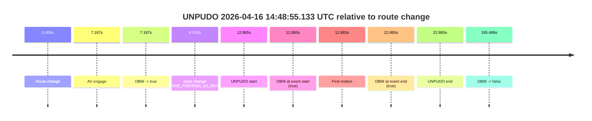
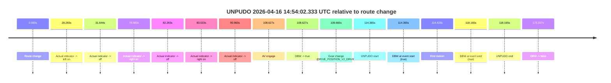
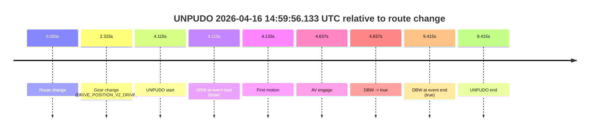

# Run Report: fme10011/2026-04-16--14-17-15--gen2-av-75aea222-2da3-4f92-a4b7-a7383009bf4e

| Field | Value |
|---|---|
| Run ID | `fme10011/2026-04-16--14-17-15--gen2-av-75aea222-2da3-4f92-a4b7-a7383009bf4e` |
| Date | `2026-04-16` |
| Model(s) | `armadillo-amethyst-squeaky` |
| Author | `guy.geva` |
| Event count | `3` |

## unpudo 2026-04-16 14:48:55.133 UTC

| Field | Value |
|---|---|
| Model | `armadillo-amethyst-squeaky` |
| Author | `guy.geva` |
| Run ID | `fme10011/2026-04-16--14-17-15--gen2-av-75aea222-2da3-4f92-a4b7-a7383009bf4e` |
| Date | `2026-04-16` |
| Time (UTC) | `14:48:55.133` |
| Event type | `unpudo` |
| Disengagement type | `none observed` |
| Route change | `found` |
| Console | [run](https://console.sso.wayve.ai/run/fme10011/2026-04-16--14-17-15--gen2-av-75aea222-2da3-4f92-a4b7-a7383009bf4e?id=&time-unixus=1776350935133310) |
| Foxglove | [segment](https://app.foxglove.dev/wayve-on-prem/p/prj_0dX18KZdVHg1fmmI/view?ds=foxglove-stream&ds.deviceName=fme10011&ds.start=2026-04-16T14%3A48%3A32.268532Z&ds.end=2026-04-16T14%3A52%3A07.756363Z&layoutId=lay_0e7VD4WIKDQGU73Y&time=2026-04-16T14%3A48%3A55.133310Z) |

### Event card: pass

- Pass: AV owns the credited unpudo through the official event window, the gear state is aligned at the anchor, and the vehicle moves without driver accelerator help in AV.

| Event | Time (UTC) | Delta from route change |
|---|---:|---:|
| Route change | 2026-04-16 14:48:42.268 | `0.000s` |
| AV engage | 2026-04-16 14:48:49.455 | `7.187s` |
| DBW -> true | 2026-04-16 14:48:49.455 | `7.187s` |
| Gear change (DRIVE_POSITION_V2_DRIVE) | 2026-04-16 14:48:50.783 | `8.515s` |
| UNPUDO start | 2026-04-16 14:48:55.133 | `12.865s` |
| DBW at event start (true) | 2026-04-16 14:48:55.133 | `12.865s` |
| First motion | 2026-04-16 14:48:55.151 | `12.883s` |
| DBW at event end (true) | 2026-04-16 14:49:05.133 | `22.865s` |
| UNPUDO end | 2026-04-16 14:49:05.133 | `22.865s` |
| DBW -> false | 2026-04-16 14:51:57.756 | `195.488s` |

| Metric | Value |
|---|---|
| Outcome | `pass` |
| Effective failure type | `none` |
| Route change status | `found` |
| DBW at event start | `true` |
| DBW at event end | `true` |
| Predicted gear at AV start | `DRIVE_POSITION_V2_PARK` |
| Actual gear at AV start | `DRIVE_POSITION_V2_PARK` |
| Predicted gear at event start | `DRIVE_POSITION_V2_DRIVE` |
| Actual gear at event start | `DRIVE_POSITION_V2_DRIVE` |
| Planned indicator direction | `INDICATORS_STATE_V2_OFF` |
| Controller indicator direction | `INDICATORS_STATE_V2_OFF` |
| Actual indicator direction | `INDICATORS_STATE_V2_OFF` |
| Actual indicator at maneuver end | `INDICATORS_STATE_V2_OFF` |
| Driver accel help in AV | `false` |
| Driver accel help timestamp | `n/a` |
| Max accel pedal pct in AV | `0.0%` |
| Max brake pedal pct in AV | `0.0%` |
| Max speed mps in AV | `2.786` |
| Success timing baseline | `route change` |
| Route -> AV | `7.187s` |
| AV -> event start | `5.678s` |
| AV -> first motion | `5.696s` |
| Success baseline -> event start | `12.865s` |
| Success baseline -> first motion | `12.883s` |
| AV duration before disengagement | `188.301s` |
| Trajectory waypoint count | `37` |
| Driving-plan step count | `11` |

The scored portion starts from the AV-owned window, not from the pre-AV setup. Route-change search in the stopped pre-event segment was `found`, with the baseline therefore set to route change. At the event anchor the model predicts `DRIVE_POSITION_V2_DRIVE` and the actual gear is `DRIVE_POSITION_V2_DRIVE`. The effective model outcome is `pass` because `the credited maneuver stays AV-owned through the official event end`.

### Resolution

| Field | Value |
|---|---|
| Final outcome | `pass` |
| Do we agree with this label? | `yes` |
| Source disengagement type | `none observed` |
| Resolved effective failure type | `none` |
| Confidence | `high` |

## unpudo 2026-04-16 14:54:02.333 UTC

| Field | Value |
|---|---|
| Model | `armadillo-amethyst-squeaky` |
| Author | `guy.geva` |
| Run ID | `fme10011/2026-04-16--14-17-15--gen2-av-75aea222-2da3-4f92-a4b7-a7383009bf4e` |
| Date | `2026-04-16` |
| Time (UTC) | `14:54:02.333` |
| Event type | `unpudo` |
| Disengagement type | `none observed` |
| Route change | `found` |
| Console | [run](https://console.sso.wayve.ai/run/fme10011/2026-04-16--14-17-15--gen2-av-75aea222-2da3-4f92-a4b7-a7383009bf4e?id=&time-unixus=1776351242333303) |
| Foxglove | [segment](https://app.foxglove.dev/wayve-on-prem/p/prj_0dX18KZdVHg1fmmI/view?ds=foxglove-stream&ds.deviceName=fme10011&ds.start=2026-04-16T14%3A51%3A57.968259Z&ds.end=2026-04-16T14%3A55%3A11.175124Z&layoutId=lay_0e7VD4WIKDQGU73Y&time=2026-04-16T14%3A54%3A02.333303Z) |

### Event card: pass

- Pass: AV owns the credited unpudo through the official event window, the gear state is aligned at the anchor, and the vehicle moves without driver accelerator help in AV.

| Event | Time (UTC) | Delta from route change |
|---|---:|---:|
| Route change | 2026-04-16 14:52:07.968 | `0.000s` |
| Actual indicator -> left on | 2026-04-16 14:52:36.251 | `28.283s` |
| Actual indicator -> off | 2026-04-16 14:52:39.611 | `31.644s` |
| Actual indicator -> right on | 2026-04-16 14:53:27.551 | `79.583s` |
| Actual indicator -> off | 2026-04-16 14:53:30.251 | `82.283s` |
| Actual indicator -> right on | 2026-04-16 14:53:30.991 | `83.023s` |
| Actual indicator -> off | 2026-04-16 14:53:38.931 | `90.963s` |
| AV engage | 2026-04-16 14:53:56.595 | `108.627s` |
| DBW -> true | 2026-04-16 14:53:56.595 | `108.627s` |
| Gear change (DRIVE_POSITION_V2_DRIVE) | 2026-04-16 14:53:57.633 | `109.665s` |
| UNPUDO start | 2026-04-16 14:54:02.333 | `114.365s` |
| DBW at event start (true) | 2026-04-16 14:54:02.333 | `114.365s` |
| First motion | 2026-04-16 14:54:02.391 | `114.423s` |
| DBW at event end (true) | 2026-04-16 14:54:06.133 | `118.165s` |
| UNPUDO end | 2026-04-16 14:54:06.133 | `118.165s` |
| DBW -> false | 2026-04-16 14:55:01.175 | `173.207s` |

| Metric | Value |
|---|---|
| Outcome | `pass` |
| Effective failure type | `none` |
| Route change status | `found` |
| DBW at event start | `true` |
| DBW at event end | `true` |
| Predicted gear at AV start | `DRIVE_POSITION_V2_PARK` |
| Actual gear at AV start | `DRIVE_POSITION_V2_PARK` |
| Predicted gear at event start | `DRIVE_POSITION_V2_DRIVE` |
| Actual gear at event start | `DRIVE_POSITION_V2_DRIVE` |
| Planned indicator direction | `INDICATORS_STATE_V2_LEFT_ON` |
| Controller indicator direction | `INDICATORS_STATE_V2_LEFT_ON` |
| Actual indicator direction | `INDICATORS_STATE_V2_OFF` |
| Actual indicator at maneuver end | `INDICATORS_STATE_V2_OFF` |
| Driver accel help in AV | `false` |
| Driver accel help timestamp | `n/a` |
| Max accel pedal pct in AV | `0.0%` |
| Max brake pedal pct in AV | `0.0%` |
| Max speed mps in AV | `4.692` |
| Success timing baseline | `route change` |
| Route -> AV | `108.627s` |
| AV -> event start | `5.738s` |
| AV -> first motion | `5.796s` |
| Success baseline -> event start | `114.365s` |
| Success baseline -> first motion | `114.423s` |
| AV duration before disengagement | `64.580s` |
| Trajectory waypoint count | `37` |
| Driving-plan step count | `11` |

The scored portion starts from the AV-owned window, not from the pre-AV setup. Route-change search in the stopped pre-event segment was `found`, with the baseline therefore set to route change. At the event anchor the model predicts `DRIVE_POSITION_V2_DRIVE` and the actual gear is `DRIVE_POSITION_V2_DRIVE`. The effective model outcome is `pass` because `the credited maneuver stays AV-owned through the official event end`.

### Resolution

| Field | Value |
|---|---|
| Final outcome | `pass` |
| Do we agree with this label? | `yes` |
| Source disengagement type | `none observed` |
| Resolved effective failure type | `none` |
| Confidence | `high` |

## unpudo 2026-04-16 14:59:56.133 UTC

| Field | Value |
|---|---|
| Model | `armadillo-amethyst-squeaky` |
| Author | `guy.geva` |
| Run ID | `fme10011/2026-04-16--14-17-15--gen2-av-75aea222-2da3-4f92-a4b7-a7383009bf4e` |
| Date | `2026-04-16` |
| Time (UTC) | `14:59:56.133` |
| Event type | `unpudo` |
| Disengagement type | `none observed` |
| Route change | `found` |
| Console | [run](https://console.sso.wayve.ai/run/fme10011/2026-04-16--14-17-15--gen2-av-75aea222-2da3-4f92-a4b7-a7383009bf4e?id=&time-unixus=1776351596133302) |
| Foxglove | [segment](https://app.foxglove.dev/wayve-on-prem/p/prj_0dX18KZdVHg1fmmI/view?ds=foxglove-stream&ds.deviceName=fme10011&ds.start=2026-04-16T14%3A59%3A42.018309Z&ds.end=2026-04-16T15%3A00%3A11.433312Z&layoutId=lay_0e7VD4WIKDQGU73Y&time=2026-04-16T14%3A59%3A56.133302Z) |

### Event card: pass

- Pass: AV owns the credited unpudo through the official event window, the gear state is aligned at the anchor, and the vehicle moves without driver accelerator help in AV.

| Event | Time (UTC) | Delta from route change |
|---|---:|---:|
| Route change | 2026-04-16 14:59:52.018 | `0.000s` |
| Gear change (DRIVE_POSITION_V2_DRIVE) | 2026-04-16 14:59:54.333 | `2.315s` |
| UNPUDO start | 2026-04-16 14:59:56.133 | `4.115s` |
| DBW at event start (false) | 2026-04-16 14:59:56.133 | `4.115s` |
| First motion | 2026-04-16 14:59:56.151 | `4.133s` |
| AV engage | 2026-04-16 14:59:56.655 | `4.637s` |
| DBW -> true | 2026-04-16 14:59:56.655 | `4.637s` |
| DBW at event end (true) | 2026-04-16 15:00:01.433 | `9.415s` |
| UNPUDO end | 2026-04-16 15:00:01.433 | `9.415s` |

| Metric | Value |
|---|---|
| Outcome | `pass` |
| Effective failure type | `none` |
| Route change status | `found` |
| DBW at event start | `false` |
| DBW at event end | `true` |
| Predicted gear at AV start | `DRIVE_POSITION_V2_DRIVE` |
| Actual gear at AV start | `DRIVE_POSITION_V2_DRIVE` |
| Predicted gear at event start | `DRIVE_POSITION_V2_DRIVE` |
| Actual gear at event start | `DRIVE_POSITION_V2_DRIVE` |
| Planned indicator direction | `INDICATORS_STATE_V2_OFF` |
| Controller indicator direction | `INDICATORS_STATE_V2_OFF` |
| Actual indicator direction | `INDICATORS_STATE_V2_OFF` |
| Actual indicator at maneuver end | `INDICATORS_STATE_V2_OFF` |
| Driver accel help in AV | `false` |
| Driver accel help timestamp | `n/a` |
| Max accel pedal pct in AV | `0.0%` |
| Max brake pedal pct in AV | `0.0%` |
| Max speed mps in AV | `3.997` |
| Success timing baseline | `route change` |
| Route -> AV | `4.637s` |
| AV -> event start | `-0.522s` |
| AV -> first motion | `-0.504s` |
| Success baseline -> event start | `4.115s` |
| Success baseline -> first motion | `4.133s` |
| AV duration before disengagement | `n/a` |
| Trajectory waypoint count | `35` |
| Driving-plan step count | `11` |

The scored portion starts from the AV-owned window, not from the pre-AV setup. Route-change search in the stopped pre-event segment was `found`, with the baseline therefore set to route change. At the event anchor the model predicts `DRIVE_POSITION_V2_DRIVE` and the actual gear is `DRIVE_POSITION_V2_DRIVE`. The effective model outcome is `pass` because `the credited maneuver stays AV-owned through the official event end`.

### Resolution

| Field | Value |
|---|---|
| Final outcome | `pass` |
| Do we agree with this label? | `yes` |
| Source disengagement type | `none observed` |
| Resolved effective failure type | `none` |
| Confidence | `high` |
