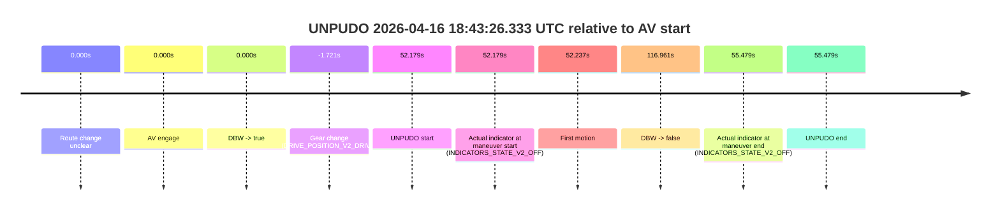
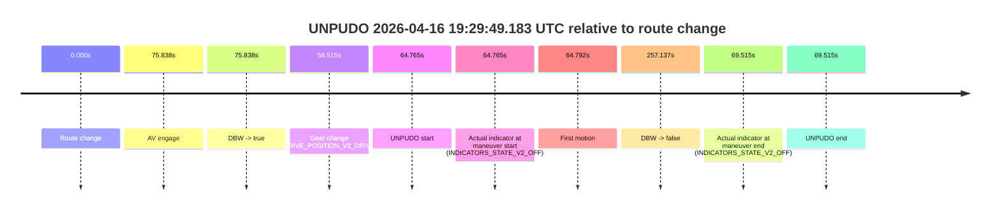
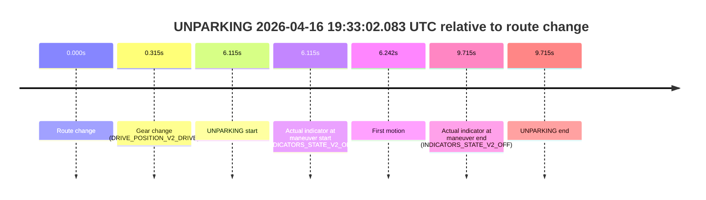

# Run Report: fme10011/2026-04-16--18-36-51--gen2-av-35e602d1-54e9-4c55-9dd8-bcce132302cd

| Field | Value |
|---|---|
| Run ID | `fme10011/2026-04-16--18-36-51--gen2-av-35e602d1-54e9-4c55-9dd8-bcce132302cd` |
| Date | `2026-04-16` |
| Model(s) | `satisfied-amber-moose` |
| Author | `guy.geva` |
| Event count | `8` |

## unpudo 2026-04-16 18:43:26.333 UTC

| Field | Value |
|---|---|
| Model | `satisfied-amber-moose` |
| Author | `guy.geva` |
| Run ID | `fme10011/2026-04-16--18-36-51--gen2-av-35e602d1-54e9-4c55-9dd8-bcce132302cd` |
| Date | `2026-04-16` |
| Time (UTC) | `18:43:26.333` |
| Event type | `unpudo` |
| Disengagement type | `none observed` |
| Route change | `unclear` |
| Console | [run](https://console.sso.wayve.ai/run/fme10011/2026-04-16--18-36-51--gen2-av-35e602d1-54e9-4c55-9dd8-bcce132302cd?id=&time-unixus=1776365006333330) |
| Foxglove | [segment](https://app.foxglove.dev/wayve-on-prem/p/prj_0dX18KZdVHg1fmmI/view?ds=foxglove-stream&ds.deviceName=fme10011&ds.start=2026-04-16T18%3A42%3A22.433316Z&ds.end=2026-04-16T18%3A44%3A41.114674Z&layoutId=lay_0e7VD4WIKDQGU73Y&time=2026-04-16T18%3A43%3A26.333330Z) |

### Event card: pass

- Pass: AV owns the credited unpudo through the official event window, the gear state is aligned at the anchor, and the vehicle moves without driver accelerator help in AV.

| Event | Time (UTC) | Delta from AV start |
|---|---:|---:|
| Route change unclear | 2026-04-16 18:42:34.154 | `0.000s` |
| AV engage | 2026-04-16 18:42:34.154 | `0.000s` |
| DBW -> true | 2026-04-16 18:42:34.154 | `0.000s` |
| Gear change (DRIVE_POSITION_V2_DRIVE) | 2026-04-16 18:42:32.433 | `-1.721s` |
| UNPUDO start | 2026-04-16 18:43:26.333 | `52.179s` |
| Actual indicator at maneuver start (INDICATORS_STATE_V2_OFF) | 2026-04-16 18:43:26.333 | `52.179s` |
| First motion | 2026-04-16 18:43:26.390 | `52.237s` |
| DBW -> false | 2026-04-16 18:44:31.114 | `116.961s` |
| Actual indicator at maneuver end (INDICATORS_STATE_V2_OFF) | 2026-04-16 18:43:29.633 | `55.479s` |
| UNPUDO end | 2026-04-16 18:43:29.633 | `55.479s` |

| Metric | Value |
|---|---|
| Outcome | `pass` |
| Effective failure type | `none` |
| Route change status | `unclear` |
| DBW at event start | `true` |
| DBW at event end | `true` |
| Predicted gear at AV start | `DRIVE_POSITION_V2_DRIVE` |
| Actual gear at AV start | `DRIVE_POSITION_V2_DRIVE` |
| Predicted gear at event start | `DRIVE_POSITION_V2_DRIVE` |
| Actual gear at event start | `DRIVE_POSITION_V2_DRIVE` |
| Planned indicator direction | `INDICATORS_STATE_V2_OFF` |
| Controller indicator direction | `INDICATORS_STATE_V2_OFF` |
| Actual indicator direction | `INDICATORS_STATE_V2_OFF` |
| Actual indicator at maneuver end | `INDICATORS_STATE_V2_OFF` |
| Driver accel help in AV | `false` |
| Driver accel help timestamp | `n/a` |
| Max accel pedal pct in AV | `0.0%` |
| Max brake pedal pct in AV | `8.0%` |
| Max speed mps in AV | `5.864` |
| Route -> AV | `n/a` |
| AV -> event start | `52.179s` |
| AV -> first motion | `52.237s` |
| AV duration before disengagement | `116.961s` |
| Trajectory waypoint count | `35` |
| Driving-plan step count | `11` |

The scored portion starts from the AV-owned window, not from the pre-AV setup. Route-change search in the stopped pre-event segment was `unclear`, with the baseline therefore set to AV start. At the event anchor the model predicts `DRIVE_POSITION_V2_DRIVE` and the actual gear is `DRIVE_POSITION_V2_DRIVE`. The effective model outcome is `pass` because `the credited maneuver stays AV-owned through the official event end`.

### Resolution

| Field | Value |
|---|---|
| Final outcome | `pass` |
| Do we agree with this label? | `yes` |
| Source disengagement type | `none observed` |
| Resolved effective failure type | `none` |
| Confidence | `medium` |

## unpudo 2026-04-16 19:16:07.633 UTC

| Field | Value |
|---|---|
| Model | `satisfied-amber-moose` |
| Author | `guy.geva` |
| Run ID | `fme10011/2026-04-16--18-36-51--gen2-av-35e602d1-54e9-4c55-9dd8-bcce132302cd` |
| Date | `2026-04-16` |
| Time (UTC) | `19:16:07.633` |
| Event type | `unpudo` |
| Disengagement type | `failed_to_accelerate` |
| Route change | `found` |
| Console | [run](https://console.sso.wayve.ai/run/fme10011/2026-04-16--18-36-51--gen2-av-35e602d1-54e9-4c55-9dd8-bcce132302cd?id=&time-unixus=1776366967633321) |
| Foxglove | [segment](https://app.foxglove.dev/wayve-on-prem/p/prj_0dX18KZdVHg1fmmI/view?ds=foxglove-stream&ds.deviceName=fme10011&ds.start=2026-04-16T19%3A15%3A50.568264Z&ds.end=2026-04-16T19%3A18%3A11.635260Z&layoutId=lay_0e7VD4WIKDQGU73Y&time=2026-04-16T19%3A16%3A07.633321Z) |

### Event card: accidental

- Accidental: AV ownership is present for less than `2s`, so this is treated as an accidental brush with the maneuver rather than a meaningful model attempt.

| Event | Time (UTC) | Delta from route change |
|---|---:|---:|
| Route change | 2026-04-16 19:16:00.568 | `0.000s` |
| AV engage | 2026-04-16 19:16:34.334 | `33.766s` |
| DBW -> true | 2026-04-16 19:16:34.334 | `33.766s` |
| Gear change (DRIVE_POSITION_V2_DRIVE) | 2026-04-16 19:16:00.883 | `0.315s` |
| UNPUDO start | 2026-04-16 19:16:07.633 | `7.065s` |
| Actual indicator at maneuver start (INDICATORS_STATE_V2_OFF) | 2026-04-16 19:16:07.633 | `7.065s` |
| First motion | 2026-04-16 19:16:07.691 | `7.123s` |
| DBW -> false | 2026-04-16 19:18:01.635 | `121.067s` |
| Actual indicator at maneuver end (INDICATORS_STATE_V2_OFF) | 2026-04-16 19:16:29.533 | `28.965s` |
| UNPUDO end | 2026-04-16 19:16:29.533 | `28.965s` |

| Metric | Value |
|---|---|
| Outcome | `accidental` |
| Effective failure type | `none` |
| Route change status | `found` |
| DBW at event start | `false` |
| DBW at event end | `false` |
| Predicted gear at AV start | `DRIVE_POSITION_V2_DRIVE` |
| Actual gear at AV start | `DRIVE_POSITION_V2_DRIVE` |
| Predicted gear at event start | `DRIVE_POSITION_V2_DRIVE` |
| Actual gear at event start | `DRIVE_POSITION_V2_DRIVE` |
| Planned indicator direction | `INDICATORS_STATE_V2_LEFT_ON` |
| Controller indicator direction | `INDICATORS_STATE_V2_LEFT_ON` |
| Actual indicator direction | `INDICATORS_STATE_V2_OFF` |
| Actual indicator at maneuver end | `INDICATORS_STATE_V2_OFF` |
| Driver accel help in AV | `false` |
| Driver accel help timestamp | `n/a` |
| Max accel pedal pct in AV | `0.0%` |
| Max brake pedal pct in AV | `0.0%` |
| Max speed mps in AV | `0.000` |
| Route -> AV | `33.766s` |
| AV -> event start | `-26.701s` |
| AV -> first motion | `-26.644s` |
| AV duration before disengagement | `87.301s` |
| Trajectory waypoint count | `35` |
| Driving-plan step count | `11` |

The scored portion starts from the AV-owned window, not from the pre-AV setup. Route-change search in the stopped pre-event segment was `found`, with the baseline therefore set to route change. At the event anchor the model predicts `DRIVE_POSITION_V2_DRIVE` and the actual gear is `DRIVE_POSITION_V2_DRIVE`. The effective model outcome is `accidental` because `the AV-owned portion is shorter than 2s`.

### Resolution

| Field | Value |
|---|---|
| Final outcome | `accidental` |
| Do we agree with this label? | `yes` |
| Source disengagement type | `failed_to_accelerate` |
| Resolved effective failure type | `none` |
| Confidence | `high` |

## unpudo 2026-04-16 19:19:23.883 UTC

| Field | Value |
|---|---|
| Model | `satisfied-amber-moose` |
| Author | `guy.geva` |
| Run ID | `fme10011/2026-04-16--18-36-51--gen2-av-35e602d1-54e9-4c55-9dd8-bcce132302cd` |
| Date | `2026-04-16` |
| Time (UTC) | `19:19:23.883` |
| Event type | `unpudo` |
| Disengagement type | `failed_to_accelerate` |
| Route change | `found` |
| Console | [run](https://console.sso.wayve.ai/run/fme10011/2026-04-16--18-36-51--gen2-av-35e602d1-54e9-4c55-9dd8-bcce132302cd?id=&time-unixus=1776367163883297) |
| Foxglove | [segment](https://app.foxglove.dev/wayve-on-prem/p/prj_0dX18KZdVHg1fmmI/view?ds=foxglove-stream&ds.deviceName=fme10011&ds.start=2026-04-16T19%3A19%3A05.418384Z&ds.end=2026-04-16T19%3A19%3A47.335706Z&layoutId=lay_0e7VD4WIKDQGU73Y&time=2026-04-16T19%3A19%3A23.883297Z) |

### Event card: accidental

- Accidental: AV ownership is present for less than `2s`, so this is treated as an accidental brush with the maneuver rather than a meaningful model attempt.

| Event | Time (UTC) | Delta from route change |
|---|---:|---:|
| Route change | 2026-04-16 19:19:15.418 | `0.000s` |
| AV engage | 2026-04-16 19:19:31.394 | `15.976s` |
| DBW -> true | 2026-04-16 19:19:31.394 | `15.976s` |
| Gear change (DRIVE_POSITION_V2_DRIVE) | 2026-04-16 19:19:15.683 | `0.265s` |
| UNPUDO start | 2026-04-16 19:19:23.883 | `8.465s` |
| Actual indicator at maneuver start (INDICATORS_STATE_V2_OFF) | 2026-04-16 19:19:23.883 | `8.465s` |
| First motion | 2026-04-16 19:19:23.951 | `8.533s` |
| DBW -> false | 2026-04-16 19:19:37.335 | `21.917s` |
| Actual indicator at maneuver end (INDICATORS_STATE_V2_OFF) | 2026-04-16 19:19:27.333 | `11.915s` |
| UNPUDO end | 2026-04-16 19:19:27.333 | `11.915s` |

| Metric | Value |
|---|---|
| Outcome | `accidental` |
| Effective failure type | `none` |
| Route change status | `found` |
| DBW at event start | `false` |
| DBW at event end | `false` |
| Predicted gear at AV start | `DRIVE_POSITION_V2_DRIVE` |
| Actual gear at AV start | `DRIVE_POSITION_V2_DRIVE` |
| Predicted gear at event start | `DRIVE_POSITION_V2_DRIVE` |
| Actual gear at event start | `DRIVE_POSITION_V2_DRIVE` |
| Planned indicator direction | `INDICATORS_STATE_V2_RIGHT_ON` |
| Controller indicator direction | `INDICATORS_STATE_V2_RIGHT_ON` |
| Actual indicator direction | `INDICATORS_STATE_V2_OFF` |
| Actual indicator at maneuver end | `INDICATORS_STATE_V2_OFF` |
| Driver accel help in AV | `false` |
| Driver accel help timestamp | `n/a` |
| Max accel pedal pct in AV | `0.0%` |
| Max brake pedal pct in AV | `0.0%` |
| Max speed mps in AV | `0.000` |
| Route -> AV | `15.976s` |
| AV -> event start | `-7.511s` |
| AV -> first motion | `-7.443s` |
| AV duration before disengagement | `5.941s` |
| Trajectory waypoint count | `36` |
| Driving-plan step count | `11` |

The scored portion starts from the AV-owned window, not from the pre-AV setup. Route-change search in the stopped pre-event segment was `found`, with the baseline therefore set to route change. At the event anchor the model predicts `DRIVE_POSITION_V2_DRIVE` and the actual gear is `DRIVE_POSITION_V2_DRIVE`. The effective model outcome is `accidental` because `the AV-owned portion is shorter than 2s`.

### Resolution

| Field | Value |
|---|---|
| Final outcome | `accidental` |
| Do we agree with this label? | `yes` |
| Source disengagement type | `failed_to_accelerate` |
| Resolved effective failure type | `none` |
| Confidence | `high` |

## unpudo 2026-04-16 19:21:14.233 UTC

| Field | Value |
|---|---|
| Model | `satisfied-amber-moose` |
| Author | `guy.geva` |
| Run ID | `fme10011/2026-04-16--18-36-51--gen2-av-35e602d1-54e9-4c55-9dd8-bcce132302cd` |
| Date | `2026-04-16` |
| Time (UTC) | `19:21:14.233` |
| Event type | `unpudo` |
| Disengagement type | `failed_to_accelerate` |
| Route change | `found` |
| Console | [run](https://console.sso.wayve.ai/run/fme10011/2026-04-16--18-36-51--gen2-av-35e602d1-54e9-4c55-9dd8-bcce132302cd?id=&time-unixus=1776367274233297) |
| Foxglove | [segment](https://app.foxglove.dev/wayve-on-prem/p/prj_0dX18KZdVHg1fmmI/view?ds=foxglove-stream&ds.deviceName=fme10011&ds.start=2026-04-16T19%3A19%3A05.418384Z&ds.end=2026-04-16T19%3A23%3A12.354733Z&layoutId=lay_0e7VD4WIKDQGU73Y&time=2026-04-16T19%3A21%3A14.233297Z) |

### Event card: accidental

- Accidental: AV ownership is present for less than `2s`, so this is treated as an accidental brush with the maneuver rather than a meaningful model attempt.

| Event | Time (UTC) | Delta from route change |
|---|---:|---:|
| Route change | 2026-04-16 19:19:15.418 | `0.000s` |
| AV engage | 2026-04-16 19:21:25.994 | `130.576s` |
| DBW -> true | 2026-04-16 19:21:25.994 | `130.576s` |
| Gear change (DRIVE_POSITION_V2_DRIVE) | 2026-04-16 19:21:06.083 | `110.665s` |
| UNPUDO start | 2026-04-16 19:21:14.233 | `118.815s` |
| Actual indicator at maneuver start (INDICATORS_STATE_V2_OFF) | 2026-04-16 19:21:14.233 | `118.815s` |
| First motion | 2026-04-16 19:21:14.290 | `118.872s` |
| DBW -> false | 2026-04-16 19:23:02.354 | `226.936s` |
| Actual indicator at maneuver end (INDICATORS_STATE_V2_OFF) | 2026-04-16 19:21:18.033 | `122.615s` |
| UNPUDO end | 2026-04-16 19:21:18.033 | `122.615s` |

| Metric | Value |
|---|---|
| Outcome | `accidental` |
| Effective failure type | `none` |
| Route change status | `found` |
| DBW at event start | `false` |
| DBW at event end | `false` |
| Predicted gear at AV start | `DRIVE_POSITION_V2_DRIVE` |
| Actual gear at AV start | `DRIVE_POSITION_V2_DRIVE` |
| Predicted gear at event start | `DRIVE_POSITION_V2_DRIVE` |
| Actual gear at event start | `DRIVE_POSITION_V2_DRIVE` |
| Planned indicator direction | `INDICATORS_STATE_V2_OFF` |
| Controller indicator direction | `INDICATORS_STATE_V2_OFF` |
| Actual indicator direction | `INDICATORS_STATE_V2_OFF` |
| Actual indicator at maneuver end | `INDICATORS_STATE_V2_OFF` |
| Driver accel help in AV | `false` |
| Driver accel help timestamp | `n/a` |
| Max accel pedal pct in AV | `0.0%` |
| Max brake pedal pct in AV | `0.0%` |
| Max speed mps in AV | `0.000` |
| Route -> AV | `130.576s` |
| AV -> event start | `-11.761s` |
| AV -> first motion | `-11.704s` |
| AV duration before disengagement | `96.360s` |
| Trajectory waypoint count | `35` |
| Driving-plan step count | `11` |

The scored portion starts from the AV-owned window, not from the pre-AV setup. Route-change search in the stopped pre-event segment was `found`, with the baseline therefore set to route change. At the event anchor the model predicts `DRIVE_POSITION_V2_DRIVE` and the actual gear is `DRIVE_POSITION_V2_DRIVE`. The effective model outcome is `accidental` because `the AV-owned portion is shorter than 2s`.

### Resolution

| Field | Value |
|---|---|
| Final outcome | `accidental` |
| Do we agree with this label? | `yes` |
| Source disengagement type | `failed_to_accelerate` |
| Resolved effective failure type | `none` |
| Confidence | `high` |

## unpudo 2026-04-16 19:23:39.833 UTC

| Field | Value |
|---|---|
| Model | `satisfied-amber-moose` |
| Author | `guy.geva` |
| Run ID | `fme10011/2026-04-16--18-36-51--gen2-av-35e602d1-54e9-4c55-9dd8-bcce132302cd` |
| Date | `2026-04-16` |
| Time (UTC) | `19:23:39.833` |
| Event type | `unpudo` |
| Disengagement type | `uncategorised` |
| Route change | `found` |
| Console | [run](https://console.sso.wayve.ai/run/fme10011/2026-04-16--18-36-51--gen2-av-35e602d1-54e9-4c55-9dd8-bcce132302cd?id=&time-unixus=1776367419833319) |
| Foxglove | [segment](https://app.foxglove.dev/wayve-on-prem/p/prj_0dX18KZdVHg1fmmI/view?ds=foxglove-stream&ds.deviceName=fme10011&ds.start=2026-04-16T19%3A23%3A15.868269Z&ds.end=2026-04-16T19%3A26%3A41.235049Z&layoutId=lay_0e7VD4WIKDQGU73Y&time=2026-04-16T19%3A23%3A39.833319Z) |

### Event card: accidental

- Accidental: AV ownership is present for less than `2s`, so this is treated as an accidental brush with the maneuver rather than a meaningful model attempt.

| Event | Time (UTC) | Delta from route change |
|---|---:|---:|
| Route change | 2026-04-16 19:23:25.868 | `0.000s` |
| AV engage | 2026-04-16 19:23:46.894 | `21.026s` |
| DBW -> true | 2026-04-16 19:23:46.894 | `21.026s` |
| Gear change (DRIVE_POSITION_V2_DRIVE) | 2026-04-16 19:23:26.083 | `0.215s` |
| UNPUDO start | 2026-04-16 19:23:39.833 | `13.965s` |
| Actual indicator at maneuver start (INDICATORS_STATE_V2_OFF) | 2026-04-16 19:23:39.833 | `13.965s` |
| First motion | 2026-04-16 19:23:39.890 | `14.022s` |
| DBW -> false | 2026-04-16 19:26:31.235 | `185.367s` |
| Actual indicator at maneuver end (INDICATORS_STATE_V2_OFF) | 2026-04-16 19:23:43.783 | `17.915s` |
| UNPUDO end | 2026-04-16 19:23:43.783 | `17.915s` |

| Metric | Value |
|---|---|
| Outcome | `accidental` |
| Effective failure type | `none` |
| Route change status | `found` |
| DBW at event start | `false` |
| DBW at event end | `false` |
| Predicted gear at AV start | `DRIVE_POSITION_V2_DRIVE` |
| Actual gear at AV start | `DRIVE_POSITION_V2_DRIVE` |
| Predicted gear at event start | `DRIVE_POSITION_V2_DRIVE` |
| Actual gear at event start | `DRIVE_POSITION_V2_DRIVE` |
| Planned indicator direction | `INDICATORS_STATE_V2_OFF` |
| Controller indicator direction | `INDICATORS_STATE_V2_OFF` |
| Actual indicator direction | `INDICATORS_STATE_V2_OFF` |
| Actual indicator at maneuver end | `INDICATORS_STATE_V2_OFF` |
| Driver accel help in AV | `false` |
| Driver accel help timestamp | `n/a` |
| Max accel pedal pct in AV | `0.0%` |
| Max brake pedal pct in AV | `0.0%` |
| Max speed mps in AV | `0.000` |
| Route -> AV | `21.026s` |
| AV -> event start | `-7.061s` |
| AV -> first motion | `-7.004s` |
| AV duration before disengagement | `164.340s` |
| Trajectory waypoint count | `37` |
| Driving-plan step count | `11` |

The scored portion starts from the AV-owned window, not from the pre-AV setup. Route-change search in the stopped pre-event segment was `found`, with the baseline therefore set to route change. At the event anchor the model predicts `DRIVE_POSITION_V2_DRIVE` and the actual gear is `DRIVE_POSITION_V2_DRIVE`. The effective model outcome is `accidental` because `the AV-owned portion is shorter than 2s`.

### Resolution

| Field | Value |
|---|---|
| Final outcome | `accidental` |
| Do we agree with this label? | `yes` |
| Source disengagement type | `uncategorised` |
| Resolved effective failure type | `none` |
| Confidence | `high` |

## unpudo 2026-04-16 19:28:56.633 UTC

| Field | Value |
|---|---|
| Model | `satisfied-amber-moose` |
| Author | `guy.geva` |
| Run ID | `fme10011/2026-04-16--18-36-51--gen2-av-35e602d1-54e9-4c55-9dd8-bcce132302cd` |
| Date | `2026-04-16` |
| Time (UTC) | `19:28:56.633` |
| Event type | `unpudo` |
| Disengagement type | `failed_to_accelerate` |
| Route change | `found` |
| Console | [run](https://console.sso.wayve.ai/run/fme10011/2026-04-16--18-36-51--gen2-av-35e602d1-54e9-4c55-9dd8-bcce132302cd?id=&time-unixus=1776367736633305) |
| Foxglove | [segment](https://app.foxglove.dev/wayve-on-prem/p/prj_0dX18KZdVHg1fmmI/view?ds=foxglove-stream&ds.deviceName=fme10011&ds.start=2026-04-16T19%3A28%3A34.418236Z&ds.end=2026-04-16T19%3A29%3A25.894903Z&layoutId=lay_0e7VD4WIKDQGU73Y&time=2026-04-16T19%3A28%3A56.633305Z) |

### Event card: accidental

- Accidental: AV ownership is present for less than `2s`, so this is treated as an accidental brush with the maneuver rather than a meaningful model attempt.

| Event | Time (UTC) | Delta from route change |
|---|---:|---:|
| Route change | 2026-04-16 19:28:44.418 | `0.000s` |
| AV engage | 2026-04-16 19:29:03.955 | `19.538s` |
| DBW -> true | 2026-04-16 19:29:03.955 | `19.538s` |
| Gear change (DRIVE_POSITION_V2_DRIVE) | 2026-04-16 19:28:44.833 | `0.415s` |
| UNPUDO start | 2026-04-16 19:28:56.633 | `12.215s` |
| Actual indicator at maneuver start (INDICATORS_STATE_V2_LEFT_ON) | 2026-04-16 19:28:56.633 | `12.215s` |
| First motion | 2026-04-16 19:28:56.650 | `12.233s` |
| DBW -> false | 2026-04-16 19:29:15.894 | `31.477s` |
| Actual indicator at maneuver end (INDICATORS_STATE_V2_OFF) | 2026-04-16 19:29:00.533 | `16.115s` |
| UNPUDO end | 2026-04-16 19:29:00.533 | `16.115s` |

| Metric | Value |
|---|---|
| Outcome | `accidental` |
| Effective failure type | `none` |
| Route change status | `found` |
| DBW at event start | `false` |
| DBW at event end | `false` |
| Predicted gear at AV start | `DRIVE_POSITION_V2_DRIVE` |
| Actual gear at AV start | `DRIVE_POSITION_V2_DRIVE` |
| Predicted gear at event start | `DRIVE_POSITION_V2_DRIVE` |
| Actual gear at event start | `DRIVE_POSITION_V2_DRIVE` |
| Planned indicator direction | `INDICATORS_STATE_V2_LEFT_ON` |
| Controller indicator direction | `INDICATORS_STATE_V2_OFF` |
| Actual indicator direction | `INDICATORS_STATE_V2_LEFT_ON` |
| Actual indicator at maneuver end | `INDICATORS_STATE_V2_OFF` |
| Driver accel help in AV | `false` |
| Driver accel help timestamp | `n/a` |
| Max accel pedal pct in AV | `0.0%` |
| Max brake pedal pct in AV | `0.0%` |
| Max speed mps in AV | `0.000` |
| Route -> AV | `19.538s` |
| AV -> event start | `-7.323s` |
| AV -> first motion | `-7.305s` |
| AV duration before disengagement | `11.939s` |
| Trajectory waypoint count | `35` |
| Driving-plan step count | `11` |

The scored portion starts from the AV-owned window, not from the pre-AV setup. Route-change search in the stopped pre-event segment was `found`, with the baseline therefore set to route change. At the event anchor the model predicts `DRIVE_POSITION_V2_DRIVE` and the actual gear is `DRIVE_POSITION_V2_DRIVE`. The effective model outcome is `accidental` because `the AV-owned portion is shorter than 2s`.

### Resolution

| Field | Value |
|---|---|
| Final outcome | `accidental` |
| Do we agree with this label? | `yes` |
| Source disengagement type | `failed_to_accelerate` |
| Resolved effective failure type | `none` |
| Confidence | `high` |

## unpudo 2026-04-16 19:29:49.183 UTC

| Field | Value |
|---|---|
| Model | `satisfied-amber-moose` |
| Author | `guy.geva` |
| Run ID | `fme10011/2026-04-16--18-36-51--gen2-av-35e602d1-54e9-4c55-9dd8-bcce132302cd` |
| Date | `2026-04-16` |
| Time (UTC) | `19:29:49.183` |
| Event type | `unpudo` |
| Disengagement type | `failed_to_accelerate` |
| Route change | `found` |
| Console | [run](https://console.sso.wayve.ai/run/fme10011/2026-04-16--18-36-51--gen2-av-35e602d1-54e9-4c55-9dd8-bcce132302cd?id=&time-unixus=1776367789183318) |
| Foxglove | [segment](https://app.foxglove.dev/wayve-on-prem/p/prj_0dX18KZdVHg1fmmI/view?ds=foxglove-stream&ds.deviceName=fme10011&ds.start=2026-04-16T19%3A28%3A34.418236Z&ds.end=2026-04-16T19%3A33%3A11.554925Z&layoutId=lay_0e7VD4WIKDQGU73Y&time=2026-04-16T19%3A29%3A49.183318Z) |

### Event card: accidental

- Accidental: AV ownership is present for less than `2s`, so this is treated as an accidental brush with the maneuver rather than a meaningful model attempt.

| Event | Time (UTC) | Delta from route change |
|---|---:|---:|
| Route change | 2026-04-16 19:28:44.418 | `0.000s` |
| AV engage | 2026-04-16 19:30:00.255 | `75.838s` |
| DBW -> true | 2026-04-16 19:30:00.255 | `75.838s` |
| Gear change (DRIVE_POSITION_V2_DRIVE) | 2026-04-16 19:29:42.933 | `58.515s` |
| UNPUDO start | 2026-04-16 19:29:49.183 | `64.765s` |
| Actual indicator at maneuver start (INDICATORS_STATE_V2_OFF) | 2026-04-16 19:29:49.183 | `64.765s` |
| First motion | 2026-04-16 19:29:49.210 | `64.792s` |
| DBW -> false | 2026-04-16 19:33:01.554 | `257.137s` |
| Actual indicator at maneuver end (INDICATORS_STATE_V2_OFF) | 2026-04-16 19:29:53.933 | `69.515s` |
| UNPUDO end | 2026-04-16 19:29:53.933 | `69.515s` |

| Metric | Value |
|---|---|
| Outcome | `accidental` |
| Effective failure type | `none` |
| Route change status | `found` |
| DBW at event start | `false` |
| DBW at event end | `false` |
| Predicted gear at AV start | `DRIVE_POSITION_V2_DRIVE` |
| Actual gear at AV start | `DRIVE_POSITION_V2_DRIVE` |
| Predicted gear at event start | `DRIVE_POSITION_V2_DRIVE` |
| Actual gear at event start | `DRIVE_POSITION_V2_DRIVE` |
| Planned indicator direction | `INDICATORS_STATE_V2_RIGHT_ON` |
| Controller indicator direction | `INDICATORS_STATE_V2_RIGHT_ON` |
| Actual indicator direction | `INDICATORS_STATE_V2_OFF` |
| Actual indicator at maneuver end | `INDICATORS_STATE_V2_OFF` |
| Driver accel help in AV | `false` |
| Driver accel help timestamp | `n/a` |
| Max accel pedal pct in AV | `0.0%` |
| Max brake pedal pct in AV | `0.0%` |
| Max speed mps in AV | `0.000` |
| Route -> AV | `75.838s` |
| AV -> event start | `-11.073s` |
| AV -> first motion | `-11.045s` |
| AV duration before disengagement | `181.299s` |
| Trajectory waypoint count | `36` |
| Driving-plan step count | `11` |

The scored portion starts from the AV-owned window, not from the pre-AV setup. Route-change search in the stopped pre-event segment was `found`, with the baseline therefore set to route change. At the event anchor the model predicts `DRIVE_POSITION_V2_DRIVE` and the actual gear is `DRIVE_POSITION_V2_DRIVE`. The effective model outcome is `accidental` because `the AV-owned portion is shorter than 2s`.

### Resolution

| Field | Value |
|---|---|
| Final outcome | `accidental` |
| Do we agree with this label? | `yes` |
| Source disengagement type | `failed_to_accelerate` |
| Resolved effective failure type | `none` |
| Confidence | `high` |

## unparking 2026-04-16 19:33:02.083 UTC

| Field | Value |
|---|---|
| Model | `satisfied-amber-moose` |
| Author | `guy.geva` |
| Run ID | `fme10011/2026-04-16--18-36-51--gen2-av-35e602d1-54e9-4c55-9dd8-bcce132302cd` |
| Date | `2026-04-16` |
| Time (UTC) | `19:33:02.083` |
| Event type | `unparking` |
| Disengagement type | `end_of_run` |
| Route change | `found` |
| Console | [run](https://console.sso.wayve.ai/run/fme10011/2026-04-16--18-36-51--gen2-av-35e602d1-54e9-4c55-9dd8-bcce132302cd?id=&time-unixus=1776367982083316) |
| Foxglove | [segment](https://app.foxglove.dev/wayve-on-prem/p/prj_0dX18KZdVHg1fmmI/view?ds=foxglove-stream&ds.deviceName=fme10011&ds.start=2026-04-16T19%3A32%3A45.968255Z&ds.end=2026-04-16T19%3A33%3A15.683301Z&layoutId=lay_0e7VD4WIKDQGU73Y&time=2026-04-16T19%3A33%3A02.083316Z) |

### Event card: non-av

- Non-AV: the detected unparking starts outside AV ownership, so it is kept for coverage but excluded from model success / failure scoring.

| Event | Time (UTC) | Delta from route change |
|---|---:|---:|
| Route change | 2026-04-16 19:32:55.968 | `0.000s` |
| Gear change (DRIVE_POSITION_V2_DRIVE) | 2026-04-16 19:32:56.283 | `0.315s` |
| UNPARKING start | 2026-04-16 19:33:02.083 | `6.115s` |
| Actual indicator at maneuver start (INDICATORS_STATE_V2_OFF) | 2026-04-16 19:33:02.083 | `6.115s` |
| First motion | 2026-04-16 19:33:02.210 | `6.242s` |
| Actual indicator at maneuver end (INDICATORS_STATE_V2_OFF) | 2026-04-16 19:33:05.683 | `9.715s` |
| UNPARKING end | 2026-04-16 19:33:05.683 | `9.715s` |

| Metric | Value |
|---|---|
| Outcome | `non-av` |
| Effective failure type | `none` |
| Route change status | `found` |
| DBW at event start | `false` |
| DBW at event end | `false` |
| Predicted gear at AV start | `n/a` |
| Actual gear at AV start | `n/a` |
| Predicted gear at event start | `DRIVE_POSITION_V2_DRIVE` |
| Actual gear at event start | `DRIVE_POSITION_V2_DRIVE` |
| Planned indicator direction | `INDICATORS_STATE_V2_RIGHT_ON` |
| Controller indicator direction | `INDICATORS_STATE_V2_RIGHT_ON` |
| Actual indicator direction | `INDICATORS_STATE_V2_OFF` |
| Actual indicator at maneuver end | `INDICATORS_STATE_V2_OFF` |
| Driver accel help in AV | `false` |
| Driver accel help timestamp | `n/a` |
| Max accel pedal pct in AV | `0.0%` |
| Max brake pedal pct in AV | `0.0%` |
| Max speed mps in AV | `0.000` |
| Route -> AV | `n/a` |
| AV -> event start | `n/a` |
| AV -> first motion | `n/a` |
| AV duration before disengagement | `n/a` |
| Trajectory waypoint count | `36` |
| Driving-plan step count | `11` |

The scored portion starts from the AV-owned window, not from the pre-AV setup. Route-change search in the stopped pre-event segment was `found`, with the baseline therefore set to route change. At the event anchor the model predicts `DRIVE_POSITION_V2_DRIVE` and the actual gear is `DRIVE_POSITION_V2_DRIVE`. The effective model outcome is `non-av` because `the event does not begin in AV ownership`.

### Resolution

| Field | Value |
|---|---|
| Final outcome | `non-av` |
| Do we agree with this label? | `yes` |
| Source disengagement type | `end_of_run` |
| Resolved effective failure type | `none` |
| Confidence | `high` |
