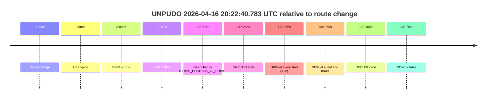
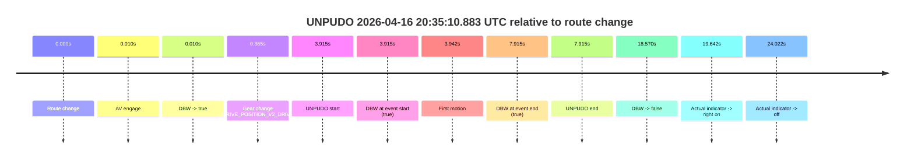
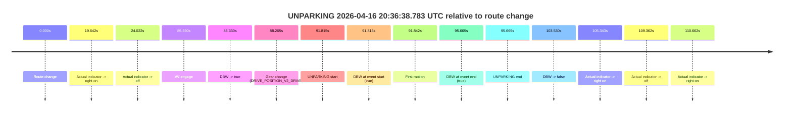

# Run Report: fme10011/2026-04-16--19-51-44--gen2-av-9451145f-3066-4099-93aa-b86d4604bf5a

| Field | Value |
|---|---|
| Run ID | `fme10011/2026-04-16--19-51-44--gen2-av-9451145f-3066-4099-93aa-b86d4604bf5a` |
| Date | `2026-04-16` |
| Model(s) | `eel-teal-outspoken` |
| Author | `zak` |
| Event count | `3` |

## unpudo 2026-04-16 20:22:40.783 UTC

| Field | Value |
|---|---|
| Model | `eel-teal-outspoken` |
| Author | `zak` |
| Run ID | `fme10011/2026-04-16--19-51-44--gen2-av-9451145f-3066-4099-93aa-b86d4604bf5a` |
| Date | `2026-04-16` |
| Time (UTC) | `20:22:40.783` |
| Event type | `unpudo` |
| Disengagement type | `none observed` |
| Route change | `found` |
| Console | [run](https://console.sso.wayve.ai/run/fme10011/2026-04-16--19-51-44--gen2-av-9451145f-3066-4099-93aa-b86d4604bf5a?id=&time-unixus=1776370960783301) |
| Foxglove | [segment](https://app.foxglove.dev/wayve-on-prem/p/prj_0dX18KZdVHg1fmmI/view?ds=foxglove-stream&ds.deviceName=fme10011&ds.start=2026-04-16T20%3A20%3A33.518265Z&ds.end=2026-04-16T20%3A23%3A52.298936Z&layoutId=lay_0e7VD4WIKDQGU73Y&time=2026-04-16T20%3A22%3A40.783301Z) |

### Event card: pass

- Pass: AV owns the credited unpudo from route change through the official unpudo window, the gear state is aligned at the anchor, and the vehicle moves without driver accelerator help in AV.

| Event | Time (UTC) | Delta from route change |
|---|---:|---:|
| Route change | 2026-04-16 20:20:43.518 | `0.000s` |
| AV engage | 2026-04-16 20:20:47.397 | `3.880s` |
| DBW -> true | 2026-04-16 20:20:47.397 | `3.880s` |
| First motion | 2026-04-16 20:20:51.390 | `7.872s` |
| Gear change (DRIVE_POSITION_V2_DRIVE) | 2026-04-16 20:22:37.233 | `113.715s` |
| UNPUDO start | 2026-04-16 20:22:40.783 | `117.265s` |
| DBW at event start (true) | 2026-04-16 20:22:40.783 | `117.265s` |
| DBW at event end (true) | 2026-04-16 20:22:44.483 | `120.965s` |
| UNPUDO end | 2026-04-16 20:22:44.483 | `120.965s` |
| DBW -> false | 2026-04-16 20:23:42.298 | `178.781s` |

| Metric | Value |
|---|---|
| Outcome | `pass` |
| Effective failure type | `none` |
| Route change status | `found` |
| DBW at event start | `true` |
| DBW at event end | `true` |
| Predicted gear at AV start | `DRIVE_POSITION_V2_DRIVE` |
| Actual gear at AV start | `DRIVE_POSITION_V2_PARK` |
| Predicted gear at event start | `DRIVE_POSITION_V2_DRIVE` |
| Actual gear at event start | `DRIVE_POSITION_V2_DRIVE` |
| Planned indicator direction | `INDICATORS_STATE_V2_OFF` |
| Controller indicator direction | `INDICATORS_STATE_V2_OFF` |
| Actual indicator direction | `INDICATORS_STATE_V2_OFF` |
| Actual indicator at maneuver end | `INDICATORS_STATE_V2_OFF` |
| Driver accel help in AV | `false` |
| Driver accel help timestamp | `n/a` |
| Max accel pedal pct in AV | `0.0%` |
| Max brake pedal pct in AV | `9.5%` |
| Max speed mps in AV | `14.828` |
| Success timing baseline | `route change` |
| Route -> AV | `3.880s` |
| AV -> event start | `113.385s` |
| AV -> first motion | `3.993s` |
| Success baseline -> event start | `117.265s` |
| Success baseline -> first motion | `7.872s` |
| AV duration before disengagement | `174.901s` |
| Trajectory waypoint count | `36` |
| Driving-plan step count | `11` |

The scored portion starts from the AV-owned window, not from the pre-AV setup. Route-change search in the stopped pre-event segment was `found`, with the baseline therefore set to route change. At the event anchor the model predicts `DRIVE_POSITION_V2_DRIVE` and the actual gear is `DRIVE_POSITION_V2_DRIVE`. The effective model outcome is `pass` because `the credited unpudo stays AV-owned through the official unpudo window.`

### Resolution

| Field | Value |
|---|---|
| Final outcome | `pass` |
| Do we agree with this label? | `yes` |
| Source disengagement type | `none observed` |
| Resolved effective failure type | `none` |
| Confidence | `high` |

## unpudo 2026-04-16 20:35:10.883 UTC

| Field | Value |
|---|---|
| Model | `eel-teal-outspoken` |
| Author | `zak` |
| Run ID | `fme10011/2026-04-16--19-51-44--gen2-av-9451145f-3066-4099-93aa-b86d4604bf5a` |
| Date | `2026-04-16` |
| Time (UTC) | `20:35:10.883` |
| Event type | `unpudo` |
| Disengagement type | `none observed` |
| Route change | `found` |
| Console | [run](https://console.sso.wayve.ai/run/fme10011/2026-04-16--19-51-44--gen2-av-9451145f-3066-4099-93aa-b86d4604bf5a?id=&time-unixus=1776371710883314) |
| Foxglove | [segment](https://app.foxglove.dev/wayve-on-prem/p/prj_0dX18KZdVHg1fmmI/view?ds=foxglove-stream&ds.deviceName=fme10011&ds.start=2026-04-16T20%3A34%3A56.968266Z&ds.end=2026-04-16T20%3A35%3A35.538164Z&layoutId=lay_0e7VD4WIKDQGU73Y&time=2026-04-16T20%3A35%3A10.883314Z) |

### Event card: pass

- Pass: AV owns the credited unpudo from route change through the official unpudo window, the gear state is aligned at the anchor, and the vehicle moves without driver accelerator help in AV.

| Event | Time (UTC) | Delta from route change |
|---|---:|---:|
| Route change | 2026-04-16 20:35:06.968 | `0.000s` |
| AV engage | 2026-04-16 20:35:06.977 | `0.010s` |
| DBW -> true | 2026-04-16 20:35:06.977 | `0.010s` |
| Gear change (DRIVE_POSITION_V2_DRIVE) | 2026-04-16 20:35:07.333 | `0.365s` |
| UNPUDO start | 2026-04-16 20:35:10.883 | `3.915s` |
| DBW at event start (true) | 2026-04-16 20:35:10.883 | `3.915s` |
| First motion | 2026-04-16 20:35:10.910 | `3.942s` |
| DBW at event end (true) | 2026-04-16 20:35:14.883 | `7.915s` |
| UNPUDO end | 2026-04-16 20:35:14.883 | `7.915s` |
| DBW -> false | 2026-04-16 20:35:25.538 | `18.570s` |
| Actual indicator -> right on | 2026-04-16 20:35:26.610 | `19.642s` |
| Actual indicator -> off | 2026-04-16 20:35:30.990 | `24.022s` |

| Metric | Value |
|---|---|
| Outcome | `pass` |
| Effective failure type | `none` |
| Route change status | `found` |
| DBW at event start | `true` |
| DBW at event end | `true` |
| Predicted gear at AV start | `DRIVE_POSITION_V2_PARK` |
| Actual gear at AV start | `DRIVE_POSITION_V2_PARK` |
| Predicted gear at event start | `DRIVE_POSITION_V2_DRIVE` |
| Actual gear at event start | `DRIVE_POSITION_V2_DRIVE` |
| Planned indicator direction | `INDICATORS_STATE_V2_OFF` |
| Controller indicator direction | `INDICATORS_STATE_V2_OFF` |
| Actual indicator direction | `INDICATORS_STATE_V2_OFF` |
| Actual indicator at maneuver end | `INDICATORS_STATE_V2_OFF` |
| Driver accel help in AV | `false` |
| Driver accel help timestamp | `n/a` |
| Max accel pedal pct in AV | `0.0%` |
| Max brake pedal pct in AV | `8.0%` |
| Max speed mps in AV | `3.439` |
| Success timing baseline | `route change` |
| Route -> AV | `0.010s` |
| AV -> event start | `3.905s` |
| AV -> first motion | `3.933s` |
| Success baseline -> event start | `3.915s` |
| Success baseline -> first motion | `3.942s` |
| AV duration before disengagement | `18.560s` |
| Trajectory waypoint count | `36` |
| Driving-plan step count | `11` |

The scored portion starts from the AV-owned window, not from the pre-AV setup. Route-change search in the stopped pre-event segment was `found`, with the baseline therefore set to route change. At the event anchor the model predicts `DRIVE_POSITION_V2_DRIVE` and the actual gear is `DRIVE_POSITION_V2_DRIVE`. The effective model outcome is `pass` because `the credited unpudo stays AV-owned through the official unpudo window.`

### Resolution

| Field | Value |
|---|---|
| Final outcome | `pass` |
| Do we agree with this label? | `yes` |
| Source disengagement type | `none observed` |
| Resolved effective failure type | `none` |
| Confidence | `high` |

## unparking 2026-04-16 20:36:38.783 UTC

| Field | Value |
|---|---|
| Model | `eel-teal-outspoken` |
| Author | `zak` |
| Run ID | `fme10011/2026-04-16--19-51-44--gen2-av-9451145f-3066-4099-93aa-b86d4604bf5a` |
| Date | `2026-04-16` |
| Time (UTC) | `20:36:38.783` |
| Event type | `unparking` |
| Disengagement type | `none observed` |
| Route change | `found` |
| Console | [run](https://console.sso.wayve.ai/run/fme10011/2026-04-16--19-51-44--gen2-av-9451145f-3066-4099-93aa-b86d4604bf5a?id=&time-unixus=1776371798783315) |
| Foxglove | [segment](https://app.foxglove.dev/wayve-on-prem/p/prj_0dX18KZdVHg1fmmI/view?ds=foxglove-stream&ds.deviceName=fme10011&ds.start=2026-04-16T20%3A34%3A56.968266Z&ds.end=2026-04-16T20%3A37%3A00.497986Z&layoutId=lay_0e7VD4WIKDQGU73Y&time=2026-04-16T20%3A36%3A38.783315Z) |

### Event card: pass

- Pass: AV owns the credited unparking through the official event window, the gear state is aligned at the anchor, and the vehicle moves without driver accelerator help in AV.

| Event | Time (UTC) | Delta from route change |
|---|---:|---:|
| Route change | 2026-04-16 20:35:06.968 | `0.000s` |
| Actual indicator -> right on | 2026-04-16 20:35:26.610 | `19.642s` |
| Actual indicator -> off | 2026-04-16 20:35:30.990 | `24.022s` |
| AV engage | 2026-04-16 20:36:32.297 | `85.330s` |
| DBW -> true | 2026-04-16 20:36:32.297 | `85.330s` |
| Gear change (DRIVE_POSITION_V2_DRIVE) | 2026-04-16 20:36:35.233 | `88.265s` |
| UNPARKING start | 2026-04-16 20:36:38.783 | `91.815s` |
| DBW at event start (true) | 2026-04-16 20:36:38.783 | `91.815s` |
| First motion | 2026-04-16 20:36:38.810 | `91.842s` |
| DBW at event end (true) | 2026-04-16 20:36:42.633 | `95.665s` |
| UNPARKING end | 2026-04-16 20:36:42.633 | `95.665s` |
| DBW -> false | 2026-04-16 20:36:50.497 | `103.530s` |
| Actual indicator -> right on | 2026-04-16 20:36:52.311 | `105.343s` |
| Actual indicator -> off | 2026-04-16 20:36:56.330 | `109.362s` |
| Actual indicator -> right on | 2026-04-16 20:36:57.630 | `110.662s` |

| Metric | Value |
|---|---|
| Outcome | `pass` |
| Effective failure type | `none` |
| Route change status | `found` |
| DBW at event start | `true` |
| DBW at event end | `true` |
| Predicted gear at AV start | `DRIVE_POSITION_V2_PARK` |
| Actual gear at AV start | `DRIVE_POSITION_V2_PARK` |
| Predicted gear at event start | `DRIVE_POSITION_V2_DRIVE` |
| Actual gear at event start | `DRIVE_POSITION_V2_DRIVE` |
| Planned indicator direction | `INDICATORS_STATE_V2_OFF` |
| Controller indicator direction | `INDICATORS_STATE_V2_OFF` |
| Actual indicator direction | `INDICATORS_STATE_V2_OFF` |
| Actual indicator at maneuver end | `INDICATORS_STATE_V2_OFF` |
| Driver accel help in AV | `false` |
| Driver accel help timestamp | `n/a` |
| Max accel pedal pct in AV | `0.0%` |
| Max brake pedal pct in AV | `0.0%` |
| Max speed mps in AV | `3.519` |
| Success timing baseline | `route change` |
| Route -> AV | `85.330s` |
| AV -> event start | `6.485s` |
| AV -> first motion | `6.513s` |
| Success baseline -> event start | `91.815s` |
| Success baseline -> first motion | `91.842s` |
| AV duration before disengagement | `18.200s` |
| Trajectory waypoint count | `36` |
| Driving-plan step count | `11` |

The scored portion starts from the AV-owned window, not from the pre-AV setup. Route-change search in the stopped pre-event segment was `found`, with the baseline therefore set to route change. At the event anchor the model predicts `DRIVE_POSITION_V2_DRIVE` and the actual gear is `DRIVE_POSITION_V2_DRIVE`. The effective model outcome is `pass` because `the credited maneuver stays AV-owned through the official event end.`

### Resolution

| Field | Value |
|---|---|
| Final outcome | `pass` |
| Do we agree with this label? | `yes` |
| Source disengagement type | `none observed` |
| Resolved effective failure type | `none` |
| Confidence | `high` |
