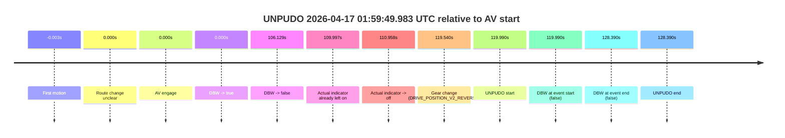

# Run Report: fme10011/2026-04-17--01-24-26--gen2-av-b086790c-ab4a-485a-b03e-af446d59077b

| Field | Value |
|---|---|
| Run ID | `fme10011/2026-04-17--01-24-26--gen2-av-b086790c-ab4a-485a-b03e-af446d59077b` |
| Date | `2026-04-17` |
| Model(s) | `armadillo-amethyst-squeaky` |
| Author | `guy.geva` |
| Event count | `1` |

## unpudo 2026-04-17 01:59:49.983 UTC

| Field | Value |
|---|---|
| Model | `armadillo-amethyst-squeaky` |
| Author | `guy.geva` |
| Run ID | `fme10011/2026-04-17--01-24-26--gen2-av-b086790c-ab4a-485a-b03e-af446d59077b` |
| Date | `2026-04-17` |
| Time (UTC) | `01:59:49.983` |
| Event type | `unpudo` |
| Disengagement type | `none observed` |
| Route change | `unclear` |
| Console | [run](https://console.sso.wayve.ai/run/fme10011/2026-04-17--01-24-26--gen2-av-b086790c-ab4a-485a-b03e-af446d59077b?id=&time-unixus=1776391189983297) |
| Foxglove | [segment](https://app.foxglove.dev/wayve-on-prem/p/prj_0dX18KZdVHg1fmmI/view?ds=foxglove-stream&ds.deviceName=fme10011&ds.start=2026-04-17T01%3A57%3A39.993518Z&ds.end=2026-04-17T02%3A00%3A08.383310Z&layoutId=lay_0e7VD4WIKDQGU73Y&time=2026-04-17T01%3A59%3A49.983297Z) |

### Event card: fail

- Fail: the credited unpudo does not stay AV-owned. The event window starts with DBW false, and the maneuver outcome lands outside a clean AV-owned segment.

| Event | Time (UTC) | Delta from AV start |
|---|---:|---:|
| First motion | 2026-04-17 01:57:49.990 | `-0.003s` |
| Route change unclear | 2026-04-17 01:57:49.993 | `0.000s` |
| AV engage | 2026-04-17 01:57:49.993 | `0.000s` |
| DBW -> true | 2026-04-17 01:57:49.993 | `0.000s` |
| DBW -> false | 2026-04-17 01:59:36.122 | `106.129s` |
| Actual indicator already left on | 2026-04-17 01:59:39.990 | `109.997s` |
| Actual indicator -> off | 2026-04-17 01:59:40.951 | `110.958s` |
| Gear change (DRIVE_POSITION_V2_REVERSE) | 2026-04-17 01:59:49.533 | `119.540s` |
| UNPUDO start | 2026-04-17 01:59:49.983 | `119.990s` |
| DBW at event start (false) | 2026-04-17 01:59:49.983 | `119.990s` |
| DBW at event end (false) | 2026-04-17 01:59:58.383 | `128.390s` |
| UNPUDO end | 2026-04-17 01:59:58.383 | `128.390s` |

| Metric | Value |
|---|---|
| Outcome | `fail` |
| Effective failure type | `completed_outside_av` |
| Route change status | `unclear` |
| DBW at event start | `false` |
| DBW at event end | `false` |
| Predicted gear at AV start | `DRIVE_POSITION_V2_DRIVE` |
| Actual gear at AV start | `DRIVE_POSITION_V2_DRIVE` |
| Predicted gear at event start | `DRIVE_POSITION_V2_REVERSE` |
| Actual gear at event start | `DRIVE_POSITION_V2_REVERSE` |
| Planned indicator direction | `INDICATORS_STATE_V2_OFF` |
| Controller indicator direction | `INDICATORS_STATE_V2_OFF` |
| Actual indicator direction | `INDICATORS_STATE_V2_OFF` |
| Actual indicator at maneuver end | `INDICATORS_STATE_V2_OFF` |
| Driver accel help in AV | `false` |
| Driver accel help timestamp | `n/a` |
| Max accel pedal pct in AV | `0.0%` |
| Max brake pedal pct in AV | `1.0%` |
| Max speed mps in AV | `14.661` |
| Success timing baseline | `AV start` |
| Route -> AV | `n/a` |
| AV -> event start | `119.990s` |
| AV -> first motion | `-0.003s` |
| Success baseline -> event start | `119.990s` |
| Success baseline -> first motion | `-0.003s` |
| AV duration before disengagement | `106.129s` |
| Trajectory waypoint count | `37` |
| Driving-plan step count | `11` |

The scored portion starts from the AV-owned window, not from the pre-AV setup. Route-change search in the stopped pre-event segment was `unclear`, with the baseline therefore set to AV start. At the event anchor the model predicts `DRIVE_POSITION_V2_REVERSE` and the actual gear is `DRIVE_POSITION_V2_REVERSE`. The effective model outcome is `fail` because `completed_outside_av.`

### Resolution

| Field | Value |
|---|---|
| Final outcome | `fail` |
| Do we agree with this label? | `yes` |
| Source disengagement type | `none observed` |
| Resolved effective failure type | `completed_outside_av` |
| Confidence | `medium` |
