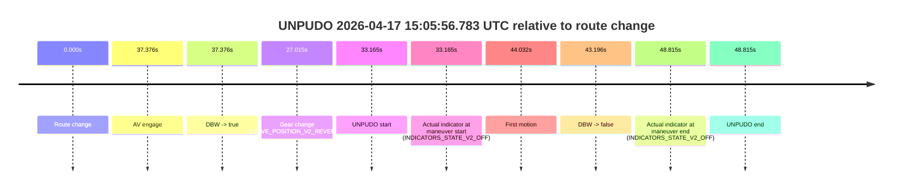
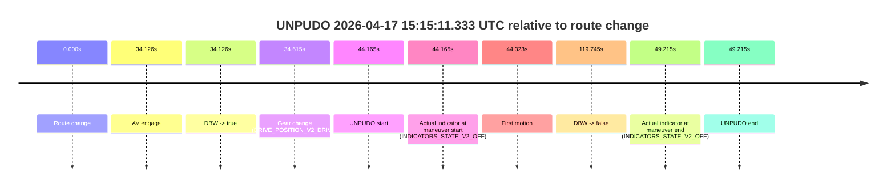
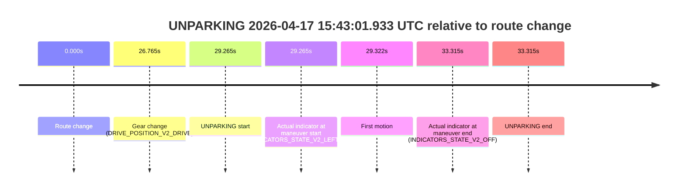

# Run Report: fme10011/2026-04-17--13-42-32--gen2-av-a45e9838-2d06-4645-be3f-0ac2b30217e1

| Field | Value |
|---|---|
| Run ID | `fme10011/2026-04-17--13-42-32--gen2-av-a45e9838-2d06-4645-be3f-0ac2b30217e1` |
| Date | `2026-04-17` |
| Model(s) | `armadillo-amethyst-squeaky` |
| Author | `guy.geva` |
| Event count | `4` |

## unpudo 2026-04-17 14:49:18.633 UTC

| Field | Value |
|---|---|
| Model | `armadillo-amethyst-squeaky` |
| Author | `guy.geva` |
| Run ID | `fme10011/2026-04-17--13-42-32--gen2-av-a45e9838-2d06-4645-be3f-0ac2b30217e1` |
| Date | `2026-04-17` |
| Time (UTC) | `14:49:18.633` |
| Event type | `unpudo` |
| Disengagement type | `none observed` |
| Route change | `found` |
| Console | [run](https://console.sso.wayve.ai/run/fme10011/2026-04-17--13-42-32--gen2-av-a45e9838-2d06-4645-be3f-0ac2b30217e1?id=&time-unixus=1776437358633321) |
| Foxglove | [segment](https://app.foxglove.dev/wayve-on-prem/p/prj_0dX18KZdVHg1fmmI/view?ds=foxglove-stream&ds.deviceName=fme10011&ds.start=2026-04-17T14%3A48%3A38.168281Z&ds.end=2026-04-17T14%3A51%3A12.214034Z&layoutId=lay_0e7VD4WIKDQGU73Y&time=2026-04-17T14%3A49%3A18.633321Z) |

### Event card: pass

- Pass: AV owns the credited unpudo through the official event window, the gear state is aligned at the anchor, and the vehicle moves without driver accelerator help in AV.

| Event | Time (UTC) | Delta from route change |
|---|---:|---:|
| Route change | 2026-04-17 14:48:48.168 | `0.000s` |
| AV engage | 2026-04-17 14:49:13.634 | `25.466s` |
| DBW -> true | 2026-04-17 14:49:13.634 | `25.466s` |
| Gear change (DRIVE_POSITION_V2_DRIVE) | 2026-04-17 14:49:14.133 | `25.965s` |
| UNPUDO start | 2026-04-17 14:49:18.633 | `30.465s` |
| Actual indicator at maneuver start (INDICATORS_STATE_V2_OFF) | 2026-04-17 14:49:18.633 | `30.465s` |
| First motion | 2026-04-17 14:49:18.670 | `30.502s` |
| DBW -> false | 2026-04-17 14:51:02.214 | `134.046s` |
| Actual indicator at maneuver end (INDICATORS_STATE_V2_OFF) | 2026-04-17 14:49:22.383 | `34.215s` |
| UNPUDO end | 2026-04-17 14:49:22.383 | `34.215s` |

| Metric | Value |
|---|---|
| Outcome | `pass` |
| Effective failure type | `none` |
| Route change status | `found` |
| DBW at event start | `true` |
| DBW at event end | `true` |
| Predicted gear at AV start | `DRIVE_POSITION_V2_DRIVE` |
| Actual gear at AV start | `DRIVE_POSITION_V2_PARK` |
| Predicted gear at event start | `DRIVE_POSITION_V2_DRIVE` |
| Actual gear at event start | `DRIVE_POSITION_V2_DRIVE` |
| Planned indicator direction | `INDICATORS_STATE_V2_LEFT_ON` |
| Controller indicator direction | `INDICATORS_STATE_V2_LEFT_ON` |
| Actual indicator direction | `INDICATORS_STATE_V2_OFF` |
| Actual indicator at maneuver end | `INDICATORS_STATE_V2_OFF` |
| Driver accel help in AV | `false` |
| Driver accel help timestamp | `n/a` |
| Max accel pedal pct in AV | `0.0%` |
| Max brake pedal pct in AV | `0.0%` |
| Max speed mps in AV | `4.447` |
| Route -> AV | `25.466s` |
| AV -> event start | `4.999s` |
| AV -> first motion | `5.036s` |
| AV duration before disengagement | `108.580s` |
| Trajectory waypoint count | `36` |
| Driving-plan step count | `11` |

The scored portion starts from the AV-owned window, not from the pre-AV setup. Route-change search in the stopped pre-event segment was `found`, with the baseline therefore set to route change. At the event anchor the model predicts `DRIVE_POSITION_V2_DRIVE` and the actual gear is `DRIVE_POSITION_V2_DRIVE`. The effective model outcome is `pass` because `the credited maneuver stays AV-owned through the official event end`.

### Resolution

| Field | Value |
|---|---|
| Final outcome | `pass` |
| Do we agree with this label? | `yes` |
| Source disengagement type | `none observed` |
| Resolved effective failure type | `none` |
| Confidence | `high` |

## unpudo 2026-04-17 15:05:56.783 UTC

| Field | Value |
|---|---|
| Model | `armadillo-amethyst-squeaky` |
| Author | `guy.geva` |
| Run ID | `fme10011/2026-04-17--13-42-32--gen2-av-a45e9838-2d06-4645-be3f-0ac2b30217e1` |
| Date | `2026-04-17` |
| Time (UTC) | `15:05:56.783` |
| Event type | `unpudo` |
| Disengagement type | `uncategorised` |
| Route change | `found` |
| Console | [run](https://console.sso.wayve.ai/run/fme10011/2026-04-17--13-42-32--gen2-av-a45e9838-2d06-4645-be3f-0ac2b30217e1?id=&time-unixus=1776438356783308) |
| Foxglove | [segment](https://app.foxglove.dev/wayve-on-prem/p/prj_0dX18KZdVHg1fmmI/view?ds=foxglove-stream&ds.deviceName=fme10011&ds.start=2026-04-17T15%3A05%3A13.618272Z&ds.end=2026-04-17T15%3A06%3A22.433296Z&layoutId=lay_0e7VD4WIKDQGU73Y&time=2026-04-17T15%3A05%3A56.783308Z) |

### Event card: fail

- Fail: AV owns part of the segment, but the event still resolves as a model-performance failure under the AV-only scoring rule.

| Event | Time (UTC) | Delta from route change |
|---|---:|---:|
| Route change | 2026-04-17 15:05:23.618 | `0.000s` |
| AV engage | 2026-04-17 15:06:00.994 | `37.376s` |
| DBW -> true | 2026-04-17 15:06:00.994 | `37.376s` |
| Gear change (DRIVE_POSITION_V2_REVERSE) | 2026-04-17 15:05:50.633 | `27.015s` |
| UNPUDO start | 2026-04-17 15:05:56.783 | `33.165s` |
| Actual indicator at maneuver start (INDICATORS_STATE_V2_OFF) | 2026-04-17 15:05:56.783 | `33.165s` |
| First motion | 2026-04-17 15:06:07.650 | `44.032s` |
| DBW -> false | 2026-04-17 15:06:06.814 | `43.196s` |
| Actual indicator at maneuver end (INDICATORS_STATE_V2_OFF) | 2026-04-17 15:06:12.433 | `48.815s` |
| UNPUDO end | 2026-04-17 15:06:12.433 | `48.815s` |

| Metric | Value |
|---|---|
| Outcome | `fail` |
| Effective failure type | `uncategorised` |
| Route change status | `found` |
| DBW at event start | `false` |
| DBW at event end | `false` |
| Predicted gear at AV start | `DRIVE_POSITION_V2_DRIVE` |
| Actual gear at AV start | `DRIVE_POSITION_V2_PARK` |
| Predicted gear at event start | `DRIVE_POSITION_V2_REVERSE` |
| Actual gear at event start | `DRIVE_POSITION_V2_REVERSE` |
| Planned indicator direction | `INDICATORS_STATE_V2_LEFT_ON` |
| Controller indicator direction | `INDICATORS_STATE_V2_LEFT_ON` |
| Actual indicator direction | `INDICATORS_STATE_V2_OFF` |
| Actual indicator at maneuver end | `INDICATORS_STATE_V2_OFF` |
| Driver accel help in AV | `false` |
| Driver accel help timestamp | `n/a` |
| Max accel pedal pct in AV | `0.0%` |
| Max brake pedal pct in AV | `12.0%` |
| Max speed mps in AV | `0.000` |
| Route -> AV | `37.376s` |
| AV -> event start | `-4.211s` |
| AV -> first motion | `6.657s` |
| AV duration before disengagement | `5.820s` |
| Trajectory waypoint count | `37` |
| Driving-plan step count | `11` |

The scored portion starts from the AV-owned window, not from the pre-AV setup. Route-change search in the stopped pre-event segment was `found`, with the baseline therefore set to route change. At the event anchor the model predicts `DRIVE_POSITION_V2_REVERSE` and the actual gear is `DRIVE_POSITION_V2_REVERSE`. The effective model outcome is `fail` because `uncategorised`.

### Resolution

| Field | Value |
|---|---|
| Final outcome | `fail` |
| Do we agree with this label? | `yes` |
| Source disengagement type | `uncategorised` |
| Resolved effective failure type | `uncategorised` |
| Confidence | `high` |

## unpudo 2026-04-17 15:15:11.333 UTC

| Field | Value |
|---|---|
| Model | `armadillo-amethyst-squeaky` |
| Author | `guy.geva` |
| Run ID | `fme10011/2026-04-17--13-42-32--gen2-av-a45e9838-2d06-4645-be3f-0ac2b30217e1` |
| Date | `2026-04-17` |
| Time (UTC) | `15:15:11.333` |
| Event type | `unpudo` |
| Disengagement type | `none observed` |
| Route change | `found` |
| Console | [run](https://console.sso.wayve.ai/run/fme10011/2026-04-17--13-42-32--gen2-av-a45e9838-2d06-4645-be3f-0ac2b30217e1?id=&time-unixus=1776438911333316) |
| Foxglove | [segment](https://app.foxglove.dev/wayve-on-prem/p/prj_0dX18KZdVHg1fmmI/view?ds=foxglove-stream&ds.deviceName=fme10011&ds.start=2026-04-17T15%3A14%3A17.168257Z&ds.end=2026-04-17T15%3A16%3A36.913465Z&layoutId=lay_0e7VD4WIKDQGU73Y&time=2026-04-17T15%3A15%3A11.333316Z) |

### Event card: pass

- Pass: AV owns the credited unpudo through the official event window, the gear state is aligned at the anchor, and the vehicle moves without driver accelerator help in AV.

| Event | Time (UTC) | Delta from route change |
|---|---:|---:|
| Route change | 2026-04-17 15:14:27.168 | `0.000s` |
| AV engage | 2026-04-17 15:15:01.294 | `34.126s` |
| DBW -> true | 2026-04-17 15:15:01.294 | `34.126s` |
| Gear change (DRIVE_POSITION_V2_DRIVE) | 2026-04-17 15:15:01.783 | `34.615s` |
| UNPUDO start | 2026-04-17 15:15:11.333 | `44.165s` |
| Actual indicator at maneuver start (INDICATORS_STATE_V2_OFF) | 2026-04-17 15:15:11.333 | `44.165s` |
| First motion | 2026-04-17 15:15:11.490 | `44.323s` |
| DBW -> false | 2026-04-17 15:16:26.913 | `119.745s` |
| Actual indicator at maneuver end (INDICATORS_STATE_V2_OFF) | 2026-04-17 15:15:16.383 | `49.215s` |
| UNPUDO end | 2026-04-17 15:15:16.383 | `49.215s` |

| Metric | Value |
|---|---|
| Outcome | `pass` |
| Effective failure type | `none` |
| Route change status | `found` |
| DBW at event start | `true` |
| DBW at event end | `true` |
| Predicted gear at AV start | `DRIVE_POSITION_V2_DRIVE` |
| Actual gear at AV start | `DRIVE_POSITION_V2_PARK` |
| Predicted gear at event start | `DRIVE_POSITION_V2_DRIVE` |
| Actual gear at event start | `DRIVE_POSITION_V2_DRIVE` |
| Planned indicator direction | `INDICATORS_STATE_V2_LEFT_ON` |
| Controller indicator direction | `INDICATORS_STATE_V2_LEFT_ON` |
| Actual indicator direction | `INDICATORS_STATE_V2_OFF` |
| Actual indicator at maneuver end | `INDICATORS_STATE_V2_OFF` |
| Driver accel help in AV | `false` |
| Driver accel help timestamp | `n/a` |
| Max accel pedal pct in AV | `0.0%` |
| Max brake pedal pct in AV | `0.0%` |
| Max speed mps in AV | `4.011` |
| Route -> AV | `34.126s` |
| AV -> event start | `10.039s` |
| AV -> first motion | `10.197s` |
| AV duration before disengagement | `85.619s` |
| Trajectory waypoint count | `36` |
| Driving-plan step count | `11` |

The scored portion starts from the AV-owned window, not from the pre-AV setup. Route-change search in the stopped pre-event segment was `found`, with the baseline therefore set to route change. At the event anchor the model predicts `DRIVE_POSITION_V2_DRIVE` and the actual gear is `DRIVE_POSITION_V2_DRIVE`. The effective model outcome is `pass` because `the credited maneuver stays AV-owned through the official event end`.

### Resolution

| Field | Value |
|---|---|
| Final outcome | `pass` |
| Do we agree with this label? | `yes` |
| Source disengagement type | `none observed` |
| Resolved effective failure type | `none` |
| Confidence | `high` |

## unparking 2026-04-17 15:43:01.933 UTC

| Field | Value |
|---|---|
| Model | `armadillo-amethyst-squeaky` |
| Author | `guy.geva` |
| Run ID | `fme10011/2026-04-17--13-42-32--gen2-av-a45e9838-2d06-4645-be3f-0ac2b30217e1` |
| Date | `2026-04-17` |
| Time (UTC) | `15:43:01.933` |
| Event type | `unparking` |
| Disengagement type | `none observed` |
| Route change | `found` |
| Console | [run](https://console.sso.wayve.ai/run/fme10011/2026-04-17--13-42-32--gen2-av-a45e9838-2d06-4645-be3f-0ac2b30217e1?id=&time-unixus=1776440581933299) |
| Foxglove | [segment](https://app.foxglove.dev/wayve-on-prem/p/prj_0dX18KZdVHg1fmmI/view?ds=foxglove-stream&ds.deviceName=fme10011&ds.start=2026-04-17T15%3A42%3A22.668262Z&ds.end=2026-04-17T15%3A43%3A15.983297Z&layoutId=lay_0e7VD4WIKDQGU73Y&time=2026-04-17T15%3A43%3A01.933299Z) |

### Event card: non-av

- Non-AV: there is no AV-owned portion anywhere inside the detected unparking timeline, so it is kept for coverage but excluded from model success / failure scoring.

| Event | Time (UTC) | Delta from route change |
|---|---:|---:|
| Route change | 2026-04-17 15:42:32.668 | `0.000s` |
| Gear change (DRIVE_POSITION_V2_DRIVE) | 2026-04-17 15:42:59.433 | `26.765s` |
| UNPARKING start | 2026-04-17 15:43:01.933 | `29.265s` |
| Actual indicator at maneuver start (INDICATORS_STATE_V2_LEFT_ON) | 2026-04-17 15:43:01.933 | `29.265s` |
| First motion | 2026-04-17 15:43:01.990 | `29.322s` |
| Actual indicator at maneuver end (INDICATORS_STATE_V2_OFF) | 2026-04-17 15:43:05.983 | `33.315s` |
| UNPARKING end | 2026-04-17 15:43:05.983 | `33.315s` |

| Metric | Value |
|---|---|
| Outcome | `non-av` |
| Effective failure type | `none` |
| Route change status | `found` |
| DBW at event start | `false` |
| DBW at event end | `false` |
| Predicted gear at AV start | `n/a` |
| Actual gear at AV start | `n/a` |
| Predicted gear at event start | `DRIVE_POSITION_V2_DRIVE` |
| Actual gear at event start | `DRIVE_POSITION_V2_DRIVE` |
| Planned indicator direction | `INDICATORS_STATE_V2_RIGHT_ON` |
| Controller indicator direction | `INDICATORS_STATE_V2_RIGHT_ON` |
| Actual indicator direction | `INDICATORS_STATE_V2_LEFT_ON` |
| Actual indicator at maneuver end | `INDICATORS_STATE_V2_OFF` |
| Driver accel help in AV | `false` |
| Driver accel help timestamp | `n/a` |
| Max accel pedal pct in AV | `0.0%` |
| Max brake pedal pct in AV | `0.0%` |
| Max speed mps in AV | `0.000` |
| Route -> AV | `n/a` |
| AV -> event start | `n/a` |
| AV -> first motion | `n/a` |
| AV duration before disengagement | `n/a` |
| Trajectory waypoint count | `36` |
| Driving-plan step count | `11` |

The scored portion starts from the AV-owned window, not from the pre-AV setup. Route-change search in the stopped pre-event segment was `found`, with the baseline therefore set to route change. At the event anchor the model predicts `DRIVE_POSITION_V2_DRIVE` and the actual gear is `DRIVE_POSITION_V2_DRIVE`. The effective model outcome is `non-av` because `there is no AV-owned overlap inside the event timeline`.

### Resolution

| Field | Value |
|---|---|
| Final outcome | `non-av` |
| Do we agree with this label? | `yes` |
| Source disengagement type | `none observed` |
| Resolved effective failure type | `none` |
| Confidence | `high` |
