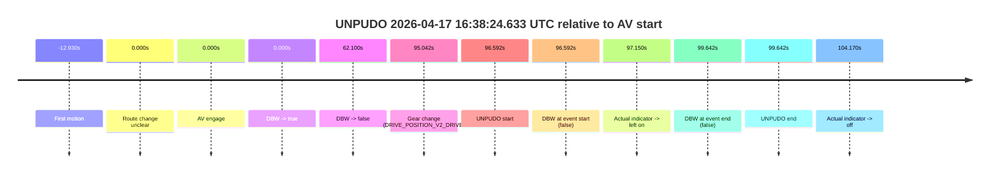
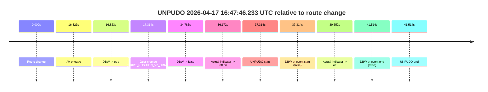
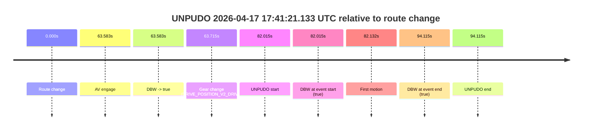

# Run Report: fme10011/2026-04-17--16-21-28--gen2-av-42978ead-95b1-4c93-ae74-d01ce75d27e9

| Field | Value |
|---|---|
| Run ID | `fme10011/2026-04-17--16-21-28--gen2-av-42978ead-95b1-4c93-ae74-d01ce75d27e9` |
| Date | `2026-04-17` |
| Model(s) | `pink-manta-ray-smooth` |
| Author | `guy.geva` |
| Event count | `3` |

## unpudo 2026-04-17 16:38:24.633 UTC

| Field | Value |
|---|---|
| Model | `pink-manta-ray-smooth` |
| Author | `guy.geva` |
| Run ID | `fme10011/2026-04-17--16-21-28--gen2-av-42978ead-95b1-4c93-ae74-d01ce75d27e9` |
| Date | `2026-04-17` |
| Time (UTC) | `16:38:24.633` |
| Event type | `unpudo` |
| Disengagement type | `none observed` |
| Route change | `unclear` |
| Console | [run](https://console.sso.wayve.ai/run/fme10011/2026-04-17--16-21-28--gen2-av-42978ead-95b1-4c93-ae74-d01ce75d27e9?id=&time-unixus=1776443904633308) |
| Foxglove | [segment](https://app.foxglove.dev/wayve-on-prem/p/prj_0dX18KZdVHg1fmmI/view?ds=foxglove-stream&ds.deviceName=fme10011&ds.start=2026-04-17T16%3A36%3A38.041196Z&ds.end=2026-04-17T16%3A38%3A37.683300Z&layoutId=lay_0e7VD4WIKDQGU73Y&time=2026-04-17T16%3A38%3A24.633308Z) |

### Event card: fail

- Fail: the credited unpudo does not stay AV-owned. The event window starts with DBW false, and the maneuver outcome lands outside a clean AV-owned segment.

| Event | Time (UTC) | Delta from AV start |
|---|---:|---:|
| First motion | 2026-04-17 16:36:35.111 | `-12.930s` |
| Route change unclear | 2026-04-17 16:36:48.041 | `0.000s` |
| AV engage | 2026-04-17 16:36:48.041 | `0.000s` |
| DBW -> true | 2026-04-17 16:36:48.041 | `0.000s` |
| DBW -> false | 2026-04-17 16:37:50.141 | `62.100s` |
| Gear change (DRIVE_POSITION_V2_DRIVE) | 2026-04-17 16:38:23.083 | `95.042s` |
| UNPUDO start | 2026-04-17 16:38:24.633 | `96.592s` |
| DBW at event start (false) | 2026-04-17 16:38:24.633 | `96.592s` |
| Actual indicator -> left on | 2026-04-17 16:38:25.190 | `97.150s` |
| DBW at event end (false) | 2026-04-17 16:38:27.683 | `99.642s` |
| UNPUDO end | 2026-04-17 16:38:27.683 | `99.642s` |
| Actual indicator -> off | 2026-04-17 16:38:32.210 | `104.170s` |

| Metric | Value |
|---|---|
| Outcome | `fail` |
| Effective failure type | `completed_outside_av` |
| Route change status | `unclear` |
| DBW at event start | `false` |
| DBW at event end | `false` |
| Predicted gear at AV start | `DRIVE_POSITION_V2_DRIVE` |
| Actual gear at AV start | `DRIVE_POSITION_V2_DRIVE` |
| Predicted gear at event start | `DRIVE_POSITION_V2_REVERSE` |
| Actual gear at event start | `DRIVE_POSITION_V2_DRIVE` |
| Planned indicator direction | `INDICATORS_STATE_V2_RIGHT_ON` |
| Controller indicator direction | `INDICATORS_STATE_V2_RIGHT_ON` |
| Actual indicator direction | `INDICATORS_STATE_V2_OFF` |
| Actual indicator at maneuver end | `INDICATORS_STATE_V2_LEFT_ON` |
| Driver accel help in AV | `false` |
| Driver accel help timestamp | `n/a` |
| Max accel pedal pct in AV | `0.0%` |
| Max brake pedal pct in AV | `12.5%` |
| Max speed mps in AV | `7.456` |
| Success timing baseline | `AV start` |
| Route -> AV | `n/a` |
| AV -> event start | `96.592s` |
| AV -> first motion | `-12.930s` |
| Success baseline -> event start | `96.592s` |
| Success baseline -> first motion | `-12.930s` |
| AV duration before disengagement | `62.100s` |
| Trajectory waypoint count | `36` |
| Driving-plan step count | `11` |

The scored portion starts from the AV-owned window, not from the pre-AV setup. Route-change search in the stopped pre-event segment was `unclear`, with the baseline therefore set to AV start. At the event anchor the model predicts `DRIVE_POSITION_V2_REVERSE` and the actual gear is `DRIVE_POSITION_V2_DRIVE`. The effective model outcome is `fail` because `completed_outside_av.`

### Resolution

| Field | Value |
|---|---|
| Final outcome | `fail` |
| Do we agree with this label? | `yes` |
| Source disengagement type | `none observed` |
| Resolved effective failure type | `completed_outside_av` |
| Confidence | `medium` |

## unpudo 2026-04-17 16:47:46.233 UTC

| Field | Value |
|---|---|
| Model | `pink-manta-ray-smooth` |
| Author | `guy.geva` |
| Run ID | `fme10011/2026-04-17--16-21-28--gen2-av-42978ead-95b1-4c93-ae74-d01ce75d27e9` |
| Date | `2026-04-17` |
| Time (UTC) | `16:47:46.233` |
| Event type | `unpudo` |
| Disengagement type | `uncategorised` |
| Route change | `found` |
| Console | [run](https://console.sso.wayve.ai/run/fme10011/2026-04-17--16-21-28--gen2-av-42978ead-95b1-4c93-ae74-d01ce75d27e9?id=&time-unixus=1776444466233298) |
| Foxglove | [segment](https://app.foxglove.dev/wayve-on-prem/p/prj_0dX18KZdVHg1fmmI/view?ds=foxglove-stream&ds.deviceName=fme10011&ds.start=2026-04-17T16%3A46%3A58.918823Z&ds.end=2026-04-17T16%3A48%3A00.433302Z&layoutId=lay_0e7VD4WIKDQGU73Y&time=2026-04-17T16%3A47%3A46.233298Z) |

### Event card: fail

- Fail: AV owns part of the segment, but the event still resolves as a model-performance failure under the AV-only scoring rule.

| Event | Time (UTC) | Delta from route change |
|---|---:|---:|
| Route change | 2026-04-17 16:47:08.918 | `0.000s` |
| AV engage | 2026-04-17 16:47:25.741 | `16.823s` |
| DBW -> true | 2026-04-17 16:47:25.741 | `16.823s` |
| Gear change (DRIVE_POSITION_V2_DRIVE) | 2026-04-17 16:47:26.233 | `17.314s` |
| DBW -> false | 2026-04-17 16:47:43.701 | `34.783s` |
| Actual indicator -> left on | 2026-04-17 16:47:45.090 | `36.172s` |
| UNPUDO start | 2026-04-17 16:47:46.233 | `37.314s` |
| DBW at event start (false) | 2026-04-17 16:47:46.233 | `37.314s` |
| Actual indicator -> off | 2026-04-17 16:47:48.470 | `39.552s` |
| DBW at event end (false) | 2026-04-17 16:47:50.433 | `41.514s` |
| UNPUDO end | 2026-04-17 16:47:50.433 | `41.514s` |

| Metric | Value |
|---|---|
| Outcome | `fail` |
| Effective failure type | `uncategorised` |
| Route change status | `found` |
| DBW at event start | `false` |
| DBW at event end | `false` |
| Predicted gear at AV start | `DRIVE_POSITION_V2_DRIVE` |
| Actual gear at AV start | `DRIVE_POSITION_V2_PARK` |
| Predicted gear at event start | `DRIVE_POSITION_V2_DRIVE` |
| Actual gear at event start | `DRIVE_POSITION_V2_DRIVE` |
| Planned indicator direction | `INDICATORS_STATE_V2_LEFT_ON` |
| Controller indicator direction | `INDICATORS_STATE_V2_LEFT_ON` |
| Actual indicator direction | `INDICATORS_STATE_V2_LEFT_ON` |
| Actual indicator at maneuver end | `INDICATORS_STATE_V2_OFF` |
| Driver accel help in AV | `false` |
| Driver accel help timestamp | `n/a` |
| Max accel pedal pct in AV | `0.0%` |
| Max brake pedal pct in AV | `10.2%` |
| Max speed mps in AV | `0.000` |
| Success timing baseline | `route change` |
| Route -> AV | `16.823s` |
| AV -> event start | `20.492s` |
| AV -> first motion | `n/a` |
| Success baseline -> event start | `37.314s` |
| Success baseline -> first motion | `n/a` |
| AV duration before disengagement | `17.960s` |
| Trajectory waypoint count | `36` |
| Driving-plan step count | `11` |

The scored portion starts from the AV-owned window, not from the pre-AV setup. Route-change search in the stopped pre-event segment was `found`, with the baseline therefore set to route change. At the event anchor the model predicts `DRIVE_POSITION_V2_DRIVE` and the actual gear is `DRIVE_POSITION_V2_DRIVE`. The effective model outcome is `fail` because `uncategorised.`

### Resolution

| Field | Value |
|---|---|
| Final outcome | `fail` |
| Do we agree with this label? | `yes` |
| Source disengagement type | `uncategorised` |
| Resolved effective failure type | `uncategorised` |
| Confidence | `high` |

## unpudo 2026-04-17 17:41:21.133 UTC

| Field | Value |
|---|---|
| Model | `pink-manta-ray-smooth` |
| Author | `guy.geva` |
| Run ID | `fme10011/2026-04-17--16-21-28--gen2-av-42978ead-95b1-4c93-ae74-d01ce75d27e9` |
| Date | `2026-04-17` |
| Time (UTC) | `17:41:21.133` |
| Event type | `unpudo` |
| Disengagement type | `none observed` |
| Route change | `found` |
| Console | [run](https://console.sso.wayve.ai/run/fme10011/2026-04-17--16-21-28--gen2-av-42978ead-95b1-4c93-ae74-d01ce75d27e9?id=&time-unixus=1776447681133301) |
| Foxglove | [segment](https://app.foxglove.dev/wayve-on-prem/p/prj_0dX18KZdVHg1fmmI/view?ds=foxglove-stream&ds.deviceName=fme10011&ds.start=2026-04-17T17%3A39%3A49.118306Z&ds.end=2026-04-17T17%3A41%3A43.233314Z&layoutId=lay_0e7VD4WIKDQGU73Y&time=2026-04-17T17%3A41%3A21.133301Z) |

### Event card: pass

- Pass: AV owns the credited unpudo from route change through the official unpudo window, the gear state is aligned at the anchor, and the vehicle moves without driver accelerator help in AV.

| Event | Time (UTC) | Delta from route change |
|---|---:|---:|
| Route change | 2026-04-17 17:39:59.118 | `0.000s` |
| AV engage | 2026-04-17 17:41:02.701 | `63.583s` |
| DBW -> true | 2026-04-17 17:41:02.701 | `63.583s` |
| Gear change (DRIVE_POSITION_V2_DRIVE) | 2026-04-17 17:41:02.833 | `63.715s` |
| UNPUDO start | 2026-04-17 17:41:21.133 | `82.015s` |
| DBW at event start (true) | 2026-04-17 17:41:21.133 | `82.015s` |
| First motion | 2026-04-17 17:41:21.250 | `82.132s` |
| DBW at event end (true) | 2026-04-17 17:41:33.233 | `94.115s` |
| UNPUDO end | 2026-04-17 17:41:33.233 | `94.115s` |

| Metric | Value |
|---|---|
| Outcome | `pass` |
| Effective failure type | `none` |
| Route change status | `found` |
| DBW at event start | `true` |
| DBW at event end | `true` |
| Predicted gear at AV start | `DRIVE_POSITION_V2_DRIVE` |
| Actual gear at AV start | `DRIVE_POSITION_V2_PARK` |
| Predicted gear at event start | `DRIVE_POSITION_V2_DRIVE` |
| Actual gear at event start | `DRIVE_POSITION_V2_DRIVE` |
| Planned indicator direction | `INDICATORS_STATE_V2_LEFT_ON` |
| Controller indicator direction | `INDICATORS_STATE_V2_LEFT_ON` |
| Actual indicator direction | `INDICATORS_STATE_V2_OFF` |
| Actual indicator at maneuver end | `INDICATORS_STATE_V2_OFF` |
| Driver accel help in AV | `false` |
| Driver accel help timestamp | `n/a` |
| Max accel pedal pct in AV | `0.0%` |
| Max brake pedal pct in AV | `10.5%` |
| Max speed mps in AV | `2.617` |
| Success timing baseline | `route change` |
| Route -> AV | `63.583s` |
| AV -> event start | `18.432s` |
| AV -> first motion | `18.549s` |
| Success baseline -> event start | `82.015s` |
| Success baseline -> first motion | `82.132s` |
| AV duration before disengagement | `n/a` |
| Trajectory waypoint count | `36` |
| Driving-plan step count | `11` |

The scored portion starts from the AV-owned window, not from the pre-AV setup. Route-change search in the stopped pre-event segment was `found`, with the baseline therefore set to route change. At the event anchor the model predicts `DRIVE_POSITION_V2_DRIVE` and the actual gear is `DRIVE_POSITION_V2_DRIVE`. The effective model outcome is `pass` because `the credited unpudo stays AV-owned through the official unpudo window.`

### Resolution

| Field | Value |
|---|---|
| Final outcome | `pass` |
| Do we agree with this label? | `yes` |
| Source disengagement type | `none observed` |
| Resolved effective failure type | `none` |
| Confidence | `high` |
