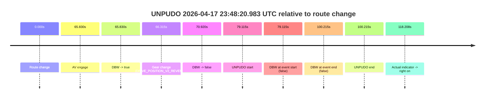
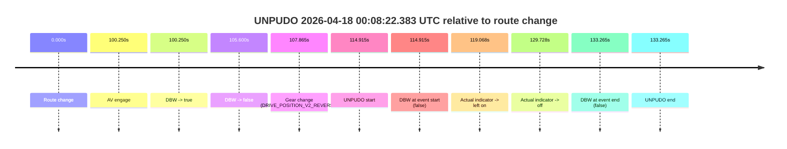

# Run Report: fme10011/2026-04-17--22-27-11--gen2-av-5efec133-9bd2-4948-8145-4f400f998230

| Field | Value |
|---|---|
| Run ID | `fme10011/2026-04-17--22-27-11--gen2-av-5efec133-9bd2-4948-8145-4f400f998230` |
| Date | `2026-04-17` |
| Model(s) | `pink-manta-ray-smooth` |
| Author | `guy.geva` |
| Event count | `2` |

## unpudo 2026-04-17 23:48:20.983 UTC

| Field | Value |
|---|---|
| Model | `pink-manta-ray-smooth` |
| Author | `guy.geva` |
| Run ID | `fme10011/2026-04-17--22-27-11--gen2-av-5efec133-9bd2-4948-8145-4f400f998230` |
| Date | `2026-04-17` |
| Time (UTC) | `23:48:20.983` |
| Event type | `unpudo` |
| Disengagement type | `failed_to_unpudo` |
| Route change | `found` |
| Console | [run](https://console.sso.wayve.ai/run/fme10011/2026-04-17--22-27-11--gen2-av-5efec133-9bd2-4948-8145-4f400f998230?id=&time-unixus=1776469700983301) |
| Foxglove | [segment](https://app.foxglove.dev/wayve-on-prem/p/prj_0dX18KZdVHg1fmmI/view?ds=foxglove-stream&ds.deviceName=fme10011&ds.start=2026-04-17T23%3A46%3A51.868286Z&ds.end=2026-04-17T23%3A48%3A52.083305Z&layoutId=lay_0e7VD4WIKDQGU73Y&time=2026-04-17T23%3A48%3A20.983301Z) |

### Event card: fail

- Fail: AV owns part of the segment, but the event still resolves as a model-performance failure under the AV-only scoring rule.

| Event | Time (UTC) | Delta from route change |
|---|---:|---:|
| Route change | 2026-04-17 23:47:01.868 | `0.000s` |
| AV engage | 2026-04-17 23:48:07.698 | `65.830s` |
| DBW -> true | 2026-04-17 23:48:07.698 | `65.830s` |
| Gear change (DRIVE_POSITION_V2_REVERSE) | 2026-04-17 23:48:08.183 | `66.315s` |
| DBW -> false | 2026-04-17 23:48:12.788 | `70.920s` |
| UNPUDO start | 2026-04-17 23:48:20.983 | `79.115s` |
| DBW at event start (false) | 2026-04-17 23:48:20.983 | `79.115s` |
| DBW at event end (false) | 2026-04-17 23:48:42.083 | `100.215s` |
| UNPUDO end | 2026-04-17 23:48:42.083 | `100.215s` |
| Actual indicator -> right on | 2026-04-17 23:49:00.076 | `118.208s` |

| Metric | Value |
|---|---|
| Outcome | `fail` |
| Effective failure type | `failed_to_unpudo` |
| Route change status | `found` |
| DBW at event start | `false` |
| DBW at event end | `false` |
| Predicted gear at AV start | `DRIVE_POSITION_V2_REVERSE` |
| Actual gear at AV start | `DRIVE_POSITION_V2_PARK` |
| Predicted gear at event start | `DRIVE_POSITION_V2_REVERSE` |
| Actual gear at event start | `DRIVE_POSITION_V2_REVERSE` |
| Planned indicator direction | `INDICATORS_STATE_V2_OFF` |
| Controller indicator direction | `INDICATORS_STATE_V2_OFF` |
| Actual indicator direction | `INDICATORS_STATE_V2_OFF` |
| Actual indicator at maneuver end | `INDICATORS_STATE_V2_OFF` |
| Driver accel help in AV | `false` |
| Driver accel help timestamp | `n/a` |
| Max accel pedal pct in AV | `0.0%` |
| Max brake pedal pct in AV | `9.3%` |
| Max speed mps in AV | `0.000` |
| Success timing baseline | `route change` |
| Route -> AV | `65.830s` |
| AV -> event start | `13.285s` |
| AV -> first motion | `n/a` |
| Success baseline -> event start | `79.115s` |
| Success baseline -> first motion | `n/a` |
| AV duration before disengagement | `5.090s` |
| Trajectory waypoint count | `37` |
| Driving-plan step count | `11` |

The scored portion starts from the AV-owned window, not from the pre-AV setup. Route-change search in the stopped pre-event segment was `found`, with the baseline therefore set to route change. At the event anchor the model predicts `DRIVE_POSITION_V2_REVERSE` and the actual gear is `DRIVE_POSITION_V2_REVERSE`. The effective model outcome is `fail` because `failed_to_unpudo.`

### Resolution

| Field | Value |
|---|---|
| Final outcome | `fail` |
| Do we agree with this label? | `yes` |
| Source disengagement type | `failed_to_unpudo` |
| Resolved effective failure type | `failed_to_unpudo` |
| Confidence | `high` |

## unpudo 2026-04-18 00:08:22.383 UTC

| Field | Value |
|---|---|
| Model | `pink-manta-ray-smooth` |
| Author | `guy.geva` |
| Run ID | `fme10011/2026-04-17--22-27-11--gen2-av-5efec133-9bd2-4948-8145-4f400f998230` |
| Date | `2026-04-17` |
| Time (UTC) | `00:08:22.383` |
| Event type | `unpudo` |
| Disengagement type | `failed_to_unpudo` |
| Route change | `found` |
| Console | [run](https://console.sso.wayve.ai/run/fme10011/2026-04-17--22-27-11--gen2-av-5efec133-9bd2-4948-8145-4f400f998230?id=&time-unixus=1776470902383294) |
| Foxglove | [segment](https://app.foxglove.dev/wayve-on-prem/p/prj_0dX18KZdVHg1fmmI/view?ds=foxglove-stream&ds.deviceName=fme10011&ds.start=2026-04-18T00%3A06%3A17.468390Z&ds.end=2026-04-18T00%3A08%3A50.733321Z&layoutId=lay_0e7VD4WIKDQGU73Y&time=2026-04-18T00%3A08%3A22.383294Z) |

### Event card: fail

- Fail: AV owns part of the segment, but the event still resolves as a model-performance failure under the AV-only scoring rule.

| Event | Time (UTC) | Delta from route change |
|---|---:|---:|
| Route change | 2026-04-18 00:06:27.468 | `0.000s` |
| AV engage | 2026-04-18 00:08:07.718 | `100.250s` |
| DBW -> true | 2026-04-18 00:08:07.718 | `100.250s` |
| DBW -> false | 2026-04-18 00:08:13.068 | `105.600s` |
| Gear change (DRIVE_POSITION_V2_REVERSE) | 2026-04-18 00:08:15.333 | `107.865s` |
| UNPUDO start | 2026-04-18 00:08:22.383 | `114.915s` |
| DBW at event start (false) | 2026-04-18 00:08:22.383 | `114.915s` |
| Actual indicator -> left on | 2026-04-18 00:08:26.536 | `119.068s` |
| Actual indicator -> off | 2026-04-18 00:08:37.196 | `129.728s` |
| DBW at event end (false) | 2026-04-18 00:08:40.733 | `133.265s` |
| UNPUDO end | 2026-04-18 00:08:40.733 | `133.265s` |

| Metric | Value |
|---|---|
| Outcome | `fail` |
| Effective failure type | `failed_to_unpudo` |
| Route change status | `found` |
| DBW at event start | `false` |
| DBW at event end | `false` |
| Predicted gear at AV start | `DRIVE_POSITION_V2_REVERSE` |
| Actual gear at AV start | `DRIVE_POSITION_V2_PARK` |
| Predicted gear at event start | `DRIVE_POSITION_V2_REVERSE` |
| Actual gear at event start | `DRIVE_POSITION_V2_REVERSE` |
| Planned indicator direction | `INDICATORS_STATE_V2_OFF` |
| Controller indicator direction | `INDICATORS_STATE_V2_OFF` |
| Actual indicator direction | `INDICATORS_STATE_V2_OFF` |
| Actual indicator at maneuver end | `INDICATORS_STATE_V2_OFF` |
| Driver accel help in AV | `false` |
| Driver accel help timestamp | `n/a` |
| Max accel pedal pct in AV | `0.0%` |
| Max brake pedal pct in AV | `10.3%` |
| Max speed mps in AV | `0.000` |
| Success timing baseline | `route change` |
| Route -> AV | `100.250s` |
| AV -> event start | `14.665s` |
| AV -> first motion | `n/a` |
| Success baseline -> event start | `114.915s` |
| Success baseline -> first motion | `n/a` |
| AV duration before disengagement | `5.350s` |
| Trajectory waypoint count | `37` |
| Driving-plan step count | `11` |

The scored portion starts from the AV-owned window, not from the pre-AV setup. Route-change search in the stopped pre-event segment was `found`, with the baseline therefore set to route change. At the event anchor the model predicts `DRIVE_POSITION_V2_REVERSE` and the actual gear is `DRIVE_POSITION_V2_REVERSE`. The effective model outcome is `fail` because `failed_to_unpudo.`

### Resolution

| Field | Value |
|---|---|
| Final outcome | `fail` |
| Do we agree with this label? | `yes` |
| Source disengagement type | `failed_to_unpudo` |
| Resolved effective failure type | `failed_to_unpudo` |
| Confidence | `high` |
