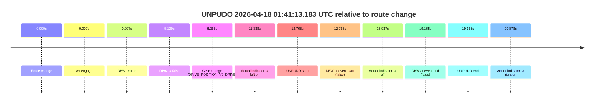
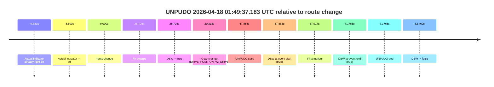
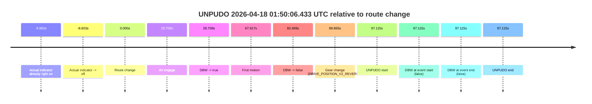
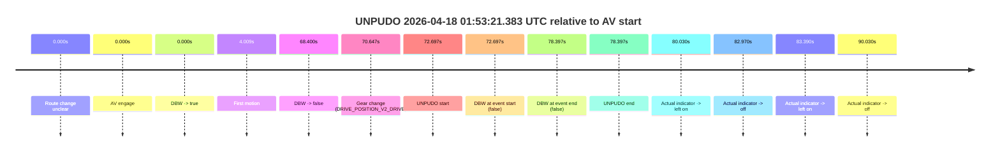
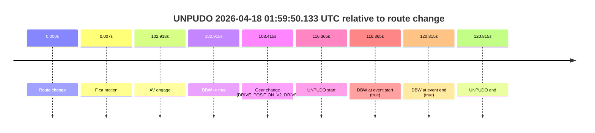

# Run Report: fme10011/2026-04-18--00-53-58--gen2-av-b4da46b0-6e2a-426a-9749-437522a35f1b

| Field | Value |
|---|---|
| Run ID | `fme10011/2026-04-18--00-53-58--gen2-av-b4da46b0-6e2a-426a-9749-437522a35f1b` |
| Date | `2026-04-18` |
| Model(s) | `eel-teal-outspoken` |
| Author | `zak` |
| Event count | `6` |

## unpudo 2026-04-18 01:41:13.183 UTC

| Field | Value |
|---|---|
| Model | `eel-teal-outspoken` |
| Author | `zak` |
| Run ID | `fme10011/2026-04-18--00-53-58--gen2-av-b4da46b0-6e2a-426a-9749-437522a35f1b` |
| Date | `2026-04-18` |
| Time (UTC) | `01:41:13.183` |
| Event type | `unpudo` |
| Disengagement type | `failed_to_unpudo` |
| Route change | `found` |
| Console | [run](https://console.sso.wayve.ai/run/fme10011/2026-04-18--00-53-58--gen2-av-b4da46b0-6e2a-426a-9749-437522a35f1b?id=&time-unixus=1776476473183311) |
| Foxglove | [segment](https://app.foxglove.dev/wayve-on-prem/p/prj_0dX18KZdVHg1fmmI/view?ds=foxglove-stream&ds.deviceName=fme10011&ds.start=2026-04-18T01%3A40%3A50.418499Z&ds.end=2026-04-18T01%3A41%3A29.583311Z&layoutId=lay_0e7VD4WIKDQGU73Y&time=2026-04-18T01%3A41%3A13.183311Z) |

### Event card: fail

- Fail: AV owns part of the segment, but the event still resolves as a model-performance failure under the AV-only scoring rule.

| Event | Time (UTC) | Delta from route change |
|---|---:|---:|
| Route change | 2026-04-18 01:41:00.418 | `0.000s` |
| AV engage | 2026-04-18 01:41:00.425 | `0.007s` |
| DBW -> true | 2026-04-18 01:41:00.425 | `0.007s` |
| DBW -> false | 2026-04-18 01:41:05.547 | `5.129s` |
| Gear change (DRIVE_POSITION_V2_DRIVE) | 2026-04-18 01:41:06.683 | `6.265s` |
| Actual indicator -> left on | 2026-04-18 01:41:11.756 | `11.338s` |
| UNPUDO start | 2026-04-18 01:41:13.183 | `12.765s` |
| DBW at event start (false) | 2026-04-18 01:41:13.183 | `12.765s` |
| Actual indicator -> off | 2026-04-18 01:41:16.355 | `15.937s` |
| DBW at event end (false) | 2026-04-18 01:41:19.583 | `19.165s` |
| UNPUDO end | 2026-04-18 01:41:19.583 | `19.165s` |
| Actual indicator -> right on | 2026-04-18 01:41:21.296 | `20.878s` |

| Metric | Value |
|---|---|
| Outcome | `fail` |
| Effective failure type | `failed_to_unpudo` |
| Route change status | `found` |
| DBW at event start | `false` |
| DBW at event end | `false` |
| Predicted gear at AV start | `DRIVE_POSITION_V2_PARK` |
| Actual gear at AV start | `DRIVE_POSITION_V2_PARK` |
| Predicted gear at event start | `DRIVE_POSITION_V2_DRIVE` |
| Actual gear at event start | `DRIVE_POSITION_V2_DRIVE` |
| Planned indicator direction | `INDICATORS_STATE_V2_LEFT_ON` |
| Controller indicator direction | `INDICATORS_STATE_V2_LEFT_ON` |
| Actual indicator direction | `INDICATORS_STATE_V2_LEFT_ON` |
| Actual indicator at maneuver end | `INDICATORS_STATE_V2_OFF` |
| Driver accel help in AV | `false` |
| Driver accel help timestamp | `n/a` |
| Max accel pedal pct in AV | `0.0%` |
| Max brake pedal pct in AV | `8.0%` |
| Max speed mps in AV | `0.000` |
| Success timing baseline | `route change` |
| Route -> AV | `0.007s` |
| AV -> event start | `12.758s` |
| AV -> first motion | `n/a` |
| Success baseline -> event start | `12.765s` |
| Success baseline -> first motion | `n/a` |
| AV duration before disengagement | `5.121s` |
| Trajectory waypoint count | `36` |
| Driving-plan step count | `11` |

The scored portion starts from the AV-owned window, not from the pre-AV setup. Route-change search in the stopped pre-event segment was `found`, with the baseline therefore set to route change. At the event anchor the model predicts `DRIVE_POSITION_V2_DRIVE` and the actual gear is `DRIVE_POSITION_V2_DRIVE`. The effective model outcome is `fail` because `failed_to_unpudo.`

### Resolution

| Field | Value |
|---|---|
| Final outcome | `fail` |
| Do we agree with this label? | `yes` |
| Source disengagement type | `failed_to_unpudo` |
| Resolved effective failure type | `failed_to_unpudo` |
| Confidence | `high` |

## unpudo 2026-04-18 01:49:37.183 UTC

| Field | Value |
|---|---|
| Model | `eel-teal-outspoken` |
| Author | `zak` |
| Run ID | `fme10011/2026-04-18--00-53-58--gen2-av-b4da46b0-6e2a-426a-9749-437522a35f1b` |
| Date | `2026-04-18` |
| Time (UTC) | `01:49:37.183` |
| Event type | `unpudo` |
| Disengagement type | `none observed` |
| Route change | `found` |
| Console | [run](https://console.sso.wayve.ai/run/fme10011/2026-04-18--00-53-58--gen2-av-b4da46b0-6e2a-426a-9749-437522a35f1b?id=&time-unixus=1776476977183300) |
| Foxglove | [segment](https://app.foxglove.dev/wayve-on-prem/p/prj_0dX18KZdVHg1fmmI/view?ds=foxglove-stream&ds.deviceName=fme10011&ds.start=2026-04-18T01%3A48%3A19.318459Z&ds.end=2026-04-18T01%3A50%3A01.787153Z&layoutId=lay_0e7VD4WIKDQGU73Y&time=2026-04-18T01%3A49%3A37.183300Z) |

### Event card: pass

- Pass: AV owns the credited unpudo from route change through the official unpudo window, the gear state is aligned at the anchor, and the vehicle moves without driver accelerator help in AV.

| Event | Time (UTC) | Delta from route change |
|---|---:|---:|
| Actual indicator already right on | 2026-04-18 01:48:19.335 | `-9.983s` |
| Actual indicator -> off | 2026-04-18 01:48:20.715 | `-8.603s` |
| Route change | 2026-04-18 01:48:29.318 | `0.000s` |
| AV engage | 2026-04-18 01:48:58.026 | `28.708s` |
| DBW -> true | 2026-04-18 01:48:58.026 | `28.708s` |
| Gear change (DRIVE_POSITION_V2_DRIVE) | 2026-04-18 01:48:58.533 | `29.215s` |
| UNPUDO start | 2026-04-18 01:49:37.183 | `67.865s` |
| DBW at event start (true) | 2026-04-18 01:49:37.183 | `67.865s` |
| First motion | 2026-04-18 01:49:37.235 | `67.917s` |
| DBW at event end (true) | 2026-04-18 01:49:41.083 | `71.765s` |
| UNPUDO end | 2026-04-18 01:49:41.083 | `71.765s` |
| DBW -> false | 2026-04-18 01:49:51.787 | `82.469s` |

| Metric | Value |
|---|---|
| Outcome | `pass` |
| Effective failure type | `none` |
| Route change status | `found` |
| DBW at event start | `true` |
| DBW at event end | `true` |
| Predicted gear at AV start | `DRIVE_POSITION_V2_DRIVE` |
| Actual gear at AV start | `DRIVE_POSITION_V2_PARK` |
| Predicted gear at event start | `DRIVE_POSITION_V2_DRIVE` |
| Actual gear at event start | `DRIVE_POSITION_V2_DRIVE` |
| Planned indicator direction | `INDICATORS_STATE_V2_LEFT_ON` |
| Controller indicator direction | `INDICATORS_STATE_V2_LEFT_ON` |
| Actual indicator direction | `INDICATORS_STATE_V2_OFF` |
| Actual indicator at maneuver end | `INDICATORS_STATE_V2_OFF` |
| Driver accel help in AV | `false` |
| Driver accel help timestamp | `n/a` |
| Max accel pedal pct in AV | `0.0%` |
| Max brake pedal pct in AV | `8.6%` |
| Max speed mps in AV | `3.867` |
| Success timing baseline | `route change` |
| Route -> AV | `28.708s` |
| AV -> event start | `39.157s` |
| AV -> first motion | `39.209s` |
| Success baseline -> event start | `67.865s` |
| Success baseline -> first motion | `67.917s` |
| AV duration before disengagement | `53.760s` |
| Trajectory waypoint count | `36` |
| Driving-plan step count | `11` |

The scored portion starts from the AV-owned window, not from the pre-AV setup. Route-change search in the stopped pre-event segment was `found`, with the baseline therefore set to route change. At the event anchor the model predicts `DRIVE_POSITION_V2_DRIVE` and the actual gear is `DRIVE_POSITION_V2_DRIVE`. The effective model outcome is `pass` because `the credited unpudo stays AV-owned through the official unpudo window.`

### Resolution

| Field | Value |
|---|---|
| Final outcome | `pass` |
| Do we agree with this label? | `yes` |
| Source disengagement type | `none observed` |
| Resolved effective failure type | `none` |
| Confidence | `high` |

## unpudo 2026-04-18 01:50:06.433 UTC

| Field | Value |
|---|---|
| Model | `eel-teal-outspoken` |
| Author | `zak` |
| Run ID | `fme10011/2026-04-18--00-53-58--gen2-av-b4da46b0-6e2a-426a-9749-437522a35f1b` |
| Date | `2026-04-18` |
| Time (UTC) | `01:50:06.433` |
| Event type | `unpudo` |
| Disengagement type | `failed_to_pudo` |
| Route change | `found` |
| Console | [run](https://console.sso.wayve.ai/run/fme10011/2026-04-18--00-53-58--gen2-av-b4da46b0-6e2a-426a-9749-437522a35f1b?id=&time-unixus=1776477006433307) |
| Foxglove | [segment](https://app.foxglove.dev/wayve-on-prem/p/prj_0dX18KZdVHg1fmmI/view?ds=foxglove-stream&ds.deviceName=fme10011&ds.start=2026-04-18T01%3A48%3A19.318459Z&ds.end=2026-04-18T01%3A50%3A16.433307Z&layoutId=lay_0e7VD4WIKDQGU73Y&time=2026-04-18T01%3A50%3A06.433307Z) |

### Event card: fail

- Fail: AV owns part of the segment, but the event still resolves as a model-performance failure under the AV-only scoring rule.

| Event | Time (UTC) | Delta from route change |
|---|---:|---:|
| Actual indicator already right on | 2026-04-18 01:48:19.335 | `-9.983s` |
| Actual indicator -> off | 2026-04-18 01:48:20.715 | `-8.603s` |
| Route change | 2026-04-18 01:48:29.318 | `0.000s` |
| AV engage | 2026-04-18 01:48:58.026 | `28.708s` |
| DBW -> true | 2026-04-18 01:48:58.026 | `28.708s` |
| First motion | 2026-04-18 01:49:37.235 | `67.917s` |
| DBW -> false | 2026-04-18 01:49:51.787 | `82.469s` |
| Gear change (DRIVE_POSITION_V2_REVERSE) | 2026-04-18 01:49:59.183 | `89.865s` |
| UNPUDO start | 2026-04-18 01:50:06.433 | `97.115s` |
| DBW at event start (false) | 2026-04-18 01:50:06.433 | `97.115s` |
| DBW at event end (false) | 2026-04-18 01:50:06.433 | `97.115s` |
| UNPUDO end | 2026-04-18 01:50:06.433 | `97.115s` |

| Metric | Value |
|---|---|
| Outcome | `fail` |
| Effective failure type | `failed_to_pudo` |
| Route change status | `found` |
| DBW at event start | `false` |
| DBW at event end | `false` |
| Predicted gear at AV start | `DRIVE_POSITION_V2_DRIVE` |
| Actual gear at AV start | `DRIVE_POSITION_V2_PARK` |
| Predicted gear at event start | `DRIVE_POSITION_V2_REVERSE` |
| Actual gear at event start | `DRIVE_POSITION_V2_REVERSE` |
| Planned indicator direction | `INDICATORS_STATE_V2_OFF` |
| Controller indicator direction | `INDICATORS_STATE_V2_OFF` |
| Actual indicator direction | `INDICATORS_STATE_V2_OFF` |
| Actual indicator at maneuver end | `INDICATORS_STATE_V2_OFF` |
| Driver accel help in AV | `false` |
| Driver accel help timestamp | `n/a` |
| Max accel pedal pct in AV | `0.0%` |
| Max brake pedal pct in AV | `8.6%` |
| Max speed mps in AV | `8.125` |
| Success timing baseline | `route change` |
| Route -> AV | `28.708s` |
| AV -> event start | `68.407s` |
| AV -> first motion | `39.209s` |
| Success baseline -> event start | `97.115s` |
| Success baseline -> first motion | `67.917s` |
| AV duration before disengagement | `53.760s` |
| Trajectory waypoint count | `37` |
| Driving-plan step count | `11` |

The scored portion starts from the AV-owned window, not from the pre-AV setup. Route-change search in the stopped pre-event segment was `found`, with the baseline therefore set to route change. At the event anchor the model predicts `DRIVE_POSITION_V2_REVERSE` and the actual gear is `DRIVE_POSITION_V2_REVERSE`. The effective model outcome is `fail` because `failed_to_pudo.`

### Resolution

| Field | Value |
|---|---|
| Final outcome | `fail` |
| Do we agree with this label? | `yes` |
| Source disengagement type | `failed_to_pudo` |
| Resolved effective failure type | `failed_to_pudo` |
| Confidence | `high` |

## unpudo 2026-04-18 01:53:21.383 UTC

| Field | Value |
|---|---|
| Model | `eel-teal-outspoken` |
| Author | `zak` |
| Run ID | `fme10011/2026-04-18--00-53-58--gen2-av-b4da46b0-6e2a-426a-9749-437522a35f1b` |
| Date | `2026-04-18` |
| Time (UTC) | `01:53:21.383` |
| Event type | `unpudo` |
| Disengagement type | `failed_to_unpudo` |
| Route change | `unclear` |
| Console | [run](https://console.sso.wayve.ai/run/fme10011/2026-04-18--00-53-58--gen2-av-b4da46b0-6e2a-426a-9749-437522a35f1b?id=&time-unixus=1776477201383293) |
| Foxglove | [segment](https://app.foxglove.dev/wayve-on-prem/p/prj_0dX18KZdVHg1fmmI/view?ds=foxglove-stream&ds.deviceName=fme10011&ds.start=2026-04-18T01%3A51%3A58.686494Z&ds.end=2026-04-18T01%3A53%3A37.083310Z&layoutId=lay_0e7VD4WIKDQGU73Y&time=2026-04-18T01%3A53%3A21.383293Z) |

### Event card: fail

- Fail: AV owns part of the segment, but the event still resolves as a model-performance failure under the AV-only scoring rule.

| Event | Time (UTC) | Delta from AV start |
|---|---:|---:|
| Route change unclear | 2026-04-18 01:52:08.686 | `0.000s` |
| AV engage | 2026-04-18 01:52:08.686 | `0.000s` |
| DBW -> true | 2026-04-18 01:52:08.686 | `0.000s` |
| First motion | 2026-04-18 01:52:12.695 | `4.009s` |
| DBW -> false | 2026-04-18 01:53:17.086 | `68.400s` |
| Gear change (DRIVE_POSITION_V2_DRIVE) | 2026-04-18 01:53:19.333 | `70.647s` |
| UNPUDO start | 2026-04-18 01:53:21.383 | `72.697s` |
| DBW at event start (false) | 2026-04-18 01:53:21.383 | `72.697s` |
| DBW at event end (false) | 2026-04-18 01:53:27.083 | `78.397s` |
| UNPUDO end | 2026-04-18 01:53:27.083 | `78.397s` |
| Actual indicator -> left on | 2026-04-18 01:53:28.716 | `80.030s` |
| Actual indicator -> off | 2026-04-18 01:53:31.656 | `82.970s` |
| Actual indicator -> left on | 2026-04-18 01:53:32.076 | `83.390s` |
| Actual indicator -> off | 2026-04-18 01:53:38.716 | `90.030s` |

| Metric | Value |
|---|---|
| Outcome | `fail` |
| Effective failure type | `failed_to_unpudo` |
| Route change status | `unclear` |
| DBW at event start | `false` |
| DBW at event end | `false` |
| Predicted gear at AV start | `DRIVE_POSITION_V2_DRIVE` |
| Actual gear at AV start | `DRIVE_POSITION_V2_PARK` |
| Predicted gear at event start | `DRIVE_POSITION_V2_DRIVE` |
| Actual gear at event start | `DRIVE_POSITION_V2_DRIVE` |
| Planned indicator direction | `INDICATORS_STATE_V2_OFF` |
| Controller indicator direction | `INDICATORS_STATE_V2_OFF` |
| Actual indicator direction | `INDICATORS_STATE_V2_OFF` |
| Actual indicator at maneuver end | `INDICATORS_STATE_V2_OFF` |
| Driver accel help in AV | `false` |
| Driver accel help timestamp | `n/a` |
| Max accel pedal pct in AV | `0.0%` |
| Max brake pedal pct in AV | `8.0%` |
| Max speed mps in AV | `9.147` |
| Success timing baseline | `AV start` |
| Route -> AV | `n/a` |
| AV -> event start | `72.697s` |
| AV -> first motion | `4.009s` |
| Success baseline -> event start | `72.697s` |
| Success baseline -> first motion | `4.009s` |
| AV duration before disengagement | `68.400s` |
| Trajectory waypoint count | `36` |
| Driving-plan step count | `11` |

The scored portion starts from the AV-owned window, not from the pre-AV setup. Route-change search in the stopped pre-event segment was `unclear`, with the baseline therefore set to AV start. At the event anchor the model predicts `DRIVE_POSITION_V2_DRIVE` and the actual gear is `DRIVE_POSITION_V2_DRIVE`. The effective model outcome is `fail` because `failed_to_unpudo.`

### Resolution

| Field | Value |
|---|---|
| Final outcome | `fail` |
| Do we agree with this label? | `yes` |
| Source disengagement type | `failed_to_unpudo` |
| Resolved effective failure type | `failed_to_unpudo` |
| Confidence | `medium` |

## unpudo 2026-04-18 01:54:48.883 UTC

| Field | Value |
|---|---|
| Model | `eel-teal-outspoken` |
| Author | `zak` |
| Run ID | `fme10011/2026-04-18--00-53-58--gen2-av-b4da46b0-6e2a-426a-9749-437522a35f1b` |
| Date | `2026-04-18` |
| Time (UTC) | `01:54:48.883` |
| Event type | `unpudo` |
| Disengagement type | `failed_to_unpudo` |
| Route change | `found` |
| Console | [run](https://console.sso.wayve.ai/run/fme10011/2026-04-18--00-53-58--gen2-av-b4da46b0-6e2a-426a-9749-437522a35f1b?id=&time-unixus=1776477288883321) |
| Foxglove | [segment](https://app.foxglove.dev/wayve-on-prem/p/prj_0dX18KZdVHg1fmmI/view?ds=foxglove-stream&ds.deviceName=fme10011&ds.start=2026-04-18T01%3A54%3A10.118274Z&ds.end=2026-04-18T01%3A55%3A08.233301Z&layoutId=lay_0e7VD4WIKDQGU73Y&time=2026-04-18T01%3A54%3A48.883321Z) |

### Event card: fail

- Fail: AV owns part of the segment, but the event still resolves as a model-performance failure under the AV-only scoring rule.

| Event | Time (UTC) | Delta from route change |
|---|---:|---:|
| Route change | 2026-04-18 01:54:20.118 | `0.000s` |
| AV engage | 2026-04-18 01:54:39.446 | `19.328s` |
| DBW -> true | 2026-04-18 01:54:39.446 | `19.328s` |
| DBW -> false | 2026-04-18 01:54:42.967 | `22.849s` |
| Gear change (DRIVE_POSITION_V2_REVERSE) | 2026-04-18 01:54:44.533 | `24.415s` |
| UNPUDO start | 2026-04-18 01:54:48.883 | `28.765s` |
| DBW at event start (false) | 2026-04-18 01:54:48.883 | `28.765s` |
| DBW at event end (true) | 2026-04-18 01:54:58.233 | `38.115s` |
| UNPUDO end | 2026-04-18 01:54:58.233 | `38.115s` |

| Metric | Value |
|---|---|
| Outcome | `fail` |
| Effective failure type | `failed_to_unpudo` |
| Route change status | `found` |
| DBW at event start | `false` |
| DBW at event end | `true` |
| Predicted gear at AV start | `DRIVE_POSITION_V2_REVERSE` |
| Actual gear at AV start | `DRIVE_POSITION_V2_PARK` |
| Predicted gear at event start | `DRIVE_POSITION_V2_REVERSE` |
| Actual gear at event start | `DRIVE_POSITION_V2_REVERSE` |
| Planned indicator direction | `INDICATORS_STATE_V2_OFF` |
| Controller indicator direction | `INDICATORS_STATE_V2_OFF` |
| Actual indicator direction | `INDICATORS_STATE_V2_OFF` |
| Actual indicator at maneuver end | `INDICATORS_STATE_V2_OFF` |
| Driver accel help in AV | `false` |
| Driver accel help timestamp | `n/a` |
| Max accel pedal pct in AV | `0.0%` |
| Max brake pedal pct in AV | `8.0%` |
| Max speed mps in AV | `0.000` |
| Success timing baseline | `route change` |
| Route -> AV | `19.328s` |
| AV -> event start | `9.437s` |
| AV -> first motion | `n/a` |
| Success baseline -> event start | `28.765s` |
| Success baseline -> first motion | `n/a` |
| AV duration before disengagement | `3.521s` |
| Trajectory waypoint count | `36` |
| Driving-plan step count | `11` |

The scored portion starts from the AV-owned window, not from the pre-AV setup. Route-change search in the stopped pre-event segment was `found`, with the baseline therefore set to route change. At the event anchor the model predicts `DRIVE_POSITION_V2_REVERSE` and the actual gear is `DRIVE_POSITION_V2_REVERSE`. The effective model outcome is `fail` because `failed_to_unpudo.`

### Resolution

| Field | Value |
|---|---|
| Final outcome | `fail` |
| Do we agree with this label? | `yes` |
| Source disengagement type | `failed_to_unpudo` |
| Resolved effective failure type | `failed_to_unpudo` |
| Confidence | `high` |

## unpudo 2026-04-18 01:59:50.133 UTC

| Field | Value |
|---|---|
| Model | `eel-teal-outspoken` |
| Author | `zak` |
| Run ID | `fme10011/2026-04-18--00-53-58--gen2-av-b4da46b0-6e2a-426a-9749-437522a35f1b` |
| Date | `2026-04-18` |
| Time (UTC) | `01:59:50.133` |
| Event type | `unpudo` |
| Disengagement type | `none observed` |
| Route change | `found` |
| Console | [run](https://console.sso.wayve.ai/run/fme10011/2026-04-18--00-53-58--gen2-av-b4da46b0-6e2a-426a-9749-437522a35f1b?id=&time-unixus=1776477590133306) |
| Foxglove | [segment](https://app.foxglove.dev/wayve-on-prem/p/prj_0dX18KZdVHg1fmmI/view?ds=foxglove-stream&ds.deviceName=fme10011&ds.start=2026-04-18T01%3A57%3A43.768289Z&ds.end=2026-04-18T02%3A00%3A04.583305Z&layoutId=lay_0e7VD4WIKDQGU73Y&time=2026-04-18T01%3A59%3A50.133306Z) |

### Event card: pass

- Pass: AV owns the credited unpudo from route change through the official unpudo window, the gear state is aligned at the anchor, and the vehicle moves without driver accelerator help in AV.

| Event | Time (UTC) | Delta from route change |
|---|---:|---:|
| Route change | 2026-04-18 01:57:53.768 | `0.000s` |
| First motion | 2026-04-18 01:57:53.775 | `0.007s` |
| AV engage | 2026-04-18 01:59:36.686 | `102.918s` |
| DBW -> true | 2026-04-18 01:59:36.686 | `102.918s` |
| Gear change (DRIVE_POSITION_V2_DRIVE) | 2026-04-18 01:59:37.183 | `103.415s` |
| UNPUDO start | 2026-04-18 01:59:50.133 | `116.365s` |
| DBW at event start (true) | 2026-04-18 01:59:50.133 | `116.365s` |
| DBW at event end (true) | 2026-04-18 01:59:54.583 | `120.815s` |
| UNPUDO end | 2026-04-18 01:59:54.583 | `120.815s` |

| Metric | Value |
|---|---|
| Outcome | `pass` |
| Effective failure type | `none` |
| Route change status | `found` |
| DBW at event start | `true` |
| DBW at event end | `true` |
| Predicted gear at AV start | `DRIVE_POSITION_V2_DRIVE` |
| Actual gear at AV start | `DRIVE_POSITION_V2_PARK` |
| Predicted gear at event start | `DRIVE_POSITION_V2_DRIVE` |
| Actual gear at event start | `DRIVE_POSITION_V2_DRIVE` |
| Planned indicator direction | `INDICATORS_STATE_V2_LEFT_ON` |
| Controller indicator direction | `INDICATORS_STATE_V2_LEFT_ON` |
| Actual indicator direction | `INDICATORS_STATE_V2_OFF` |
| Actual indicator at maneuver end | `INDICATORS_STATE_V2_OFF` |
| Driver accel help in AV | `false` |
| Driver accel help timestamp | `n/a` |
| Max accel pedal pct in AV | `0.0%` |
| Max brake pedal pct in AV | `8.0%` |
| Max speed mps in AV | `4.983` |
| Success timing baseline | `route change` |
| Route -> AV | `102.918s` |
| AV -> event start | `13.447s` |
| AV -> first motion | `-102.911s` |
| Success baseline -> event start | `116.365s` |
| Success baseline -> first motion | `0.007s` |
| AV duration before disengagement | `n/a` |
| Trajectory waypoint count | `37` |
| Driving-plan step count | `11` |

The scored portion starts from the AV-owned window, not from the pre-AV setup. Route-change search in the stopped pre-event segment was `found`, with the baseline therefore set to route change. At the event anchor the model predicts `DRIVE_POSITION_V2_DRIVE` and the actual gear is `DRIVE_POSITION_V2_DRIVE`. The effective model outcome is `pass` because `the credited unpudo stays AV-owned through the official unpudo window.`

### Resolution

| Field | Value |
|---|---|
| Final outcome | `pass` |
| Do we agree with this label? | `yes` |
| Source disengagement type | `none observed` |
| Resolved effective failure type | `none` |
| Confidence | `high` |
