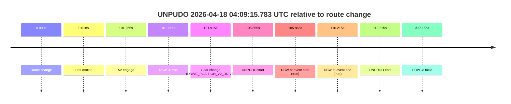
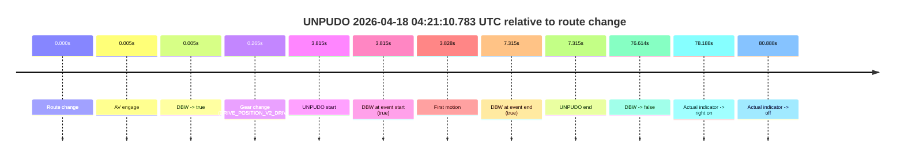
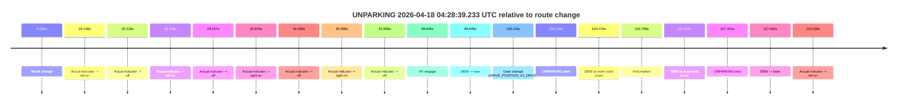

# Run Report: fme10011/2026-04-18--03-55-30--gen2-av-99f34333-21c0-40a3-b8e2-c290b4f81302

| Field | Value |
|---|---|
| Run ID | `fme10011/2026-04-18--03-55-30--gen2-av-99f34333-21c0-40a3-b8e2-c290b4f81302` |
| Date | `2026-04-18` |
| Model(s) | `eel-teal-outspoken` |
| Author | `zak` |
| Event count | `4` |

## unpudo 2026-04-18 04:09:15.783 UTC

| Field | Value |
|---|---|
| Model | `eel-teal-outspoken` |
| Author | `zak` |
| Run ID | `fme10011/2026-04-18--03-55-30--gen2-av-99f34333-21c0-40a3-b8e2-c290b4f81302` |
| Date | `2026-04-18` |
| Time (UTC) | `04:09:15.783` |
| Event type | `unpudo` |
| Disengagement type | `none observed` |
| Route change | `found` |
| Console | [run](https://console.sso.wayve.ai/run/fme10011/2026-04-18--03-55-30--gen2-av-99f34333-21c0-40a3-b8e2-c290b4f81302?id=&time-unixus=1776485355783296) |
| Foxglove | [segment](https://app.foxglove.dev/wayve-on-prem/p/prj_0dX18KZdVHg1fmmI/view?ds=foxglove-stream&ds.deviceName=fme10011&ds.start=2026-04-18T04%3A07%3A19.918283Z&ds.end=2026-04-18T04%3A12%3A57.083807Z&layoutId=lay_0e7VD4WIKDQGU73Y&time=2026-04-18T04%3A09%3A15.783296Z) |

### Event card: pass

- Pass: AV owns the credited unpudo from route change through the official unpudo window, the gear state is aligned at the anchor, and the vehicle moves without driver accelerator help in AV.

| Event | Time (UTC) | Delta from route change |
|---|---:|---:|
| Route change | 2026-04-18 04:07:29.918 | `0.000s` |
| First motion | 2026-04-18 04:07:29.936 | `0.018s` |
| AV engage | 2026-04-18 04:09:11.182 | `101.265s` |
| DBW -> true | 2026-04-18 04:09:11.182 | `101.265s` |
| Gear change (DRIVE_POSITION_V2_DRIVE) | 2026-04-18 04:09:11.833 | `101.915s` |
| UNPUDO start | 2026-04-18 04:09:15.783 | `105.865s` |
| DBW at event start (true) | 2026-04-18 04:09:15.783 | `105.865s` |
| DBW at event end (true) | 2026-04-18 04:09:20.133 | `110.215s` |
| UNPUDO end | 2026-04-18 04:09:20.133 | `110.215s` |
| DBW -> false | 2026-04-18 04:12:47.083 | `317.166s` |

| Metric | Value |
|---|---|
| Outcome | `pass` |
| Effective failure type | `none` |
| Route change status | `found` |
| DBW at event start | `true` |
| DBW at event end | `true` |
| Predicted gear at AV start | `DRIVE_POSITION_V2_PARK` |
| Actual gear at AV start | `DRIVE_POSITION_V2_PARK` |
| Predicted gear at event start | `DRIVE_POSITION_V2_DRIVE` |
| Actual gear at event start | `DRIVE_POSITION_V2_DRIVE` |
| Planned indicator direction | `INDICATORS_STATE_V2_LEFT_ON` |
| Controller indicator direction | `INDICATORS_STATE_V2_LEFT_ON` |
| Actual indicator direction | `INDICATORS_STATE_V2_OFF` |
| Actual indicator at maneuver end | `INDICATORS_STATE_V2_OFF` |
| Driver accel help in AV | `false` |
| Driver accel help timestamp | `n/a` |
| Max accel pedal pct in AV | `0.0%` |
| Max brake pedal pct in AV | `9.7%` |
| Max speed mps in AV | `4.631` |
| Success timing baseline | `route change` |
| Route -> AV | `101.265s` |
| AV -> event start | `4.600s` |
| AV -> first motion | `-101.247s` |
| Success baseline -> event start | `105.865s` |
| Success baseline -> first motion | `0.018s` |
| AV duration before disengagement | `215.901s` |
| Trajectory waypoint count | `37` |
| Driving-plan step count | `11` |

The scored portion starts from the AV-owned window, not from the pre-AV setup. Route-change search in the stopped pre-event segment was `found`, with the baseline therefore set to route change. At the event anchor the model predicts `DRIVE_POSITION_V2_DRIVE` and the actual gear is `DRIVE_POSITION_V2_DRIVE`. The effective model outcome is `pass` because `the credited unpudo stays AV-owned through the official unpudo window.`

### Resolution

| Field | Value |
|---|---|
| Final outcome | `pass` |
| Do we agree with this label? | `yes` |
| Source disengagement type | `none observed` |
| Resolved effective failure type | `none` |
| Confidence | `high` |

## unpudo 2026-04-18 04:14:30.833 UTC

| Field | Value |
|---|---|
| Model | `eel-teal-outspoken` |
| Author | `zak` |
| Run ID | `fme10011/2026-04-18--03-55-30--gen2-av-99f34333-21c0-40a3-b8e2-c290b4f81302` |
| Date | `2026-04-18` |
| Time (UTC) | `04:14:30.833` |
| Event type | `unpudo` |
| Disengagement type | `none observed` |
| Route change | `found` |
| Console | [run](https://console.sso.wayve.ai/run/fme10011/2026-04-18--03-55-30--gen2-av-99f34333-21c0-40a3-b8e2-c290b4f81302?id=&time-unixus=1776485670833299) |
| Foxglove | [segment](https://app.foxglove.dev/wayve-on-prem/p/prj_0dX18KZdVHg1fmmI/view?ds=foxglove-stream&ds.deviceName=fme10011&ds.start=2026-04-18T04%3A12%3A34.468253Z&ds.end=2026-04-18T04%3A20%3A23.783607Z&layoutId=lay_0e7VD4WIKDQGU73Y&time=2026-04-18T04%3A14%3A30.833299Z) |

### Event card: pass

- Pass: AV owns the credited unpudo from route change through the official unpudo window, the gear state is aligned at the anchor, and the vehicle moves without driver accelerator help in AV.

| Event | Time (UTC) | Delta from route change |
|---|---:|---:|
| Route change | 2026-04-18 04:12:44.468 | `0.000s` |
| AV engage | 2026-04-18 04:14:26.242 | `101.775s` |
| DBW -> true | 2026-04-18 04:14:26.242 | `101.775s` |
| Gear change (DRIVE_POSITION_V2_DRIVE) | 2026-04-18 04:14:26.733 | `102.265s` |
| UNPUDO start | 2026-04-18 04:14:30.833 | `106.365s` |
| DBW at event start (true) | 2026-04-18 04:14:30.833 | `106.365s` |
| First motion | 2026-04-18 04:14:30.856 | `106.388s` |
| DBW at event end (true) | 2026-04-18 04:14:35.733 | `111.265s` |
| UNPUDO end | 2026-04-18 04:14:35.733 | `111.265s` |
| Actual indicator -> left on | 2026-04-18 04:20:13.515 | `449.048s` |
| DBW -> false | 2026-04-18 04:20:13.783 | `449.315s` |
| Actual indicator -> off | 2026-04-18 04:20:17.116 | `452.648s` |

| Metric | Value |
|---|---|
| Outcome | `pass` |
| Effective failure type | `none` |
| Route change status | `found` |
| DBW at event start | `true` |
| DBW at event end | `true` |
| Predicted gear at AV start | `DRIVE_POSITION_V2_DRIVE` |
| Actual gear at AV start | `DRIVE_POSITION_V2_PARK` |
| Predicted gear at event start | `DRIVE_POSITION_V2_DRIVE` |
| Actual gear at event start | `DRIVE_POSITION_V2_DRIVE` |
| Planned indicator direction | `INDICATORS_STATE_V2_LEFT_ON` |
| Controller indicator direction | `INDICATORS_STATE_V2_LEFT_ON` |
| Actual indicator direction | `INDICATORS_STATE_V2_OFF` |
| Actual indicator at maneuver end | `INDICATORS_STATE_V2_OFF` |
| Driver accel help in AV | `false` |
| Driver accel help timestamp | `n/a` |
| Max accel pedal pct in AV | `0.0%` |
| Max brake pedal pct in AV | `8.3%` |
| Max speed mps in AV | `4.167` |
| Success timing baseline | `route change` |
| Route -> AV | `101.775s` |
| AV -> event start | `4.590s` |
| AV -> first motion | `4.614s` |
| Success baseline -> event start | `106.365s` |
| Success baseline -> first motion | `106.388s` |
| AV duration before disengagement | `347.541s` |
| Trajectory waypoint count | `38` |
| Driving-plan step count | `11` |

The scored portion starts from the AV-owned window, not from the pre-AV setup. Route-change search in the stopped pre-event segment was `found`, with the baseline therefore set to route change. At the event anchor the model predicts `DRIVE_POSITION_V2_DRIVE` and the actual gear is `DRIVE_POSITION_V2_DRIVE`. The effective model outcome is `pass` because `the credited unpudo stays AV-owned through the official unpudo window.`

### Resolution

| Field | Value |
|---|---|
| Final outcome | `pass` |
| Do we agree with this label? | `yes` |
| Source disengagement type | `none observed` |
| Resolved effective failure type | `none` |
| Confidence | `high` |

## unpudo 2026-04-18 04:21:10.783 UTC

| Field | Value |
|---|---|
| Model | `eel-teal-outspoken` |
| Author | `zak` |
| Run ID | `fme10011/2026-04-18--03-55-30--gen2-av-99f34333-21c0-40a3-b8e2-c290b4f81302` |
| Date | `2026-04-18` |
| Time (UTC) | `04:21:10.783` |
| Event type | `unpudo` |
| Disengagement type | `none observed` |
| Route change | `found` |
| Console | [run](https://console.sso.wayve.ai/run/fme10011/2026-04-18--03-55-30--gen2-av-99f34333-21c0-40a3-b8e2-c290b4f81302?id=&time-unixus=1776486070783304) |
| Foxglove | [segment](https://app.foxglove.dev/wayve-on-prem/p/prj_0dX18KZdVHg1fmmI/view?ds=foxglove-stream&ds.deviceName=fme10011&ds.start=2026-04-18T04%3A20%3A56.968254Z&ds.end=2026-04-18T04%3A22%3A33.582134Z&layoutId=lay_0e7VD4WIKDQGU73Y&time=2026-04-18T04%3A21%3A10.783304Z) |

### Event card: pass

- Pass: AV owns the credited unpudo from route change through the official unpudo window, the gear state is aligned at the anchor, and the vehicle moves without driver accelerator help in AV.

| Event | Time (UTC) | Delta from route change |
|---|---:|---:|
| Route change | 2026-04-18 04:21:06.968 | `0.000s` |
| AV engage | 2026-04-18 04:21:06.972 | `0.005s` |
| DBW -> true | 2026-04-18 04:21:06.972 | `0.005s` |
| Gear change (DRIVE_POSITION_V2_DRIVE) | 2026-04-18 04:21:07.233 | `0.265s` |
| UNPUDO start | 2026-04-18 04:21:10.783 | `3.815s` |
| DBW at event start (true) | 2026-04-18 04:21:10.783 | `3.815s` |
| First motion | 2026-04-18 04:21:10.795 | `3.828s` |
| DBW at event end (true) | 2026-04-18 04:21:14.283 | `7.315s` |
| UNPUDO end | 2026-04-18 04:21:14.283 | `7.315s` |
| DBW -> false | 2026-04-18 04:22:23.582 | `76.614s` |
| Actual indicator -> right on | 2026-04-18 04:22:25.155 | `78.188s` |
| Actual indicator -> off | 2026-04-18 04:22:27.856 | `80.888s` |

| Metric | Value |
|---|---|
| Outcome | `pass` |
| Effective failure type | `none` |
| Route change status | `found` |
| DBW at event start | `true` |
| DBW at event end | `true` |
| Predicted gear at AV start | `DRIVE_POSITION_V2_PARK` |
| Actual gear at AV start | `DRIVE_POSITION_V2_PARK` |
| Predicted gear at event start | `DRIVE_POSITION_V2_DRIVE` |
| Actual gear at event start | `DRIVE_POSITION_V2_DRIVE` |
| Planned indicator direction | `INDICATORS_STATE_V2_LEFT_ON` |
| Controller indicator direction | `INDICATORS_STATE_V2_LEFT_ON` |
| Actual indicator direction | `INDICATORS_STATE_V2_OFF` |
| Actual indicator at maneuver end | `INDICATORS_STATE_V2_OFF` |
| Driver accel help in AV | `false` |
| Driver accel help timestamp | `n/a` |
| Max accel pedal pct in AV | `0.0%` |
| Max brake pedal pct in AV | `8.1%` |
| Max speed mps in AV | `5.011` |
| Success timing baseline | `route change` |
| Route -> AV | `0.005s` |
| AV -> event start | `3.810s` |
| AV -> first motion | `3.823s` |
| Success baseline -> event start | `3.815s` |
| Success baseline -> first motion | `3.828s` |
| AV duration before disengagement | `76.609s` |
| Trajectory waypoint count | `37` |
| Driving-plan step count | `11` |

The scored portion starts from the AV-owned window, not from the pre-AV setup. Route-change search in the stopped pre-event segment was `found`, with the baseline therefore set to route change. At the event anchor the model predicts `DRIVE_POSITION_V2_DRIVE` and the actual gear is `DRIVE_POSITION_V2_DRIVE`. The effective model outcome is `pass` because `the credited unpudo stays AV-owned through the official unpudo window.`

### Resolution

| Field | Value |
|---|---|
| Final outcome | `pass` |
| Do we agree with this label? | `yes` |
| Source disengagement type | `none observed` |
| Resolved effective failure type | `none` |
| Confidence | `high` |

## unparking 2026-04-18 04:28:39.233 UTC

| Field | Value |
|---|---|
| Model | `eel-teal-outspoken` |
| Author | `zak` |
| Run ID | `fme10011/2026-04-18--03-55-30--gen2-av-99f34333-21c0-40a3-b8e2-c290b4f81302` |
| Date | `2026-04-18` |
| Time (UTC) | `04:28:39.233` |
| Event type | `unparking` |
| Disengagement type | `none observed` |
| Route change | `found` |
| Console | [run](https://console.sso.wayve.ai/run/fme10011/2026-04-18--03-55-30--gen2-av-99f34333-21c0-40a3-b8e2-c290b4f81302?id=&time-unixus=1776486519233297) |
| Foxglove | [segment](https://app.foxglove.dev/wayve-on-prem/p/prj_0dX18KZdVHg1fmmI/view?ds=foxglove-stream&ds.deviceName=fme10011&ds.start=2026-04-18T04%3A26%3A45.518274Z&ds.end=2026-04-18T04%3A29%3A03.162789Z&layoutId=lay_0e7VD4WIKDQGU73Y&time=2026-04-18T04%3A28%3A39.233297Z) |

### Event card: pass

- Pass: AV owns the credited unparking through the official event window, the gear state is aligned at the anchor, and the vehicle moves without driver accelerator help in AV.

| Event | Time (UTC) | Delta from route change |
|---|---:|---:|
| Route change | 2026-04-18 04:26:55.518 | `0.000s` |
| Actual indicator -> left on | 2026-04-18 04:27:18.675 | `23.158s` |
| Actual indicator -> off | 2026-04-18 04:27:20.735 | `25.218s` |
| Actual indicator -> left on | 2026-04-18 04:27:21.895 | `26.378s` |
| Actual indicator -> off | 2026-04-18 04:27:24.675 | `29.157s` |
| Actual indicator -> right on | 2026-04-18 04:27:26.395 | `30.878s` |
| Actual indicator -> off | 2026-04-18 04:27:29.576 | `34.058s` |
| Actual indicator -> right on | 2026-04-18 04:27:30.615 | `35.098s` |
| Actual indicator -> off | 2026-04-18 04:27:38.476 | `42.958s` |
| AV engage | 2026-04-18 04:28:35.162 | `99.645s` |
| DBW -> true | 2026-04-18 04:28:35.162 | `99.645s` |
| Gear change (DRIVE_POSITION_V2_DRIVE) | 2026-04-18 04:28:35.633 | `100.115s` |
| UNPARKING start | 2026-04-18 04:28:39.233 | `103.715s` |
| DBW at event start (true) | 2026-04-18 04:28:39.233 | `103.715s` |
| First motion | 2026-04-18 04:28:39.276 | `103.758s` |
| DBW at event end (true) | 2026-04-18 04:28:42.833 | `107.315s` |
| UNPARKING end | 2026-04-18 04:28:42.833 | `107.315s` |
| DBW -> false | 2026-04-18 04:28:53.162 | `117.645s` |
| Actual indicator -> left on | 2026-04-18 04:28:55.055 | `119.538s` |

| Metric | Value |
|---|---|
| Outcome | `pass` |
| Effective failure type | `none` |
| Route change status | `found` |
| DBW at event start | `true` |
| DBW at event end | `true` |
| Predicted gear at AV start | `DRIVE_POSITION_V2_DRIVE` |
| Actual gear at AV start | `DRIVE_POSITION_V2_PARK` |
| Predicted gear at event start | `DRIVE_POSITION_V2_DRIVE` |
| Actual gear at event start | `DRIVE_POSITION_V2_DRIVE` |
| Planned indicator direction | `INDICATORS_STATE_V2_LEFT_ON` |
| Controller indicator direction | `INDICATORS_STATE_V2_LEFT_ON` |
| Actual indicator direction | `INDICATORS_STATE_V2_OFF` |
| Actual indicator at maneuver end | `INDICATORS_STATE_V2_OFF` |
| Driver accel help in AV | `false` |
| Driver accel help timestamp | `n/a` |
| Max accel pedal pct in AV | `0.0%` |
| Max brake pedal pct in AV | `0.0%` |
| Max speed mps in AV | `4.522` |
| Success timing baseline | `route change` |
| Route -> AV | `99.645s` |
| AV -> event start | `4.070s` |
| AV -> first motion | `4.113s` |
| Success baseline -> event start | `103.715s` |
| Success baseline -> first motion | `103.758s` |
| AV duration before disengagement | `18.000s` |
| Trajectory waypoint count | `38` |
| Driving-plan step count | `11` |

The scored portion starts from the AV-owned window, not from the pre-AV setup. Route-change search in the stopped pre-event segment was `found`, with the baseline therefore set to route change. At the event anchor the model predicts `DRIVE_POSITION_V2_DRIVE` and the actual gear is `DRIVE_POSITION_V2_DRIVE`. The effective model outcome is `pass` because `the credited maneuver stays AV-owned through the official event end.`

### Resolution

| Field | Value |
|---|---|
| Final outcome | `pass` |
| Do we agree with this label? | `yes` |
| Source disengagement type | `none observed` |
| Resolved effective failure type | `none` |
| Confidence | `high` |
