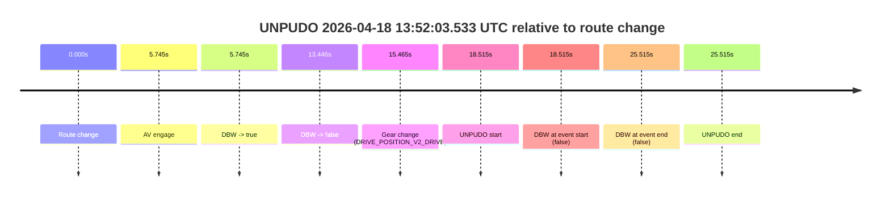
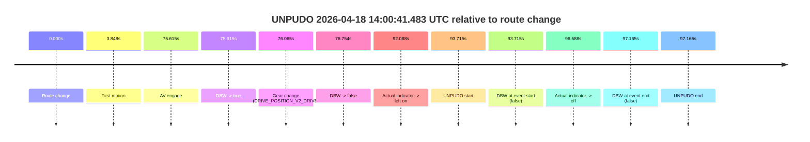
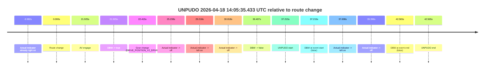
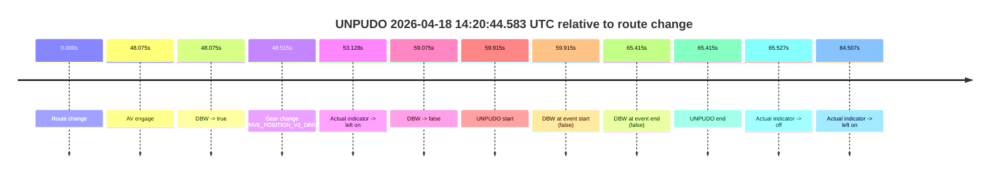
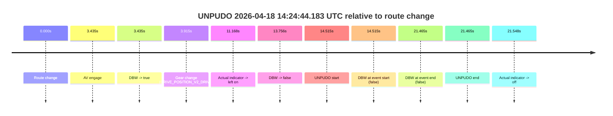
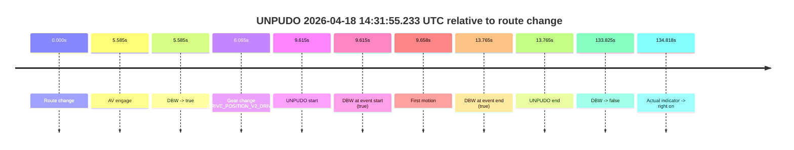
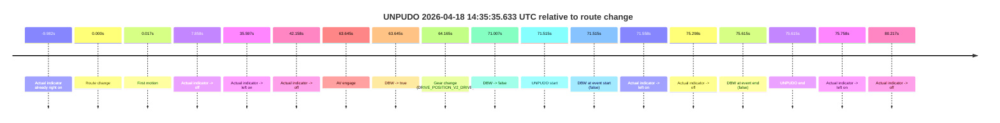
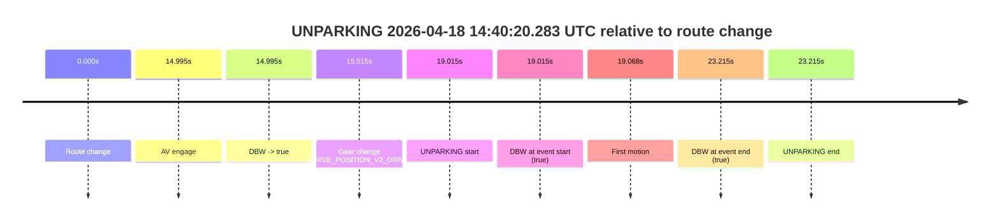

# Run Report: fme10011/2026-04-18--13-41-05--gen2-av-90fbabfd-d67a-43b9-914e-033e8f21a341

| Field | Value |
|---|---|
| Run ID | `fme10011/2026-04-18--13-41-05--gen2-av-90fbabfd-d67a-43b9-914e-033e8f21a341` |
| Date | `2026-04-18` |
| Model(s) | `armadillo-amethyst-squeaky` |
| Author | `guy.geva` |
| Event count | `8` |

## unpudo 2026-04-18 13:52:03.533 UTC

| Field | Value |
|---|---|
| Model | `armadillo-amethyst-squeaky` |
| Author | `guy.geva` |
| Run ID | `fme10011/2026-04-18--13-41-05--gen2-av-90fbabfd-d67a-43b9-914e-033e8f21a341` |
| Date | `2026-04-18` |
| Time (UTC) | `13:52:03.533` |
| Event type | `unpudo` |
| Disengagement type | `uncategorised` |
| Route change | `found` |
| Console | [run](https://console.sso.wayve.ai/run/fme10011/2026-04-18--13-41-05--gen2-av-90fbabfd-d67a-43b9-914e-033e8f21a341?id=&time-unixus=1776520323533291) |
| Foxglove | [segment](https://app.foxglove.dev/wayve-on-prem/p/prj_0dX18KZdVHg1fmmI/view?ds=foxglove-stream&ds.deviceName=fme10011&ds.start=2026-04-18T13%3A51%3A35.018245Z&ds.end=2026-04-18T13%3A52%3A20.533318Z&layoutId=lay_0e7VD4WIKDQGU73Y&time=2026-04-18T13%3A52%3A03.533291Z) |

### Event card: fail

- Fail: AV owns part of the segment, but the event still resolves as a model-performance failure under the AV-only scoring rule.

| Event | Time (UTC) | Delta from route change |
|---|---:|---:|
| Route change | 2026-04-18 13:51:45.018 | `0.000s` |
| AV engage | 2026-04-18 13:51:50.763 | `5.745s` |
| DBW -> true | 2026-04-18 13:51:50.763 | `5.745s` |
| DBW -> false | 2026-04-18 13:51:58.463 | `13.446s` |
| Gear change (DRIVE_POSITION_V2_DRIVE) | 2026-04-18 13:52:00.483 | `15.465s` |
| UNPUDO start | 2026-04-18 13:52:03.533 | `18.515s` |
| DBW at event start (false) | 2026-04-18 13:52:03.533 | `18.515s` |
| DBW at event end (false) | 2026-04-18 13:52:10.533 | `25.515s` |
| UNPUDO end | 2026-04-18 13:52:10.533 | `25.515s` |

| Metric | Value |
|---|---|
| Outcome | `fail` |
| Effective failure type | `uncategorised` |
| Route change status | `found` |
| DBW at event start | `false` |
| DBW at event end | `false` |
| Predicted gear at AV start | `DRIVE_POSITION_V2_REVERSE` |
| Actual gear at AV start | `DRIVE_POSITION_V2_PARK` |
| Predicted gear at event start | `DRIVE_POSITION_V2_DRIVE` |
| Actual gear at event start | `DRIVE_POSITION_V2_DRIVE` |
| Planned indicator direction | `INDICATORS_STATE_V2_OFF` |
| Controller indicator direction | `INDICATORS_STATE_V2_OFF` |
| Actual indicator direction | `INDICATORS_STATE_V2_OFF` |
| Actual indicator at maneuver end | `INDICATORS_STATE_V2_OFF` |
| Driver accel help in AV | `false` |
| Driver accel help timestamp | `n/a` |
| Max accel pedal pct in AV | `0.0%` |
| Max brake pedal pct in AV | `8.0%` |
| Max speed mps in AV | `0.000` |
| Success timing baseline | `route change` |
| Route -> AV | `5.745s` |
| AV -> event start | `12.770s` |
| AV -> first motion | `n/a` |
| Success baseline -> event start | `18.515s` |
| Success baseline -> first motion | `n/a` |
| AV duration before disengagement | `7.700s` |
| Trajectory waypoint count | `38` |
| Driving-plan step count | `11` |

The scored portion starts from the AV-owned window, not from the pre-AV setup. Route-change search in the stopped pre-event segment was `found`, with the baseline therefore set to route change. At the event anchor the model predicts `DRIVE_POSITION_V2_DRIVE` and the actual gear is `DRIVE_POSITION_V2_DRIVE`. The effective model outcome is `fail` because `uncategorised.`

### Resolution

| Field | Value |
|---|---|
| Final outcome | `fail` |
| Do we agree with this label? | `yes` |
| Source disengagement type | `uncategorised` |
| Resolved effective failure type | `uncategorised` |
| Confidence | `high` |

## unpudo 2026-04-18 14:00:41.483 UTC

| Field | Value |
|---|---|
| Model | `armadillo-amethyst-squeaky` |
| Author | `guy.geva` |
| Run ID | `fme10011/2026-04-18--13-41-05--gen2-av-90fbabfd-d67a-43b9-914e-033e8f21a341` |
| Date | `2026-04-18` |
| Time (UTC) | `14:00:41.483` |
| Event type | `unpudo` |
| Disengagement type | `uncategorised` |
| Route change | `found` |
| Console | [run](https://console.sso.wayve.ai/run/fme10011/2026-04-18--13-41-05--gen2-av-90fbabfd-d67a-43b9-914e-033e8f21a341?id=&time-unixus=1776520841483307) |
| Foxglove | [segment](https://app.foxglove.dev/wayve-on-prem/p/prj_0dX18KZdVHg1fmmI/view?ds=foxglove-stream&ds.deviceName=fme10011&ds.start=2026-04-18T13%3A58%3A57.768241Z&ds.end=2026-04-18T14%3A00%3A54.933308Z&layoutId=lay_0e7VD4WIKDQGU73Y&time=2026-04-18T14%3A00%3A41.483307Z) |

### Event card: accidental

- Accidental: AV ownership is present for less than `2s`, so this is treated as an accidental brush with the maneuver rather than a meaningful model attempt.

| Event | Time (UTC) | Delta from route change |
|---|---:|---:|
| Route change | 2026-04-18 13:59:07.768 | `0.000s` |
| First motion | 2026-04-18 13:59:11.615 | `3.848s` |
| AV engage | 2026-04-18 14:00:23.383 | `75.615s` |
| DBW -> true | 2026-04-18 14:00:23.383 | `75.615s` |
| Gear change (DRIVE_POSITION_V2_DRIVE) | 2026-04-18 14:00:23.833 | `76.065s` |
| DBW -> false | 2026-04-18 14:00:24.522 | `76.754s` |
| Actual indicator -> left on | 2026-04-18 14:00:39.856 | `92.088s` |
| UNPUDO start | 2026-04-18 14:00:41.483 | `93.715s` |
| DBW at event start (false) | 2026-04-18 14:00:41.483 | `93.715s` |
| Actual indicator -> off | 2026-04-18 14:00:44.355 | `96.588s` |
| DBW at event end (false) | 2026-04-18 14:00:44.933 | `97.165s` |
| UNPUDO end | 2026-04-18 14:00:44.933 | `97.165s` |

| Metric | Value |
|---|---|
| Outcome | `accidental` |
| Effective failure type | `none` |
| Route change status | `found` |
| DBW at event start | `false` |
| DBW at event end | `false` |
| Predicted gear at AV start | `DRIVE_POSITION_V2_DRIVE` |
| Actual gear at AV start | `DRIVE_POSITION_V2_PARK` |
| Predicted gear at event start | `DRIVE_POSITION_V2_DRIVE` |
| Actual gear at event start | `DRIVE_POSITION_V2_DRIVE` |
| Planned indicator direction | `INDICATORS_STATE_V2_RIGHT_ON` |
| Controller indicator direction | `INDICATORS_STATE_V2_RIGHT_ON` |
| Actual indicator direction | `INDICATORS_STATE_V2_LEFT_ON` |
| Actual indicator at maneuver end | `INDICATORS_STATE_V2_OFF` |
| Driver accel help in AV | `false` |
| Driver accel help timestamp | `n/a` |
| Max accel pedal pct in AV | `0.0%` |
| Max brake pedal pct in AV | `8.0%` |
| Max speed mps in AV | `0.000` |
| Success timing baseline | `route change` |
| Route -> AV | `75.615s` |
| AV -> event start | `18.100s` |
| AV -> first motion | `-71.768s` |
| Success baseline -> event start | `93.715s` |
| Success baseline -> first motion | `3.848s` |
| AV duration before disengagement | `1.139s` |
| Trajectory waypoint count | `37` |
| Driving-plan step count | `11` |

The scored portion starts from the AV-owned window, not from the pre-AV setup. Route-change search in the stopped pre-event segment was `found`, with the baseline therefore set to route change. At the event anchor the model predicts `DRIVE_POSITION_V2_DRIVE` and the actual gear is `DRIVE_POSITION_V2_DRIVE`. The effective model outcome is `accidental` because `the AV-owned portion is shorter than 2s.`

### Resolution

| Field | Value |
|---|---|
| Final outcome | `accidental` |
| Do we agree with this label? | `yes` |
| Source disengagement type | `uncategorised` |
| Resolved effective failure type | `none` |
| Confidence | `high` |

## unpudo 2026-04-18 14:05:35.433 UTC

| Field | Value |
|---|---|
| Model | `armadillo-amethyst-squeaky` |
| Author | `guy.geva` |
| Run ID | `fme10011/2026-04-18--13-41-05--gen2-av-90fbabfd-d67a-43b9-914e-033e8f21a341` |
| Date | `2026-04-18` |
| Time (UTC) | `14:05:35.433` |
| Event type | `unpudo` |
| Disengagement type | `failed_to_unpudo` |
| Route change | `found` |
| Console | [run](https://console.sso.wayve.ai/run/fme10011/2026-04-18--13-41-05--gen2-av-90fbabfd-d67a-43b9-914e-033e8f21a341?id=&time-unixus=1776521135433313) |
| Foxglove | [segment](https://app.foxglove.dev/wayve-on-prem/p/prj_0dX18KZdVHg1fmmI/view?ds=foxglove-stream&ds.deviceName=fme10011&ds.start=2026-04-18T14%3A04%3A48.218245Z&ds.end=2026-04-18T14%3A05%3A50.783309Z&layoutId=lay_0e7VD4WIKDQGU73Y&time=2026-04-18T14%3A05%3A35.433313Z) |

### Event card: fail

- Fail: AV owns part of the segment, but the event still resolves as a model-performance failure under the AV-only scoring rule.

| Event | Time (UTC) | Delta from route change |
|---|---:|---:|
| Actual indicator already right on | 2026-04-18 14:04:48.235 | `-9.982s` |
| Route change | 2026-04-18 14:04:58.218 | `0.000s` |
| AV engage | 2026-04-18 14:05:20.143 | `21.925s` |
| DBW -> true | 2026-04-18 14:05:20.143 | `21.925s` |
| Gear change (DRIVE_POSITION_V2_DRIVE) | 2026-04-18 14:05:20.633 | `22.415s` |
| Actual indicator -> off | 2026-04-18 14:05:23.455 | `25.238s` |
| Actual indicator -> left on | 2026-04-18 14:05:27.435 | `29.218s` |
| Actual indicator -> off | 2026-04-18 14:05:29.035 | `30.818s` |
| DBW -> false | 2026-04-18 14:05:34.624 | `36.407s` |
| UNPUDO start | 2026-04-18 14:05:35.433 | `37.215s` |
| DBW at event start (false) | 2026-04-18 14:05:35.433 | `37.215s` |
| Actual indicator -> left on | 2026-04-18 14:05:35.916 | `37.698s` |
| Actual indicator -> off | 2026-04-18 14:05:37.616 | `39.398s` |
| DBW at event end (false) | 2026-04-18 14:05:40.783 | `42.565s` |
| UNPUDO end | 2026-04-18 14:05:40.783 | `42.565s` |

| Metric | Value |
|---|---|
| Outcome | `fail` |
| Effective failure type | `failed_to_unpudo` |
| Route change status | `found` |
| DBW at event start | `false` |
| DBW at event end | `false` |
| Predicted gear at AV start | `DRIVE_POSITION_V2_DRIVE` |
| Actual gear at AV start | `DRIVE_POSITION_V2_PARK` |
| Predicted gear at event start | `DRIVE_POSITION_V2_DRIVE` |
| Actual gear at event start | `DRIVE_POSITION_V2_DRIVE` |
| Planned indicator direction | `INDICATORS_STATE_V2_LEFT_ON` |
| Controller indicator direction | `INDICATORS_STATE_V2_LEFT_ON` |
| Actual indicator direction | `INDICATORS_STATE_V2_OFF` |
| Actual indicator at maneuver end | `INDICATORS_STATE_V2_OFF` |
| Driver accel help in AV | `false` |
| Driver accel help timestamp | `n/a` |
| Max accel pedal pct in AV | `0.0%` |
| Max brake pedal pct in AV | `8.0%` |
| Max speed mps in AV | `0.000` |
| Success timing baseline | `route change` |
| Route -> AV | `21.925s` |
| AV -> event start | `15.290s` |
| AV -> first motion | `n/a` |
| Success baseline -> event start | `37.215s` |
| Success baseline -> first motion | `n/a` |
| AV duration before disengagement | `14.481s` |
| Trajectory waypoint count | `36` |
| Driving-plan step count | `11` |

The scored portion starts from the AV-owned window, not from the pre-AV setup. Route-change search in the stopped pre-event segment was `found`, with the baseline therefore set to route change. At the event anchor the model predicts `DRIVE_POSITION_V2_DRIVE` and the actual gear is `DRIVE_POSITION_V2_DRIVE`. The effective model outcome is `fail` because `failed_to_unpudo.`

### Resolution

| Field | Value |
|---|---|
| Final outcome | `fail` |
| Do we agree with this label? | `yes` |
| Source disengagement type | `failed_to_unpudo` |
| Resolved effective failure type | `failed_to_unpudo` |
| Confidence | `high` |

## unpudo 2026-04-18 14:20:44.583 UTC

| Field | Value |
|---|---|
| Model | `armadillo-amethyst-squeaky` |
| Author | `guy.geva` |
| Run ID | `fme10011/2026-04-18--13-41-05--gen2-av-90fbabfd-d67a-43b9-914e-033e8f21a341` |
| Date | `2026-04-18` |
| Time (UTC) | `14:20:44.583` |
| Event type | `unpudo` |
| Disengagement type | `failed_to_unpudo` |
| Route change | `found` |
| Console | [run](https://console.sso.wayve.ai/run/fme10011/2026-04-18--13-41-05--gen2-av-90fbabfd-d67a-43b9-914e-033e8f21a341?id=&time-unixus=1776522044583314) |
| Foxglove | [segment](https://app.foxglove.dev/wayve-on-prem/p/prj_0dX18KZdVHg1fmmI/view?ds=foxglove-stream&ds.deviceName=fme10011&ds.start=2026-04-18T14%3A19%3A34.668317Z&ds.end=2026-04-18T14%3A21%3A00.083307Z&layoutId=lay_0e7VD4WIKDQGU73Y&time=2026-04-18T14%3A20%3A44.583314Z) |

### Event card: fail

- Fail: AV owns part of the segment, but the event still resolves as a model-performance failure under the AV-only scoring rule.

| Event | Time (UTC) | Delta from route change |
|---|---:|---:|
| Route change | 2026-04-18 14:19:44.668 | `0.000s` |
| AV engage | 2026-04-18 14:20:32.743 | `48.075s` |
| DBW -> true | 2026-04-18 14:20:32.743 | `48.075s` |
| Gear change (DRIVE_POSITION_V2_DRIVE) | 2026-04-18 14:20:33.183 | `48.515s` |
| Actual indicator -> left on | 2026-04-18 14:20:37.795 | `53.128s` |
| DBW -> false | 2026-04-18 14:20:43.743 | `59.075s` |
| UNPUDO start | 2026-04-18 14:20:44.583 | `59.915s` |
| DBW at event start (false) | 2026-04-18 14:20:44.583 | `59.915s` |
| DBW at event end (false) | 2026-04-18 14:20:50.083 | `65.415s` |
| UNPUDO end | 2026-04-18 14:20:50.083 | `65.415s` |
| Actual indicator -> off | 2026-04-18 14:20:50.195 | `65.527s` |
| Actual indicator -> left on | 2026-04-18 14:21:09.175 | `84.507s` |

| Metric | Value |
|---|---|
| Outcome | `fail` |
| Effective failure type | `failed_to_unpudo` |
| Route change status | `found` |
| DBW at event start | `false` |
| DBW at event end | `false` |
| Predicted gear at AV start | `DRIVE_POSITION_V2_DRIVE` |
| Actual gear at AV start | `DRIVE_POSITION_V2_PARK` |
| Predicted gear at event start | `DRIVE_POSITION_V2_DRIVE` |
| Actual gear at event start | `DRIVE_POSITION_V2_DRIVE` |
| Planned indicator direction | `INDICATORS_STATE_V2_OFF` |
| Controller indicator direction | `INDICATORS_STATE_V2_OFF` |
| Actual indicator direction | `INDICATORS_STATE_V2_LEFT_ON` |
| Actual indicator at maneuver end | `INDICATORS_STATE_V2_LEFT_ON` |
| Driver accel help in AV | `false` |
| Driver accel help timestamp | `n/a` |
| Max accel pedal pct in AV | `0.0%` |
| Max brake pedal pct in AV | `8.0%` |
| Max speed mps in AV | `0.000` |
| Success timing baseline | `route change` |
| Route -> AV | `48.075s` |
| AV -> event start | `11.840s` |
| AV -> first motion | `n/a` |
| Success baseline -> event start | `59.915s` |
| Success baseline -> first motion | `n/a` |
| AV duration before disengagement | `11.000s` |
| Trajectory waypoint count | `37` |
| Driving-plan step count | `11` |

The scored portion starts from the AV-owned window, not from the pre-AV setup. Route-change search in the stopped pre-event segment was `found`, with the baseline therefore set to route change. At the event anchor the model predicts `DRIVE_POSITION_V2_DRIVE` and the actual gear is `DRIVE_POSITION_V2_DRIVE`. The effective model outcome is `fail` because `failed_to_unpudo.`

### Resolution

| Field | Value |
|---|---|
| Final outcome | `fail` |
| Do we agree with this label? | `yes` |
| Source disengagement type | `failed_to_unpudo` |
| Resolved effective failure type | `failed_to_unpudo` |
| Confidence | `high` |

## unpudo 2026-04-18 14:24:44.183 UTC

| Field | Value |
|---|---|
| Model | `armadillo-amethyst-squeaky` |
| Author | `guy.geva` |
| Run ID | `fme10011/2026-04-18--13-41-05--gen2-av-90fbabfd-d67a-43b9-914e-033e8f21a341` |
| Date | `2026-04-18` |
| Time (UTC) | `14:24:44.183` |
| Event type | `unpudo` |
| Disengagement type | `failed_to_unpudo` |
| Route change | `found` |
| Console | [run](https://console.sso.wayve.ai/run/fme10011/2026-04-18--13-41-05--gen2-av-90fbabfd-d67a-43b9-914e-033e8f21a341?id=&time-unixus=1776522284183297) |
| Foxglove | [segment](https://app.foxglove.dev/wayve-on-prem/p/prj_0dX18KZdVHg1fmmI/view?ds=foxglove-stream&ds.deviceName=fme10011&ds.start=2026-04-18T14%3A24%3A19.668352Z&ds.end=2026-04-18T14%3A25%3A01.133315Z&layoutId=lay_0e7VD4WIKDQGU73Y&time=2026-04-18T14%3A24%3A44.183297Z) |

### Event card: fail

- Fail: AV owns part of the segment, but the event still resolves as a model-performance failure under the AV-only scoring rule.

| Event | Time (UTC) | Delta from route change |
|---|---:|---:|
| Route change | 2026-04-18 14:24:29.668 | `0.000s` |
| AV engage | 2026-04-18 14:24:33.103 | `3.435s` |
| DBW -> true | 2026-04-18 14:24:33.103 | `3.435s` |
| Gear change (DRIVE_POSITION_V2_DRIVE) | 2026-04-18 14:24:33.583 | `3.915s` |
| Actual indicator -> left on | 2026-04-18 14:24:40.835 | `11.168s` |
| DBW -> false | 2026-04-18 14:24:43.424 | `13.756s` |
| UNPUDO start | 2026-04-18 14:24:44.183 | `14.515s` |
| DBW at event start (false) | 2026-04-18 14:24:44.183 | `14.515s` |
| DBW at event end (false) | 2026-04-18 14:24:51.133 | `21.465s` |
| UNPUDO end | 2026-04-18 14:24:51.133 | `21.465s` |
| Actual indicator -> off | 2026-04-18 14:24:51.215 | `21.548s` |

| Metric | Value |
|---|---|
| Outcome | `fail` |
| Effective failure type | `failed_to_unpudo` |
| Route change status | `found` |
| DBW at event start | `false` |
| DBW at event end | `false` |
| Predicted gear at AV start | `DRIVE_POSITION_V2_REVERSE` |
| Actual gear at AV start | `DRIVE_POSITION_V2_PARK` |
| Predicted gear at event start | `DRIVE_POSITION_V2_DRIVE` |
| Actual gear at event start | `DRIVE_POSITION_V2_DRIVE` |
| Planned indicator direction | `INDICATORS_STATE_V2_OFF` |
| Controller indicator direction | `INDICATORS_STATE_V2_OFF` |
| Actual indicator direction | `INDICATORS_STATE_V2_LEFT_ON` |
| Actual indicator at maneuver end | `INDICATORS_STATE_V2_LEFT_ON` |
| Driver accel help in AV | `false` |
| Driver accel help timestamp | `n/a` |
| Max accel pedal pct in AV | `0.0%` |
| Max brake pedal pct in AV | `8.0%` |
| Max speed mps in AV | `0.000` |
| Success timing baseline | `route change` |
| Route -> AV | `3.435s` |
| AV -> event start | `11.080s` |
| AV -> first motion | `n/a` |
| Success baseline -> event start | `14.515s` |
| Success baseline -> first motion | `n/a` |
| AV duration before disengagement | `10.321s` |
| Trajectory waypoint count | `37` |
| Driving-plan step count | `11` |

The scored portion starts from the AV-owned window, not from the pre-AV setup. Route-change search in the stopped pre-event segment was `found`, with the baseline therefore set to route change. At the event anchor the model predicts `DRIVE_POSITION_V2_DRIVE` and the actual gear is `DRIVE_POSITION_V2_DRIVE`. The effective model outcome is `fail` because `failed_to_unpudo.`

### Resolution

| Field | Value |
|---|---|
| Final outcome | `fail` |
| Do we agree with this label? | `yes` |
| Source disengagement type | `failed_to_unpudo` |
| Resolved effective failure type | `failed_to_unpudo` |
| Confidence | `high` |

## unpudo 2026-04-18 14:31:55.233 UTC

| Field | Value |
|---|---|
| Model | `armadillo-amethyst-squeaky` |
| Author | `guy.geva` |
| Run ID | `fme10011/2026-04-18--13-41-05--gen2-av-90fbabfd-d67a-43b9-914e-033e8f21a341` |
| Date | `2026-04-18` |
| Time (UTC) | `14:31:55.233` |
| Event type | `unpudo` |
| Disengagement type | `none observed` |
| Route change | `found` |
| Console | [run](https://console.sso.wayve.ai/run/fme10011/2026-04-18--13-41-05--gen2-av-90fbabfd-d67a-43b9-914e-033e8f21a341?id=&time-unixus=1776522715233293) |
| Foxglove | [segment](https://app.foxglove.dev/wayve-on-prem/p/prj_0dX18KZdVHg1fmmI/view?ds=foxglove-stream&ds.deviceName=fme10011&ds.start=2026-04-18T14%3A31%3A35.618246Z&ds.end=2026-04-18T14%3A34%3A09.443292Z&layoutId=lay_0e7VD4WIKDQGU73Y&time=2026-04-18T14%3A31%3A55.233293Z) |

### Event card: pass

- Pass: AV owns the credited unpudo from route change through the official unpudo window, the gear state is aligned at the anchor, and the vehicle moves without driver accelerator help in AV.

| Event | Time (UTC) | Delta from route change |
|---|---:|---:|
| Route change | 2026-04-18 14:31:45.618 | `0.000s` |
| AV engage | 2026-04-18 14:31:51.203 | `5.585s` |
| DBW -> true | 2026-04-18 14:31:51.203 | `5.585s` |
| Gear change (DRIVE_POSITION_V2_DRIVE) | 2026-04-18 14:31:51.683 | `6.065s` |
| UNPUDO start | 2026-04-18 14:31:55.233 | `9.615s` |
| DBW at event start (true) | 2026-04-18 14:31:55.233 | `9.615s` |
| First motion | 2026-04-18 14:31:55.276 | `9.658s` |
| DBW at event end (true) | 2026-04-18 14:31:59.383 | `13.765s` |
| UNPUDO end | 2026-04-18 14:31:59.383 | `13.765s` |
| DBW -> false | 2026-04-18 14:33:59.443 | `133.825s` |
| Actual indicator -> right on | 2026-04-18 14:34:00.435 | `134.818s` |

| Metric | Value |
|---|---|
| Outcome | `pass` |
| Effective failure type | `none` |
| Route change status | `found` |
| DBW at event start | `true` |
| DBW at event end | `true` |
| Predicted gear at AV start | `DRIVE_POSITION_V2_DRIVE` |
| Actual gear at AV start | `DRIVE_POSITION_V2_PARK` |
| Predicted gear at event start | `DRIVE_POSITION_V2_DRIVE` |
| Actual gear at event start | `DRIVE_POSITION_V2_DRIVE` |
| Planned indicator direction | `INDICATORS_STATE_V2_OFF` |
| Controller indicator direction | `INDICATORS_STATE_V2_OFF` |
| Actual indicator direction | `INDICATORS_STATE_V2_OFF` |
| Actual indicator at maneuver end | `INDICATORS_STATE_V2_OFF` |
| Driver accel help in AV | `false` |
| Driver accel help timestamp | `n/a` |
| Max accel pedal pct in AV | `0.0%` |
| Max brake pedal pct in AV | `8.0%` |
| Max speed mps in AV | `3.153` |
| Success timing baseline | `route change` |
| Route -> AV | `5.585s` |
| AV -> event start | `4.030s` |
| AV -> first motion | `4.073s` |
| Success baseline -> event start | `9.615s` |
| Success baseline -> first motion | `9.658s` |
| AV duration before disengagement | `128.240s` |
| Trajectory waypoint count | `38` |
| Driving-plan step count | `11` |

The scored portion starts from the AV-owned window, not from the pre-AV setup. Route-change search in the stopped pre-event segment was `found`, with the baseline therefore set to route change. At the event anchor the model predicts `DRIVE_POSITION_V2_DRIVE` and the actual gear is `DRIVE_POSITION_V2_DRIVE`. The effective model outcome is `pass` because `the credited unpudo stays AV-owned through the official unpudo window.`

### Resolution

| Field | Value |
|---|---|
| Final outcome | `pass` |
| Do we agree with this label? | `yes` |
| Source disengagement type | `none observed` |
| Resolved effective failure type | `none` |
| Confidence | `high` |

## unpudo 2026-04-18 14:35:35.633 UTC

| Field | Value |
|---|---|
| Model | `armadillo-amethyst-squeaky` |
| Author | `guy.geva` |
| Run ID | `fme10011/2026-04-18--13-41-05--gen2-av-90fbabfd-d67a-43b9-914e-033e8f21a341` |
| Date | `2026-04-18` |
| Time (UTC) | `14:35:35.633` |
| Event type | `unpudo` |
| Disengagement type | `failed_to_unpudo` |
| Route change | `found` |
| Console | [run](https://console.sso.wayve.ai/run/fme10011/2026-04-18--13-41-05--gen2-av-90fbabfd-d67a-43b9-914e-033e8f21a341?id=&time-unixus=1776522935633322) |
| Foxglove | [segment](https://app.foxglove.dev/wayve-on-prem/p/prj_0dX18KZdVHg1fmmI/view?ds=foxglove-stream&ds.deviceName=fme10011&ds.start=2026-04-18T14%3A34%3A14.118319Z&ds.end=2026-04-18T14%3A35%3A49.733322Z&layoutId=lay_0e7VD4WIKDQGU73Y&time=2026-04-18T14%3A35%3A35.633322Z) |

### Event card: fail

- Fail: AV owns part of the segment, but the event still resolves as a model-performance failure under the AV-only scoring rule.

| Event | Time (UTC) | Delta from route change |
|---|---:|---:|
| Actual indicator already right on | 2026-04-18 14:34:14.135 | `-9.982s` |
| Route change | 2026-04-18 14:34:24.118 | `0.000s` |
| First motion | 2026-04-18 14:34:24.135 | `0.017s` |
| Actual indicator -> off | 2026-04-18 14:34:31.976 | `7.858s` |
| Actual indicator -> left on | 2026-04-18 14:34:59.715 | `35.597s` |
| Actual indicator -> off | 2026-04-18 14:35:06.276 | `42.158s` |
| AV engage | 2026-04-18 14:35:27.763 | `63.645s` |
| DBW -> true | 2026-04-18 14:35:27.763 | `63.645s` |
| Gear change (DRIVE_POSITION_V2_DRIVE) | 2026-04-18 14:35:28.283 | `64.165s` |
| DBW -> false | 2026-04-18 14:35:35.125 | `71.007s` |
| UNPUDO start | 2026-04-18 14:35:35.633 | `71.515s` |
| DBW at event start (false) | 2026-04-18 14:35:35.633 | `71.515s` |
| Actual indicator -> left on | 2026-04-18 14:35:35.676 | `71.558s` |
| Actual indicator -> off | 2026-04-18 14:35:39.415 | `75.298s` |
| DBW at event end (false) | 2026-04-18 14:35:39.733 | `75.615s` |
| UNPUDO end | 2026-04-18 14:35:39.733 | `75.615s` |
| Actual indicator -> left on | 2026-04-18 14:35:39.876 | `75.758s` |
| Actual indicator -> off | 2026-04-18 14:35:44.335 | `80.217s` |

| Metric | Value |
|---|---|
| Outcome | `fail` |
| Effective failure type | `failed_to_unpudo` |
| Route change status | `found` |
| DBW at event start | `false` |
| DBW at event end | `false` |
| Predicted gear at AV start | `DRIVE_POSITION_V2_DRIVE` |
| Actual gear at AV start | `DRIVE_POSITION_V2_PARK` |
| Predicted gear at event start | `DRIVE_POSITION_V2_DRIVE` |
| Actual gear at event start | `DRIVE_POSITION_V2_DRIVE` |
| Planned indicator direction | `INDICATORS_STATE_V2_LEFT_ON` |
| Controller indicator direction | `INDICATORS_STATE_V2_LEFT_ON` |
| Actual indicator direction | `INDICATORS_STATE_V2_OFF` |
| Actual indicator at maneuver end | `INDICATORS_STATE_V2_OFF` |
| Driver accel help in AV | `false` |
| Driver accel help timestamp | `n/a` |
| Max accel pedal pct in AV | `0.0%` |
| Max brake pedal pct in AV | `8.3%` |
| Max speed mps in AV | `0.000` |
| Success timing baseline | `route change` |
| Route -> AV | `63.645s` |
| AV -> event start | `7.870s` |
| AV -> first motion | `-63.628s` |
| Success baseline -> event start | `71.515s` |
| Success baseline -> first motion | `0.017s` |
| AV duration before disengagement | `7.362s` |
| Trajectory waypoint count | `36` |
| Driving-plan step count | `11` |

The scored portion starts from the AV-owned window, not from the pre-AV setup. Route-change search in the stopped pre-event segment was `found`, with the baseline therefore set to route change. At the event anchor the model predicts `DRIVE_POSITION_V2_DRIVE` and the actual gear is `DRIVE_POSITION_V2_DRIVE`. The effective model outcome is `fail` because `failed_to_unpudo.`

### Resolution

| Field | Value |
|---|---|
| Final outcome | `fail` |
| Do we agree with this label? | `yes` |
| Source disengagement type | `failed_to_unpudo` |
| Resolved effective failure type | `failed_to_unpudo` |
| Confidence | `high` |

## unparking 2026-04-18 14:40:20.283 UTC

| Field | Value |
|---|---|
| Model | `armadillo-amethyst-squeaky` |
| Author | `guy.geva` |
| Run ID | `fme10011/2026-04-18--13-41-05--gen2-av-90fbabfd-d67a-43b9-914e-033e8f21a341` |
| Date | `2026-04-18` |
| Time (UTC) | `14:40:20.283` |
| Event type | `unparking` |
| Disengagement type | `none observed` |
| Route change | `found` |
| Console | [run](https://console.sso.wayve.ai/run/fme10011/2026-04-18--13-41-05--gen2-av-90fbabfd-d67a-43b9-914e-033e8f21a341?id=&time-unixus=1776523220283298) |
| Foxglove | [segment](https://app.foxglove.dev/wayve-on-prem/p/prj_0dX18KZdVHg1fmmI/view?ds=foxglove-stream&ds.deviceName=fme10011&ds.start=2026-04-18T14%3A39%3A51.268294Z&ds.end=2026-04-18T14%3A40%3A34.483303Z&layoutId=lay_0e7VD4WIKDQGU73Y&time=2026-04-18T14%3A40%3A20.283298Z) |

### Event card: pass

- Pass: AV owns the credited unparking through the official event window, the gear state is aligned at the anchor, and the vehicle moves without driver accelerator help in AV.

| Event | Time (UTC) | Delta from route change |
|---|---:|---:|
| Route change | 2026-04-18 14:40:01.268 | `0.000s` |
| AV engage | 2026-04-18 14:40:16.263 | `14.995s` |
| DBW -> true | 2026-04-18 14:40:16.263 | `14.995s` |
| Gear change (DRIVE_POSITION_V2_DRIVE) | 2026-04-18 14:40:16.783 | `15.515s` |
| UNPARKING start | 2026-04-18 14:40:20.283 | `19.015s` |
| DBW at event start (true) | 2026-04-18 14:40:20.283 | `19.015s` |
| First motion | 2026-04-18 14:40:20.335 | `19.068s` |
| DBW at event end (true) | 2026-04-18 14:40:24.483 | `23.215s` |
| UNPARKING end | 2026-04-18 14:40:24.483 | `23.215s` |

| Metric | Value |
|---|---|
| Outcome | `pass` |
| Effective failure type | `none` |
| Route change status | `found` |
| DBW at event start | `true` |
| DBW at event end | `true` |
| Predicted gear at AV start | `DRIVE_POSITION_V2_DRIVE` |
| Actual gear at AV start | `DRIVE_POSITION_V2_PARK` |
| Predicted gear at event start | `DRIVE_POSITION_V2_DRIVE` |
| Actual gear at event start | `DRIVE_POSITION_V2_DRIVE` |
| Planned indicator direction | `INDICATORS_STATE_V2_OFF` |
| Controller indicator direction | `INDICATORS_STATE_V2_OFF` |
| Actual indicator direction | `INDICATORS_STATE_V2_OFF` |
| Actual indicator at maneuver end | `INDICATORS_STATE_V2_OFF` |
| Driver accel help in AV | `false` |
| Driver accel help timestamp | `n/a` |
| Max accel pedal pct in AV | `0.0%` |
| Max brake pedal pct in AV | `0.0%` |
| Max speed mps in AV | `3.592` |
| Success timing baseline | `route change` |
| Route -> AV | `14.995s` |
| AV -> event start | `4.020s` |
| AV -> first motion | `4.072s` |
| Success baseline -> event start | `19.015s` |
| Success baseline -> first motion | `19.068s` |
| AV duration before disengagement | `n/a` |
| Trajectory waypoint count | `37` |
| Driving-plan step count | `11` |

The scored portion starts from the AV-owned window, not from the pre-AV setup. Route-change search in the stopped pre-event segment was `found`, with the baseline therefore set to route change. At the event anchor the model predicts `DRIVE_POSITION_V2_DRIVE` and the actual gear is `DRIVE_POSITION_V2_DRIVE`. The effective model outcome is `pass` because `the credited maneuver stays AV-owned through the official event end.`

### Resolution

| Field | Value |
|---|---|
| Final outcome | `pass` |
| Do we agree with this label? | `yes` |
| Source disengagement type | `none observed` |
| Resolved effective failure type | `none` |
| Confidence | `high` |
