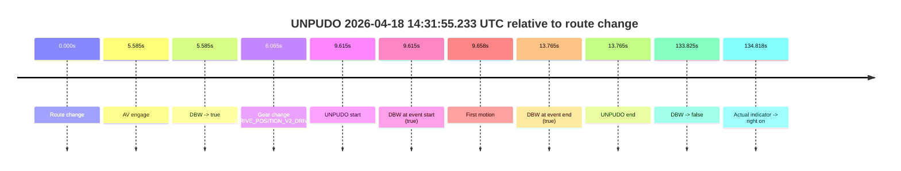
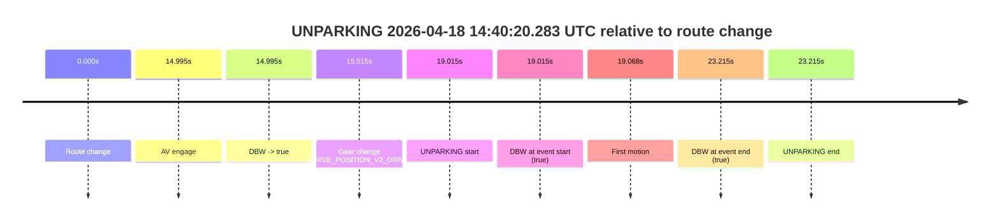

# Run Report: fme10011/2026-04-18--13-41-05--gen2-av-90fbabfd-d67a-43b9-914e-033e8f21a341

| Field | Value |
|---|---|
| Run ID | `fme10011/2026-04-18--13-41-05--gen2-av-90fbabfd-d67a-43b9-914e-033e8f21a341` |
| Date | `2026-04-18` |
| Model(s) | `armadillo-amethyst-squeaky` |
| Author | `guy.geva` |
| Event count | `2` |

## unpudo 2026-04-18 14:31:55.233 UTC

| Field | Value |
|---|---|
| Model | `armadillo-amethyst-squeaky` |
| Author | `guy.geva` |
| Run ID | `fme10011/2026-04-18--13-41-05--gen2-av-90fbabfd-d67a-43b9-914e-033e8f21a341` |
| Date | `2026-04-18` |
| Time (UTC) | `14:31:55.233` |
| Event type | `unpudo` |
| Disengagement type | `none observed` |
| Route change | `found` |
| Console | [run](https://console.sso.wayve.ai/run/fme10011/2026-04-18--13-41-05--gen2-av-90fbabfd-d67a-43b9-914e-033e8f21a341?id=&time-unixus=1776522715233293) |
| Foxglove | [segment](https://app.foxglove.dev/wayve-on-prem/p/prj_0dX18KZdVHg1fmmI/view?ds=foxglove-stream&ds.deviceName=fme10011&ds.start=2026-04-18T14%3A31%3A35.618246Z&ds.end=2026-04-18T14%3A34%3A09.443292Z&layoutId=lay_0e7VD4WIKDQGU73Y&time=2026-04-18T14%3A31%3A55.233293Z) |

### Event card: pass

- Pass: AV owns the credited unpudo through the official event window, the gear state is aligned at the anchor, and the vehicle moves without driver accelerator help in AV.

| Event | Time (UTC) | Delta from route change |
|---|---:|---:|
| Route change | 2026-04-18 14:31:45.618 | `0.000s` |
| AV engage | 2026-04-18 14:31:51.203 | `5.585s` |
| DBW -> true | 2026-04-18 14:31:51.203 | `5.585s` |
| Gear change (DRIVE_POSITION_V2_DRIVE) | 2026-04-18 14:31:51.683 | `6.065s` |
| UNPUDO start | 2026-04-18 14:31:55.233 | `9.615s` |
| DBW at event start (true) | 2026-04-18 14:31:55.233 | `9.615s` |
| First motion | 2026-04-18 14:31:55.276 | `9.658s` |
| DBW at event end (true) | 2026-04-18 14:31:59.383 | `13.765s` |
| UNPUDO end | 2026-04-18 14:31:59.383 | `13.765s` |
| DBW -> false | 2026-04-18 14:33:59.443 | `133.825s` |
| Actual indicator -> right on | 2026-04-18 14:34:00.435 | `134.818s` |

| Metric | Value |
|---|---|
| Outcome | `pass` |
| Effective failure type | `none` |
| Route change status | `found` |
| DBW at event start | `true` |
| DBW at event end | `true` |
| Predicted gear at AV start | `DRIVE_POSITION_V2_DRIVE` |
| Actual gear at AV start | `DRIVE_POSITION_V2_PARK` |
| Predicted gear at event start | `DRIVE_POSITION_V2_DRIVE` |
| Actual gear at event start | `DRIVE_POSITION_V2_DRIVE` |
| Planned indicator direction | `INDICATORS_STATE_V2_OFF` |
| Controller indicator direction | `INDICATORS_STATE_V2_OFF` |
| Actual indicator direction | `INDICATORS_STATE_V2_OFF` |
| Actual indicator at maneuver end | `INDICATORS_STATE_V2_OFF` |
| Driver accel help in AV | `false` |
| Driver accel help timestamp | `n/a` |
| Max accel pedal pct in AV | `0.0%` |
| Max brake pedal pct in AV | `0.0%` |
| Max speed mps in AV | `3.153` |
| Success timing baseline | `route change` |
| Route -> AV | `5.585s` |
| AV -> event start | `4.030s` |
| AV -> first motion | `4.073s` |
| Success baseline -> event start | `9.615s` |
| Success baseline -> first motion | `9.658s` |
| AV duration before disengagement | `128.240s` |
| Trajectory waypoint count | `38` |
| Driving-plan step count | `11` |

The scored portion starts from the AV-owned window, not from the pre-AV setup. Route-change search in the stopped pre-event segment was `found`, with the baseline therefore set to route change. At the event anchor the model predicts `DRIVE_POSITION_V2_DRIVE` and the actual gear is `DRIVE_POSITION_V2_DRIVE`. The effective model outcome is `pass` because `the credited maneuver stays AV-owned through the official event end`.

### Resolution

| Field | Value |
|---|---|
| Final outcome | `pass` |
| Do we agree with this label? | `yes` |
| Source disengagement type | `none observed` |
| Resolved effective failure type | `none` |
| Confidence | `high` |

## unparking 2026-04-18 14:40:20.283 UTC

| Field | Value |
|---|---|
| Model | `armadillo-amethyst-squeaky` |
| Author | `guy.geva` |
| Run ID | `fme10011/2026-04-18--13-41-05--gen2-av-90fbabfd-d67a-43b9-914e-033e8f21a341` |
| Date | `2026-04-18` |
| Time (UTC) | `14:40:20.283` |
| Event type | `unparking` |
| Disengagement type | `none observed` |
| Route change | `found` |
| Console | [run](https://console.sso.wayve.ai/run/fme10011/2026-04-18--13-41-05--gen2-av-90fbabfd-d67a-43b9-914e-033e8f21a341?id=&time-unixus=1776523220283298) |
| Foxglove | [segment](https://app.foxglove.dev/wayve-on-prem/p/prj_0dX18KZdVHg1fmmI/view?ds=foxglove-stream&ds.deviceName=fme10011&ds.start=2026-04-18T14%3A39%3A51.268294Z&ds.end=2026-04-18T14%3A40%3A34.483303Z&layoutId=lay_0e7VD4WIKDQGU73Y&time=2026-04-18T14%3A40%3A20.283298Z) |

### Event card: pass

- Pass: AV owns the credited unparking through the official event window, the gear state is aligned at the anchor, and the vehicle moves without driver accelerator help in AV.

| Event | Time (UTC) | Delta from route change |
|---|---:|---:|
| Route change | 2026-04-18 14:40:01.268 | `0.000s` |
| AV engage | 2026-04-18 14:40:16.263 | `14.995s` |
| DBW -> true | 2026-04-18 14:40:16.263 | `14.995s` |
| Gear change (DRIVE_POSITION_V2_DRIVE) | 2026-04-18 14:40:16.783 | `15.515s` |
| UNPARKING start | 2026-04-18 14:40:20.283 | `19.015s` |
| DBW at event start (true) | 2026-04-18 14:40:20.283 | `19.015s` |
| First motion | 2026-04-18 14:40:20.335 | `19.068s` |
| DBW at event end (true) | 2026-04-18 14:40:24.483 | `23.215s` |
| UNPARKING end | 2026-04-18 14:40:24.483 | `23.215s` |

| Metric | Value |
|---|---|
| Outcome | `pass` |
| Effective failure type | `none` |
| Route change status | `found` |
| DBW at event start | `true` |
| DBW at event end | `true` |
| Predicted gear at AV start | `DRIVE_POSITION_V2_DRIVE` |
| Actual gear at AV start | `DRIVE_POSITION_V2_PARK` |
| Predicted gear at event start | `DRIVE_POSITION_V2_DRIVE` |
| Actual gear at event start | `DRIVE_POSITION_V2_DRIVE` |
| Planned indicator direction | `INDICATORS_STATE_V2_OFF` |
| Controller indicator direction | `INDICATORS_STATE_V2_OFF` |
| Actual indicator direction | `INDICATORS_STATE_V2_OFF` |
| Actual indicator at maneuver end | `INDICATORS_STATE_V2_OFF` |
| Driver accel help in AV | `false` |
| Driver accel help timestamp | `n/a` |
| Max accel pedal pct in AV | `0.0%` |
| Max brake pedal pct in AV | `0.0%` |
| Max speed mps in AV | `3.592` |
| Success timing baseline | `route change` |
| Route -> AV | `14.995s` |
| AV -> event start | `4.020s` |
| AV -> first motion | `4.072s` |
| Success baseline -> event start | `19.015s` |
| Success baseline -> first motion | `19.068s` |
| AV duration before disengagement | `n/a` |
| Trajectory waypoint count | `37` |
| Driving-plan step count | `11` |

The scored portion starts from the AV-owned window, not from the pre-AV setup. Route-change search in the stopped pre-event segment was `found`, with the baseline therefore set to route change. At the event anchor the model predicts `DRIVE_POSITION_V2_DRIVE` and the actual gear is `DRIVE_POSITION_V2_DRIVE`. The effective model outcome is `pass` because `the credited maneuver stays AV-owned through the official event end`.

### Resolution

| Field | Value |
|---|---|
| Final outcome | `pass` |
| Do we agree with this label? | `yes` |
| Source disengagement type | `none observed` |
| Resolved effective failure type | `none` |
| Confidence | `high` |
