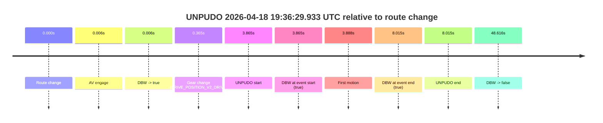
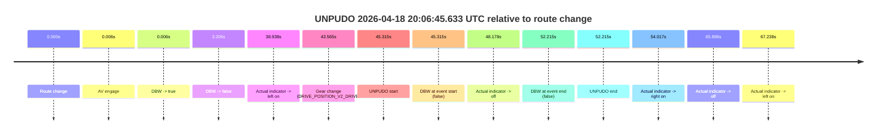
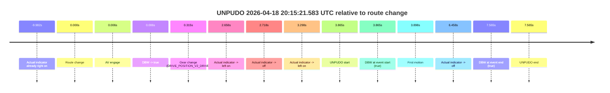

# Run Report: fme10011/2026-04-18--19-13-41--gen2-av-85f5a48b-5c4c-4284-9825-0888d976bb59

| Field | Value |
|---|---|
| Run ID | `fme10011/2026-04-18--19-13-41--gen2-av-85f5a48b-5c4c-4284-9825-0888d976bb59` |
| Date | `2026-04-18` |
| Model(s) | `eel-teal-outspoken` |
| Author | `zak` |
| Event count | `4` |

## unpudo 2026-04-18 19:36:29.933 UTC

| Field | Value |
|---|---|
| Model | `eel-teal-outspoken` |
| Author | `zak` |
| Run ID | `fme10011/2026-04-18--19-13-41--gen2-av-85f5a48b-5c4c-4284-9825-0888d976bb59` |
| Date | `2026-04-18` |
| Time (UTC) | `19:36:29.933` |
| Event type | `unpudo` |
| Disengagement type | `none observed` |
| Route change | `found` |
| Console | [run](https://console.sso.wayve.ai/run/fme10011/2026-04-18--19-13-41--gen2-av-85f5a48b-5c4c-4284-9825-0888d976bb59?id=&time-unixus=1776540989933326) |
| Foxglove | [segment](https://app.foxglove.dev/wayve-on-prem/p/prj_0dX18KZdVHg1fmmI/view?ds=foxglove-stream&ds.deviceName=fme10011&ds.start=2026-04-18T19%3A36%3A16.068265Z&ds.end=2026-04-18T19%3A37%3A24.684422Z&layoutId=lay_0e7VD4WIKDQGU73Y&time=2026-04-18T19%3A36%3A29.933326Z) |

### Event card: pass

- Pass: AV owns the credited unpudo from route change through the official unpudo window, the gear state is aligned at the anchor, and the vehicle moves without driver accelerator help in AV.

| Event | Time (UTC) | Delta from route change |
|---|---:|---:|
| Route change | 2026-04-18 19:36:26.068 | `0.000s` |
| AV engage | 2026-04-18 19:36:26.074 | `0.006s` |
| DBW -> true | 2026-04-18 19:36:26.074 | `0.006s` |
| Gear change (DRIVE_POSITION_V2_DRIVE) | 2026-04-18 19:36:26.433 | `0.365s` |
| UNPUDO start | 2026-04-18 19:36:29.933 | `3.865s` |
| DBW at event start (true) | 2026-04-18 19:36:29.933 | `3.865s` |
| First motion | 2026-04-18 19:36:29.955 | `3.888s` |
| DBW at event end (true) | 2026-04-18 19:36:34.083 | `8.015s` |
| UNPUDO end | 2026-04-18 19:36:34.083 | `8.015s` |
| DBW -> false | 2026-04-18 19:37:14.684 | `48.616s` |

| Metric | Value |
|---|---|
| Outcome | `pass` |
| Effective failure type | `none` |
| Route change status | `found` |
| DBW at event start | `true` |
| DBW at event end | `true` |
| Predicted gear at AV start | `DRIVE_POSITION_V2_PARK` |
| Actual gear at AV start | `DRIVE_POSITION_V2_PARK` |
| Predicted gear at event start | `DRIVE_POSITION_V2_DRIVE` |
| Actual gear at event start | `DRIVE_POSITION_V2_DRIVE` |
| Planned indicator direction | `INDICATORS_STATE_V2_OFF` |
| Controller indicator direction | `INDICATORS_STATE_V2_OFF` |
| Actual indicator direction | `INDICATORS_STATE_V2_OFF` |
| Actual indicator at maneuver end | `INDICATORS_STATE_V2_OFF` |
| Driver accel help in AV | `false` |
| Driver accel help timestamp | `n/a` |
| Max accel pedal pct in AV | `0.0%` |
| Max brake pedal pct in AV | `8.0%` |
| Max speed mps in AV | `3.069` |
| Success timing baseline | `route change` |
| Route -> AV | `0.006s` |
| AV -> event start | `3.859s` |
| AV -> first motion | `3.881s` |
| Success baseline -> event start | `3.865s` |
| Success baseline -> first motion | `3.888s` |
| AV duration before disengagement | `48.610s` |
| Trajectory waypoint count | `38` |
| Driving-plan step count | `11` |

The scored portion starts from the AV-owned window, not from the pre-AV setup. Route-change search in the stopped pre-event segment was `found`, with the baseline therefore set to route change. At the event anchor the model predicts `DRIVE_POSITION_V2_DRIVE` and the actual gear is `DRIVE_POSITION_V2_DRIVE`. The effective model outcome is `pass` because `the credited unpudo stays AV-owned through the official unpudo window.`

### Resolution

| Field | Value |
|---|---|
| Final outcome | `pass` |
| Do we agree with this label? | `yes` |
| Source disengagement type | `none observed` |
| Resolved effective failure type | `none` |
| Confidence | `high` |

## unpudo 2026-04-18 19:53:57.183 UTC

| Field | Value |
|---|---|
| Model | `eel-teal-outspoken` |
| Author | `zak` |
| Run ID | `fme10011/2026-04-18--19-13-41--gen2-av-85f5a48b-5c4c-4284-9825-0888d976bb59` |
| Date | `2026-04-18` |
| Time (UTC) | `19:53:57.183` |
| Event type | `unpudo` |
| Disengagement type | `none observed` |
| Route change | `found` |
| Console | [run](https://console.sso.wayve.ai/run/fme10011/2026-04-18--19-13-41--gen2-av-85f5a48b-5c4c-4284-9825-0888d976bb59?id=&time-unixus=1776542037183320) |
| Foxglove | [segment](https://app.foxglove.dev/wayve-on-prem/p/prj_0dX18KZdVHg1fmmI/view?ds=foxglove-stream&ds.deviceName=fme10011&ds.start=2026-04-18T19%3A53%3A37.268267Z&ds.end=2026-04-18T19%3A56%3A02.825612Z&layoutId=lay_0e7VD4WIKDQGU73Y&time=2026-04-18T19%3A53%3A57.183320Z) |

### Event card: pass

- Pass: AV owns the credited unpudo from route change through the official unpudo window, the gear state is aligned at the anchor, and the vehicle moves without driver accelerator help in AV.

| Event | Time (UTC) | Delta from route change |
|---|---:|---:|
| Route change | 2026-04-18 19:53:47.268 | `0.000s` |
| AV engage | 2026-04-18 19:53:53.184 | `5.916s` |
| DBW -> true | 2026-04-18 19:53:53.184 | `5.916s` |
| Gear change (DRIVE_POSITION_V2_DRIVE) | 2026-04-18 19:53:53.633 | `6.365s` |
| UNPUDO start | 2026-04-18 19:53:57.183 | `9.915s` |
| DBW at event start (true) | 2026-04-18 19:53:57.183 | `9.915s` |
| First motion | 2026-04-18 19:53:57.215 | `9.948s` |
| DBW at event end (true) | 2026-04-18 19:54:00.533 | `13.265s` |
| UNPUDO end | 2026-04-18 19:54:00.533 | `13.265s` |
| DBW -> false | 2026-04-18 19:55:52.825 | `125.557s` |

| Metric | Value |
|---|---|
| Outcome | `pass` |
| Effective failure type | `none` |
| Route change status | `found` |
| DBW at event start | `true` |
| DBW at event end | `true` |
| Predicted gear at AV start | `DRIVE_POSITION_V2_DRIVE` |
| Actual gear at AV start | `DRIVE_POSITION_V2_PARK` |
| Predicted gear at event start | `DRIVE_POSITION_V2_DRIVE` |
| Actual gear at event start | `DRIVE_POSITION_V2_DRIVE` |
| Planned indicator direction | `INDICATORS_STATE_V2_LEFT_ON` |
| Controller indicator direction | `INDICATORS_STATE_V2_LEFT_ON` |
| Actual indicator direction | `INDICATORS_STATE_V2_OFF` |
| Actual indicator at maneuver end | `INDICATORS_STATE_V2_OFF` |
| Driver accel help in AV | `false` |
| Driver accel help timestamp | `n/a` |
| Max accel pedal pct in AV | `0.0%` |
| Max brake pedal pct in AV | `8.0%` |
| Max speed mps in AV | `5.294` |
| Success timing baseline | `route change` |
| Route -> AV | `5.916s` |
| AV -> event start | `3.999s` |
| AV -> first motion | `4.031s` |
| Success baseline -> event start | `9.915s` |
| Success baseline -> first motion | `9.948s` |
| AV duration before disengagement | `119.641s` |
| Trajectory waypoint count | `37` |
| Driving-plan step count | `11` |

The scored portion starts from the AV-owned window, not from the pre-AV setup. Route-change search in the stopped pre-event segment was `found`, with the baseline therefore set to route change. At the event anchor the model predicts `DRIVE_POSITION_V2_DRIVE` and the actual gear is `DRIVE_POSITION_V2_DRIVE`. The effective model outcome is `pass` because `the credited unpudo stays AV-owned through the official unpudo window.`

### Resolution

| Field | Value |
|---|---|
| Final outcome | `pass` |
| Do we agree with this label? | `yes` |
| Source disengagement type | `none observed` |
| Resolved effective failure type | `none` |
| Confidence | `high` |

## unpudo 2026-04-18 20:06:45.633 UTC

| Field | Value |
|---|---|
| Model | `eel-teal-outspoken` |
| Author | `zak` |
| Run ID | `fme10011/2026-04-18--19-13-41--gen2-av-85f5a48b-5c4c-4284-9825-0888d976bb59` |
| Date | `2026-04-18` |
| Time (UTC) | `20:06:45.633` |
| Event type | `unpudo` |
| Disengagement type | `none observed` |
| Route change | `found` |
| Console | [run](https://console.sso.wayve.ai/run/fme10011/2026-04-18--19-13-41--gen2-av-85f5a48b-5c4c-4284-9825-0888d976bb59?id=&time-unixus=1776542805633314) |
| Foxglove | [segment](https://app.foxglove.dev/wayve-on-prem/p/prj_0dX18KZdVHg1fmmI/view?ds=foxglove-stream&ds.deviceName=fme10011&ds.start=2026-04-18T20%3A05%3A50.318287Z&ds.end=2026-04-18T20%3A07%3A02.533313Z&layoutId=lay_0e7VD4WIKDQGU73Y&time=2026-04-18T20%3A06%3A45.633314Z) |

### Event card: fail

- Fail: the credited unpudo does not stay AV-owned. The event window starts with DBW false, and the maneuver outcome lands outside a clean AV-owned segment.

| Event | Time (UTC) | Delta from route change |
|---|---:|---:|
| Route change | 2026-04-18 20:06:00.318 | `0.000s` |
| AV engage | 2026-04-18 20:06:00.324 | `0.006s` |
| DBW -> true | 2026-04-18 20:06:00.324 | `0.006s` |
| DBW -> false | 2026-04-18 20:06:03.524 | `3.206s` |
| Actual indicator -> left on | 2026-04-18 20:06:39.255 | `38.938s` |
| Gear change (DRIVE_POSITION_V2_DRIVE) | 2026-04-18 20:06:43.883 | `43.565s` |
| UNPUDO start | 2026-04-18 20:06:45.633 | `45.315s` |
| DBW at event start (false) | 2026-04-18 20:06:45.633 | `45.315s` |
| Actual indicator -> off | 2026-04-18 20:06:48.495 | `48.178s` |
| DBW at event end (false) | 2026-04-18 20:06:52.533 | `52.215s` |
| UNPUDO end | 2026-04-18 20:06:52.533 | `52.215s` |
| Actual indicator -> right on | 2026-04-18 20:06:54.335 | `54.017s` |
| Actual indicator -> off | 2026-04-18 20:07:06.215 | `65.898s` |
| Actual indicator -> left on | 2026-04-18 20:07:07.555 | `67.238s` |

| Metric | Value |
|---|---|
| Outcome | `fail` |
| Effective failure type | `not_av_owned` |
| Route change status | `found` |
| DBW at event start | `false` |
| DBW at event end | `false` |
| Predicted gear at AV start | `DRIVE_POSITION_V2_PARK` |
| Actual gear at AV start | `DRIVE_POSITION_V2_PARK` |
| Predicted gear at event start | `DRIVE_POSITION_V2_DRIVE` |
| Actual gear at event start | `DRIVE_POSITION_V2_DRIVE` |
| Planned indicator direction | `INDICATORS_STATE_V2_OFF` |
| Controller indicator direction | `INDICATORS_STATE_V2_OFF` |
| Actual indicator direction | `INDICATORS_STATE_V2_LEFT_ON` |
| Actual indicator at maneuver end | `INDICATORS_STATE_V2_OFF` |
| Driver accel help in AV | `false` |
| Driver accel help timestamp | `n/a` |
| Max accel pedal pct in AV | `0.0%` |
| Max brake pedal pct in AV | `8.0%` |
| Max speed mps in AV | `0.000` |
| Success timing baseline | `route change` |
| Route -> AV | `0.006s` |
| AV -> event start | `45.309s` |
| AV -> first motion | `n/a` |
| Success baseline -> event start | `45.315s` |
| Success baseline -> first motion | `n/a` |
| AV duration before disengagement | `3.200s` |
| Trajectory waypoint count | `38` |
| Driving-plan step count | `11` |

The scored portion starts from the AV-owned window, not from the pre-AV setup. Route-change search in the stopped pre-event segment was `found`, with the baseline therefore set to route change. At the event anchor the model predicts `DRIVE_POSITION_V2_DRIVE` and the actual gear is `DRIVE_POSITION_V2_DRIVE`. The effective model outcome is `fail` because `not_av_owned.`

### Resolution

| Field | Value |
|---|---|
| Final outcome | `fail` |
| Do we agree with this label? | `yes` |
| Source disengagement type | `none observed` |
| Resolved effective failure type | `not_av_owned` |
| Confidence | `high` |

## unpudo 2026-04-18 20:15:21.583 UTC

| Field | Value |
|---|---|
| Model | `eel-teal-outspoken` |
| Author | `zak` |
| Run ID | `fme10011/2026-04-18--19-13-41--gen2-av-85f5a48b-5c4c-4284-9825-0888d976bb59` |
| Date | `2026-04-18` |
| Time (UTC) | `20:15:21.583` |
| Event type | `unpudo` |
| Disengagement type | `none observed` |
| Route change | `found` |
| Console | [run](https://console.sso.wayve.ai/run/fme10011/2026-04-18--19-13-41--gen2-av-85f5a48b-5c4c-4284-9825-0888d976bb59?id=&time-unixus=1776543321583297) |
| Foxglove | [segment](https://app.foxglove.dev/wayve-on-prem/p/prj_0dX18KZdVHg1fmmI/view?ds=foxglove-stream&ds.deviceName=fme10011&ds.start=2026-04-18T20%3A15%3A07.718241Z&ds.end=2026-04-18T20%3A15%3A35.283317Z&layoutId=lay_0e7VD4WIKDQGU73Y&time=2026-04-18T20%3A15%3A21.583297Z) |

### Event card: pass

- Pass: AV owns the credited unpudo from route change through the official unpudo window, the gear state is aligned at the anchor, and the vehicle moves without driver accelerator help in AV.

| Event | Time (UTC) | Delta from route change |
|---|---:|---:|
| Actual indicator already right on | 2026-04-18 20:15:07.735 | `-9.982s` |
| Route change | 2026-04-18 20:15:17.718 | `0.000s` |
| AV engage | 2026-04-18 20:15:17.724 | `0.006s` |
| DBW -> true | 2026-04-18 20:15:17.724 | `0.006s` |
| Gear change (DRIVE_POSITION_V2_DRIVE) | 2026-04-18 20:15:18.033 | `0.315s` |
| Actual indicator -> left on | 2026-04-18 20:15:20.375 | `2.658s` |
| Actual indicator -> off | 2026-04-18 20:15:20.435 | `2.718s` |
| Actual indicator -> left on | 2026-04-18 20:15:21.015 | `3.298s` |
| UNPUDO start | 2026-04-18 20:15:21.583 | `3.865s` |
| DBW at event start (true) | 2026-04-18 20:15:21.583 | `3.865s` |
| First motion | 2026-04-18 20:15:21.615 | `3.898s` |
| Actual indicator -> off | 2026-04-18 20:15:24.175 | `6.458s` |
| DBW at event end (true) | 2026-04-18 20:15:25.283 | `7.565s` |
| UNPUDO end | 2026-04-18 20:15:25.283 | `7.565s` |

| Metric | Value |
|---|---|
| Outcome | `pass` |
| Effective failure type | `none` |
| Route change status | `found` |
| DBW at event start | `true` |
| DBW at event end | `true` |
| Predicted gear at AV start | `DRIVE_POSITION_V2_PARK` |
| Actual gear at AV start | `DRIVE_POSITION_V2_PARK` |
| Predicted gear at event start | `DRIVE_POSITION_V2_DRIVE` |
| Actual gear at event start | `DRIVE_POSITION_V2_DRIVE` |
| Planned indicator direction | `INDICATORS_STATE_V2_LEFT_ON` |
| Controller indicator direction | `INDICATORS_STATE_V2_LEFT_ON` |
| Actual indicator direction | `INDICATORS_STATE_V2_LEFT_ON` |
| Actual indicator at maneuver end | `INDICATORS_STATE_V2_OFF` |
| Driver accel help in AV | `false` |
| Driver accel help timestamp | `n/a` |
| Max accel pedal pct in AV | `0.0%` |
| Max brake pedal pct in AV | `8.0%` |
| Max speed mps in AV | `4.400` |
| Success timing baseline | `route change` |
| Route -> AV | `0.006s` |
| AV -> event start | `3.859s` |
| AV -> first motion | `3.891s` |
| Success baseline -> event start | `3.865s` |
| Success baseline -> first motion | `3.898s` |
| AV duration before disengagement | `n/a` |
| Trajectory waypoint count | `37` |
| Driving-plan step count | `11` |

The scored portion starts from the AV-owned window, not from the pre-AV setup. Route-change search in the stopped pre-event segment was `found`, with the baseline therefore set to route change. At the event anchor the model predicts `DRIVE_POSITION_V2_DRIVE` and the actual gear is `DRIVE_POSITION_V2_DRIVE`. The effective model outcome is `pass` because `the credited unpudo stays AV-owned through the official unpudo window.`

### Resolution

| Field | Value |
|---|---|
| Final outcome | `pass` |
| Do we agree with this label? | `yes` |
| Source disengagement type | `none observed` |
| Resolved effective failure type | `none` |
| Confidence | `high` |
