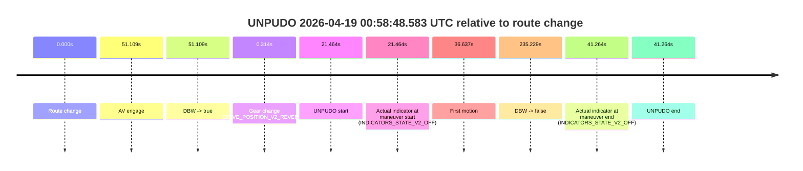
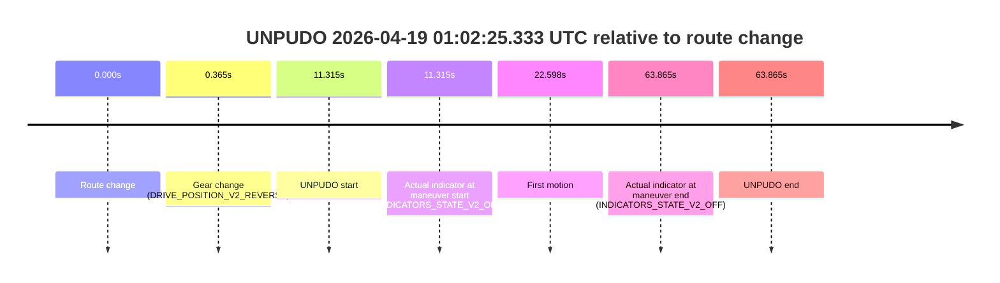

# Run Report: fme10011/2026-04-19--00-47-53--gen2-av-a2fff636-0b89-4d6f-a390-0a7ea34b83e4

| Field | Value |
|---|---|
| Run ID | `fme10011/2026-04-19--00-47-53--gen2-av-a2fff636-0b89-4d6f-a390-0a7ea34b83e4` |
| Date | `2026-04-19` |
| Model(s) | `satisfied-amber-moose` |
| Author | `guy.geva` |
| Event count | `2` |

## unpudo 2026-04-19 00:58:48.583 UTC

| Field | Value |
|---|---|
| Model | `satisfied-amber-moose` |
| Author | `guy.geva` |
| Run ID | `fme10011/2026-04-19--00-47-53--gen2-av-a2fff636-0b89-4d6f-a390-0a7ea34b83e4` |
| Date | `2026-04-19` |
| Time (UTC) | `00:58:48.583` |
| Event type | `unpudo` |
| Disengagement type | `failed_to_unpudo` |
| Route change | `found` |
| Console | [run](https://console.sso.wayve.ai/run/fme10011/2026-04-19--00-47-53--gen2-av-a2fff636-0b89-4d6f-a390-0a7ea34b83e4?id=&time-unixus=1776560328583293) |
| Foxglove | [segment](https://app.foxglove.dev/wayve-on-prem/p/prj_0dX18KZdVHg1fmmI/view?ds=foxglove-stream&ds.deviceName=fme10011&ds.start=2026-04-19T00%3A58%3A17.118869Z&ds.end=2026-04-19T01%3A02%3A32.347380Z&layoutId=lay_0e7VD4WIKDQGU73Y&time=2026-04-19T00%3A58%3A48.583293Z) |

### Event card: fail

- Fail: AV owns part of the segment, but the event still resolves as a model-performance failure under the AV-only scoring rule.

| Event | Time (UTC) | Delta from route change |
|---|---:|---:|
| Route change | 2026-04-19 00:58:27.118 | `0.000s` |
| AV engage | 2026-04-19 00:59:18.228 | `51.109s` |
| DBW -> true | 2026-04-19 00:59:18.228 | `51.109s` |
| Gear change (DRIVE_POSITION_V2_REVERSE) | 2026-04-19 00:58:27.433 | `0.314s` |
| UNPUDO start | 2026-04-19 00:58:48.583 | `21.464s` |
| Actual indicator at maneuver start (INDICATORS_STATE_V2_OFF) | 2026-04-19 00:58:48.583 | `21.464s` |
| First motion | 2026-04-19 00:59:03.755 | `36.637s` |
| DBW -> false | 2026-04-19 01:02:22.347 | `235.229s` |
| Actual indicator at maneuver end (INDICATORS_STATE_V2_OFF) | 2026-04-19 00:59:08.383 | `41.264s` |
| UNPUDO end | 2026-04-19 00:59:08.383 | `41.264s` |

| Metric | Value |
|---|---|
| Outcome | `fail` |
| Effective failure type | `failed_to_unpudo` |
| Route change status | `found` |
| DBW at event start | `false` |
| DBW at event end | `false` |
| Predicted gear at AV start | `DRIVE_POSITION_V2_DRIVE` |
| Actual gear at AV start | `DRIVE_POSITION_V2_DRIVE` |
| Predicted gear at event start | `DRIVE_POSITION_V2_REVERSE` |
| Actual gear at event start | `DRIVE_POSITION_V2_REVERSE` |
| Planned indicator direction | `INDICATORS_STATE_V2_OFF` |
| Controller indicator direction | `INDICATORS_STATE_V2_OFF` |
| Actual indicator direction | `INDICATORS_STATE_V2_OFF` |
| Actual indicator at maneuver end | `INDICATORS_STATE_V2_OFF` |
| Driver accel help in AV | `false` |
| Driver accel help timestamp | `n/a` |
| Max accel pedal pct in AV | `0.0%` |
| Max brake pedal pct in AV | `0.0%` |
| Max speed mps in AV | `0.000` |
| Route -> AV | `51.109s` |
| AV -> event start | `-29.645s` |
| AV -> first motion | `-14.472s` |
| AV duration before disengagement | `184.119s` |
| Trajectory waypoint count | `36` |
| Driving-plan step count | `11` |

The scored portion starts from the AV-owned window, not from the pre-AV setup. Route-change search in the stopped pre-event segment was `found`, with the baseline therefore set to route change. At the event anchor the model predicts `DRIVE_POSITION_V2_REVERSE` and the actual gear is `DRIVE_POSITION_V2_REVERSE`. The effective model outcome is `fail` because `failed_to_unpudo`.

### Resolution

| Field | Value |
|---|---|
| Final outcome | `fail` |
| Do we agree with this label? | `yes` |
| Source disengagement type | `failed_to_unpudo` |
| Resolved effective failure type | `failed_to_unpudo` |
| Confidence | `high` |

## unpudo 2026-04-19 01:02:25.333 UTC

| Field | Value |
|---|---|
| Model | `satisfied-amber-moose` |
| Author | `guy.geva` |
| Run ID | `fme10011/2026-04-19--00-47-53--gen2-av-a2fff636-0b89-4d6f-a390-0a7ea34b83e4` |
| Date | `2026-04-19` |
| Time (UTC) | `01:02:25.333` |
| Event type | `unpudo` |
| Disengagement type | `failed_to_unpudo` |
| Route change | `found` |
| Console | [run](https://console.sso.wayve.ai/run/fme10011/2026-04-19--00-47-53--gen2-av-a2fff636-0b89-4d6f-a390-0a7ea34b83e4?id=&time-unixus=1776560545333308) |
| Foxglove | [segment](https://app.foxglove.dev/wayve-on-prem/p/prj_0dX18KZdVHg1fmmI/view?ds=foxglove-stream&ds.deviceName=fme10011&ds.start=2026-04-19T01%3A02%3A04.018241Z&ds.end=2026-04-19T01%3A03%3A27.883317Z&layoutId=lay_0e7VD4WIKDQGU73Y&time=2026-04-19T01%3A02%3A25.333308Z) |

### Event card: fail

- Fail: AV owns part of the segment, but the event still resolves as a model-performance failure under the AV-only scoring rule.

| Event | Time (UTC) | Delta from route change |
|---|---:|---:|
| Route change | 2026-04-19 01:02:14.018 | `0.000s` |
| Gear change (DRIVE_POSITION_V2_REVERSE) | 2026-04-19 01:02:14.383 | `0.365s` |
| UNPUDO start | 2026-04-19 01:02:25.333 | `11.315s` |
| Actual indicator at maneuver start (INDICATORS_STATE_V2_OFF) | 2026-04-19 01:02:25.333 | `11.315s` |
| First motion | 2026-04-19 01:02:36.615 | `22.598s` |
| Actual indicator at maneuver end (INDICATORS_STATE_V2_OFF) | 2026-04-19 01:03:17.883 | `63.865s` |
| UNPUDO end | 2026-04-19 01:03:17.883 | `63.865s` |

| Metric | Value |
|---|---|
| Outcome | `fail` |
| Effective failure type | `failed_to_unpudo` |
| Route change status | `found` |
| DBW at event start | `false` |
| DBW at event end | `false` |
| Predicted gear at AV start | `n/a` |
| Actual gear at AV start | `n/a` |
| Predicted gear at event start | `DRIVE_POSITION_V2_REVERSE` |
| Actual gear at event start | `DRIVE_POSITION_V2_REVERSE` |
| Planned indicator direction | `INDICATORS_STATE_V2_OFF` |
| Controller indicator direction | `INDICATORS_STATE_V2_OFF` |
| Actual indicator direction | `INDICATORS_STATE_V2_OFF` |
| Actual indicator at maneuver end | `INDICATORS_STATE_V2_OFF` |
| Driver accel help in AV | `false` |
| Driver accel help timestamp | `n/a` |
| Max accel pedal pct in AV | `0.0%` |
| Max brake pedal pct in AV | `0.0%` |
| Max speed mps in AV | `0.000` |
| Route -> AV | `n/a` |
| AV -> event start | `n/a` |
| AV -> first motion | `n/a` |
| AV duration before disengagement | `n/a` |
| Trajectory waypoint count | `37` |
| Driving-plan step count | `11` |

The scored portion starts from the AV-owned window, not from the pre-AV setup. Route-change search in the stopped pre-event segment was `found`, with the baseline therefore set to route change. At the event anchor the model predicts `DRIVE_POSITION_V2_REVERSE` and the actual gear is `DRIVE_POSITION_V2_REVERSE`. The effective model outcome is `fail` because `failed_to_unpudo`.

### Resolution

| Field | Value |
|---|---|
| Final outcome | `fail` |
| Do we agree with this label? | `yes` |
| Source disengagement type | `failed_to_unpudo` |
| Resolved effective failure type | `failed_to_unpudo` |
| Confidence | `high` |
