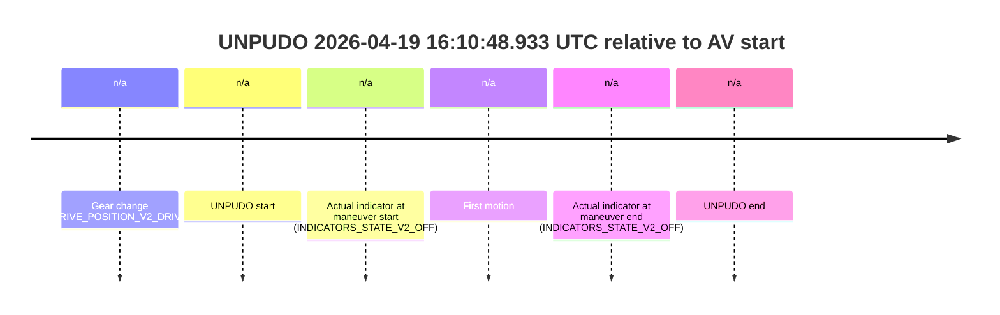
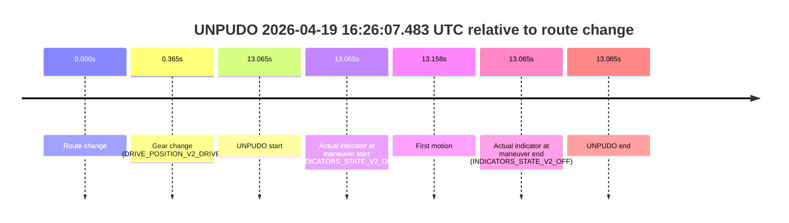
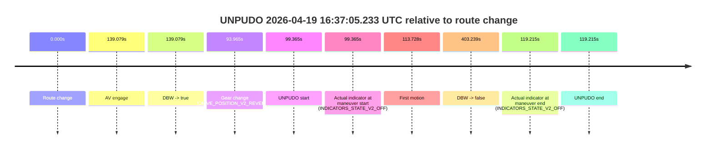
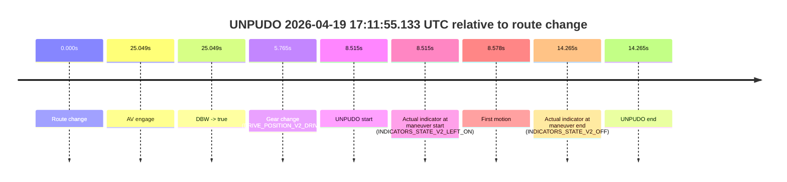

# Run Report: fme10011/2026-04-19--16-07-52--gen2-av-0ce63e96-931c-4b3d-aca6-bd7cb0ef6e7a

| Field | Value |
|---|---|
| Run ID | `fme10011/2026-04-19--16-07-52--gen2-av-0ce63e96-931c-4b3d-aca6-bd7cb0ef6e7a` |
| Date | `2026-04-19` |
| Model(s) | `satisfied-amber-moose` |
| Author | `guy.geva` |
| Event count | `6` |

## unpudo 2026-04-19 16:10:48.933 UTC

| Field | Value |
|---|---|
| Model | `satisfied-amber-moose` |
| Author | `guy.geva` |
| Run ID | `fme10011/2026-04-19--16-07-52--gen2-av-0ce63e96-931c-4b3d-aca6-bd7cb0ef6e7a` |
| Date | `2026-04-19` |
| Time (UTC) | `16:10:48.933` |
| Event type | `unpudo` |
| Disengagement type | `none observed` |
| Route change | `not found` |
| Console | [run](https://console.sso.wayve.ai/run/fme10011/2026-04-19--16-07-52--gen2-av-0ce63e96-931c-4b3d-aca6-bd7cb0ef6e7a?id=&time-unixus=1776615048933309) |
| Foxglove | [segment](https://app.foxglove.dev/wayve-on-prem/p/prj_0dX18KZdVHg1fmmI/view?ds=foxglove-stream&ds.deviceName=fme10011&ds.start=2026-04-19T16%3A10%3A36.883312Z&ds.end=2026-04-19T16%3A11%3A04.633296Z&layoutId=lay_0e7VD4WIKDQGU73Y&time=2026-04-19T16%3A10%3A48.933309Z) |

### Event card: fail

- Fail: the credited unpudo does not stay AV-owned. The event window starts with DBW false, and the maneuver outcome lands outside a clean AV-owned segment.

| Event | Time (UTC) | Delta from AV start |
|---|---:|---:|
| Gear change (DRIVE_POSITION_V2_DRIVE) | 2026-04-19 16:10:46.883 | `n/a` |
| UNPUDO start | 2026-04-19 16:10:48.933 | `n/a` |
| Actual indicator at maneuver start (INDICATORS_STATE_V2_OFF) | 2026-04-19 16:10:48.933 | `n/a` |
| First motion | 2026-04-19 16:10:49.015 | `n/a` |
| Actual indicator at maneuver end (INDICATORS_STATE_V2_OFF) | 2026-04-19 16:10:54.633 | `n/a` |
| UNPUDO end | 2026-04-19 16:10:54.633 | `n/a` |

| Metric | Value |
|---|---|
| Outcome | `fail` |
| Effective failure type | `not_av_owned` |
| Route change status | `not found` |
| DBW at event start | `false` |
| DBW at event end | `false` |
| Predicted gear at AV start | `n/a` |
| Actual gear at AV start | `n/a` |
| Predicted gear at event start | `DRIVE_POSITION_V2_DRIVE` |
| Actual gear at event start | `DRIVE_POSITION_V2_DRIVE` |
| Planned indicator direction | `INDICATORS_STATE_V2_OFF` |
| Controller indicator direction | `INDICATORS_STATE_V2_OFF` |
| Actual indicator direction | `INDICATORS_STATE_V2_OFF` |
| Actual indicator at maneuver end | `INDICATORS_STATE_V2_OFF` |
| Driver accel help in AV | `false` |
| Driver accel help timestamp | `n/a` |
| Max accel pedal pct in AV | `0.0%` |
| Max brake pedal pct in AV | `0.0%` |
| Max speed mps in AV | `0.000` |
| Route -> AV | `n/a` |
| AV -> event start | `n/a` |
| AV -> first motion | `n/a` |
| AV duration before disengagement | `n/a` |
| Trajectory waypoint count | `37` |
| Driving-plan step count | `11` |

The scored portion starts from the AV-owned window, not from the pre-AV setup. Route-change search in the stopped pre-event segment was `not found`, with the baseline therefore set to AV start. At the event anchor the model predicts `DRIVE_POSITION_V2_DRIVE` and the actual gear is `DRIVE_POSITION_V2_DRIVE`. The effective model outcome is `fail` because `not_av_owned`.

### Resolution

| Field | Value |
|---|---|
| Final outcome | `fail` |
| Do we agree with this label? | `yes` |
| Source disengagement type | `none observed` |
| Resolved effective failure type | `not_av_owned` |
| Confidence | `high` |

## unpudo 2026-04-19 16:26:07.483 UTC

| Field | Value |
|---|---|
| Model | `satisfied-amber-moose` |
| Author | `guy.geva` |
| Run ID | `fme10011/2026-04-19--16-07-52--gen2-av-0ce63e96-931c-4b3d-aca6-bd7cb0ef6e7a` |
| Date | `2026-04-19` |
| Time (UTC) | `16:26:07.483` |
| Event type | `unpudo` |
| Disengagement type | `none observed` |
| Route change | `found` |
| Console | [run](https://console.sso.wayve.ai/run/fme10011/2026-04-19--16-07-52--gen2-av-0ce63e96-931c-4b3d-aca6-bd7cb0ef6e7a?id=&time-unixus=1776615967483297) |
| Foxglove | [segment](https://app.foxglove.dev/wayve-on-prem/p/prj_0dX18KZdVHg1fmmI/view?ds=foxglove-stream&ds.deviceName=fme10011&ds.start=2026-04-19T16%3A25%3A44.418289Z&ds.end=2026-04-19T16%3A26%3A17.483297Z&layoutId=lay_0e7VD4WIKDQGU73Y&time=2026-04-19T16%3A26%3A07.483297Z) |

### Event card: fail

- Fail: the credited unpudo does not stay AV-owned. The event window starts with DBW false, and the maneuver outcome lands outside a clean AV-owned segment.

| Event | Time (UTC) | Delta from route change |
|---|---:|---:|
| Route change | 2026-04-19 16:25:54.418 | `0.000s` |
| Gear change (DRIVE_POSITION_V2_DRIVE) | 2026-04-19 16:25:54.783 | `0.365s` |
| UNPUDO start | 2026-04-19 16:26:07.483 | `13.065s` |
| Actual indicator at maneuver start (INDICATORS_STATE_V2_OFF) | 2026-04-19 16:26:07.483 | `13.065s` |
| First motion | 2026-04-19 16:26:07.576 | `13.158s` |
| Actual indicator at maneuver end (INDICATORS_STATE_V2_OFF) | 2026-04-19 16:26:07.483 | `13.065s` |
| UNPUDO end | 2026-04-19 16:26:07.483 | `13.065s` |

| Metric | Value |
|---|---|
| Outcome | `fail` |
| Effective failure type | `not_av_owned` |
| Route change status | `found` |
| DBW at event start | `false` |
| DBW at event end | `false` |
| Predicted gear at AV start | `n/a` |
| Actual gear at AV start | `n/a` |
| Predicted gear at event start | `DRIVE_POSITION_V2_DRIVE` |
| Actual gear at event start | `DRIVE_POSITION_V2_DRIVE` |
| Planned indicator direction | `INDICATORS_STATE_V2_LEFT_ON` |
| Controller indicator direction | `INDICATORS_STATE_V2_LEFT_ON` |
| Actual indicator direction | `INDICATORS_STATE_V2_OFF` |
| Actual indicator at maneuver end | `INDICATORS_STATE_V2_OFF` |
| Driver accel help in AV | `false` |
| Driver accel help timestamp | `n/a` |
| Max accel pedal pct in AV | `0.0%` |
| Max brake pedal pct in AV | `0.0%` |
| Max speed mps in AV | `0.000` |
| Route -> AV | `n/a` |
| AV -> event start | `n/a` |
| AV -> first motion | `n/a` |
| AV duration before disengagement | `n/a` |
| Trajectory waypoint count | `36` |
| Driving-plan step count | `11` |

The scored portion starts from the AV-owned window, not from the pre-AV setup. Route-change search in the stopped pre-event segment was `found`, with the baseline therefore set to route change. At the event anchor the model predicts `DRIVE_POSITION_V2_DRIVE` and the actual gear is `DRIVE_POSITION_V2_DRIVE`. The effective model outcome is `fail` because `not_av_owned`.

### Resolution

| Field | Value |
|---|---|
| Final outcome | `fail` |
| Do we agree with this label? | `yes` |
| Source disengagement type | `none observed` |
| Resolved effective failure type | `not_av_owned` |
| Confidence | `high` |

## unpudo 2026-04-19 16:32:16.033 UTC

| Field | Value |
|---|---|
| Model | `satisfied-amber-moose` |
| Author | `guy.geva` |
| Run ID | `fme10011/2026-04-19--16-07-52--gen2-av-0ce63e96-931c-4b3d-aca6-bd7cb0ef6e7a` |
| Date | `2026-04-19` |
| Time (UTC) | `16:32:16.033` |
| Event type | `unpudo` |
| Disengagement type | `none observed` |
| Route change | `found` |
| Console | [run](https://console.sso.wayve.ai/run/fme10011/2026-04-19--16-07-52--gen2-av-0ce63e96-931c-4b3d-aca6-bd7cb0ef6e7a?id=&time-unixus=1776616336033318) |
| Foxglove | [segment](https://app.foxglove.dev/wayve-on-prem/p/prj_0dX18KZdVHg1fmmI/view?ds=foxglove-stream&ds.deviceName=fme10011&ds.start=2026-04-19T16%3A31%3A31.886190Z&ds.end=2026-04-19T16%3A36%3A59.726125Z&layoutId=lay_0e7VD4WIKDQGU73Y&time=2026-04-19T16%3A32%3A16.033318Z) |

### Event card: pass

- Pass: AV owns the credited unpudo through the official event window, the gear state is aligned at the anchor, and the vehicle moves without driver accelerator help in AV.

| Event | Time (UTC) | Delta from route change |
|---|---:|---:|
| Route change | 2026-04-19 16:32:04.868 | `0.000s` |
| AV engage | 2026-04-19 16:31:41.886 | `-22.982s` |
| DBW -> true | 2026-04-19 16:31:41.886 | `-22.982s` |
| Gear change (DRIVE_POSITION_V2_DRIVE) | 2026-04-19 16:32:05.183 | `0.315s` |
| UNPUDO start | 2026-04-19 16:32:16.033 | `11.165s` |
| Actual indicator at maneuver start (INDICATORS_STATE_V2_OFF) | 2026-04-19 16:32:16.033 | `11.165s` |
| First motion | 2026-04-19 16:32:16.115 | `11.248s` |
| DBW -> false | 2026-04-19 16:36:49.726 | `284.858s` |
| Actual indicator at maneuver end (INDICATORS_STATE_V2_OFF) | 2026-04-19 16:32:19.833 | `14.965s` |
| UNPUDO end | 2026-04-19 16:32:19.833 | `14.965s` |

| Metric | Value |
|---|---|
| Outcome | `pass` |
| Effective failure type | `none` |
| Route change status | `found` |
| DBW at event start | `true` |
| DBW at event end | `true` |
| Predicted gear at AV start | `DRIVE_POSITION_V2_DRIVE` |
| Actual gear at AV start | `DRIVE_POSITION_V2_DRIVE` |
| Predicted gear at event start | `DRIVE_POSITION_V2_DRIVE` |
| Actual gear at event start | `DRIVE_POSITION_V2_DRIVE` |
| Planned indicator direction | `INDICATORS_STATE_V2_OFF` |
| Controller indicator direction | `INDICATORS_STATE_V2_OFF` |
| Actual indicator direction | `INDICATORS_STATE_V2_OFF` |
| Actual indicator at maneuver end | `INDICATORS_STATE_V2_OFF` |
| Driver accel help in AV | `false` |
| Driver accel help timestamp | `n/a` |
| Max accel pedal pct in AV | `0.0%` |
| Max brake pedal pct in AV | `8.0%` |
| Max speed mps in AV | `7.514` |
| Route -> AV | `-22.982s` |
| AV -> event start | `34.147s` |
| AV -> first motion | `34.230s` |
| AV duration before disengagement | `307.840s` |
| Trajectory waypoint count | `37` |
| Driving-plan step count | `11` |

The scored portion starts from the AV-owned window, not from the pre-AV setup. Route-change search in the stopped pre-event segment was `found`, with the baseline therefore set to route change. At the event anchor the model predicts `DRIVE_POSITION_V2_DRIVE` and the actual gear is `DRIVE_POSITION_V2_DRIVE`. The effective model outcome is `pass` because `the credited maneuver stays AV-owned through the official event end`.

### Resolution

| Field | Value |
|---|---|
| Final outcome | `pass` |
| Do we agree with this label? | `yes` |
| Source disengagement type | `none observed` |
| Resolved effective failure type | `none` |
| Confidence | `high` |

## unpudo 2026-04-19 16:37:05.233 UTC

| Field | Value |
|---|---|
| Model | `satisfied-amber-moose` |
| Author | `guy.geva` |
| Run ID | `fme10011/2026-04-19--16-07-52--gen2-av-0ce63e96-931c-4b3d-aca6-bd7cb0ef6e7a` |
| Date | `2026-04-19` |
| Time (UTC) | `16:37:05.233` |
| Event type | `unpudo` |
| Disengagement type | `none observed` |
| Route change | `found` |
| Console | [run](https://console.sso.wayve.ai/run/fme10011/2026-04-19--16-07-52--gen2-av-0ce63e96-931c-4b3d-aca6-bd7cb0ef6e7a?id=&time-unixus=1776616625233308) |
| Foxglove | [segment](https://app.foxglove.dev/wayve-on-prem/p/prj_0dX18KZdVHg1fmmI/view?ds=foxglove-stream&ds.deviceName=fme10011&ds.start=2026-04-19T16%3A35%3A15.868259Z&ds.end=2026-04-19T16%3A42%3A19.107261Z&layoutId=lay_0e7VD4WIKDQGU73Y&time=2026-04-19T16%3A37%3A05.233308Z) |

### Event card: fail

- Fail: the credited unpudo does not stay AV-owned. The event window starts with DBW false, and the maneuver outcome lands outside a clean AV-owned segment.

| Event | Time (UTC) | Delta from route change |
|---|---:|---:|
| Route change | 2026-04-19 16:35:25.868 | `0.000s` |
| AV engage | 2026-04-19 16:37:44.947 | `139.079s` |
| DBW -> true | 2026-04-19 16:37:44.947 | `139.079s` |
| Gear change (DRIVE_POSITION_V2_REVERSE) | 2026-04-19 16:36:59.833 | `93.965s` |
| UNPUDO start | 2026-04-19 16:37:05.233 | `99.365s` |
| Actual indicator at maneuver start (INDICATORS_STATE_V2_OFF) | 2026-04-19 16:37:05.233 | `99.365s` |
| First motion | 2026-04-19 16:37:19.596 | `113.728s` |
| DBW -> false | 2026-04-19 16:42:09.107 | `403.239s` |
| Actual indicator at maneuver end (INDICATORS_STATE_V2_OFF) | 2026-04-19 16:37:25.083 | `119.215s` |
| UNPUDO end | 2026-04-19 16:37:25.083 | `119.215s` |

| Metric | Value |
|---|---|
| Outcome | `fail` |
| Effective failure type | `completed_outside_av` |
| Route change status | `found` |
| DBW at event start | `false` |
| DBW at event end | `false` |
| Predicted gear at AV start | `DRIVE_POSITION_V2_DRIVE` |
| Actual gear at AV start | `DRIVE_POSITION_V2_DRIVE` |
| Predicted gear at event start | `DRIVE_POSITION_V2_REVERSE` |
| Actual gear at event start | `DRIVE_POSITION_V2_REVERSE` |
| Planned indicator direction | `INDICATORS_STATE_V2_OFF` |
| Controller indicator direction | `INDICATORS_STATE_V2_OFF` |
| Actual indicator direction | `INDICATORS_STATE_V2_OFF` |
| Actual indicator at maneuver end | `INDICATORS_STATE_V2_OFF` |
| Driver accel help in AV | `false` |
| Driver accel help timestamp | `n/a` |
| Max accel pedal pct in AV | `0.0%` |
| Max brake pedal pct in AV | `0.0%` |
| Max speed mps in AV | `0.000` |
| Route -> AV | `139.079s` |
| AV -> event start | `-39.714s` |
| AV -> first motion | `-25.351s` |
| AV duration before disengagement | `264.160s` |
| Trajectory waypoint count | `35` |
| Driving-plan step count | `11` |

The scored portion starts from the AV-owned window, not from the pre-AV setup. Route-change search in the stopped pre-event segment was `found`, with the baseline therefore set to route change. At the event anchor the model predicts `DRIVE_POSITION_V2_REVERSE` and the actual gear is `DRIVE_POSITION_V2_REVERSE`. The effective model outcome is `fail` because `completed_outside_av`.

### Resolution

| Field | Value |
|---|---|
| Final outcome | `fail` |
| Do we agree with this label? | `yes` |
| Source disengagement type | `none observed` |
| Resolved effective failure type | `completed_outside_av` |
| Confidence | `high` |

## unpudo 2026-04-19 16:50:26.533 UTC

| Field | Value |
|---|---|
| Model | `satisfied-amber-moose` |
| Author | `guy.geva` |
| Run ID | `fme10011/2026-04-19--16-07-52--gen2-av-0ce63e96-931c-4b3d-aca6-bd7cb0ef6e7a` |
| Date | `2026-04-19` |
| Time (UTC) | `16:50:26.533` |
| Event type | `unpudo` |
| Disengagement type | `none observed` |
| Route change | `found` |
| Console | [run](https://console.sso.wayve.ai/run/fme10011/2026-04-19--16-07-52--gen2-av-0ce63e96-931c-4b3d-aca6-bd7cb0ef6e7a?id=&time-unixus=1776617426533318) |
| Foxglove | [segment](https://app.foxglove.dev/wayve-on-prem/p/prj_0dX18KZdVHg1fmmI/view?ds=foxglove-stream&ds.deviceName=fme10011&ds.start=2026-04-19T16%3A50%3A01.368249Z&ds.end=2026-04-19T16%3A52%3A01.946847Z&layoutId=lay_0e7VD4WIKDQGU73Y&time=2026-04-19T16%3A50%3A26.533318Z) |

### Event card: fail

- Fail: the credited unpudo does not stay AV-owned. The event window starts with DBW false, and the maneuver outcome lands outside a clean AV-owned segment.

| Event | Time (UTC) | Delta from route change |
|---|---:|---:|
| Route change | 2026-04-19 16:50:11.368 | `0.000s` |
| AV engage | 2026-04-19 16:50:34.065 | `22.698s` |
| DBW -> true | 2026-04-19 16:50:34.065 | `22.698s` |
| Gear change (DRIVE_POSITION_V2_DRIVE) | 2026-04-19 16:50:19.333 | `7.965s` |
| UNPUDO start | 2026-04-19 16:50:26.533 | `15.165s` |
| Actual indicator at maneuver start (INDICATORS_STATE_V2_LEFT_ON) | 2026-04-19 16:50:26.533 | `15.165s` |
| First motion | 2026-04-19 16:50:26.556 | `15.188s` |
| DBW -> false | 2026-04-19 16:51:51.946 | `100.579s` |
| Actual indicator at maneuver end (INDICATORS_STATE_V2_OFF) | 2026-04-19 16:50:30.983 | `19.615s` |
| UNPUDO end | 2026-04-19 16:50:30.983 | `19.615s` |

| Metric | Value |
|---|---|
| Outcome | `fail` |
| Effective failure type | `completed_outside_av` |
| Route change status | `found` |
| DBW at event start | `false` |
| DBW at event end | `false` |
| Predicted gear at AV start | `DRIVE_POSITION_V2_DRIVE` |
| Actual gear at AV start | `DRIVE_POSITION_V2_DRIVE` |
| Predicted gear at event start | `DRIVE_POSITION_V2_DRIVE` |
| Actual gear at event start | `DRIVE_POSITION_V2_DRIVE` |
| Planned indicator direction | `INDICATORS_STATE_V2_LEFT_ON` |
| Controller indicator direction | `INDICATORS_STATE_V2_LEFT_ON` |
| Actual indicator direction | `INDICATORS_STATE_V2_LEFT_ON` |
| Actual indicator at maneuver end | `INDICATORS_STATE_V2_OFF` |
| Driver accel help in AV | `false` |
| Driver accel help timestamp | `n/a` |
| Max accel pedal pct in AV | `0.0%` |
| Max brake pedal pct in AV | `0.0%` |
| Max speed mps in AV | `0.000` |
| Route -> AV | `22.698s` |
| AV -> event start | `-7.533s` |
| AV -> first motion | `-7.510s` |
| AV duration before disengagement | `77.881s` |
| Trajectory waypoint count | `35` |
| Driving-plan step count | `11` |

The scored portion starts from the AV-owned window, not from the pre-AV setup. Route-change search in the stopped pre-event segment was `found`, with the baseline therefore set to route change. At the event anchor the model predicts `DRIVE_POSITION_V2_DRIVE` and the actual gear is `DRIVE_POSITION_V2_DRIVE`. The effective model outcome is `fail` because `completed_outside_av`.

### Resolution

| Field | Value |
|---|---|
| Final outcome | `fail` |
| Do we agree with this label? | `yes` |
| Source disengagement type | `none observed` |
| Resolved effective failure type | `completed_outside_av` |
| Confidence | `high` |

## unpudo 2026-04-19 17:11:55.133 UTC

| Field | Value |
|---|---|
| Model | `satisfied-amber-moose` |
| Author | `guy.geva` |
| Run ID | `fme10011/2026-04-19--16-07-52--gen2-av-0ce63e96-931c-4b3d-aca6-bd7cb0ef6e7a` |
| Date | `2026-04-19` |
| Time (UTC) | `17:11:55.133` |
| Event type | `unpudo` |
| Disengagement type | `none observed` |
| Route change | `found` |
| Console | [run](https://console.sso.wayve.ai/run/fme10011/2026-04-19--16-07-52--gen2-av-0ce63e96-931c-4b3d-aca6-bd7cb0ef6e7a?id=&time-unixus=1776618715133315) |
| Foxglove | [segment](https://app.foxglove.dev/wayve-on-prem/p/prj_0dX18KZdVHg1fmmI/view?ds=foxglove-stream&ds.deviceName=fme10011&ds.start=2026-04-19T17%3A11%3A36.618300Z&ds.end=2026-04-19T17%3A12%3A10.883314Z&layoutId=lay_0e7VD4WIKDQGU73Y&time=2026-04-19T17%3A11%3A55.133315Z) |

### Event card: fail

- Fail: the credited unpudo does not stay AV-owned. The event window starts with DBW false, and the maneuver outcome lands outside a clean AV-owned segment.

| Event | Time (UTC) | Delta from route change |
|---|---:|---:|
| Route change | 2026-04-19 17:11:46.618 | `0.000s` |
| AV engage | 2026-04-19 17:12:11.666 | `25.049s` |
| DBW -> true | 2026-04-19 17:12:11.666 | `25.049s` |
| Gear change (DRIVE_POSITION_V2_DRIVE) | 2026-04-19 17:11:52.383 | `5.765s` |
| UNPUDO start | 2026-04-19 17:11:55.133 | `8.515s` |
| Actual indicator at maneuver start (INDICATORS_STATE_V2_LEFT_ON) | 2026-04-19 17:11:55.133 | `8.515s` |
| First motion | 2026-04-19 17:11:55.195 | `8.578s` |
| Actual indicator at maneuver end (INDICATORS_STATE_V2_OFF) | 2026-04-19 17:12:00.883 | `14.265s` |
| UNPUDO end | 2026-04-19 17:12:00.883 | `14.265s` |

| Metric | Value |
|---|---|
| Outcome | `fail` |
| Effective failure type | `completed_outside_av` |
| Route change status | `found` |
| DBW at event start | `false` |
| DBW at event end | `false` |
| Predicted gear at AV start | `DRIVE_POSITION_V2_DRIVE` |
| Actual gear at AV start | `DRIVE_POSITION_V2_DRIVE` |
| Predicted gear at event start | `DRIVE_POSITION_V2_DRIVE` |
| Actual gear at event start | `DRIVE_POSITION_V2_DRIVE` |
| Planned indicator direction | `INDICATORS_STATE_V2_LEFT_ON` |
| Controller indicator direction | `INDICATORS_STATE_V2_LEFT_ON` |
| Actual indicator direction | `INDICATORS_STATE_V2_LEFT_ON` |
| Actual indicator at maneuver end | `INDICATORS_STATE_V2_OFF` |
| Driver accel help in AV | `false` |
| Driver accel help timestamp | `n/a` |
| Max accel pedal pct in AV | `0.0%` |
| Max brake pedal pct in AV | `0.0%` |
| Max speed mps in AV | `0.000` |
| Route -> AV | `25.049s` |
| AV -> event start | `-16.534s` |
| AV -> first motion | `-16.471s` |
| AV duration before disengagement | `n/a` |
| Trajectory waypoint count | `37` |
| Driving-plan step count | `11` |

The scored portion starts from the AV-owned window, not from the pre-AV setup. Route-change search in the stopped pre-event segment was `found`, with the baseline therefore set to route change. At the event anchor the model predicts `DRIVE_POSITION_V2_DRIVE` and the actual gear is `DRIVE_POSITION_V2_DRIVE`. The effective model outcome is `fail` because `completed_outside_av`.

### Resolution

| Field | Value |
|---|---|
| Final outcome | `fail` |
| Do we agree with this label? | `yes` |
| Source disengagement type | `none observed` |
| Resolved effective failure type | `completed_outside_av` |
| Confidence | `high` |
