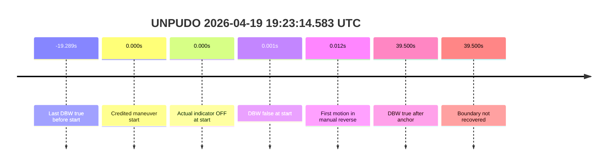
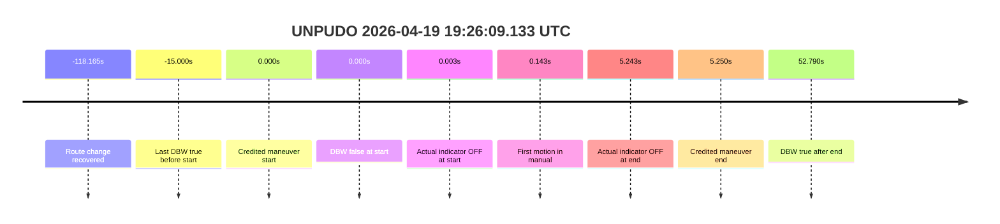
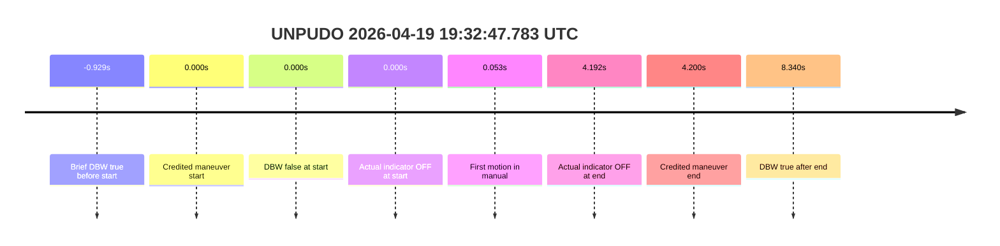
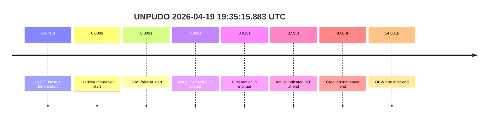

# Run Report: fme10011/2026-04-19--19-12-09--gen2-av-a2ff7adf-b899-4426-b9cb-3bdff0ea9636

| Field | Value |
|---|---|
| Run ID | `fme10011/2026-04-19--19-12-09--gen2-av-a2ff7adf-b899-4426-b9cb-3bdff0ea9636` |
| Date | `2026-04-19` |
| Model(s) | `armadillo-amethyst-squeaky` |
| Author | `guy.geva` |
| Event count | `5` |
| Outcome summary | `0 pass / 5 fail` |

## unpudo 2026-04-19 19:23:14.583 UTC

| Field | Value |
|---|---|
| Model | `armadillo-amethyst-squeaky` |
| Author | `guy.geva` |
| Run ID | `fme10011/2026-04-19--19-12-09--gen2-av-a2ff7adf-b899-4426-b9cb-3bdff0ea9636` |
| Date | `2026-04-19` |
| Time (UTC) | `2026-04-19 19:23:14.583` |
| Event type | `unpudo` |
| Disengagement type | `none observed` |
| Console | [run](https://console.sso.wayve.ai/run/fme10011/2026-04-19--19-12-09--gen2-av-a2ff7adf-b899-4426-b9cb-3bdff0ea9636?id=&time-unixus=1776626594583307) |
| Foxglove | [segment](https://app.foxglove.dev/wayve-on-prem/p/prj_0dX18KZdVHg1fmmI/view?ds=foxglove-stream&ds.deviceName=fme10011&ds.end=2026-04-19T19%3A24%3A44.583Z&ds.start=2026-04-19T19%3A21%3A14.583Z&layoutId=lay_0e7VD4WIKDQGU73Y&time=2026-04-19T19%3A23%3A14.583Z) |

- Fail: the credited UNPUDO is not AV-owned, and the official boundary is not recovered in the cached packet. The vehicle is already rolling in manual reverse at the anchor, DBW stays false through the inspected maneuver, and the first recovered DBW `true` only appears well after the anchor.

| Event | Time (UTC) | Delta from event start | Note |
|---|---|---:|---|
| Route change search | not found | `n/a` | searched in the stopped pre-event segment; no validated reassignment recovered |
| Last DBW true before start | 2026-04-19 19:22:55.294 | `-19.289s` | last local AV ownership before the anchor |
| DBW false at start | 2026-04-19 19:23:14.584 | `+0.001s` | controller ownership is false at the anchor |
| Credited maneuver start | 2026-04-19 19:23:14.583 | `0.000s` | event anchor |
| Actual indicator at start | 2026-04-19 19:23:14.575 (`OFF`) | `-0.008s` | vehicle switch is already `OFF` |
| First motion | 2026-04-19 19:23:14.595 | `+0.012s` | vehicle continues in manual reverse |
| In-AV driver accel help | `n/a` | `n/a` | no credited AV segment to score |
| Credited maneuver end | not recovered | `n/a` | event boundary is absent from the packet |
| DBW true after anchor | 2026-04-19 19:23:54.083 | `+39.500s` | first recovered AV ownership after the anchor |

| Metric | Value |
|---|---|
| Route-change status | `not found` |
| Controller DBW at event start | `false` |
| Predicted gear at event start | `DRIVE_POSITION_V2_REVERSE` |
| Actual gear at event start | `DRIVE_POSITION_V2_REVERSE` |
| Planned indicator at event start | `INDICATORS_STATE_V2_OFF` |
| Actual indicator at event start | `INDICATORS_STATE_V2_OFF` |
| Actual indicator at event end | `not recovered` |
| Driver accel help in credited window | `false` |
| Max accel pedal | `0.0%` |
| Max brake pedal | `0.0%` |
| Max speed | `0.600 m/s` |
| Main disengagement flag | `0` |
| Gear-to-start disengagement | `0` |
| Before-gearchange-10s disengagement | `0` |

The scoring call is straightforward even though the event boundary is missing: there is no AV-owned maneuver to credit. The vehicle is already moving in manual reverse at the anchor, the packet never recovers the end of the maneuver, and the first restored DBW window comes much later.

### Resolution

| Field | Value |
|---|---|
| Final outcome | `fail` |
| Do we agree with this label? | `yes` |
| Source disengagement type | `none observed` |
| Resolved effective failure type | `not_found_in_bounds` |
| Confidence | `medium` |

## unpudo 2026-04-19 19:26:09.133 UTC

| Field | Value |
|---|---|
| Model | `armadillo-amethyst-squeaky` |
| Author | `guy.geva` |
| Run ID | `fme10011/2026-04-19--19-12-09--gen2-av-a2ff7adf-b899-4426-b9cb-3bdff0ea9636` |
| Date | `2026-04-19` |
| Time (UTC) | `2026-04-19 19:26:09.133` |
| Event type | `unpudo` |
| Disengagement type | `none observed` |
| Console | [run](https://console.sso.wayve.ai/run/fme10011/2026-04-19--19-12-09--gen2-av-a2ff7adf-b899-4426-b9cb-3bdff0ea9636?id=&time-unixus=1776626769133310) |
| Foxglove | [segment](https://app.foxglove.dev/wayve-on-prem/p/prj_0dX18KZdVHg1fmmI/view?ds=foxglove-stream&ds.deviceName=fme10011&ds.end=2026-04-19T19%3A27%3A44.383Z&ds.start=2026-04-19T19%3A24%3A09.133Z&layoutId=lay_0e7VD4WIKDQGU73Y&time=2026-04-19T19%3A26%3A09.133Z) |

- Fail: route reassignment is found in the stopped pre-event segment, but the credited maneuver still starts and finishes outside AV. DBW is false at the anchor, the vehicle begins rolling in manual, and the first recovered DBW `true` comes after the official end.

| Event | Time (UTC) | Delta from event start | Note |
|---|---|---:|---|
| Route change recovered | 2026-04-19 19:24:10.968 | `-118.165s` | first clear step-count jump from 6 to 5 in the stopped pre-event segment |
| Last DBW true before start | 2026-04-19 19:25:54.133 | `-15.000s` | last local AV ownership before the anchor |
| DBW false at start | 2026-04-19 19:26:09.134 | `+0.001s` | controller ownership is false at the anchor |
| Credited maneuver start | 2026-04-19 19:26:09.133 | `0.000s` | event anchor |
| Actual indicator at start | 2026-04-19 19:26:09.136 (`OFF`) | `+0.003s` | vehicle switch is `OFF` |
| First motion | 2026-04-19 19:26:09.276 | `+0.143s` | vehicle starts rolling in manual |
| In-AV driver accel help | `n/a` | `n/a` | no credited AV segment to score |
| Actual indicator at end | 2026-04-19 19:26:14.376 (`OFF`) | `+5.243s` | switch remains `OFF` at the boundary |
| Credited maneuver end | 2026-04-19 19:26:14.383 | `+5.250s` | event boundary |
| DBW true after end | 2026-04-19 19:27:01.923 | `+52.790s` | first recovered AV ownership after the maneuver |

| Metric | Value |
|---|---|
| Route-change status | `found` |
| Controller DBW at event start | `false` |
| Predicted gear at event start | `DRIVE_POSITION_V2_DRIVE` |
| Actual gear at event start | `DRIVE_POSITION_V2_DRIVE` |
| Planned indicator at event start | `INDICATORS_STATE_V2_LEFT_ON` |
| Actual indicator at event start | `INDICATORS_STATE_V2_OFF` |
| Actual indicator at event end | `INDICATORS_STATE_V2_OFF` |
| Driver accel help in credited window | `false` |
| Max accel pedal | `0.0%` |
| Max brake pedal | `0.0%` |
| Max speed | `3.531 m/s` |
| Main disengagement flag | `0` |
| Gear-to-start disengagement | `0` |
| Before-gearchange-10s disengagement | `0` |

The route search succeeded, but it does not rescue ownership. The maneuver starts with DBW already false, the vehicle rolls in manual, and AV only returns long after the boundary has passed. That is a completed-outside-AV fail.

### Resolution

| Field | Value |
|---|---|
| Final outcome | `fail` |
| Do we agree with this label? | `yes` |
| Source disengagement type | `none observed` |
| Resolved effective failure type | `completed_outside_av` |
| Confidence | `high` |

## unpudo 2026-04-19 19:32:47.783 UTC

| Field | Value |
|---|---|
| Model | `armadillo-amethyst-squeaky` |
| Author | `guy.geva` |
| Run ID | `fme10011/2026-04-19--19-12-09--gen2-av-a2ff7adf-b899-4426-b9cb-3bdff0ea9636` |
| Date | `2026-04-19` |
| Time (UTC) | `2026-04-19 19:32:47.783` |
| Event type | `unpudo` |
| Disengagement type | `none observed` |
| Console | [run](https://console.sso.wayve.ai/run/fme10011/2026-04-19--19-12-09--gen2-av-a2ff7adf-b899-4426-b9cb-3bdff0ea9636?id=&time-unixus=1776627167783313) |
| Foxglove | [segment](https://app.foxglove.dev/wayve-on-prem/p/prj_0dX18KZdVHg1fmmI/view?ds=foxglove-stream&ds.deviceName=fme10011&ds.end=2026-04-19T19%3A34%3A21.983Z&ds.start=2026-04-19T19%3A30%3A47.783Z&layoutId=lay_0e7VD4WIKDQGU73Y&time=2026-04-19T19%3A32%3A47.783Z) |

- Fail: no validated route reassignment is recovered, and the event still starts outside AV. There is a brief DBW `true` blip just before the anchor, but it is not sustained through the credited maneuver and does not change the scoring outcome.

| Event | Time (UTC) | Delta from event start | Note |
|---|---|---:|---|
| Route change search | not found | `n/a` | stopped pre-event segment stays materially stable |
| Last DBW true before start | 2026-04-19 19:32:46.854 | `-0.929s` | brief pre-anchor AV blip only |
| DBW false at start | 2026-04-19 19:32:47.783 | `0.000s` | controller ownership is false at the anchor |
| Credited maneuver start | 2026-04-19 19:32:47.783 | `0.000s` | event anchor |
| Actual indicator at start | 2026-04-19 19:32:47.776 (`OFF`) | `-0.007s` | vehicle switch is `OFF` |
| First motion | 2026-04-19 19:32:47.836 | `+0.053s` | vehicle rolls in manual |
| In-AV driver accel help | `n/a` | `n/a` | no credited AV segment to score |
| Actual indicator at end | 2026-04-19 19:32:51.975 (`OFF`) | `+4.192s` | switch remains `OFF` |
| Credited maneuver end | 2026-04-19 19:32:51.983 | `+4.200s` | event boundary |
| DBW true after end | 2026-04-19 19:32:56.123 | `+8.340s` | first recovered AV ownership after the maneuver |

| Metric | Value |
|---|---|
| Route-change status | `not found` |
| Controller DBW at event start | `false` |
| Predicted gear at event start | `DRIVE_POSITION_V2_DRIVE` |
| Actual gear at event start | `DRIVE_POSITION_V2_DRIVE` |
| Planned indicator at event start | `INDICATORS_STATE_V2_OFF` |
| Actual indicator at event start | `INDICATORS_STATE_V2_OFF` |
| Actual indicator at event end | `INDICATORS_STATE_V2_OFF` |
| Driver accel help in credited window | `false` |
| Max accel pedal | `0.0%` |
| Max brake pedal | `0.0%` |
| Max speed | `4.142 m/s` |
| Main disengagement flag | `0` |
| Gear-to-start disengagement | `0` |
| Before-gearchange-10s disengagement | `0` |

This is still a completed-outside-AV fail. The brief DBW `true` blip before the anchor is not enough to credit the maneuver, and the vehicle keeps executing the official event while controller ownership is false.

### Resolution

| Field | Value |
|---|---|
| Final outcome | `fail` |
| Do we agree with this label? | `yes` |
| Source disengagement type | `none observed` |
| Resolved effective failure type | `completed_outside_av` |
| Confidence | `high` |

## unpudo 2026-04-19 19:35:15.883 UTC

| Field | Value |
|---|---|
| Model | `armadillo-amethyst-squeaky` |
| Author | `guy.geva` |
| Run ID | `fme10011/2026-04-19--19-12-09--gen2-av-a2ff7adf-b899-4426-b9cb-3bdff0ea9636` |
| Date | `2026-04-19` |
| Time (UTC) | `2026-04-19 19:35:15.883` |
| Event type | `unpudo` |
| Disengagement type | `none observed` |
| Console | [run](https://console.sso.wayve.ai/run/fme10011/2026-04-19--19-12-09--gen2-av-a2ff7adf-b899-4426-b9cb-3bdff0ea9636?id=&time-unixus=1776627315883306) |
| Foxglove | [segment](https://app.foxglove.dev/wayve-on-prem/p/prj_0dX18KZdVHg1fmmI/view?ds=foxglove-stream&ds.deviceName=fme10011&ds.end=2026-04-19T19%3A36%3A54.483Z&ds.start=2026-04-19T19%3A33%3A15.883Z&layoutId=lay_0e7VD4WIKDQGU73Y&time=2026-04-19T19%3A35%3A15.883Z) |

- Fail: route-change search does not recover a validated reassignment, and the credited maneuver begins and ends outside AV. The vehicle moves almost immediately, but controller ownership is false at the anchor and does not return until after the boundary.

| Event | Time (UTC) | Delta from event start | Note |
|---|---|---:|---|
| Route change search | not found | `n/a` | stopped pre-event navigation is stable |
| Last DBW true before start | 2026-04-19 19:35:01.173 | `-14.710s` | last local AV ownership before the anchor |
| DBW false at start | 2026-04-19 19:35:15.883 | `0.000s` | controller ownership is false at the anchor |
| Credited maneuver start | 2026-04-19 19:35:15.883 | `0.000s` | event anchor |
| Actual indicator at start | 2026-04-19 19:35:15.876 (`OFF`) | `-0.007s` | vehicle switch is `OFF` |
| First motion | 2026-04-19 19:35:15.896 | `+0.013s` | vehicle rolls in manual |
| In-AV driver accel help | `n/a` | `n/a` | no credited AV segment to score |
| Actual indicator at end | 2026-04-19 19:35:24.476 (`OFF`) | `+8.593s` | switch remains `OFF` |
| Credited maneuver end | 2026-04-19 19:35:24.483 | `+8.600s` | event boundary |
| DBW true after end | 2026-04-19 19:35:30.484 | `+14.601s` | first recovered AV ownership after the maneuver |

| Metric | Value |
|---|---|
| Route-change status | `not found` |
| Controller DBW at event start | `false` |
| Predicted gear at event start | `DRIVE_POSITION_V2_DRIVE` |
| Actual gear at event start | `DRIVE_POSITION_V2_DRIVE` |
| Planned indicator at event start | `INDICATORS_STATE_V2_OFF` |
| Actual indicator at event start | `INDICATORS_STATE_V2_OFF` |
| Actual indicator at event end | `INDICATORS_STATE_V2_OFF` |
| Driver accel help in credited window | `false` |
| Max accel pedal | `0.0%` |
| Max brake pedal | `0.0%` |
| Max speed | `2.236 m/s` |
| Main disengagement flag | `0` |
| Gear-to-start disengagement | `0` |
| Before-gearchange-10s disengagement | `0` |

The maneuver is outside AV from start to finish. There is no route change to rescue the scoring context, and the first restored DBW window appears well after the credited end.

### Resolution

| Field | Value |
|---|---|
| Final outcome | `fail` |
| Do we agree with this label? | `yes` |
| Source disengagement type | `none observed` |
| Resolved effective failure type | `completed_outside_av` |
| Confidence | `high` |

## unpudo 2026-04-19 19:44:11.583 UTC

| Field | Value |
|---|---|
| Model | `armadillo-amethyst-squeaky` |
| Author | `guy.geva` |
| Run ID | `fme10011/2026-04-19--19-12-09--gen2-av-a2ff7adf-b899-4426-b9cb-3bdff0ea9636` |
| Date | `2026-04-19` |
| Time (UTC) | `2026-04-19 19:44:11.583` |
| Event type | `unpudo` |
| Disengagement type | `none observed` |
| Console | [run](https://console.sso.wayve.ai/run/fme10011/2026-04-19--19-12-09--gen2-av-a2ff7adf-b899-4426-b9cb-3bdff0ea9636?id=&time-unixus=1776627851583299) |
| Foxglove | [segment](https://app.foxglove.dev/wayve-on-prem/p/prj_0dX18KZdVHg1fmmI/view?ds=foxglove-stream&ds.deviceName=fme10011&ds.end=2026-04-19T19%3A45%3A45.383Z&ds.start=2026-04-19T19%3A42%3A11.583Z&layoutId=lay_0e7VD4WIKDQGU73Y&time=2026-04-19T19%3A44%3A11.583Z) |

- Fail: no validated route reassignment is recovered, and the maneuver remains outside AV. The controller reports a nonzero accelerator input at the anchor, but the actual vehicle pedal stays at zero, so there is no in-AV driver help to score and no AV ownership through the event.

| Event | Time (UTC) | Delta from event start | Note |
|---|---|---:|---|
| Route change search | not found | `n/a` | stopped pre-event navigation is stable |
| Last DBW true before start | 2026-04-19 19:43:34.813 | `-36.770s` | last local AV ownership before the anchor |
| DBW false at start | 2026-04-19 19:44:11.583 | `0.000s` | controller ownership is false at the anchor |
| Credited maneuver start | 2026-04-19 19:44:11.583 | `0.000s` | event anchor |
| Actual indicator at start | 2026-04-19 19:44:11.576 (`LEFT_ON`) | `-0.007s` | vehicle switch is `LEFT_ON` |
| First motion | 2026-04-19 19:44:11.635 | `+0.052s` | vehicle rolls in manual |
| In-AV driver accel help | `n/a` | `n/a` | no credited AV segment to score |
| Actual indicator at end | 2026-04-19 19:44:15.375 (`OFF`) | `+3.792s` | switch clears before the boundary |
| Credited maneuver end | 2026-04-19 19:44:15.383 | `+3.800s` | event boundary |
| DBW true after end | 2026-04-19 19:44:15.683 | `+4.100s` | first recovered AV ownership after the maneuver |

| Metric | Value |
|---|---|
| Route-change status | `not found` |
| Controller DBW at event start | `false` |
| Predicted gear at event start | `DRIVE_POSITION_V2_DRIVE` |
| Actual gear at event start | `DRIVE_POSITION_V2_DRIVE` |
| Planned indicator at event start | `INDICATORS_STATE_V2_LEFT_ON` |
| Actual indicator at event start | `INDICATORS_STATE_V2_LEFT_ON` |
| Actual indicator at event end | `INDICATORS_STATE_V2_OFF` |
| Driver accel help in credited window | `false` |
| Max accel pedal | `0.0%` |
| Max brake pedal | `0.0%` |
| Max speed | `4.242 m/s` |
| Main disengagement flag | `0` |
| Gear-to-start disengagement | `0` |
| Before-gearchange-10s disengagement | `0` |

This is another completed-outside-AV fail. The controller-side accelerator reading is nonzero at the anchor, but the actual vehicle pedal is zero and the maneuver is not AV-owned, so there is no in-AV help to credit.

### Resolution

| Field | Value |
|---|---|
| Final outcome | `fail` |
| Do we agree with this label? | `yes` |
| Source disengagement type | `none observed` |
| Resolved effective failure type | `completed_outside_av` |
| Confidence | `high` |
