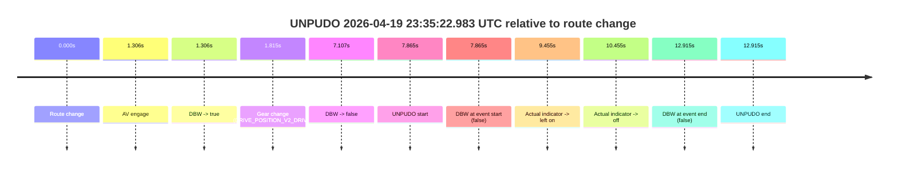
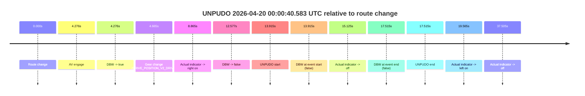
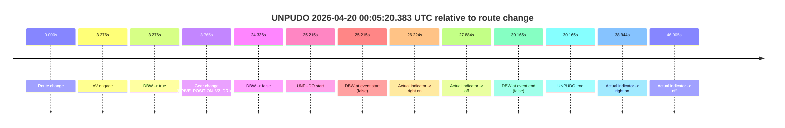
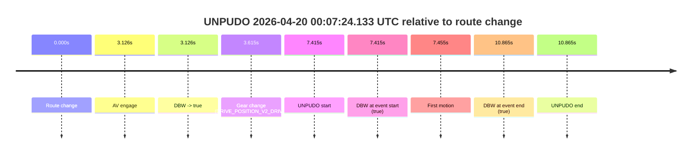

# Run Report: fme10011/2026-04-19--22-35-26--gen2-av-69939f2b-bb17-4c54-a13c-c01d985ed61e

| Field | Value |
|---|---|
| Run ID | `fme10011/2026-04-19--22-35-26--gen2-av-69939f2b-bb17-4c54-a13c-c01d985ed61e` |
| Date | `2026-04-19` |
| Model(s) | `pink-manta-ray-smooth` |
| Author | `guy.geva` |
| Event count | `4` |

## unpudo 2026-04-19 23:35:22.983 UTC

| Field | Value |
|---|---|
| Model | `pink-manta-ray-smooth` |
| Author | `guy.geva` |
| Run ID | `fme10011/2026-04-19--22-35-26--gen2-av-69939f2b-bb17-4c54-a13c-c01d985ed61e` |
| Date | `2026-04-19` |
| Time (UTC) | `23:35:22.983` |
| Event type | `unpudo` |
| Disengagement type | `none observed` |
| Route change | `found` |
| Console | [run](https://console.sso.wayve.ai/run/fme10011/2026-04-19--22-35-26--gen2-av-69939f2b-bb17-4c54-a13c-c01d985ed61e?id=&time-unixus=1776641722983322) |
| Foxglove | [segment](https://app.foxglove.dev/wayve-on-prem/p/prj_0dX18KZdVHg1fmmI/view?ds=foxglove-stream&ds.deviceName=fme10011&ds.start=2026-04-19T23%3A35%3A05.118387Z&ds.end=2026-04-19T23%3A35%3A38.033325Z&layoutId=lay_0e7VD4WIKDQGU73Y&time=2026-04-19T23%3A35%3A22.983322Z) |

### Event card: fail

- Fail: the credited unpudo does not stay AV-owned. The event window starts with DBW false, and the maneuver outcome lands outside a clean AV-owned segment.

| Event | Time (UTC) | Delta from route change |
|---|---:|---:|
| Route change | 2026-04-19 23:35:15.118 | `0.000s` |
| AV engage | 2026-04-19 23:35:16.424 | `1.306s` |
| DBW -> true | 2026-04-19 23:35:16.424 | `1.306s` |
| Gear change (DRIVE_POSITION_V2_DRIVE) | 2026-04-19 23:35:16.933 | `1.815s` |
| DBW -> false | 2026-04-19 23:35:22.224 | `7.107s` |
| UNPUDO start | 2026-04-19 23:35:22.983 | `7.865s` |
| DBW at event start (false) | 2026-04-19 23:35:22.983 | `7.865s` |
| Actual indicator -> left on | 2026-04-19 23:35:24.573 | `9.455s` |
| Actual indicator -> off | 2026-04-19 23:35:25.573 | `10.455s` |
| DBW at event end (false) | 2026-04-19 23:35:28.033 | `12.915s` |
| UNPUDO end | 2026-04-19 23:35:28.033 | `12.915s` |

| Metric | Value |
|---|---|
| Outcome | `fail` |
| Effective failure type | `not_av_owned` |
| Route change status | `found` |
| DBW at event start | `false` |
| DBW at event end | `false` |
| Predicted gear at AV start | `DRIVE_POSITION_V2_DRIVE` |
| Actual gear at AV start | `DRIVE_POSITION_V2_PARK` |
| Predicted gear at event start | `DRIVE_POSITION_V2_DRIVE` |
| Actual gear at event start | `DRIVE_POSITION_V2_DRIVE` |
| Planned indicator direction | `INDICATORS_STATE_V2_LEFT_ON` |
| Controller indicator direction | `INDICATORS_STATE_V2_LEFT_ON` |
| Actual indicator direction | `INDICATORS_STATE_V2_OFF` |
| Actual indicator at maneuver end | `INDICATORS_STATE_V2_OFF` |
| Driver accel help in AV | `false` |
| Driver accel help timestamp | `n/a` |
| Max accel pedal pct in AV | `0.0%` |
| Max brake pedal pct in AV | `8.0%` |
| Max speed mps in AV | `0.000` |
| Success timing baseline | `route change` |
| Route -> AV | `1.306s` |
| AV -> event start | `6.559s` |
| AV -> first motion | `n/a` |
| Success baseline -> event start | `7.865s` |
| Success baseline -> first motion | `n/a` |
| AV duration before disengagement | `5.801s` |
| Trajectory waypoint count | `37` |
| Driving-plan step count | `11` |

The scored portion starts from the AV-owned window, not from the pre-AV setup. Route-change search in the stopped pre-event segment was `found`, with the baseline therefore set to route change. At the event anchor the model predicts `DRIVE_POSITION_V2_DRIVE` and the actual gear is `DRIVE_POSITION_V2_DRIVE`. The effective model outcome is `fail` because `not_av_owned.`

### Resolution

| Field | Value |
|---|---|
| Final outcome | `fail` |
| Do we agree with this label? | `yes` |
| Source disengagement type | `none observed` |
| Resolved effective failure type | `not_av_owned` |
| Confidence | `high` |

## unpudo 2026-04-20 00:00:40.583 UTC

| Field | Value |
|---|---|
| Model | `pink-manta-ray-smooth` |
| Author | `guy.geva` |
| Run ID | `fme10011/2026-04-19--22-35-26--gen2-av-69939f2b-bb17-4c54-a13c-c01d985ed61e` |
| Date | `2026-04-19` |
| Time (UTC) | `00:00:40.583` |
| Event type | `unpudo` |
| Disengagement type | `none observed` |
| Route change | `found` |
| Console | [run](https://console.sso.wayve.ai/run/fme10011/2026-04-19--22-35-26--gen2-av-69939f2b-bb17-4c54-a13c-c01d985ed61e?id=&time-unixus=1776643240583302) |
| Foxglove | [segment](https://app.foxglove.dev/wayve-on-prem/p/prj_0dX18KZdVHg1fmmI/view?ds=foxglove-stream&ds.deviceName=fme10011&ds.start=2026-04-20T00%3A00%3A16.668262Z&ds.end=2026-04-20T00%3A00%3A54.183299Z&layoutId=lay_0e7VD4WIKDQGU73Y&time=2026-04-20T00%3A00%3A40.583302Z) |

### Event card: fail

- Fail: the credited unpudo does not stay AV-owned. The event window starts with DBW false, and the maneuver outcome lands outside a clean AV-owned segment.

| Event | Time (UTC) | Delta from route change |
|---|---:|---:|
| Route change | 2026-04-20 00:00:26.668 | `0.000s` |
| AV engage | 2026-04-20 00:00:30.944 | `4.276s` |
| DBW -> true | 2026-04-20 00:00:30.944 | `4.276s` |
| Gear change (DRIVE_POSITION_V2_DRIVE) | 2026-04-20 00:00:31.333 | `4.665s` |
| Actual indicator -> right on | 2026-04-20 00:00:35.533 | `8.865s` |
| DBW -> false | 2026-04-20 00:00:39.245 | `12.577s` |
| UNPUDO start | 2026-04-20 00:00:40.583 | `13.915s` |
| DBW at event start (false) | 2026-04-20 00:00:40.583 | `13.915s` |
| Actual indicator -> off | 2026-04-20 00:00:41.793 | `15.125s` |
| DBW at event end (false) | 2026-04-20 00:00:44.183 | `17.515s` |
| UNPUDO end | 2026-04-20 00:00:44.183 | `17.515s` |
| Actual indicator -> left on | 2026-04-20 00:00:46.233 | `19.565s` |
| Actual indicator -> off | 2026-04-20 00:01:04.173 | `37.505s` |

| Metric | Value |
|---|---|
| Outcome | `fail` |
| Effective failure type | `not_av_owned` |
| Route change status | `found` |
| DBW at event start | `false` |
| DBW at event end | `false` |
| Predicted gear at AV start | `DRIVE_POSITION_V2_DRIVE` |
| Actual gear at AV start | `DRIVE_POSITION_V2_PARK` |
| Predicted gear at event start | `DRIVE_POSITION_V2_DRIVE` |
| Actual gear at event start | `DRIVE_POSITION_V2_DRIVE` |
| Planned indicator direction | `INDICATORS_STATE_V2_OFF` |
| Controller indicator direction | `INDICATORS_STATE_V2_OFF` |
| Actual indicator direction | `INDICATORS_STATE_V2_RIGHT_ON` |
| Actual indicator at maneuver end | `INDICATORS_STATE_V2_OFF` |
| Driver accel help in AV | `false` |
| Driver accel help timestamp | `n/a` |
| Max accel pedal pct in AV | `0.0%` |
| Max brake pedal pct in AV | `18.0%` |
| Max speed mps in AV | `0.000` |
| Success timing baseline | `route change` |
| Route -> AV | `4.276s` |
| AV -> event start | `9.639s` |
| AV -> first motion | `n/a` |
| Success baseline -> event start | `13.915s` |
| Success baseline -> first motion | `n/a` |
| AV duration before disengagement | `8.301s` |
| Trajectory waypoint count | `37` |
| Driving-plan step count | `11` |

The scored portion starts from the AV-owned window, not from the pre-AV setup. Route-change search in the stopped pre-event segment was `found`, with the baseline therefore set to route change. At the event anchor the model predicts `DRIVE_POSITION_V2_DRIVE` and the actual gear is `DRIVE_POSITION_V2_DRIVE`. The effective model outcome is `fail` because `not_av_owned.`

### Resolution

| Field | Value |
|---|---|
| Final outcome | `fail` |
| Do we agree with this label? | `yes` |
| Source disengagement type | `none observed` |
| Resolved effective failure type | `not_av_owned` |
| Confidence | `high` |

## unpudo 2026-04-20 00:05:20.383 UTC

| Field | Value |
|---|---|
| Model | `pink-manta-ray-smooth` |
| Author | `guy.geva` |
| Run ID | `fme10011/2026-04-19--22-35-26--gen2-av-69939f2b-bb17-4c54-a13c-c01d985ed61e` |
| Date | `2026-04-19` |
| Time (UTC) | `00:05:20.383` |
| Event type | `unpudo` |
| Disengagement type | `none observed` |
| Route change | `found` |
| Console | [run](https://console.sso.wayve.ai/run/fme10011/2026-04-19--22-35-26--gen2-av-69939f2b-bb17-4c54-a13c-c01d985ed61e?id=&time-unixus=1776643520383311) |
| Foxglove | [segment](https://app.foxglove.dev/wayve-on-prem/p/prj_0dX18KZdVHg1fmmI/view?ds=foxglove-stream&ds.deviceName=fme10011&ds.start=2026-04-20T00%3A04%3A45.168426Z&ds.end=2026-04-20T00%3A05%3A35.333300Z&layoutId=lay_0e7VD4WIKDQGU73Y&time=2026-04-20T00%3A05%3A20.383311Z) |

### Event card: fail

- Fail: the credited unpudo does not stay AV-owned. The event window starts with DBW false, and the maneuver outcome lands outside a clean AV-owned segment.

| Event | Time (UTC) | Delta from route change |
|---|---:|---:|
| Route change | 2026-04-20 00:04:55.168 | `0.000s` |
| AV engage | 2026-04-20 00:04:58.444 | `3.276s` |
| DBW -> true | 2026-04-20 00:04:58.444 | `3.276s` |
| Gear change (DRIVE_POSITION_V2_DRIVE) | 2026-04-20 00:04:58.933 | `3.765s` |
| DBW -> false | 2026-04-20 00:05:19.504 | `24.336s` |
| UNPUDO start | 2026-04-20 00:05:20.383 | `25.215s` |
| DBW at event start (false) | 2026-04-20 00:05:20.383 | `25.215s` |
| Actual indicator -> right on | 2026-04-20 00:05:21.392 | `26.224s` |
| Actual indicator -> off | 2026-04-20 00:05:23.052 | `27.884s` |
| DBW at event end (false) | 2026-04-20 00:05:25.333 | `30.165s` |
| UNPUDO end | 2026-04-20 00:05:25.333 | `30.165s` |
| Actual indicator -> right on | 2026-04-20 00:05:34.112 | `38.944s` |
| Actual indicator -> off | 2026-04-20 00:05:42.072 | `46.905s` |

| Metric | Value |
|---|---|
| Outcome | `fail` |
| Effective failure type | `not_av_owned` |
| Route change status | `found` |
| DBW at event start | `false` |
| DBW at event end | `false` |
| Predicted gear at AV start | `DRIVE_POSITION_V2_DRIVE` |
| Actual gear at AV start | `DRIVE_POSITION_V2_PARK` |
| Predicted gear at event start | `DRIVE_POSITION_V2_DRIVE` |
| Actual gear at event start | `DRIVE_POSITION_V2_DRIVE` |
| Planned indicator direction | `INDICATORS_STATE_V2_RIGHT_ON` |
| Controller indicator direction | `INDICATORS_STATE_V2_RIGHT_ON` |
| Actual indicator direction | `INDICATORS_STATE_V2_OFF` |
| Actual indicator at maneuver end | `INDICATORS_STATE_V2_OFF` |
| Driver accel help in AV | `false` |
| Driver accel help timestamp | `n/a` |
| Max accel pedal pct in AV | `0.0%` |
| Max brake pedal pct in AV | `10.4%` |
| Max speed mps in AV | `0.000` |
| Success timing baseline | `route change` |
| Route -> AV | `3.276s` |
| AV -> event start | `21.939s` |
| AV -> first motion | `n/a` |
| Success baseline -> event start | `25.215s` |
| Success baseline -> first motion | `n/a` |
| AV duration before disengagement | `21.060s` |
| Trajectory waypoint count | `37` |
| Driving-plan step count | `11` |

The scored portion starts from the AV-owned window, not from the pre-AV setup. Route-change search in the stopped pre-event segment was `found`, with the baseline therefore set to route change. At the event anchor the model predicts `DRIVE_POSITION_V2_DRIVE` and the actual gear is `DRIVE_POSITION_V2_DRIVE`. The effective model outcome is `fail` because `not_av_owned.`

### Resolution

| Field | Value |
|---|---|
| Final outcome | `fail` |
| Do we agree with this label? | `yes` |
| Source disengagement type | `none observed` |
| Resolved effective failure type | `not_av_owned` |
| Confidence | `high` |

## unpudo 2026-04-20 00:07:24.133 UTC

| Field | Value |
|---|---|
| Model | `pink-manta-ray-smooth` |
| Author | `guy.geva` |
| Run ID | `fme10011/2026-04-19--22-35-26--gen2-av-69939f2b-bb17-4c54-a13c-c01d985ed61e` |
| Date | `2026-04-19` |
| Time (UTC) | `00:07:24.133` |
| Event type | `unpudo` |
| Disengagement type | `none observed` |
| Route change | `found` |
| Console | [run](https://console.sso.wayve.ai/run/fme10011/2026-04-19--22-35-26--gen2-av-69939f2b-bb17-4c54-a13c-c01d985ed61e?id=&time-unixus=1776643644133306) |
| Foxglove | [segment](https://app.foxglove.dev/wayve-on-prem/p/prj_0dX18KZdVHg1fmmI/view?ds=foxglove-stream&ds.deviceName=fme10011&ds.start=2026-04-20T00%3A07%3A06.718266Z&ds.end=2026-04-20T00%3A07%3A37.583301Z&layoutId=lay_0e7VD4WIKDQGU73Y&time=2026-04-20T00%3A07%3A24.133306Z) |

### Event card: pass

- Pass: AV owns the credited unpudo from route change through the official unpudo window, the gear state is aligned at the anchor, and the vehicle moves without driver accelerator help in AV.

| Event | Time (UTC) | Delta from route change |
|---|---:|---:|
| Route change | 2026-04-20 00:07:16.718 | `0.000s` |
| AV engage | 2026-04-20 00:07:19.844 | `3.126s` |
| DBW -> true | 2026-04-20 00:07:19.844 | `3.126s` |
| Gear change (DRIVE_POSITION_V2_DRIVE) | 2026-04-20 00:07:20.333 | `3.615s` |
| UNPUDO start | 2026-04-20 00:07:24.133 | `7.415s` |
| DBW at event start (true) | 2026-04-20 00:07:24.133 | `7.415s` |
| First motion | 2026-04-20 00:07:24.172 | `7.455s` |
| DBW at event end (true) | 2026-04-20 00:07:27.583 | `10.865s` |
| UNPUDO end | 2026-04-20 00:07:27.583 | `10.865s` |

| Metric | Value |
|---|---|
| Outcome | `pass` |
| Effective failure type | `none` |
| Route change status | `found` |
| DBW at event start | `true` |
| DBW at event end | `true` |
| Predicted gear at AV start | `DRIVE_POSITION_V2_DRIVE` |
| Actual gear at AV start | `DRIVE_POSITION_V2_PARK` |
| Predicted gear at event start | `DRIVE_POSITION_V2_DRIVE` |
| Actual gear at event start | `DRIVE_POSITION_V2_DRIVE` |
| Planned indicator direction | `INDICATORS_STATE_V2_OFF` |
| Controller indicator direction | `INDICATORS_STATE_V2_OFF` |
| Actual indicator direction | `INDICATORS_STATE_V2_OFF` |
| Actual indicator at maneuver end | `INDICATORS_STATE_V2_OFF` |
| Driver accel help in AV | `false` |
| Driver accel help timestamp | `n/a` |
| Max accel pedal pct in AV | `0.0%` |
| Max brake pedal pct in AV | `8.0%` |
| Max speed mps in AV | `4.944` |
| Success timing baseline | `route change` |
| Route -> AV | `3.126s` |
| AV -> event start | `4.289s` |
| AV -> first motion | `4.329s` |
| Success baseline -> event start | `7.415s` |
| Success baseline -> first motion | `7.455s` |
| AV duration before disengagement | `n/a` |
| Trajectory waypoint count | `38` |
| Driving-plan step count | `11` |

The scored portion starts from the AV-owned window, not from the pre-AV setup. Route-change search in the stopped pre-event segment was `found`, with the baseline therefore set to route change. At the event anchor the model predicts `DRIVE_POSITION_V2_DRIVE` and the actual gear is `DRIVE_POSITION_V2_DRIVE`. The effective model outcome is `pass` because `the credited unpudo stays AV-owned through the official unpudo window.`

### Resolution

| Field | Value |
|---|---|
| Final outcome | `pass` |
| Do we agree with this label? | `yes` |
| Source disengagement type | `none observed` |
| Resolved effective failure type | `none` |
| Confidence | `high` |
