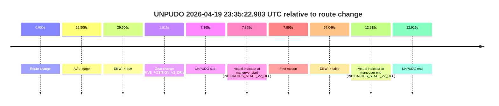
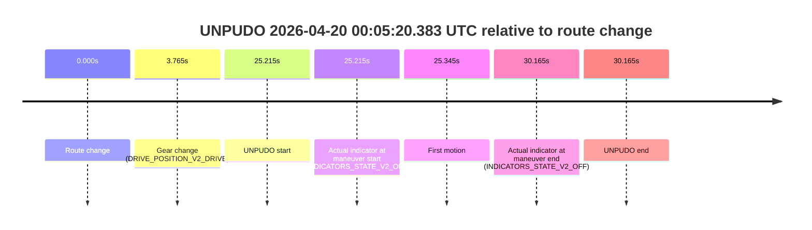
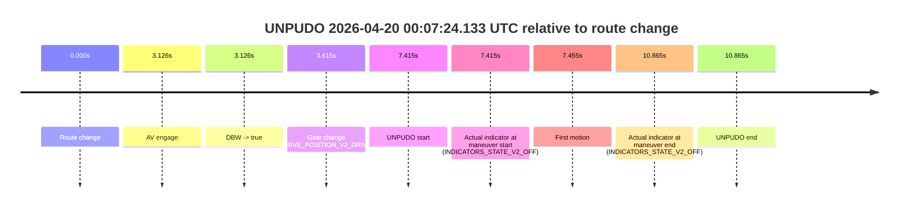

# Run Report: fme10011/2026-04-19--22-35-26--gen2-av-69939f2b-bb17-4c54-a13c-c01d985ed61e

| Field | Value |
|---|---|
| Run ID | `fme10011/2026-04-19--22-35-26--gen2-av-69939f2b-bb17-4c54-a13c-c01d985ed61e` |
| Date | `2026-04-19` |
| Model(s) | `pink-manta-ray-smooth` |
| Author | `guy.geva` |
| Event count | `4` |

## unpudo 2026-04-19 23:35:22.983 UTC

| Field | Value |
|---|---|
| Model | `pink-manta-ray-smooth` |
| Author | `guy.geva` |
| Run ID | `fme10011/2026-04-19--22-35-26--gen2-av-69939f2b-bb17-4c54-a13c-c01d985ed61e` |
| Date | `2026-04-19` |
| Time (UTC) | `23:35:22.983` |
| Event type | `unpudo` |
| Disengagement type | `none observed` |
| Route change | `found` |
| Console | [run](https://console.sso.wayve.ai/run/fme10011/2026-04-19--22-35-26--gen2-av-69939f2b-bb17-4c54-a13c-c01d985ed61e?id=&time-unixus=1776641722983322) |
| Foxglove | [segment](https://app.foxglove.dev/wayve-on-prem/p/prj_0dX18KZdVHg1fmmI/view?ds=foxglove-stream&ds.deviceName=fme10011&ds.start=2026-04-19T23%3A35%3A05.118387Z&ds.end=2026-04-19T23%3A36%3A22.164076Z&layoutId=lay_0e7VD4WIKDQGU73Y&time=2026-04-19T23%3A35%3A22.983322Z) |

### Event card: accidental

- Accidental: AV ownership is present for less than `2s`, so this is treated as an accidental brush with the maneuver rather than a meaningful model attempt.

| Event | Time (UTC) | Delta from route change |
|---|---:|---:|
| Route change | 2026-04-19 23:35:15.118 | `0.000s` |
| AV engage | 2026-04-19 23:35:44.624 | `29.506s` |
| DBW -> true | 2026-04-19 23:35:44.624 | `29.506s` |
| Gear change (DRIVE_POSITION_V2_DRIVE) | 2026-04-19 23:35:16.933 | `1.815s` |
| UNPUDO start | 2026-04-19 23:35:22.983 | `7.865s` |
| Actual indicator at maneuver start (INDICATORS_STATE_V2_OFF) | 2026-04-19 23:35:22.983 | `7.865s` |
| First motion | 2026-04-19 23:35:23.013 | `7.895s` |
| DBW -> false | 2026-04-19 23:36:12.164 | `57.046s` |
| Actual indicator at maneuver end (INDICATORS_STATE_V2_OFF) | 2026-04-19 23:35:28.033 | `12.915s` |
| UNPUDO end | 2026-04-19 23:35:28.033 | `12.915s` |

| Metric | Value |
|---|---|
| Outcome | `accidental` |
| Effective failure type | `none` |
| Route change status | `found` |
| DBW at event start | `false` |
| DBW at event end | `false` |
| Predicted gear at AV start | `DRIVE_POSITION_V2_DRIVE` |
| Actual gear at AV start | `DRIVE_POSITION_V2_DRIVE` |
| Predicted gear at event start | `DRIVE_POSITION_V2_DRIVE` |
| Actual gear at event start | `DRIVE_POSITION_V2_DRIVE` |
| Planned indicator direction | `INDICATORS_STATE_V2_LEFT_ON` |
| Controller indicator direction | `INDICATORS_STATE_V2_LEFT_ON` |
| Actual indicator direction | `INDICATORS_STATE_V2_OFF` |
| Actual indicator at maneuver end | `INDICATORS_STATE_V2_OFF` |
| Driver accel help in AV | `false` |
| Driver accel help timestamp | `n/a` |
| Max accel pedal pct in AV | `0.0%` |
| Max brake pedal pct in AV | `0.0%` |
| Max speed mps in AV | `0.000` |
| Route -> AV | `29.506s` |
| AV -> event start | `-21.641s` |
| AV -> first motion | `-21.611s` |
| AV duration before disengagement | `27.539s` |
| Trajectory waypoint count | `37` |
| Driving-plan step count | `11` |

The scored portion starts from the AV-owned window, not from the pre-AV setup. Route-change search in the stopped pre-event segment was `found`, with the baseline therefore set to route change. At the event anchor the model predicts `DRIVE_POSITION_V2_DRIVE` and the actual gear is `DRIVE_POSITION_V2_DRIVE`. The effective model outcome is `accidental` because `the AV-owned portion is shorter than 2s`.

### Resolution

| Field | Value |
|---|---|
| Final outcome | `accidental` |
| Do we agree with this label? | `yes` |
| Source disengagement type | `none observed` |
| Resolved effective failure type | `none` |
| Confidence | `high` |

## unpudo 2026-04-20 00:00:40.583 UTC

| Field | Value |
|---|---|
| Model | `pink-manta-ray-smooth` |
| Author | `guy.geva` |
| Run ID | `fme10011/2026-04-19--22-35-26--gen2-av-69939f2b-bb17-4c54-a13c-c01d985ed61e` |
| Date | `2026-04-19` |
| Time (UTC) | `00:00:40.583` |
| Event type | `unpudo` |
| Disengagement type | `none observed` |
| Route change | `found` |
| Console | [run](https://console.sso.wayve.ai/run/fme10011/2026-04-19--22-35-26--gen2-av-69939f2b-bb17-4c54-a13c-c01d985ed61e?id=&time-unixus=1776643240583302) |
| Foxglove | [segment](https://app.foxglove.dev/wayve-on-prem/p/prj_0dX18KZdVHg1fmmI/view?ds=foxglove-stream&ds.deviceName=fme10011&ds.start=2026-04-20T00%3A00%3A16.668262Z&ds.end=2026-04-20T00%3A01%3A42.364230Z&layoutId=lay_0e7VD4WIKDQGU73Y&time=2026-04-20T00%3A00%3A40.583302Z) |

### Event card: accidental

- Accidental: AV ownership is present for less than `2s`, so this is treated as an accidental brush with the maneuver rather than a meaningful model attempt.

| Event | Time (UTC) | Delta from route change |
|---|---:|---:|
| Route change | 2026-04-20 00:00:26.668 | `0.000s` |
| AV engage | 2026-04-20 00:00:57.183 | `30.515s` |
| DBW -> true | 2026-04-20 00:00:57.183 | `30.515s` |
| Gear change (DRIVE_POSITION_V2_DRIVE) | 2026-04-20 00:00:31.333 | `4.665s` |
| UNPUDO start | 2026-04-20 00:00:40.583 | `13.915s` |
| Actual indicator at maneuver start (INDICATORS_STATE_V2_RIGHT_ON) | 2026-04-20 00:00:40.583 | `13.915s` |
| First motion | 2026-04-20 00:00:40.613 | `13.945s` |
| DBW -> false | 2026-04-20 00:01:32.364 | `65.696s` |
| Actual indicator at maneuver end (INDICATORS_STATE_V2_OFF) | 2026-04-20 00:00:44.183 | `17.515s` |
| UNPUDO end | 2026-04-20 00:00:44.183 | `17.515s` |

| Metric | Value |
|---|---|
| Outcome | `accidental` |
| Effective failure type | `none` |
| Route change status | `found` |
| DBW at event start | `false` |
| DBW at event end | `false` |
| Predicted gear at AV start | `DRIVE_POSITION_V2_DRIVE` |
| Actual gear at AV start | `DRIVE_POSITION_V2_DRIVE` |
| Predicted gear at event start | `DRIVE_POSITION_V2_DRIVE` |
| Actual gear at event start | `DRIVE_POSITION_V2_DRIVE` |
| Planned indicator direction | `INDICATORS_STATE_V2_OFF` |
| Controller indicator direction | `INDICATORS_STATE_V2_OFF` |
| Actual indicator direction | `INDICATORS_STATE_V2_RIGHT_ON` |
| Actual indicator at maneuver end | `INDICATORS_STATE_V2_OFF` |
| Driver accel help in AV | `false` |
| Driver accel help timestamp | `n/a` |
| Max accel pedal pct in AV | `0.0%` |
| Max brake pedal pct in AV | `0.0%` |
| Max speed mps in AV | `0.000` |
| Route -> AV | `30.515s` |
| AV -> event start | `-16.600s` |
| AV -> first motion | `-16.570s` |
| AV duration before disengagement | `35.181s` |
| Trajectory waypoint count | `37` |
| Driving-plan step count | `11` |

The scored portion starts from the AV-owned window, not from the pre-AV setup. Route-change search in the stopped pre-event segment was `found`, with the baseline therefore set to route change. At the event anchor the model predicts `DRIVE_POSITION_V2_DRIVE` and the actual gear is `DRIVE_POSITION_V2_DRIVE`. The effective model outcome is `accidental` because `the AV-owned portion is shorter than 2s`.

### Resolution

| Field | Value |
|---|---|
| Final outcome | `accidental` |
| Do we agree with this label? | `yes` |
| Source disengagement type | `none observed` |
| Resolved effective failure type | `none` |
| Confidence | `high` |

## unpudo 2026-04-20 00:05:20.383 UTC

| Field | Value |
|---|---|
| Model | `pink-manta-ray-smooth` |
| Author | `guy.geva` |
| Run ID | `fme10011/2026-04-19--22-35-26--gen2-av-69939f2b-bb17-4c54-a13c-c01d985ed61e` |
| Date | `2026-04-19` |
| Time (UTC) | `00:05:20.383` |
| Event type | `unpudo` |
| Disengagement type | `none observed` |
| Route change | `found` |
| Console | [run](https://console.sso.wayve.ai/run/fme10011/2026-04-19--22-35-26--gen2-av-69939f2b-bb17-4c54-a13c-c01d985ed61e?id=&time-unixus=1776643520383311) |
| Foxglove | [segment](https://app.foxglove.dev/wayve-on-prem/p/prj_0dX18KZdVHg1fmmI/view?ds=foxglove-stream&ds.deviceName=fme10011&ds.start=2026-04-20T00%3A04%3A45.168426Z&ds.end=2026-04-20T00%3A05%3A35.333300Z&layoutId=lay_0e7VD4WIKDQGU73Y&time=2026-04-20T00%3A05%3A20.383311Z) |

### Event card: non-av

- Non-AV: the detected unpudo starts outside AV ownership, so it is kept for coverage but excluded from model success / failure scoring.

| Event | Time (UTC) | Delta from route change |
|---|---:|---:|
| Route change | 2026-04-20 00:04:55.168 | `0.000s` |
| Gear change (DRIVE_POSITION_V2_DRIVE) | 2026-04-20 00:04:58.933 | `3.765s` |
| UNPUDO start | 2026-04-20 00:05:20.383 | `25.215s` |
| Actual indicator at maneuver start (INDICATORS_STATE_V2_OFF) | 2026-04-20 00:05:20.383 | `25.215s` |
| First motion | 2026-04-20 00:05:20.512 | `25.345s` |
| Actual indicator at maneuver end (INDICATORS_STATE_V2_OFF) | 2026-04-20 00:05:25.333 | `30.165s` |
| UNPUDO end | 2026-04-20 00:05:25.333 | `30.165s` |

| Metric | Value |
|---|---|
| Outcome | `non-av` |
| Effective failure type | `none` |
| Route change status | `found` |
| DBW at event start | `false` |
| DBW at event end | `false` |
| Predicted gear at AV start | `n/a` |
| Actual gear at AV start | `n/a` |
| Predicted gear at event start | `DRIVE_POSITION_V2_DRIVE` |
| Actual gear at event start | `DRIVE_POSITION_V2_DRIVE` |
| Planned indicator direction | `INDICATORS_STATE_V2_RIGHT_ON` |
| Controller indicator direction | `INDICATORS_STATE_V2_RIGHT_ON` |
| Actual indicator direction | `INDICATORS_STATE_V2_OFF` |
| Actual indicator at maneuver end | `INDICATORS_STATE_V2_OFF` |
| Driver accel help in AV | `false` |
| Driver accel help timestamp | `n/a` |
| Max accel pedal pct in AV | `0.0%` |
| Max brake pedal pct in AV | `0.0%` |
| Max speed mps in AV | `0.000` |
| Route -> AV | `n/a` |
| AV -> event start | `n/a` |
| AV -> first motion | `n/a` |
| AV duration before disengagement | `n/a` |
| Trajectory waypoint count | `37` |
| Driving-plan step count | `11` |

The scored portion starts from the AV-owned window, not from the pre-AV setup. Route-change search in the stopped pre-event segment was `found`, with the baseline therefore set to route change. At the event anchor the model predicts `DRIVE_POSITION_V2_DRIVE` and the actual gear is `DRIVE_POSITION_V2_DRIVE`. The effective model outcome is `non-av` because `the event does not begin in AV ownership`.

### Resolution

| Field | Value |
|---|---|
| Final outcome | `non-av` |
| Do we agree with this label? | `yes` |
| Source disengagement type | `none observed` |
| Resolved effective failure type | `none` |
| Confidence | `high` |

## unpudo 2026-04-20 00:07:24.133 UTC

| Field | Value |
|---|---|
| Model | `pink-manta-ray-smooth` |
| Author | `guy.geva` |
| Run ID | `fme10011/2026-04-19--22-35-26--gen2-av-69939f2b-bb17-4c54-a13c-c01d985ed61e` |
| Date | `2026-04-19` |
| Time (UTC) | `00:07:24.133` |
| Event type | `unpudo` |
| Disengagement type | `none observed` |
| Route change | `found` |
| Console | [run](https://console.sso.wayve.ai/run/fme10011/2026-04-19--22-35-26--gen2-av-69939f2b-bb17-4c54-a13c-c01d985ed61e?id=&time-unixus=1776643644133306) |
| Foxglove | [segment](https://app.foxglove.dev/wayve-on-prem/p/prj_0dX18KZdVHg1fmmI/view?ds=foxglove-stream&ds.deviceName=fme10011&ds.start=2026-04-20T00%3A07%3A06.718266Z&ds.end=2026-04-20T00%3A07%3A37.583301Z&layoutId=lay_0e7VD4WIKDQGU73Y&time=2026-04-20T00%3A07%3A24.133306Z) |

### Event card: pass

- Pass: AV owns the credited unpudo through the official event window, the gear state is aligned at the anchor, and the vehicle moves without driver accelerator help in AV.

| Event | Time (UTC) | Delta from route change |
|---|---:|---:|
| Route change | 2026-04-20 00:07:16.718 | `0.000s` |
| AV engage | 2026-04-20 00:07:19.844 | `3.126s` |
| DBW -> true | 2026-04-20 00:07:19.844 | `3.126s` |
| Gear change (DRIVE_POSITION_V2_DRIVE) | 2026-04-20 00:07:20.333 | `3.615s` |
| UNPUDO start | 2026-04-20 00:07:24.133 | `7.415s` |
| Actual indicator at maneuver start (INDICATORS_STATE_V2_OFF) | 2026-04-20 00:07:24.133 | `7.415s` |
| First motion | 2026-04-20 00:07:24.172 | `7.455s` |
| Actual indicator at maneuver end (INDICATORS_STATE_V2_OFF) | 2026-04-20 00:07:27.583 | `10.865s` |
| UNPUDO end | 2026-04-20 00:07:27.583 | `10.865s` |

| Metric | Value |
|---|---|
| Outcome | `pass` |
| Effective failure type | `none` |
| Route change status | `found` |
| DBW at event start | `true` |
| DBW at event end | `true` |
| Predicted gear at AV start | `DRIVE_POSITION_V2_DRIVE` |
| Actual gear at AV start | `DRIVE_POSITION_V2_PARK` |
| Predicted gear at event start | `DRIVE_POSITION_V2_DRIVE` |
| Actual gear at event start | `DRIVE_POSITION_V2_DRIVE` |
| Planned indicator direction | `INDICATORS_STATE_V2_OFF` |
| Controller indicator direction | `INDICATORS_STATE_V2_OFF` |
| Actual indicator direction | `INDICATORS_STATE_V2_OFF` |
| Actual indicator at maneuver end | `INDICATORS_STATE_V2_OFF` |
| Driver accel help in AV | `false` |
| Driver accel help timestamp | `n/a` |
| Max accel pedal pct in AV | `0.0%` |
| Max brake pedal pct in AV | `8.0%` |
| Max speed mps in AV | `4.944` |
| Route -> AV | `3.126s` |
| AV -> event start | `4.289s` |
| AV -> first motion | `4.329s` |
| AV duration before disengagement | `n/a` |
| Trajectory waypoint count | `38` |
| Driving-plan step count | `11` |

The scored portion starts from the AV-owned window, not from the pre-AV setup. Route-change search in the stopped pre-event segment was `found`, with the baseline therefore set to route change. At the event anchor the model predicts `DRIVE_POSITION_V2_DRIVE` and the actual gear is `DRIVE_POSITION_V2_DRIVE`. The effective model outcome is `pass` because `the credited maneuver stays AV-owned through the official event end`.

### Resolution

| Field | Value |
|---|---|
| Final outcome | `pass` |
| Do we agree with this label? | `yes` |
| Source disengagement type | `none observed` |
| Resolved effective failure type | `none` |
| Confidence | `high` |
