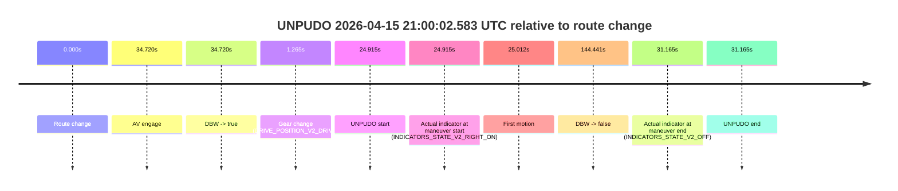
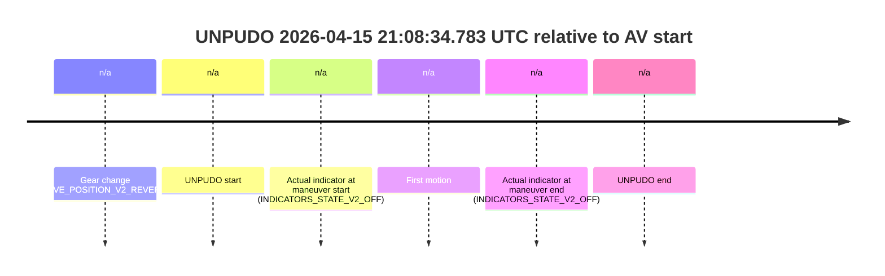
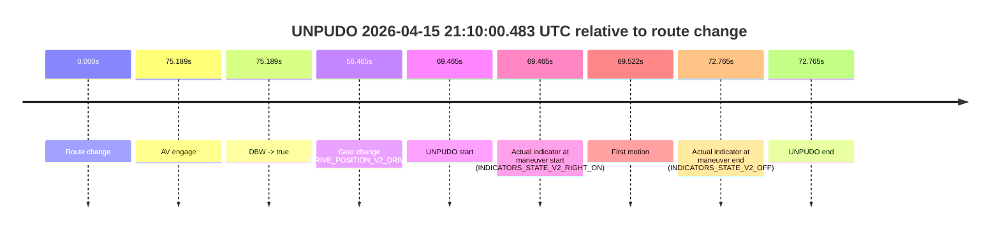

# Run Report: fme20002/2026-04-15--20-25-29--gen2-av-99cc5aef-bf09-4db5-a19a-9a04ef94a207

| Field | Value |
|---|---|
| Run ID | `fme20002/2026-04-15--20-25-29--gen2-av-99cc5aef-bf09-4db5-a19a-9a04ef94a207` |
| Date | `2026-04-15` |
| Model(s) | `plum-timeless-beaver` |
| Author | `peng.tang` |
| Event count | `6` |

## unpudo 2026-04-15 20:40:13.483 UTC

| Field | Value |
|---|---|
| Model | `plum-timeless-beaver` |
| Author | `peng.tang` |
| Run ID | `fme20002/2026-04-15--20-25-29--gen2-av-99cc5aef-bf09-4db5-a19a-9a04ef94a207` |
| Date | `2026-04-15` |
| Time (UTC) | `20:40:13.483` |
| Event type | `unpudo` |
| Disengagement type | `failed_to_unpudo` |
| Route change | `found` |
| Console | [run](https://console.sso.wayve.ai/run/fme20002/2026-04-15--20-25-29--gen2-av-99cc5aef-bf09-4db5-a19a-9a04ef94a207?id=&time-unixus=1776285613483297) |
| Foxglove | [segment](https://app.foxglove.dev/wayve-on-prem/p/prj_0dX18KZdVHg1fmmI/view?ds=foxglove-stream&ds.deviceName=fme20002&ds.start=2026-04-15T20%3A39%3A21.268262Z&ds.end=2026-04-15T20%3A41%3A40.267420Z&layoutId=lay_0e7VD4WIKDQGU73Y&time=2026-04-15T20%3A40%3A13.483297Z) |

### Event card: accidental

- Accidental: AV ownership is present for less than `2s`, so this is treated as an accidental brush with the maneuver rather than a meaningful model attempt.

| Event | Time (UTC) | Delta from route change |
|---|---:|---:|
| Route change | 2026-04-15 20:39:31.268 | `0.000s` |
| AV engage | 2026-04-15 20:40:19.087 | `47.819s` |
| DBW -> true | 2026-04-15 20:40:19.087 | `47.819s` |
| Gear change (DRIVE_POSITION_V2_DRIVE) | 2026-04-15 20:40:01.733 | `30.465s` |
| UNPUDO start | 2026-04-15 20:40:13.483 | `42.215s` |
| Actual indicator at maneuver start (INDICATORS_STATE_V2_RIGHT_ON) | 2026-04-15 20:40:13.483 | `42.215s` |
| First motion | 2026-04-15 20:40:13.520 | `42.252s` |
| DBW -> false | 2026-04-15 20:41:30.267 | `118.999s` |
| Actual indicator at maneuver end (INDICATORS_STATE_V2_OFF) | 2026-04-15 20:40:17.483 | `46.215s` |
| UNPUDO end | 2026-04-15 20:40:17.483 | `46.215s` |

| Metric | Value |
|---|---|
| Outcome | `accidental` |
| Effective failure type | `none` |
| Route change status | `found` |
| DBW at event start | `false` |
| DBW at event end | `false` |
| Predicted gear at AV start | `DRIVE_POSITION_V2_DRIVE` |
| Actual gear at AV start | `DRIVE_POSITION_V2_DRIVE` |
| Predicted gear at event start | `DRIVE_POSITION_V2_DRIVE` |
| Actual gear at event start | `DRIVE_POSITION_V2_DRIVE` |
| Planned indicator direction | `INDICATORS_STATE_V2_RIGHT_ON` |
| Controller indicator direction | `INDICATORS_STATE_V2_RIGHT_ON` |
| Actual indicator direction | `INDICATORS_STATE_V2_RIGHT_ON` |
| Actual indicator at maneuver end | `INDICATORS_STATE_V2_OFF` |
| Driver accel help in AV | `false` |
| Driver accel help timestamp | `n/a` |
| Max accel pedal pct in AV | `0.0%` |
| Max brake pedal pct in AV | `0.0%` |
| Max speed mps in AV | `0.000` |
| Route -> AV | `47.819s` |
| AV -> event start | `-5.604s` |
| AV -> first motion | `-5.567s` |
| AV duration before disengagement | `71.180s` |
| Trajectory waypoint count | `36` |
| Driving-plan step count | `11` |

The scored portion starts from the AV-owned window, not from the pre-AV setup. Route-change search in the stopped pre-event segment was `found`, with the baseline therefore set to route change. At the event anchor the model predicts `DRIVE_POSITION_V2_DRIVE` and the actual gear is `DRIVE_POSITION_V2_DRIVE`. The effective model outcome is `accidental` because `the AV-owned portion is shorter than 2s`.

### Resolution

| Field | Value |
|---|---|
| Final outcome | `accidental` |
| Do we agree with this label? | `yes` |
| Source disengagement type | `failed_to_unpudo` |
| Resolved effective failure type | `none` |
| Confidence | `high` |

## unpudo 2026-04-15 20:46:34.433 UTC

| Field | Value |
|---|---|
| Model | `plum-timeless-beaver` |
| Author | `peng.tang` |
| Run ID | `fme20002/2026-04-15--20-25-29--gen2-av-99cc5aef-bf09-4db5-a19a-9a04ef94a207` |
| Date | `2026-04-15` |
| Time (UTC) | `20:46:34.433` |
| Event type | `unpudo` |
| Disengagement type | `none observed` |
| Route change | `found` |
| Console | [run](https://console.sso.wayve.ai/run/fme20002/2026-04-15--20-25-29--gen2-av-99cc5aef-bf09-4db5-a19a-9a04ef94a207?id=&time-unixus=1776285994433294) |
| Foxglove | [segment](https://app.foxglove.dev/wayve-on-prem/p/prj_0dX18KZdVHg1fmmI/view?ds=foxglove-stream&ds.deviceName=fme20002&ds.start=2026-04-15T20%3A46%3A04.268269Z&ds.end=2026-04-15T20%3A49%3A32.687475Z&layoutId=lay_0e7VD4WIKDQGU73Y&time=2026-04-15T20%3A46%3A34.433294Z) |

### Event card: accidental

- Accidental: AV ownership is present for less than `2s`, so this is treated as an accidental brush with the maneuver rather than a meaningful model attempt.

| Event | Time (UTC) | Delta from route change |
|---|---:|---:|
| Route change | 2026-04-15 20:46:14.268 | `0.000s` |
| AV engage | 2026-04-15 20:46:42.888 | `28.620s` |
| DBW -> true | 2026-04-15 20:46:42.888 | `28.620s` |
| Gear change (DRIVE_POSITION_V2_DRIVE) | 2026-04-15 20:46:15.683 | `1.415s` |
| UNPUDO start | 2026-04-15 20:46:34.433 | `20.165s` |
| Actual indicator at maneuver start (INDICATORS_STATE_V2_LEFT_ON) | 2026-04-15 20:46:34.433 | `20.165s` |
| First motion | 2026-04-15 20:46:34.479 | `20.212s` |
| DBW -> false | 2026-04-15 20:49:22.687 | `188.419s` |
| Actual indicator at maneuver end (INDICATORS_STATE_V2_OFF) | 2026-04-15 20:46:39.283 | `25.015s` |
| UNPUDO end | 2026-04-15 20:46:39.283 | `25.015s` |

| Metric | Value |
|---|---|
| Outcome | `accidental` |
| Effective failure type | `none` |
| Route change status | `found` |
| DBW at event start | `false` |
| DBW at event end | `false` |
| Predicted gear at AV start | `DRIVE_POSITION_V2_DRIVE` |
| Actual gear at AV start | `DRIVE_POSITION_V2_DRIVE` |
| Predicted gear at event start | `DRIVE_POSITION_V2_DRIVE` |
| Actual gear at event start | `DRIVE_POSITION_V2_DRIVE` |
| Planned indicator direction | `INDICATORS_STATE_V2_LEFT_ON` |
| Controller indicator direction | `INDICATORS_STATE_V2_LEFT_ON` |
| Actual indicator direction | `INDICATORS_STATE_V2_LEFT_ON` |
| Actual indicator at maneuver end | `INDICATORS_STATE_V2_OFF` |
| Driver accel help in AV | `false` |
| Driver accel help timestamp | `n/a` |
| Max accel pedal pct in AV | `0.0%` |
| Max brake pedal pct in AV | `0.0%` |
| Max speed mps in AV | `0.000` |
| Route -> AV | `28.620s` |
| AV -> event start | `-8.455s` |
| AV -> first motion | `-8.409s` |
| AV duration before disengagement | `159.799s` |
| Trajectory waypoint count | `37` |
| Driving-plan step count | `11` |

The scored portion starts from the AV-owned window, not from the pre-AV setup. Route-change search in the stopped pre-event segment was `found`, with the baseline therefore set to route change. At the event anchor the model predicts `DRIVE_POSITION_V2_DRIVE` and the actual gear is `DRIVE_POSITION_V2_DRIVE`. The effective model outcome is `accidental` because `the AV-owned portion is shorter than 2s`.

### Resolution

| Field | Value |
|---|---|
| Final outcome | `accidental` |
| Do we agree with this label? | `yes` |
| Source disengagement type | `none observed` |
| Resolved effective failure type | `none` |
| Confidence | `high` |

## unpudo 2026-04-15 21:00:02.583 UTC

| Field | Value |
|---|---|
| Model | `plum-timeless-beaver` |
| Author | `peng.tang` |
| Run ID | `fme20002/2026-04-15--20-25-29--gen2-av-99cc5aef-bf09-4db5-a19a-9a04ef94a207` |
| Date | `2026-04-15` |
| Time (UTC) | `21:00:02.583` |
| Event type | `unpudo` |
| Disengagement type | `failed_to_unpudo` |
| Route change | `found` |
| Console | [run](https://console.sso.wayve.ai/run/fme20002/2026-04-15--20-25-29--gen2-av-99cc5aef-bf09-4db5-a19a-9a04ef94a207?id=&time-unixus=1776286802583293) |
| Foxglove | [segment](https://app.foxglove.dev/wayve-on-prem/p/prj_0dX18KZdVHg1fmmI/view?ds=foxglove-stream&ds.deviceName=fme20002&ds.start=2026-04-15T20%3A59%3A27.668265Z&ds.end=2026-04-15T21%3A02%3A12.108785Z&layoutId=lay_0e7VD4WIKDQGU73Y&time=2026-04-15T21%3A00%3A02.583293Z) |

### Event card: accidental

- Accidental: AV ownership is present for less than `2s`, so this is treated as an accidental brush with the maneuver rather than a meaningful model attempt.

| Event | Time (UTC) | Delta from route change |
|---|---:|---:|
| Route change | 2026-04-15 20:59:37.668 | `0.000s` |
| AV engage | 2026-04-15 21:00:12.388 | `34.720s` |
| DBW -> true | 2026-04-15 21:00:12.388 | `34.720s` |
| Gear change (DRIVE_POSITION_V2_DRIVE) | 2026-04-15 20:59:38.933 | `1.265s` |
| UNPUDO start | 2026-04-15 21:00:02.583 | `24.915s` |
| Actual indicator at maneuver start (INDICATORS_STATE_V2_RIGHT_ON) | 2026-04-15 21:00:02.583 | `24.915s` |
| First motion | 2026-04-15 21:00:02.680 | `25.012s` |
| DBW -> false | 2026-04-15 21:02:02.108 | `144.441s` |
| Actual indicator at maneuver end (INDICATORS_STATE_V2_OFF) | 2026-04-15 21:00:08.833 | `31.165s` |
| UNPUDO end | 2026-04-15 21:00:08.833 | `31.165s` |

| Metric | Value |
|---|---|
| Outcome | `accidental` |
| Effective failure type | `none` |
| Route change status | `found` |
| DBW at event start | `false` |
| DBW at event end | `false` |
| Predicted gear at AV start | `DRIVE_POSITION_V2_DRIVE` |
| Actual gear at AV start | `DRIVE_POSITION_V2_DRIVE` |
| Predicted gear at event start | `DRIVE_POSITION_V2_DRIVE` |
| Actual gear at event start | `DRIVE_POSITION_V2_DRIVE` |
| Planned indicator direction | `INDICATORS_STATE_V2_RIGHT_ON` |
| Controller indicator direction | `INDICATORS_STATE_V2_RIGHT_ON` |
| Actual indicator direction | `INDICATORS_STATE_V2_RIGHT_ON` |
| Actual indicator at maneuver end | `INDICATORS_STATE_V2_OFF` |
| Driver accel help in AV | `false` |
| Driver accel help timestamp | `n/a` |
| Max accel pedal pct in AV | `0.0%` |
| Max brake pedal pct in AV | `0.0%` |
| Max speed mps in AV | `0.000` |
| Route -> AV | `34.720s` |
| AV -> event start | `-9.805s` |
| AV -> first motion | `-9.709s` |
| AV duration before disengagement | `109.720s` |
| Trajectory waypoint count | `36` |
| Driving-plan step count | `11` |

The scored portion starts from the AV-owned window, not from the pre-AV setup. Route-change search in the stopped pre-event segment was `found`, with the baseline therefore set to route change. At the event anchor the model predicts `DRIVE_POSITION_V2_DRIVE` and the actual gear is `DRIVE_POSITION_V2_DRIVE`. The effective model outcome is `accidental` because `the AV-owned portion is shorter than 2s`.

### Resolution

| Field | Value |
|---|---|
| Final outcome | `accidental` |
| Do we agree with this label? | `yes` |
| Source disengagement type | `failed_to_unpudo` |
| Resolved effective failure type | `none` |
| Confidence | `high` |

## unpudo 2026-04-15 21:02:50.833 UTC

| Field | Value |
|---|---|
| Model | `plum-timeless-beaver` |
| Author | `peng.tang` |
| Run ID | `fme20002/2026-04-15--20-25-29--gen2-av-99cc5aef-bf09-4db5-a19a-9a04ef94a207` |
| Date | `2026-04-15` |
| Time (UTC) | `21:02:50.833` |
| Event type | `unpudo` |
| Disengagement type | `failed_to_unpudo` |
| Route change | `found` |
| Console | [run](https://console.sso.wayve.ai/run/fme20002/2026-04-15--20-25-29--gen2-av-99cc5aef-bf09-4db5-a19a-9a04ef94a207?id=&time-unixus=1776286970833300) |
| Foxglove | [segment](https://app.foxglove.dev/wayve-on-prem/p/prj_0dX18KZdVHg1fmmI/view?ds=foxglove-stream&ds.deviceName=fme20002&ds.start=2026-04-15T21%3A02%3A23.118280Z&ds.end=2026-04-15T21%3A06%3A50.549792Z&layoutId=lay_0e7VD4WIKDQGU73Y&time=2026-04-15T21%3A02%3A50.833300Z) |

### Event card: accidental

- Accidental: AV ownership is present for less than `2s`, so this is treated as an accidental brush with the maneuver rather than a meaningful model attempt.

| Event | Time (UTC) | Delta from route change |
|---|---:|---:|
| Route change | 2026-04-15 21:02:33.118 | `0.000s` |
| AV engage | 2026-04-15 21:02:55.388 | `22.270s` |
| DBW -> true | 2026-04-15 21:02:55.388 | `22.270s` |
| Gear change (DRIVE_POSITION_V2_DRIVE) | 2026-04-15 21:02:39.633 | `6.515s` |
| UNPUDO start | 2026-04-15 21:02:50.833 | `17.715s` |
| Actual indicator at maneuver start (INDICATORS_STATE_V2_RIGHT_ON) | 2026-04-15 21:02:50.833 | `17.715s` |
| First motion | 2026-04-15 21:02:50.879 | `17.762s` |
| DBW -> false | 2026-04-15 21:06:40.549 | `247.432s` |
| Actual indicator at maneuver end (INDICATORS_STATE_V2_OFF) | 2026-04-15 21:02:53.933 | `20.815s` |
| UNPUDO end | 2026-04-15 21:02:53.933 | `20.815s` |

| Metric | Value |
|---|---|
| Outcome | `accidental` |
| Effective failure type | `none` |
| Route change status | `found` |
| DBW at event start | `false` |
| DBW at event end | `false` |
| Predicted gear at AV start | `DRIVE_POSITION_V2_DRIVE` |
| Actual gear at AV start | `DRIVE_POSITION_V2_DRIVE` |
| Predicted gear at event start | `DRIVE_POSITION_V2_DRIVE` |
| Actual gear at event start | `DRIVE_POSITION_V2_DRIVE` |
| Planned indicator direction | `INDICATORS_STATE_V2_RIGHT_ON` |
| Controller indicator direction | `INDICATORS_STATE_V2_RIGHT_ON` |
| Actual indicator direction | `INDICATORS_STATE_V2_RIGHT_ON` |
| Actual indicator at maneuver end | `INDICATORS_STATE_V2_OFF` |
| Driver accel help in AV | `false` |
| Driver accel help timestamp | `n/a` |
| Max accel pedal pct in AV | `0.0%` |
| Max brake pedal pct in AV | `0.0%` |
| Max speed mps in AV | `0.000` |
| Route -> AV | `22.270s` |
| AV -> event start | `-4.555s` |
| AV -> first motion | `-4.509s` |
| AV duration before disengagement | `225.161s` |
| Trajectory waypoint count | `37` |
| Driving-plan step count | `11` |

The scored portion starts from the AV-owned window, not from the pre-AV setup. Route-change search in the stopped pre-event segment was `found`, with the baseline therefore set to route change. At the event anchor the model predicts `DRIVE_POSITION_V2_DRIVE` and the actual gear is `DRIVE_POSITION_V2_DRIVE`. The effective model outcome is `accidental` because `the AV-owned portion is shorter than 2s`.

### Resolution

| Field | Value |
|---|---|
| Final outcome | `accidental` |
| Do we agree with this label? | `yes` |
| Source disengagement type | `failed_to_unpudo` |
| Resolved effective failure type | `none` |
| Confidence | `high` |

## unpudo 2026-04-15 21:08:34.783 UTC

| Field | Value |
|---|---|
| Model | `plum-timeless-beaver` |
| Author | `peng.tang` |
| Run ID | `fme20002/2026-04-15--20-25-29--gen2-av-99cc5aef-bf09-4db5-a19a-9a04ef94a207` |
| Date | `2026-04-15` |
| Time (UTC) | `21:08:34.783` |
| Event type | `unpudo` |
| Disengagement type | `failed_to_pudo` |
| Route change | `unclear` |
| Console | [run](https://console.sso.wayve.ai/run/fme20002/2026-04-15--20-25-29--gen2-av-99cc5aef-bf09-4db5-a19a-9a04ef94a207?id=&time-unixus=1776287314783318) |
| Foxglove | [segment](https://app.foxglove.dev/wayve-on-prem/p/prj_0dX18KZdVHg1fmmI/view?ds=foxglove-stream&ds.deviceName=fme20002&ds.start=2026-04-15T21%3A08%3A15.983309Z&ds.end=2026-04-15T21%3A08%3A55.033319Z&layoutId=lay_0e7VD4WIKDQGU73Y&time=2026-04-15T21%3A08%3A34.783318Z) |

### Event card: non-av

- Non-AV: the detected unpudo starts outside AV ownership, so it is kept for coverage but excluded from model success / failure scoring.

| Event | Time (UTC) | Delta from AV start |
|---|---:|---:|
| Gear change (DRIVE_POSITION_V2_REVERSE) | 2026-04-15 21:08:25.983 | `n/a` |
| UNPUDO start | 2026-04-15 21:08:34.783 | `n/a` |
| Actual indicator at maneuver start (INDICATORS_STATE_V2_OFF) | 2026-04-15 21:08:34.783 | `n/a` |
| First motion | 2026-04-15 21:08:37.399 | `n/a` |
| Actual indicator at maneuver end (INDICATORS_STATE_V2_OFF) | 2026-04-15 21:08:45.033 | `n/a` |
| UNPUDO end | 2026-04-15 21:08:45.033 | `n/a` |

| Metric | Value |
|---|---|
| Outcome | `non-av` |
| Effective failure type | `none` |
| Route change status | `unclear` |
| DBW at event start | `false` |
| DBW at event end | `false` |
| Predicted gear at AV start | `n/a` |
| Actual gear at AV start | `n/a` |
| Predicted gear at event start | `DRIVE_POSITION_V2_REVERSE` |
| Actual gear at event start | `DRIVE_POSITION_V2_REVERSE` |
| Planned indicator direction | `INDICATORS_STATE_V2_OFF` |
| Controller indicator direction | `INDICATORS_STATE_V2_OFF` |
| Actual indicator direction | `INDICATORS_STATE_V2_OFF` |
| Actual indicator at maneuver end | `INDICATORS_STATE_V2_OFF` |
| Driver accel help in AV | `false` |
| Driver accel help timestamp | `n/a` |
| Max accel pedal pct in AV | `0.0%` |
| Max brake pedal pct in AV | `0.0%` |
| Max speed mps in AV | `0.000` |
| Route -> AV | `n/a` |
| AV -> event start | `n/a` |
| AV -> first motion | `n/a` |
| AV duration before disengagement | `n/a` |
| Trajectory waypoint count | `36` |
| Driving-plan step count | `11` |

The scored portion starts from the AV-owned window, not from the pre-AV setup. Route-change search in the stopped pre-event segment was `unclear`, with the baseline therefore set to AV start. At the event anchor the model predicts `DRIVE_POSITION_V2_REVERSE` and the actual gear is `DRIVE_POSITION_V2_REVERSE`. The effective model outcome is `non-av` because `the event does not begin in AV ownership`.

### Resolution

| Field | Value |
|---|---|
| Final outcome | `non-av` |
| Do we agree with this label? | `yes` |
| Source disengagement type | `failed_to_pudo` |
| Resolved effective failure type | `none` |
| Confidence | `medium` |

## unpudo 2026-04-15 21:10:00.483 UTC

| Field | Value |
|---|---|
| Model | `plum-timeless-beaver` |
| Author | `peng.tang` |
| Run ID | `fme20002/2026-04-15--20-25-29--gen2-av-99cc5aef-bf09-4db5-a19a-9a04ef94a207` |
| Date | `2026-04-15` |
| Time (UTC) | `21:10:00.483` |
| Event type | `unpudo` |
| Disengagement type | `none observed` |
| Route change | `found` |
| Console | [run](https://console.sso.wayve.ai/run/fme20002/2026-04-15--20-25-29--gen2-av-99cc5aef-bf09-4db5-a19a-9a04ef94a207?id=&time-unixus=1776287400483302) |
| Foxglove | [segment](https://app.foxglove.dev/wayve-on-prem/p/prj_0dX18KZdVHg1fmmI/view?ds=foxglove-stream&ds.deviceName=fme20002&ds.start=2026-04-15T21%3A08%3A41.018239Z&ds.end=2026-04-15T21%3A10%3A13.783316Z&layoutId=lay_0e7VD4WIKDQGU73Y&time=2026-04-15T21%3A10%3A00.483302Z) |

### Event card: accidental

- Accidental: AV ownership is present for less than `2s`, so this is treated as an accidental brush with the maneuver rather than a meaningful model attempt.

| Event | Time (UTC) | Delta from route change |
|---|---:|---:|
| Route change | 2026-04-15 21:08:51.018 | `0.000s` |
| AV engage | 2026-04-15 21:10:06.207 | `75.189s` |
| DBW -> true | 2026-04-15 21:10:06.207 | `75.189s` |
| Gear change (DRIVE_POSITION_V2_DRIVE) | 2026-04-15 21:09:47.483 | `56.465s` |
| UNPUDO start | 2026-04-15 21:10:00.483 | `69.465s` |
| Actual indicator at maneuver start (INDICATORS_STATE_V2_RIGHT_ON) | 2026-04-15 21:10:00.483 | `69.465s` |
| First motion | 2026-04-15 21:10:00.539 | `69.522s` |
| Actual indicator at maneuver end (INDICATORS_STATE_V2_OFF) | 2026-04-15 21:10:03.783 | `72.765s` |
| UNPUDO end | 2026-04-15 21:10:03.783 | `72.765s` |

| Metric | Value |
|---|---|
| Outcome | `accidental` |
| Effective failure type | `none` |
| Route change status | `found` |
| DBW at event start | `false` |
| DBW at event end | `false` |
| Predicted gear at AV start | `DRIVE_POSITION_V2_DRIVE` |
| Actual gear at AV start | `DRIVE_POSITION_V2_DRIVE` |
| Predicted gear at event start | `DRIVE_POSITION_V2_DRIVE` |
| Actual gear at event start | `DRIVE_POSITION_V2_DRIVE` |
| Planned indicator direction | `INDICATORS_STATE_V2_RIGHT_ON` |
| Controller indicator direction | `INDICATORS_STATE_V2_RIGHT_ON` |
| Actual indicator direction | `INDICATORS_STATE_V2_RIGHT_ON` |
| Actual indicator at maneuver end | `INDICATORS_STATE_V2_OFF` |
| Driver accel help in AV | `false` |
| Driver accel help timestamp | `n/a` |
| Max accel pedal pct in AV | `0.0%` |
| Max brake pedal pct in AV | `0.0%` |
| Max speed mps in AV | `0.000` |
| Route -> AV | `75.189s` |
| AV -> event start | `-5.724s` |
| AV -> first motion | `-5.668s` |
| AV duration before disengagement | `n/a` |
| Trajectory waypoint count | `36` |
| Driving-plan step count | `11` |

The scored portion starts from the AV-owned window, not from the pre-AV setup. Route-change search in the stopped pre-event segment was `found`, with the baseline therefore set to route change. At the event anchor the model predicts `DRIVE_POSITION_V2_DRIVE` and the actual gear is `DRIVE_POSITION_V2_DRIVE`. The effective model outcome is `accidental` because `the AV-owned portion is shorter than 2s`.

### Resolution

| Field | Value |
|---|---|
| Final outcome | `accidental` |
| Do we agree with this label? | `yes` |
| Source disengagement type | `none observed` |
| Resolved effective failure type | `none` |
| Confidence | `high` |
