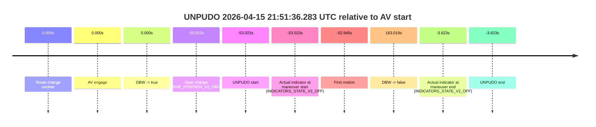
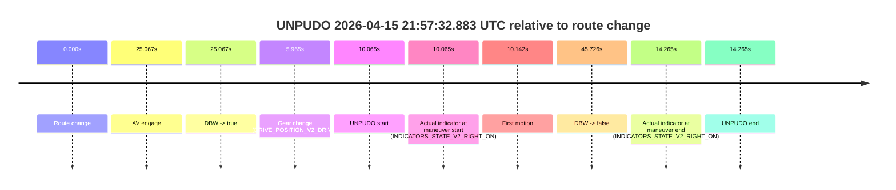
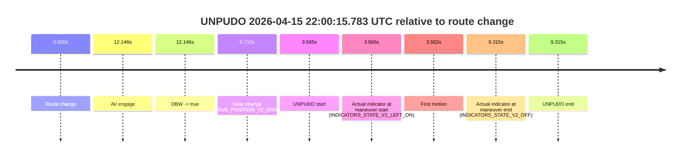

# Run Report: fme20002/2026-04-15--21-30-04--gen2-av-f2fd25df-73bb-4166-a115-72df9f0ca2ed

| Field | Value |
|---|---|
| Run ID | `fme20002/2026-04-15--21-30-04--gen2-av-f2fd25df-73bb-4166-a115-72df9f0ca2ed` |
| Date | `2026-04-15` |
| Model(s) | `plum-timeless-beaver` |
| Author | `peng.tang` |
| Event count | `4` |

## unpudo 2026-04-15 21:41:16.233 UTC

| Field | Value |
|---|---|
| Model | `plum-timeless-beaver` |
| Author | `peng.tang` |
| Run ID | `fme20002/2026-04-15--21-30-04--gen2-av-f2fd25df-73bb-4166-a115-72df9f0ca2ed` |
| Date | `2026-04-15` |
| Time (UTC) | `21:41:16.233` |
| Event type | `unpudo` |
| Disengagement type | `failed_to_unpudo` |
| Route change | `found` |
| Console | [run](https://console.sso.wayve.ai/run/fme20002/2026-04-15--21-30-04--gen2-av-f2fd25df-73bb-4166-a115-72df9f0ca2ed?id=&time-unixus=1776289276233302) |
| Foxglove | [segment](https://app.foxglove.dev/wayve-on-prem/p/prj_0dX18KZdVHg1fmmI/view?ds=foxglove-stream&ds.deviceName=fme20002&ds.start=2026-04-15T21%3A40%3A25.768287Z&ds.end=2026-04-15T21%3A44%3A39.664665Z&layoutId=lay_0e7VD4WIKDQGU73Y&time=2026-04-15T21%3A41%3A16.233302Z) |

### Event card: non-av

- Non-AV: there is no AV-owned portion anywhere inside the detected unpudo timeline, so it is kept for coverage but excluded from model success / failure scoring.

| Event | Time (UTC) | Delta from route change |
|---|---:|---:|
| Route change | 2026-04-15 21:40:35.768 | `0.000s` |
| AV engage | 2026-04-15 21:41:24.564 | `48.796s` |
| DBW -> true | 2026-04-15 21:41:24.564 | `48.796s` |
| Gear change (DRIVE_POSITION_V2_DRIVE) | 2026-04-15 21:40:38.683 | `2.915s` |
| UNPUDO start | 2026-04-15 21:41:16.233 | `40.465s` |
| Actual indicator at maneuver start (INDICATORS_STATE_V2_RIGHT_ON) | 2026-04-15 21:41:16.233 | `40.465s` |
| First motion | 2026-04-15 21:41:16.320 | `40.552s` |
| DBW -> false | 2026-04-15 21:44:29.664 | `233.896s` |
| Actual indicator at maneuver end (INDICATORS_STATE_V2_OFF) | 2026-04-15 21:41:21.383 | `45.615s` |
| UNPUDO end | 2026-04-15 21:41:21.383 | `45.615s` |

| Metric | Value |
|---|---|
| Outcome | `non-av` |
| Effective failure type | `none` |
| Route change status | `found` |
| DBW at event start | `false` |
| DBW at event end | `false` |
| Predicted gear at AV start | `DRIVE_POSITION_V2_DRIVE` |
| Actual gear at AV start | `DRIVE_POSITION_V2_DRIVE` |
| Predicted gear at event start | `DRIVE_POSITION_V2_DRIVE` |
| Actual gear at event start | `DRIVE_POSITION_V2_DRIVE` |
| Planned indicator direction | `INDICATORS_STATE_V2_RIGHT_ON` |
| Controller indicator direction | `INDICATORS_STATE_V2_RIGHT_ON` |
| Actual indicator direction | `INDICATORS_STATE_V2_RIGHT_ON` |
| Actual indicator at maneuver end | `INDICATORS_STATE_V2_OFF` |
| Driver accel help in AV | `false` |
| Driver accel help timestamp | `n/a` |
| Max accel pedal pct in AV | `0.0%` |
| Max brake pedal pct in AV | `0.0%` |
| Max speed mps in AV | `0.000` |
| Route -> AV | `48.796s` |
| AV -> event start | `-8.331s` |
| AV -> first motion | `-8.244s` |
| AV duration before disengagement | `185.100s` |
| Trajectory waypoint count | `35` |
| Driving-plan step count | `11` |

The scored portion starts from the AV-owned window, not from the pre-AV setup. Route-change search in the stopped pre-event segment was `found`, with the baseline therefore set to route change. At the event anchor the model predicts `DRIVE_POSITION_V2_DRIVE` and the actual gear is `DRIVE_POSITION_V2_DRIVE`. The effective model outcome is `non-av` because `there is no AV-owned overlap inside the event timeline`.

### Resolution

| Field | Value |
|---|---|
| Final outcome | `non-av` |
| Do we agree with this label? | `yes` |
| Source disengagement type | `failed_to_unpudo` |
| Resolved effective failure type | `none` |
| Confidence | `high` |

## unpudo 2026-04-15 21:51:36.283 UTC

| Field | Value |
|---|---|
| Model | `plum-timeless-beaver` |
| Author | `peng.tang` |
| Run ID | `fme20002/2026-04-15--21-30-04--gen2-av-f2fd25df-73bb-4166-a115-72df9f0ca2ed` |
| Date | `2026-04-15` |
| Time (UTC) | `21:51:36.283` |
| Event type | `unpudo` |
| Disengagement type | `none observed` |
| Route change | `unclear` |
| Console | [run](https://console.sso.wayve.ai/run/fme20002/2026-04-15--21-30-04--gen2-av-f2fd25df-73bb-4166-a115-72df9f0ca2ed?id=&time-unixus=1776289896283304) |
| Foxglove | [segment](https://app.foxglove.dev/wayve-on-prem/p/prj_0dX18KZdVHg1fmmI/view?ds=foxglove-stream&ds.deviceName=fme20002&ds.start=2026-04-15T21%3A51%3A23.483300Z&ds.end=2026-04-15T21%3A55%3A22.325232Z&layoutId=lay_0e7VD4WIKDQGU73Y&time=2026-04-15T21%3A51%3A36.283304Z) |

### Event card: non-av

- Non-AV: there is no AV-owned portion anywhere inside the detected unpudo timeline, so it is kept for coverage but excluded from model success / failure scoring.

| Event | Time (UTC) | Delta from AV start |
|---|---:|---:|
| Route change unclear | 2026-04-15 21:52:29.305 | `0.000s` |
| AV engage | 2026-04-15 21:52:29.305 | `0.000s` |
| DBW -> true | 2026-04-15 21:52:29.305 | `0.000s` |
| Gear change (DRIVE_POSITION_V2_DRIVE) | 2026-04-15 21:51:33.483 | `-55.823s` |
| UNPUDO start | 2026-04-15 21:51:36.283 | `-53.023s` |
| Actual indicator at maneuver start (INDICATORS_STATE_V2_OFF) | 2026-04-15 21:51:36.283 | `-53.023s` |
| First motion | 2026-04-15 21:51:36.360 | `-52.945s` |
| DBW -> false | 2026-04-15 21:55:12.325 | `163.019s` |
| Actual indicator at maneuver end (INDICATORS_STATE_V2_OFF) | 2026-04-15 21:52:25.683 | `-3.623s` |
| UNPUDO end | 2026-04-15 21:52:25.683 | `-3.623s` |

| Metric | Value |
|---|---|
| Outcome | `non-av` |
| Effective failure type | `none` |
| Route change status | `unclear` |
| DBW at event start | `false` |
| DBW at event end | `false` |
| Predicted gear at AV start | `DRIVE_POSITION_V2_DRIVE` |
| Actual gear at AV start | `DRIVE_POSITION_V2_DRIVE` |
| Predicted gear at event start | `DRIVE_POSITION_V2_DRIVE` |
| Actual gear at event start | `DRIVE_POSITION_V2_DRIVE` |
| Planned indicator direction | `INDICATORS_STATE_V2_OFF` |
| Controller indicator direction | `INDICATORS_STATE_V2_OFF` |
| Actual indicator direction | `INDICATORS_STATE_V2_OFF` |
| Actual indicator at maneuver end | `INDICATORS_STATE_V2_OFF` |
| Driver accel help in AV | `false` |
| Driver accel help timestamp | `n/a` |
| Max accel pedal pct in AV | `0.0%` |
| Max brake pedal pct in AV | `0.0%` |
| Max speed mps in AV | `0.000` |
| Route -> AV | `n/a` |
| AV -> event start | `-53.023s` |
| AV -> first motion | `-52.945s` |
| AV duration before disengagement | `163.019s` |
| Trajectory waypoint count | `36` |
| Driving-plan step count | `11` |

The scored portion starts from the AV-owned window, not from the pre-AV setup. Route-change search in the stopped pre-event segment was `unclear`, with the baseline therefore set to AV start. At the event anchor the model predicts `DRIVE_POSITION_V2_DRIVE` and the actual gear is `DRIVE_POSITION_V2_DRIVE`. The effective model outcome is `non-av` because `there is no AV-owned overlap inside the event timeline`.

### Resolution

| Field | Value |
|---|---|
| Final outcome | `non-av` |
| Do we agree with this label? | `yes` |
| Source disengagement type | `none observed` |
| Resolved effective failure type | `none` |
| Confidence | `medium` |

## unpudo 2026-04-15 21:57:32.883 UTC

| Field | Value |
|---|---|
| Model | `plum-timeless-beaver` |
| Author | `peng.tang` |
| Run ID | `fme20002/2026-04-15--21-30-04--gen2-av-f2fd25df-73bb-4166-a115-72df9f0ca2ed` |
| Date | `2026-04-15` |
| Time (UTC) | `21:57:32.883` |
| Event type | `unpudo` |
| Disengagement type | `none observed` |
| Route change | `found` |
| Console | [run](https://console.sso.wayve.ai/run/fme20002/2026-04-15--21-30-04--gen2-av-f2fd25df-73bb-4166-a115-72df9f0ca2ed?id=&time-unixus=1776290252883311) |
| Foxglove | [segment](https://app.foxglove.dev/wayve-on-prem/p/prj_0dX18KZdVHg1fmmI/view?ds=foxglove-stream&ds.deviceName=fme20002&ds.start=2026-04-15T21%3A57%3A12.818287Z&ds.end=2026-04-15T21%3A58%3A18.544727Z&layoutId=lay_0e7VD4WIKDQGU73Y&time=2026-04-15T21%3A57%3A32.883311Z) |

### Event card: non-av

- Non-AV: there is no AV-owned portion anywhere inside the detected unpudo timeline, so it is kept for coverage but excluded from model success / failure scoring.

| Event | Time (UTC) | Delta from route change |
|---|---:|---:|
| Route change | 2026-04-15 21:57:22.818 | `0.000s` |
| AV engage | 2026-04-15 21:57:47.885 | `25.067s` |
| DBW -> true | 2026-04-15 21:57:47.885 | `25.067s` |
| Gear change (DRIVE_POSITION_V2_DRIVE) | 2026-04-15 21:57:28.783 | `5.965s` |
| UNPUDO start | 2026-04-15 21:57:32.883 | `10.065s` |
| Actual indicator at maneuver start (INDICATORS_STATE_V2_RIGHT_ON) | 2026-04-15 21:57:32.883 | `10.065s` |
| First motion | 2026-04-15 21:57:32.959 | `10.142s` |
| DBW -> false | 2026-04-15 21:58:08.544 | `45.726s` |
| Actual indicator at maneuver end (INDICATORS_STATE_V2_RIGHT_ON) | 2026-04-15 21:57:37.083 | `14.265s` |
| UNPUDO end | 2026-04-15 21:57:37.083 | `14.265s` |

| Metric | Value |
|---|---|
| Outcome | `non-av` |
| Effective failure type | `none` |
| Route change status | `found` |
| DBW at event start | `false` |
| DBW at event end | `false` |
| Predicted gear at AV start | `DRIVE_POSITION_V2_DRIVE` |
| Actual gear at AV start | `DRIVE_POSITION_V2_DRIVE` |
| Predicted gear at event start | `DRIVE_POSITION_V2_DRIVE` |
| Actual gear at event start | `DRIVE_POSITION_V2_DRIVE` |
| Planned indicator direction | `INDICATORS_STATE_V2_RIGHT_ON` |
| Controller indicator direction | `INDICATORS_STATE_V2_RIGHT_ON` |
| Actual indicator direction | `INDICATORS_STATE_V2_RIGHT_ON` |
| Actual indicator at maneuver end | `INDICATORS_STATE_V2_RIGHT_ON` |
| Driver accel help in AV | `false` |
| Driver accel help timestamp | `n/a` |
| Max accel pedal pct in AV | `0.0%` |
| Max brake pedal pct in AV | `0.0%` |
| Max speed mps in AV | `0.000` |
| Route -> AV | `25.067s` |
| AV -> event start | `-15.002s` |
| AV -> first motion | `-14.926s` |
| AV duration before disengagement | `20.659s` |
| Trajectory waypoint count | `36` |
| Driving-plan step count | `11` |

The scored portion starts from the AV-owned window, not from the pre-AV setup. Route-change search in the stopped pre-event segment was `found`, with the baseline therefore set to route change. At the event anchor the model predicts `DRIVE_POSITION_V2_DRIVE` and the actual gear is `DRIVE_POSITION_V2_DRIVE`. The effective model outcome is `non-av` because `there is no AV-owned overlap inside the event timeline`.

### Resolution

| Field | Value |
|---|---|
| Final outcome | `non-av` |
| Do we agree with this label? | `yes` |
| Source disengagement type | `none observed` |
| Resolved effective failure type | `none` |
| Confidence | `high` |

## unpudo 2026-04-15 22:00:15.783 UTC

| Field | Value |
|---|---|
| Model | `plum-timeless-beaver` |
| Author | `peng.tang` |
| Run ID | `fme20002/2026-04-15--21-30-04--gen2-av-f2fd25df-73bb-4166-a115-72df9f0ca2ed` |
| Date | `2026-04-15` |
| Time (UTC) | `22:00:15.783` |
| Event type | `unpudo` |
| Disengagement type | `none observed` |
| Route change | `found` |
| Console | [run](https://console.sso.wayve.ai/run/fme20002/2026-04-15--21-30-04--gen2-av-f2fd25df-73bb-4166-a115-72df9f0ca2ed?id=&time-unixus=1776290415783311) |
| Foxglove | [segment](https://app.foxglove.dev/wayve-on-prem/p/prj_0dX18KZdVHg1fmmI/view?ds=foxglove-stream&ds.deviceName=fme20002&ds.start=2026-04-15T22%3A00%3A02.218267Z&ds.end=2026-04-15T22%3A00%3A31.533303Z&layoutId=lay_0e7VD4WIKDQGU73Y&time=2026-04-15T22%3A00%3A15.783311Z) |

### Event card: non-av

- Non-AV: there is no AV-owned portion anywhere inside the detected unpudo timeline, so it is kept for coverage but excluded from model success / failure scoring.

| Event | Time (UTC) | Delta from route change |
|---|---:|---:|
| Route change | 2026-04-15 22:00:12.218 | `0.000s` |
| AV engage | 2026-04-15 22:00:24.364 | `12.146s` |
| DBW -> true | 2026-04-15 22:00:24.364 | `12.146s` |
| Gear change (DRIVE_POSITION_V2_DRIVE) | 2026-04-15 22:00:12.933 | `0.715s` |
| UNPUDO start | 2026-04-15 22:00:15.783 | `3.565s` |
| Actual indicator at maneuver start (INDICATORS_STATE_V2_LEFT_ON) | 2026-04-15 22:00:15.783 | `3.565s` |
| First motion | 2026-04-15 22:00:15.800 | `3.582s` |
| Actual indicator at maneuver end (INDICATORS_STATE_V2_OFF) | 2026-04-15 22:00:21.533 | `9.315s` |
| UNPUDO end | 2026-04-15 22:00:21.533 | `9.315s` |

| Metric | Value |
|---|---|
| Outcome | `non-av` |
| Effective failure type | `none` |
| Route change status | `found` |
| DBW at event start | `false` |
| DBW at event end | `false` |
| Predicted gear at AV start | `DRIVE_POSITION_V2_DRIVE` |
| Actual gear at AV start | `DRIVE_POSITION_V2_DRIVE` |
| Predicted gear at event start | `DRIVE_POSITION_V2_DRIVE` |
| Actual gear at event start | `DRIVE_POSITION_V2_DRIVE` |
| Planned indicator direction | `INDICATORS_STATE_V2_LEFT_ON` |
| Controller indicator direction | `INDICATORS_STATE_V2_LEFT_ON` |
| Actual indicator direction | `INDICATORS_STATE_V2_LEFT_ON` |
| Actual indicator at maneuver end | `INDICATORS_STATE_V2_OFF` |
| Driver accel help in AV | `false` |
| Driver accel help timestamp | `n/a` |
| Max accel pedal pct in AV | `0.0%` |
| Max brake pedal pct in AV | `0.0%` |
| Max speed mps in AV | `0.000` |
| Route -> AV | `12.146s` |
| AV -> event start | `-8.581s` |
| AV -> first motion | `-8.565s` |
| AV duration before disengagement | `n/a` |
| Trajectory waypoint count | `36` |
| Driving-plan step count | `11` |

The scored portion starts from the AV-owned window, not from the pre-AV setup. Route-change search in the stopped pre-event segment was `found`, with the baseline therefore set to route change. At the event anchor the model predicts `DRIVE_POSITION_V2_DRIVE` and the actual gear is `DRIVE_POSITION_V2_DRIVE`. The effective model outcome is `non-av` because `there is no AV-owned overlap inside the event timeline`.

### Resolution

| Field | Value |
|---|---|
| Final outcome | `non-av` |
| Do we agree with this label? | `yes` |
| Source disengagement type | `none observed` |
| Resolved effective failure type | `none` |
| Confidence | `high` |
