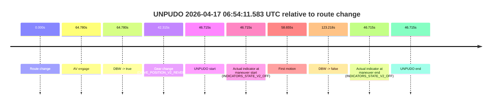
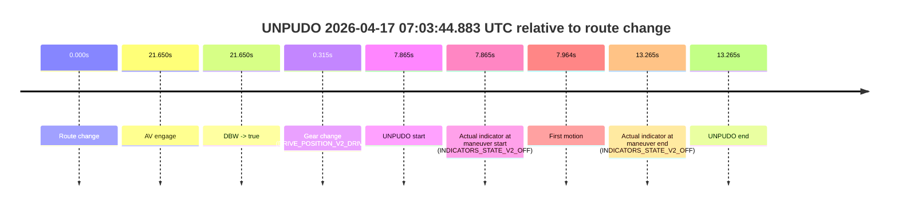

# Run Report: fme20002/2026-04-17--06-42-40--gen2-av-85199209-2a4d-4ee4-bf62-57f103c5995e

| Field | Value |
|---|---|
| Run ID | `fme20002/2026-04-17--06-42-40--gen2-av-85199209-2a4d-4ee4-bf62-57f103c5995e` |
| Date | `2026-04-17` |
| Model(s) | `pink-manta-ray-smooth` |
| Author | `guy.geva` |
| Event count | `2` |

## unpudo 2026-04-17 06:54:11.583 UTC

| Field | Value |
|---|---|
| Model | `pink-manta-ray-smooth` |
| Author | `guy.geva` |
| Run ID | `fme20002/2026-04-17--06-42-40--gen2-av-85199209-2a4d-4ee4-bf62-57f103c5995e` |
| Date | `2026-04-17` |
| Time (UTC) | `06:54:11.583` |
| Event type | `unpudo` |
| Disengagement type | `none observed` |
| Route change | `found` |
| Console | [run](https://console.sso.wayve.ai/run/fme20002/2026-04-17--06-42-40--gen2-av-85199209-2a4d-4ee4-bf62-57f103c5995e?id=&time-unixus=1776408851583296) |
| Foxglove | [segment](https://app.foxglove.dev/wayve-on-prem/p/prj_0dX18KZdVHg1fmmI/view?ds=foxglove-stream&ds.deviceName=fme20002&ds.start=2026-04-17T06%3A53%3A14.868259Z&ds.end=2026-04-17T06%3A55%3A38.086728Z&layoutId=lay_0e7VD4WIKDQGU73Y&time=2026-04-17T06%3A54%3A11.583296Z) |

### Event card: accidental

- Accidental: AV ownership is present for less than `2s`, so this is treated as an accidental brush with the maneuver rather than a meaningful model attempt.

| Event | Time (UTC) | Delta from route change |
|---|---:|---:|
| Route change | 2026-04-17 06:53:24.868 | `0.000s` |
| AV engage | 2026-04-17 06:54:29.648 | `64.780s` |
| DBW -> true | 2026-04-17 06:54:29.648 | `64.780s` |
| Gear change (DRIVE_POSITION_V2_REVERSE) | 2026-04-17 06:54:07.183 | `42.315s` |
| UNPUDO start | 2026-04-17 06:54:11.583 | `46.715s` |
| Actual indicator at maneuver start (INDICATORS_STATE_V2_OFF) | 2026-04-17 06:54:11.583 | `46.715s` |
| First motion | 2026-04-17 06:54:23.523 | `58.655s` |
| DBW -> false | 2026-04-17 06:55:28.086 | `123.218s` |
| Actual indicator at maneuver end (INDICATORS_STATE_V2_OFF) | 2026-04-17 06:54:11.583 | `46.715s` |
| UNPUDO end | 2026-04-17 06:54:11.583 | `46.715s` |

| Metric | Value |
|---|---|
| Outcome | `accidental` |
| Effective failure type | `none` |
| Route change status | `found` |
| DBW at event start | `false` |
| DBW at event end | `false` |
| Predicted gear at AV start | `DRIVE_POSITION_V2_DRIVE` |
| Actual gear at AV start | `DRIVE_POSITION_V2_DRIVE` |
| Predicted gear at event start | `DRIVE_POSITION_V2_REVERSE` |
| Actual gear at event start | `DRIVE_POSITION_V2_REVERSE` |
| Planned indicator direction | `INDICATORS_STATE_V2_OFF` |
| Controller indicator direction | `INDICATORS_STATE_V2_OFF` |
| Actual indicator direction | `INDICATORS_STATE_V2_OFF` |
| Actual indicator at maneuver end | `INDICATORS_STATE_V2_OFF` |
| Driver accel help in AV | `false` |
| Driver accel help timestamp | `n/a` |
| Max accel pedal pct in AV | `0.0%` |
| Max brake pedal pct in AV | `0.0%` |
| Max speed mps in AV | `0.000` |
| Route -> AV | `64.780s` |
| AV -> event start | `-18.065s` |
| AV -> first motion | `-6.125s` |
| AV duration before disengagement | `58.439s` |
| Trajectory waypoint count | `36` |
| Driving-plan step count | `11` |

The scored portion starts from the AV-owned window, not from the pre-AV setup. Route-change search in the stopped pre-event segment was `found`, with the baseline therefore set to route change. At the event anchor the model predicts `DRIVE_POSITION_V2_REVERSE` and the actual gear is `DRIVE_POSITION_V2_REVERSE`. The effective model outcome is `accidental` because `the AV-owned portion is shorter than 2s`.

### Resolution

| Field | Value |
|---|---|
| Final outcome | `accidental` |
| Do we agree with this label? | `yes` |
| Source disengagement type | `none observed` |
| Resolved effective failure type | `none` |
| Confidence | `high` |

## unpudo 2026-04-17 07:03:44.883 UTC

| Field | Value |
|---|---|
| Model | `pink-manta-ray-smooth` |
| Author | `guy.geva` |
| Run ID | `fme20002/2026-04-17--06-42-40--gen2-av-85199209-2a4d-4ee4-bf62-57f103c5995e` |
| Date | `2026-04-17` |
| Time (UTC) | `07:03:44.883` |
| Event type | `unpudo` |
| Disengagement type | `failed_to_unpudo` |
| Route change | `found` |
| Console | [run](https://console.sso.wayve.ai/run/fme20002/2026-04-17--06-42-40--gen2-av-85199209-2a4d-4ee4-bf62-57f103c5995e?id=&time-unixus=1776409424883300) |
| Foxglove | [segment](https://app.foxglove.dev/wayve-on-prem/p/prj_0dX18KZdVHg1fmmI/view?ds=foxglove-stream&ds.deviceName=fme20002&ds.start=2026-04-17T07%3A03%3A27.018240Z&ds.end=2026-04-17T07%3A04%3A00.283302Z&layoutId=lay_0e7VD4WIKDQGU73Y&time=2026-04-17T07%3A03%3A44.883300Z) |

### Event card: accidental

- Accidental: AV ownership is present for less than `2s`, so this is treated as an accidental brush with the maneuver rather than a meaningful model attempt.

| Event | Time (UTC) | Delta from route change |
|---|---:|---:|
| Route change | 2026-04-17 07:03:37.018 | `0.000s` |
| AV engage | 2026-04-17 07:03:58.667 | `21.650s` |
| DBW -> true | 2026-04-17 07:03:58.667 | `21.650s` |
| Gear change (DRIVE_POSITION_V2_DRIVE) | 2026-04-17 07:03:37.333 | `0.315s` |
| UNPUDO start | 2026-04-17 07:03:44.883 | `7.865s` |
| Actual indicator at maneuver start (INDICATORS_STATE_V2_OFF) | 2026-04-17 07:03:44.883 | `7.865s` |
| First motion | 2026-04-17 07:03:44.982 | `7.964s` |
| Actual indicator at maneuver end (INDICATORS_STATE_V2_OFF) | 2026-04-17 07:03:50.283 | `13.265s` |
| UNPUDO end | 2026-04-17 07:03:50.283 | `13.265s` |

| Metric | Value |
|---|---|
| Outcome | `accidental` |
| Effective failure type | `none` |
| Route change status | `found` |
| DBW at event start | `false` |
| DBW at event end | `false` |
| Predicted gear at AV start | `DRIVE_POSITION_V2_DRIVE` |
| Actual gear at AV start | `DRIVE_POSITION_V2_DRIVE` |
| Predicted gear at event start | `DRIVE_POSITION_V2_DRIVE` |
| Actual gear at event start | `DRIVE_POSITION_V2_DRIVE` |
| Planned indicator direction | `INDICATORS_STATE_V2_LEFT_ON` |
| Controller indicator direction | `INDICATORS_STATE_V2_LEFT_ON` |
| Actual indicator direction | `INDICATORS_STATE_V2_OFF` |
| Actual indicator at maneuver end | `INDICATORS_STATE_V2_OFF` |
| Driver accel help in AV | `false` |
| Driver accel help timestamp | `n/a` |
| Max accel pedal pct in AV | `0.0%` |
| Max brake pedal pct in AV | `0.0%` |
| Max speed mps in AV | `0.000` |
| Route -> AV | `21.650s` |
| AV -> event start | `-13.785s` |
| AV -> first motion | `-13.685s` |
| AV duration before disengagement | `n/a` |
| Trajectory waypoint count | `36` |
| Driving-plan step count | `11` |

The scored portion starts from the AV-owned window, not from the pre-AV setup. Route-change search in the stopped pre-event segment was `found`, with the baseline therefore set to route change. At the event anchor the model predicts `DRIVE_POSITION_V2_DRIVE` and the actual gear is `DRIVE_POSITION_V2_DRIVE`. The effective model outcome is `accidental` because `the AV-owned portion is shorter than 2s`.

### Resolution

| Field | Value |
|---|---|
| Final outcome | `accidental` |
| Do we agree with this label? | `yes` |
| Source disengagement type | `failed_to_unpudo` |
| Resolved effective failure type | `none` |
| Confidence | `high` |
