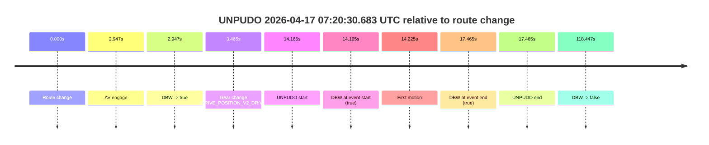
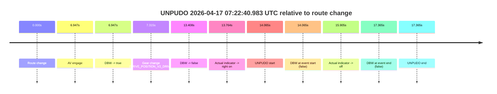
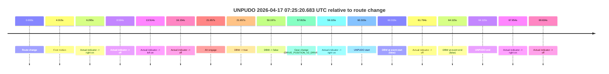
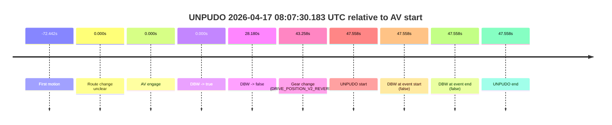
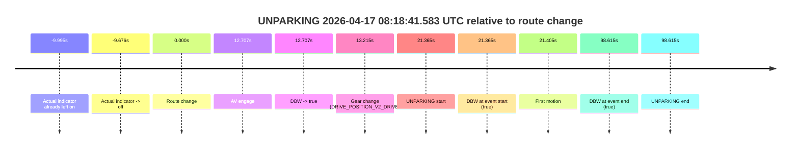

# Run Report: fme20002/2026-04-17--07-06-38--gen2-av-3bef8d86-b9d2-4e05-8cb5-d3d84412b357

| Field | Value |
|---|---|
| Run ID | `fme20002/2026-04-17--07-06-38--gen2-av-3bef8d86-b9d2-4e05-8cb5-d3d84412b357` |
| Date | `2026-04-17` |
| Model(s) | `pink-manta-ray-smooth` |
| Author | `guy.geva` |
| Event count | `6` |

## unpudo 2026-04-17 07:20:30.683 UTC

| Field | Value |
|---|---|
| Model | `pink-manta-ray-smooth` |
| Author | `guy.geva` |
| Run ID | `fme20002/2026-04-17--07-06-38--gen2-av-3bef8d86-b9d2-4e05-8cb5-d3d84412b357` |
| Date | `2026-04-17` |
| Time (UTC) | `07:20:30.683` |
| Event type | `unpudo` |
| Disengagement type | `none observed` |
| Route change | `found` |
| Console | [run](https://console.sso.wayve.ai/run/fme20002/2026-04-17--07-06-38--gen2-av-3bef8d86-b9d2-4e05-8cb5-d3d84412b357?id=&time-unixus=1776410430683307) |
| Foxglove | [segment](https://app.foxglove.dev/wayve-on-prem/p/prj_0dX18KZdVHg1fmmI/view?ds=foxglove-stream&ds.deviceName=fme20002&ds.start=2026-04-17T07%3A20%3A06.518291Z&ds.end=2026-04-17T07%3A22%3A24.965254Z&layoutId=lay_0e7VD4WIKDQGU73Y&time=2026-04-17T07%3A20%3A30.683307Z) |

### Event card: pass

- Pass: AV owns the credited unpudo from route change through the official unpudo window, the gear state is aligned at the anchor, and the vehicle moves without driver accelerator help in AV.

| Event | Time (UTC) | Delta from route change |
|---|---:|---:|
| Route change | 2026-04-17 07:20:16.518 | `0.000s` |
| AV engage | 2026-04-17 07:20:19.465 | `2.947s` |
| DBW -> true | 2026-04-17 07:20:19.465 | `2.947s` |
| Gear change (DRIVE_POSITION_V2_DRIVE) | 2026-04-17 07:20:19.983 | `3.465s` |
| UNPUDO start | 2026-04-17 07:20:30.683 | `14.165s` |
| DBW at event start (true) | 2026-04-17 07:20:30.683 | `14.165s` |
| First motion | 2026-04-17 07:20:30.743 | `14.225s` |
| DBW at event end (true) | 2026-04-17 07:20:33.983 | `17.465s` |
| UNPUDO end | 2026-04-17 07:20:33.983 | `17.465s` |
| DBW -> false | 2026-04-17 07:22:14.965 | `118.447s` |

| Metric | Value |
|---|---|
| Outcome | `pass` |
| Effective failure type | `none` |
| Route change status | `found` |
| DBW at event start | `true` |
| DBW at event end | `true` |
| Predicted gear at AV start | `DRIVE_POSITION_V2_DRIVE` |
| Actual gear at AV start | `DRIVE_POSITION_V2_PARK` |
| Predicted gear at event start | `DRIVE_POSITION_V2_DRIVE` |
| Actual gear at event start | `DRIVE_POSITION_V2_DRIVE` |
| Planned indicator direction | `INDICATORS_STATE_V2_RIGHT_ON` |
| Controller indicator direction | `INDICATORS_STATE_V2_RIGHT_ON` |
| Actual indicator direction | `INDICATORS_STATE_V2_OFF` |
| Actual indicator at maneuver end | `INDICATORS_STATE_V2_OFF` |
| Driver accel help in AV | `false` |
| Driver accel help timestamp | `n/a` |
| Max accel pedal pct in AV | `0.0%` |
| Max brake pedal pct in AV | `8.0%` |
| Max speed mps in AV | `4.978` |
| Success timing baseline | `route change` |
| Route -> AV | `2.947s` |
| AV -> event start | `11.218s` |
| AV -> first motion | `11.278s` |
| Success baseline -> event start | `14.165s` |
| Success baseline -> first motion | `14.225s` |
| AV duration before disengagement | `115.500s` |
| Trajectory waypoint count | `36` |
| Driving-plan step count | `11` |

The scored portion starts from the AV-owned window, not from the pre-AV setup. Route-change search in the stopped pre-event segment was `found`, with the baseline therefore set to route change. At the event anchor the model predicts `DRIVE_POSITION_V2_DRIVE` and the actual gear is `DRIVE_POSITION_V2_DRIVE`. The effective model outcome is `pass` because `the credited unpudo stays AV-owned through the official unpudo window.`

### Resolution

| Field | Value |
|---|---|
| Final outcome | `pass` |
| Do we agree with this label? | `yes` |
| Source disengagement type | `none observed` |
| Resolved effective failure type | `none` |
| Confidence | `high` |

## unpudo 2026-04-17 07:22:40.983 UTC

| Field | Value |
|---|---|
| Model | `pink-manta-ray-smooth` |
| Author | `guy.geva` |
| Run ID | `fme20002/2026-04-17--07-06-38--gen2-av-3bef8d86-b9d2-4e05-8cb5-d3d84412b357` |
| Date | `2026-04-17` |
| Time (UTC) | `07:22:40.983` |
| Event type | `unpudo` |
| Disengagement type | `failed_to_unpudo` |
| Route change | `found` |
| Console | [run](https://console.sso.wayve.ai/run/fme20002/2026-04-17--07-06-38--gen2-av-3bef8d86-b9d2-4e05-8cb5-d3d84412b357?id=&time-unixus=1776410560983314) |
| Foxglove | [segment](https://app.foxglove.dev/wayve-on-prem/p/prj_0dX18KZdVHg1fmmI/view?ds=foxglove-stream&ds.deviceName=fme20002&ds.start=2026-04-17T07%3A22%3A16.918271Z&ds.end=2026-04-17T07%3A22%3A54.283314Z&layoutId=lay_0e7VD4WIKDQGU73Y&time=2026-04-17T07%3A22%3A40.983314Z) |

### Event card: fail

- Fail: AV owns part of the segment, but the event still resolves as a model-performance failure under the AV-only scoring rule.

| Event | Time (UTC) | Delta from route change |
|---|---:|---:|
| Route change | 2026-04-17 07:22:26.918 | `0.000s` |
| AV engage | 2026-04-17 07:22:33.865 | `6.947s` |
| DBW -> true | 2026-04-17 07:22:33.865 | `6.947s` |
| Gear change (DRIVE_POSITION_V2_DRIVE) | 2026-04-17 07:22:34.233 | `7.315s` |
| DBW -> false | 2026-04-17 07:22:40.326 | `13.408s` |
| Actual indicator -> right on | 2026-04-17 07:22:40.682 | `13.764s` |
| UNPUDO start | 2026-04-17 07:22:40.983 | `14.065s` |
| DBW at event start (false) | 2026-04-17 07:22:40.983 | `14.065s` |
| Actual indicator -> off | 2026-04-17 07:22:42.823 | `15.905s` |
| DBW at event end (false) | 2026-04-17 07:22:44.283 | `17.365s` |
| UNPUDO end | 2026-04-17 07:22:44.283 | `17.365s` |

| Metric | Value |
|---|---|
| Outcome | `fail` |
| Effective failure type | `failed_to_unpudo` |
| Route change status | `found` |
| DBW at event start | `false` |
| DBW at event end | `false` |
| Predicted gear at AV start | `DRIVE_POSITION_V2_DRIVE` |
| Actual gear at AV start | `DRIVE_POSITION_V2_PARK` |
| Predicted gear at event start | `DRIVE_POSITION_V2_DRIVE` |
| Actual gear at event start | `DRIVE_POSITION_V2_DRIVE` |
| Planned indicator direction | `INDICATORS_STATE_V2_LEFT_ON` |
| Controller indicator direction | `INDICATORS_STATE_V2_LEFT_ON` |
| Actual indicator direction | `INDICATORS_STATE_V2_RIGHT_ON` |
| Actual indicator at maneuver end | `INDICATORS_STATE_V2_OFF` |
| Driver accel help in AV | `false` |
| Driver accel help timestamp | `n/a` |
| Max accel pedal pct in AV | `0.0%` |
| Max brake pedal pct in AV | `8.0%` |
| Max speed mps in AV | `0.000` |
| Success timing baseline | `route change` |
| Route -> AV | `6.947s` |
| AV -> event start | `7.118s` |
| AV -> first motion | `n/a` |
| Success baseline -> event start | `14.065s` |
| Success baseline -> first motion | `n/a` |
| AV duration before disengagement | `6.461s` |
| Trajectory waypoint count | `36` |
| Driving-plan step count | `11` |

The scored portion starts from the AV-owned window, not from the pre-AV setup. Route-change search in the stopped pre-event segment was `found`, with the baseline therefore set to route change. At the event anchor the model predicts `DRIVE_POSITION_V2_DRIVE` and the actual gear is `DRIVE_POSITION_V2_DRIVE`. The effective model outcome is `fail` because `failed_to_unpudo.`

### Resolution

| Field | Value |
|---|---|
| Final outcome | `fail` |
| Do we agree with this label? | `yes` |
| Source disengagement type | `failed_to_unpudo` |
| Resolved effective failure type | `failed_to_unpudo` |
| Confidence | `high` |

## unpudo 2026-04-17 07:25:20.683 UTC

| Field | Value |
|---|---|
| Model | `pink-manta-ray-smooth` |
| Author | `guy.geva` |
| Run ID | `fme20002/2026-04-17--07-06-38--gen2-av-3bef8d86-b9d2-4e05-8cb5-d3d84412b357` |
| Date | `2026-04-17` |
| Time (UTC) | `07:25:20.683` |
| Event type | `unpudo` |
| Disengagement type | `failed_to_pudo` |
| Route change | `found` |
| Console | [run](https://console.sso.wayve.ai/run/fme20002/2026-04-17--07-06-38--gen2-av-3bef8d86-b9d2-4e05-8cb5-d3d84412b357?id=&time-unixus=1776410720683318) |
| Foxglove | [segment](https://app.foxglove.dev/wayve-on-prem/p/prj_0dX18KZdVHg1fmmI/view?ds=foxglove-stream&ds.deviceName=fme20002&ds.start=2026-04-17T07%3A24%3A10.368283Z&ds.end=2026-04-17T07%3A25%3A34.483293Z&layoutId=lay_0e7VD4WIKDQGU73Y&time=2026-04-17T07%3A25%3A20.683318Z) |

### Event card: fail

- Fail: AV owns part of the segment, but the event still resolves as a model-performance failure under the AV-only scoring rule.

| Event | Time (UTC) | Delta from route change |
|---|---:|---:|
| Route change | 2026-04-17 07:24:20.368 | `0.000s` |
| First motion | 2026-04-17 07:24:24.383 | `4.015s` |
| Actual indicator -> right on | 2026-04-17 07:24:26.663 | `6.295s` |
| Actual indicator -> off | 2026-04-17 07:24:28.962 | `8.594s` |
| Actual indicator -> left on | 2026-04-17 07:24:33.882 | `13.514s` |
| Actual indicator -> off | 2026-04-17 07:24:36.522 | `16.154s` |
| AV engage | 2026-04-17 07:24:42.025 | `21.657s` |
| DBW -> true | 2026-04-17 07:24:42.025 | `21.657s` |
| DBW -> false | 2026-04-17 07:25:10.565 | `50.197s` |
| Gear change (DRIVE_POSITION_V2_DRIVE) | 2026-04-17 07:25:18.183 | `57.815s` |
| Actual indicator -> right on | 2026-04-17 07:25:19.482 | `59.115s` |
| UNPUDO start | 2026-04-17 07:25:20.683 | `60.315s` |
| DBW at event start (false) | 2026-04-17 07:25:20.683 | `60.315s` |
| Actual indicator -> off | 2026-04-17 07:25:22.162 | `61.794s` |
| DBW at event end (false) | 2026-04-17 07:25:24.483 | `64.115s` |
| UNPUDO end | 2026-04-17 07:25:24.483 | `64.115s` |
| Actual indicator -> right on | 2026-04-17 07:25:28.322 | `67.954s` |
| Actual indicator -> off | 2026-04-17 07:25:30.002 | `69.634s` |

| Metric | Value |
|---|---|
| Outcome | `fail` |
| Effective failure type | `failed_to_pudo` |
| Route change status | `found` |
| DBW at event start | `false` |
| DBW at event end | `false` |
| Predicted gear at AV start | `DRIVE_POSITION_V2_DRIVE` |
| Actual gear at AV start | `DRIVE_POSITION_V2_DRIVE` |
| Predicted gear at event start | `DRIVE_POSITION_V2_DRIVE` |
| Actual gear at event start | `DRIVE_POSITION_V2_DRIVE` |
| Planned indicator direction | `INDICATORS_STATE_V2_OFF` |
| Controller indicator direction | `INDICATORS_STATE_V2_OFF` |
| Actual indicator direction | `INDICATORS_STATE_V2_RIGHT_ON` |
| Actual indicator at maneuver end | `INDICATORS_STATE_V2_OFF` |
| Driver accel help in AV | `false` |
| Driver accel help timestamp | `n/a` |
| Max accel pedal pct in AV | `0.0%` |
| Max brake pedal pct in AV | `8.0%` |
| Max speed mps in AV | `7.858` |
| Success timing baseline | `route change` |
| Route -> AV | `21.657s` |
| AV -> event start | `38.658s` |
| AV -> first motion | `-17.642s` |
| Success baseline -> event start | `60.315s` |
| Success baseline -> first motion | `4.015s` |
| AV duration before disengagement | `28.540s` |
| Trajectory waypoint count | `34` |
| Driving-plan step count | `11` |

The scored portion starts from the AV-owned window, not from the pre-AV setup. Route-change search in the stopped pre-event segment was `found`, with the baseline therefore set to route change. At the event anchor the model predicts `DRIVE_POSITION_V2_DRIVE` and the actual gear is `DRIVE_POSITION_V2_DRIVE`. The effective model outcome is `fail` because `failed_to_pudo.`

### Resolution

| Field | Value |
|---|---|
| Final outcome | `fail` |
| Do we agree with this label? | `yes` |
| Source disengagement type | `failed_to_pudo` |
| Resolved effective failure type | `failed_to_pudo` |
| Confidence | `high` |

## unpudo 2026-04-17 08:07:30.183 UTC

| Field | Value |
|---|---|
| Model | `pink-manta-ray-smooth` |
| Author | `guy.geva` |
| Run ID | `fme20002/2026-04-17--07-06-38--gen2-av-3bef8d86-b9d2-4e05-8cb5-d3d84412b357` |
| Date | `2026-04-17` |
| Time (UTC) | `08:07:30.183` |
| Event type | `unpudo` |
| Disengagement type | `none observed` |
| Route change | `unclear` |
| Console | [run](https://console.sso.wayve.ai/run/fme20002/2026-04-17--07-06-38--gen2-av-3bef8d86-b9d2-4e05-8cb5-d3d84412b357?id=&time-unixus=1776413250183320) |
| Foxglove | [segment](https://app.foxglove.dev/wayve-on-prem/p/prj_0dX18KZdVHg1fmmI/view?ds=foxglove-stream&ds.deviceName=fme20002&ds.start=2026-04-17T08%3A06%3A32.625172Z&ds.end=2026-04-17T08%3A07%3A40.183320Z&layoutId=lay_0e7VD4WIKDQGU73Y&time=2026-04-17T08%3A07%3A30.183320Z) |

### Event card: fail

- Fail: the credited unpudo does not stay AV-owned. The event window starts with DBW false, and the maneuver outcome lands outside a clean AV-owned segment.

| Event | Time (UTC) | Delta from AV start |
|---|---:|---:|
| First motion | 2026-04-17 08:05:30.183 | `-72.442s` |
| Route change unclear | 2026-04-17 08:06:42.625 | `0.000s` |
| AV engage | 2026-04-17 08:06:42.625 | `0.000s` |
| DBW -> true | 2026-04-17 08:06:42.625 | `0.000s` |
| DBW -> false | 2026-04-17 08:07:10.805 | `28.180s` |
| Gear change (DRIVE_POSITION_V2_REVERSE) | 2026-04-17 08:07:25.883 | `43.258s` |
| UNPUDO start | 2026-04-17 08:07:30.183 | `47.558s` |
| DBW at event start (false) | 2026-04-17 08:07:30.183 | `47.558s` |
| DBW at event end (false) | 2026-04-17 08:07:30.183 | `47.558s` |
| UNPUDO end | 2026-04-17 08:07:30.183 | `47.558s` |

| Metric | Value |
|---|---|
| Outcome | `fail` |
| Effective failure type | `completed_outside_av` |
| Route change status | `unclear` |
| DBW at event start | `false` |
| DBW at event end | `false` |
| Predicted gear at AV start | `DRIVE_POSITION_V2_DRIVE` |
| Actual gear at AV start | `DRIVE_POSITION_V2_DRIVE` |
| Predicted gear at event start | `DRIVE_POSITION_V2_REVERSE` |
| Actual gear at event start | `DRIVE_POSITION_V2_REVERSE` |
| Planned indicator direction | `INDICATORS_STATE_V2_OFF` |
| Controller indicator direction | `INDICATORS_STATE_V2_OFF` |
| Actual indicator direction | `INDICATORS_STATE_V2_OFF` |
| Actual indicator at maneuver end | `INDICATORS_STATE_V2_OFF` |
| Driver accel help in AV | `false` |
| Driver accel help timestamp | `n/a` |
| Max accel pedal pct in AV | `0.0%` |
| Max brake pedal pct in AV | `8.0%` |
| Max speed mps in AV | `6.872` |
| Success timing baseline | `AV start` |
| Route -> AV | `n/a` |
| AV -> event start | `47.558s` |
| AV -> first motion | `-72.442s` |
| Success baseline -> event start | `47.558s` |
| Success baseline -> first motion | `-72.442s` |
| AV duration before disengagement | `28.180s` |
| Trajectory waypoint count | `36` |
| Driving-plan step count | `11` |

The scored portion starts from the AV-owned window, not from the pre-AV setup. Route-change search in the stopped pre-event segment was `unclear`, with the baseline therefore set to AV start. At the event anchor the model predicts `DRIVE_POSITION_V2_REVERSE` and the actual gear is `DRIVE_POSITION_V2_REVERSE`. The effective model outcome is `fail` because `completed_outside_av.`

### Resolution

| Field | Value |
|---|---|
| Final outcome | `fail` |
| Do we agree with this label? | `yes` |
| Source disengagement type | `none observed` |
| Resolved effective failure type | `completed_outside_av` |
| Confidence | `medium` |

## unpudo 2026-04-17 08:11:02.583 UTC

| Field | Value |
|---|---|
| Model | `pink-manta-ray-smooth` |
| Author | `guy.geva` |
| Run ID | `fme20002/2026-04-17--07-06-38--gen2-av-3bef8d86-b9d2-4e05-8cb5-d3d84412b357` |
| Date | `2026-04-17` |
| Time (UTC) | `08:11:02.583` |
| Event type | `unpudo` |
| Disengagement type | `failed_to_unpudo` |
| Route change | `found` |
| Console | [run](https://console.sso.wayve.ai/run/fme20002/2026-04-17--07-06-38--gen2-av-3bef8d86-b9d2-4e05-8cb5-d3d84412b357?id=&time-unixus=1776413462583304) |
| Foxglove | [segment](https://app.foxglove.dev/wayve-on-prem/p/prj_0dX18KZdVHg1fmmI/view?ds=foxglove-stream&ds.deviceName=fme20002&ds.start=2026-04-17T08%3A09%3A29.418257Z&ds.end=2026-04-17T08%3A11%3A18.433302Z&layoutId=lay_0e7VD4WIKDQGU73Y&time=2026-04-17T08%3A11%3A02.583304Z) |

### Event card: fail

- Fail: AV owns part of the segment, but the event still resolves as a model-performance failure under the AV-only scoring rule.

| Event | Time (UTC) | Delta from route change |
|---|---:|---:|
| Route change | 2026-04-17 08:09:39.418 | `0.000s` |
| AV engage | 2026-04-17 08:10:34.605 | `55.187s` |
| DBW -> true | 2026-04-17 08:10:34.605 | `55.187s` |
| Gear change (DRIVE_POSITION_V2_DRIVE) | 2026-04-17 08:10:35.083 | `55.665s` |
| DBW -> false | 2026-04-17 08:11:01.545 | `82.127s` |
| Actual indicator -> left on | 2026-04-17 08:11:02.122 | `82.704s` |
| UNPUDO start | 2026-04-17 08:11:02.583 | `83.165s` |
| DBW at event start (false) | 2026-04-17 08:11:02.583 | `83.165s` |
| Actual indicator -> off | 2026-04-17 08:11:06.722 | `87.304s` |
| DBW at event end (false) | 2026-04-17 08:11:08.433 | `89.015s` |
| UNPUDO end | 2026-04-17 08:11:08.433 | `89.015s` |

| Metric | Value |
|---|---|
| Outcome | `fail` |
| Effective failure type | `failed_to_unpudo` |
| Route change status | `found` |
| DBW at event start | `false` |
| DBW at event end | `false` |
| Predicted gear at AV start | `DRIVE_POSITION_V2_DRIVE` |
| Actual gear at AV start | `DRIVE_POSITION_V2_PARK` |
| Predicted gear at event start | `DRIVE_POSITION_V2_DRIVE` |
| Actual gear at event start | `DRIVE_POSITION_V2_DRIVE` |
| Planned indicator direction | `INDICATORS_STATE_V2_LEFT_ON` |
| Controller indicator direction | `INDICATORS_STATE_V2_LEFT_ON` |
| Actual indicator direction | `INDICATORS_STATE_V2_LEFT_ON` |
| Actual indicator at maneuver end | `INDICATORS_STATE_V2_OFF` |
| Driver accel help in AV | `false` |
| Driver accel help timestamp | `n/a` |
| Max accel pedal pct in AV | `0.0%` |
| Max brake pedal pct in AV | `9.3%` |
| Max speed mps in AV | `0.000` |
| Success timing baseline | `route change` |
| Route -> AV | `55.187s` |
| AV -> event start | `27.978s` |
| AV -> first motion | `n/a` |
| Success baseline -> event start | `83.165s` |
| Success baseline -> first motion | `n/a` |
| AV duration before disengagement | `26.940s` |
| Trajectory waypoint count | `36` |
| Driving-plan step count | `11` |

The scored portion starts from the AV-owned window, not from the pre-AV setup. Route-change search in the stopped pre-event segment was `found`, with the baseline therefore set to route change. At the event anchor the model predicts `DRIVE_POSITION_V2_DRIVE` and the actual gear is `DRIVE_POSITION_V2_DRIVE`. The effective model outcome is `fail` because `failed_to_unpudo.`

### Resolution

| Field | Value |
|---|---|
| Final outcome | `fail` |
| Do we agree with this label? | `yes` |
| Source disengagement type | `failed_to_unpudo` |
| Resolved effective failure type | `failed_to_unpudo` |
| Confidence | `high` |

## unparking 2026-04-17 08:18:41.583 UTC

| Field | Value |
|---|---|
| Model | `pink-manta-ray-smooth` |
| Author | `guy.geva` |
| Run ID | `fme20002/2026-04-17--07-06-38--gen2-av-3bef8d86-b9d2-4e05-8cb5-d3d84412b357` |
| Date | `2026-04-17` |
| Time (UTC) | `08:18:41.583` |
| Event type | `unparking` |
| Disengagement type | `none observed` |
| Route change | `found` |
| Console | [run](https://console.sso.wayve.ai/run/fme20002/2026-04-17--07-06-38--gen2-av-3bef8d86-b9d2-4e05-8cb5-d3d84412b357?id=&time-unixus=1776413921583312) |
| Foxglove | [segment](https://app.foxglove.dev/wayve-on-prem/p/prj_0dX18KZdVHg1fmmI/view?ds=foxglove-stream&ds.deviceName=fme20002&ds.start=2026-04-17T08%3A18%3A10.218251Z&ds.end=2026-04-17T08%3A20%3A08.833318Z&layoutId=lay_0e7VD4WIKDQGU73Y&time=2026-04-17T08%3A18%3A41.583312Z) |

### Event card: pass

- Pass: AV owns the credited unparking through the official event window, the gear state is aligned at the anchor, and the vehicle moves without driver accelerator help in AV.

| Event | Time (UTC) | Delta from route change |
|---|---:|---:|
| Actual indicator already left on | 2026-04-17 08:18:10.223 | `-9.995s` |
| Actual indicator -> off | 2026-04-17 08:18:10.542 | `-9.676s` |
| Route change | 2026-04-17 08:18:20.218 | `0.000s` |
| AV engage | 2026-04-17 08:18:32.925 | `12.707s` |
| DBW -> true | 2026-04-17 08:18:32.925 | `12.707s` |
| Gear change (DRIVE_POSITION_V2_DRIVE) | 2026-04-17 08:18:33.433 | `13.215s` |
| UNPARKING start | 2026-04-17 08:18:41.583 | `21.365s` |
| DBW at event start (true) | 2026-04-17 08:18:41.583 | `21.365s` |
| First motion | 2026-04-17 08:18:41.623 | `21.405s` |
| DBW at event end (true) | 2026-04-17 08:19:58.833 | `98.615s` |
| UNPARKING end | 2026-04-17 08:19:58.833 | `98.615s` |

| Metric | Value |
|---|---|
| Outcome | `pass` |
| Effective failure type | `none` |
| Route change status | `found` |
| DBW at event start | `true` |
| DBW at event end | `true` |
| Predicted gear at AV start | `DRIVE_POSITION_V2_DRIVE` |
| Actual gear at AV start | `DRIVE_POSITION_V2_PARK` |
| Predicted gear at event start | `DRIVE_POSITION_V2_DRIVE` |
| Actual gear at event start | `DRIVE_POSITION_V2_DRIVE` |
| Planned indicator direction | `INDICATORS_STATE_V2_RIGHT_ON` |
| Controller indicator direction | `INDICATORS_STATE_V2_RIGHT_ON` |
| Actual indicator direction | `INDICATORS_STATE_V2_OFF` |
| Actual indicator at maneuver end | `INDICATORS_STATE_V2_OFF` |
| Driver accel help in AV | `false` |
| Driver accel help timestamp | `n/a` |
| Max accel pedal pct in AV | `0.0%` |
| Max brake pedal pct in AV | `17.9%` |
| Max speed mps in AV | `2.556` |
| Success timing baseline | `route change` |
| Route -> AV | `12.707s` |
| AV -> event start | `8.658s` |
| AV -> first motion | `8.698s` |
| Success baseline -> event start | `21.365s` |
| Success baseline -> first motion | `21.405s` |
| AV duration before disengagement | `n/a` |
| Trajectory waypoint count | `36` |
| Driving-plan step count | `11` |

The scored portion starts from the AV-owned window, not from the pre-AV setup. Route-change search in the stopped pre-event segment was `found`, with the baseline therefore set to route change. At the event anchor the model predicts `DRIVE_POSITION_V2_DRIVE` and the actual gear is `DRIVE_POSITION_V2_DRIVE`. The effective model outcome is `pass` because `the credited maneuver stays AV-owned through the official event end.`

### Resolution

| Field | Value |
|---|---|
| Final outcome | `pass` |
| Do we agree with this label? | `yes` |
| Source disengagement type | `none observed` |
| Resolved effective failure type | `none` |
| Confidence | `high` |
