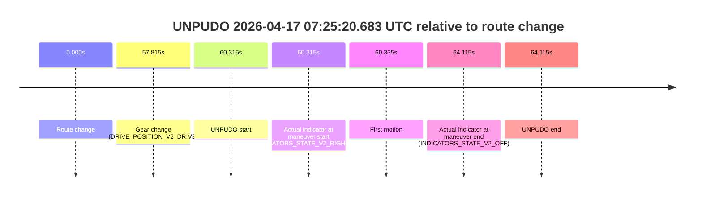
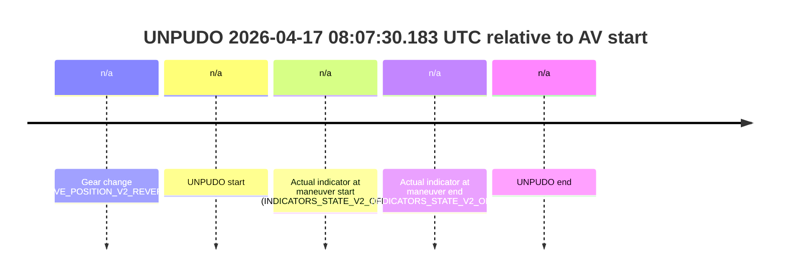
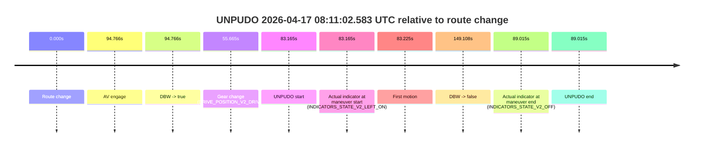
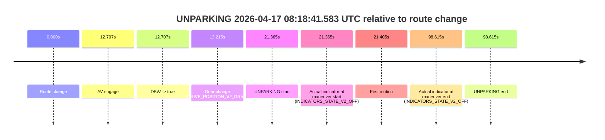

# Run Report: fme20002/2026-04-17--07-06-38--gen2-av-3bef8d86-b9d2-4e05-8cb5-d3d84412b357

| Field | Value |
|---|---|
| Run ID | `fme20002/2026-04-17--07-06-38--gen2-av-3bef8d86-b9d2-4e05-8cb5-d3d84412b357` |
| Date | `2026-04-17` |
| Model(s) | `pink-manta-ray-smooth` |
| Author | `guy.geva` |
| Event count | `6` |

## unpudo 2026-04-17 07:20:30.683 UTC

| Field | Value |
|---|---|
| Model | `pink-manta-ray-smooth` |
| Author | `guy.geva` |
| Run ID | `fme20002/2026-04-17--07-06-38--gen2-av-3bef8d86-b9d2-4e05-8cb5-d3d84412b357` |
| Date | `2026-04-17` |
| Time (UTC) | `07:20:30.683` |
| Event type | `unpudo` |
| Disengagement type | `none observed` |
| Route change | `found` |
| Console | [run](https://console.sso.wayve.ai/run/fme20002/2026-04-17--07-06-38--gen2-av-3bef8d86-b9d2-4e05-8cb5-d3d84412b357?id=&time-unixus=1776410430683307) |
| Foxglove | [segment](https://app.foxglove.dev/wayve-on-prem/p/prj_0dX18KZdVHg1fmmI/view?ds=foxglove-stream&ds.deviceName=fme20002&ds.start=2026-04-17T07%3A20%3A06.518291Z&ds.end=2026-04-17T07%3A22%3A24.965254Z&layoutId=lay_0e7VD4WIKDQGU73Y&time=2026-04-17T07%3A20%3A30.683307Z) |

### Event card: pass

- Pass: AV owns the credited unpudo through the official event window, the gear state is aligned at the anchor, and the vehicle moves without driver accelerator help in AV.

| Event | Time (UTC) | Delta from route change |
|---|---:|---:|
| Route change | 2026-04-17 07:20:16.518 | `0.000s` |
| AV engage | 2026-04-17 07:20:19.465 | `2.947s` |
| DBW -> true | 2026-04-17 07:20:19.465 | `2.947s` |
| Gear change (DRIVE_POSITION_V2_DRIVE) | 2026-04-17 07:20:19.983 | `3.465s` |
| UNPUDO start | 2026-04-17 07:20:30.683 | `14.165s` |
| Actual indicator at maneuver start (INDICATORS_STATE_V2_OFF) | 2026-04-17 07:20:30.683 | `14.165s` |
| First motion | 2026-04-17 07:20:30.743 | `14.225s` |
| DBW -> false | 2026-04-17 07:22:14.965 | `118.447s` |
| Actual indicator at maneuver end (INDICATORS_STATE_V2_OFF) | 2026-04-17 07:20:33.983 | `17.465s` |
| UNPUDO end | 2026-04-17 07:20:33.983 | `17.465s` |

| Metric | Value |
|---|---|
| Outcome | `pass` |
| Effective failure type | `none` |
| Route change status | `found` |
| DBW at event start | `true` |
| DBW at event end | `true` |
| Predicted gear at AV start | `DRIVE_POSITION_V2_DRIVE` |
| Actual gear at AV start | `DRIVE_POSITION_V2_PARK` |
| Predicted gear at event start | `DRIVE_POSITION_V2_DRIVE` |
| Actual gear at event start | `DRIVE_POSITION_V2_DRIVE` |
| Planned indicator direction | `INDICATORS_STATE_V2_RIGHT_ON` |
| Controller indicator direction | `INDICATORS_STATE_V2_RIGHT_ON` |
| Actual indicator direction | `INDICATORS_STATE_V2_OFF` |
| Actual indicator at maneuver end | `INDICATORS_STATE_V2_OFF` |
| Driver accel help in AV | `false` |
| Driver accel help timestamp | `n/a` |
| Max accel pedal pct in AV | `0.0%` |
| Max brake pedal pct in AV | `8.0%` |
| Max speed mps in AV | `4.978` |
| Route -> AV | `2.947s` |
| AV -> event start | `11.218s` |
| AV -> first motion | `11.278s` |
| AV duration before disengagement | `115.500s` |
| Trajectory waypoint count | `36` |
| Driving-plan step count | `11` |

The scored portion starts from the AV-owned window, not from the pre-AV setup. Route-change search in the stopped pre-event segment was `found`, with the baseline therefore set to route change. At the event anchor the model predicts `DRIVE_POSITION_V2_DRIVE` and the actual gear is `DRIVE_POSITION_V2_DRIVE`. The effective model outcome is `pass` because `the credited maneuver stays AV-owned through the official event end`.

### Resolution

| Field | Value |
|---|---|
| Final outcome | `pass` |
| Do we agree with this label? | `yes` |
| Source disengagement type | `none observed` |
| Resolved effective failure type | `none` |
| Confidence | `high` |

## unpudo 2026-04-17 07:22:40.983 UTC

| Field | Value |
|---|---|
| Model | `pink-manta-ray-smooth` |
| Author | `guy.geva` |
| Run ID | `fme20002/2026-04-17--07-06-38--gen2-av-3bef8d86-b9d2-4e05-8cb5-d3d84412b357` |
| Date | `2026-04-17` |
| Time (UTC) | `07:22:40.983` |
| Event type | `unpudo` |
| Disengagement type | `failed_to_unpudo` |
| Route change | `found` |
| Console | [run](https://console.sso.wayve.ai/run/fme20002/2026-04-17--07-06-38--gen2-av-3bef8d86-b9d2-4e05-8cb5-d3d84412b357?id=&time-unixus=1776410560983314) |
| Foxglove | [segment](https://app.foxglove.dev/wayve-on-prem/p/prj_0dX18KZdVHg1fmmI/view?ds=foxglove-stream&ds.deviceName=fme20002&ds.start=2026-04-17T07%3A22%3A16.918271Z&ds.end=2026-04-17T07%3A24%3A36.106424Z&layoutId=lay_0e7VD4WIKDQGU73Y&time=2026-04-17T07%3A22%3A40.983314Z) |

### Event card: accidental

- Accidental: AV ownership is present for less than `2s`, so this is treated as an accidental brush with the maneuver rather than a meaningful model attempt.

| Event | Time (UTC) | Delta from route change |
|---|---:|---:|
| Route change | 2026-04-17 07:22:26.918 | `0.000s` |
| AV engage | 2026-04-17 07:22:46.205 | `19.287s` |
| DBW -> true | 2026-04-17 07:22:46.205 | `19.287s` |
| Gear change (DRIVE_POSITION_V2_DRIVE) | 2026-04-17 07:22:34.233 | `7.315s` |
| UNPUDO start | 2026-04-17 07:22:40.983 | `14.065s` |
| Actual indicator at maneuver start (INDICATORS_STATE_V2_RIGHT_ON) | 2026-04-17 07:22:40.983 | `14.065s` |
| First motion | 2026-04-17 07:22:41.082 | `14.164s` |
| DBW -> false | 2026-04-17 07:24:26.106 | `119.188s` |
| Actual indicator at maneuver end (INDICATORS_STATE_V2_OFF) | 2026-04-17 07:22:44.283 | `17.365s` |
| UNPUDO end | 2026-04-17 07:22:44.283 | `17.365s` |

| Metric | Value |
|---|---|
| Outcome | `accidental` |
| Effective failure type | `none` |
| Route change status | `found` |
| DBW at event start | `false` |
| DBW at event end | `false` |
| Predicted gear at AV start | `DRIVE_POSITION_V2_DRIVE` |
| Actual gear at AV start | `DRIVE_POSITION_V2_DRIVE` |
| Predicted gear at event start | `DRIVE_POSITION_V2_DRIVE` |
| Actual gear at event start | `DRIVE_POSITION_V2_DRIVE` |
| Planned indicator direction | `INDICATORS_STATE_V2_LEFT_ON` |
| Controller indicator direction | `INDICATORS_STATE_V2_LEFT_ON` |
| Actual indicator direction | `INDICATORS_STATE_V2_RIGHT_ON` |
| Actual indicator at maneuver end | `INDICATORS_STATE_V2_OFF` |
| Driver accel help in AV | `false` |
| Driver accel help timestamp | `n/a` |
| Max accel pedal pct in AV | `0.0%` |
| Max brake pedal pct in AV | `0.0%` |
| Max speed mps in AV | `0.000` |
| Route -> AV | `19.287s` |
| AV -> event start | `-5.222s` |
| AV -> first motion | `-5.123s` |
| AV duration before disengagement | `99.901s` |
| Trajectory waypoint count | `36` |
| Driving-plan step count | `11` |

The scored portion starts from the AV-owned window, not from the pre-AV setup. Route-change search in the stopped pre-event segment was `found`, with the baseline therefore set to route change. At the event anchor the model predicts `DRIVE_POSITION_V2_DRIVE` and the actual gear is `DRIVE_POSITION_V2_DRIVE`. The effective model outcome is `accidental` because `the AV-owned portion is shorter than 2s`.

### Resolution

| Field | Value |
|---|---|
| Final outcome | `accidental` |
| Do we agree with this label? | `yes` |
| Source disengagement type | `failed_to_unpudo` |
| Resolved effective failure type | `none` |
| Confidence | `high` |

## unpudo 2026-04-17 07:25:20.683 UTC

| Field | Value |
|---|---|
| Model | `pink-manta-ray-smooth` |
| Author | `guy.geva` |
| Run ID | `fme20002/2026-04-17--07-06-38--gen2-av-3bef8d86-b9d2-4e05-8cb5-d3d84412b357` |
| Date | `2026-04-17` |
| Time (UTC) | `07:25:20.683` |
| Event type | `unpudo` |
| Disengagement type | `failed_to_pudo` |
| Route change | `found` |
| Console | [run](https://console.sso.wayve.ai/run/fme20002/2026-04-17--07-06-38--gen2-av-3bef8d86-b9d2-4e05-8cb5-d3d84412b357?id=&time-unixus=1776410720683318) |
| Foxglove | [segment](https://app.foxglove.dev/wayve-on-prem/p/prj_0dX18KZdVHg1fmmI/view?ds=foxglove-stream&ds.deviceName=fme20002&ds.start=2026-04-17T07%3A24%3A10.368283Z&ds.end=2026-04-17T07%3A25%3A34.483293Z&layoutId=lay_0e7VD4WIKDQGU73Y&time=2026-04-17T07%3A25%3A20.683318Z) |

### Event card: non-av

- Non-AV: the detected unpudo starts outside AV ownership, so it is kept for coverage but excluded from model success / failure scoring.

| Event | Time (UTC) | Delta from route change |
|---|---:|---:|
| Route change | 2026-04-17 07:24:20.368 | `0.000s` |
| Gear change (DRIVE_POSITION_V2_DRIVE) | 2026-04-17 07:25:18.183 | `57.815s` |
| UNPUDO start | 2026-04-17 07:25:20.683 | `60.315s` |
| Actual indicator at maneuver start (INDICATORS_STATE_V2_RIGHT_ON) | 2026-04-17 07:25:20.683 | `60.315s` |
| First motion | 2026-04-17 07:25:20.702 | `60.335s` |
| Actual indicator at maneuver end (INDICATORS_STATE_V2_OFF) | 2026-04-17 07:25:24.483 | `64.115s` |
| UNPUDO end | 2026-04-17 07:25:24.483 | `64.115s` |

| Metric | Value |
|---|---|
| Outcome | `non-av` |
| Effective failure type | `none` |
| Route change status | `found` |
| DBW at event start | `false` |
| DBW at event end | `false` |
| Predicted gear at AV start | `n/a` |
| Actual gear at AV start | `n/a` |
| Predicted gear at event start | `DRIVE_POSITION_V2_DRIVE` |
| Actual gear at event start | `DRIVE_POSITION_V2_DRIVE` |
| Planned indicator direction | `INDICATORS_STATE_V2_OFF` |
| Controller indicator direction | `INDICATORS_STATE_V2_OFF` |
| Actual indicator direction | `INDICATORS_STATE_V2_RIGHT_ON` |
| Actual indicator at maneuver end | `INDICATORS_STATE_V2_OFF` |
| Driver accel help in AV | `false` |
| Driver accel help timestamp | `n/a` |
| Max accel pedal pct in AV | `0.0%` |
| Max brake pedal pct in AV | `0.0%` |
| Max speed mps in AV | `0.000` |
| Route -> AV | `n/a` |
| AV -> event start | `n/a` |
| AV -> first motion | `n/a` |
| AV duration before disengagement | `n/a` |
| Trajectory waypoint count | `34` |
| Driving-plan step count | `11` |

The scored portion starts from the AV-owned window, not from the pre-AV setup. Route-change search in the stopped pre-event segment was `found`, with the baseline therefore set to route change. At the event anchor the model predicts `DRIVE_POSITION_V2_DRIVE` and the actual gear is `DRIVE_POSITION_V2_DRIVE`. The effective model outcome is `non-av` because `the event does not begin in AV ownership`.

### Resolution

| Field | Value |
|---|---|
| Final outcome | `non-av` |
| Do we agree with this label? | `yes` |
| Source disengagement type | `failed_to_pudo` |
| Resolved effective failure type | `none` |
| Confidence | `high` |

## unpudo 2026-04-17 08:07:30.183 UTC

| Field | Value |
|---|---|
| Model | `pink-manta-ray-smooth` |
| Author | `guy.geva` |
| Run ID | `fme20002/2026-04-17--07-06-38--gen2-av-3bef8d86-b9d2-4e05-8cb5-d3d84412b357` |
| Date | `2026-04-17` |
| Time (UTC) | `08:07:30.183` |
| Event type | `unpudo` |
| Disengagement type | `none observed` |
| Route change | `unclear` |
| Console | [run](https://console.sso.wayve.ai/run/fme20002/2026-04-17--07-06-38--gen2-av-3bef8d86-b9d2-4e05-8cb5-d3d84412b357?id=&time-unixus=1776413250183320) |
| Foxglove | [segment](https://app.foxglove.dev/wayve-on-prem/p/prj_0dX18KZdVHg1fmmI/view?ds=foxglove-stream&ds.deviceName=fme20002&ds.start=2026-04-17T08%3A07%3A15.883321Z&ds.end=2026-04-17T08%3A07%3A40.183320Z&layoutId=lay_0e7VD4WIKDQGU73Y&time=2026-04-17T08%3A07%3A30.183320Z) |

### Event card: non-av

- Non-AV: the detected unpudo starts outside AV ownership, so it is kept for coverage but excluded from model success / failure scoring.

| Event | Time (UTC) | Delta from AV start |
|---|---:|---:|
| Gear change (DRIVE_POSITION_V2_REVERSE) | 2026-04-17 08:07:25.883 | `n/a` |
| UNPUDO start | 2026-04-17 08:07:30.183 | `n/a` |
| Actual indicator at maneuver start (INDICATORS_STATE_V2_OFF) | 2026-04-17 08:07:30.183 | `n/a` |
| Actual indicator at maneuver end (INDICATORS_STATE_V2_OFF) | 2026-04-17 08:07:30.183 | `n/a` |
| UNPUDO end | 2026-04-17 08:07:30.183 | `n/a` |

| Metric | Value |
|---|---|
| Outcome | `non-av` |
| Effective failure type | `none` |
| Route change status | `unclear` |
| DBW at event start | `false` |
| DBW at event end | `false` |
| Predicted gear at AV start | `n/a` |
| Actual gear at AV start | `n/a` |
| Predicted gear at event start | `DRIVE_POSITION_V2_REVERSE` |
| Actual gear at event start | `DRIVE_POSITION_V2_REVERSE` |
| Planned indicator direction | `INDICATORS_STATE_V2_OFF` |
| Controller indicator direction | `INDICATORS_STATE_V2_OFF` |
| Actual indicator direction | `INDICATORS_STATE_V2_OFF` |
| Actual indicator at maneuver end | `INDICATORS_STATE_V2_OFF` |
| Driver accel help in AV | `false` |
| Driver accel help timestamp | `n/a` |
| Max accel pedal pct in AV | `0.0%` |
| Max brake pedal pct in AV | `0.0%` |
| Max speed mps in AV | `0.000` |
| Route -> AV | `n/a` |
| AV -> event start | `n/a` |
| AV -> first motion | `n/a` |
| AV duration before disengagement | `n/a` |
| Trajectory waypoint count | `36` |
| Driving-plan step count | `11` |

The scored portion starts from the AV-owned window, not from the pre-AV setup. Route-change search in the stopped pre-event segment was `unclear`, with the baseline therefore set to AV start. At the event anchor the model predicts `DRIVE_POSITION_V2_REVERSE` and the actual gear is `DRIVE_POSITION_V2_REVERSE`. The effective model outcome is `non-av` because `the event does not begin in AV ownership`.

### Resolution

| Field | Value |
|---|---|
| Final outcome | `non-av` |
| Do we agree with this label? | `yes` |
| Source disengagement type | `none observed` |
| Resolved effective failure type | `none` |
| Confidence | `medium` |

## unpudo 2026-04-17 08:11:02.583 UTC

| Field | Value |
|---|---|
| Model | `pink-manta-ray-smooth` |
| Author | `guy.geva` |
| Run ID | `fme20002/2026-04-17--07-06-38--gen2-av-3bef8d86-b9d2-4e05-8cb5-d3d84412b357` |
| Date | `2026-04-17` |
| Time (UTC) | `08:11:02.583` |
| Event type | `unpudo` |
| Disengagement type | `failed_to_unpudo` |
| Route change | `found` |
| Console | [run](https://console.sso.wayve.ai/run/fme20002/2026-04-17--07-06-38--gen2-av-3bef8d86-b9d2-4e05-8cb5-d3d84412b357?id=&time-unixus=1776413462583304) |
| Foxglove | [segment](https://app.foxglove.dev/wayve-on-prem/p/prj_0dX18KZdVHg1fmmI/view?ds=foxglove-stream&ds.deviceName=fme20002&ds.start=2026-04-17T08%3A09%3A29.418257Z&ds.end=2026-04-17T08%3A12%3A18.526001Z&layoutId=lay_0e7VD4WIKDQGU73Y&time=2026-04-17T08%3A11%3A02.583304Z) |

### Event card: accidental

- Accidental: AV ownership is present for less than `2s`, so this is treated as an accidental brush with the maneuver rather than a meaningful model attempt.

| Event | Time (UTC) | Delta from route change |
|---|---:|---:|
| Route change | 2026-04-17 08:09:39.418 | `0.000s` |
| AV engage | 2026-04-17 08:11:14.184 | `94.766s` |
| DBW -> true | 2026-04-17 08:11:14.184 | `94.766s` |
| Gear change (DRIVE_POSITION_V2_DRIVE) | 2026-04-17 08:10:35.083 | `55.665s` |
| UNPUDO start | 2026-04-17 08:11:02.583 | `83.165s` |
| Actual indicator at maneuver start (INDICATORS_STATE_V2_LEFT_ON) | 2026-04-17 08:11:02.583 | `83.165s` |
| First motion | 2026-04-17 08:11:02.643 | `83.225s` |
| DBW -> false | 2026-04-17 08:12:08.526 | `149.108s` |
| Actual indicator at maneuver end (INDICATORS_STATE_V2_OFF) | 2026-04-17 08:11:08.433 | `89.015s` |
| UNPUDO end | 2026-04-17 08:11:08.433 | `89.015s` |

| Metric | Value |
|---|---|
| Outcome | `accidental` |
| Effective failure type | `none` |
| Route change status | `found` |
| DBW at event start | `false` |
| DBW at event end | `false` |
| Predicted gear at AV start | `DRIVE_POSITION_V2_DRIVE` |
| Actual gear at AV start | `DRIVE_POSITION_V2_DRIVE` |
| Predicted gear at event start | `DRIVE_POSITION_V2_DRIVE` |
| Actual gear at event start | `DRIVE_POSITION_V2_DRIVE` |
| Planned indicator direction | `INDICATORS_STATE_V2_LEFT_ON` |
| Controller indicator direction | `INDICATORS_STATE_V2_LEFT_ON` |
| Actual indicator direction | `INDICATORS_STATE_V2_LEFT_ON` |
| Actual indicator at maneuver end | `INDICATORS_STATE_V2_OFF` |
| Driver accel help in AV | `false` |
| Driver accel help timestamp | `n/a` |
| Max accel pedal pct in AV | `0.0%` |
| Max brake pedal pct in AV | `0.0%` |
| Max speed mps in AV | `0.000` |
| Route -> AV | `94.766s` |
| AV -> event start | `-11.601s` |
| AV -> first motion | `-11.541s` |
| AV duration before disengagement | `54.341s` |
| Trajectory waypoint count | `36` |
| Driving-plan step count | `11` |

The scored portion starts from the AV-owned window, not from the pre-AV setup. Route-change search in the stopped pre-event segment was `found`, with the baseline therefore set to route change. At the event anchor the model predicts `DRIVE_POSITION_V2_DRIVE` and the actual gear is `DRIVE_POSITION_V2_DRIVE`. The effective model outcome is `accidental` because `the AV-owned portion is shorter than 2s`.

### Resolution

| Field | Value |
|---|---|
| Final outcome | `accidental` |
| Do we agree with this label? | `yes` |
| Source disengagement type | `failed_to_unpudo` |
| Resolved effective failure type | `none` |
| Confidence | `high` |

## unparking 2026-04-17 08:18:41.583 UTC

| Field | Value |
|---|---|
| Model | `pink-manta-ray-smooth` |
| Author | `guy.geva` |
| Run ID | `fme20002/2026-04-17--07-06-38--gen2-av-3bef8d86-b9d2-4e05-8cb5-d3d84412b357` |
| Date | `2026-04-17` |
| Time (UTC) | `08:18:41.583` |
| Event type | `unparking` |
| Disengagement type | `none observed` |
| Route change | `found` |
| Console | [run](https://console.sso.wayve.ai/run/fme20002/2026-04-17--07-06-38--gen2-av-3bef8d86-b9d2-4e05-8cb5-d3d84412b357?id=&time-unixus=1776413921583312) |
| Foxglove | [segment](https://app.foxglove.dev/wayve-on-prem/p/prj_0dX18KZdVHg1fmmI/view?ds=foxglove-stream&ds.deviceName=fme20002&ds.start=2026-04-17T08%3A18%3A10.218251Z&ds.end=2026-04-17T08%3A20%3A08.833318Z&layoutId=lay_0e7VD4WIKDQGU73Y&time=2026-04-17T08%3A18%3A41.583312Z) |

### Event card: pass

- Pass: AV owns the credited unparking through the official event window, the gear state is aligned at the anchor, and the vehicle moves without driver accelerator help in AV.

| Event | Time (UTC) | Delta from route change |
|---|---:|---:|
| Route change | 2026-04-17 08:18:20.218 | `0.000s` |
| AV engage | 2026-04-17 08:18:32.925 | `12.707s` |
| DBW -> true | 2026-04-17 08:18:32.925 | `12.707s` |
| Gear change (DRIVE_POSITION_V2_DRIVE) | 2026-04-17 08:18:33.433 | `13.215s` |
| UNPARKING start | 2026-04-17 08:18:41.583 | `21.365s` |
| Actual indicator at maneuver start (INDICATORS_STATE_V2_OFF) | 2026-04-17 08:18:41.583 | `21.365s` |
| First motion | 2026-04-17 08:18:41.623 | `21.405s` |
| Actual indicator at maneuver end (INDICATORS_STATE_V2_OFF) | 2026-04-17 08:19:58.833 | `98.615s` |
| UNPARKING end | 2026-04-17 08:19:58.833 | `98.615s` |

| Metric | Value |
|---|---|
| Outcome | `pass` |
| Effective failure type | `none` |
| Route change status | `found` |
| DBW at event start | `true` |
| DBW at event end | `true` |
| Predicted gear at AV start | `DRIVE_POSITION_V2_DRIVE` |
| Actual gear at AV start | `DRIVE_POSITION_V2_PARK` |
| Predicted gear at event start | `DRIVE_POSITION_V2_DRIVE` |
| Actual gear at event start | `DRIVE_POSITION_V2_DRIVE` |
| Planned indicator direction | `INDICATORS_STATE_V2_RIGHT_ON` |
| Controller indicator direction | `INDICATORS_STATE_V2_RIGHT_ON` |
| Actual indicator direction | `INDICATORS_STATE_V2_OFF` |
| Actual indicator at maneuver end | `INDICATORS_STATE_V2_OFF` |
| Driver accel help in AV | `false` |
| Driver accel help timestamp | `n/a` |
| Max accel pedal pct in AV | `0.0%` |
| Max brake pedal pct in AV | `17.9%` |
| Max speed mps in AV | `2.556` |
| Route -> AV | `12.707s` |
| AV -> event start | `8.658s` |
| AV -> first motion | `8.698s` |
| AV duration before disengagement | `n/a` |
| Trajectory waypoint count | `36` |
| Driving-plan step count | `11` |

The scored portion starts from the AV-owned window, not from the pre-AV setup. Route-change search in the stopped pre-event segment was `found`, with the baseline therefore set to route change. At the event anchor the model predicts `DRIVE_POSITION_V2_DRIVE` and the actual gear is `DRIVE_POSITION_V2_DRIVE`. The effective model outcome is `pass` because `the credited maneuver stays AV-owned through the official event end`.

### Resolution

| Field | Value |
|---|---|
| Final outcome | `pass` |
| Do we agree with this label? | `yes` |
| Source disengagement type | `none observed` |
| Resolved effective failure type | `none` |
| Confidence | `high` |
