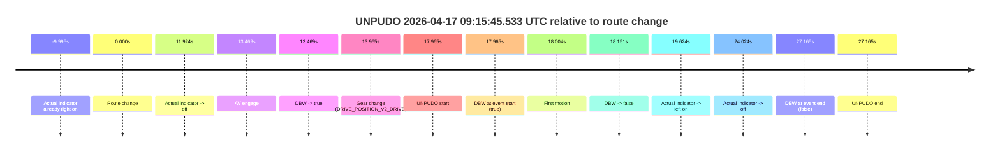
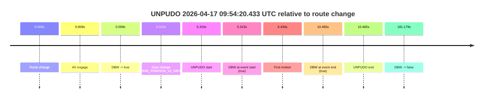
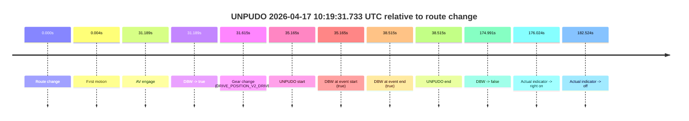
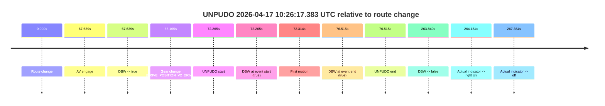
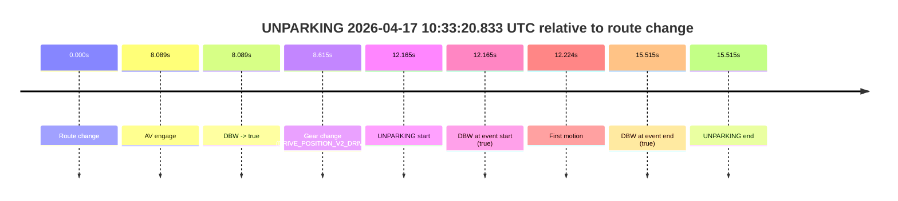

# Run Report: fme20002/2026-04-17--09-05-46--gen2-av-e216eb21-8291-4157-95b0-f2fcd4707472

| Field | Value |
|---|---|
| Run ID | `fme20002/2026-04-17--09-05-46--gen2-av-e216eb21-8291-4157-95b0-f2fcd4707472` |
| Date | `2026-04-17` |
| Model(s) | `eel-teal-outspoken` |
| Author | `zak` |
| Event count | `5` |

## unpudo 2026-04-17 09:15:45.533 UTC

| Field | Value |
|---|---|
| Model | `eel-teal-outspoken` |
| Author | `zak` |
| Run ID | `fme20002/2026-04-17--09-05-46--gen2-av-e216eb21-8291-4157-95b0-f2fcd4707472` |
| Date | `2026-04-17` |
| Time (UTC) | `09:15:45.533` |
| Event type | `unpudo` |
| Disengagement type | `failed_to_remain_stopped` |
| Route change | `found` |
| Console | [run](https://console.sso.wayve.ai/run/fme20002/2026-04-17--09-05-46--gen2-av-e216eb21-8291-4157-95b0-f2fcd4707472?id=&time-unixus=1776417345533298) |
| Foxglove | [segment](https://app.foxglove.dev/wayve-on-prem/p/prj_0dX18KZdVHg1fmmI/view?ds=foxglove-stream&ds.deviceName=fme20002&ds.start=2026-04-17T09%3A15%3A17.568283Z&ds.end=2026-04-17T09%3A16%3A04.733321Z&layoutId=lay_0e7VD4WIKDQGU73Y&time=2026-04-17T09%3A15%3A45.533298Z) |

### Event card: fail

- Fail: AV owns part of the segment, but the event still resolves as a model-performance failure under the AV-only scoring rule.

| Event | Time (UTC) | Delta from route change |
|---|---:|---:|
| Actual indicator already right on | 2026-04-17 09:15:17.573 | `-9.995s` |
| Route change | 2026-04-17 09:15:27.568 | `0.000s` |
| Actual indicator -> off | 2026-04-17 09:15:39.492 | `11.924s` |
| AV engage | 2026-04-17 09:15:41.037 | `13.469s` |
| DBW -> true | 2026-04-17 09:15:41.037 | `13.469s` |
| Gear change (DRIVE_POSITION_V2_DRIVE) | 2026-04-17 09:15:41.533 | `13.965s` |
| UNPUDO start | 2026-04-17 09:15:45.533 | `17.965s` |
| DBW at event start (true) | 2026-04-17 09:15:45.533 | `17.965s` |
| First motion | 2026-04-17 09:15:45.572 | `18.004s` |
| DBW -> false | 2026-04-17 09:15:45.719 | `18.151s` |
| Actual indicator -> left on | 2026-04-17 09:15:47.192 | `19.624s` |
| Actual indicator -> off | 2026-04-17 09:15:51.592 | `24.024s` |
| DBW at event end (false) | 2026-04-17 09:15:54.733 | `27.165s` |
| UNPUDO end | 2026-04-17 09:15:54.733 | `27.165s` |

| Metric | Value |
|---|---|
| Outcome | `fail` |
| Effective failure type | `failed_to_remain_stopped` |
| Route change status | `found` |
| DBW at event start | `true` |
| DBW at event end | `false` |
| Predicted gear at AV start | `DRIVE_POSITION_V2_DRIVE` |
| Actual gear at AV start | `DRIVE_POSITION_V2_PARK` |
| Predicted gear at event start | `DRIVE_POSITION_V2_DRIVE` |
| Actual gear at event start | `DRIVE_POSITION_V2_DRIVE` |
| Planned indicator direction | `INDICATORS_STATE_V2_LEFT_ON` |
| Controller indicator direction | `INDICATORS_STATE_V2_LEFT_ON` |
| Actual indicator direction | `INDICATORS_STATE_V2_OFF` |
| Actual indicator at maneuver end | `INDICATORS_STATE_V2_OFF` |
| Driver accel help in AV | `false` |
| Driver accel help timestamp | `n/a` |
| Max accel pedal pct in AV | `0.0%` |
| Max brake pedal pct in AV | `8.0%` |
| Max speed mps in AV | `0.531` |
| Success timing baseline | `route change` |
| Route -> AV | `13.469s` |
| AV -> event start | `4.496s` |
| AV -> first motion | `4.535s` |
| Success baseline -> event start | `17.965s` |
| Success baseline -> first motion | `18.004s` |
| AV duration before disengagement | `4.682s` |
| Trajectory waypoint count | `37` |
| Driving-plan step count | `11` |

The scored portion starts from the AV-owned window, not from the pre-AV setup. Route-change search in the stopped pre-event segment was `found`, with the baseline therefore set to route change. At the event anchor the model predicts `DRIVE_POSITION_V2_DRIVE` and the actual gear is `DRIVE_POSITION_V2_DRIVE`. The effective model outcome is `fail` because `failed_to_remain_stopped.`

### Resolution

| Field | Value |
|---|---|
| Final outcome | `fail` |
| Do we agree with this label? | `yes` |
| Source disengagement type | `failed_to_remain_stopped` |
| Resolved effective failure type | `failed_to_remain_stopped` |
| Confidence | `high` |

## unpudo 2026-04-17 09:54:20.433 UTC

| Field | Value |
|---|---|
| Model | `eel-teal-outspoken` |
| Author | `zak` |
| Run ID | `fme20002/2026-04-17--09-05-46--gen2-av-e216eb21-8291-4157-95b0-f2fcd4707472` |
| Date | `2026-04-17` |
| Time (UTC) | `09:54:20.433` |
| Event type | `unpudo` |
| Disengagement type | `none observed` |
| Route change | `found` |
| Console | [run](https://console.sso.wayve.ai/run/fme20002/2026-04-17--09-05-46--gen2-av-e216eb21-8291-4157-95b0-f2fcd4707472?id=&time-unixus=1776419660433323) |
| Foxglove | [segment](https://app.foxglove.dev/wayve-on-prem/p/prj_0dX18KZdVHg1fmmI/view?ds=foxglove-stream&ds.deviceName=fme20002&ds.start=2026-04-17T09%3A54%3A05.118240Z&ds.end=2026-04-17T09%3A57%3A26.297321Z&layoutId=lay_0e7VD4WIKDQGU73Y&time=2026-04-17T09%3A54%3A20.433323Z) |

### Event card: pass

- Pass: AV owns the credited unpudo from route change through the official unpudo window, the gear state is aligned at the anchor, and the vehicle moves without driver accelerator help in AV.

| Event | Time (UTC) | Delta from route change |
|---|---:|---:|
| Route change | 2026-04-17 09:54:15.118 | `0.000s` |
| AV engage | 2026-04-17 09:54:15.126 | `0.009s` |
| DBW -> true | 2026-04-17 09:54:15.126 | `0.009s` |
| Gear change (DRIVE_POSITION_V2_DRIVE) | 2026-04-17 09:54:15.433 | `0.315s` |
| UNPUDO start | 2026-04-17 09:54:20.433 | `5.315s` |
| DBW at event start (true) | 2026-04-17 09:54:20.433 | `5.315s` |
| First motion | 2026-04-17 09:54:20.552 | `5.434s` |
| DBW at event end (true) | 2026-04-17 09:54:25.583 | `10.465s` |
| UNPUDO end | 2026-04-17 09:54:25.583 | `10.465s` |
| DBW -> false | 2026-04-17 09:57:16.297 | `181.179s` |

| Metric | Value |
|---|---|
| Outcome | `pass` |
| Effective failure type | `none` |
| Route change status | `found` |
| DBW at event start | `true` |
| DBW at event end | `true` |
| Predicted gear at AV start | `DRIVE_POSITION_V2_PARK` |
| Actual gear at AV start | `DRIVE_POSITION_V2_PARK` |
| Predicted gear at event start | `DRIVE_POSITION_V2_DRIVE` |
| Actual gear at event start | `DRIVE_POSITION_V2_DRIVE` |
| Planned indicator direction | `INDICATORS_STATE_V2_LEFT_ON` |
| Controller indicator direction | `INDICATORS_STATE_V2_LEFT_ON` |
| Actual indicator direction | `INDICATORS_STATE_V2_OFF` |
| Actual indicator at maneuver end | `INDICATORS_STATE_V2_OFF` |
| Driver accel help in AV | `false` |
| Driver accel help timestamp | `n/a` |
| Max accel pedal pct in AV | `0.0%` |
| Max brake pedal pct in AV | `8.0%` |
| Max speed mps in AV | `4.497` |
| Success timing baseline | `route change` |
| Route -> AV | `0.009s` |
| AV -> event start | `5.306s` |
| AV -> first motion | `5.425s` |
| Success baseline -> event start | `5.315s` |
| Success baseline -> first motion | `5.434s` |
| AV duration before disengagement | `181.170s` |
| Trajectory waypoint count | `37` |
| Driving-plan step count | `11` |

The scored portion starts from the AV-owned window, not from the pre-AV setup. Route-change search in the stopped pre-event segment was `found`, with the baseline therefore set to route change. At the event anchor the model predicts `DRIVE_POSITION_V2_DRIVE` and the actual gear is `DRIVE_POSITION_V2_DRIVE`. The effective model outcome is `pass` because `the credited unpudo stays AV-owned through the official unpudo window.`

### Resolution

| Field | Value |
|---|---|
| Final outcome | `pass` |
| Do we agree with this label? | `yes` |
| Source disengagement type | `none observed` |
| Resolved effective failure type | `none` |
| Confidence | `high` |

## unpudo 2026-04-17 10:19:31.733 UTC

| Field | Value |
|---|---|
| Model | `eel-teal-outspoken` |
| Author | `zak` |
| Run ID | `fme20002/2026-04-17--09-05-46--gen2-av-e216eb21-8291-4157-95b0-f2fcd4707472` |
| Date | `2026-04-17` |
| Time (UTC) | `10:19:31.733` |
| Event type | `unpudo` |
| Disengagement type | `none observed` |
| Route change | `found` |
| Console | [run](https://console.sso.wayve.ai/run/fme20002/2026-04-17--09-05-46--gen2-av-e216eb21-8291-4157-95b0-f2fcd4707472?id=&time-unixus=1776421171733298) |
| Foxglove | [segment](https://app.foxglove.dev/wayve-on-prem/p/prj_0dX18KZdVHg1fmmI/view?ds=foxglove-stream&ds.deviceName=fme20002&ds.start=2026-04-17T10%3A18%3A46.568264Z&ds.end=2026-04-17T10%3A22%3A01.559109Z&layoutId=lay_0e7VD4WIKDQGU73Y&time=2026-04-17T10%3A19%3A31.733298Z) |

### Event card: pass

- Pass: AV owns the credited unpudo from route change through the official unpudo window, the gear state is aligned at the anchor, and the vehicle moves without driver accelerator help in AV.

| Event | Time (UTC) | Delta from route change |
|---|---:|---:|
| Route change | 2026-04-17 10:18:56.568 | `0.000s` |
| First motion | 2026-04-17 10:18:56.572 | `0.004s` |
| AV engage | 2026-04-17 10:19:27.757 | `31.189s` |
| DBW -> true | 2026-04-17 10:19:27.757 | `31.189s` |
| Gear change (DRIVE_POSITION_V2_DRIVE) | 2026-04-17 10:19:28.183 | `31.615s` |
| UNPUDO start | 2026-04-17 10:19:31.733 | `35.165s` |
| DBW at event start (true) | 2026-04-17 10:19:31.733 | `35.165s` |
| DBW at event end (true) | 2026-04-17 10:19:35.083 | `38.515s` |
| UNPUDO end | 2026-04-17 10:19:35.083 | `38.515s` |
| DBW -> false | 2026-04-17 10:21:51.559 | `174.991s` |
| Actual indicator -> right on | 2026-04-17 10:21:52.592 | `176.024s` |
| Actual indicator -> off | 2026-04-17 10:21:59.092 | `182.524s` |

| Metric | Value |
|---|---|
| Outcome | `pass` |
| Effective failure type | `none` |
| Route change status | `found` |
| DBW at event start | `true` |
| DBW at event end | `true` |
| Predicted gear at AV start | `DRIVE_POSITION_V2_DRIVE` |
| Actual gear at AV start | `DRIVE_POSITION_V2_PARK` |
| Predicted gear at event start | `DRIVE_POSITION_V2_DRIVE` |
| Actual gear at event start | `DRIVE_POSITION_V2_DRIVE` |
| Planned indicator direction | `INDICATORS_STATE_V2_RIGHT_ON` |
| Controller indicator direction | `INDICATORS_STATE_V2_RIGHT_ON` |
| Actual indicator direction | `INDICATORS_STATE_V2_OFF` |
| Actual indicator at maneuver end | `INDICATORS_STATE_V2_OFF` |
| Driver accel help in AV | `false` |
| Driver accel help timestamp | `n/a` |
| Max accel pedal pct in AV | `0.0%` |
| Max brake pedal pct in AV | `8.0%` |
| Max speed mps in AV | `4.964` |
| Success timing baseline | `route change` |
| Route -> AV | `31.189s` |
| AV -> event start | `3.976s` |
| AV -> first motion | `-31.185s` |
| Success baseline -> event start | `35.165s` |
| Success baseline -> first motion | `0.004s` |
| AV duration before disengagement | `143.802s` |
| Trajectory waypoint count | `37` |
| Driving-plan step count | `11` |

The scored portion starts from the AV-owned window, not from the pre-AV setup. Route-change search in the stopped pre-event segment was `found`, with the baseline therefore set to route change. At the event anchor the model predicts `DRIVE_POSITION_V2_DRIVE` and the actual gear is `DRIVE_POSITION_V2_DRIVE`. The effective model outcome is `pass` because `the credited unpudo stays AV-owned through the official unpudo window.`

### Resolution

| Field | Value |
|---|---|
| Final outcome | `pass` |
| Do we agree with this label? | `yes` |
| Source disengagement type | `none observed` |
| Resolved effective failure type | `none` |
| Confidence | `high` |

## unpudo 2026-04-17 10:26:17.383 UTC

| Field | Value |
|---|---|
| Model | `eel-teal-outspoken` |
| Author | `zak` |
| Run ID | `fme20002/2026-04-17--09-05-46--gen2-av-e216eb21-8291-4157-95b0-f2fcd4707472` |
| Date | `2026-04-17` |
| Time (UTC) | `10:26:17.383` |
| Event type | `unpudo` |
| Disengagement type | `none observed` |
| Route change | `found` |
| Console | [run](https://console.sso.wayve.ai/run/fme20002/2026-04-17--09-05-46--gen2-av-e216eb21-8291-4157-95b0-f2fcd4707472?id=&time-unixus=1776421577383303) |
| Foxglove | [segment](https://app.foxglove.dev/wayve-on-prem/p/prj_0dX18KZdVHg1fmmI/view?ds=foxglove-stream&ds.deviceName=fme20002&ds.start=2026-04-17T10%3A24%3A55.118348Z&ds.end=2026-04-17T10%3A29%3A38.958067Z&layoutId=lay_0e7VD4WIKDQGU73Y&time=2026-04-17T10%3A26%3A17.383303Z) |

### Event card: pass

- Pass: AV owns the credited unpudo from route change through the official unpudo window, the gear state is aligned at the anchor, and the vehicle moves without driver accelerator help in AV.

| Event | Time (UTC) | Delta from route change |
|---|---:|---:|
| Route change | 2026-04-17 10:25:05.118 | `0.000s` |
| AV engage | 2026-04-17 10:26:12.757 | `67.639s` |
| DBW -> true | 2026-04-17 10:26:12.757 | `67.639s` |
| Gear change (DRIVE_POSITION_V2_DRIVE) | 2026-04-17 10:26:13.283 | `68.165s` |
| UNPUDO start | 2026-04-17 10:26:17.383 | `72.265s` |
| DBW at event start (true) | 2026-04-17 10:26:17.383 | `72.265s` |
| First motion | 2026-04-17 10:26:17.432 | `72.314s` |
| DBW at event end (true) | 2026-04-17 10:26:21.633 | `76.515s` |
| UNPUDO end | 2026-04-17 10:26:21.633 | `76.515s` |
| DBW -> false | 2026-04-17 10:29:28.958 | `263.840s` |
| Actual indicator -> right on | 2026-04-17 10:29:29.272 | `264.154s` |
| Actual indicator -> off | 2026-04-17 10:29:32.472 | `267.354s` |

| Metric | Value |
|---|---|
| Outcome | `pass` |
| Effective failure type | `none` |
| Route change status | `found` |
| DBW at event start | `true` |
| DBW at event end | `true` |
| Predicted gear at AV start | `DRIVE_POSITION_V2_DRIVE` |
| Actual gear at AV start | `DRIVE_POSITION_V2_PARK` |
| Predicted gear at event start | `DRIVE_POSITION_V2_DRIVE` |
| Actual gear at event start | `DRIVE_POSITION_V2_DRIVE` |
| Planned indicator direction | `INDICATORS_STATE_V2_RIGHT_ON` |
| Controller indicator direction | `INDICATORS_STATE_V2_RIGHT_ON` |
| Actual indicator direction | `INDICATORS_STATE_V2_OFF` |
| Actual indicator at maneuver end | `INDICATORS_STATE_V2_OFF` |
| Driver accel help in AV | `false` |
| Driver accel help timestamp | `n/a` |
| Max accel pedal pct in AV | `0.0%` |
| Max brake pedal pct in AV | `8.0%` |
| Max speed mps in AV | `4.322` |
| Success timing baseline | `route change` |
| Route -> AV | `67.639s` |
| AV -> event start | `4.626s` |
| AV -> first motion | `4.675s` |
| Success baseline -> event start | `72.265s` |
| Success baseline -> first motion | `72.314s` |
| AV duration before disengagement | `196.201s` |
| Trajectory waypoint count | `36` |
| Driving-plan step count | `11` |

The scored portion starts from the AV-owned window, not from the pre-AV setup. Route-change search in the stopped pre-event segment was `found`, with the baseline therefore set to route change. At the event anchor the model predicts `DRIVE_POSITION_V2_DRIVE` and the actual gear is `DRIVE_POSITION_V2_DRIVE`. The effective model outcome is `pass` because `the credited unpudo stays AV-owned through the official unpudo window.`

### Resolution

| Field | Value |
|---|---|
| Final outcome | `pass` |
| Do we agree with this label? | `yes` |
| Source disengagement type | `none observed` |
| Resolved effective failure type | `none` |
| Confidence | `high` |

## unparking 2026-04-17 10:33:20.833 UTC

| Field | Value |
|---|---|
| Model | `eel-teal-outspoken` |
| Author | `zak` |
| Run ID | `fme20002/2026-04-17--09-05-46--gen2-av-e216eb21-8291-4157-95b0-f2fcd4707472` |
| Date | `2026-04-17` |
| Time (UTC) | `10:33:20.833` |
| Event type | `unparking` |
| Disengagement type | `none observed` |
| Route change | `found` |
| Console | [run](https://console.sso.wayve.ai/run/fme20002/2026-04-17--09-05-46--gen2-av-e216eb21-8291-4157-95b0-f2fcd4707472?id=&time-unixus=1776422000833301) |
| Foxglove | [segment](https://app.foxglove.dev/wayve-on-prem/p/prj_0dX18KZdVHg1fmmI/view?ds=foxglove-stream&ds.deviceName=fme20002&ds.start=2026-04-17T10%3A32%3A58.668458Z&ds.end=2026-04-17T10%3A33%3A34.183288Z&layoutId=lay_0e7VD4WIKDQGU73Y&time=2026-04-17T10%3A33%3A20.833301Z) |

### Event card: pass

- Pass: AV owns the credited unparking through the official event window, the gear state is aligned at the anchor, and the vehicle moves without driver accelerator help in AV.

| Event | Time (UTC) | Delta from route change |
|---|---:|---:|
| Route change | 2026-04-17 10:33:08.668 | `0.000s` |
| AV engage | 2026-04-17 10:33:16.757 | `8.089s` |
| DBW -> true | 2026-04-17 10:33:16.757 | `8.089s` |
| Gear change (DRIVE_POSITION_V2_DRIVE) | 2026-04-17 10:33:17.283 | `8.615s` |
| UNPARKING start | 2026-04-17 10:33:20.833 | `12.165s` |
| DBW at event start (true) | 2026-04-17 10:33:20.833 | `12.165s` |
| First motion | 2026-04-17 10:33:20.892 | `12.224s` |
| DBW at event end (true) | 2026-04-17 10:33:24.183 | `15.515s` |
| UNPARKING end | 2026-04-17 10:33:24.183 | `15.515s` |

| Metric | Value |
|---|---|
| Outcome | `pass` |
| Effective failure type | `none` |
| Route change status | `found` |
| DBW at event start | `true` |
| DBW at event end | `true` |
| Predicted gear at AV start | `DRIVE_POSITION_V2_DRIVE` |
| Actual gear at AV start | `DRIVE_POSITION_V2_PARK` |
| Predicted gear at event start | `DRIVE_POSITION_V2_DRIVE` |
| Actual gear at event start | `DRIVE_POSITION_V2_DRIVE` |
| Planned indicator direction | `INDICATORS_STATE_V2_RIGHT_ON` |
| Controller indicator direction | `INDICATORS_STATE_V2_RIGHT_ON` |
| Actual indicator direction | `INDICATORS_STATE_V2_OFF` |
| Actual indicator at maneuver end | `INDICATORS_STATE_V2_OFF` |
| Driver accel help in AV | `false` |
| Driver accel help timestamp | `n/a` |
| Max accel pedal pct in AV | `0.0%` |
| Max brake pedal pct in AV | `0.0%` |
| Max speed mps in AV | `5.400` |
| Success timing baseline | `route change` |
| Route -> AV | `8.089s` |
| AV -> event start | `4.076s` |
| AV -> first motion | `4.135s` |
| Success baseline -> event start | `12.165s` |
| Success baseline -> first motion | `12.224s` |
| AV duration before disengagement | `n/a` |
| Trajectory waypoint count | `37` |
| Driving-plan step count | `11` |

The scored portion starts from the AV-owned window, not from the pre-AV setup. Route-change search in the stopped pre-event segment was `found`, with the baseline therefore set to route change. At the event anchor the model predicts `DRIVE_POSITION_V2_DRIVE` and the actual gear is `DRIVE_POSITION_V2_DRIVE`. The effective model outcome is `pass` because `the credited maneuver stays AV-owned through the official event end.`

### Resolution

| Field | Value |
|---|---|
| Final outcome | `pass` |
| Do we agree with this label? | `yes` |
| Source disengagement type | `none observed` |
| Resolved effective failure type | `none` |
| Confidence | `high` |
