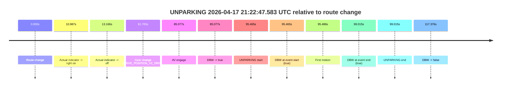

# Run Report: fme20002/2026-04-17--21-10-06--gen2-av-f718ab0c-c537-41f7-9113-9a4c8f1452ed

| Field | Value |
|---|---|
| Run ID | `fme20002/2026-04-17--21-10-06--gen2-av-f718ab0c-c537-41f7-9113-9a4c8f1452ed` |
| Date | `2026-04-17` |
| Model(s) | `pink-manta-ray-smooth` |
| Author | `guy.geva` |
| Event count | `2` |

## unpudo 2026-04-17 21:13:24.533 UTC

| Field | Value |
|---|---|
| Model | `pink-manta-ray-smooth` |
| Author | `guy.geva` |
| Run ID | `fme20002/2026-04-17--21-10-06--gen2-av-f718ab0c-c537-41f7-9113-9a4c8f1452ed` |
| Date | `2026-04-17` |
| Time (UTC) | `21:13:24.533` |
| Event type | `unpudo` |
| Disengagement type | `none observed` |
| Route change | `found` |
| Console | [run](https://console.sso.wayve.ai/run/fme20002/2026-04-17--21-10-06--gen2-av-f718ab0c-c537-41f7-9113-9a4c8f1452ed?id=&time-unixus=1776460404533317) |
| Foxglove | [segment](https://app.foxglove.dev/wayve-on-prem/p/prj_0dX18KZdVHg1fmmI/view?ds=foxglove-stream&ds.deviceName=fme20002&ds.start=2026-04-17T21%3A11%3A16.868313Z&ds.end=2026-04-17T21%3A13%3A38.133291Z&layoutId=lay_0e7VD4WIKDQGU73Y&time=2026-04-17T21%3A13%3A24.533317Z) |

### Event card: fail

- Fail: the credited unpudo does not stay AV-owned. The event window starts with DBW false, and the maneuver outcome lands outside a clean AV-owned segment.

| Event | Time (UTC) | Delta from route change |
|---|---:|---:|
| Route change | 2026-04-17 21:11:26.868 | `0.000s` |
| Actual indicator -> right on | 2026-04-17 21:11:36.725 | `9.857s` |
| First motion | 2026-04-17 21:11:37.305 | `10.437s` |
| Actual indicator -> off | 2026-04-17 21:11:39.365 | `12.497s` |
| Actual indicator -> left on | 2026-04-17 21:11:55.745 | `28.877s` |
| Actual indicator -> off | 2026-04-17 21:11:59.305 | `32.437s` |
| Actual indicator -> left on | 2026-04-17 21:11:59.665 | `32.797s` |
| Actual indicator -> off | 2026-04-17 21:12:05.364 | `38.497s` |
| Actual indicator -> left on | 2026-04-17 21:12:10.365 | `43.497s` |
| Actual indicator -> right on | 2026-04-17 21:12:29.284 | `62.417s` |
| Actual indicator -> off | 2026-04-17 21:12:31.584 | `64.717s` |
| Actual indicator -> left on | 2026-04-17 21:12:51.804 | `84.937s` |
| AV engage | 2026-04-17 21:13:19.394 | `112.526s` |
| DBW -> true | 2026-04-17 21:13:19.394 | `112.526s` |
| Gear change (DRIVE_POSITION_V2_DRIVE) | 2026-04-17 21:13:19.883 | `113.015s` |
| DBW -> false | 2026-04-17 21:13:23.705 | `116.837s` |
| Actual indicator -> right on | 2026-04-17 21:13:24.084 | `117.217s` |
| UNPUDO start | 2026-04-17 21:13:24.533 | `117.665s` |
| DBW at event start (false) | 2026-04-17 21:13:24.533 | `117.665s` |
| Actual indicator -> off | 2026-04-17 21:13:26.224 | `119.357s` |
| Actual indicator -> left on | 2026-04-17 21:13:27.504 | `120.637s` |
| DBW at event end (false) | 2026-04-17 21:13:28.133 | `121.265s` |
| UNPUDO end | 2026-04-17 21:13:28.133 | `121.265s` |
| Actual indicator -> off | 2026-04-17 21:13:33.146 | `126.278s` |

```mermaid
timeline
    title UNPUDO 2026-04-17 21:13:24.533 UTC relative to route change
    0.000s : Route change
    9.857s : Actual indicator -> right on
    10.437s : First motion
    12.497s : Actual indicator -> off
    28.877s : Actual indicator -> left on
    32.437s : Actual indicator -> off
    32.797s : Actual indicator -> left on
    38.497s : Actual indicator -> off
    43.497s : Actual indicator -> left on
    62.417s : Actual indicator -> right on
    64.717s : Actual indicator -> off
    84.937s : Actual indicator -> left on
    112.526s : AV engage
    112.526s : DBW -> true
    113.015s : Gear change (DRIVE_POSITION_V2_DRIVE)
    116.837s : DBW -> false
    117.217s : Actual indicator -> right on
    117.665s : UNPUDO start
    117.665s : DBW at event start (false)
    119.357s : Actual indicator -> off
    120.637s : Actual indicator -> left on
    121.265s : DBW at event end (false)
    121.265s : UNPUDO end
    126.278s : Actual indicator -> off
```

| Metric | Value |
|---|---|
| Outcome | `fail` |
| Effective failure type | `completed_outside_av` |
| Route change status | `found` |
| DBW at event start | `false` |
| DBW at event end | `false` |
| Predicted gear at AV start | `DRIVE_POSITION_V2_DRIVE` |
| Actual gear at AV start | `DRIVE_POSITION_V2_PARK` |
| Predicted gear at event start | `DRIVE_POSITION_V2_DRIVE` |
| Actual gear at event start | `DRIVE_POSITION_V2_DRIVE` |
| Planned indicator direction | `INDICATORS_STATE_V2_RIGHT_ON` |
| Controller indicator direction | `INDICATORS_STATE_V2_RIGHT_ON` |
| Actual indicator direction | `INDICATORS_STATE_V2_RIGHT_ON` |
| Actual indicator at maneuver end | `INDICATORS_STATE_V2_LEFT_ON` |
| Driver accel help in AV | `false` |
| Driver accel help timestamp | `n/a` |
| Max accel pedal pct in AV | `0.0%` |
| Max brake pedal pct in AV | `8.0%` |
| Max speed mps in AV | `0.000` |
| Success timing baseline | `route change` |
| Route -> AV | `112.526s` |
| AV -> event start | `5.139s` |
| AV -> first motion | `-102.090s` |
| Success baseline -> event start | `117.665s` |
| Success baseline -> first motion | `10.437s` |
| AV duration before disengagement | `4.311s` |
| Trajectory waypoint count | `37` |
| Driving-plan step count | `11` |

The scored portion starts from the AV-owned window, not from the pre-AV setup. Route-change search in the stopped pre-event segment was `found`, with the baseline therefore set to route change. At the event anchor the model predicts `DRIVE_POSITION_V2_DRIVE` and the actual gear is `DRIVE_POSITION_V2_DRIVE`. The effective model outcome is `fail` because `completed_outside_av.`

### Resolution

| Field | Value |
|---|---|
| Final outcome | `fail` |
| Do we agree with this label? | `yes` |
| Source disengagement type | `none observed` |
| Resolved effective failure type | `completed_outside_av` |
| Confidence | `high` |

## unparking 2026-04-17 21:22:47.583 UTC

| Field | Value |
|---|---|
| Model | `pink-manta-ray-smooth` |
| Author | `guy.geva` |
| Run ID | `fme20002/2026-04-17--21-10-06--gen2-av-f718ab0c-c537-41f7-9113-9a4c8f1452ed` |
| Date | `2026-04-17` |
| Time (UTC) | `21:22:47.583` |
| Event type | `unparking` |
| Disengagement type | `none observed` |
| Route change | `found` |
| Console | [run](https://console.sso.wayve.ai/run/fme20002/2026-04-17--21-10-06--gen2-av-f718ab0c-c537-41f7-9113-9a4c8f1452ed?id=&time-unixus=1776460967583292) |
| Foxglove | [segment](https://app.foxglove.dev/wayve-on-prem/p/prj_0dX18KZdVHg1fmmI/view?ds=foxglove-stream&ds.deviceName=fme20002&ds.start=2026-04-17T21%3A21%3A02.118498Z&ds.end=2026-04-17T21%3A23%3A19.494697Z&layoutId=lay_0e7VD4WIKDQGU73Y&time=2026-04-17T21%3A22%3A47.583292Z) |

### Event card: pass

- Pass: AV owns the credited unparking through the official event window, the gear state is aligned at the anchor, and the vehicle moves without driver accelerator help in AV.

| Event | Time (UTC) | Delta from route change |
|---|---:|---:|
| Route change | 2026-04-17 21:21:12.118 | `0.000s` |
| Actual indicator -> right on | 2026-04-17 21:21:23.105 | `10.987s` |
| Actual indicator -> off | 2026-04-17 21:21:25.284 | `13.166s` |
| Gear change (DRIVE_POSITION_V2_DRIVE) | 2026-04-17 21:22:33.883 | `81.765s` |
| AV engage | 2026-04-17 21:22:37.195 | `85.077s` |
| DBW -> true | 2026-04-17 21:22:37.195 | `85.077s` |
| UNPARKING start | 2026-04-17 21:22:47.583 | `95.465s` |
| DBW at event start (true) | 2026-04-17 21:22:47.583 | `95.465s` |
| First motion | 2026-04-17 21:22:47.604 | `95.486s` |
| DBW at event end (true) | 2026-04-17 21:22:51.133 | `99.015s` |
| UNPARKING end | 2026-04-17 21:22:51.133 | `99.015s` |
| DBW -> false | 2026-04-17 21:23:09.494 | `117.376s` |

| Metric | Value |
|---|---|
| Outcome | `pass` |
| Effective failure type | `none` |
| Route change status | `found` |
| DBW at event start | `true` |
| DBW at event end | `true` |
| Predicted gear at AV start | `DRIVE_POSITION_V2_DRIVE` |
| Actual gear at AV start | `DRIVE_POSITION_V2_DRIVE` |
| Predicted gear at event start | `DRIVE_POSITION_V2_DRIVE` |
| Actual gear at event start | `DRIVE_POSITION_V2_DRIVE` |
| Planned indicator direction | `INDICATORS_STATE_V2_OFF` |
| Controller indicator direction | `INDICATORS_STATE_V2_OFF` |
| Actual indicator direction | `INDICATORS_STATE_V2_OFF` |
| Actual indicator at maneuver end | `INDICATORS_STATE_V2_OFF` |
| Driver accel help in AV | `false` |
| Driver accel help timestamp | `n/a` |
| Max accel pedal pct in AV | `0.0%` |
| Max brake pedal pct in AV | `0.0%` |
| Max speed mps in AV | `4.142` |
| Success timing baseline | `route change` |
| Route -> AV | `85.077s` |
| AV -> event start | `10.388s` |
| AV -> first motion | `10.410s` |
| Success baseline -> event start | `95.465s` |
| Success baseline -> first motion | `95.486s` |
| AV duration before disengagement | `32.300s` |
| Trajectory waypoint count | `34` |
| Driving-plan step count | `11` |

The scored portion starts from the AV-owned window, not from the pre-AV setup. Route-change search in the stopped pre-event segment was `found`, with the baseline therefore set to route change. At the event anchor the model predicts `DRIVE_POSITION_V2_DRIVE` and the actual gear is `DRIVE_POSITION_V2_DRIVE`. The effective model outcome is `pass` because `the credited maneuver stays AV-owned through the official event end.`

### Resolution

| Field | Value |
|---|---|
| Final outcome | `pass` |
| Do we agree with this label? | `yes` |
| Source disengagement type | `none observed` |
| Resolved effective failure type | `none` |
| Confidence | `high` |
