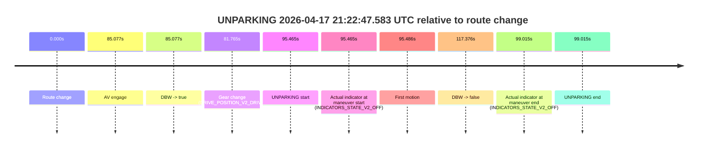

# Run Report: fme20002/2026-04-17--21-10-06--gen2-av-f718ab0c-c537-41f7-9113-9a4c8f1452ed

| Field | Value |
|---|---|
| Run ID | `fme20002/2026-04-17--21-10-06--gen2-av-f718ab0c-c537-41f7-9113-9a4c8f1452ed` |
| Date | `2026-04-17` |
| Model(s) | `pink-manta-ray-smooth` |
| Author | `guy.geva` |
| Event count | `3` |

## unpudo 2026-04-17 21:13:24.533 UTC

| Field | Value |
|---|---|
| Model | `pink-manta-ray-smooth` |
| Author | `guy.geva` |
| Run ID | `fme20002/2026-04-17--21-10-06--gen2-av-f718ab0c-c537-41f7-9113-9a4c8f1452ed` |
| Date | `2026-04-17` |
| Time (UTC) | `21:13:24.533` |
| Event type | `unpudo` |
| Disengagement type | `none observed` |
| Route change | `found` |
| Console | [run](https://console.sso.wayve.ai/run/fme20002/2026-04-17--21-10-06--gen2-av-f718ab0c-c537-41f7-9113-9a4c8f1452ed?id=&time-unixus=1776460404533317) |
| Foxglove | [segment](https://app.foxglove.dev/wayve-on-prem/p/prj_0dX18KZdVHg1fmmI/view?ds=foxglove-stream&ds.deviceName=fme20002&ds.start=2026-04-17T21%3A11%3A16.868313Z&ds.end=2026-04-17T21%3A14%3A46.854774Z&layoutId=lay_0e7VD4WIKDQGU73Y&time=2026-04-17T21%3A13%3A24.533317Z) |

### Event card: non-av

- Non-AV: there is no AV-owned portion anywhere inside the detected unpudo timeline, so it is kept for coverage but excluded from model success / failure scoring.

| Event | Time (UTC) | Delta from route change |
|---|---:|---:|
| Route change | 2026-04-17 21:11:26.868 | `0.000s` |
| AV engage | 2026-04-17 21:13:36.695 | `129.828s` |
| DBW -> true | 2026-04-17 21:13:36.695 | `129.828s` |
| Gear change (DRIVE_POSITION_V2_DRIVE) | 2026-04-17 21:13:19.883 | `113.015s` |
| UNPUDO start | 2026-04-17 21:13:24.533 | `117.665s` |
| Actual indicator at maneuver start (INDICATORS_STATE_V2_RIGHT_ON) | 2026-04-17 21:13:24.533 | `117.665s` |
| First motion | 2026-04-17 21:13:24.644 | `117.777s` |
| DBW -> false | 2026-04-17 21:14:36.854 | `189.986s` |
| Actual indicator at maneuver end (INDICATORS_STATE_V2_LEFT_ON) | 2026-04-17 21:13:28.133 | `121.265s` |
| UNPUDO end | 2026-04-17 21:13:28.133 | `121.265s` |

| Metric | Value |
|---|---|
| Outcome | `non-av` |
| Effective failure type | `none` |
| Route change status | `found` |
| DBW at event start | `false` |
| DBW at event end | `false` |
| Predicted gear at AV start | `DRIVE_POSITION_V2_DRIVE` |
| Actual gear at AV start | `DRIVE_POSITION_V2_DRIVE` |
| Predicted gear at event start | `DRIVE_POSITION_V2_DRIVE` |
| Actual gear at event start | `DRIVE_POSITION_V2_DRIVE` |
| Planned indicator direction | `INDICATORS_STATE_V2_RIGHT_ON` |
| Controller indicator direction | `INDICATORS_STATE_V2_RIGHT_ON` |
| Actual indicator direction | `INDICATORS_STATE_V2_RIGHT_ON` |
| Actual indicator at maneuver end | `INDICATORS_STATE_V2_LEFT_ON` |
| Driver accel help in AV | `false` |
| Driver accel help timestamp | `n/a` |
| Max accel pedal pct in AV | `0.0%` |
| Max brake pedal pct in AV | `0.0%` |
| Max speed mps in AV | `0.000` |
| Route -> AV | `129.828s` |
| AV -> event start | `-12.163s` |
| AV -> first motion | `-12.051s` |
| AV duration before disengagement | `60.159s` |
| Trajectory waypoint count | `37` |
| Driving-plan step count | `11` |

The scored portion starts from the AV-owned window, not from the pre-AV setup. Route-change search in the stopped pre-event segment was `found`, with the baseline therefore set to route change. At the event anchor the model predicts `DRIVE_POSITION_V2_DRIVE` and the actual gear is `DRIVE_POSITION_V2_DRIVE`. The effective model outcome is `non-av` because `there is no AV-owned overlap inside the event timeline`.

### Resolution

| Field | Value |
|---|---|
| Final outcome | `non-av` |
| Do we agree with this label? | `yes` |
| Source disengagement type | `none observed` |
| Resolved effective failure type | `none` |
| Confidence | `high` |

## unparking 2026-04-17 21:21:23.733 UTC

| Field | Value |
|---|---|
| Model | `pink-manta-ray-smooth` |
| Author | `guy.geva` |
| Run ID | `fme20002/2026-04-17--21-10-06--gen2-av-f718ab0c-c537-41f7-9113-9a4c8f1452ed` |
| Date | `2026-04-17` |
| Time (UTC) | `21:21:23.733` |
| Event type | `unparking` |
| Disengagement type | `none observed` |
| Route change | `found` |
| Console | [run](https://console.sso.wayve.ai/run/fme20002/2026-04-17--21-10-06--gen2-av-f718ab0c-c537-41f7-9113-9a4c8f1452ed?id=&time-unixus=1776460883733319) |
| Foxglove | [segment](https://app.foxglove.dev/wayve-on-prem/p/prj_0dX18KZdVHg1fmmI/view?ds=foxglove-stream&ds.deviceName=fme20002&ds.start=2026-04-17T21%3A21%3A02.118498Z&ds.end=2026-04-17T21%3A22%3A11.095755Z&layoutId=lay_0e7VD4WIKDQGU73Y&time=2026-04-17T21%3A21%3A23.733319Z) |

### Event card: non-av

- Non-AV: there is no AV-owned portion anywhere inside the detected unparking timeline, so it is kept for coverage but excluded from model success / failure scoring.

| Event | Time (UTC) | Delta from route change |
|---|---:|---:|
| Route change | 2026-04-17 21:21:12.118 | `0.000s` |
| AV engage | 2026-04-17 21:21:31.194 | `19.076s` |
| DBW -> true | 2026-04-17 21:21:31.194 | `19.076s` |
| Gear change (DRIVE_POSITION_V2_DRIVE) | 2026-04-17 21:21:12.483 | `0.365s` |
| UNPARKING start | 2026-04-17 21:21:23.733 | `11.615s` |
| Actual indicator at maneuver start (INDICATORS_STATE_V2_RIGHT_ON) | 2026-04-17 21:21:23.733 | `11.615s` |
| First motion | 2026-04-17 21:21:23.864 | `11.746s` |
| DBW -> false | 2026-04-17 21:22:01.095 | `48.977s` |
| Actual indicator at maneuver end (INDICATORS_STATE_V2_OFF) | 2026-04-17 21:21:28.133 | `16.015s` |
| UNPARKING end | 2026-04-17 21:21:28.133 | `16.015s` |

| Metric | Value |
|---|---|
| Outcome | `non-av` |
| Effective failure type | `none` |
| Route change status | `found` |
| DBW at event start | `false` |
| DBW at event end | `false` |
| Predicted gear at AV start | `DRIVE_POSITION_V2_DRIVE` |
| Actual gear at AV start | `DRIVE_POSITION_V2_DRIVE` |
| Predicted gear at event start | `DRIVE_POSITION_V2_DRIVE` |
| Actual gear at event start | `DRIVE_POSITION_V2_DRIVE` |
| Planned indicator direction | `INDICATORS_STATE_V2_RIGHT_ON` |
| Controller indicator direction | `INDICATORS_STATE_V2_RIGHT_ON` |
| Actual indicator direction | `INDICATORS_STATE_V2_RIGHT_ON` |
| Actual indicator at maneuver end | `INDICATORS_STATE_V2_OFF` |
| Driver accel help in AV | `false` |
| Driver accel help timestamp | `n/a` |
| Max accel pedal pct in AV | `0.0%` |
| Max brake pedal pct in AV | `0.0%` |
| Max speed mps in AV | `0.000` |
| Route -> AV | `19.076s` |
| AV -> event start | `-7.462s` |
| AV -> first motion | `-7.330s` |
| AV duration before disengagement | `29.901s` |
| Trajectory waypoint count | `35` |
| Driving-plan step count | `11` |

The scored portion starts from the AV-owned window, not from the pre-AV setup. Route-change search in the stopped pre-event segment was `found`, with the baseline therefore set to route change. At the event anchor the model predicts `DRIVE_POSITION_V2_DRIVE` and the actual gear is `DRIVE_POSITION_V2_DRIVE`. The effective model outcome is `non-av` because `there is no AV-owned overlap inside the event timeline`.

### Resolution

| Field | Value |
|---|---|
| Final outcome | `non-av` |
| Do we agree with this label? | `yes` |
| Source disengagement type | `none observed` |
| Resolved effective failure type | `none` |
| Confidence | `high` |

## unparking 2026-04-17 21:22:47.583 UTC

| Field | Value |
|---|---|
| Model | `pink-manta-ray-smooth` |
| Author | `guy.geva` |
| Run ID | `fme20002/2026-04-17--21-10-06--gen2-av-f718ab0c-c537-41f7-9113-9a4c8f1452ed` |
| Date | `2026-04-17` |
| Time (UTC) | `21:22:47.583` |
| Event type | `unparking` |
| Disengagement type | `none observed` |
| Route change | `found` |
| Console | [run](https://console.sso.wayve.ai/run/fme20002/2026-04-17--21-10-06--gen2-av-f718ab0c-c537-41f7-9113-9a4c8f1452ed?id=&time-unixus=1776460967583292) |
| Foxglove | [segment](https://app.foxglove.dev/wayve-on-prem/p/prj_0dX18KZdVHg1fmmI/view?ds=foxglove-stream&ds.deviceName=fme20002&ds.start=2026-04-17T21%3A21%3A02.118498Z&ds.end=2026-04-17T21%3A23%3A19.494697Z&layoutId=lay_0e7VD4WIKDQGU73Y&time=2026-04-17T21%3A22%3A47.583292Z) |

### Event card: pass

- Pass: AV owns the credited unparking through the official event window, the gear state is aligned at the anchor, and the vehicle moves without driver accelerator help in AV.

| Event | Time (UTC) | Delta from route change |
|---|---:|---:|
| Route change | 2026-04-17 21:21:12.118 | `0.000s` |
| AV engage | 2026-04-17 21:22:37.195 | `85.077s` |
| DBW -> true | 2026-04-17 21:22:37.195 | `85.077s` |
| Gear change (DRIVE_POSITION_V2_DRIVE) | 2026-04-17 21:22:33.883 | `81.765s` |
| UNPARKING start | 2026-04-17 21:22:47.583 | `95.465s` |
| Actual indicator at maneuver start (INDICATORS_STATE_V2_OFF) | 2026-04-17 21:22:47.583 | `95.465s` |
| First motion | 2026-04-17 21:22:47.604 | `95.486s` |
| DBW -> false | 2026-04-17 21:23:09.494 | `117.376s` |
| Actual indicator at maneuver end (INDICATORS_STATE_V2_OFF) | 2026-04-17 21:22:51.133 | `99.015s` |
| UNPARKING end | 2026-04-17 21:22:51.133 | `99.015s` |

| Metric | Value |
|---|---|
| Outcome | `pass` |
| Effective failure type | `none` |
| Route change status | `found` |
| DBW at event start | `true` |
| DBW at event end | `true` |
| Predicted gear at AV start | `DRIVE_POSITION_V2_DRIVE` |
| Actual gear at AV start | `DRIVE_POSITION_V2_DRIVE` |
| Predicted gear at event start | `DRIVE_POSITION_V2_DRIVE` |
| Actual gear at event start | `DRIVE_POSITION_V2_DRIVE` |
| Planned indicator direction | `INDICATORS_STATE_V2_OFF` |
| Controller indicator direction | `INDICATORS_STATE_V2_OFF` |
| Actual indicator direction | `INDICATORS_STATE_V2_OFF` |
| Actual indicator at maneuver end | `INDICATORS_STATE_V2_OFF` |
| Driver accel help in AV | `false` |
| Driver accel help timestamp | `n/a` |
| Max accel pedal pct in AV | `0.0%` |
| Max brake pedal pct in AV | `0.0%` |
| Max speed mps in AV | `4.142` |
| Route -> AV | `85.077s` |
| AV -> event start | `10.388s` |
| AV -> first motion | `10.410s` |
| AV duration before disengagement | `32.300s` |
| Trajectory waypoint count | `34` |
| Driving-plan step count | `11` |

The scored portion starts from the AV-owned window, not from the pre-AV setup. Route-change search in the stopped pre-event segment was `found`, with the baseline therefore set to route change. At the event anchor the model predicts `DRIVE_POSITION_V2_DRIVE` and the actual gear is `DRIVE_POSITION_V2_DRIVE`. The effective model outcome is `pass` because `the credited maneuver stays AV-owned through the official event end`.

### Resolution

| Field | Value |
|---|---|
| Final outcome | `pass` |
| Do we agree with this label? | `yes` |
| Source disengagement type | `none observed` |
| Resolved effective failure type | `none` |
| Confidence | `high` |
