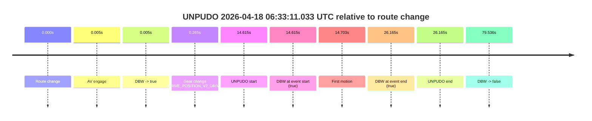
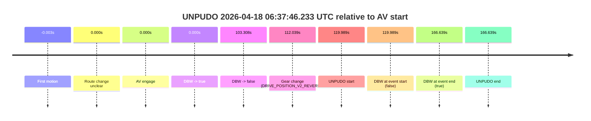
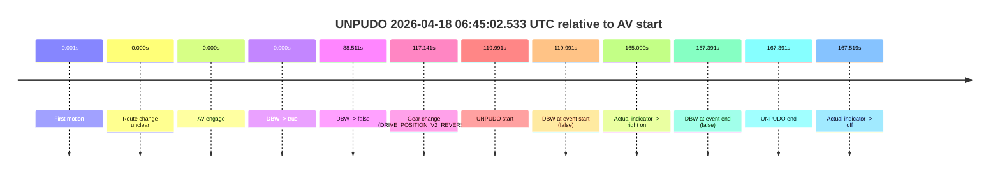
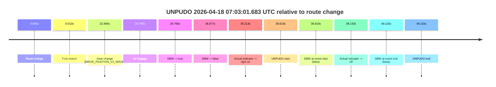

# Run Report: fme20002/2026-04-18--06-12-58--gen2-av-544d6e06-4dbe-4b79-aa52-f5b26234d08f

| Field | Value |
|---|---|
| Run ID | `fme20002/2026-04-18--06-12-58--gen2-av-544d6e06-4dbe-4b79-aa52-f5b26234d08f` |
| Date | `2026-04-18` |
| Model(s) | `pink-manta-ray-smooth` |
| Author | `guy.geva` |
| Event count | `4` |

## unpudo 2026-04-18 06:33:11.033 UTC

| Field | Value |
|---|---|
| Model | `pink-manta-ray-smooth` |
| Author | `guy.geva` |
| Run ID | `fme20002/2026-04-18--06-12-58--gen2-av-544d6e06-4dbe-4b79-aa52-f5b26234d08f` |
| Date | `2026-04-18` |
| Time (UTC) | `06:33:11.033` |
| Event type | `unpudo` |
| Disengagement type | `none observed` |
| Route change | `found` |
| Console | [run](https://console.sso.wayve.ai/run/fme20002/2026-04-18--06-12-58--gen2-av-544d6e06-4dbe-4b79-aa52-f5b26234d08f?id=&time-unixus=1776493991033308) |
| Foxglove | [segment](https://app.foxglove.dev/wayve-on-prem/p/prj_0dX18KZdVHg1fmmI/view?ds=foxglove-stream&ds.deviceName=fme20002&ds.start=2026-04-18T06%3A32%3A46.418285Z&ds.end=2026-04-18T06%3A34%3A25.954626Z&layoutId=lay_0e7VD4WIKDQGU73Y&time=2026-04-18T06%3A33%3A11.033308Z) |

### Event card: pass

- Pass: AV owns the credited unpudo from route change through the official unpudo window, the gear state is aligned at the anchor, and the vehicle moves without driver accelerator help in AV.

| Event | Time (UTC) | Delta from route change |
|---|---:|---:|
| Route change | 2026-04-18 06:32:56.418 | `0.000s` |
| AV engage | 2026-04-18 06:32:56.423 | `0.005s` |
| DBW -> true | 2026-04-18 06:32:56.423 | `0.005s` |
| Gear change (DRIVE_POSITION_V2_DRIVE) | 2026-04-18 06:32:56.683 | `0.265s` |
| UNPUDO start | 2026-04-18 06:33:11.033 | `14.615s` |
| DBW at event start (true) | 2026-04-18 06:33:11.033 | `14.615s` |
| First motion | 2026-04-18 06:33:11.121 | `14.703s` |
| DBW at event end (true) | 2026-04-18 06:33:22.583 | `26.165s` |
| UNPUDO end | 2026-04-18 06:33:22.583 | `26.165s` |
| DBW -> false | 2026-04-18 06:34:15.954 | `79.536s` |

| Metric | Value |
|---|---|
| Outcome | `pass` |
| Effective failure type | `none` |
| Route change status | `found` |
| DBW at event start | `true` |
| DBW at event end | `true` |
| Predicted gear at AV start | `DRIVE_POSITION_V2_PARK` |
| Actual gear at AV start | `DRIVE_POSITION_V2_PARK` |
| Predicted gear at event start | `DRIVE_POSITION_V2_DRIVE` |
| Actual gear at event start | `DRIVE_POSITION_V2_DRIVE` |
| Planned indicator direction | `INDICATORS_STATE_V2_OFF` |
| Controller indicator direction | `INDICATORS_STATE_V2_OFF` |
| Actual indicator direction | `INDICATORS_STATE_V2_OFF` |
| Actual indicator at maneuver end | `INDICATORS_STATE_V2_OFF` |
| Driver accel help in AV | `false` |
| Driver accel help timestamp | `n/a` |
| Max accel pedal pct in AV | `0.0%` |
| Max brake pedal pct in AV | `30.0%` |
| Max speed mps in AV | `3.044` |
| Success timing baseline | `route change` |
| Route -> AV | `0.005s` |
| AV -> event start | `14.610s` |
| AV -> first motion | `14.698s` |
| Success baseline -> event start | `14.615s` |
| Success baseline -> first motion | `14.703s` |
| AV duration before disengagement | `79.532s` |
| Trajectory waypoint count | `36` |
| Driving-plan step count | `11` |

The scored portion starts from the AV-owned window, not from the pre-AV setup. Route-change search in the stopped pre-event segment was `found`, with the baseline therefore set to route change. At the event anchor the model predicts `DRIVE_POSITION_V2_DRIVE` and the actual gear is `DRIVE_POSITION_V2_DRIVE`. The effective model outcome is `pass` because `the credited unpudo stays AV-owned through the official unpudo window.`

### Resolution

| Field | Value |
|---|---|
| Final outcome | `pass` |
| Do we agree with this label? | `yes` |
| Source disengagement type | `none observed` |
| Resolved effective failure type | `none` |
| Confidence | `high` |

## unpudo 2026-04-18 06:37:46.233 UTC

| Field | Value |
|---|---|
| Model | `pink-manta-ray-smooth` |
| Author | `guy.geva` |
| Run ID | `fme20002/2026-04-18--06-12-58--gen2-av-544d6e06-4dbe-4b79-aa52-f5b26234d08f` |
| Date | `2026-04-18` |
| Time (UTC) | `06:37:46.233` |
| Event type | `unpudo` |
| Disengagement type | `none observed` |
| Route change | `unclear` |
| Console | [run](https://console.sso.wayve.ai/run/fme20002/2026-04-18--06-12-58--gen2-av-544d6e06-4dbe-4b79-aa52-f5b26234d08f?id=&time-unixus=1776494266233290) |
| Foxglove | [segment](https://app.foxglove.dev/wayve-on-prem/p/prj_0dX18KZdVHg1fmmI/view?ds=foxglove-stream&ds.deviceName=fme20002&ds.start=2026-04-18T06%3A35%3A36.244285Z&ds.end=2026-04-18T06%3A38%3A42.883323Z&layoutId=lay_0e7VD4WIKDQGU73Y&time=2026-04-18T06%3A37%3A46.233290Z) |

### Event card: fail

- Fail: the credited unpudo does not stay AV-owned. The event window starts with DBW false, and the maneuver outcome lands outside a clean AV-owned segment.

| Event | Time (UTC) | Delta from AV start |
|---|---:|---:|
| First motion | 2026-04-18 06:35:46.241 | `-0.003s` |
| Route change unclear | 2026-04-18 06:35:46.244 | `0.000s` |
| AV engage | 2026-04-18 06:35:46.244 | `0.000s` |
| DBW -> true | 2026-04-18 06:35:46.244 | `0.000s` |
| DBW -> false | 2026-04-18 06:37:29.552 | `103.308s` |
| Gear change (DRIVE_POSITION_V2_REVERSE) | 2026-04-18 06:37:38.283 | `112.039s` |
| UNPUDO start | 2026-04-18 06:37:46.233 | `119.989s` |
| DBW at event start (false) | 2026-04-18 06:37:46.233 | `119.989s` |
| DBW at event end (true) | 2026-04-18 06:38:32.883 | `166.639s` |
| UNPUDO end | 2026-04-18 06:38:32.883 | `166.639s` |

| Metric | Value |
|---|---|
| Outcome | `fail` |
| Effective failure type | `completed_outside_av` |
| Route change status | `unclear` |
| DBW at event start | `false` |
| DBW at event end | `true` |
| Predicted gear at AV start | `DRIVE_POSITION_V2_DRIVE` |
| Actual gear at AV start | `DRIVE_POSITION_V2_DRIVE` |
| Predicted gear at event start | `DRIVE_POSITION_V2_REVERSE` |
| Actual gear at event start | `DRIVE_POSITION_V2_REVERSE` |
| Planned indicator direction | `INDICATORS_STATE_V2_OFF` |
| Controller indicator direction | `INDICATORS_STATE_V2_OFF` |
| Actual indicator direction | `INDICATORS_STATE_V2_OFF` |
| Actual indicator at maneuver end | `INDICATORS_STATE_V2_OFF` |
| Driver accel help in AV | `false` |
| Driver accel help timestamp | `n/a` |
| Max accel pedal pct in AV | `0.0%` |
| Max brake pedal pct in AV | `28.1%` |
| Max speed mps in AV | `8.608` |
| Success timing baseline | `AV start` |
| Route -> AV | `n/a` |
| AV -> event start | `119.989s` |
| AV -> first motion | `-0.003s` |
| Success baseline -> event start | `119.989s` |
| Success baseline -> first motion | `-0.003s` |
| AV duration before disengagement | `103.308s` |
| Trajectory waypoint count | `36` |
| Driving-plan step count | `11` |

The scored portion starts from the AV-owned window, not from the pre-AV setup. Route-change search in the stopped pre-event segment was `unclear`, with the baseline therefore set to AV start. At the event anchor the model predicts `DRIVE_POSITION_V2_REVERSE` and the actual gear is `DRIVE_POSITION_V2_REVERSE`. The effective model outcome is `fail` because `completed_outside_av.`

### Resolution

| Field | Value |
|---|---|
| Final outcome | `fail` |
| Do we agree with this label? | `yes` |
| Source disengagement type | `none observed` |
| Resolved effective failure type | `completed_outside_av` |
| Confidence | `medium` |

## unpudo 2026-04-18 06:45:02.533 UTC

| Field | Value |
|---|---|
| Model | `pink-manta-ray-smooth` |
| Author | `guy.geva` |
| Run ID | `fme20002/2026-04-18--06-12-58--gen2-av-544d6e06-4dbe-4b79-aa52-f5b26234d08f` |
| Date | `2026-04-18` |
| Time (UTC) | `06:45:02.533` |
| Event type | `unpudo` |
| Disengagement type | `none observed` |
| Route change | `unclear` |
| Console | [run](https://console.sso.wayve.ai/run/fme20002/2026-04-18--06-12-58--gen2-av-544d6e06-4dbe-4b79-aa52-f5b26234d08f?id=&time-unixus=1776494702533302) |
| Foxglove | [segment](https://app.foxglove.dev/wayve-on-prem/p/prj_0dX18KZdVHg1fmmI/view?ds=foxglove-stream&ds.deviceName=fme20002&ds.start=2026-04-18T06%3A42%3A52.542372Z&ds.end=2026-04-18T06%3A45%3A59.933323Z&layoutId=lay_0e7VD4WIKDQGU73Y&time=2026-04-18T06%3A45%3A02.533302Z) |

### Event card: fail

- Fail: the credited unpudo does not stay AV-owned. The event window starts with DBW false, and the maneuver outcome lands outside a clean AV-owned segment.

| Event | Time (UTC) | Delta from AV start |
|---|---:|---:|
| First motion | 2026-04-18 06:43:02.541 | `-0.001s` |
| Route change unclear | 2026-04-18 06:43:02.542 | `0.000s` |
| AV engage | 2026-04-18 06:43:02.542 | `0.000s` |
| DBW -> true | 2026-04-18 06:43:02.542 | `0.000s` |
| DBW -> false | 2026-04-18 06:44:31.053 | `88.511s` |
| Gear change (DRIVE_POSITION_V2_REVERSE) | 2026-04-18 06:44:59.683 | `117.141s` |
| UNPUDO start | 2026-04-18 06:45:02.533 | `119.991s` |
| DBW at event start (false) | 2026-04-18 06:45:02.533 | `119.991s` |
| Actual indicator -> right on | 2026-04-18 06:45:47.541 | `165.000s` |
| DBW at event end (false) | 2026-04-18 06:45:49.933 | `167.391s` |
| UNPUDO end | 2026-04-18 06:45:49.933 | `167.391s` |
| Actual indicator -> off | 2026-04-18 06:45:50.061 | `167.519s` |

| Metric | Value |
|---|---|
| Outcome | `fail` |
| Effective failure type | `completed_outside_av` |
| Route change status | `unclear` |
| DBW at event start | `false` |
| DBW at event end | `false` |
| Predicted gear at AV start | `DRIVE_POSITION_V2_DRIVE` |
| Actual gear at AV start | `DRIVE_POSITION_V2_DRIVE` |
| Predicted gear at event start | `DRIVE_POSITION_V2_REVERSE` |
| Actual gear at event start | `DRIVE_POSITION_V2_REVERSE` |
| Planned indicator direction | `INDICATORS_STATE_V2_OFF` |
| Controller indicator direction | `INDICATORS_STATE_V2_OFF` |
| Actual indicator direction | `INDICATORS_STATE_V2_OFF` |
| Actual indicator at maneuver end | `INDICATORS_STATE_V2_RIGHT_ON` |
| Driver accel help in AV | `false` |
| Driver accel help timestamp | `n/a` |
| Max accel pedal pct in AV | `0.0%` |
| Max brake pedal pct in AV | `10.0%` |
| Max speed mps in AV | `8.089` |
| Success timing baseline | `AV start` |
| Route -> AV | `n/a` |
| AV -> event start | `119.991s` |
| AV -> first motion | `-0.001s` |
| Success baseline -> event start | `119.991s` |
| Success baseline -> first motion | `-0.001s` |
| AV duration before disengagement | `88.511s` |
| Trajectory waypoint count | `36` |
| Driving-plan step count | `11` |

The scored portion starts from the AV-owned window, not from the pre-AV setup. Route-change search in the stopped pre-event segment was `unclear`, with the baseline therefore set to AV start. At the event anchor the model predicts `DRIVE_POSITION_V2_REVERSE` and the actual gear is `DRIVE_POSITION_V2_REVERSE`. The effective model outcome is `fail` because `completed_outside_av.`

### Resolution

| Field | Value |
|---|---|
| Final outcome | `fail` |
| Do we agree with this label? | `yes` |
| Source disengagement type | `none observed` |
| Resolved effective failure type | `completed_outside_av` |
| Confidence | `medium` |

## unpudo 2026-04-18 07:03:01.683 UTC

| Field | Value |
|---|---|
| Model | `pink-manta-ray-smooth` |
| Author | `guy.geva` |
| Run ID | `fme20002/2026-04-18--06-12-58--gen2-av-544d6e06-4dbe-4b79-aa52-f5b26234d08f` |
| Date | `2026-04-18` |
| Time (UTC) | `07:03:01.683` |
| Event type | `unpudo` |
| Disengagement type | `none observed` |
| Route change | `found` |
| Console | [run](https://console.sso.wayve.ai/run/fme20002/2026-04-18--06-12-58--gen2-av-544d6e06-4dbe-4b79-aa52-f5b26234d08f?id=&time-unixus=1776495781683316) |
| Foxglove | [segment](https://app.foxglove.dev/wayve-on-prem/p/prj_0dX18KZdVHg1fmmI/view?ds=foxglove-stream&ds.deviceName=fme20002&ds.start=2026-04-18T07%3A02%3A15.068311Z&ds.end=2026-04-18T07%3A03%3A15.183310Z&layoutId=lay_0e7VD4WIKDQGU73Y&time=2026-04-18T07%3A03%3A01.683316Z) |

### Event card: fail

- Fail: the credited unpudo does not stay AV-owned. The event window starts with DBW false, and the maneuver outcome lands outside a clean AV-owned segment.

| Event | Time (UTC) | Delta from route change |
|---|---:|---:|
| Route change | 2026-04-18 07:02:25.068 | `0.000s` |
| First motion | 2026-04-18 07:02:25.081 | `0.013s` |
| Gear change (DRIVE_POSITION_V2_DRIVE) | 2026-04-18 07:02:47.533 | `22.465s` |
| AV engage | 2026-04-18 07:02:51.833 | `26.765s` |
| DBW -> true | 2026-04-18 07:02:51.833 | `26.765s` |
| DBW -> false | 2026-04-18 07:03:01.145 | `36.077s` |
| Actual indicator -> right on | 2026-04-18 07:03:01.281 | `36.213s` |
| UNPUDO start | 2026-04-18 07:03:01.683 | `36.615s` |
| DBW at event start (false) | 2026-04-18 07:03:01.683 | `36.615s` |
| Actual indicator -> off | 2026-04-18 07:03:03.201 | `38.133s` |
| DBW at event end (false) | 2026-04-18 07:03:05.183 | `40.115s` |
| UNPUDO end | 2026-04-18 07:03:05.183 | `40.115s` |

| Metric | Value |
|---|---|
| Outcome | `fail` |
| Effective failure type | `completed_outside_av` |
| Route change status | `found` |
| DBW at event start | `false` |
| DBW at event end | `false` |
| Predicted gear at AV start | `DRIVE_POSITION_V2_DRIVE` |
| Actual gear at AV start | `DRIVE_POSITION_V2_DRIVE` |
| Predicted gear at event start | `DRIVE_POSITION_V2_DRIVE` |
| Actual gear at event start | `DRIVE_POSITION_V2_DRIVE` |
| Planned indicator direction | `INDICATORS_STATE_V2_RIGHT_ON` |
| Controller indicator direction | `INDICATORS_STATE_V2_RIGHT_ON` |
| Actual indicator direction | `INDICATORS_STATE_V2_RIGHT_ON` |
| Actual indicator at maneuver end | `INDICATORS_STATE_V2_OFF` |
| Driver accel help in AV | `false` |
| Driver accel help timestamp | `n/a` |
| Max accel pedal pct in AV | `0.0%` |
| Max brake pedal pct in AV | `8.0%` |
| Max speed mps in AV | `0.000` |
| Success timing baseline | `route change` |
| Route -> AV | `26.765s` |
| AV -> event start | `9.850s` |
| AV -> first motion | `-26.752s` |
| Success baseline -> event start | `36.615s` |
| Success baseline -> first motion | `0.013s` |
| AV duration before disengagement | `9.312s` |
| Trajectory waypoint count | `37` |
| Driving-plan step count | `11` |

The scored portion starts from the AV-owned window, not from the pre-AV setup. Route-change search in the stopped pre-event segment was `found`, with the baseline therefore set to route change. At the event anchor the model predicts `DRIVE_POSITION_V2_DRIVE` and the actual gear is `DRIVE_POSITION_V2_DRIVE`. The effective model outcome is `fail` because `completed_outside_av.`

### Resolution

| Field | Value |
|---|---|
| Final outcome | `fail` |
| Do we agree with this label? | `yes` |
| Source disengagement type | `none observed` |
| Resolved effective failure type | `completed_outside_av` |
| Confidence | `high` |
