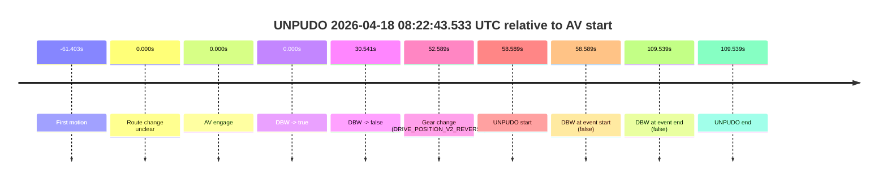
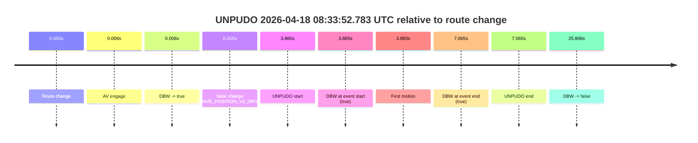
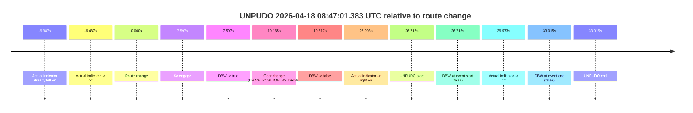

# Run Report: fme20002/2026-04-18--07-51-20--gen2-av-63d44bc9-3852-488f-bae8-ae90e778ebf0

| Field | Value |
|---|---|
| Run ID | `fme20002/2026-04-18--07-51-20--gen2-av-63d44bc9-3852-488f-bae8-ae90e778ebf0` |
| Date | `2026-04-18` |
| Model(s) | `pink-manta-ray-smooth` |
| Author | `guy.geva` |
| Event count | `3` |

## unpudo 2026-04-18 08:22:43.533 UTC

| Field | Value |
|---|---|
| Model | `pink-manta-ray-smooth` |
| Author | `guy.geva` |
| Run ID | `fme20002/2026-04-18--07-51-20--gen2-av-63d44bc9-3852-488f-bae8-ae90e778ebf0` |
| Date | `2026-04-18` |
| Time (UTC) | `08:22:43.533` |
| Event type | `unpudo` |
| Disengagement type | `none observed` |
| Route change | `unclear` |
| Console | [run](https://console.sso.wayve.ai/run/fme20002/2026-04-18--07-51-20--gen2-av-63d44bc9-3852-488f-bae8-ae90e778ebf0?id=&time-unixus=1776500563533300) |
| Foxglove | [segment](https://app.foxglove.dev/wayve-on-prem/p/prj_0dX18KZdVHg1fmmI/view?ds=foxglove-stream&ds.deviceName=fme20002&ds.start=2026-04-18T08%3A21%3A34.944155Z&ds.end=2026-04-18T08%3A23%3A44.483304Z&layoutId=lay_0e7VD4WIKDQGU73Y&time=2026-04-18T08%3A22%3A43.533300Z) |

### Event card: fail

- Fail: the credited unpudo does not stay AV-owned. The event window starts with DBW false, and the maneuver outcome lands outside a clean AV-owned segment.

| Event | Time (UTC) | Delta from AV start |
|---|---:|---:|
| First motion | 2026-04-18 08:20:43.541 | `-61.403s` |
| Route change unclear | 2026-04-18 08:21:44.944 | `0.000s` |
| AV engage | 2026-04-18 08:21:44.944 | `0.000s` |
| DBW -> true | 2026-04-18 08:21:44.944 | `0.000s` |
| DBW -> false | 2026-04-18 08:22:15.484 | `30.541s` |
| Gear change (DRIVE_POSITION_V2_REVERSE) | 2026-04-18 08:22:37.533 | `52.589s` |
| UNPUDO start | 2026-04-18 08:22:43.533 | `58.589s` |
| DBW at event start (false) | 2026-04-18 08:22:43.533 | `58.589s` |
| DBW at event end (false) | 2026-04-18 08:23:34.483 | `109.539s` |
| UNPUDO end | 2026-04-18 08:23:34.483 | `109.539s` |

| Metric | Value |
|---|---|
| Outcome | `fail` |
| Effective failure type | `completed_outside_av` |
| Route change status | `unclear` |
| DBW at event start | `false` |
| DBW at event end | `false` |
| Predicted gear at AV start | `DRIVE_POSITION_V2_DRIVE` |
| Actual gear at AV start | `DRIVE_POSITION_V2_DRIVE` |
| Predicted gear at event start | `DRIVE_POSITION_V2_REVERSE` |
| Actual gear at event start | `DRIVE_POSITION_V2_REVERSE` |
| Planned indicator direction | `INDICATORS_STATE_V2_OFF` |
| Controller indicator direction | `INDICATORS_STATE_V2_OFF` |
| Actual indicator direction | `INDICATORS_STATE_V2_OFF` |
| Actual indicator at maneuver end | `INDICATORS_STATE_V2_OFF` |
| Driver accel help in AV | `false` |
| Driver accel help timestamp | `n/a` |
| Max accel pedal pct in AV | `0.0%` |
| Max brake pedal pct in AV | `0.0%` |
| Max speed mps in AV | `8.353` |
| Success timing baseline | `AV start` |
| Route -> AV | `n/a` |
| AV -> event start | `58.589s` |
| AV -> first motion | `-61.403s` |
| Success baseline -> event start | `58.589s` |
| Success baseline -> first motion | `-61.403s` |
| AV duration before disengagement | `30.541s` |
| Trajectory waypoint count | `36` |
| Driving-plan step count | `11` |

The scored portion starts from the AV-owned window, not from the pre-AV setup. Route-change search in the stopped pre-event segment was `unclear`, with the baseline therefore set to AV start. At the event anchor the model predicts `DRIVE_POSITION_V2_REVERSE` and the actual gear is `DRIVE_POSITION_V2_REVERSE`. The effective model outcome is `fail` because `completed_outside_av.`

### Resolution

| Field | Value |
|---|---|
| Final outcome | `fail` |
| Do we agree with this label? | `yes` |
| Source disengagement type | `none observed` |
| Resolved effective failure type | `completed_outside_av` |
| Confidence | `medium` |

## unpudo 2026-04-18 08:33:52.783 UTC

| Field | Value |
|---|---|
| Model | `pink-manta-ray-smooth` |
| Author | `guy.geva` |
| Run ID | `fme20002/2026-04-18--07-51-20--gen2-av-63d44bc9-3852-488f-bae8-ae90e778ebf0` |
| Date | `2026-04-18` |
| Time (UTC) | `08:33:52.783` |
| Event type | `unpudo` |
| Disengagement type | `none observed` |
| Route change | `found` |
| Console | [run](https://console.sso.wayve.ai/run/fme20002/2026-04-18--07-51-20--gen2-av-63d44bc9-3852-488f-bae8-ae90e778ebf0?id=&time-unixus=1776501232783321) |
| Foxglove | [segment](https://app.foxglove.dev/wayve-on-prem/p/prj_0dX18KZdVHg1fmmI/view?ds=foxglove-stream&ds.deviceName=fme20002&ds.start=2026-04-18T08%3A33%3A38.918261Z&ds.end=2026-04-18T08%3A34%3A24.724097Z&layoutId=lay_0e7VD4WIKDQGU73Y&time=2026-04-18T08%3A33%3A52.783321Z) |

### Event card: pass

- Pass: AV owns the credited unpudo from route change through the official unpudo window, the gear state is aligned at the anchor, and the vehicle moves without driver accelerator help in AV.

| Event | Time (UTC) | Delta from route change |
|---|---:|---:|
| Route change | 2026-04-18 08:33:48.918 | `0.000s` |
| AV engage | 2026-04-18 08:33:48.924 | `0.006s` |
| DBW -> true | 2026-04-18 08:33:48.924 | `0.006s` |
| Gear change (DRIVE_POSITION_V2_DRIVE) | 2026-04-18 08:33:49.183 | `0.265s` |
| UNPUDO start | 2026-04-18 08:33:52.783 | `3.865s` |
| DBW at event start (true) | 2026-04-18 08:33:52.783 | `3.865s` |
| First motion | 2026-04-18 08:33:52.801 | `3.883s` |
| DBW at event end (true) | 2026-04-18 08:33:55.983 | `7.065s` |
| UNPUDO end | 2026-04-18 08:33:55.983 | `7.065s` |
| DBW -> false | 2026-04-18 08:34:14.724 | `25.806s` |

| Metric | Value |
|---|---|
| Outcome | `pass` |
| Effective failure type | `none` |
| Route change status | `found` |
| DBW at event start | `true` |
| DBW at event end | `true` |
| Predicted gear at AV start | `DRIVE_POSITION_V2_PARK` |
| Actual gear at AV start | `DRIVE_POSITION_V2_PARK` |
| Predicted gear at event start | `DRIVE_POSITION_V2_DRIVE` |
| Actual gear at event start | `DRIVE_POSITION_V2_DRIVE` |
| Planned indicator direction | `INDICATORS_STATE_V2_OFF` |
| Controller indicator direction | `INDICATORS_STATE_V2_OFF` |
| Actual indicator direction | `INDICATORS_STATE_V2_OFF` |
| Actual indicator at maneuver end | `INDICATORS_STATE_V2_OFF` |
| Driver accel help in AV | `false` |
| Driver accel help timestamp | `n/a` |
| Max accel pedal pct in AV | `0.0%` |
| Max brake pedal pct in AV | `9.5%` |
| Max speed mps in AV | `5.617` |
| Success timing baseline | `route change` |
| Route -> AV | `0.006s` |
| AV -> event start | `3.859s` |
| AV -> first motion | `3.877s` |
| Success baseline -> event start | `3.865s` |
| Success baseline -> first motion | `3.883s` |
| AV duration before disengagement | `25.800s` |
| Trajectory waypoint count | `37` |
| Driving-plan step count | `11` |

The scored portion starts from the AV-owned window, not from the pre-AV setup. Route-change search in the stopped pre-event segment was `found`, with the baseline therefore set to route change. At the event anchor the model predicts `DRIVE_POSITION_V2_DRIVE` and the actual gear is `DRIVE_POSITION_V2_DRIVE`. The effective model outcome is `pass` because `the credited unpudo stays AV-owned through the official unpudo window.`

### Resolution

| Field | Value |
|---|---|
| Final outcome | `pass` |
| Do we agree with this label? | `yes` |
| Source disengagement type | `none observed` |
| Resolved effective failure type | `none` |
| Confidence | `high` |

## unpudo 2026-04-18 08:47:01.383 UTC

| Field | Value |
|---|---|
| Model | `pink-manta-ray-smooth` |
| Author | `guy.geva` |
| Run ID | `fme20002/2026-04-18--07-51-20--gen2-av-63d44bc9-3852-488f-bae8-ae90e778ebf0` |
| Date | `2026-04-18` |
| Time (UTC) | `08:47:01.383` |
| Event type | `unpudo` |
| Disengagement type | `none observed` |
| Route change | `found` |
| Console | [run](https://console.sso.wayve.ai/run/fme20002/2026-04-18--07-51-20--gen2-av-63d44bc9-3852-488f-bae8-ae90e778ebf0?id=&time-unixus=1776502021383296) |
| Foxglove | [segment](https://app.foxglove.dev/wayve-on-prem/p/prj_0dX18KZdVHg1fmmI/view?ds=foxglove-stream&ds.deviceName=fme20002&ds.start=2026-04-18T08%3A46%3A24.668265Z&ds.end=2026-04-18T08%3A47%3A17.683297Z&layoutId=lay_0e7VD4WIKDQGU73Y&time=2026-04-18T08%3A47%3A01.383296Z) |

### Event card: fail

- Fail: the credited unpudo does not stay AV-owned. The event window starts with DBW false, and the maneuver outcome lands outside a clean AV-owned segment.

| Event | Time (UTC) | Delta from route change |
|---|---:|---:|
| Actual indicator already left on | 2026-04-18 08:46:24.681 | `-9.987s` |
| Actual indicator -> off | 2026-04-18 08:46:28.181 | `-6.487s` |
| Route change | 2026-04-18 08:46:34.668 | `0.000s` |
| AV engage | 2026-04-18 08:46:42.264 | `7.597s` |
| DBW -> true | 2026-04-18 08:46:42.264 | `7.597s` |
| Gear change (DRIVE_POSITION_V2_DRIVE) | 2026-04-18 08:46:53.833 | `19.165s` |
| DBW -> false | 2026-04-18 08:46:54.484 | `19.817s` |
| Actual indicator -> right on | 2026-04-18 08:46:59.761 | `25.093s` |
| UNPUDO start | 2026-04-18 08:47:01.383 | `26.715s` |
| DBW at event start (false) | 2026-04-18 08:47:01.383 | `26.715s` |
| Actual indicator -> off | 2026-04-18 08:47:04.241 | `29.573s` |
| DBW at event end (false) | 2026-04-18 08:47:07.683 | `33.015s` |
| UNPUDO end | 2026-04-18 08:47:07.683 | `33.015s` |

| Metric | Value |
|---|---|
| Outcome | `fail` |
| Effective failure type | `not_av_owned` |
| Route change status | `found` |
| DBW at event start | `false` |
| DBW at event end | `false` |
| Predicted gear at AV start | `DRIVE_POSITION_V2_DRIVE` |
| Actual gear at AV start | `DRIVE_POSITION_V2_DRIVE` |
| Predicted gear at event start | `DRIVE_POSITION_V2_DRIVE` |
| Actual gear at event start | `DRIVE_POSITION_V2_DRIVE` |
| Planned indicator direction | `INDICATORS_STATE_V2_LEFT_ON` |
| Controller indicator direction | `INDICATORS_STATE_V2_LEFT_ON` |
| Actual indicator direction | `INDICATORS_STATE_V2_RIGHT_ON` |
| Actual indicator at maneuver end | `INDICATORS_STATE_V2_OFF` |
| Driver accel help in AV | `false` |
| Driver accel help timestamp | `n/a` |
| Max accel pedal pct in AV | `0.0%` |
| Max brake pedal pct in AV | `9.8%` |
| Max speed mps in AV | `0.000` |
| Success timing baseline | `route change` |
| Route -> AV | `7.597s` |
| AV -> event start | `19.118s` |
| AV -> first motion | `n/a` |
| Success baseline -> event start | `26.715s` |
| Success baseline -> first motion | `n/a` |
| AV duration before disengagement | `12.220s` |
| Trajectory waypoint count | `37` |
| Driving-plan step count | `11` |

The scored portion starts from the AV-owned window, not from the pre-AV setup. Route-change search in the stopped pre-event segment was `found`, with the baseline therefore set to route change. At the event anchor the model predicts `DRIVE_POSITION_V2_DRIVE` and the actual gear is `DRIVE_POSITION_V2_DRIVE`. The effective model outcome is `fail` because `not_av_owned.`

### Resolution

| Field | Value |
|---|---|
| Final outcome | `fail` |
| Do we agree with this label? | `yes` |
| Source disengagement type | `none observed` |
| Resolved effective failure type | `not_av_owned` |
| Confidence | `high` |
