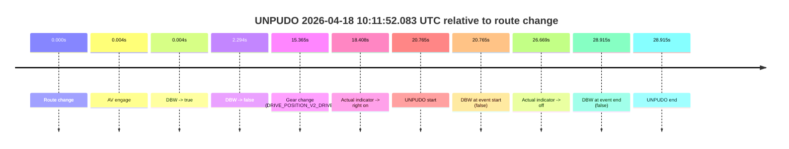
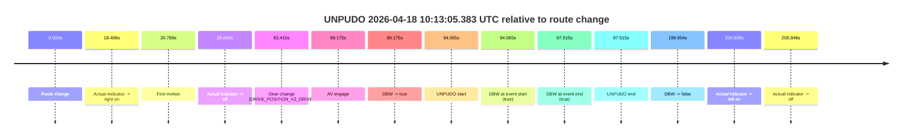

# Run Report: fme20002/2026-04-18--10-01-25--gen2-av-438f0c23-6c0e-4d8f-88f4-2f9574da2fbc

| Field | Value |
|---|---|
| Run ID | `fme20002/2026-04-18--10-01-25--gen2-av-438f0c23-6c0e-4d8f-88f4-2f9574da2fbc` |
| Date | `2026-04-18` |
| Model(s) | `pink-manta-ray-smooth` |
| Author | `guy.geva` |
| Event count | `2` |

## unpudo 2026-04-18 10:11:52.083 UTC

| Field | Value |
|---|---|
| Model | `pink-manta-ray-smooth` |
| Author | `guy.geva` |
| Run ID | `fme20002/2026-04-18--10-01-25--gen2-av-438f0c23-6c0e-4d8f-88f4-2f9574da2fbc` |
| Date | `2026-04-18` |
| Time (UTC) | `10:11:52.083` |
| Event type | `unpudo` |
| Disengagement type | `none observed` |
| Route change | `found` |
| Console | [run](https://console.sso.wayve.ai/run/fme20002/2026-04-18--10-01-25--gen2-av-438f0c23-6c0e-4d8f-88f4-2f9574da2fbc?id=&time-unixus=1776507112083303) |
| Foxglove | [segment](https://app.foxglove.dev/wayve-on-prem/p/prj_0dX18KZdVHg1fmmI/view?ds=foxglove-stream&ds.deviceName=fme20002&ds.start=2026-04-18T10%3A11%3A21.318280Z&ds.end=2026-04-18T10%3A12%3A10.233316Z&layoutId=lay_0e7VD4WIKDQGU73Y&time=2026-04-18T10%3A11%3A52.083303Z) |

### Event card: fail

- Fail: the credited unpudo does not stay AV-owned. The event window starts with DBW false, and the maneuver outcome lands outside a clean AV-owned segment.

| Event | Time (UTC) | Delta from route change |
|---|---:|---:|
| Route change | 2026-04-18 10:11:31.318 | `0.000s` |
| AV engage | 2026-04-18 10:11:31.322 | `0.004s` |
| DBW -> true | 2026-04-18 10:11:31.322 | `0.004s` |
| DBW -> false | 2026-04-18 10:11:33.612 | `2.294s` |
| Gear change (DRIVE_POSITION_V2_DRIVE) | 2026-04-18 10:11:46.683 | `15.365s` |
| Actual indicator -> right on | 2026-04-18 10:11:49.726 | `18.408s` |
| UNPUDO start | 2026-04-18 10:11:52.083 | `20.765s` |
| DBW at event start (false) | 2026-04-18 10:11:52.083 | `20.765s` |
| Actual indicator -> off | 2026-04-18 10:11:57.987 | `26.669s` |
| DBW at event end (false) | 2026-04-18 10:12:00.233 | `28.915s` |
| UNPUDO end | 2026-04-18 10:12:00.233 | `28.915s` |

| Metric | Value |
|---|---|
| Outcome | `fail` |
| Effective failure type | `not_av_owned` |
| Route change status | `found` |
| DBW at event start | `false` |
| DBW at event end | `false` |
| Predicted gear at AV start | `DRIVE_POSITION_V2_DRIVE` |
| Actual gear at AV start | `DRIVE_POSITION_V2_NEUTRAL` |
| Predicted gear at event start | `DRIVE_POSITION_V2_DRIVE` |
| Actual gear at event start | `DRIVE_POSITION_V2_DRIVE` |
| Planned indicator direction | `INDICATORS_STATE_V2_LEFT_ON` |
| Controller indicator direction | `INDICATORS_STATE_V2_LEFT_ON` |
| Actual indicator direction | `INDICATORS_STATE_V2_RIGHT_ON` |
| Actual indicator at maneuver end | `INDICATORS_STATE_V2_OFF` |
| Driver accel help in AV | `false` |
| Driver accel help timestamp | `n/a` |
| Max accel pedal pct in AV | `0.0%` |
| Max brake pedal pct in AV | `14.7%` |
| Max speed mps in AV | `0.000` |
| Success timing baseline | `route change` |
| Route -> AV | `0.004s` |
| AV -> event start | `20.761s` |
| AV -> first motion | `n/a` |
| Success baseline -> event start | `20.765s` |
| Success baseline -> first motion | `n/a` |
| AV duration before disengagement | `2.290s` |
| Trajectory waypoint count | `37` |
| Driving-plan step count | `11` |

The scored portion starts from the AV-owned window, not from the pre-AV setup. Route-change search in the stopped pre-event segment was `found`, with the baseline therefore set to route change. At the event anchor the model predicts `DRIVE_POSITION_V2_DRIVE` and the actual gear is `DRIVE_POSITION_V2_DRIVE`. The effective model outcome is `fail` because `not_av_owned.`

### Resolution

| Field | Value |
|---|---|
| Final outcome | `fail` |
| Do we agree with this label? | `yes` |
| Source disengagement type | `none observed` |
| Resolved effective failure type | `not_av_owned` |
| Confidence | `high` |

## unpudo 2026-04-18 10:13:05.383 UTC

| Field | Value |
|---|---|
| Model | `pink-manta-ray-smooth` |
| Author | `guy.geva` |
| Run ID | `fme20002/2026-04-18--10-01-25--gen2-av-438f0c23-6c0e-4d8f-88f4-2f9574da2fbc` |
| Date | `2026-04-18` |
| Time (UTC) | `10:13:05.383` |
| Event type | `unpudo` |
| Disengagement type | `none observed` |
| Route change | `found` |
| Console | [run](https://console.sso.wayve.ai/run/fme20002/2026-04-18--10-01-25--gen2-av-438f0c23-6c0e-4d8f-88f4-2f9574da2fbc?id=&time-unixus=1776507185383311) |
| Foxglove | [segment](https://app.foxglove.dev/wayve-on-prem/p/prj_0dX18KZdVHg1fmmI/view?ds=foxglove-stream&ds.deviceName=fme20002&ds.start=2026-04-18T10%3A11%3A21.318280Z&ds.end=2026-04-18T10%3A15%3A00.271900Z&layoutId=lay_0e7VD4WIKDQGU73Y&time=2026-04-18T10%3A13%3A05.383311Z) |

### Event card: pass

- Pass: AV owns the credited unpudo from route change through the official unpudo window, the gear state is aligned at the anchor, and the vehicle moves without driver accelerator help in AV.

| Event | Time (UTC) | Delta from route change |
|---|---:|---:|
| Route change | 2026-04-18 10:11:31.318 | `0.000s` |
| Actual indicator -> right on | 2026-04-18 10:11:49.726 | `18.408s` |
| First motion | 2026-04-18 10:11:52.107 | `20.789s` |
| Actual indicator -> off | 2026-04-18 10:11:57.987 | `26.669s` |
| Gear change (DRIVE_POSITION_V2_DRIVE) | 2026-04-18 10:12:53.733 | `82.415s` |
| AV engage | 2026-04-18 10:13:00.492 | `89.175s` |
| DBW -> true | 2026-04-18 10:13:00.492 | `89.175s` |
| UNPUDO start | 2026-04-18 10:13:05.383 | `94.065s` |
| DBW at event start (true) | 2026-04-18 10:13:05.383 | `94.065s` |
| DBW at event end (true) | 2026-04-18 10:13:08.833 | `97.515s` |
| UNPUDO end | 2026-04-18 10:13:08.833 | `97.515s` |
| DBW -> false | 2026-04-18 10:14:50.271 | `198.954s` |
| Actual indicator -> left on | 2026-04-18 10:14:52.127 | `200.809s` |
| Actual indicator -> off | 2026-04-18 10:14:57.166 | `205.848s` |

| Metric | Value |
|---|---|
| Outcome | `pass` |
| Effective failure type | `none` |
| Route change status | `found` |
| DBW at event start | `true` |
| DBW at event end | `true` |
| Predicted gear at AV start | `DRIVE_POSITION_V2_DRIVE` |
| Actual gear at AV start | `DRIVE_POSITION_V2_DRIVE` |
| Predicted gear at event start | `DRIVE_POSITION_V2_DRIVE` |
| Actual gear at event start | `DRIVE_POSITION_V2_DRIVE` |
| Planned indicator direction | `INDICATORS_STATE_V2_RIGHT_ON` |
| Controller indicator direction | `INDICATORS_STATE_V2_RIGHT_ON` |
| Actual indicator direction | `INDICATORS_STATE_V2_OFF` |
| Actual indicator at maneuver end | `INDICATORS_STATE_V2_OFF` |
| Driver accel help in AV | `false` |
| Driver accel help timestamp | `n/a` |
| Max accel pedal pct in AV | `0.0%` |
| Max brake pedal pct in AV | `8.0%` |
| Max speed mps in AV | `5.028` |
| Success timing baseline | `route change` |
| Route -> AV | `89.175s` |
| AV -> event start | `4.890s` |
| AV -> first motion | `-68.386s` |
| Success baseline -> event start | `94.065s` |
| Success baseline -> first motion | `20.789s` |
| AV duration before disengagement | `109.779s` |
| Trajectory waypoint count | `37` |
| Driving-plan step count | `11` |

The scored portion starts from the AV-owned window, not from the pre-AV setup. Route-change search in the stopped pre-event segment was `found`, with the baseline therefore set to route change. At the event anchor the model predicts `DRIVE_POSITION_V2_DRIVE` and the actual gear is `DRIVE_POSITION_V2_DRIVE`. The effective model outcome is `pass` because `the credited unpudo stays AV-owned through the official unpudo window.`

### Resolution

| Field | Value |
|---|---|
| Final outcome | `pass` |
| Do we agree with this label? | `yes` |
| Source disengagement type | `none observed` |
| Resolved effective failure type | `none` |
| Confidence | `high` |
