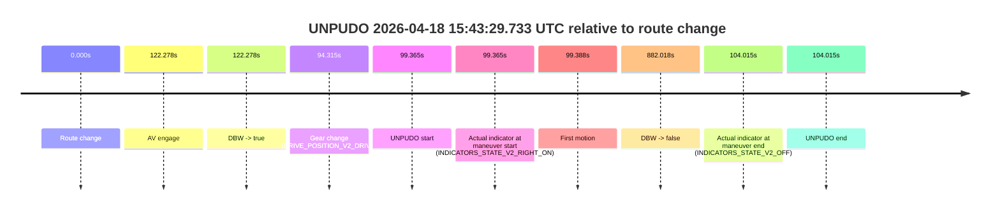
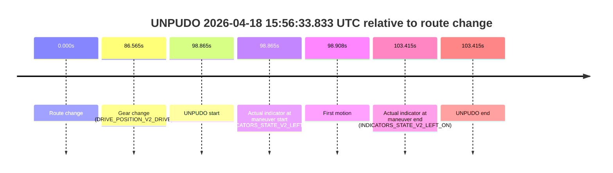

# Run Report: fme20002/2026-04-18--15-33-20--gen2-av-4e8801a7-8292-4750-a65c-237f1a683f8e

| Field | Value |
|---|---|
| Run ID | `fme20002/2026-04-18--15-33-20--gen2-av-4e8801a7-8292-4750-a65c-237f1a683f8e` |
| Date | `2026-04-18` |
| Model(s) | `armadillo-amethyst-squeaky` |
| Author | `guy.geva` |
| Event count | `4` |

## unpudo 2026-04-18 15:43:29.733 UTC

| Field | Value |
|---|---|
| Model | `armadillo-amethyst-squeaky` |
| Author | `guy.geva` |
| Run ID | `fme20002/2026-04-18--15-33-20--gen2-av-4e8801a7-8292-4750-a65c-237f1a683f8e` |
| Date | `2026-04-18` |
| Time (UTC) | `15:43:29.733` |
| Event type | `unpudo` |
| Disengagement type | `none observed` |
| Route change | `found` |
| Console | [run](https://console.sso.wayve.ai/run/fme20002/2026-04-18--15-33-20--gen2-av-4e8801a7-8292-4750-a65c-237f1a683f8e?id=&time-unixus=1776527009733296) |
| Foxglove | [segment](https://app.foxglove.dev/wayve-on-prem/p/prj_0dX18KZdVHg1fmmI/view?ds=foxglove-stream&ds.deviceName=fme20002&ds.start=2026-04-18T15%3A41%3A40.368238Z&ds.end=2026-04-18T15%3A56%3A42.386316Z&layoutId=lay_0e7VD4WIKDQGU73Y&time=2026-04-18T15%3A43%3A29.733296Z) |

### Event card: fail

- Fail: the credited unpudo does not stay AV-owned. The event window starts with DBW false, and the maneuver outcome lands outside a clean AV-owned segment.

| Event | Time (UTC) | Delta from route change |
|---|---:|---:|
| Route change | 2026-04-18 15:41:50.368 | `0.000s` |
| AV engage | 2026-04-18 15:43:52.646 | `122.278s` |
| DBW -> true | 2026-04-18 15:43:52.646 | `122.278s` |
| Gear change (DRIVE_POSITION_V2_DRIVE) | 2026-04-18 15:43:24.683 | `94.315s` |
| UNPUDO start | 2026-04-18 15:43:29.733 | `99.365s` |
| Actual indicator at maneuver start (INDICATORS_STATE_V2_RIGHT_ON) | 2026-04-18 15:43:29.733 | `99.365s` |
| First motion | 2026-04-18 15:43:29.756 | `99.388s` |
| DBW -> false | 2026-04-18 15:56:32.386 | `882.018s` |
| Actual indicator at maneuver end (INDICATORS_STATE_V2_OFF) | 2026-04-18 15:43:34.383 | `104.015s` |
| UNPUDO end | 2026-04-18 15:43:34.383 | `104.015s` |

| Metric | Value |
|---|---|
| Outcome | `fail` |
| Effective failure type | `completed_outside_av` |
| Route change status | `found` |
| DBW at event start | `false` |
| DBW at event end | `false` |
| Predicted gear at AV start | `DRIVE_POSITION_V2_DRIVE` |
| Actual gear at AV start | `DRIVE_POSITION_V2_DRIVE` |
| Predicted gear at event start | `DRIVE_POSITION_V2_DRIVE` |
| Actual gear at event start | `DRIVE_POSITION_V2_DRIVE` |
| Planned indicator direction | `INDICATORS_STATE_V2_OFF` |
| Controller indicator direction | `INDICATORS_STATE_V2_OFF` |
| Actual indicator direction | `INDICATORS_STATE_V2_RIGHT_ON` |
| Actual indicator at maneuver end | `INDICATORS_STATE_V2_OFF` |
| Driver accel help in AV | `false` |
| Driver accel help timestamp | `n/a` |
| Max accel pedal pct in AV | `0.0%` |
| Max brake pedal pct in AV | `0.0%` |
| Max speed mps in AV | `0.000` |
| Route -> AV | `122.278s` |
| AV -> event start | `-22.913s` |
| AV -> first motion | `-22.890s` |
| AV duration before disengagement | `759.740s` |
| Trajectory waypoint count | `35` |
| Driving-plan step count | `11` |

The scored portion starts from the AV-owned window, not from the pre-AV setup. Route-change search in the stopped pre-event segment was `found`, with the baseline therefore set to route change. At the event anchor the model predicts `DRIVE_POSITION_V2_DRIVE` and the actual gear is `DRIVE_POSITION_V2_DRIVE`. The effective model outcome is `fail` because `completed_outside_av`.

### Resolution

| Field | Value |
|---|---|
| Final outcome | `fail` |
| Do we agree with this label? | `yes` |
| Source disengagement type | `none observed` |
| Resolved effective failure type | `completed_outside_av` |
| Confidence | `high` |

## unpudo 2026-04-18 15:43:53.233 UTC

| Field | Value |
|---|---|
| Model | `armadillo-amethyst-squeaky` |
| Author | `guy.geva` |
| Run ID | `fme20002/2026-04-18--15-33-20--gen2-av-4e8801a7-8292-4750-a65c-237f1a683f8e` |
| Date | `2026-04-18` |
| Time (UTC) | `15:43:53.233` |
| Event type | `unpudo` |
| Disengagement type | `none observed` |
| Route change | `found` |
| Console | [run](https://console.sso.wayve.ai/run/fme20002/2026-04-18--15-33-20--gen2-av-4e8801a7-8292-4750-a65c-237f1a683f8e?id=&time-unixus=1776527033233301) |
| Foxglove | [segment](https://app.foxglove.dev/wayve-on-prem/p/prj_0dX18KZdVHg1fmmI/view?ds=foxglove-stream&ds.deviceName=fme20002&ds.start=2026-04-18T15%3A43%3A34.468274Z&ds.end=2026-04-18T15%3A56%3A42.386316Z&layoutId=lay_0e7VD4WIKDQGU73Y&time=2026-04-18T15%3A43%3A53.233301Z) |

### Event card: pass

- Pass: AV owns the credited unpudo through the official event window, the gear state is aligned at the anchor, and the vehicle moves without driver accelerator help in AV.

| Event | Time (UTC) | Delta from route change |
|---|---:|---:|
| Route change | 2026-04-18 15:43:44.468 | `0.000s` |
| AV engage | 2026-04-18 15:43:52.646 | `8.178s` |
| DBW -> true | 2026-04-18 15:43:52.646 | `8.178s` |
| Gear change (DRIVE_POSITION_V2_DRIVE) | 2026-04-18 15:43:45.483 | `1.015s` |
| UNPUDO start | 2026-04-18 15:43:53.233 | `8.765s` |
| Actual indicator at maneuver start (INDICATORS_STATE_V2_RIGHT_ON) | 2026-04-18 15:43:53.233 | `8.765s` |
| First motion | 2026-04-18 15:43:53.276 | `8.808s` |
| DBW -> false | 2026-04-18 15:56:32.386 | `767.918s` |
| Actual indicator at maneuver end (INDICATORS_STATE_V2_OFF) | 2026-04-18 15:43:56.583 | `12.115s` |
| UNPUDO end | 2026-04-18 15:43:56.583 | `12.115s` |

| Metric | Value |
|---|---|
| Outcome | `pass` |
| Effective failure type | `none` |
| Route change status | `found` |
| DBW at event start | `true` |
| DBW at event end | `true` |
| Predicted gear at AV start | `DRIVE_POSITION_V2_DRIVE` |
| Actual gear at AV start | `DRIVE_POSITION_V2_DRIVE` |
| Predicted gear at event start | `DRIVE_POSITION_V2_DRIVE` |
| Actual gear at event start | `DRIVE_POSITION_V2_DRIVE` |
| Planned indicator direction | `INDICATORS_STATE_V2_OFF` |
| Controller indicator direction | `INDICATORS_STATE_V2_OFF` |
| Actual indicator direction | `INDICATORS_STATE_V2_RIGHT_ON` |
| Actual indicator at maneuver end | `INDICATORS_STATE_V2_OFF` |
| Driver accel help in AV | `false` |
| Driver accel help timestamp | `n/a` |
| Max accel pedal pct in AV | `0.0%` |
| Max brake pedal pct in AV | `0.0%` |
| Max speed mps in AV | `5.047` |
| Route -> AV | `8.178s` |
| AV -> event start | `0.587s` |
| AV -> first motion | `0.630s` |
| AV duration before disengagement | `759.740s` |
| Trajectory waypoint count | `35` |
| Driving-plan step count | `11` |

The scored portion starts from the AV-owned window, not from the pre-AV setup. Route-change search in the stopped pre-event segment was `found`, with the baseline therefore set to route change. At the event anchor the model predicts `DRIVE_POSITION_V2_DRIVE` and the actual gear is `DRIVE_POSITION_V2_DRIVE`. The effective model outcome is `pass` because `the credited maneuver stays AV-owned through the official event end`.

### Resolution

| Field | Value |
|---|---|
| Final outcome | `pass` |
| Do we agree with this label? | `yes` |
| Source disengagement type | `none observed` |
| Resolved effective failure type | `none` |
| Confidence | `high` |

## unpudo 2026-04-18 15:52:58.583 UTC

| Field | Value |
|---|---|
| Model | `armadillo-amethyst-squeaky` |
| Author | `guy.geva` |
| Run ID | `fme20002/2026-04-18--15-33-20--gen2-av-4e8801a7-8292-4750-a65c-237f1a683f8e` |
| Date | `2026-04-18` |
| Time (UTC) | `15:52:58.583` |
| Event type | `unpudo` |
| Disengagement type | `none observed` |
| Route change | `found` |
| Console | [run](https://console.sso.wayve.ai/run/fme20002/2026-04-18--15-33-20--gen2-av-4e8801a7-8292-4750-a65c-237f1a683f8e?id=&time-unixus=1776527578583312) |
| Foxglove | [segment](https://app.foxglove.dev/wayve-on-prem/p/prj_0dX18KZdVHg1fmmI/view?ds=foxglove-stream&ds.deviceName=fme20002&ds.start=2026-04-18T15%3A43%3A42.646194Z&ds.end=2026-04-18T15%3A56%3A42.386316Z&layoutId=lay_0e7VD4WIKDQGU73Y&time=2026-04-18T15%3A52%3A58.583312Z) |

### Event card: pass

- Pass: AV owns the credited unpudo through the official event window, the gear state is aligned at the anchor, and the vehicle moves without driver accelerator help in AV.

| Event | Time (UTC) | Delta from route change |
|---|---:|---:|
| Route change | 2026-04-18 15:52:57.618 | `0.000s` |
| AV engage | 2026-04-18 15:43:52.646 | `-544.972s` |
| DBW -> true | 2026-04-18 15:43:52.646 | `-544.972s` |
| Gear change (DRIVE_POSITION_V2_DRIVE) | 2026-04-18 15:52:55.033 | `-2.585s` |
| UNPUDO start | 2026-04-18 15:52:58.583 | `0.965s` |
| Actual indicator at maneuver start (INDICATORS_STATE_V2_OFF) | 2026-04-18 15:52:58.583 | `0.965s` |
| First motion | 2026-04-18 15:52:58.636 | `1.018s` |
| DBW -> false | 2026-04-18 15:56:32.386 | `214.768s` |
| Actual indicator at maneuver end (INDICATORS_STATE_V2_OFF) | 2026-04-18 15:53:03.233 | `5.615s` |
| UNPUDO end | 2026-04-18 15:53:03.233 | `5.615s` |

| Metric | Value |
|---|---|
| Outcome | `pass` |
| Effective failure type | `none` |
| Route change status | `found` |
| DBW at event start | `true` |
| DBW at event end | `true` |
| Predicted gear at AV start | `DRIVE_POSITION_V2_DRIVE` |
| Actual gear at AV start | `DRIVE_POSITION_V2_DRIVE` |
| Predicted gear at event start | `DRIVE_POSITION_V2_DRIVE` |
| Actual gear at event start | `DRIVE_POSITION_V2_DRIVE` |
| Planned indicator direction | `INDICATORS_STATE_V2_OFF` |
| Controller indicator direction | `INDICATORS_STATE_V2_OFF` |
| Actual indicator direction | `INDICATORS_STATE_V2_OFF` |
| Actual indicator at maneuver end | `INDICATORS_STATE_V2_OFF` |
| Driver accel help in AV | `false` |
| Driver accel help timestamp | `n/a` |
| Max accel pedal pct in AV | `0.0%` |
| Max brake pedal pct in AV | `32.9%` |
| Max speed mps in AV | `8.283` |
| Route -> AV | `-544.972s` |
| AV -> event start | `545.937s` |
| AV -> first motion | `545.990s` |
| AV duration before disengagement | `759.740s` |
| Trajectory waypoint count | `36` |
| Driving-plan step count | `11` |

The scored portion starts from the AV-owned window, not from the pre-AV setup. Route-change search in the stopped pre-event segment was `found`, with the baseline therefore set to route change. At the event anchor the model predicts `DRIVE_POSITION_V2_DRIVE` and the actual gear is `DRIVE_POSITION_V2_DRIVE`. The effective model outcome is `pass` because `the credited maneuver stays AV-owned through the official event end`.

### Resolution

| Field | Value |
|---|---|
| Final outcome | `pass` |
| Do we agree with this label? | `yes` |
| Source disengagement type | `none observed` |
| Resolved effective failure type | `none` |
| Confidence | `high` |

## unpudo 2026-04-18 15:56:33.833 UTC

| Field | Value |
|---|---|
| Model | `armadillo-amethyst-squeaky` |
| Author | `guy.geva` |
| Run ID | `fme20002/2026-04-18--15-33-20--gen2-av-4e8801a7-8292-4750-a65c-237f1a683f8e` |
| Date | `2026-04-18` |
| Time (UTC) | `15:56:33.833` |
| Event type | `unpudo` |
| Disengagement type | `none observed` |
| Route change | `found` |
| Console | [run](https://console.sso.wayve.ai/run/fme20002/2026-04-18--15-33-20--gen2-av-4e8801a7-8292-4750-a65c-237f1a683f8e?id=&time-unixus=1776527793833315) |
| Foxglove | [segment](https://app.foxglove.dev/wayve-on-prem/p/prj_0dX18KZdVHg1fmmI/view?ds=foxglove-stream&ds.deviceName=fme20002&ds.start=2026-04-18T15%3A54%3A44.968262Z&ds.end=2026-04-18T15%3A56%3A48.383311Z&layoutId=lay_0e7VD4WIKDQGU73Y&time=2026-04-18T15%3A56%3A33.833315Z) |

### Event card: fail

- Fail: the credited unpudo does not stay AV-owned. The event window starts with DBW false, and the maneuver outcome lands outside a clean AV-owned segment.

| Event | Time (UTC) | Delta from route change |
|---|---:|---:|
| Route change | 2026-04-18 15:54:54.968 | `0.000s` |
| Gear change (DRIVE_POSITION_V2_DRIVE) | 2026-04-18 15:56:21.533 | `86.565s` |
| UNPUDO start | 2026-04-18 15:56:33.833 | `98.865s` |
| Actual indicator at maneuver start (INDICATORS_STATE_V2_LEFT_ON) | 2026-04-18 15:56:33.833 | `98.865s` |
| First motion | 2026-04-18 15:56:33.876 | `98.908s` |
| Actual indicator at maneuver end (INDICATORS_STATE_V2_LEFT_ON) | 2026-04-18 15:56:38.383 | `103.415s` |
| UNPUDO end | 2026-04-18 15:56:38.383 | `103.415s` |

| Metric | Value |
|---|---|
| Outcome | `fail` |
| Effective failure type | `not_av_owned` |
| Route change status | `found` |
| DBW at event start | `false` |
| DBW at event end | `false` |
| Predicted gear at AV start | `n/a` |
| Actual gear at AV start | `n/a` |
| Predicted gear at event start | `DRIVE_POSITION_V2_DRIVE` |
| Actual gear at event start | `DRIVE_POSITION_V2_DRIVE` |
| Planned indicator direction | `INDICATORS_STATE_V2_OFF` |
| Controller indicator direction | `INDICATORS_STATE_V2_OFF` |
| Actual indicator direction | `INDICATORS_STATE_V2_LEFT_ON` |
| Actual indicator at maneuver end | `INDICATORS_STATE_V2_LEFT_ON` |
| Driver accel help in AV | `false` |
| Driver accel help timestamp | `n/a` |
| Max accel pedal pct in AV | `0.0%` |
| Max brake pedal pct in AV | `0.0%` |
| Max speed mps in AV | `0.000` |
| Route -> AV | `n/a` |
| AV -> event start | `n/a` |
| AV -> first motion | `n/a` |
| AV duration before disengagement | `n/a` |
| Trajectory waypoint count | `35` |
| Driving-plan step count | `11` |

The scored portion starts from the AV-owned window, not from the pre-AV setup. Route-change search in the stopped pre-event segment was `found`, with the baseline therefore set to route change. At the event anchor the model predicts `DRIVE_POSITION_V2_DRIVE` and the actual gear is `DRIVE_POSITION_V2_DRIVE`. The effective model outcome is `fail` because `not_av_owned`.

### Resolution

| Field | Value |
|---|---|
| Final outcome | `fail` |
| Do we agree with this label? | `yes` |
| Source disengagement type | `none observed` |
| Resolved effective failure type | `not_av_owned` |
| Confidence | `high` |
