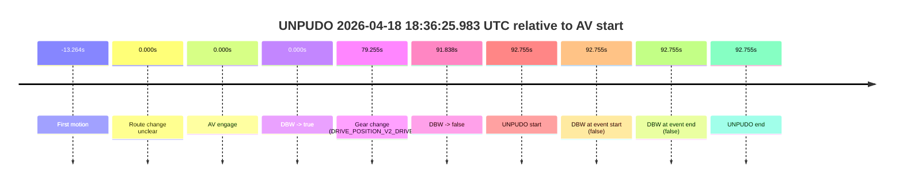
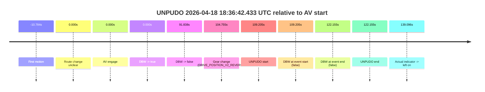
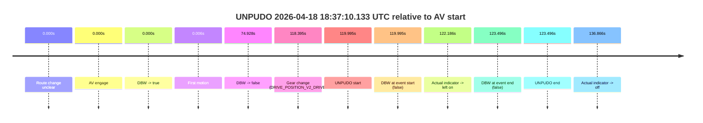
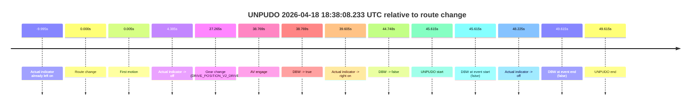

# Run Report: fme20002/2026-04-18--17-34-19--gen2-av-77b0276e-4dd4-4e7b-9741-57ed2d79f66f

| Field | Value |
|---|---|
| Run ID | `fme20002/2026-04-18--17-34-19--gen2-av-77b0276e-4dd4-4e7b-9741-57ed2d79f66f` |
| Date | `2026-04-18` |
| Model(s) | `armadillo-amethyst-squeaky` |
| Author | `guy.geva` |
| Event count | `4` |

## unpudo 2026-04-18 18:36:25.983 UTC

| Field | Value |
|---|---|
| Model | `armadillo-amethyst-squeaky` |
| Author | `guy.geva` |
| Run ID | `fme20002/2026-04-18--17-34-19--gen2-av-77b0276e-4dd4-4e7b-9741-57ed2d79f66f` |
| Date | `2026-04-18` |
| Time (UTC) | `18:36:25.983` |
| Event type | `unpudo` |
| Disengagement type | `none observed` |
| Route change | `unclear` |
| Console | [run](https://console.sso.wayve.ai/run/fme20002/2026-04-18--17-34-19--gen2-av-77b0276e-4dd4-4e7b-9741-57ed2d79f66f?id=&time-unixus=1776537385983300) |
| Foxglove | [segment](https://app.foxglove.dev/wayve-on-prem/p/prj_0dX18KZdVHg1fmmI/view?ds=foxglove-stream&ds.deviceName=fme20002&ds.start=2026-04-18T18%3A34%3A43.227904Z&ds.end=2026-04-18T18%3A36%3A35.983300Z&layoutId=lay_0e7VD4WIKDQGU73Y&time=2026-04-18T18%3A36%3A25.983300Z) |

### Event card: fail

- Fail: the credited unpudo does not stay AV-owned. The event window starts with DBW false, and the maneuver outcome lands outside a clean AV-owned segment.

| Event | Time (UTC) | Delta from AV start |
|---|---:|---:|
| First motion | 2026-04-18 18:34:39.963 | `-13.264s` |
| Route change unclear | 2026-04-18 18:34:53.227 | `0.000s` |
| AV engage | 2026-04-18 18:34:53.227 | `0.000s` |
| DBW -> true | 2026-04-18 18:34:53.227 | `0.000s` |
| Gear change (DRIVE_POSITION_V2_DRIVE) | 2026-04-18 18:36:12.483 | `79.255s` |
| DBW -> false | 2026-04-18 18:36:25.065 | `91.838s` |
| UNPUDO start | 2026-04-18 18:36:25.983 | `92.755s` |
| DBW at event start (false) | 2026-04-18 18:36:25.983 | `92.755s` |
| DBW at event end (false) | 2026-04-18 18:36:25.983 | `92.755s` |
| UNPUDO end | 2026-04-18 18:36:25.983 | `92.755s` |

| Metric | Value |
|---|---|
| Outcome | `fail` |
| Effective failure type | `completed_outside_av` |
| Route change status | `unclear` |
| DBW at event start | `false` |
| DBW at event end | `false` |
| Predicted gear at AV start | `DRIVE_POSITION_V2_DRIVE` |
| Actual gear at AV start | `DRIVE_POSITION_V2_DRIVE` |
| Predicted gear at event start | `DRIVE_POSITION_V2_DRIVE` |
| Actual gear at event start | `DRIVE_POSITION_V2_DRIVE` |
| Planned indicator direction | `INDICATORS_STATE_V2_OFF` |
| Controller indicator direction | `INDICATORS_STATE_V2_OFF` |
| Actual indicator direction | `INDICATORS_STATE_V2_OFF` |
| Actual indicator at maneuver end | `INDICATORS_STATE_V2_OFF` |
| Driver accel help in AV | `false` |
| Driver accel help timestamp | `n/a` |
| Max accel pedal pct in AV | `0.0%` |
| Max brake pedal pct in AV | `14.4%` |
| Max speed mps in AV | `6.872` |
| Success timing baseline | `AV start` |
| Route -> AV | `n/a` |
| AV -> event start | `92.755s` |
| AV -> first motion | `-13.264s` |
| Success baseline -> event start | `92.755s` |
| Success baseline -> first motion | `-13.264s` |
| AV duration before disengagement | `91.838s` |
| Trajectory waypoint count | `36` |
| Driving-plan step count | `11` |

The scored portion starts from the AV-owned window, not from the pre-AV setup. Route-change search in the stopped pre-event segment was `unclear`, with the baseline therefore set to AV start. At the event anchor the model predicts `DRIVE_POSITION_V2_DRIVE` and the actual gear is `DRIVE_POSITION_V2_DRIVE`. The effective model outcome is `fail` because `completed_outside_av.`

### Resolution

| Field | Value |
|---|---|
| Final outcome | `fail` |
| Do we agree with this label? | `yes` |
| Source disengagement type | `none observed` |
| Resolved effective failure type | `completed_outside_av` |
| Confidence | `medium` |

## unpudo 2026-04-18 18:36:42.433 UTC

| Field | Value |
|---|---|
| Model | `armadillo-amethyst-squeaky` |
| Author | `guy.geva` |
| Run ID | `fme20002/2026-04-18--17-34-19--gen2-av-77b0276e-4dd4-4e7b-9741-57ed2d79f66f` |
| Date | `2026-04-18` |
| Time (UTC) | `18:36:42.433` |
| Event type | `unpudo` |
| Disengagement type | `none observed` |
| Route change | `unclear` |
| Console | [run](https://console.sso.wayve.ai/run/fme20002/2026-04-18--17-34-19--gen2-av-77b0276e-4dd4-4e7b-9741-57ed2d79f66f?id=&time-unixus=1776537402433300) |
| Foxglove | [segment](https://app.foxglove.dev/wayve-on-prem/p/prj_0dX18KZdVHg1fmmI/view?ds=foxglove-stream&ds.deviceName=fme20002&ds.start=2026-04-18T18%3A34%3A43.227904Z&ds.end=2026-04-18T18%3A37%3A05.383317Z&layoutId=lay_0e7VD4WIKDQGU73Y&time=2026-04-18T18%3A36%3A42.433300Z) |

### Event card: fail

- Fail: the credited unpudo does not stay AV-owned. The event window starts with DBW false, and the maneuver outcome lands outside a clean AV-owned segment.

| Event | Time (UTC) | Delta from AV start |
|---|---:|---:|
| First motion | 2026-04-18 18:34:42.443 | `-10.784s` |
| Route change unclear | 2026-04-18 18:34:53.227 | `0.000s` |
| AV engage | 2026-04-18 18:34:53.227 | `0.000s` |
| DBW -> true | 2026-04-18 18:34:53.227 | `0.000s` |
| DBW -> false | 2026-04-18 18:36:25.065 | `91.838s` |
| Gear change (DRIVE_POSITION_V2_REVERSE) | 2026-04-18 18:36:37.983 | `104.755s` |
| UNPUDO start | 2026-04-18 18:36:42.433 | `109.205s` |
| DBW at event start (false) | 2026-04-18 18:36:42.433 | `109.205s` |
| DBW at event end (false) | 2026-04-18 18:36:55.383 | `122.155s` |
| UNPUDO end | 2026-04-18 18:36:55.383 | `122.155s` |
| Actual indicator -> left on | 2026-04-18 18:37:12.323 | `139.096s` |

| Metric | Value |
|---|---|
| Outcome | `fail` |
| Effective failure type | `completed_outside_av` |
| Route change status | `unclear` |
| DBW at event start | `false` |
| DBW at event end | `false` |
| Predicted gear at AV start | `DRIVE_POSITION_V2_DRIVE` |
| Actual gear at AV start | `DRIVE_POSITION_V2_DRIVE` |
| Predicted gear at event start | `DRIVE_POSITION_V2_REVERSE` |
| Actual gear at event start | `DRIVE_POSITION_V2_REVERSE` |
| Planned indicator direction | `INDICATORS_STATE_V2_OFF` |
| Controller indicator direction | `INDICATORS_STATE_V2_OFF` |
| Actual indicator direction | `INDICATORS_STATE_V2_OFF` |
| Actual indicator at maneuver end | `INDICATORS_STATE_V2_OFF` |
| Driver accel help in AV | `false` |
| Driver accel help timestamp | `n/a` |
| Max accel pedal pct in AV | `0.0%` |
| Max brake pedal pct in AV | `14.4%` |
| Max speed mps in AV | `6.872` |
| Success timing baseline | `AV start` |
| Route -> AV | `n/a` |
| AV -> event start | `109.205s` |
| AV -> first motion | `-10.784s` |
| Success baseline -> event start | `109.205s` |
| Success baseline -> first motion | `-10.784s` |
| AV duration before disengagement | `91.838s` |
| Trajectory waypoint count | `35` |
| Driving-plan step count | `11` |

The scored portion starts from the AV-owned window, not from the pre-AV setup. Route-change search in the stopped pre-event segment was `unclear`, with the baseline therefore set to AV start. At the event anchor the model predicts `DRIVE_POSITION_V2_REVERSE` and the actual gear is `DRIVE_POSITION_V2_REVERSE`. The effective model outcome is `fail` because `completed_outside_av.`

### Resolution

| Field | Value |
|---|---|
| Final outcome | `fail` |
| Do we agree with this label? | `yes` |
| Source disengagement type | `none observed` |
| Resolved effective failure type | `completed_outside_av` |
| Confidence | `medium` |

## unpudo 2026-04-18 18:37:10.133 UTC

| Field | Value |
|---|---|
| Model | `armadillo-amethyst-squeaky` |
| Author | `guy.geva` |
| Run ID | `fme20002/2026-04-18--17-34-19--gen2-av-77b0276e-4dd4-4e7b-9741-57ed2d79f66f` |
| Date | `2026-04-18` |
| Time (UTC) | `18:37:10.133` |
| Event type | `unpudo` |
| Disengagement type | `none observed` |
| Route change | `unclear` |
| Console | [run](https://console.sso.wayve.ai/run/fme20002/2026-04-18--17-34-19--gen2-av-77b0276e-4dd4-4e7b-9741-57ed2d79f66f?id=&time-unixus=1776537430133304) |
| Foxglove | [segment](https://app.foxglove.dev/wayve-on-prem/p/prj_0dX18KZdVHg1fmmI/view?ds=foxglove-stream&ds.deviceName=fme20002&ds.start=2026-04-18T18%3A35%3A00.137808Z&ds.end=2026-04-18T18%3A37%3A23.633318Z&layoutId=lay_0e7VD4WIKDQGU73Y&time=2026-04-18T18%3A37%3A10.133304Z) |

### Event card: fail

- Fail: the credited unpudo does not stay AV-owned. The event window starts with DBW false, and the maneuver outcome lands outside a clean AV-owned segment.

| Event | Time (UTC) | Delta from AV start |
|---|---:|---:|
| Route change unclear | 2026-04-18 18:35:10.137 | `0.000s` |
| AV engage | 2026-04-18 18:35:10.137 | `0.000s` |
| DBW -> true | 2026-04-18 18:35:10.137 | `0.000s` |
| First motion | 2026-04-18 18:35:10.144 | `0.006s` |
| DBW -> false | 2026-04-18 18:36:25.065 | `74.928s` |
| Gear change (DRIVE_POSITION_V2_DRIVE) | 2026-04-18 18:37:08.533 | `118.395s` |
| UNPUDO start | 2026-04-18 18:37:10.133 | `119.995s` |
| DBW at event start (false) | 2026-04-18 18:37:10.133 | `119.995s` |
| Actual indicator -> left on | 2026-04-18 18:37:12.323 | `122.186s` |
| DBW at event end (false) | 2026-04-18 18:37:13.633 | `123.496s` |
| UNPUDO end | 2026-04-18 18:37:13.633 | `123.496s` |
| Actual indicator -> off | 2026-04-18 18:37:27.003 | `136.866s` |

| Metric | Value |
|---|---|
| Outcome | `fail` |
| Effective failure type | `not_av_owned` |
| Route change status | `unclear` |
| DBW at event start | `false` |
| DBW at event end | `false` |
| Predicted gear at AV start | `DRIVE_POSITION_V2_DRIVE` |
| Actual gear at AV start | `DRIVE_POSITION_V2_DRIVE` |
| Predicted gear at event start | `DRIVE_POSITION_V2_DRIVE` |
| Actual gear at event start | `DRIVE_POSITION_V2_DRIVE` |
| Planned indicator direction | `INDICATORS_STATE_V2_OFF` |
| Controller indicator direction | `INDICATORS_STATE_V2_OFF` |
| Actual indicator direction | `INDICATORS_STATE_V2_OFF` |
| Actual indicator at maneuver end | `INDICATORS_STATE_V2_LEFT_ON` |
| Driver accel help in AV | `false` |
| Driver accel help timestamp | `n/a` |
| Max accel pedal pct in AV | `0.0%` |
| Max brake pedal pct in AV | `14.4%` |
| Max speed mps in AV | `6.872` |
| Success timing baseline | `AV start` |
| Route -> AV | `n/a` |
| AV -> event start | `119.995s` |
| AV -> first motion | `0.006s` |
| Success baseline -> event start | `119.995s` |
| Success baseline -> first motion | `0.006s` |
| AV duration before disengagement | `74.928s` |
| Trajectory waypoint count | `35` |
| Driving-plan step count | `11` |

The scored portion starts from the AV-owned window, not from the pre-AV setup. Route-change search in the stopped pre-event segment was `unclear`, with the baseline therefore set to AV start. At the event anchor the model predicts `DRIVE_POSITION_V2_DRIVE` and the actual gear is `DRIVE_POSITION_V2_DRIVE`. The effective model outcome is `fail` because `not_av_owned.`

### Resolution

| Field | Value |
|---|---|
| Final outcome | `fail` |
| Do we agree with this label? | `yes` |
| Source disengagement type | `none observed` |
| Resolved effective failure type | `not_av_owned` |
| Confidence | `medium` |

## unpudo 2026-04-18 18:38:08.233 UTC

| Field | Value |
|---|---|
| Model | `armadillo-amethyst-squeaky` |
| Author | `guy.geva` |
| Run ID | `fme20002/2026-04-18--17-34-19--gen2-av-77b0276e-4dd4-4e7b-9741-57ed2d79f66f` |
| Date | `2026-04-18` |
| Time (UTC) | `18:38:08.233` |
| Event type | `unpudo` |
| Disengagement type | `none observed` |
| Route change | `found` |
| Console | [run](https://console.sso.wayve.ai/run/fme20002/2026-04-18--17-34-19--gen2-av-77b0276e-4dd4-4e7b-9741-57ed2d79f66f?id=&time-unixus=1776537488233311) |
| Foxglove | [segment](https://app.foxglove.dev/wayve-on-prem/p/prj_0dX18KZdVHg1fmmI/view?ds=foxglove-stream&ds.deviceName=fme20002&ds.start=2026-04-18T18%3A37%3A12.618510Z&ds.end=2026-04-18T18%3A38%3A22.233300Z&layoutId=lay_0e7VD4WIKDQGU73Y&time=2026-04-18T18%3A38%3A08.233311Z) |

### Event card: fail

- Fail: the credited unpudo does not stay AV-owned. The event window starts with DBW false, and the maneuver outcome lands outside a clean AV-owned segment.

| Event | Time (UTC) | Delta from route change |
|---|---:|---:|
| Actual indicator already left on | 2026-04-18 18:37:12.623 | `-9.995s` |
| Route change | 2026-04-18 18:37:22.618 | `0.000s` |
| First motion | 2026-04-18 18:37:22.623 | `0.005s` |
| Actual indicator -> off | 2026-04-18 18:37:27.003 | `4.385s` |
| Gear change (DRIVE_POSITION_V2_DRIVE) | 2026-04-18 18:37:49.883 | `27.265s` |
| AV engage | 2026-04-18 18:38:01.387 | `38.769s` |
| DBW -> true | 2026-04-18 18:38:01.387 | `38.769s` |
| Actual indicator -> right on | 2026-04-18 18:38:02.223 | `39.605s` |
| DBW -> false | 2026-04-18 18:38:07.366 | `44.748s` |
| UNPUDO start | 2026-04-18 18:38:08.233 | `45.615s` |
| DBW at event start (false) | 2026-04-18 18:38:08.233 | `45.615s` |
| Actual indicator -> off | 2026-04-18 18:38:10.843 | `48.225s` |
| DBW at event end (false) | 2026-04-18 18:38:12.233 | `49.615s` |
| UNPUDO end | 2026-04-18 18:38:12.233 | `49.615s` |

| Metric | Value |
|---|---|
| Outcome | `fail` |
| Effective failure type | `completed_outside_av` |
| Route change status | `found` |
| DBW at event start | `false` |
| DBW at event end | `false` |
| Predicted gear at AV start | `DRIVE_POSITION_V2_DRIVE` |
| Actual gear at AV start | `DRIVE_POSITION_V2_DRIVE` |
| Predicted gear at event start | `DRIVE_POSITION_V2_DRIVE` |
| Actual gear at event start | `DRIVE_POSITION_V2_DRIVE` |
| Planned indicator direction | `INDICATORS_STATE_V2_RIGHT_ON` |
| Controller indicator direction | `INDICATORS_STATE_V2_RIGHT_ON` |
| Actual indicator direction | `INDICATORS_STATE_V2_RIGHT_ON` |
| Actual indicator at maneuver end | `INDICATORS_STATE_V2_OFF` |
| Driver accel help in AV | `false` |
| Driver accel help timestamp | `n/a` |
| Max accel pedal pct in AV | `0.0%` |
| Max brake pedal pct in AV | `8.0%` |
| Max speed mps in AV | `0.000` |
| Success timing baseline | `route change` |
| Route -> AV | `38.769s` |
| AV -> event start | `6.846s` |
| AV -> first motion | `-38.763s` |
| Success baseline -> event start | `45.615s` |
| Success baseline -> first motion | `0.005s` |
| AV duration before disengagement | `5.980s` |
| Trajectory waypoint count | `37` |
| Driving-plan step count | `11` |

The scored portion starts from the AV-owned window, not from the pre-AV setup. Route-change search in the stopped pre-event segment was `found`, with the baseline therefore set to route change. At the event anchor the model predicts `DRIVE_POSITION_V2_DRIVE` and the actual gear is `DRIVE_POSITION_V2_DRIVE`. The effective model outcome is `fail` because `completed_outside_av.`

### Resolution

| Field | Value |
|---|---|
| Final outcome | `fail` |
| Do we agree with this label? | `yes` |
| Source disengagement type | `none observed` |
| Resolved effective failure type | `completed_outside_av` |
| Confidence | `high` |
