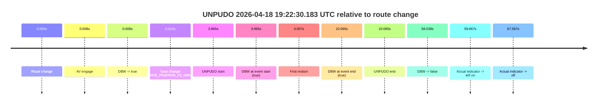
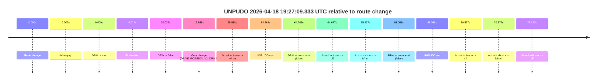
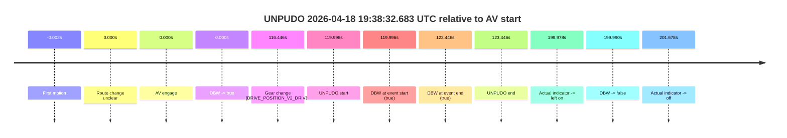
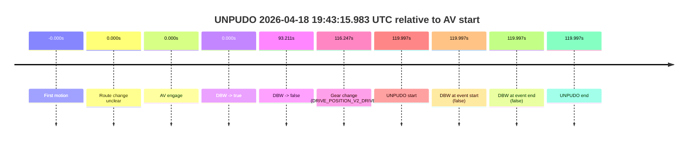
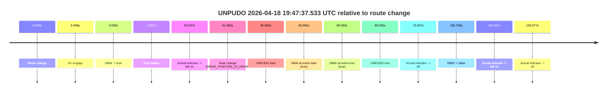

# Run Report: fme20002/2026-04-18--19-15-35--gen2-av-5854f931-35f6-449b-83bc-06f77637cb31

| Field | Value |
|---|---|
| Run ID | `fme20002/2026-04-18--19-15-35--gen2-av-5854f931-35f6-449b-83bc-06f77637cb31` |
| Date | `2026-04-18` |
| Model(s) | `armadillo-amethyst-squeaky` |
| Author | `guy.geva` |
| Event count | `5` |

## unpudo 2026-04-18 19:22:30.183 UTC

| Field | Value |
|---|---|
| Model | `armadillo-amethyst-squeaky` |
| Author | `guy.geva` |
| Run ID | `fme20002/2026-04-18--19-15-35--gen2-av-5854f931-35f6-449b-83bc-06f77637cb31` |
| Date | `2026-04-18` |
| Time (UTC) | `19:22:30.183` |
| Event type | `unpudo` |
| Disengagement type | `none observed` |
| Route change | `found` |
| Console | [run](https://console.sso.wayve.ai/run/fme20002/2026-04-18--19-15-35--gen2-av-5854f931-35f6-449b-83bc-06f77637cb31?id=&time-unixus=1776540150183302) |
| Foxglove | [segment](https://app.foxglove.dev/wayve-on-prem/p/prj_0dX18KZdVHg1fmmI/view?ds=foxglove-stream&ds.deviceName=fme20002&ds.start=2026-04-18T19%3A22%3A16.218356Z&ds.end=2026-04-18T19%3A23%3A34.256690Z&layoutId=lay_0e7VD4WIKDQGU73Y&time=2026-04-18T19%3A22%3A30.183302Z) |

### Event card: pass

- Pass: AV owns the credited unpudo from route change through the official unpudo window, the gear state is aligned at the anchor, and the vehicle moves without driver accelerator help in AV.

| Event | Time (UTC) | Delta from route change |
|---|---:|---:|
| Route change | 2026-04-18 19:22:26.218 | `0.000s` |
| AV engage | 2026-04-18 19:22:26.226 | `0.008s` |
| DBW -> true | 2026-04-18 19:22:26.226 | `0.008s` |
| Gear change (DRIVE_POSITION_V2_DRIVE) | 2026-04-18 19:22:26.633 | `0.415s` |
| UNPUDO start | 2026-04-18 19:22:30.183 | `3.965s` |
| DBW at event start (true) | 2026-04-18 19:22:30.183 | `3.965s` |
| First motion | 2026-04-18 19:22:30.225 | `4.007s` |
| DBW at event end (true) | 2026-04-18 19:22:36.283 | `10.065s` |
| UNPUDO end | 2026-04-18 19:22:36.283 | `10.065s` |
| DBW -> false | 2026-04-18 19:23:24.256 | `58.038s` |
| Actual indicator -> left on | 2026-04-18 19:23:25.885 | `59.667s` |
| Actual indicator -> off | 2026-04-18 19:23:33.805 | `67.587s` |

| Metric | Value |
|---|---|
| Outcome | `pass` |
| Effective failure type | `none` |
| Route change status | `found` |
| DBW at event start | `true` |
| DBW at event end | `true` |
| Predicted gear at AV start | `DRIVE_POSITION_V2_DRIVE` |
| Actual gear at AV start | `DRIVE_POSITION_V2_NEUTRAL` |
| Predicted gear at event start | `DRIVE_POSITION_V2_DRIVE` |
| Actual gear at event start | `DRIVE_POSITION_V2_DRIVE` |
| Planned indicator direction | `INDICATORS_STATE_V2_OFF` |
| Controller indicator direction | `INDICATORS_STATE_V2_OFF` |
| Actual indicator direction | `INDICATORS_STATE_V2_OFF` |
| Actual indicator at maneuver end | `INDICATORS_STATE_V2_OFF` |
| Driver accel help in AV | `false` |
| Driver accel help timestamp | `n/a` |
| Max accel pedal pct in AV | `0.0%` |
| Max brake pedal pct in AV | `8.0%` |
| Max speed mps in AV | `2.264` |
| Success timing baseline | `route change` |
| Route -> AV | `0.008s` |
| AV -> event start | `3.957s` |
| AV -> first motion | `3.999s` |
| Success baseline -> event start | `3.965s` |
| Success baseline -> first motion | `4.007s` |
| AV duration before disengagement | `58.030s` |
| Trajectory waypoint count | `36` |
| Driving-plan step count | `11` |

The scored portion starts from the AV-owned window, not from the pre-AV setup. Route-change search in the stopped pre-event segment was `found`, with the baseline therefore set to route change. At the event anchor the model predicts `DRIVE_POSITION_V2_DRIVE` and the actual gear is `DRIVE_POSITION_V2_DRIVE`. The effective model outcome is `pass` because `the credited unpudo stays AV-owned through the official unpudo window.`

### Resolution

| Field | Value |
|---|---|
| Final outcome | `pass` |
| Do we agree with this label? | `yes` |
| Source disengagement type | `none observed` |
| Resolved effective failure type | `none` |
| Confidence | `high` |

## unpudo 2026-04-18 19:27:09.333 UTC

| Field | Value |
|---|---|
| Model | `armadillo-amethyst-squeaky` |
| Author | `guy.geva` |
| Run ID | `fme20002/2026-04-18--19-15-35--gen2-av-5854f931-35f6-449b-83bc-06f77637cb31` |
| Date | `2026-04-18` |
| Time (UTC) | `19:27:09.333` |
| Event type | `unpudo` |
| Disengagement type | `none observed` |
| Route change | `found` |
| Console | [run](https://console.sso.wayve.ai/run/fme20002/2026-04-18--19-15-35--gen2-av-5854f931-35f6-449b-83bc-06f77637cb31?id=&time-unixus=1776540429333314) |
| Foxglove | [segment](https://app.foxglove.dev/wayve-on-prem/p/prj_0dX18KZdVHg1fmmI/view?ds=foxglove-stream&ds.deviceName=fme20002&ds.start=2026-04-18T19%3A25%3A55.068316Z&ds.end=2026-04-18T19%3A27%3A23.133306Z&layoutId=lay_0e7VD4WIKDQGU73Y&time=2026-04-18T19%3A27%3A09.333314Z) |

### Event card: fail

- Fail: the credited unpudo does not stay AV-owned. The event window starts with DBW false, and the maneuver outcome lands outside a clean AV-owned segment.

| Event | Time (UTC) | Delta from route change |
|---|---:|---:|
| Route change | 2026-04-18 19:26:05.068 | `0.000s` |
| AV engage | 2026-04-18 19:26:05.077 | `0.009s` |
| DBW -> true | 2026-04-18 19:26:05.077 | `0.009s` |
| First motion | 2026-04-18 19:26:05.085 | `0.017s` |
| DBW -> false | 2026-04-18 19:26:15.096 | `10.029s` |
| Gear change (DRIVE_POSITION_V2_DRIVE) | 2026-04-18 19:26:24.933 | `19.865s` |
| Actual indicator -> left on | 2026-04-18 19:26:30.105 | `25.038s` |
| UNPUDO start | 2026-04-18 19:27:09.333 | `64.265s` |
| DBW at event start (false) | 2026-04-18 19:27:09.333 | `64.265s` |
| Actual indicator -> off | 2026-04-18 19:27:09.745 | `64.677s` |
| Actual indicator -> left on | 2026-04-18 19:27:10.905 | `65.837s` |
| DBW at event end (false) | 2026-04-18 19:27:13.133 | `68.065s` |
| UNPUDO end | 2026-04-18 19:27:13.133 | `68.065s` |
| Actual indicator -> off | 2026-04-18 19:27:14.665 | `69.597s` |
| Actual indicator -> left on | 2026-04-18 19:27:15.745 | `70.677s` |
| Actual indicator -> off | 2026-04-18 19:27:23.165 | `78.097s` |

| Metric | Value |
|---|---|
| Outcome | `fail` |
| Effective failure type | `not_av_owned` |
| Route change status | `found` |
| DBW at event start | `false` |
| DBW at event end | `false` |
| Predicted gear at AV start | `DRIVE_POSITION_V2_DRIVE` |
| Actual gear at AV start | `DRIVE_POSITION_V2_DRIVE` |
| Predicted gear at event start | `DRIVE_POSITION_V2_DRIVE` |
| Actual gear at event start | `DRIVE_POSITION_V2_DRIVE` |
| Planned indicator direction | `INDICATORS_STATE_V2_LEFT_ON` |
| Controller indicator direction | `INDICATORS_STATE_V2_LEFT_ON` |
| Actual indicator direction | `INDICATORS_STATE_V2_LEFT_ON` |
| Actual indicator at maneuver end | `INDICATORS_STATE_V2_LEFT_ON` |
| Driver accel help in AV | `false` |
| Driver accel help timestamp | `n/a` |
| Max accel pedal pct in AV | `0.0%` |
| Max brake pedal pct in AV | `8.8%` |
| Max speed mps in AV | `1.661` |
| Success timing baseline | `route change` |
| Route -> AV | `0.009s` |
| AV -> event start | `64.256s` |
| AV -> first motion | `0.008s` |
| Success baseline -> event start | `64.265s` |
| Success baseline -> first motion | `0.017s` |
| AV duration before disengagement | `10.019s` |
| Trajectory waypoint count | `35` |
| Driving-plan step count | `11` |

The scored portion starts from the AV-owned window, not from the pre-AV setup. Route-change search in the stopped pre-event segment was `found`, with the baseline therefore set to route change. At the event anchor the model predicts `DRIVE_POSITION_V2_DRIVE` and the actual gear is `DRIVE_POSITION_V2_DRIVE`. The effective model outcome is `fail` because `not_av_owned.`

### Resolution

| Field | Value |
|---|---|
| Final outcome | `fail` |
| Do we agree with this label? | `yes` |
| Source disengagement type | `none observed` |
| Resolved effective failure type | `not_av_owned` |
| Confidence | `high` |

## unpudo 2026-04-18 19:38:32.683 UTC

| Field | Value |
|---|---|
| Model | `armadillo-amethyst-squeaky` |
| Author | `guy.geva` |
| Run ID | `fme20002/2026-04-18--19-15-35--gen2-av-5854f931-35f6-449b-83bc-06f77637cb31` |
| Date | `2026-04-18` |
| Time (UTC) | `19:38:32.683` |
| Event type | `unpudo` |
| Disengagement type | `none observed` |
| Route change | `unclear` |
| Console | [run](https://console.sso.wayve.ai/run/fme20002/2026-04-18--19-15-35--gen2-av-5854f931-35f6-449b-83bc-06f77637cb31?id=&time-unixus=1776541112683315) |
| Foxglove | [segment](https://app.foxglove.dev/wayve-on-prem/p/prj_0dX18KZdVHg1fmmI/view?ds=foxglove-stream&ds.deviceName=fme20002&ds.start=2026-04-18T19%3A36%3A22.687592Z&ds.end=2026-04-18T19%3A40%3A02.677891Z&layoutId=lay_0e7VD4WIKDQGU73Y&time=2026-04-18T19%3A38%3A32.683315Z) |

### Event card: pass

- Pass: AV owns the credited unpudo from route change through the official unpudo window, the gear state is aligned at the anchor, and the vehicle moves without driver accelerator help in AV.

| Event | Time (UTC) | Delta from AV start |
|---|---:|---:|
| First motion | 2026-04-18 19:36:32.685 | `-0.002s` |
| Route change unclear | 2026-04-18 19:36:32.687 | `0.000s` |
| AV engage | 2026-04-18 19:36:32.687 | `0.000s` |
| DBW -> true | 2026-04-18 19:36:32.687 | `0.000s` |
| Gear change (DRIVE_POSITION_V2_DRIVE) | 2026-04-18 19:38:29.133 | `116.446s` |
| UNPUDO start | 2026-04-18 19:38:32.683 | `119.996s` |
| DBW at event start (true) | 2026-04-18 19:38:32.683 | `119.996s` |
| DBW at event end (true) | 2026-04-18 19:38:36.133 | `123.446s` |
| UNPUDO end | 2026-04-18 19:38:36.133 | `123.446s` |
| Actual indicator -> left on | 2026-04-18 19:39:52.665 | `199.978s` |
| DBW -> false | 2026-04-18 19:39:52.677 | `199.990s` |
| Actual indicator -> off | 2026-04-18 19:39:54.365 | `201.678s` |

| Metric | Value |
|---|---|
| Outcome | `pass` |
| Effective failure type | `none` |
| Route change status | `unclear` |
| DBW at event start | `true` |
| DBW at event end | `true` |
| Predicted gear at AV start | `DRIVE_POSITION_V2_DRIVE` |
| Actual gear at AV start | `DRIVE_POSITION_V2_DRIVE` |
| Predicted gear at event start | `DRIVE_POSITION_V2_DRIVE` |
| Actual gear at event start | `DRIVE_POSITION_V2_DRIVE` |
| Planned indicator direction | `INDICATORS_STATE_V2_OFF` |
| Controller indicator direction | `INDICATORS_STATE_V2_OFF` |
| Actual indicator direction | `INDICATORS_STATE_V2_OFF` |
| Actual indicator at maneuver end | `INDICATORS_STATE_V2_OFF` |
| Driver accel help in AV | `false` |
| Driver accel help timestamp | `n/a` |
| Max accel pedal pct in AV | `0.0%` |
| Max brake pedal pct in AV | `8.0%` |
| Max speed mps in AV | `7.297` |
| Success timing baseline | `AV start` |
| Route -> AV | `n/a` |
| AV -> event start | `119.996s` |
| AV -> first motion | `-0.002s` |
| Success baseline -> event start | `119.996s` |
| Success baseline -> first motion | `-0.002s` |
| AV duration before disengagement | `199.990s` |
| Trajectory waypoint count | `36` |
| Driving-plan step count | `11` |

The scored portion starts from the AV-owned window, not from the pre-AV setup. Route-change search in the stopped pre-event segment was `unclear`, with the baseline therefore set to AV start. At the event anchor the model predicts `DRIVE_POSITION_V2_DRIVE` and the actual gear is `DRIVE_POSITION_V2_DRIVE`. The effective model outcome is `pass` because `the credited unpudo stays AV-owned through the official unpudo window.`

### Resolution

| Field | Value |
|---|---|
| Final outcome | `pass` |
| Do we agree with this label? | `yes` |
| Source disengagement type | `none observed` |
| Resolved effective failure type | `none` |
| Confidence | `medium` |

## unpudo 2026-04-18 19:43:15.983 UTC

| Field | Value |
|---|---|
| Model | `armadillo-amethyst-squeaky` |
| Author | `guy.geva` |
| Run ID | `fme20002/2026-04-18--19-15-35--gen2-av-5854f931-35f6-449b-83bc-06f77637cb31` |
| Date | `2026-04-18` |
| Time (UTC) | `19:43:15.983` |
| Event type | `unpudo` |
| Disengagement type | `none observed` |
| Route change | `unclear` |
| Console | [run](https://console.sso.wayve.ai/run/fme20002/2026-04-18--19-15-35--gen2-av-5854f931-35f6-449b-83bc-06f77637cb31?id=&time-unixus=1776541395983322) |
| Foxglove | [segment](https://app.foxglove.dev/wayve-on-prem/p/prj_0dX18KZdVHg1fmmI/view?ds=foxglove-stream&ds.deviceName=fme20002&ds.start=2026-04-18T19%3A41%3A05.985877Z&ds.end=2026-04-18T19%3A43%3A25.983322Z&layoutId=lay_0e7VD4WIKDQGU73Y&time=2026-04-18T19%3A43%3A15.983322Z) |

### Event card: fail

- Fail: the credited unpudo does not stay AV-owned. The event window starts with DBW false, and the maneuver outcome lands outside a clean AV-owned segment.

| Event | Time (UTC) | Delta from AV start |
|---|---:|---:|
| First motion | 2026-04-18 19:41:15.985 | `-0.000s` |
| Route change unclear | 2026-04-18 19:41:15.985 | `0.000s` |
| AV engage | 2026-04-18 19:41:15.985 | `0.000s` |
| DBW -> true | 2026-04-18 19:41:15.985 | `0.000s` |
| DBW -> false | 2026-04-18 19:42:49.196 | `93.211s` |
| Gear change (DRIVE_POSITION_V2_DRIVE) | 2026-04-18 19:43:12.233 | `116.247s` |
| UNPUDO start | 2026-04-18 19:43:15.983 | `119.997s` |
| DBW at event start (false) | 2026-04-18 19:43:15.983 | `119.997s` |
| DBW at event end (false) | 2026-04-18 19:43:15.983 | `119.997s` |
| UNPUDO end | 2026-04-18 19:43:15.983 | `119.997s` |

| Metric | Value |
|---|---|
| Outcome | `fail` |
| Effective failure type | `completed_outside_av` |
| Route change status | `unclear` |
| DBW at event start | `false` |
| DBW at event end | `false` |
| Predicted gear at AV start | `DRIVE_POSITION_V2_DRIVE` |
| Actual gear at AV start | `DRIVE_POSITION_V2_DRIVE` |
| Predicted gear at event start | `DRIVE_POSITION_V2_DRIVE` |
| Actual gear at event start | `DRIVE_POSITION_V2_DRIVE` |
| Planned indicator direction | `INDICATORS_STATE_V2_OFF` |
| Controller indicator direction | `INDICATORS_STATE_V2_OFF` |
| Actual indicator direction | `INDICATORS_STATE_V2_OFF` |
| Actual indicator at maneuver end | `INDICATORS_STATE_V2_OFF` |
| Driver accel help in AV | `false` |
| Driver accel help timestamp | `n/a` |
| Max accel pedal pct in AV | `0.0%` |
| Max brake pedal pct in AV | `13.4%` |
| Max speed mps in AV | `7.989` |
| Success timing baseline | `AV start` |
| Route -> AV | `n/a` |
| AV -> event start | `119.997s` |
| AV -> first motion | `-0.000s` |
| Success baseline -> event start | `119.997s` |
| Success baseline -> first motion | `-0.000s` |
| AV duration before disengagement | `93.211s` |
| Trajectory waypoint count | `36` |
| Driving-plan step count | `11` |

The scored portion starts from the AV-owned window, not from the pre-AV setup. Route-change search in the stopped pre-event segment was `unclear`, with the baseline therefore set to AV start. At the event anchor the model predicts `DRIVE_POSITION_V2_DRIVE` and the actual gear is `DRIVE_POSITION_V2_DRIVE`. The effective model outcome is `fail` because `completed_outside_av.`

### Resolution

| Field | Value |
|---|---|
| Final outcome | `fail` |
| Do we agree with this label? | `yes` |
| Source disengagement type | `none observed` |
| Resolved effective failure type | `completed_outside_av` |
| Confidence | `medium` |

## unpudo 2026-04-18 19:47:37.533 UTC

| Field | Value |
|---|---|
| Model | `armadillo-amethyst-squeaky` |
| Author | `guy.geva` |
| Run ID | `fme20002/2026-04-18--19-15-35--gen2-av-5854f931-35f6-449b-83bc-06f77637cb31` |
| Date | `2026-04-18` |
| Time (UTC) | `19:47:37.533` |
| Event type | `unpudo` |
| Disengagement type | `none observed` |
| Route change | `found` |
| Console | [run](https://console.sso.wayve.ai/run/fme20002/2026-04-18--19-15-35--gen2-av-5854f931-35f6-449b-83bc-06f77637cb31?id=&time-unixus=1776541657533311) |
| Foxglove | [segment](https://app.foxglove.dev/wayve-on-prem/p/prj_0dX18KZdVHg1fmmI/view?ds=foxglove-stream&ds.deviceName=fme20002&ds.start=2026-04-18T19%3A46%3A21.868288Z&ds.end=2026-04-18T19%3A49%3A17.636535Z&layoutId=lay_0e7VD4WIKDQGU73Y&time=2026-04-18T19%3A47%3A37.533311Z) |

### Event card: pass

- Pass: AV owns the credited unpudo from route change through the official unpudo window, the gear state is aligned at the anchor, and the vehicle moves without driver accelerator help in AV.

| Event | Time (UTC) | Delta from route change |
|---|---:|---:|
| Route change | 2026-04-18 19:46:31.868 | `0.000s` |
| AV engage | 2026-04-18 19:46:31.876 | `0.008s` |
| DBW -> true | 2026-04-18 19:46:31.876 | `0.008s` |
| First motion | 2026-04-18 19:46:35.725 | `3.857s` |
| Actual indicator -> left on | 2026-04-18 19:47:24.965 | `53.097s` |
| Gear change (DRIVE_POSITION_V2_DRIVE) | 2026-04-18 19:47:33.533 | `61.665s` |
| UNPUDO start | 2026-04-18 19:47:37.533 | `65.665s` |
| DBW at event start (true) | 2026-04-18 19:47:37.533 | `65.665s` |
| DBW at event end (true) | 2026-04-18 19:47:40.933 | `69.065s` |
| UNPUDO end | 2026-04-18 19:47:40.933 | `69.065s` |
| Actual indicator -> off | 2026-04-18 19:47:45.425 | `73.557s` |
| DBW -> false | 2026-04-18 19:49:07.636 | `155.768s` |
| Actual indicator -> left on | 2026-04-18 19:49:12.425 | `160.557s` |
| Actual indicator -> off | 2026-04-18 19:49:15.445 | `163.577s` |

| Metric | Value |
|---|---|
| Outcome | `pass` |
| Effective failure type | `none` |
| Route change status | `found` |
| DBW at event start | `true` |
| DBW at event end | `true` |
| Predicted gear at AV start | `DRIVE_POSITION_V2_PARK` |
| Actual gear at AV start | `DRIVE_POSITION_V2_PARK` |
| Predicted gear at event start | `DRIVE_POSITION_V2_DRIVE` |
| Actual gear at event start | `DRIVE_POSITION_V2_DRIVE` |
| Planned indicator direction | `INDICATORS_STATE_V2_LEFT_ON` |
| Controller indicator direction | `INDICATORS_STATE_V2_LEFT_ON` |
| Actual indicator direction | `INDICATORS_STATE_V2_LEFT_ON` |
| Actual indicator at maneuver end | `INDICATORS_STATE_V2_LEFT_ON` |
| Driver accel help in AV | `false` |
| Driver accel help timestamp | `n/a` |
| Max accel pedal pct in AV | `0.0%` |
| Max brake pedal pct in AV | `16.6%` |
| Max speed mps in AV | `8.256` |
| Success timing baseline | `route change` |
| Route -> AV | `0.008s` |
| AV -> event start | `65.657s` |
| AV -> first motion | `3.849s` |
| Success baseline -> event start | `65.665s` |
| Success baseline -> first motion | `3.857s` |
| AV duration before disengagement | `155.760s` |
| Trajectory waypoint count | `35` |
| Driving-plan step count | `11` |

The scored portion starts from the AV-owned window, not from the pre-AV setup. Route-change search in the stopped pre-event segment was `found`, with the baseline therefore set to route change. At the event anchor the model predicts `DRIVE_POSITION_V2_DRIVE` and the actual gear is `DRIVE_POSITION_V2_DRIVE`. The effective model outcome is `pass` because `the credited unpudo stays AV-owned through the official unpudo window.`

### Resolution

| Field | Value |
|---|---|
| Final outcome | `pass` |
| Do we agree with this label? | `yes` |
| Source disengagement type | `none observed` |
| Resolved effective failure type | `none` |
| Confidence | `high` |
