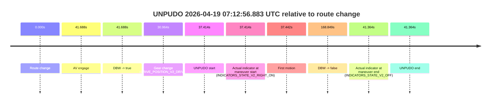
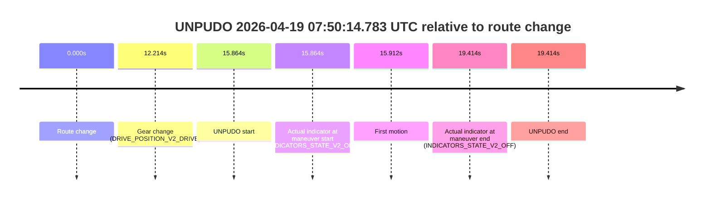
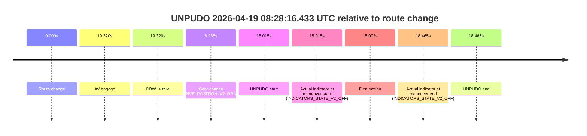

# Run Report: fme20002/2026-04-19--05-56-52--gen2-av-99b5b668-a427-4667-9038-a07590ea5f73

| Field | Value |
|---|---|
| Run ID | `fme20002/2026-04-19--05-56-52--gen2-av-99b5b668-a427-4667-9038-a07590ea5f73` |
| Date | `2026-04-19` |
| Model(s) | `plum-timeless-beaver` |
| Author | `peng.tang` |
| Event count | `16` |

## unpudo 2026-04-19 06:01:54.433 UTC

| Field | Value |
|---|---|
| Model | `plum-timeless-beaver` |
| Author | `peng.tang` |
| Run ID | `fme20002/2026-04-19--05-56-52--gen2-av-99b5b668-a427-4667-9038-a07590ea5f73` |
| Date | `2026-04-19` |
| Time (UTC) | `06:01:54.433` |
| Event type | `unpudo` |
| Disengagement type | `none observed` |
| Route change | `found` |
| Console | [run](https://console.sso.wayve.ai/run/fme20002/2026-04-19--05-56-52--gen2-av-99b5b668-a427-4667-9038-a07590ea5f73?id=&time-unixus=1776578514433300) |
| Foxglove | [segment](https://app.foxglove.dev/wayve-on-prem/p/prj_0dX18KZdVHg1fmmI/view?ds=foxglove-stream&ds.deviceName=fme20002&ds.start=2026-04-19T06%3A00%3A53.768420Z&ds.end=2026-04-19T06%3A06%3A08.718615Z&layoutId=lay_0e7VD4WIKDQGU73Y&time=2026-04-19T06%3A01%3A54.433300Z) |

### Event card: non-av

- Non-AV: there is no AV-owned portion anywhere inside the detected unpudo timeline, so it is kept for coverage but excluded from model success / failure scoring.

| Event | Time (UTC) | Delta from route change |
|---|---:|---:|
| Route change | 2026-04-19 06:01:03.768 | `0.000s` |
| AV engage | 2026-04-19 06:02:09.197 | `65.429s` |
| DBW -> true | 2026-04-19 06:02:09.197 | `65.429s` |
| Gear change (DRIVE_POSITION_V2_REVERSE) | 2026-04-19 06:01:46.383 | `42.615s` |
| UNPUDO start | 2026-04-19 06:01:54.433 | `50.665s` |
| Actual indicator at maneuver start (INDICATORS_STATE_V2_OFF) | 2026-04-19 06:01:54.433 | `50.665s` |
| First motion | 2026-04-19 06:02:03.011 | `59.243s` |
| DBW -> false | 2026-04-19 06:05:58.718 | `294.950s` |
| Actual indicator at maneuver end (INDICATORS_STATE_V2_OFF) | 2026-04-19 06:02:07.033 | `63.265s` |
| UNPUDO end | 2026-04-19 06:02:07.033 | `63.265s` |

| Metric | Value |
|---|---|
| Outcome | `non-av` |
| Effective failure type | `none` |
| Route change status | `found` |
| DBW at event start | `false` |
| DBW at event end | `false` |
| Predicted gear at AV start | `DRIVE_POSITION_V2_DRIVE` |
| Actual gear at AV start | `DRIVE_POSITION_V2_DRIVE` |
| Predicted gear at event start | `DRIVE_POSITION_V2_REVERSE` |
| Actual gear at event start | `DRIVE_POSITION_V2_REVERSE` |
| Planned indicator direction | `INDICATORS_STATE_V2_OFF` |
| Controller indicator direction | `INDICATORS_STATE_V2_OFF` |
| Actual indicator direction | `INDICATORS_STATE_V2_OFF` |
| Actual indicator at maneuver end | `INDICATORS_STATE_V2_OFF` |
| Driver accel help in AV | `false` |
| Driver accel help timestamp | `n/a` |
| Max accel pedal pct in AV | `0.0%` |
| Max brake pedal pct in AV | `0.0%` |
| Max speed mps in AV | `0.000` |
| Route -> AV | `65.429s` |
| AV -> event start | `-14.764s` |
| AV -> first motion | `-6.186s` |
| AV duration before disengagement | `229.521s` |
| Trajectory waypoint count | `37` |
| Driving-plan step count | `11` |

The scored portion starts from the AV-owned window, not from the pre-AV setup. Route-change search in the stopped pre-event segment was `found`, with the baseline therefore set to route change. At the event anchor the model predicts `DRIVE_POSITION_V2_REVERSE` and the actual gear is `DRIVE_POSITION_V2_REVERSE`. The effective model outcome is `non-av` because `there is no AV-owned overlap inside the event timeline`.

### Resolution

| Field | Value |
|---|---|
| Final outcome | `non-av` |
| Do we agree with this label? | `yes` |
| Source disengagement type | `none observed` |
| Resolved effective failure type | `none` |
| Confidence | `high` |

## unpudo 2026-04-19 06:10:05.733 UTC

| Field | Value |
|---|---|
| Model | `plum-timeless-beaver` |
| Author | `peng.tang` |
| Run ID | `fme20002/2026-04-19--05-56-52--gen2-av-99b5b668-a427-4667-9038-a07590ea5f73` |
| Date | `2026-04-19` |
| Time (UTC) | `06:10:05.733` |
| Event type | `unpudo` |
| Disengagement type | `none observed` |
| Route change | `found` |
| Console | [run](https://console.sso.wayve.ai/run/fme20002/2026-04-19--05-56-52--gen2-av-99b5b668-a427-4667-9038-a07590ea5f73?id=&time-unixus=1776579005733294) |
| Foxglove | [segment](https://app.foxglove.dev/wayve-on-prem/p/prj_0dX18KZdVHg1fmmI/view?ds=foxglove-stream&ds.deviceName=fme20002&ds.start=2026-04-19T06%3A09%3A37.368329Z&ds.end=2026-04-19T06%3A13%3A50.378861Z&layoutId=lay_0e7VD4WIKDQGU73Y&time=2026-04-19T06%3A10%3A05.733294Z) |

### Event card: non-av

- Non-AV: there is no AV-owned portion anywhere inside the detected unpudo timeline, so it is kept for coverage but excluded from model success / failure scoring.

| Event | Time (UTC) | Delta from route change |
|---|---:|---:|
| Route change | 2026-04-19 06:09:47.368 | `0.000s` |
| AV engage | 2026-04-19 06:10:11.398 | `24.030s` |
| DBW -> true | 2026-04-19 06:10:11.398 | `24.030s` |
| Gear change (DRIVE_POSITION_V2_DRIVE) | 2026-04-19 06:09:52.633 | `5.265s` |
| UNPUDO start | 2026-04-19 06:10:05.733 | `18.365s` |
| Actual indicator at maneuver start (INDICATORS_STATE_V2_OFF) | 2026-04-19 06:10:05.733 | `18.365s` |
| First motion | 2026-04-19 06:10:05.811 | `18.443s` |
| DBW -> false | 2026-04-19 06:13:40.378 | `233.011s` |
| Actual indicator at maneuver end (INDICATORS_STATE_V2_OFF) | 2026-04-19 06:10:10.583 | `23.215s` |
| UNPUDO end | 2026-04-19 06:10:10.583 | `23.215s` |

| Metric | Value |
|---|---|
| Outcome | `non-av` |
| Effective failure type | `none` |
| Route change status | `found` |
| DBW at event start | `false` |
| DBW at event end | `false` |
| Predicted gear at AV start | `DRIVE_POSITION_V2_DRIVE` |
| Actual gear at AV start | `DRIVE_POSITION_V2_DRIVE` |
| Predicted gear at event start | `DRIVE_POSITION_V2_DRIVE` |
| Actual gear at event start | `DRIVE_POSITION_V2_DRIVE` |
| Planned indicator direction | `INDICATORS_STATE_V2_RIGHT_ON` |
| Controller indicator direction | `INDICATORS_STATE_V2_RIGHT_ON` |
| Actual indicator direction | `INDICATORS_STATE_V2_OFF` |
| Actual indicator at maneuver end | `INDICATORS_STATE_V2_OFF` |
| Driver accel help in AV | `false` |
| Driver accel help timestamp | `n/a` |
| Max accel pedal pct in AV | `0.0%` |
| Max brake pedal pct in AV | `0.0%` |
| Max speed mps in AV | `0.000` |
| Route -> AV | `24.030s` |
| AV -> event start | `-5.665s` |
| AV -> first motion | `-5.588s` |
| AV duration before disengagement | `208.980s` |
| Trajectory waypoint count | `35` |
| Driving-plan step count | `11` |

The scored portion starts from the AV-owned window, not from the pre-AV setup. Route-change search in the stopped pre-event segment was `found`, with the baseline therefore set to route change. At the event anchor the model predicts `DRIVE_POSITION_V2_DRIVE` and the actual gear is `DRIVE_POSITION_V2_DRIVE`. The effective model outcome is `non-av` because `there is no AV-owned overlap inside the event timeline`.

### Resolution

| Field | Value |
|---|---|
| Final outcome | `non-av` |
| Do we agree with this label? | `yes` |
| Source disengagement type | `none observed` |
| Resolved effective failure type | `none` |
| Confidence | `high` |

## unpudo 2026-04-19 06:28:44.633 UTC

| Field | Value |
|---|---|
| Model | `plum-timeless-beaver` |
| Author | `peng.tang` |
| Run ID | `fme20002/2026-04-19--05-56-52--gen2-av-99b5b668-a427-4667-9038-a07590ea5f73` |
| Date | `2026-04-19` |
| Time (UTC) | `06:28:44.633` |
| Event type | `unpudo` |
| Disengagement type | `none observed` |
| Route change | `found` |
| Console | [run](https://console.sso.wayve.ai/run/fme20002/2026-04-19--05-56-52--gen2-av-99b5b668-a427-4667-9038-a07590ea5f73?id=&time-unixus=1776580124633297) |
| Foxglove | [segment](https://app.foxglove.dev/wayve-on-prem/p/prj_0dX18KZdVHg1fmmI/view?ds=foxglove-stream&ds.deviceName=fme20002&ds.start=2026-04-19T06%3A28%3A17.118338Z&ds.end=2026-04-19T06%3A33%3A02.817584Z&layoutId=lay_0e7VD4WIKDQGU73Y&time=2026-04-19T06%3A28%3A44.633297Z) |

### Event card: non-av

- Non-AV: there is no AV-owned portion anywhere inside the detected unpudo timeline, so it is kept for coverage but excluded from model success / failure scoring.

| Event | Time (UTC) | Delta from route change |
|---|---:|---:|
| Route change | 2026-04-19 06:28:27.118 | `0.000s` |
| AV engage | 2026-04-19 06:28:52.658 | `25.541s` |
| DBW -> true | 2026-04-19 06:28:52.658 | `25.541s` |
| Gear change (DRIVE_POSITION_V2_DRIVE) | 2026-04-19 06:28:39.683 | `12.565s` |
| UNPUDO start | 2026-04-19 06:28:44.633 | `17.515s` |
| Actual indicator at maneuver start (INDICATORS_STATE_V2_LEFT_ON) | 2026-04-19 06:28:44.633 | `17.515s` |
| First motion | 2026-04-19 06:28:44.691 | `17.573s` |
| DBW -> false | 2026-04-19 06:32:52.817 | `265.699s` |
| Actual indicator at maneuver end (INDICATORS_STATE_V2_OFF) | 2026-04-19 06:28:49.483 | `22.365s` |
| UNPUDO end | 2026-04-19 06:28:49.483 | `22.365s` |

| Metric | Value |
|---|---|
| Outcome | `non-av` |
| Effective failure type | `none` |
| Route change status | `found` |
| DBW at event start | `false` |
| DBW at event end | `false` |
| Predicted gear at AV start | `DRIVE_POSITION_V2_DRIVE` |
| Actual gear at AV start | `DRIVE_POSITION_V2_DRIVE` |
| Predicted gear at event start | `DRIVE_POSITION_V2_DRIVE` |
| Actual gear at event start | `DRIVE_POSITION_V2_DRIVE` |
| Planned indicator direction | `INDICATORS_STATE_V2_LEFT_ON` |
| Controller indicator direction | `INDICATORS_STATE_V2_LEFT_ON` |
| Actual indicator direction | `INDICATORS_STATE_V2_LEFT_ON` |
| Actual indicator at maneuver end | `INDICATORS_STATE_V2_OFF` |
| Driver accel help in AV | `false` |
| Driver accel help timestamp | `n/a` |
| Max accel pedal pct in AV | `0.0%` |
| Max brake pedal pct in AV | `0.0%` |
| Max speed mps in AV | `0.000` |
| Route -> AV | `25.541s` |
| AV -> event start | `-8.026s` |
| AV -> first motion | `-7.968s` |
| AV duration before disengagement | `240.159s` |
| Trajectory waypoint count | `35` |
| Driving-plan step count | `11` |

The scored portion starts from the AV-owned window, not from the pre-AV setup. Route-change search in the stopped pre-event segment was `found`, with the baseline therefore set to route change. At the event anchor the model predicts `DRIVE_POSITION_V2_DRIVE` and the actual gear is `DRIVE_POSITION_V2_DRIVE`. The effective model outcome is `non-av` because `there is no AV-owned overlap inside the event timeline`.

### Resolution

| Field | Value |
|---|---|
| Final outcome | `non-av` |
| Do we agree with this label? | `yes` |
| Source disengagement type | `none observed` |
| Resolved effective failure type | `none` |
| Confidence | `high` |

## unpudo 2026-04-19 06:33:38.433 UTC

| Field | Value |
|---|---|
| Model | `plum-timeless-beaver` |
| Author | `peng.tang` |
| Run ID | `fme20002/2026-04-19--05-56-52--gen2-av-99b5b668-a427-4667-9038-a07590ea5f73` |
| Date | `2026-04-19` |
| Time (UTC) | `06:33:38.433` |
| Event type | `unpudo` |
| Disengagement type | `none observed` |
| Route change | `found` |
| Console | [run](https://console.sso.wayve.ai/run/fme20002/2026-04-19--05-56-52--gen2-av-99b5b668-a427-4667-9038-a07590ea5f73?id=&time-unixus=1776580418433309) |
| Foxglove | [segment](https://app.foxglove.dev/wayve-on-prem/p/prj_0dX18KZdVHg1fmmI/view?ds=foxglove-stream&ds.deviceName=fme20002&ds.start=2026-04-19T06%3A32%3A48.468271Z&ds.end=2026-04-19T06%3A37%3A16.377458Z&layoutId=lay_0e7VD4WIKDQGU73Y&time=2026-04-19T06%3A33%3A38.433309Z) |

### Event card: pass

- Pass: AV owns the credited unpudo through the official event window, the gear state is aligned at the anchor, and the vehicle moves without driver accelerator help in AV.

| Event | Time (UTC) | Delta from route change |
|---|---:|---:|
| Route change | 2026-04-19 06:32:58.468 | `0.000s` |
| AV engage | 2026-04-19 06:33:34.317 | `35.849s` |
| DBW -> true | 2026-04-19 06:33:34.317 | `35.849s` |
| Gear change (DRIVE_POSITION_V2_DRIVE) | 2026-04-19 06:33:34.783 | `36.315s` |
| UNPUDO start | 2026-04-19 06:33:38.433 | `39.965s` |
| Actual indicator at maneuver start (INDICATORS_STATE_V2_OFF) | 2026-04-19 06:33:38.433 | `39.965s` |
| First motion | 2026-04-19 06:33:38.471 | `40.003s` |
| DBW -> false | 2026-04-19 06:37:06.377 | `247.909s` |
| Actual indicator at maneuver end (INDICATORS_STATE_V2_OFF) | 2026-04-19 06:33:41.883 | `43.415s` |
| UNPUDO end | 2026-04-19 06:33:41.883 | `43.415s` |

| Metric | Value |
|---|---|
| Outcome | `pass` |
| Effective failure type | `none` |
| Route change status | `found` |
| DBW at event start | `true` |
| DBW at event end | `true` |
| Predicted gear at AV start | `DRIVE_POSITION_V2_DRIVE` |
| Actual gear at AV start | `DRIVE_POSITION_V2_PARK` |
| Predicted gear at event start | `DRIVE_POSITION_V2_DRIVE` |
| Actual gear at event start | `DRIVE_POSITION_V2_DRIVE` |
| Planned indicator direction | `INDICATORS_STATE_V2_RIGHT_ON` |
| Controller indicator direction | `INDICATORS_STATE_V2_RIGHT_ON` |
| Actual indicator direction | `INDICATORS_STATE_V2_OFF` |
| Actual indicator at maneuver end | `INDICATORS_STATE_V2_OFF` |
| Driver accel help in AV | `false` |
| Driver accel help timestamp | `n/a` |
| Max accel pedal pct in AV | `0.0%` |
| Max brake pedal pct in AV | `0.0%` |
| Max speed mps in AV | `4.897` |
| Route -> AV | `35.849s` |
| AV -> event start | `4.116s` |
| AV -> first motion | `4.154s` |
| AV duration before disengagement | `212.060s` |
| Trajectory waypoint count | `37` |
| Driving-plan step count | `11` |

The scored portion starts from the AV-owned window, not from the pre-AV setup. Route-change search in the stopped pre-event segment was `found`, with the baseline therefore set to route change. At the event anchor the model predicts `DRIVE_POSITION_V2_DRIVE` and the actual gear is `DRIVE_POSITION_V2_DRIVE`. The effective model outcome is `pass` because `the credited maneuver stays AV-owned through the official event end`.

### Resolution

| Field | Value |
|---|---|
| Final outcome | `pass` |
| Do we agree with this label? | `yes` |
| Source disengagement type | `none observed` |
| Resolved effective failure type | `none` |
| Confidence | `high` |

## unpudo 2026-04-19 06:41:28.933 UTC

| Field | Value |
|---|---|
| Model | `plum-timeless-beaver` |
| Author | `peng.tang` |
| Run ID | `fme20002/2026-04-19--05-56-52--gen2-av-99b5b668-a427-4667-9038-a07590ea5f73` |
| Date | `2026-04-19` |
| Time (UTC) | `06:41:28.933` |
| Event type | `unpudo` |
| Disengagement type | `none observed` |
| Route change | `found` |
| Console | [run](https://console.sso.wayve.ai/run/fme20002/2026-04-19--05-56-52--gen2-av-99b5b668-a427-4667-9038-a07590ea5f73?id=&time-unixus=1776580888933316) |
| Foxglove | [segment](https://app.foxglove.dev/wayve-on-prem/p/prj_0dX18KZdVHg1fmmI/view?ds=foxglove-stream&ds.deviceName=fme20002&ds.start=2026-04-19T06%3A41%3A04.518293Z&ds.end=2026-04-19T06%3A44%3A17.037463Z&layoutId=lay_0e7VD4WIKDQGU73Y&time=2026-04-19T06%3A41%3A28.933316Z) |

### Event card: pass

- Pass: AV owns the credited unpudo through the official event window, the gear state is aligned at the anchor, and the vehicle moves without driver accelerator help in AV.

| Event | Time (UTC) | Delta from route change |
|---|---:|---:|
| Route change | 2026-04-19 06:41:14.518 | `0.000s` |
| AV engage | 2026-04-19 06:41:35.678 | `21.161s` |
| DBW -> true | 2026-04-19 06:41:35.678 | `21.161s` |
| Gear change (DRIVE_POSITION_V2_DRIVE) | 2026-04-19 06:41:21.183 | `6.665s` |
| UNPUDO start | 2026-04-19 06:41:28.933 | `14.415s` |
| Actual indicator at maneuver start (INDICATORS_STATE_V2_RIGHT_ON) | 2026-04-19 06:41:28.933 | `14.415s` |
| First motion | 2026-04-19 06:41:28.951 | `14.433s` |
| DBW -> false | 2026-04-19 06:44:07.037 | `172.519s` |
| Actual indicator at maneuver end (INDICATORS_STATE_V2_OFF) | 2026-04-19 06:41:37.833 | `23.315s` |
| UNPUDO end | 2026-04-19 06:41:37.833 | `23.315s` |

| Metric | Value |
|---|---|
| Outcome | `pass` |
| Effective failure type | `none` |
| Route change status | `found` |
| DBW at event start | `false` |
| DBW at event end | `true` |
| Predicted gear at AV start | `DRIVE_POSITION_V2_DRIVE` |
| Actual gear at AV start | `DRIVE_POSITION_V2_DRIVE` |
| Predicted gear at event start | `DRIVE_POSITION_V2_DRIVE` |
| Actual gear at event start | `DRIVE_POSITION_V2_DRIVE` |
| Planned indicator direction | `INDICATORS_STATE_V2_RIGHT_ON` |
| Controller indicator direction | `INDICATORS_STATE_V2_RIGHT_ON` |
| Actual indicator direction | `INDICATORS_STATE_V2_RIGHT_ON` |
| Actual indicator at maneuver end | `INDICATORS_STATE_V2_OFF` |
| Driver accel help in AV | `false` |
| Driver accel help timestamp | `n/a` |
| Max accel pedal pct in AV | `0.0%` |
| Max brake pedal pct in AV | `0.0%` |
| Max speed mps in AV | `3.072` |
| Route -> AV | `21.161s` |
| AV -> event start | `-6.746s` |
| AV -> first motion | `-6.728s` |
| AV duration before disengagement | `151.359s` |
| Trajectory waypoint count | `37` |
| Driving-plan step count | `11` |

The scored portion starts from the AV-owned window, not from the pre-AV setup. Route-change search in the stopped pre-event segment was `found`, with the baseline therefore set to route change. At the event anchor the model predicts `DRIVE_POSITION_V2_DRIVE` and the actual gear is `DRIVE_POSITION_V2_DRIVE`. The effective model outcome is `pass` because `the credited maneuver stays AV-owned through the official event end`.

### Resolution

| Field | Value |
|---|---|
| Final outcome | `pass` |
| Do we agree with this label? | `yes` |
| Source disengagement type | `none observed` |
| Resolved effective failure type | `none` |
| Confidence | `high` |

## unpudo 2026-04-19 06:44:28.883 UTC

| Field | Value |
|---|---|
| Model | `plum-timeless-beaver` |
| Author | `peng.tang` |
| Run ID | `fme20002/2026-04-19--05-56-52--gen2-av-99b5b668-a427-4667-9038-a07590ea5f73` |
| Date | `2026-04-19` |
| Time (UTC) | `06:44:28.883` |
| Event type | `unpudo` |
| Disengagement type | `none observed` |
| Route change | `found` |
| Console | [run](https://console.sso.wayve.ai/run/fme20002/2026-04-19--05-56-52--gen2-av-99b5b668-a427-4667-9038-a07590ea5f73?id=&time-unixus=1776581068883298) |
| Foxglove | [segment](https://app.foxglove.dev/wayve-on-prem/p/prj_0dX18KZdVHg1fmmI/view?ds=foxglove-stream&ds.deviceName=fme20002&ds.start=2026-04-19T06%3A44%3A10.318386Z&ds.end=2026-04-19T06%3A44%3A38.883298Z&layoutId=lay_0e7VD4WIKDQGU73Y&time=2026-04-19T06%3A44%3A28.883298Z) |

### Event card: non-av

- Non-AV: there is no AV-owned portion anywhere inside the detected unpudo timeline, so it is kept for coverage but excluded from model success / failure scoring.

| Event | Time (UTC) | Delta from route change |
|---|---:|---:|
| Route change | 2026-04-19 06:44:20.318 | `0.000s` |
| Gear change (DRIVE_POSITION_V2_DRIVE) | 2026-04-19 06:44:25.383 | `5.065s` |
| UNPUDO start | 2026-04-19 06:44:28.883 | `8.565s` |
| Actual indicator at maneuver start (INDICATORS_STATE_V2_OFF) | 2026-04-19 06:44:28.883 | `8.565s` |
| First motion | 2026-04-19 06:44:28.931 | `8.614s` |
| Actual indicator at maneuver end (INDICATORS_STATE_V2_OFF) | 2026-04-19 06:44:28.883 | `8.565s` |
| UNPUDO end | 2026-04-19 06:44:28.883 | `8.565s` |

| Metric | Value |
|---|---|
| Outcome | `non-av` |
| Effective failure type | `none` |
| Route change status | `found` |
| DBW at event start | `false` |
| DBW at event end | `false` |
| Predicted gear at AV start | `n/a` |
| Actual gear at AV start | `n/a` |
| Predicted gear at event start | `DRIVE_POSITION_V2_DRIVE` |
| Actual gear at event start | `DRIVE_POSITION_V2_DRIVE` |
| Planned indicator direction | `INDICATORS_STATE_V2_OFF` |
| Controller indicator direction | `INDICATORS_STATE_V2_OFF` |
| Actual indicator direction | `INDICATORS_STATE_V2_OFF` |
| Actual indicator at maneuver end | `INDICATORS_STATE_V2_OFF` |
| Driver accel help in AV | `false` |
| Driver accel help timestamp | `n/a` |
| Max accel pedal pct in AV | `0.0%` |
| Max brake pedal pct in AV | `0.0%` |
| Max speed mps in AV | `0.000` |
| Route -> AV | `n/a` |
| AV -> event start | `n/a` |
| AV -> first motion | `n/a` |
| AV duration before disengagement | `n/a` |
| Trajectory waypoint count | `36` |
| Driving-plan step count | `11` |

The scored portion starts from the AV-owned window, not from the pre-AV setup. Route-change search in the stopped pre-event segment was `found`, with the baseline therefore set to route change. At the event anchor the model predicts `DRIVE_POSITION_V2_DRIVE` and the actual gear is `DRIVE_POSITION_V2_DRIVE`. The effective model outcome is `non-av` because `there is no AV-owned overlap inside the event timeline`.

### Resolution

| Field | Value |
|---|---|
| Final outcome | `non-av` |
| Do we agree with this label? | `yes` |
| Source disengagement type | `none observed` |
| Resolved effective failure type | `none` |
| Confidence | `high` |

## unpudo 2026-04-19 07:07:14.883 UTC

| Field | Value |
|---|---|
| Model | `plum-timeless-beaver` |
| Author | `peng.tang` |
| Run ID | `fme20002/2026-04-19--05-56-52--gen2-av-99b5b668-a427-4667-9038-a07590ea5f73` |
| Date | `2026-04-19` |
| Time (UTC) | `07:07:14.883` |
| Event type | `unpudo` |
| Disengagement type | `none observed` |
| Route change | `found` |
| Console | [run](https://console.sso.wayve.ai/run/fme20002/2026-04-19--05-56-52--gen2-av-99b5b668-a427-4667-9038-a07590ea5f73?id=&time-unixus=1776582434883313) |
| Foxglove | [segment](https://app.foxglove.dev/wayve-on-prem/p/prj_0dX18KZdVHg1fmmI/view?ds=foxglove-stream&ds.deviceName=fme20002&ds.start=2026-04-19T07%3A06%3A53.268280Z&ds.end=2026-04-19T07%3A10%3A07.497544Z&layoutId=lay_0e7VD4WIKDQGU73Y&time=2026-04-19T07%3A07%3A14.883313Z) |

### Event card: non-av

- Non-AV: there is no AV-owned portion anywhere inside the detected unpudo timeline, so it is kept for coverage but excluded from model success / failure scoring.

| Event | Time (UTC) | Delta from route change |
|---|---:|---:|
| Route change | 2026-04-19 07:07:03.268 | `0.000s` |
| AV engage | 2026-04-19 07:07:21.077 | `17.809s` |
| DBW -> true | 2026-04-19 07:07:21.077 | `17.809s` |
| Gear change (DRIVE_POSITION_V2_DRIVE) | 2026-04-19 07:07:08.633 | `5.365s` |
| UNPUDO start | 2026-04-19 07:07:14.883 | `11.615s` |
| Actual indicator at maneuver start (INDICATORS_STATE_V2_OFF) | 2026-04-19 07:07:14.883 | `11.615s` |
| First motion | 2026-04-19 07:07:14.931 | `11.663s` |
| DBW -> false | 2026-04-19 07:09:57.497 | `174.229s` |
| Actual indicator at maneuver end (INDICATORS_STATE_V2_OFF) | 2026-04-19 07:07:18.433 | `15.165s` |
| UNPUDO end | 2026-04-19 07:07:18.433 | `15.165s` |

| Metric | Value |
|---|---|
| Outcome | `non-av` |
| Effective failure type | `none` |
| Route change status | `found` |
| DBW at event start | `false` |
| DBW at event end | `false` |
| Predicted gear at AV start | `DRIVE_POSITION_V2_DRIVE` |
| Actual gear at AV start | `DRIVE_POSITION_V2_DRIVE` |
| Predicted gear at event start | `DRIVE_POSITION_V2_DRIVE` |
| Actual gear at event start | `DRIVE_POSITION_V2_DRIVE` |
| Planned indicator direction | `INDICATORS_STATE_V2_RIGHT_ON` |
| Controller indicator direction | `INDICATORS_STATE_V2_RIGHT_ON` |
| Actual indicator direction | `INDICATORS_STATE_V2_OFF` |
| Actual indicator at maneuver end | `INDICATORS_STATE_V2_OFF` |
| Driver accel help in AV | `false` |
| Driver accel help timestamp | `n/a` |
| Max accel pedal pct in AV | `0.0%` |
| Max brake pedal pct in AV | `0.0%` |
| Max speed mps in AV | `0.000` |
| Route -> AV | `17.809s` |
| AV -> event start | `-6.194s` |
| AV -> first motion | `-6.146s` |
| AV duration before disengagement | `156.420s` |
| Trajectory waypoint count | `36` |
| Driving-plan step count | `11` |

The scored portion starts from the AV-owned window, not from the pre-AV setup. Route-change search in the stopped pre-event segment was `found`, with the baseline therefore set to route change. At the event anchor the model predicts `DRIVE_POSITION_V2_DRIVE` and the actual gear is `DRIVE_POSITION_V2_DRIVE`. The effective model outcome is `non-av` because `there is no AV-owned overlap inside the event timeline`.

### Resolution

| Field | Value |
|---|---|
| Final outcome | `non-av` |
| Do we agree with this label? | `yes` |
| Source disengagement type | `none observed` |
| Resolved effective failure type | `none` |
| Confidence | `high` |

## unpudo 2026-04-19 07:12:56.883 UTC

| Field | Value |
|---|---|
| Model | `plum-timeless-beaver` |
| Author | `peng.tang` |
| Run ID | `fme20002/2026-04-19--05-56-52--gen2-av-99b5b668-a427-4667-9038-a07590ea5f73` |
| Date | `2026-04-19` |
| Time (UTC) | `07:12:56.883` |
| Event type | `unpudo` |
| Disengagement type | `none observed` |
| Route change | `found` |
| Console | [run](https://console.sso.wayve.ai/run/fme20002/2026-04-19--05-56-52--gen2-av-99b5b668-a427-4667-9038-a07590ea5f73?id=&time-unixus=1776582776883304) |
| Foxglove | [segment](https://app.foxglove.dev/wayve-on-prem/p/prj_0dX18KZdVHg1fmmI/view?ds=foxglove-stream&ds.deviceName=fme20002&ds.start=2026-04-19T07%3A12%3A09.469536Z&ds.end=2026-04-19T07%3A15%3A18.318798Z&layoutId=lay_0e7VD4WIKDQGU73Y&time=2026-04-19T07%3A12%3A56.883304Z) |

### Event card: non-av

- Non-AV: there is no AV-owned portion anywhere inside the detected unpudo timeline, so it is kept for coverage but excluded from model success / failure scoring.

| Event | Time (UTC) | Delta from route change |
|---|---:|---:|
| Route change | 2026-04-19 07:12:19.469 | `0.000s` |
| AV engage | 2026-04-19 07:13:01.157 | `41.688s` |
| DBW -> true | 2026-04-19 07:13:01.157 | `41.688s` |
| Gear change (DRIVE_POSITION_V2_DRIVE) | 2026-04-19 07:12:50.433 | `30.964s` |
| UNPUDO start | 2026-04-19 07:12:56.883 | `37.414s` |
| Actual indicator at maneuver start (INDICATORS_STATE_V2_RIGHT_ON) | 2026-04-19 07:12:56.883 | `37.414s` |
| First motion | 2026-04-19 07:12:56.911 | `37.442s` |
| DBW -> false | 2026-04-19 07:15:08.318 | `168.849s` |
| Actual indicator at maneuver end (INDICATORS_STATE_V2_OFF) | 2026-04-19 07:13:00.833 | `41.364s` |
| UNPUDO end | 2026-04-19 07:13:00.833 | `41.364s` |

| Metric | Value |
|---|---|
| Outcome | `non-av` |
| Effective failure type | `none` |
| Route change status | `found` |
| DBW at event start | `false` |
| DBW at event end | `false` |
| Predicted gear at AV start | `DRIVE_POSITION_V2_DRIVE` |
| Actual gear at AV start | `DRIVE_POSITION_V2_DRIVE` |
| Predicted gear at event start | `DRIVE_POSITION_V2_DRIVE` |
| Actual gear at event start | `DRIVE_POSITION_V2_DRIVE` |
| Planned indicator direction | `INDICATORS_STATE_V2_OFF` |
| Controller indicator direction | `INDICATORS_STATE_V2_OFF` |
| Actual indicator direction | `INDICATORS_STATE_V2_RIGHT_ON` |
| Actual indicator at maneuver end | `INDICATORS_STATE_V2_OFF` |
| Driver accel help in AV | `false` |
| Driver accel help timestamp | `n/a` |
| Max accel pedal pct in AV | `0.0%` |
| Max brake pedal pct in AV | `0.0%` |
| Max speed mps in AV | `0.000` |
| Route -> AV | `41.688s` |
| AV -> event start | `-4.274s` |
| AV -> first motion | `-4.246s` |
| AV duration before disengagement | `127.161s` |
| Trajectory waypoint count | `37` |
| Driving-plan step count | `11` |

The scored portion starts from the AV-owned window, not from the pre-AV setup. Route-change search in the stopped pre-event segment was `found`, with the baseline therefore set to route change. At the event anchor the model predicts `DRIVE_POSITION_V2_DRIVE` and the actual gear is `DRIVE_POSITION_V2_DRIVE`. The effective model outcome is `non-av` because `there is no AV-owned overlap inside the event timeline`.

### Resolution

| Field | Value |
|---|---|
| Final outcome | `non-av` |
| Do we agree with this label? | `yes` |
| Source disengagement type | `none observed` |
| Resolved effective failure type | `none` |
| Confidence | `high` |

## unpudo 2026-04-19 07:15:48.883 UTC

| Field | Value |
|---|---|
| Model | `plum-timeless-beaver` |
| Author | `peng.tang` |
| Run ID | `fme20002/2026-04-19--05-56-52--gen2-av-99b5b668-a427-4667-9038-a07590ea5f73` |
| Date | `2026-04-19` |
| Time (UTC) | `07:15:48.883` |
| Event type | `unpudo` |
| Disengagement type | `none observed` |
| Route change | `found` |
| Console | [run](https://console.sso.wayve.ai/run/fme20002/2026-04-19--05-56-52--gen2-av-99b5b668-a427-4667-9038-a07590ea5f73?id=&time-unixus=1776582948883322) |
| Foxglove | [segment](https://app.foxglove.dev/wayve-on-prem/p/prj_0dX18KZdVHg1fmmI/view?ds=foxglove-stream&ds.deviceName=fme20002&ds.start=2026-04-19T07%3A15%3A09.768259Z&ds.end=2026-04-19T07%3A18%3A00.838673Z&layoutId=lay_0e7VD4WIKDQGU73Y&time=2026-04-19T07%3A15%3A48.883322Z) |

### Event card: non-av

- Non-AV: there is no AV-owned portion anywhere inside the detected unpudo timeline, so it is kept for coverage but excluded from model success / failure scoring.

| Event | Time (UTC) | Delta from route change |
|---|---:|---:|
| Route change | 2026-04-19 07:15:19.768 | `0.000s` |
| AV engage | 2026-04-19 07:16:01.057 | `41.289s` |
| DBW -> true | 2026-04-19 07:16:01.057 | `41.289s` |
| Gear change (DRIVE_POSITION_V2_DRIVE) | 2026-04-19 07:15:41.933 | `22.165s` |
| UNPUDO start | 2026-04-19 07:15:48.883 | `29.115s` |
| Actual indicator at maneuver start (INDICATORS_STATE_V2_RIGHT_ON) | 2026-04-19 07:15:48.883 | `29.115s` |
| First motion | 2026-04-19 07:15:49.011 | `29.244s` |
| DBW -> false | 2026-04-19 07:17:50.838 | `151.070s` |
| Actual indicator at maneuver end (INDICATORS_STATE_V2_OFF) | 2026-04-19 07:15:53.983 | `34.215s` |
| UNPUDO end | 2026-04-19 07:15:53.983 | `34.215s` |

| Metric | Value |
|---|---|
| Outcome | `non-av` |
| Effective failure type | `none` |
| Route change status | `found` |
| DBW at event start | `false` |
| DBW at event end | `false` |
| Predicted gear at AV start | `DRIVE_POSITION_V2_DRIVE` |
| Actual gear at AV start | `DRIVE_POSITION_V2_DRIVE` |
| Predicted gear at event start | `DRIVE_POSITION_V2_DRIVE` |
| Actual gear at event start | `DRIVE_POSITION_V2_DRIVE` |
| Planned indicator direction | `INDICATORS_STATE_V2_RIGHT_ON` |
| Controller indicator direction | `INDICATORS_STATE_V2_RIGHT_ON` |
| Actual indicator direction | `INDICATORS_STATE_V2_RIGHT_ON` |
| Actual indicator at maneuver end | `INDICATORS_STATE_V2_OFF` |
| Driver accel help in AV | `false` |
| Driver accel help timestamp | `n/a` |
| Max accel pedal pct in AV | `0.0%` |
| Max brake pedal pct in AV | `0.0%` |
| Max speed mps in AV | `0.000` |
| Route -> AV | `41.289s` |
| AV -> event start | `-12.174s` |
| AV -> first motion | `-12.046s` |
| AV duration before disengagement | `109.781s` |
| Trajectory waypoint count | `37` |
| Driving-plan step count | `11` |

The scored portion starts from the AV-owned window, not from the pre-AV setup. Route-change search in the stopped pre-event segment was `found`, with the baseline therefore set to route change. At the event anchor the model predicts `DRIVE_POSITION_V2_DRIVE` and the actual gear is `DRIVE_POSITION_V2_DRIVE`. The effective model outcome is `non-av` because `there is no AV-owned overlap inside the event timeline`.

### Resolution

| Field | Value |
|---|---|
| Final outcome | `non-av` |
| Do we agree with this label? | `yes` |
| Source disengagement type | `none observed` |
| Resolved effective failure type | `none` |
| Confidence | `high` |

## unpudo 2026-04-19 07:18:11.633 UTC

| Field | Value |
|---|---|
| Model | `plum-timeless-beaver` |
| Author | `peng.tang` |
| Run ID | `fme20002/2026-04-19--05-56-52--gen2-av-99b5b668-a427-4667-9038-a07590ea5f73` |
| Date | `2026-04-19` |
| Time (UTC) | `07:18:11.633` |
| Event type | `unpudo` |
| Disengagement type | `none observed` |
| Route change | `found` |
| Console | [run](https://console.sso.wayve.ai/run/fme20002/2026-04-19--05-56-52--gen2-av-99b5b668-a427-4667-9038-a07590ea5f73?id=&time-unixus=1776583091633293) |
| Foxglove | [segment](https://app.foxglove.dev/wayve-on-prem/p/prj_0dX18KZdVHg1fmmI/view?ds=foxglove-stream&ds.deviceName=fme20002&ds.start=2026-04-19T07%3A17%3A54.068326Z&ds.end=2026-04-19T07%3A19%3A14.098745Z&layoutId=lay_0e7VD4WIKDQGU73Y&time=2026-04-19T07%3A18%3A11.633293Z) |

### Event card: non-av

- Non-AV: there is no AV-owned portion anywhere inside the detected unpudo timeline, so it is kept for coverage but excluded from model success / failure scoring.

| Event | Time (UTC) | Delta from route change |
|---|---:|---:|
| Route change | 2026-04-19 07:18:04.068 | `0.000s` |
| AV engage | 2026-04-19 07:18:23.517 | `19.449s` |
| DBW -> true | 2026-04-19 07:18:23.517 | `19.449s` |
| Gear change (DRIVE_POSITION_V2_DRIVE) | 2026-04-19 07:18:08.133 | `4.065s` |
| UNPUDO start | 2026-04-19 07:18:11.633 | `7.565s` |
| Actual indicator at maneuver start (INDICATORS_STATE_V2_OFF) | 2026-04-19 07:18:11.633 | `7.565s` |
| First motion | 2026-04-19 07:18:11.651 | `7.583s` |
| DBW -> false | 2026-04-19 07:19:04.098 | `60.030s` |
| Actual indicator at maneuver end (INDICATORS_STATE_V2_RIGHT_ON) | 2026-04-19 07:18:15.433 | `11.365s` |
| UNPUDO end | 2026-04-19 07:18:15.433 | `11.365s` |

| Metric | Value |
|---|---|
| Outcome | `non-av` |
| Effective failure type | `none` |
| Route change status | `found` |
| DBW at event start | `false` |
| DBW at event end | `false` |
| Predicted gear at AV start | `DRIVE_POSITION_V2_DRIVE` |
| Actual gear at AV start | `DRIVE_POSITION_V2_DRIVE` |
| Predicted gear at event start | `DRIVE_POSITION_V2_DRIVE` |
| Actual gear at event start | `DRIVE_POSITION_V2_DRIVE` |
| Planned indicator direction | `INDICATORS_STATE_V2_RIGHT_ON` |
| Controller indicator direction | `INDICATORS_STATE_V2_RIGHT_ON` |
| Actual indicator direction | `INDICATORS_STATE_V2_OFF` |
| Actual indicator at maneuver end | `INDICATORS_STATE_V2_RIGHT_ON` |
| Driver accel help in AV | `false` |
| Driver accel help timestamp | `n/a` |
| Max accel pedal pct in AV | `0.0%` |
| Max brake pedal pct in AV | `0.0%` |
| Max speed mps in AV | `0.000` |
| Route -> AV | `19.449s` |
| AV -> event start | `-11.884s` |
| AV -> first motion | `-11.866s` |
| AV duration before disengagement | `40.581s` |
| Trajectory waypoint count | `37` |
| Driving-plan step count | `11` |

The scored portion starts from the AV-owned window, not from the pre-AV setup. Route-change search in the stopped pre-event segment was `found`, with the baseline therefore set to route change. At the event anchor the model predicts `DRIVE_POSITION_V2_DRIVE` and the actual gear is `DRIVE_POSITION_V2_DRIVE`. The effective model outcome is `non-av` because `there is no AV-owned overlap inside the event timeline`.

### Resolution

| Field | Value |
|---|---|
| Final outcome | `non-av` |
| Do we agree with this label? | `yes` |
| Source disengagement type | `none observed` |
| Resolved effective failure type | `none` |
| Confidence | `high` |

## unpudo 2026-04-19 07:20:14.833 UTC

| Field | Value |
|---|---|
| Model | `plum-timeless-beaver` |
| Author | `peng.tang` |
| Run ID | `fme20002/2026-04-19--05-56-52--gen2-av-99b5b668-a427-4667-9038-a07590ea5f73` |
| Date | `2026-04-19` |
| Time (UTC) | `07:20:14.833` |
| Event type | `unpudo` |
| Disengagement type | `none observed` |
| Route change | `found` |
| Console | [run](https://console.sso.wayve.ai/run/fme20002/2026-04-19--05-56-52--gen2-av-99b5b668-a427-4667-9038-a07590ea5f73?id=&time-unixus=1776583214833299) |
| Foxglove | [segment](https://app.foxglove.dev/wayve-on-prem/p/prj_0dX18KZdVHg1fmmI/view?ds=foxglove-stream&ds.deviceName=fme20002&ds.start=2026-04-19T07%3A19%3A07.018519Z&ds.end=2026-04-19T07%3A21%3A56.197623Z&layoutId=lay_0e7VD4WIKDQGU73Y&time=2026-04-19T07%3A20%3A14.833299Z) |

### Event card: non-av

- Non-AV: there is no AV-owned portion anywhere inside the detected unpudo timeline, so it is kept for coverage but excluded from model success / failure scoring.

| Event | Time (UTC) | Delta from route change |
|---|---:|---:|
| Route change | 2026-04-19 07:19:17.018 | `0.000s` |
| AV engage | 2026-04-19 07:20:19.918 | `62.900s` |
| DBW -> true | 2026-04-19 07:20:19.918 | `62.900s` |
| Gear change (DRIVE_POSITION_V2_DRIVE) | 2026-04-19 07:20:10.933 | `53.915s` |
| UNPUDO start | 2026-04-19 07:20:14.833 | `57.815s` |
| Actual indicator at maneuver start (INDICATORS_STATE_V2_OFF) | 2026-04-19 07:20:14.833 | `57.815s` |
| First motion | 2026-04-19 07:20:14.851 | `57.833s` |
| DBW -> false | 2026-04-19 07:21:46.197 | `149.179s` |
| Actual indicator at maneuver end (INDICATORS_STATE_V2_OFF) | 2026-04-19 07:20:18.633 | `61.615s` |
| UNPUDO end | 2026-04-19 07:20:18.633 | `61.615s` |

| Metric | Value |
|---|---|
| Outcome | `non-av` |
| Effective failure type | `none` |
| Route change status | `found` |
| DBW at event start | `false` |
| DBW at event end | `false` |
| Predicted gear at AV start | `DRIVE_POSITION_V2_DRIVE` |
| Actual gear at AV start | `DRIVE_POSITION_V2_DRIVE` |
| Predicted gear at event start | `DRIVE_POSITION_V2_DRIVE` |
| Actual gear at event start | `DRIVE_POSITION_V2_DRIVE` |
| Planned indicator direction | `INDICATORS_STATE_V2_RIGHT_ON` |
| Controller indicator direction | `INDICATORS_STATE_V2_RIGHT_ON` |
| Actual indicator direction | `INDICATORS_STATE_V2_OFF` |
| Actual indicator at maneuver end | `INDICATORS_STATE_V2_OFF` |
| Driver accel help in AV | `false` |
| Driver accel help timestamp | `n/a` |
| Max accel pedal pct in AV | `0.0%` |
| Max brake pedal pct in AV | `0.0%` |
| Max speed mps in AV | `0.000` |
| Route -> AV | `62.900s` |
| AV -> event start | `-5.086s` |
| AV -> first motion | `-5.067s` |
| AV duration before disengagement | `86.279s` |
| Trajectory waypoint count | `37` |
| Driving-plan step count | `11` |

The scored portion starts from the AV-owned window, not from the pre-AV setup. Route-change search in the stopped pre-event segment was `found`, with the baseline therefore set to route change. At the event anchor the model predicts `DRIVE_POSITION_V2_DRIVE` and the actual gear is `DRIVE_POSITION_V2_DRIVE`. The effective model outcome is `non-av` because `there is no AV-owned overlap inside the event timeline`.

### Resolution

| Field | Value |
|---|---|
| Final outcome | `non-av` |
| Do we agree with this label? | `yes` |
| Source disengagement type | `none observed` |
| Resolved effective failure type | `none` |
| Confidence | `high` |

## unpudo 2026-04-19 07:38:05.833 UTC

| Field | Value |
|---|---|
| Model | `plum-timeless-beaver` |
| Author | `peng.tang` |
| Run ID | `fme20002/2026-04-19--05-56-52--gen2-av-99b5b668-a427-4667-9038-a07590ea5f73` |
| Date | `2026-04-19` |
| Time (UTC) | `07:38:05.833` |
| Event type | `unpudo` |
| Disengagement type | `none observed` |
| Route change | `found` |
| Console | [run](https://console.sso.wayve.ai/run/fme20002/2026-04-19--05-56-52--gen2-av-99b5b668-a427-4667-9038-a07590ea5f73?id=&time-unixus=1776584285833305) |
| Foxglove | [segment](https://app.foxglove.dev/wayve-on-prem/p/prj_0dX18KZdVHg1fmmI/view?ds=foxglove-stream&ds.deviceName=fme20002&ds.start=2026-04-19T07%3A37%3A38.868311Z&ds.end=2026-04-19T07%3A39%3A11.877582Z&layoutId=lay_0e7VD4WIKDQGU73Y&time=2026-04-19T07%3A38%3A05.833305Z) |

### Event card: non-av

- Non-AV: there is no AV-owned portion anywhere inside the detected unpudo timeline, so it is kept for coverage but excluded from model success / failure scoring.

| Event | Time (UTC) | Delta from route change |
|---|---:|---:|
| Route change | 2026-04-19 07:37:48.868 | `0.000s` |
| AV engage | 2026-04-19 07:38:12.297 | `23.429s` |
| DBW -> true | 2026-04-19 07:38:12.297 | `23.429s` |
| Gear change (DRIVE_POSITION_V2_DRIVE) | 2026-04-19 07:38:01.033 | `12.165s` |
| UNPUDO start | 2026-04-19 07:38:05.833 | `16.965s` |
| Actual indicator at maneuver start (INDICATORS_STATE_V2_OFF) | 2026-04-19 07:38:05.833 | `16.965s` |
| First motion | 2026-04-19 07:38:05.891 | `17.023s` |
| DBW -> false | 2026-04-19 07:39:01.877 | `73.009s` |
| Actual indicator at maneuver end (INDICATORS_STATE_V2_OFF) | 2026-04-19 07:38:10.533 | `21.665s` |
| UNPUDO end | 2026-04-19 07:38:10.533 | `21.665s` |

| Metric | Value |
|---|---|
| Outcome | `non-av` |
| Effective failure type | `none` |
| Route change status | `found` |
| DBW at event start | `false` |
| DBW at event end | `false` |
| Predicted gear at AV start | `DRIVE_POSITION_V2_DRIVE` |
| Actual gear at AV start | `DRIVE_POSITION_V2_DRIVE` |
| Predicted gear at event start | `DRIVE_POSITION_V2_DRIVE` |
| Actual gear at event start | `DRIVE_POSITION_V2_DRIVE` |
| Planned indicator direction | `INDICATORS_STATE_V2_RIGHT_ON` |
| Controller indicator direction | `INDICATORS_STATE_V2_RIGHT_ON` |
| Actual indicator direction | `INDICATORS_STATE_V2_OFF` |
| Actual indicator at maneuver end | `INDICATORS_STATE_V2_OFF` |
| Driver accel help in AV | `false` |
| Driver accel help timestamp | `n/a` |
| Max accel pedal pct in AV | `0.0%` |
| Max brake pedal pct in AV | `0.0%` |
| Max speed mps in AV | `0.000` |
| Route -> AV | `23.429s` |
| AV -> event start | `-6.464s` |
| AV -> first motion | `-6.406s` |
| AV duration before disengagement | `49.580s` |
| Trajectory waypoint count | `35` |
| Driving-plan step count | `11` |

The scored portion starts from the AV-owned window, not from the pre-AV setup. Route-change search in the stopped pre-event segment was `found`, with the baseline therefore set to route change. At the event anchor the model predicts `DRIVE_POSITION_V2_DRIVE` and the actual gear is `DRIVE_POSITION_V2_DRIVE`. The effective model outcome is `non-av` because `there is no AV-owned overlap inside the event timeline`.

### Resolution

| Field | Value |
|---|---|
| Final outcome | `non-av` |
| Do we agree with this label? | `yes` |
| Source disengagement type | `none observed` |
| Resolved effective failure type | `none` |
| Confidence | `high` |

## unpudo 2026-04-19 07:50:14.783 UTC

| Field | Value |
|---|---|
| Model | `plum-timeless-beaver` |
| Author | `peng.tang` |
| Run ID | `fme20002/2026-04-19--05-56-52--gen2-av-99b5b668-a427-4667-9038-a07590ea5f73` |
| Date | `2026-04-19` |
| Time (UTC) | `07:50:14.783` |
| Event type | `unpudo` |
| Disengagement type | `none observed` |
| Route change | `found` |
| Console | [run](https://console.sso.wayve.ai/run/fme20002/2026-04-19--05-56-52--gen2-av-99b5b668-a427-4667-9038-a07590ea5f73?id=&time-unixus=1776585014783310) |
| Foxglove | [segment](https://app.foxglove.dev/wayve-on-prem/p/prj_0dX18KZdVHg1fmmI/view?ds=foxglove-stream&ds.deviceName=fme20002&ds.start=2026-04-19T07%3A49%3A48.918992Z&ds.end=2026-04-19T07%3A50%3A28.333306Z&layoutId=lay_0e7VD4WIKDQGU73Y&time=2026-04-19T07%3A50%3A14.783310Z) |

### Event card: non-av

- Non-AV: there is no AV-owned portion anywhere inside the detected unpudo timeline, so it is kept for coverage but excluded from model success / failure scoring.

| Event | Time (UTC) | Delta from route change |
|---|---:|---:|
| Route change | 2026-04-19 07:49:58.918 | `0.000s` |
| Gear change (DRIVE_POSITION_V2_DRIVE) | 2026-04-19 07:50:11.133 | `12.214s` |
| UNPUDO start | 2026-04-19 07:50:14.783 | `15.864s` |
| Actual indicator at maneuver start (INDICATORS_STATE_V2_OFF) | 2026-04-19 07:50:14.783 | `15.864s` |
| First motion | 2026-04-19 07:50:14.831 | `15.912s` |
| Actual indicator at maneuver end (INDICATORS_STATE_V2_OFF) | 2026-04-19 07:50:18.333 | `19.414s` |
| UNPUDO end | 2026-04-19 07:50:18.333 | `19.414s` |

| Metric | Value |
|---|---|
| Outcome | `non-av` |
| Effective failure type | `none` |
| Route change status | `found` |
| DBW at event start | `false` |
| DBW at event end | `false` |
| Predicted gear at AV start | `n/a` |
| Actual gear at AV start | `n/a` |
| Predicted gear at event start | `DRIVE_POSITION_V2_DRIVE` |
| Actual gear at event start | `DRIVE_POSITION_V2_DRIVE` |
| Planned indicator direction | `INDICATORS_STATE_V2_RIGHT_ON` |
| Controller indicator direction | `INDICATORS_STATE_V2_RIGHT_ON` |
| Actual indicator direction | `INDICATORS_STATE_V2_OFF` |
| Actual indicator at maneuver end | `INDICATORS_STATE_V2_OFF` |
| Driver accel help in AV | `false` |
| Driver accel help timestamp | `n/a` |
| Max accel pedal pct in AV | `0.0%` |
| Max brake pedal pct in AV | `0.0%` |
| Max speed mps in AV | `0.000` |
| Route -> AV | `n/a` |
| AV -> event start | `n/a` |
| AV -> first motion | `n/a` |
| AV duration before disengagement | `n/a` |
| Trajectory waypoint count | `36` |
| Driving-plan step count | `11` |

The scored portion starts from the AV-owned window, not from the pre-AV setup. Route-change search in the stopped pre-event segment was `found`, with the baseline therefore set to route change. At the event anchor the model predicts `DRIVE_POSITION_V2_DRIVE` and the actual gear is `DRIVE_POSITION_V2_DRIVE`. The effective model outcome is `non-av` because `there is no AV-owned overlap inside the event timeline`.

### Resolution

| Field | Value |
|---|---|
| Final outcome | `non-av` |
| Do we agree with this label? | `yes` |
| Source disengagement type | `none observed` |
| Resolved effective failure type | `none` |
| Confidence | `high` |

## unpudo 2026-04-19 07:59:04.833 UTC

| Field | Value |
|---|---|
| Model | `plum-timeless-beaver` |
| Author | `peng.tang` |
| Run ID | `fme20002/2026-04-19--05-56-52--gen2-av-99b5b668-a427-4667-9038-a07590ea5f73` |
| Date | `2026-04-19` |
| Time (UTC) | `07:59:04.833` |
| Event type | `unpudo` |
| Disengagement type | `none observed` |
| Route change | `found` |
| Console | [run](https://console.sso.wayve.ai/run/fme20002/2026-04-19--05-56-52--gen2-av-99b5b668-a427-4667-9038-a07590ea5f73?id=&time-unixus=1776585544833320) |
| Foxglove | [segment](https://app.foxglove.dev/wayve-on-prem/p/prj_0dX18KZdVHg1fmmI/view?ds=foxglove-stream&ds.deviceName=fme20002&ds.start=2026-04-19T07%3A58%3A37.218263Z&ds.end=2026-04-19T07%3A59%3A51.378848Z&layoutId=lay_0e7VD4WIKDQGU73Y&time=2026-04-19T07%3A59%3A04.833320Z) |

### Event card: non-av

- Non-AV: there is no AV-owned portion anywhere inside the detected unpudo timeline, so it is kept for coverage but excluded from model success / failure scoring.

| Event | Time (UTC) | Delta from route change |
|---|---:|---:|
| Route change | 2026-04-19 07:58:47.218 | `0.000s` |
| AV engage | 2026-04-19 07:59:24.918 | `37.701s` |
| DBW -> true | 2026-04-19 07:59:24.918 | `37.701s` |
| Gear change (DRIVE_POSITION_V2_DRIVE) | 2026-04-19 07:58:58.333 | `11.115s` |
| UNPUDO start | 2026-04-19 07:59:04.833 | `17.615s` |
| Actual indicator at maneuver start (INDICATORS_STATE_V2_LEFT_ON) | 2026-04-19 07:59:04.833 | `17.615s` |
| First motion | 2026-04-19 07:59:04.871 | `17.653s` |
| DBW -> false | 2026-04-19 07:59:41.378 | `54.161s` |
| Actual indicator at maneuver end (INDICATORS_STATE_V2_OFF) | 2026-04-19 07:59:10.433 | `23.215s` |
| UNPUDO end | 2026-04-19 07:59:10.433 | `23.215s` |

| Metric | Value |
|---|---|
| Outcome | `non-av` |
| Effective failure type | `none` |
| Route change status | `found` |
| DBW at event start | `false` |
| DBW at event end | `false` |
| Predicted gear at AV start | `DRIVE_POSITION_V2_DRIVE` |
| Actual gear at AV start | `DRIVE_POSITION_V2_DRIVE` |
| Predicted gear at event start | `DRIVE_POSITION_V2_DRIVE` |
| Actual gear at event start | `DRIVE_POSITION_V2_DRIVE` |
| Planned indicator direction | `INDICATORS_STATE_V2_LEFT_ON` |
| Controller indicator direction | `INDICATORS_STATE_V2_LEFT_ON` |
| Actual indicator direction | `INDICATORS_STATE_V2_LEFT_ON` |
| Actual indicator at maneuver end | `INDICATORS_STATE_V2_OFF` |
| Driver accel help in AV | `false` |
| Driver accel help timestamp | `n/a` |
| Max accel pedal pct in AV | `0.0%` |
| Max brake pedal pct in AV | `0.0%` |
| Max speed mps in AV | `0.000` |
| Route -> AV | `37.701s` |
| AV -> event start | `-20.085s` |
| AV -> first motion | `-20.048s` |
| AV duration before disengagement | `16.460s` |
| Trajectory waypoint count | `37` |
| Driving-plan step count | `11` |

The scored portion starts from the AV-owned window, not from the pre-AV setup. Route-change search in the stopped pre-event segment was `found`, with the baseline therefore set to route change. At the event anchor the model predicts `DRIVE_POSITION_V2_DRIVE` and the actual gear is `DRIVE_POSITION_V2_DRIVE`. The effective model outcome is `non-av` because `there is no AV-owned overlap inside the event timeline`.

### Resolution

| Field | Value |
|---|---|
| Final outcome | `non-av` |
| Do we agree with this label? | `yes` |
| Source disengagement type | `none observed` |
| Resolved effective failure type | `none` |
| Confidence | `high` |

## unpudo 2026-04-19 08:04:34.833 UTC

| Field | Value |
|---|---|
| Model | `plum-timeless-beaver` |
| Author | `peng.tang` |
| Run ID | `fme20002/2026-04-19--05-56-52--gen2-av-99b5b668-a427-4667-9038-a07590ea5f73` |
| Date | `2026-04-19` |
| Time (UTC) | `08:04:34.833` |
| Event type | `unpudo` |
| Disengagement type | `none observed` |
| Route change | `found` |
| Console | [run](https://console.sso.wayve.ai/run/fme20002/2026-04-19--05-56-52--gen2-av-99b5b668-a427-4667-9038-a07590ea5f73?id=&time-unixus=1776585874833296) |
| Foxglove | [segment](https://app.foxglove.dev/wayve-on-prem/p/prj_0dX18KZdVHg1fmmI/view?ds=foxglove-stream&ds.deviceName=fme20002&ds.start=2026-04-19T08%3A04%3A13.668312Z&ds.end=2026-04-19T08%3A07%3A09.837570Z&layoutId=lay_0e7VD4WIKDQGU73Y&time=2026-04-19T08%3A04%3A34.833296Z) |

### Event card: non-av

- Non-AV: there is no AV-owned portion anywhere inside the detected unpudo timeline, so it is kept for coverage but excluded from model success / failure scoring.

| Event | Time (UTC) | Delta from route change |
|---|---:|---:|
| Route change | 2026-04-19 08:04:23.668 | `0.000s` |
| AV engage | 2026-04-19 08:04:38.597 | `14.929s` |
| DBW -> true | 2026-04-19 08:04:38.597 | `14.929s` |
| Gear change (DRIVE_POSITION_V2_DRIVE) | 2026-04-19 08:04:30.333 | `6.665s` |
| UNPUDO start | 2026-04-19 08:04:34.833 | `11.165s` |
| Actual indicator at maneuver start (INDICATORS_STATE_V2_RIGHT_ON) | 2026-04-19 08:04:34.833 | `11.165s` |
| First motion | 2026-04-19 08:04:34.851 | `11.183s` |
| DBW -> false | 2026-04-19 08:06:59.837 | `156.169s` |
| Actual indicator at maneuver end (INDICATORS_STATE_V2_OFF) | 2026-04-19 08:04:38.233 | `14.565s` |
| UNPUDO end | 2026-04-19 08:04:38.233 | `14.565s` |

| Metric | Value |
|---|---|
| Outcome | `non-av` |
| Effective failure type | `none` |
| Route change status | `found` |
| DBW at event start | `false` |
| DBW at event end | `false` |
| Predicted gear at AV start | `DRIVE_POSITION_V2_DRIVE` |
| Actual gear at AV start | `DRIVE_POSITION_V2_DRIVE` |
| Predicted gear at event start | `DRIVE_POSITION_V2_DRIVE` |
| Actual gear at event start | `DRIVE_POSITION_V2_DRIVE` |
| Planned indicator direction | `INDICATORS_STATE_V2_RIGHT_ON` |
| Controller indicator direction | `INDICATORS_STATE_V2_RIGHT_ON` |
| Actual indicator direction | `INDICATORS_STATE_V2_RIGHT_ON` |
| Actual indicator at maneuver end | `INDICATORS_STATE_V2_OFF` |
| Driver accel help in AV | `false` |
| Driver accel help timestamp | `n/a` |
| Max accel pedal pct in AV | `0.0%` |
| Max brake pedal pct in AV | `0.0%` |
| Max speed mps in AV | `0.000` |
| Route -> AV | `14.929s` |
| AV -> event start | `-3.764s` |
| AV -> first motion | `-3.746s` |
| AV duration before disengagement | `141.240s` |
| Trajectory waypoint count | `35` |
| Driving-plan step count | `11` |

The scored portion starts from the AV-owned window, not from the pre-AV setup. Route-change search in the stopped pre-event segment was `found`, with the baseline therefore set to route change. At the event anchor the model predicts `DRIVE_POSITION_V2_DRIVE` and the actual gear is `DRIVE_POSITION_V2_DRIVE`. The effective model outcome is `non-av` because `there is no AV-owned overlap inside the event timeline`.

### Resolution

| Field | Value |
|---|---|
| Final outcome | `non-av` |
| Do we agree with this label? | `yes` |
| Source disengagement type | `none observed` |
| Resolved effective failure type | `none` |
| Confidence | `high` |

## unpudo 2026-04-19 08:28:16.433 UTC

| Field | Value |
|---|---|
| Model | `plum-timeless-beaver` |
| Author | `peng.tang` |
| Run ID | `fme20002/2026-04-19--05-56-52--gen2-av-99b5b668-a427-4667-9038-a07590ea5f73` |
| Date | `2026-04-19` |
| Time (UTC) | `08:28:16.433` |
| Event type | `unpudo` |
| Disengagement type | `none observed` |
| Route change | `found` |
| Console | [run](https://console.sso.wayve.ai/run/fme20002/2026-04-19--05-56-52--gen2-av-99b5b668-a427-4667-9038-a07590ea5f73?id=&time-unixus=1776587296433308) |
| Foxglove | [segment](https://app.foxglove.dev/wayve-on-prem/p/prj_0dX18KZdVHg1fmmI/view?ds=foxglove-stream&ds.deviceName=fme20002&ds.start=2026-04-19T08%3A27%3A51.418258Z&ds.end=2026-04-19T08%3A28%3A29.883304Z&layoutId=lay_0e7VD4WIKDQGU73Y&time=2026-04-19T08%3A28%3A16.433308Z) |

### Event card: non-av

- Non-AV: there is no AV-owned portion anywhere inside the detected unpudo timeline, so it is kept for coverage but excluded from model success / failure scoring.

| Event | Time (UTC) | Delta from route change |
|---|---:|---:|
| Route change | 2026-04-19 08:28:01.418 | `0.000s` |
| AV engage | 2026-04-19 08:28:20.738 | `19.320s` |
| DBW -> true | 2026-04-19 08:28:20.738 | `19.320s` |
| Gear change (DRIVE_POSITION_V2_DRIVE) | 2026-04-19 08:28:10.383 | `8.965s` |
| UNPUDO start | 2026-04-19 08:28:16.433 | `15.015s` |
| Actual indicator at maneuver start (INDICATORS_STATE_V2_OFF) | 2026-04-19 08:28:16.433 | `15.015s` |
| First motion | 2026-04-19 08:28:16.491 | `15.073s` |
| Actual indicator at maneuver end (INDICATORS_STATE_V2_OFF) | 2026-04-19 08:28:19.883 | `18.465s` |
| UNPUDO end | 2026-04-19 08:28:19.883 | `18.465s` |

| Metric | Value |
|---|---|
| Outcome | `non-av` |
| Effective failure type | `none` |
| Route change status | `found` |
| DBW at event start | `false` |
| DBW at event end | `false` |
| Predicted gear at AV start | `DRIVE_POSITION_V2_DRIVE` |
| Actual gear at AV start | `DRIVE_POSITION_V2_DRIVE` |
| Predicted gear at event start | `DRIVE_POSITION_V2_DRIVE` |
| Actual gear at event start | `DRIVE_POSITION_V2_DRIVE` |
| Planned indicator direction | `INDICATORS_STATE_V2_RIGHT_ON` |
| Controller indicator direction | `INDICATORS_STATE_V2_RIGHT_ON` |
| Actual indicator direction | `INDICATORS_STATE_V2_OFF` |
| Actual indicator at maneuver end | `INDICATORS_STATE_V2_OFF` |
| Driver accel help in AV | `false` |
| Driver accel help timestamp | `n/a` |
| Max accel pedal pct in AV | `0.0%` |
| Max brake pedal pct in AV | `0.0%` |
| Max speed mps in AV | `0.000` |
| Route -> AV | `19.320s` |
| AV -> event start | `-4.305s` |
| AV -> first motion | `-4.247s` |
| AV duration before disengagement | `n/a` |
| Trajectory waypoint count | `35` |
| Driving-plan step count | `11` |

The scored portion starts from the AV-owned window, not from the pre-AV setup. Route-change search in the stopped pre-event segment was `found`, with the baseline therefore set to route change. At the event anchor the model predicts `DRIVE_POSITION_V2_DRIVE` and the actual gear is `DRIVE_POSITION_V2_DRIVE`. The effective model outcome is `non-av` because `there is no AV-owned overlap inside the event timeline`.

### Resolution

| Field | Value |
|---|---|
| Final outcome | `non-av` |
| Do we agree with this label? | `yes` |
| Source disengagement type | `none observed` |
| Resolved effective failure type | `none` |
| Confidence | `high` |
