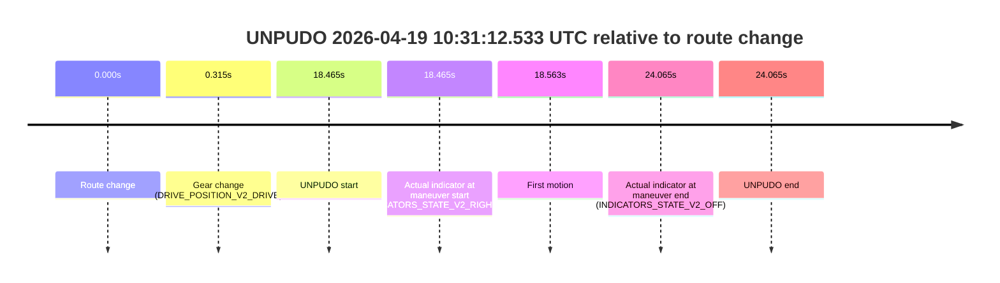
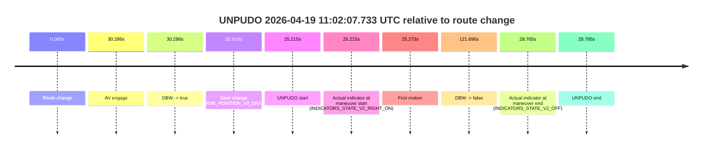
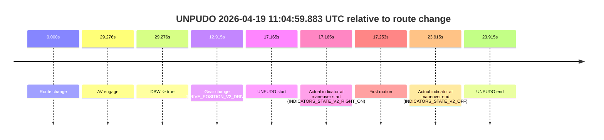

# Run Report: fme20002/2026-04-19--09-57-33--gen2-av-1dd37421-0ab8-4073-87e7-0831b082c239

| Field | Value |
|---|---|
| Run ID | `fme20002/2026-04-19--09-57-33--gen2-av-1dd37421-0ab8-4073-87e7-0831b082c239` |
| Date | `2026-04-19` |
| Model(s) | `plum-timeless-beaver` |
| Author | `peng.tang` |
| Event count | `8` |

## unpudo 2026-04-19 10:03:58.783 UTC

| Field | Value |
|---|---|
| Model | `plum-timeless-beaver` |
| Author | `peng.tang` |
| Run ID | `fme20002/2026-04-19--09-57-33--gen2-av-1dd37421-0ab8-4073-87e7-0831b082c239` |
| Date | `2026-04-19` |
| Time (UTC) | `10:03:58.783` |
| Event type | `unpudo` |
| Disengagement type | `none observed` |
| Route change | `found` |
| Console | [run](https://console.sso.wayve.ai/run/fme20002/2026-04-19--09-57-33--gen2-av-1dd37421-0ab8-4073-87e7-0831b082c239?id=&time-unixus=1776593038783319) |
| Foxglove | [segment](https://app.foxglove.dev/wayve-on-prem/p/prj_0dX18KZdVHg1fmmI/view?ds=foxglove-stream&ds.deviceName=fme20002&ds.start=2026-04-19T10%3A03%3A32.468320Z&ds.end=2026-04-19T10%3A04%3A58.573321Z&layoutId=lay_0e7VD4WIKDQGU73Y&time=2026-04-19T10%3A03%3A58.783319Z) |

### Event card: non-av

- Non-AV: there is no AV-owned portion anywhere inside the detected unpudo timeline, so it is kept for coverage but excluded from model success / failure scoring.

| Event | Time (UTC) | Delta from route change |
|---|---:|---:|
| Route change | 2026-04-19 10:03:42.468 | `0.000s` |
| AV engage | 2026-04-19 10:04:09.144 | `26.676s` |
| DBW -> true | 2026-04-19 10:04:09.144 | `26.676s` |
| Gear change (DRIVE_POSITION_V2_DRIVE) | 2026-04-19 10:03:51.683 | `9.215s` |
| UNPUDO start | 2026-04-19 10:03:58.783 | `16.315s` |
| Actual indicator at maneuver start (INDICATORS_STATE_V2_RIGHT_ON) | 2026-04-19 10:03:58.783 | `16.315s` |
| First motion | 2026-04-19 10:03:58.871 | `16.403s` |
| DBW -> false | 2026-04-19 10:04:48.573 | `66.105s` |
| Actual indicator at maneuver end (INDICATORS_STATE_V2_OFF) | 2026-04-19 10:04:03.833 | `21.365s` |
| UNPUDO end | 2026-04-19 10:04:03.833 | `21.365s` |

| Metric | Value |
|---|---|
| Outcome | `non-av` |
| Effective failure type | `none` |
| Route change status | `found` |
| DBW at event start | `false` |
| DBW at event end | `false` |
| Predicted gear at AV start | `DRIVE_POSITION_V2_DRIVE` |
| Actual gear at AV start | `DRIVE_POSITION_V2_DRIVE` |
| Predicted gear at event start | `DRIVE_POSITION_V2_DRIVE` |
| Actual gear at event start | `DRIVE_POSITION_V2_DRIVE` |
| Planned indicator direction | `INDICATORS_STATE_V2_RIGHT_ON` |
| Controller indicator direction | `INDICATORS_STATE_V2_RIGHT_ON` |
| Actual indicator direction | `INDICATORS_STATE_V2_RIGHT_ON` |
| Actual indicator at maneuver end | `INDICATORS_STATE_V2_OFF` |
| Driver accel help in AV | `false` |
| Driver accel help timestamp | `n/a` |
| Max accel pedal pct in AV | `0.0%` |
| Max brake pedal pct in AV | `0.0%` |
| Max speed mps in AV | `0.000` |
| Route -> AV | `26.676s` |
| AV -> event start | `-10.361s` |
| AV -> first motion | `-10.273s` |
| AV duration before disengagement | `39.429s` |
| Trajectory waypoint count | `37` |
| Driving-plan step count | `11` |

The scored portion starts from the AV-owned window, not from the pre-AV setup. Route-change search in the stopped pre-event segment was `found`, with the baseline therefore set to route change. At the event anchor the model predicts `DRIVE_POSITION_V2_DRIVE` and the actual gear is `DRIVE_POSITION_V2_DRIVE`. The effective model outcome is `non-av` because `there is no AV-owned overlap inside the event timeline`.

### Resolution

| Field | Value |
|---|---|
| Final outcome | `non-av` |
| Do we agree with this label? | `yes` |
| Source disengagement type | `none observed` |
| Resolved effective failure type | `none` |
| Confidence | `high` |

## unpudo 2026-04-19 10:23:01.133 UTC

| Field | Value |
|---|---|
| Model | `plum-timeless-beaver` |
| Author | `peng.tang` |
| Run ID | `fme20002/2026-04-19--09-57-33--gen2-av-1dd37421-0ab8-4073-87e7-0831b082c239` |
| Date | `2026-04-19` |
| Time (UTC) | `10:23:01.133` |
| Event type | `unpudo` |
| Disengagement type | `none observed` |
| Route change | `found` |
| Console | [run](https://console.sso.wayve.ai/run/fme20002/2026-04-19--09-57-33--gen2-av-1dd37421-0ab8-4073-87e7-0831b082c239?id=&time-unixus=1776594181133313) |
| Foxglove | [segment](https://app.foxglove.dev/wayve-on-prem/p/prj_0dX18KZdVHg1fmmI/view?ds=foxglove-stream&ds.deviceName=fme20002&ds.start=2026-04-19T10%3A22%3A40.968276Z&ds.end=2026-04-19T10%3A25%3A41.184373Z&layoutId=lay_0e7VD4WIKDQGU73Y&time=2026-04-19T10%3A23%3A01.133313Z) |

### Event card: non-av

- Non-AV: there is no AV-owned portion anywhere inside the detected unpudo timeline, so it is kept for coverage but excluded from model success / failure scoring.

| Event | Time (UTC) | Delta from route change |
|---|---:|---:|
| Route change | 2026-04-19 10:22:50.968 | `0.000s` |
| AV engage | 2026-04-19 10:23:06.694 | `15.726s` |
| DBW -> true | 2026-04-19 10:23:06.694 | `15.726s` |
| Gear change (DRIVE_POSITION_V2_DRIVE) | 2026-04-19 10:22:57.283 | `6.315s` |
| UNPUDO start | 2026-04-19 10:23:01.133 | `10.165s` |
| Actual indicator at maneuver start (INDICATORS_STATE_V2_RIGHT_ON) | 2026-04-19 10:23:01.133 | `10.165s` |
| First motion | 2026-04-19 10:23:01.171 | `10.203s` |
| DBW -> false | 2026-04-19 10:25:31.184 | `160.216s` |
| Actual indicator at maneuver end (INDICATORS_STATE_V2_OFF) | 2026-04-19 10:23:04.733 | `13.765s` |
| UNPUDO end | 2026-04-19 10:23:04.733 | `13.765s` |

| Metric | Value |
|---|---|
| Outcome | `non-av` |
| Effective failure type | `none` |
| Route change status | `found` |
| DBW at event start | `false` |
| DBW at event end | `false` |
| Predicted gear at AV start | `DRIVE_POSITION_V2_DRIVE` |
| Actual gear at AV start | `DRIVE_POSITION_V2_DRIVE` |
| Predicted gear at event start | `DRIVE_POSITION_V2_DRIVE` |
| Actual gear at event start | `DRIVE_POSITION_V2_DRIVE` |
| Planned indicator direction | `INDICATORS_STATE_V2_OFF` |
| Controller indicator direction | `INDICATORS_STATE_V2_OFF` |
| Actual indicator direction | `INDICATORS_STATE_V2_RIGHT_ON` |
| Actual indicator at maneuver end | `INDICATORS_STATE_V2_OFF` |
| Driver accel help in AV | `false` |
| Driver accel help timestamp | `n/a` |
| Max accel pedal pct in AV | `0.0%` |
| Max brake pedal pct in AV | `0.0%` |
| Max speed mps in AV | `0.000` |
| Route -> AV | `15.726s` |
| AV -> event start | `-5.561s` |
| AV -> first motion | `-5.523s` |
| AV duration before disengagement | `144.490s` |
| Trajectory waypoint count | `36` |
| Driving-plan step count | `11` |

The scored portion starts from the AV-owned window, not from the pre-AV setup. Route-change search in the stopped pre-event segment was `found`, with the baseline therefore set to route change. At the event anchor the model predicts `DRIVE_POSITION_V2_DRIVE` and the actual gear is `DRIVE_POSITION_V2_DRIVE`. The effective model outcome is `non-av` because `there is no AV-owned overlap inside the event timeline`.

### Resolution

| Field | Value |
|---|---|
| Final outcome | `non-av` |
| Do we agree with this label? | `yes` |
| Source disengagement type | `none observed` |
| Resolved effective failure type | `none` |
| Confidence | `high` |

## unpudo 2026-04-19 10:31:12.533 UTC

| Field | Value |
|---|---|
| Model | `plum-timeless-beaver` |
| Author | `peng.tang` |
| Run ID | `fme20002/2026-04-19--09-57-33--gen2-av-1dd37421-0ab8-4073-87e7-0831b082c239` |
| Date | `2026-04-19` |
| Time (UTC) | `10:31:12.533` |
| Event type | `unpudo` |
| Disengagement type | `none observed` |
| Route change | `found` |
| Console | [run](https://console.sso.wayve.ai/run/fme20002/2026-04-19--09-57-33--gen2-av-1dd37421-0ab8-4073-87e7-0831b082c239?id=&time-unixus=1776594672533297) |
| Foxglove | [segment](https://app.foxglove.dev/wayve-on-prem/p/prj_0dX18KZdVHg1fmmI/view?ds=foxglove-stream&ds.deviceName=fme20002&ds.start=2026-04-19T10%3A30%3A44.068279Z&ds.end=2026-04-19T10%3A31%3A28.133315Z&layoutId=lay_0e7VD4WIKDQGU73Y&time=2026-04-19T10%3A31%3A12.533297Z) |

### Event card: non-av

- Non-AV: there is no AV-owned portion anywhere inside the detected unpudo timeline, so it is kept for coverage but excluded from model success / failure scoring.

| Event | Time (UTC) | Delta from route change |
|---|---:|---:|
| Route change | 2026-04-19 10:30:54.068 | `0.000s` |
| Gear change (DRIVE_POSITION_V2_DRIVE) | 2026-04-19 10:30:54.383 | `0.315s` |
| UNPUDO start | 2026-04-19 10:31:12.533 | `18.465s` |
| Actual indicator at maneuver start (INDICATORS_STATE_V2_RIGHT_ON) | 2026-04-19 10:31:12.533 | `18.465s` |
| First motion | 2026-04-19 10:31:12.631 | `18.563s` |
| Actual indicator at maneuver end (INDICATORS_STATE_V2_OFF) | 2026-04-19 10:31:18.133 | `24.065s` |
| UNPUDO end | 2026-04-19 10:31:18.133 | `24.065s` |

| Metric | Value |
|---|---|
| Outcome | `non-av` |
| Effective failure type | `none` |
| Route change status | `found` |
| DBW at event start | `false` |
| DBW at event end | `false` |
| Predicted gear at AV start | `n/a` |
| Actual gear at AV start | `n/a` |
| Predicted gear at event start | `DRIVE_POSITION_V2_DRIVE` |
| Actual gear at event start | `DRIVE_POSITION_V2_DRIVE` |
| Planned indicator direction | `INDICATORS_STATE_V2_OFF` |
| Controller indicator direction | `INDICATORS_STATE_V2_OFF` |
| Actual indicator direction | `INDICATORS_STATE_V2_RIGHT_ON` |
| Actual indicator at maneuver end | `INDICATORS_STATE_V2_OFF` |
| Driver accel help in AV | `false` |
| Driver accel help timestamp | `n/a` |
| Max accel pedal pct in AV | `0.0%` |
| Max brake pedal pct in AV | `0.0%` |
| Max speed mps in AV | `0.000` |
| Route -> AV | `n/a` |
| AV -> event start | `n/a` |
| AV -> first motion | `n/a` |
| AV duration before disengagement | `n/a` |
| Trajectory waypoint count | `34` |
| Driving-plan step count | `11` |

The scored portion starts from the AV-owned window, not from the pre-AV setup. Route-change search in the stopped pre-event segment was `found`, with the baseline therefore set to route change. At the event anchor the model predicts `DRIVE_POSITION_V2_DRIVE` and the actual gear is `DRIVE_POSITION_V2_DRIVE`. The effective model outcome is `non-av` because `there is no AV-owned overlap inside the event timeline`.

### Resolution

| Field | Value |
|---|---|
| Final outcome | `non-av` |
| Do we agree with this label? | `yes` |
| Source disengagement type | `none observed` |
| Resolved effective failure type | `none` |
| Confidence | `high` |

## unpudo 2026-04-19 10:31:42.733 UTC

| Field | Value |
|---|---|
| Model | `plum-timeless-beaver` |
| Author | `peng.tang` |
| Run ID | `fme20002/2026-04-19--09-57-33--gen2-av-1dd37421-0ab8-4073-87e7-0831b082c239` |
| Date | `2026-04-19` |
| Time (UTC) | `10:31:42.733` |
| Event type | `unpudo` |
| Disengagement type | `none observed` |
| Route change | `found` |
| Console | [run](https://console.sso.wayve.ai/run/fme20002/2026-04-19--09-57-33--gen2-av-1dd37421-0ab8-4073-87e7-0831b082c239?id=&time-unixus=1776594702733315) |
| Foxglove | [segment](https://app.foxglove.dev/wayve-on-prem/p/prj_0dX18KZdVHg1fmmI/view?ds=foxglove-stream&ds.deviceName=fme20002&ds.start=2026-04-19T10%3A30%3A44.068279Z&ds.end=2026-04-19T10%3A35%3A41.014304Z&layoutId=lay_0e7VD4WIKDQGU73Y&time=2026-04-19T10%3A31%3A42.733315Z) |

### Event card: non-av

- Non-AV: there is no AV-owned portion anywhere inside the detected unpudo timeline, so it is kept for coverage but excluded from model success / failure scoring.

| Event | Time (UTC) | Delta from route change |
|---|---:|---:|
| Route change | 2026-04-19 10:30:54.068 | `0.000s` |
| AV engage | 2026-04-19 10:32:01.113 | `67.045s` |
| DBW -> true | 2026-04-19 10:32:01.113 | `67.045s` |
| Gear change (DRIVE_POSITION_V2_REVERSE) | 2026-04-19 10:31:37.583 | `43.515s` |
| UNPUDO start | 2026-04-19 10:31:42.733 | `48.665s` |
| Actual indicator at maneuver start (INDICATORS_STATE_V2_OFF) | 2026-04-19 10:31:42.733 | `48.665s` |
| First motion | 2026-04-19 10:31:53.411 | `59.343s` |
| DBW -> false | 2026-04-19 10:35:31.014 | `276.946s` |
| Actual indicator at maneuver end (INDICATORS_STATE_V2_OFF) | 2026-04-19 10:31:57.133 | `63.065s` |
| UNPUDO end | 2026-04-19 10:31:57.133 | `63.065s` |

| Metric | Value |
|---|---|
| Outcome | `non-av` |
| Effective failure type | `none` |
| Route change status | `found` |
| DBW at event start | `false` |
| DBW at event end | `false` |
| Predicted gear at AV start | `DRIVE_POSITION_V2_DRIVE` |
| Actual gear at AV start | `DRIVE_POSITION_V2_DRIVE` |
| Predicted gear at event start | `DRIVE_POSITION_V2_REVERSE` |
| Actual gear at event start | `DRIVE_POSITION_V2_REVERSE` |
| Planned indicator direction | `INDICATORS_STATE_V2_OFF` |
| Controller indicator direction | `INDICATORS_STATE_V2_OFF` |
| Actual indicator direction | `INDICATORS_STATE_V2_OFF` |
| Actual indicator at maneuver end | `INDICATORS_STATE_V2_OFF` |
| Driver accel help in AV | `false` |
| Driver accel help timestamp | `n/a` |
| Max accel pedal pct in AV | `0.0%` |
| Max brake pedal pct in AV | `0.0%` |
| Max speed mps in AV | `0.000` |
| Route -> AV | `67.045s` |
| AV -> event start | `-18.380s` |
| AV -> first motion | `-7.702s` |
| AV duration before disengagement | `209.901s` |
| Trajectory waypoint count | `36` |
| Driving-plan step count | `11` |

The scored portion starts from the AV-owned window, not from the pre-AV setup. Route-change search in the stopped pre-event segment was `found`, with the baseline therefore set to route change. At the event anchor the model predicts `DRIVE_POSITION_V2_REVERSE` and the actual gear is `DRIVE_POSITION_V2_REVERSE`. The effective model outcome is `non-av` because `there is no AV-owned overlap inside the event timeline`.

### Resolution

| Field | Value |
|---|---|
| Final outcome | `non-av` |
| Do we agree with this label? | `yes` |
| Source disengagement type | `none observed` |
| Resolved effective failure type | `none` |
| Confidence | `high` |

## unpudo 2026-04-19 10:53:32.833 UTC

| Field | Value |
|---|---|
| Model | `plum-timeless-beaver` |
| Author | `peng.tang` |
| Run ID | `fme20002/2026-04-19--09-57-33--gen2-av-1dd37421-0ab8-4073-87e7-0831b082c239` |
| Date | `2026-04-19` |
| Time (UTC) | `10:53:32.833` |
| Event type | `unpudo` |
| Disengagement type | `none observed` |
| Route change | `found` |
| Console | [run](https://console.sso.wayve.ai/run/fme20002/2026-04-19--09-57-33--gen2-av-1dd37421-0ab8-4073-87e7-0831b082c239?id=&time-unixus=1776596012833323) |
| Foxglove | [segment](https://app.foxglove.dev/wayve-on-prem/p/prj_0dX18KZdVHg1fmmI/view?ds=foxglove-stream&ds.deviceName=fme20002&ds.start=2026-04-19T10%3A52%3A45.068469Z&ds.end=2026-04-19T10%3A54%3A50.503406Z&layoutId=lay_0e7VD4WIKDQGU73Y&time=2026-04-19T10%3A53%3A32.833323Z) |

### Event card: non-av

- Non-AV: there is no AV-owned portion anywhere inside the detected unpudo timeline, so it is kept for coverage but excluded from model success / failure scoring.

| Event | Time (UTC) | Delta from route change |
|---|---:|---:|
| Route change | 2026-04-19 10:52:55.068 | `0.000s` |
| AV engage | 2026-04-19 10:53:39.743 | `44.675s` |
| DBW -> true | 2026-04-19 10:53:39.743 | `44.675s` |
| Gear change (DRIVE_POSITION_V2_DRIVE) | 2026-04-19 10:53:30.533 | `35.465s` |
| UNPUDO start | 2026-04-19 10:53:32.833 | `37.765s` |
| Actual indicator at maneuver start (INDICATORS_STATE_V2_RIGHT_ON) | 2026-04-19 10:53:32.833 | `37.765s` |
| First motion | 2026-04-19 10:53:32.871 | `37.803s` |
| DBW -> false | 2026-04-19 10:54:40.503 | `105.435s` |
| Actual indicator at maneuver end (INDICATORS_STATE_V2_OFF) | 2026-04-19 10:53:37.633 | `42.565s` |
| UNPUDO end | 2026-04-19 10:53:37.633 | `42.565s` |

| Metric | Value |
|---|---|
| Outcome | `non-av` |
| Effective failure type | `none` |
| Route change status | `found` |
| DBW at event start | `false` |
| DBW at event end | `false` |
| Predicted gear at AV start | `DRIVE_POSITION_V2_DRIVE` |
| Actual gear at AV start | `DRIVE_POSITION_V2_DRIVE` |
| Predicted gear at event start | `DRIVE_POSITION_V2_DRIVE` |
| Actual gear at event start | `DRIVE_POSITION_V2_DRIVE` |
| Planned indicator direction | `INDICATORS_STATE_V2_RIGHT_ON` |
| Controller indicator direction | `INDICATORS_STATE_V2_RIGHT_ON` |
| Actual indicator direction | `INDICATORS_STATE_V2_RIGHT_ON` |
| Actual indicator at maneuver end | `INDICATORS_STATE_V2_OFF` |
| Driver accel help in AV | `false` |
| Driver accel help timestamp | `n/a` |
| Max accel pedal pct in AV | `0.0%` |
| Max brake pedal pct in AV | `0.0%` |
| Max speed mps in AV | `0.000` |
| Route -> AV | `44.675s` |
| AV -> event start | `-6.910s` |
| AV -> first motion | `-6.872s` |
| AV duration before disengagement | `60.760s` |
| Trajectory waypoint count | `36` |
| Driving-plan step count | `11` |

The scored portion starts from the AV-owned window, not from the pre-AV setup. Route-change search in the stopped pre-event segment was `found`, with the baseline therefore set to route change. At the event anchor the model predicts `DRIVE_POSITION_V2_DRIVE` and the actual gear is `DRIVE_POSITION_V2_DRIVE`. The effective model outcome is `non-av` because `there is no AV-owned overlap inside the event timeline`.

### Resolution

| Field | Value |
|---|---|
| Final outcome | `non-av` |
| Do we agree with this label? | `yes` |
| Source disengagement type | `none observed` |
| Resolved effective failure type | `none` |
| Confidence | `high` |

## unpudo 2026-04-19 10:57:52.133 UTC

| Field | Value |
|---|---|
| Model | `plum-timeless-beaver` |
| Author | `peng.tang` |
| Run ID | `fme20002/2026-04-19--09-57-33--gen2-av-1dd37421-0ab8-4073-87e7-0831b082c239` |
| Date | `2026-04-19` |
| Time (UTC) | `10:57:52.133` |
| Event type | `unpudo` |
| Disengagement type | `none observed` |
| Route change | `found` |
| Console | [run](https://console.sso.wayve.ai/run/fme20002/2026-04-19--09-57-33--gen2-av-1dd37421-0ab8-4073-87e7-0831b082c239?id=&time-unixus=1776596272133295) |
| Foxglove | [segment](https://app.foxglove.dev/wayve-on-prem/p/prj_0dX18KZdVHg1fmmI/view?ds=foxglove-stream&ds.deviceName=fme20002&ds.start=2026-04-19T10%3A57%3A32.919868Z&ds.end=2026-04-19T11%3A01%3A44.613248Z&layoutId=lay_0e7VD4WIKDQGU73Y&time=2026-04-19T10%3A57%3A52.133295Z) |

### Event card: non-av

- Non-AV: there is no AV-owned portion anywhere inside the detected unpudo timeline, so it is kept for coverage but excluded from model success / failure scoring.

| Event | Time (UTC) | Delta from route change |
|---|---:|---:|
| Route change | 2026-04-19 10:57:42.919 | `0.000s` |
| AV engage | 2026-04-19 10:57:59.743 | `16.823s` |
| DBW -> true | 2026-04-19 10:57:59.743 | `16.823s` |
| Gear change (DRIVE_POSITION_V2_DRIVE) | 2026-04-19 10:57:48.733 | `5.813s` |
| UNPUDO start | 2026-04-19 10:57:52.133 | `9.213s` |
| Actual indicator at maneuver start (INDICATORS_STATE_V2_RIGHT_ON) | 2026-04-19 10:57:52.133 | `9.213s` |
| First motion | 2026-04-19 10:57:52.171 | `9.252s` |
| DBW -> false | 2026-04-19 11:01:34.613 | `231.693s` |
| Actual indicator at maneuver end (INDICATORS_STATE_V2_OFF) | 2026-04-19 10:57:56.183 | `13.263s` |
| UNPUDO end | 2026-04-19 10:57:56.183 | `13.263s` |

| Metric | Value |
|---|---|
| Outcome | `non-av` |
| Effective failure type | `none` |
| Route change status | `found` |
| DBW at event start | `false` |
| DBW at event end | `false` |
| Predicted gear at AV start | `DRIVE_POSITION_V2_DRIVE` |
| Actual gear at AV start | `DRIVE_POSITION_V2_DRIVE` |
| Predicted gear at event start | `DRIVE_POSITION_V2_DRIVE` |
| Actual gear at event start | `DRIVE_POSITION_V2_DRIVE` |
| Planned indicator direction | `INDICATORS_STATE_V2_RIGHT_ON` |
| Controller indicator direction | `INDICATORS_STATE_V2_RIGHT_ON` |
| Actual indicator direction | `INDICATORS_STATE_V2_RIGHT_ON` |
| Actual indicator at maneuver end | `INDICATORS_STATE_V2_OFF` |
| Driver accel help in AV | `false` |
| Driver accel help timestamp | `n/a` |
| Max accel pedal pct in AV | `0.0%` |
| Max brake pedal pct in AV | `0.0%` |
| Max speed mps in AV | `0.000` |
| Route -> AV | `16.823s` |
| AV -> event start | `-7.610s` |
| AV -> first motion | `-7.572s` |
| AV duration before disengagement | `214.870s` |
| Trajectory waypoint count | `36` |
| Driving-plan step count | `11` |

The scored portion starts from the AV-owned window, not from the pre-AV setup. Route-change search in the stopped pre-event segment was `found`, with the baseline therefore set to route change. At the event anchor the model predicts `DRIVE_POSITION_V2_DRIVE` and the actual gear is `DRIVE_POSITION_V2_DRIVE`. The effective model outcome is `non-av` because `there is no AV-owned overlap inside the event timeline`.

### Resolution

| Field | Value |
|---|---|
| Final outcome | `non-av` |
| Do we agree with this label? | `yes` |
| Source disengagement type | `none observed` |
| Resolved effective failure type | `none` |
| Confidence | `high` |

## unpudo 2026-04-19 11:02:07.733 UTC

| Field | Value |
|---|---|
| Model | `plum-timeless-beaver` |
| Author | `peng.tang` |
| Run ID | `fme20002/2026-04-19--09-57-33--gen2-av-1dd37421-0ab8-4073-87e7-0831b082c239` |
| Date | `2026-04-19` |
| Time (UTC) | `11:02:07.733` |
| Event type | `unpudo` |
| Disengagement type | `none observed` |
| Route change | `found` |
| Console | [run](https://console.sso.wayve.ai/run/fme20002/2026-04-19--09-57-33--gen2-av-1dd37421-0ab8-4073-87e7-0831b082c239?id=&time-unixus=1776596527733323) |
| Foxglove | [segment](https://app.foxglove.dev/wayve-on-prem/p/prj_0dX18KZdVHg1fmmI/view?ds=foxglove-stream&ds.deviceName=fme20002&ds.start=2026-04-19T11%3A01%3A32.518262Z&ds.end=2026-04-19T11%3A03%3A54.214265Z&layoutId=lay_0e7VD4WIKDQGU73Y&time=2026-04-19T11%3A02%3A07.733323Z) |

### Event card: non-av

- Non-AV: there is no AV-owned portion anywhere inside the detected unpudo timeline, so it is kept for coverage but excluded from model success / failure scoring.

| Event | Time (UTC) | Delta from route change |
|---|---:|---:|
| Route change | 2026-04-19 11:01:42.518 | `0.000s` |
| AV engage | 2026-04-19 11:02:12.804 | `30.286s` |
| DBW -> true | 2026-04-19 11:02:12.804 | `30.286s` |
| Gear change (DRIVE_POSITION_V2_DRIVE) | 2026-04-19 11:02:03.433 | `20.915s` |
| UNPUDO start | 2026-04-19 11:02:07.733 | `25.215s` |
| Actual indicator at maneuver start (INDICATORS_STATE_V2_RIGHT_ON) | 2026-04-19 11:02:07.733 | `25.215s` |
| First motion | 2026-04-19 11:02:07.791 | `25.273s` |
| DBW -> false | 2026-04-19 11:03:44.214 | `121.696s` |
| Actual indicator at maneuver end (INDICATORS_STATE_V2_OFF) | 2026-04-19 11:02:11.283 | `28.765s` |
| UNPUDO end | 2026-04-19 11:02:11.283 | `28.765s` |

| Metric | Value |
|---|---|
| Outcome | `non-av` |
| Effective failure type | `none` |
| Route change status | `found` |
| DBW at event start | `false` |
| DBW at event end | `false` |
| Predicted gear at AV start | `DRIVE_POSITION_V2_DRIVE` |
| Actual gear at AV start | `DRIVE_POSITION_V2_DRIVE` |
| Predicted gear at event start | `DRIVE_POSITION_V2_DRIVE` |
| Actual gear at event start | `DRIVE_POSITION_V2_DRIVE` |
| Planned indicator direction | `INDICATORS_STATE_V2_RIGHT_ON` |
| Controller indicator direction | `INDICATORS_STATE_V2_RIGHT_ON` |
| Actual indicator direction | `INDICATORS_STATE_V2_RIGHT_ON` |
| Actual indicator at maneuver end | `INDICATORS_STATE_V2_OFF` |
| Driver accel help in AV | `false` |
| Driver accel help timestamp | `n/a` |
| Max accel pedal pct in AV | `0.0%` |
| Max brake pedal pct in AV | `0.0%` |
| Max speed mps in AV | `0.000` |
| Route -> AV | `30.286s` |
| AV -> event start | `-5.071s` |
| AV -> first motion | `-5.013s` |
| AV duration before disengagement | `91.410s` |
| Trajectory waypoint count | `36` |
| Driving-plan step count | `11` |

The scored portion starts from the AV-owned window, not from the pre-AV setup. Route-change search in the stopped pre-event segment was `found`, with the baseline therefore set to route change. At the event anchor the model predicts `DRIVE_POSITION_V2_DRIVE` and the actual gear is `DRIVE_POSITION_V2_DRIVE`. The effective model outcome is `non-av` because `there is no AV-owned overlap inside the event timeline`.

### Resolution

| Field | Value |
|---|---|
| Final outcome | `non-av` |
| Do we agree with this label? | `yes` |
| Source disengagement type | `none observed` |
| Resolved effective failure type | `none` |
| Confidence | `high` |

## unpudo 2026-04-19 11:04:59.883 UTC

| Field | Value |
|---|---|
| Model | `plum-timeless-beaver` |
| Author | `peng.tang` |
| Run ID | `fme20002/2026-04-19--09-57-33--gen2-av-1dd37421-0ab8-4073-87e7-0831b082c239` |
| Date | `2026-04-19` |
| Time (UTC) | `11:04:59.883` |
| Event type | `unpudo` |
| Disengagement type | `none observed` |
| Route change | `found` |
| Console | [run](https://console.sso.wayve.ai/run/fme20002/2026-04-19--09-57-33--gen2-av-1dd37421-0ab8-4073-87e7-0831b082c239?id=&time-unixus=1776596699883320) |
| Foxglove | [segment](https://app.foxglove.dev/wayve-on-prem/p/prj_0dX18KZdVHg1fmmI/view?ds=foxglove-stream&ds.deviceName=fme20002&ds.start=2026-04-19T11%3A04%3A32.718264Z&ds.end=2026-04-19T11%3A05%3A16.633313Z&layoutId=lay_0e7VD4WIKDQGU73Y&time=2026-04-19T11%3A04%3A59.883320Z) |

### Event card: non-av

- Non-AV: there is no AV-owned portion anywhere inside the detected unpudo timeline, so it is kept for coverage but excluded from model success / failure scoring.

| Event | Time (UTC) | Delta from route change |
|---|---:|---:|
| Route change | 2026-04-19 11:04:42.718 | `0.000s` |
| AV engage | 2026-04-19 11:05:11.993 | `29.276s` |
| DBW -> true | 2026-04-19 11:05:11.993 | `29.276s` |
| Gear change (DRIVE_POSITION_V2_DRIVE) | 2026-04-19 11:04:55.633 | `12.915s` |
| UNPUDO start | 2026-04-19 11:04:59.883 | `17.165s` |
| Actual indicator at maneuver start (INDICATORS_STATE_V2_RIGHT_ON) | 2026-04-19 11:04:59.883 | `17.165s` |
| First motion | 2026-04-19 11:04:59.971 | `17.253s` |
| Actual indicator at maneuver end (INDICATORS_STATE_V2_OFF) | 2026-04-19 11:05:06.633 | `23.915s` |
| UNPUDO end | 2026-04-19 11:05:06.633 | `23.915s` |

| Metric | Value |
|---|---|
| Outcome | `non-av` |
| Effective failure type | `none` |
| Route change status | `found` |
| DBW at event start | `false` |
| DBW at event end | `false` |
| Predicted gear at AV start | `DRIVE_POSITION_V2_DRIVE` |
| Actual gear at AV start | `DRIVE_POSITION_V2_DRIVE` |
| Predicted gear at event start | `DRIVE_POSITION_V2_DRIVE` |
| Actual gear at event start | `DRIVE_POSITION_V2_DRIVE` |
| Planned indicator direction | `INDICATORS_STATE_V2_RIGHT_ON` |
| Controller indicator direction | `INDICATORS_STATE_V2_RIGHT_ON` |
| Actual indicator direction | `INDICATORS_STATE_V2_RIGHT_ON` |
| Actual indicator at maneuver end | `INDICATORS_STATE_V2_OFF` |
| Driver accel help in AV | `false` |
| Driver accel help timestamp | `n/a` |
| Max accel pedal pct in AV | `0.0%` |
| Max brake pedal pct in AV | `0.0%` |
| Max speed mps in AV | `0.000` |
| Route -> AV | `29.276s` |
| AV -> event start | `-12.111s` |
| AV -> first motion | `-12.022s` |
| AV duration before disengagement | `n/a` |
| Trajectory waypoint count | `35` |
| Driving-plan step count | `11` |

The scored portion starts from the AV-owned window, not from the pre-AV setup. Route-change search in the stopped pre-event segment was `found`, with the baseline therefore set to route change. At the event anchor the model predicts `DRIVE_POSITION_V2_DRIVE` and the actual gear is `DRIVE_POSITION_V2_DRIVE`. The effective model outcome is `non-av` because `there is no AV-owned overlap inside the event timeline`.

### Resolution

| Field | Value |
|---|---|
| Final outcome | `non-av` |
| Do we agree with this label? | `yes` |
| Source disengagement type | `none observed` |
| Resolved effective failure type | `none` |
| Confidence | `high` |
