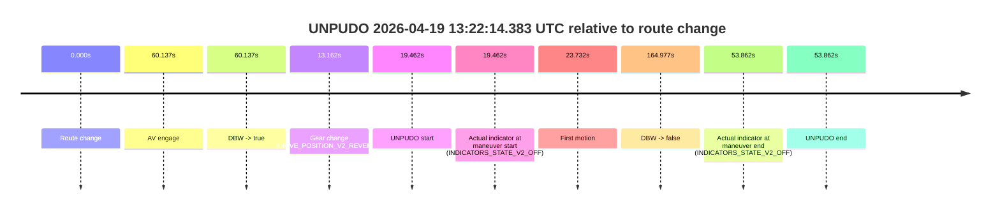
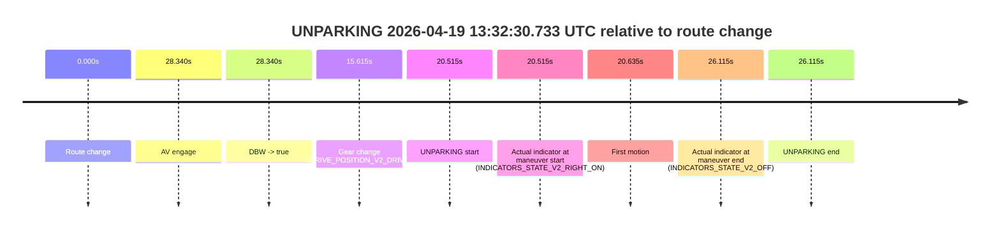

# Run Report: fme20002/2026-04-19--12-55-03--gen2-av-03c7b445-b8f6-46e9-a69e-337fee21d7be

| Field | Value |
|---|---|
| Run ID | `fme20002/2026-04-19--12-55-03--gen2-av-03c7b445-b8f6-46e9-a69e-337fee21d7be` |
| Date | `2026-04-19` |
| Model(s) | `plum-timeless-beaver` |
| Author | `peng.tang` |
| Event count | `3` |

## unpudo 2026-04-19 13:18:49.183 UTC

| Field | Value |
|---|---|
| Model | `plum-timeless-beaver` |
| Author | `peng.tang` |
| Run ID | `fme20002/2026-04-19--12-55-03--gen2-av-03c7b445-b8f6-46e9-a69e-337fee21d7be` |
| Date | `2026-04-19` |
| Time (UTC) | `13:18:49.183` |
| Event type | `unpudo` |
| Disengagement type | `none observed` |
| Route change | `found` |
| Console | [run](https://console.sso.wayve.ai/run/fme20002/2026-04-19--12-55-03--gen2-av-03c7b445-b8f6-46e9-a69e-337fee21d7be?id=&time-unixus=1776604729183292) |
| Foxglove | [segment](https://app.foxglove.dev/wayve-on-prem/p/prj_0dX18KZdVHg1fmmI/view?ds=foxglove-stream&ds.deviceName=fme20002&ds.start=2026-04-19T13%3A17%3A11.918288Z&ds.end=2026-04-19T13%3A21%3A16.639350Z&layoutId=lay_0e7VD4WIKDQGU73Y&time=2026-04-19T13%3A18%3A49.183292Z) |

### Event card: non-av

- Non-AV: there is no AV-owned portion anywhere inside the detected unpudo timeline, so it is kept for coverage but excluded from model success / failure scoring.

| Event | Time (UTC) | Delta from route change |
|---|---:|---:|
| Route change | 2026-04-19 13:17:21.918 | `0.000s` |
| AV engage | 2026-04-19 13:18:57.737 | `95.820s` |
| DBW -> true | 2026-04-19 13:18:57.737 | `95.820s` |
| Gear change (DRIVE_POSITION_V2_DRIVE) | 2026-04-19 13:18:45.333 | `83.415s` |
| UNPUDO start | 2026-04-19 13:18:49.183 | `87.265s` |
| Actual indicator at maneuver start (INDICATORS_STATE_V2_LEFT_ON) | 2026-04-19 13:18:49.183 | `87.265s` |
| First motion | 2026-04-19 13:18:49.293 | `87.376s` |
| DBW -> false | 2026-04-19 13:21:06.639 | `224.721s` |
| Actual indicator at maneuver end (INDICATORS_STATE_V2_OFF) | 2026-04-19 13:18:54.583 | `92.665s` |
| UNPUDO end | 2026-04-19 13:18:54.583 | `92.665s` |

| Metric | Value |
|---|---|
| Outcome | `non-av` |
| Effective failure type | `none` |
| Route change status | `found` |
| DBW at event start | `false` |
| DBW at event end | `false` |
| Predicted gear at AV start | `DRIVE_POSITION_V2_DRIVE` |
| Actual gear at AV start | `DRIVE_POSITION_V2_DRIVE` |
| Predicted gear at event start | `DRIVE_POSITION_V2_DRIVE` |
| Actual gear at event start | `DRIVE_POSITION_V2_DRIVE` |
| Planned indicator direction | `INDICATORS_STATE_V2_LEFT_ON` |
| Controller indicator direction | `INDICATORS_STATE_V2_LEFT_ON` |
| Actual indicator direction | `INDICATORS_STATE_V2_LEFT_ON` |
| Actual indicator at maneuver end | `INDICATORS_STATE_V2_OFF` |
| Driver accel help in AV | `false` |
| Driver accel help timestamp | `n/a` |
| Max accel pedal pct in AV | `0.0%` |
| Max brake pedal pct in AV | `0.0%` |
| Max speed mps in AV | `0.000` |
| Route -> AV | `95.820s` |
| AV -> event start | `-8.555s` |
| AV -> first motion | `-8.444s` |
| AV duration before disengagement | `128.901s` |
| Trajectory waypoint count | `36` |
| Driving-plan step count | `11` |

The scored portion starts from the AV-owned window, not from the pre-AV setup. Route-change search in the stopped pre-event segment was `found`, with the baseline therefore set to route change. At the event anchor the model predicts `DRIVE_POSITION_V2_DRIVE` and the actual gear is `DRIVE_POSITION_V2_DRIVE`. The effective model outcome is `non-av` because `there is no AV-owned overlap inside the event timeline`.

### Resolution

| Field | Value |
|---|---|
| Final outcome | `non-av` |
| Do we agree with this label? | `yes` |
| Source disengagement type | `none observed` |
| Resolved effective failure type | `none` |
| Confidence | `high` |

## unpudo 2026-04-19 13:22:14.383 UTC

| Field | Value |
|---|---|
| Model | `plum-timeless-beaver` |
| Author | `peng.tang` |
| Run ID | `fme20002/2026-04-19--12-55-03--gen2-av-03c7b445-b8f6-46e9-a69e-337fee21d7be` |
| Date | `2026-04-19` |
| Time (UTC) | `13:22:14.383` |
| Event type | `unpudo` |
| Disengagement type | `none observed` |
| Route change | `found` |
| Console | [run](https://console.sso.wayve.ai/run/fme20002/2026-04-19--12-55-03--gen2-av-03c7b445-b8f6-46e9-a69e-337fee21d7be?id=&time-unixus=1776604934383295) |
| Foxglove | [segment](https://app.foxglove.dev/wayve-on-prem/p/prj_0dX18KZdVHg1fmmI/view?ds=foxglove-stream&ds.deviceName=fme20002&ds.start=2026-04-19T13%3A21%3A44.921438Z&ds.end=2026-04-19T13%3A24%3A49.897981Z&layoutId=lay_0e7VD4WIKDQGU73Y&time=2026-04-19T13%3A22%3A14.383295Z) |

### Event card: non-av

- Non-AV: there is no AV-owned portion anywhere inside the detected unpudo timeline, so it is kept for coverage but excluded from model success / failure scoring.

| Event | Time (UTC) | Delta from route change |
|---|---:|---:|
| Route change | 2026-04-19 13:21:54.921 | `0.000s` |
| AV engage | 2026-04-19 13:22:55.058 | `60.137s` |
| DBW -> true | 2026-04-19 13:22:55.058 | `60.137s` |
| Gear change (DRIVE_POSITION_V2_REVERSE) | 2026-04-19 13:22:08.083 | `13.162s` |
| UNPUDO start | 2026-04-19 13:22:14.383 | `19.462s` |
| Actual indicator at maneuver start (INDICATORS_STATE_V2_OFF) | 2026-04-19 13:22:14.383 | `19.462s` |
| First motion | 2026-04-19 13:22:18.653 | `23.732s` |
| DBW -> false | 2026-04-19 13:24:39.897 | `164.977s` |
| Actual indicator at maneuver end (INDICATORS_STATE_V2_OFF) | 2026-04-19 13:22:48.783 | `53.862s` |
| UNPUDO end | 2026-04-19 13:22:48.783 | `53.862s` |

| Metric | Value |
|---|---|
| Outcome | `non-av` |
| Effective failure type | `none` |
| Route change status | `found` |
| DBW at event start | `false` |
| DBW at event end | `false` |
| Predicted gear at AV start | `DRIVE_POSITION_V2_DRIVE` |
| Actual gear at AV start | `DRIVE_POSITION_V2_DRIVE` |
| Predicted gear at event start | `DRIVE_POSITION_V2_REVERSE` |
| Actual gear at event start | `DRIVE_POSITION_V2_REVERSE` |
| Planned indicator direction | `INDICATORS_STATE_V2_OFF` |
| Controller indicator direction | `INDICATORS_STATE_V2_OFF` |
| Actual indicator direction | `INDICATORS_STATE_V2_OFF` |
| Actual indicator at maneuver end | `INDICATORS_STATE_V2_OFF` |
| Driver accel help in AV | `false` |
| Driver accel help timestamp | `n/a` |
| Max accel pedal pct in AV | `0.0%` |
| Max brake pedal pct in AV | `0.0%` |
| Max speed mps in AV | `0.000` |
| Route -> AV | `60.137s` |
| AV -> event start | `-40.675s` |
| AV -> first motion | `-36.405s` |
| AV duration before disengagement | `104.839s` |
| Trajectory waypoint count | `37` |
| Driving-plan step count | `11` |

The scored portion starts from the AV-owned window, not from the pre-AV setup. Route-change search in the stopped pre-event segment was `found`, with the baseline therefore set to route change. At the event anchor the model predicts `DRIVE_POSITION_V2_REVERSE` and the actual gear is `DRIVE_POSITION_V2_REVERSE`. The effective model outcome is `non-av` because `there is no AV-owned overlap inside the event timeline`.

### Resolution

| Field | Value |
|---|---|
| Final outcome | `non-av` |
| Do we agree with this label? | `yes` |
| Source disengagement type | `none observed` |
| Resolved effective failure type | `none` |
| Confidence | `high` |

## unparking 2026-04-19 13:32:30.733 UTC

| Field | Value |
|---|---|
| Model | `plum-timeless-beaver` |
| Author | `peng.tang` |
| Run ID | `fme20002/2026-04-19--12-55-03--gen2-av-03c7b445-b8f6-46e9-a69e-337fee21d7be` |
| Date | `2026-04-19` |
| Time (UTC) | `13:32:30.733` |
| Event type | `unparking` |
| Disengagement type | `none observed` |
| Route change | `found` |
| Console | [run](https://console.sso.wayve.ai/run/fme20002/2026-04-19--12-55-03--gen2-av-03c7b445-b8f6-46e9-a69e-337fee21d7be?id=&time-unixus=1776605550733307) |
| Foxglove | [segment](https://app.foxglove.dev/wayve-on-prem/p/prj_0dX18KZdVHg1fmmI/view?ds=foxglove-stream&ds.deviceName=fme20002&ds.start=2026-04-19T13%3A32%3A00.218266Z&ds.end=2026-04-19T13%3A32%3A46.333306Z&layoutId=lay_0e7VD4WIKDQGU73Y&time=2026-04-19T13%3A32%3A30.733307Z) |

### Event card: non-av

- Non-AV: there is no AV-owned portion anywhere inside the detected unparking timeline, so it is kept for coverage but excluded from model success / failure scoring.

| Event | Time (UTC) | Delta from route change |
|---|---:|---:|
| Route change | 2026-04-19 13:32:10.218 | `0.000s` |
| AV engage | 2026-04-19 13:32:38.558 | `28.340s` |
| DBW -> true | 2026-04-19 13:32:38.558 | `28.340s` |
| Gear change (DRIVE_POSITION_V2_DRIVE) | 2026-04-19 13:32:25.833 | `15.615s` |
| UNPARKING start | 2026-04-19 13:32:30.733 | `20.515s` |
| Actual indicator at maneuver start (INDICATORS_STATE_V2_RIGHT_ON) | 2026-04-19 13:32:30.733 | `20.515s` |
| First motion | 2026-04-19 13:32:30.853 | `20.635s` |
| Actual indicator at maneuver end (INDICATORS_STATE_V2_OFF) | 2026-04-19 13:32:36.333 | `26.115s` |
| UNPARKING end | 2026-04-19 13:32:36.333 | `26.115s` |

| Metric | Value |
|---|---|
| Outcome | `non-av` |
| Effective failure type | `none` |
| Route change status | `found` |
| DBW at event start | `false` |
| DBW at event end | `false` |
| Predicted gear at AV start | `DRIVE_POSITION_V2_DRIVE` |
| Actual gear at AV start | `DRIVE_POSITION_V2_DRIVE` |
| Predicted gear at event start | `DRIVE_POSITION_V2_DRIVE` |
| Actual gear at event start | `DRIVE_POSITION_V2_DRIVE` |
| Planned indicator direction | `INDICATORS_STATE_V2_RIGHT_ON` |
| Controller indicator direction | `INDICATORS_STATE_V2_RIGHT_ON` |
| Actual indicator direction | `INDICATORS_STATE_V2_RIGHT_ON` |
| Actual indicator at maneuver end | `INDICATORS_STATE_V2_OFF` |
| Driver accel help in AV | `false` |
| Driver accel help timestamp | `n/a` |
| Max accel pedal pct in AV | `0.0%` |
| Max brake pedal pct in AV | `0.0%` |
| Max speed mps in AV | `0.000` |
| Route -> AV | `28.340s` |
| AV -> event start | `-7.825s` |
| AV -> first motion | `-7.705s` |
| AV duration before disengagement | `n/a` |
| Trajectory waypoint count | `35` |
| Driving-plan step count | `11` |

The scored portion starts from the AV-owned window, not from the pre-AV setup. Route-change search in the stopped pre-event segment was `found`, with the baseline therefore set to route change. At the event anchor the model predicts `DRIVE_POSITION_V2_DRIVE` and the actual gear is `DRIVE_POSITION_V2_DRIVE`. The effective model outcome is `non-av` because `there is no AV-owned overlap inside the event timeline`.

### Resolution

| Field | Value |
|---|---|
| Final outcome | `non-av` |
| Do we agree with this label? | `yes` |
| Source disengagement type | `none observed` |
| Resolved effective failure type | `none` |
| Confidence | `high` |
