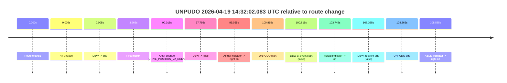

# Run Report: fme20002/2026-04-19--14-16-38--gen2-av-4e676dbb-1011-4d36-a366-bd27e65d798f

| Field | Value |
|---|---|
| Run ID | `fme20002/2026-04-19--14-16-38--gen2-av-4e676dbb-1011-4d36-a366-bd27e65d798f` |
| Date | `2026-04-19` |
| Model(s) | `eel-teal-outspoken` |
| Author | `zak` |
| Event count | `1` |

## unpudo 2026-04-19 14:32:02.083 UTC

| Field | Value |
|---|---|
| Model | `eel-teal-outspoken` |
| Author | `zak` |
| Run ID | `fme20002/2026-04-19--14-16-38--gen2-av-4e676dbb-1011-4d36-a366-bd27e65d798f` |
| Date | `2026-04-19` |
| Time (UTC) | `14:32:02.083` |
| Event type | `unpudo` |
| Disengagement type | `failed_to_follow_route_map` |
| Route change | `found` |
| Console | [run](https://console.sso.wayve.ai/run/fme20002/2026-04-19--14-16-38--gen2-av-4e676dbb-1011-4d36-a366-bd27e65d798f?id=&time-unixus=1776609122083295) |
| Foxglove | [segment](https://app.foxglove.dev/wayve-on-prem/p/prj_0dX18KZdVHg1fmmI/view?ds=foxglove-stream&ds.deviceName=fme20002&ds.start=2026-04-19T14%3A30%3A11.268275Z&ds.end=2026-04-19T14%3A32%3A19.633306Z&layoutId=lay_0e7VD4WIKDQGU73Y&time=2026-04-19T14%3A32%3A02.083295Z) |

### Event card: fail

- Fail: AV owns part of the segment, but the event still resolves as a model-performance failure under the AV-only scoring rule.

| Event | Time (UTC) | Delta from route change |
|---|---:|---:|
| Route change | 2026-04-19 14:30:21.268 | `0.000s` |
| AV engage | 2026-04-19 14:30:21.272 | `0.005s` |
| DBW -> true | 2026-04-19 14:30:21.272 | `0.005s` |
| First motion | 2026-04-19 14:30:25.233 | `3.965s` |
| Gear change (DRIVE_POSITION_V2_DRIVE) | 2026-04-19 14:31:51.283 | `90.015s` |
| DBW -> false | 2026-04-19 14:31:59.062 | `97.795s` |
| Actual indicator -> right on | 2026-04-19 14:32:00.333 | `99.065s` |
| UNPUDO start | 2026-04-19 14:32:02.083 | `100.815s` |
| DBW at event start (false) | 2026-04-19 14:32:02.083 | `100.815s` |
| Actual indicator -> off | 2026-04-19 14:32:05.013 | `103.745s` |
| DBW at event end (false) | 2026-04-19 14:32:09.633 | `108.365s` |
| UNPUDO end | 2026-04-19 14:32:09.633 | `108.365s` |
| Actual indicator -> right on | 2026-04-19 14:32:09.853 | `108.585s` |

| Metric | Value |
|---|---|
| Outcome | `fail` |
| Effective failure type | `failed_to_follow_route_map` |
| Route change status | `found` |
| DBW at event start | `false` |
| DBW at event end | `false` |
| Predicted gear at AV start | `DRIVE_POSITION_V2_PARK` |
| Actual gear at AV start | `DRIVE_POSITION_V2_PARK` |
| Predicted gear at event start | `DRIVE_POSITION_V2_DRIVE` |
| Actual gear at event start | `DRIVE_POSITION_V2_DRIVE` |
| Planned indicator direction | `INDICATORS_STATE_V2_RIGHT_ON` |
| Controller indicator direction | `INDICATORS_STATE_V2_RIGHT_ON` |
| Actual indicator direction | `INDICATORS_STATE_V2_RIGHT_ON` |
| Actual indicator at maneuver end | `INDICATORS_STATE_V2_OFF` |
| Driver accel help in AV | `false` |
| Driver accel help timestamp | `n/a` |
| Max accel pedal pct in AV | `0.0%` |
| Max brake pedal pct in AV | `9.2%` |
| Max speed mps in AV | `8.103` |
| Success timing baseline | `route change` |
| Route -> AV | `0.005s` |
| AV -> event start | `100.810s` |
| AV -> first motion | `3.960s` |
| Success baseline -> event start | `100.815s` |
| Success baseline -> first motion | `3.965s` |
| AV duration before disengagement | `97.790s` |
| Trajectory waypoint count | `37` |
| Driving-plan step count | `11` |

The scored portion starts from the AV-owned window, not from the pre-AV setup. Route-change search in the stopped pre-event segment was `found`, with the baseline therefore set to route change. At the event anchor the model predicts `DRIVE_POSITION_V2_DRIVE` and the actual gear is `DRIVE_POSITION_V2_DRIVE`. The effective model outcome is `fail` because `failed_to_follow_route_map.`

### Resolution

| Field | Value |
|---|---|
| Final outcome | `fail` |
| Do we agree with this label? | `yes` |
| Source disengagement type | `failed_to_follow_route_map` |
| Resolved effective failure type | `failed_to_follow_route_map` |
| Confidence | `high` |
