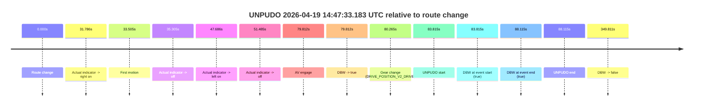
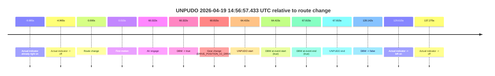
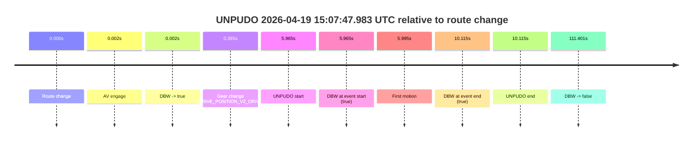
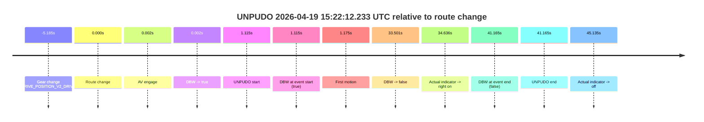

# Run Report: fme20002/2026-04-19--14-45-17--gen2-av-268d1544-fbaa-4d06-bdb2-4fc25e4b0543

| Field | Value |
|---|---|
| Run ID | `fme20002/2026-04-19--14-45-17--gen2-av-268d1544-fbaa-4d06-bdb2-4fc25e4b0543` |
| Date | `2026-04-19` |
| Model(s) | `eel-teal-outspoken` |
| Author | `zak` |
| Event count | `4` |

## unpudo 2026-04-19 14:47:33.183 UTC

| Field | Value |
|---|---|
| Model | `eel-teal-outspoken` |
| Author | `zak` |
| Run ID | `fme20002/2026-04-19--14-45-17--gen2-av-268d1544-fbaa-4d06-bdb2-4fc25e4b0543` |
| Date | `2026-04-19` |
| Time (UTC) | `14:47:33.183` |
| Event type | `unpudo` |
| Disengagement type | `none observed` |
| Route change | `found` |
| Console | [run](https://console.sso.wayve.ai/run/fme20002/2026-04-19--14-45-17--gen2-av-268d1544-fbaa-4d06-bdb2-4fc25e4b0543?id=&time-unixus=1776610053183300) |
| Foxglove | [segment](https://app.foxglove.dev/wayve-on-prem/p/prj_0dX18KZdVHg1fmmI/view?ds=foxglove-stream&ds.deviceName=fme20002&ds.start=2026-04-19T14%3A45%3A59.368271Z&ds.end=2026-04-19T14%3A52%3A09.179415Z&layoutId=lay_0e7VD4WIKDQGU73Y&time=2026-04-19T14%3A47%3A33.183300Z) |

### Event card: pass

- Pass: AV owns the credited unpudo from route change through the official unpudo window, the gear state is aligned at the anchor, and the vehicle moves without driver accelerator help in AV.

| Event | Time (UTC) | Delta from route change |
|---|---:|---:|
| Route change | 2026-04-19 14:46:09.368 | `0.000s` |
| Actual indicator -> right on | 2026-04-19 14:46:41.153 | `31.786s` |
| First motion | 2026-04-19 14:46:42.873 | `33.505s` |
| Actual indicator -> off | 2026-04-19 14:46:44.673 | `35.305s` |
| Actual indicator -> left on | 2026-04-19 14:46:57.054 | `47.686s` |
| Actual indicator -> off | 2026-04-19 14:47:00.853 | `51.485s` |
| AV engage | 2026-04-19 14:47:29.180 | `79.812s` |
| DBW -> true | 2026-04-19 14:47:29.180 | `79.812s` |
| Gear change (DRIVE_POSITION_V2_DRIVE) | 2026-04-19 14:47:29.633 | `80.265s` |
| UNPUDO start | 2026-04-19 14:47:33.183 | `83.815s` |
| DBW at event start (true) | 2026-04-19 14:47:33.183 | `83.815s` |
| DBW at event end (true) | 2026-04-19 14:47:37.483 | `88.115s` |
| UNPUDO end | 2026-04-19 14:47:37.483 | `88.115s` |
| DBW -> false | 2026-04-19 14:51:59.179 | `349.811s` |

| Metric | Value |
|---|---|
| Outcome | `pass` |
| Effective failure type | `none` |
| Route change status | `found` |
| DBW at event start | `true` |
| DBW at event end | `true` |
| Predicted gear at AV start | `DRIVE_POSITION_V2_DRIVE` |
| Actual gear at AV start | `DRIVE_POSITION_V2_PARK` |
| Predicted gear at event start | `DRIVE_POSITION_V2_DRIVE` |
| Actual gear at event start | `DRIVE_POSITION_V2_DRIVE` |
| Planned indicator direction | `INDICATORS_STATE_V2_RIGHT_ON` |
| Controller indicator direction | `INDICATORS_STATE_V2_RIGHT_ON` |
| Actual indicator direction | `INDICATORS_STATE_V2_OFF` |
| Actual indicator at maneuver end | `INDICATORS_STATE_V2_OFF` |
| Driver accel help in AV | `false` |
| Driver accel help timestamp | `n/a` |
| Max accel pedal pct in AV | `0.0%` |
| Max brake pedal pct in AV | `8.0%` |
| Max speed mps in AV | `3.956` |
| Success timing baseline | `route change` |
| Route -> AV | `79.812s` |
| AV -> event start | `4.003s` |
| AV -> first motion | `-46.307s` |
| Success baseline -> event start | `83.815s` |
| Success baseline -> first motion | `33.505s` |
| AV duration before disengagement | `269.999s` |
| Trajectory waypoint count | `37` |
| Driving-plan step count | `11` |

The scored portion starts from the AV-owned window, not from the pre-AV setup. Route-change search in the stopped pre-event segment was `found`, with the baseline therefore set to route change. At the event anchor the model predicts `DRIVE_POSITION_V2_DRIVE` and the actual gear is `DRIVE_POSITION_V2_DRIVE`. The effective model outcome is `pass` because `the credited unpudo stays AV-owned through the official unpudo window.`

### Resolution

| Field | Value |
|---|---|
| Final outcome | `pass` |
| Do we agree with this label? | `yes` |
| Source disengagement type | `none observed` |
| Resolved effective failure type | `none` |
| Confidence | `high` |

## unpudo 2026-04-19 14:56:57.433 UTC

| Field | Value |
|---|---|
| Model | `eel-teal-outspoken` |
| Author | `zak` |
| Run ID | `fme20002/2026-04-19--14-45-17--gen2-av-268d1544-fbaa-4d06-bdb2-4fc25e4b0543` |
| Date | `2026-04-19` |
| Time (UTC) | `14:56:57.433` |
| Event type | `unpudo` |
| Disengagement type | `none observed` |
| Route change | `found` |
| Console | [run](https://console.sso.wayve.ai/run/fme20002/2026-04-19--14-45-17--gen2-av-268d1544-fbaa-4d06-bdb2-4fc25e4b0543?id=&time-unixus=1776610617433317) |
| Foxglove | [segment](https://app.foxglove.dev/wayve-on-prem/p/prj_0dX18KZdVHg1fmmI/view?ds=foxglove-stream&ds.deviceName=fme20002&ds.start=2026-04-19T14%3A55%3A43.018508Z&ds.end=2026-04-19T14%3A58%3A11.160364Z&layoutId=lay_0e7VD4WIKDQGU73Y&time=2026-04-19T14%3A56%3A57.433317Z) |

### Event card: pass

- Pass: AV owns the credited unpudo from route change through the official unpudo window, the gear state is aligned at the anchor, and the vehicle moves without driver accelerator help in AV.

| Event | Time (UTC) | Delta from route change |
|---|---:|---:|
| Actual indicator already right on | 2026-04-19 14:55:43.033 | `-9.985s` |
| Actual indicator -> off | 2026-04-19 14:55:48.053 | `-4.965s` |
| Route change | 2026-04-19 14:55:53.018 | `0.000s` |
| First motion | 2026-04-19 14:55:53.033 | `0.015s` |
| AV engage | 2026-04-19 14:56:53.340 | `60.322s` |
| DBW -> true | 2026-04-19 14:56:53.340 | `60.322s` |
| Gear change (DRIVE_POSITION_V2_DRIVE) | 2026-04-19 14:56:53.833 | `60.815s` |
| UNPUDO start | 2026-04-19 14:56:57.433 | `64.415s` |
| DBW at event start (true) | 2026-04-19 14:56:57.433 | `64.415s` |
| DBW at event end (true) | 2026-04-19 14:57:00.833 | `67.815s` |
| UNPUDO end | 2026-04-19 14:57:00.833 | `67.815s` |
| DBW -> false | 2026-04-19 14:58:01.160 | `128.142s` |
| Actual indicator -> left on | 2026-04-19 14:58:02.633 | `129.615s` |
| Actual indicator -> off | 2026-04-19 14:58:10.293 | `137.275s` |

| Metric | Value |
|---|---|
| Outcome | `pass` |
| Effective failure type | `none` |
| Route change status | `found` |
| DBW at event start | `true` |
| DBW at event end | `true` |
| Predicted gear at AV start | `DRIVE_POSITION_V2_DRIVE` |
| Actual gear at AV start | `DRIVE_POSITION_V2_PARK` |
| Predicted gear at event start | `DRIVE_POSITION_V2_DRIVE` |
| Actual gear at event start | `DRIVE_POSITION_V2_DRIVE` |
| Planned indicator direction | `INDICATORS_STATE_V2_LEFT_ON` |
| Controller indicator direction | `INDICATORS_STATE_V2_LEFT_ON` |
| Actual indicator direction | `INDICATORS_STATE_V2_OFF` |
| Actual indicator at maneuver end | `INDICATORS_STATE_V2_OFF` |
| Driver accel help in AV | `false` |
| Driver accel help timestamp | `n/a` |
| Max accel pedal pct in AV | `0.0%` |
| Max brake pedal pct in AV | `8.0%` |
| Max speed mps in AV | `4.347` |
| Success timing baseline | `route change` |
| Route -> AV | `60.322s` |
| AV -> event start | `4.093s` |
| AV -> first motion | `-60.307s` |
| Success baseline -> event start | `64.415s` |
| Success baseline -> first motion | `0.015s` |
| AV duration before disengagement | `67.820s` |
| Trajectory waypoint count | `36` |
| Driving-plan step count | `11` |

The scored portion starts from the AV-owned window, not from the pre-AV setup. Route-change search in the stopped pre-event segment was `found`, with the baseline therefore set to route change. At the event anchor the model predicts `DRIVE_POSITION_V2_DRIVE` and the actual gear is `DRIVE_POSITION_V2_DRIVE`. The effective model outcome is `pass` because `the credited unpudo stays AV-owned through the official unpudo window.`

### Resolution

| Field | Value |
|---|---|
| Final outcome | `pass` |
| Do we agree with this label? | `yes` |
| Source disengagement type | `none observed` |
| Resolved effective failure type | `none` |
| Confidence | `high` |

## unpudo 2026-04-19 15:07:47.983 UTC

| Field | Value |
|---|---|
| Model | `eel-teal-outspoken` |
| Author | `zak` |
| Run ID | `fme20002/2026-04-19--14-45-17--gen2-av-268d1544-fbaa-4d06-bdb2-4fc25e4b0543` |
| Date | `2026-04-19` |
| Time (UTC) | `15:07:47.983` |
| Event type | `unpudo` |
| Disengagement type | `none observed` |
| Route change | `found` |
| Console | [run](https://console.sso.wayve.ai/run/fme20002/2026-04-19--14-45-17--gen2-av-268d1544-fbaa-4d06-bdb2-4fc25e4b0543?id=&time-unixus=1776611267983303) |
| Foxglove | [segment](https://app.foxglove.dev/wayve-on-prem/p/prj_0dX18KZdVHg1fmmI/view?ds=foxglove-stream&ds.deviceName=fme20002&ds.start=2026-04-19T15%3A07%3A32.018278Z&ds.end=2026-04-19T15%3A09%3A43.419443Z&layoutId=lay_0e7VD4WIKDQGU73Y&time=2026-04-19T15%3A07%3A47.983303Z) |

### Event card: pass

- Pass: AV owns the credited unpudo from route change through the official unpudo window, the gear state is aligned at the anchor, and the vehicle moves without driver accelerator help in AV.

| Event | Time (UTC) | Delta from route change |
|---|---:|---:|
| Route change | 2026-04-19 15:07:42.018 | `0.000s` |
| AV engage | 2026-04-19 15:07:42.020 | `0.002s` |
| DBW -> true | 2026-04-19 15:07:42.020 | `0.002s` |
| Gear change (DRIVE_POSITION_V2_DRIVE) | 2026-04-19 15:07:42.383 | `0.365s` |
| UNPUDO start | 2026-04-19 15:07:47.983 | `5.965s` |
| DBW at event start (true) | 2026-04-19 15:07:47.983 | `5.965s` |
| First motion | 2026-04-19 15:07:48.013 | `5.995s` |
| DBW at event end (true) | 2026-04-19 15:07:52.133 | `10.115s` |
| UNPUDO end | 2026-04-19 15:07:52.133 | `10.115s` |
| DBW -> false | 2026-04-19 15:09:33.419 | `111.401s` |

| Metric | Value |
|---|---|
| Outcome | `pass` |
| Effective failure type | `none` |
| Route change status | `found` |
| DBW at event start | `true` |
| DBW at event end | `true` |
| Predicted gear at AV start | `DRIVE_POSITION_V2_PARK` |
| Actual gear at AV start | `DRIVE_POSITION_V2_PARK` |
| Predicted gear at event start | `DRIVE_POSITION_V2_DRIVE` |
| Actual gear at event start | `DRIVE_POSITION_V2_DRIVE` |
| Planned indicator direction | `INDICATORS_STATE_V2_RIGHT_ON` |
| Controller indicator direction | `INDICATORS_STATE_V2_RIGHT_ON` |
| Actual indicator direction | `INDICATORS_STATE_V2_OFF` |
| Actual indicator at maneuver end | `INDICATORS_STATE_V2_OFF` |
| Driver accel help in AV | `false` |
| Driver accel help timestamp | `n/a` |
| Max accel pedal pct in AV | `0.0%` |
| Max brake pedal pct in AV | `8.0%` |
| Max speed mps in AV | `4.758` |
| Success timing baseline | `route change` |
| Route -> AV | `0.002s` |
| AV -> event start | `5.963s` |
| AV -> first motion | `5.993s` |
| Success baseline -> event start | `5.965s` |
| Success baseline -> first motion | `5.995s` |
| AV duration before disengagement | `111.399s` |
| Trajectory waypoint count | `37` |
| Driving-plan step count | `11` |

The scored portion starts from the AV-owned window, not from the pre-AV setup. Route-change search in the stopped pre-event segment was `found`, with the baseline therefore set to route change. At the event anchor the model predicts `DRIVE_POSITION_V2_DRIVE` and the actual gear is `DRIVE_POSITION_V2_DRIVE`. The effective model outcome is `pass` because `the credited unpudo stays AV-owned through the official unpudo window.`

### Resolution

| Field | Value |
|---|---|
| Final outcome | `pass` |
| Do we agree with this label? | `yes` |
| Source disengagement type | `none observed` |
| Resolved effective failure type | `none` |
| Confidence | `high` |

## unpudo 2026-04-19 15:22:12.233 UTC

| Field | Value |
|---|---|
| Model | `eel-teal-outspoken` |
| Author | `zak` |
| Run ID | `fme20002/2026-04-19--14-45-17--gen2-av-268d1544-fbaa-4d06-bdb2-4fc25e4b0543` |
| Date | `2026-04-19` |
| Time (UTC) | `15:22:12.233` |
| Event type | `unpudo` |
| Disengagement type | `none observed` |
| Route change | `found` |
| Console | [run](https://console.sso.wayve.ai/run/fme20002/2026-04-19--14-45-17--gen2-av-268d1544-fbaa-4d06-bdb2-4fc25e4b0543?id=&time-unixus=1776612132233315) |
| Foxglove | [segment](https://app.foxglove.dev/wayve-on-prem/p/prj_0dX18KZdVHg1fmmI/view?ds=foxglove-stream&ds.deviceName=fme20002&ds.start=2026-04-19T15%3A21%3A55.933302Z&ds.end=2026-04-19T15%3A23%3A02.283319Z&layoutId=lay_0e7VD4WIKDQGU73Y&time=2026-04-19T15%3A22%3A12.233315Z) |

### Event card: fail

- Fail: the credited unpudo does not stay AV-owned. The event window starts with DBW true, and the maneuver outcome lands outside a clean AV-owned segment.

| Event | Time (UTC) | Delta from route change |
|---|---:|---:|
| Gear change (DRIVE_POSITION_V2_DRIVE) | 2026-04-19 15:22:05.933 | `-5.185s` |
| Route change | 2026-04-19 15:22:11.118 | `0.000s` |
| AV engage | 2026-04-19 15:22:11.120 | `0.002s` |
| DBW -> true | 2026-04-19 15:22:11.120 | `0.002s` |
| UNPUDO start | 2026-04-19 15:22:12.233 | `1.115s` |
| DBW at event start (true) | 2026-04-19 15:22:12.233 | `1.115s` |
| First motion | 2026-04-19 15:22:12.293 | `1.175s` |
| DBW -> false | 2026-04-19 15:22:44.619 | `33.501s` |
| Actual indicator -> right on | 2026-04-19 15:22:45.753 | `34.636s` |
| DBW at event end (false) | 2026-04-19 15:22:52.283 | `41.165s` |
| UNPUDO end | 2026-04-19 15:22:52.283 | `41.165s` |
| Actual indicator -> off | 2026-04-19 15:22:56.253 | `45.135s` |

| Metric | Value |
|---|---|
| Outcome | `fail` |
| Effective failure type | `driver_completed_maneuver` |
| Route change status | `found` |
| DBW at event start | `true` |
| DBW at event end | `false` |
| Predicted gear at AV start | `DRIVE_POSITION_V2_DRIVE` |
| Actual gear at AV start | `DRIVE_POSITION_V2_DRIVE` |
| Predicted gear at event start | `DRIVE_POSITION_V2_DRIVE` |
| Actual gear at event start | `DRIVE_POSITION_V2_DRIVE` |
| Planned indicator direction | `INDICATORS_STATE_V2_OFF` |
| Controller indicator direction | `INDICATORS_STATE_V2_OFF` |
| Actual indicator direction | `INDICATORS_STATE_V2_OFF` |
| Actual indicator at maneuver end | `INDICATORS_STATE_V2_RIGHT_ON` |
| Driver accel help in AV | `false` |
| Driver accel help timestamp | `n/a` |
| Max accel pedal pct in AV | `0.0%` |
| Max brake pedal pct in AV | `11.6%` |
| Max speed mps in AV | `1.572` |
| Success timing baseline | `route change` |
| Route -> AV | `0.002s` |
| AV -> event start | `1.113s` |
| AV -> first motion | `1.173s` |
| Success baseline -> event start | `1.115s` |
| Success baseline -> first motion | `1.175s` |
| AV duration before disengagement | `33.499s` |
| Trajectory waypoint count | `38` |
| Driving-plan step count | `11` |

The scored portion starts from the AV-owned window, not from the pre-AV setup. Route-change search in the stopped pre-event segment was `found`, with the baseline therefore set to route change. At the event anchor the model predicts `DRIVE_POSITION_V2_DRIVE` and the actual gear is `DRIVE_POSITION_V2_DRIVE`. The effective model outcome is `fail` because `driver_completed_maneuver.`

### Resolution

| Field | Value |
|---|---|
| Final outcome | `fail` |
| Do we agree with this label? | `yes` |
| Source disengagement type | `none observed` |
| Resolved effective failure type | `driver_completed_maneuver` |
| Confidence | `high` |
