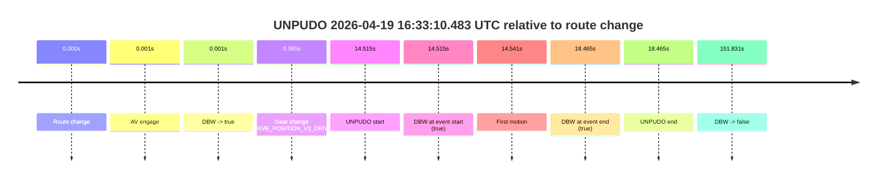
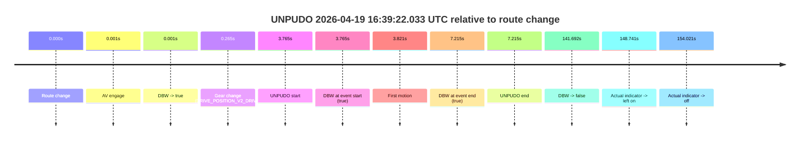
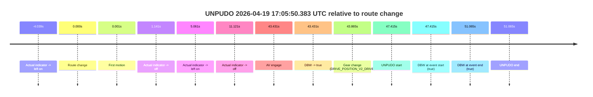

# Run Report: fme20002/2026-04-19--16-18-14--gen2-av-ed1a3c2c-1981-4577-87d0-0f09fb2bcfbb

| Field | Value |
|---|---|
| Run ID | `fme20002/2026-04-19--16-18-14--gen2-av-ed1a3c2c-1981-4577-87d0-0f09fb2bcfbb` |
| Date | `2026-04-19` |
| Model(s) | `eel-teal-outspoken` |
| Author | `zak` |
| Event count | `3` |

## unpudo 2026-04-19 16:33:10.483 UTC

| Field | Value |
|---|---|
| Model | `eel-teal-outspoken` |
| Author | `zak` |
| Run ID | `fme20002/2026-04-19--16-18-14--gen2-av-ed1a3c2c-1981-4577-87d0-0f09fb2bcfbb` |
| Date | `2026-04-19` |
| Time (UTC) | `16:33:10.483` |
| Event type | `unpudo` |
| Disengagement type | `none observed` |
| Route change | `found` |
| Console | [run](https://console.sso.wayve.ai/run/fme20002/2026-04-19--16-18-14--gen2-av-ed1a3c2c-1981-4577-87d0-0f09fb2bcfbb?id=&time-unixus=1776616390483316) |
| Foxglove | [segment](https://app.foxglove.dev/wayve-on-prem/p/prj_0dX18KZdVHg1fmmI/view?ds=foxglove-stream&ds.deviceName=fme20002&ds.start=2026-04-19T16%3A32%3A45.968267Z&ds.end=2026-04-19T16%3A35%3A37.799479Z&layoutId=lay_0e7VD4WIKDQGU73Y&time=2026-04-19T16%3A33%3A10.483316Z) |

### Event card: pass

- Pass: AV owns the credited unpudo from route change through the official unpudo window, the gear state is aligned at the anchor, and the vehicle moves without driver accelerator help in AV.

| Event | Time (UTC) | Delta from route change |
|---|---:|---:|
| Route change | 2026-04-19 16:32:55.968 | `0.000s` |
| AV engage | 2026-04-19 16:32:55.969 | `0.001s` |
| DBW -> true | 2026-04-19 16:32:55.969 | `0.001s` |
| Gear change (DRIVE_POSITION_V2_DRIVE) | 2026-04-19 16:32:56.333 | `0.365s` |
| UNPUDO start | 2026-04-19 16:33:10.483 | `14.515s` |
| DBW at event start (true) | 2026-04-19 16:33:10.483 | `14.515s` |
| First motion | 2026-04-19 16:33:10.509 | `14.541s` |
| DBW at event end (true) | 2026-04-19 16:33:14.433 | `18.465s` |
| UNPUDO end | 2026-04-19 16:33:14.433 | `18.465s` |
| DBW -> false | 2026-04-19 16:35:27.799 | `151.831s` |

| Metric | Value |
|---|---|
| Outcome | `pass` |
| Effective failure type | `none` |
| Route change status | `found` |
| DBW at event start | `true` |
| DBW at event end | `true` |
| Predicted gear at AV start | `DRIVE_POSITION_V2_PARK` |
| Actual gear at AV start | `DRIVE_POSITION_V2_PARK` |
| Predicted gear at event start | `DRIVE_POSITION_V2_DRIVE` |
| Actual gear at event start | `DRIVE_POSITION_V2_DRIVE` |
| Planned indicator direction | `INDICATORS_STATE_V2_RIGHT_ON` |
| Controller indicator direction | `INDICATORS_STATE_V2_RIGHT_ON` |
| Actual indicator direction | `INDICATORS_STATE_V2_OFF` |
| Actual indicator at maneuver end | `INDICATORS_STATE_V2_OFF` |
| Driver accel help in AV | `false` |
| Driver accel help timestamp | `n/a` |
| Max accel pedal pct in AV | `0.0%` |
| Max brake pedal pct in AV | `8.0%` |
| Max speed mps in AV | `4.908` |
| Success timing baseline | `route change` |
| Route -> AV | `0.001s` |
| AV -> event start | `14.514s` |
| AV -> first motion | `14.540s` |
| Success baseline -> event start | `14.515s` |
| Success baseline -> first motion | `14.541s` |
| AV duration before disengagement | `151.830s` |
| Trajectory waypoint count | `37` |
| Driving-plan step count | `11` |

The scored portion starts from the AV-owned window, not from the pre-AV setup. Route-change search in the stopped pre-event segment was `found`, with the baseline therefore set to route change. At the event anchor the model predicts `DRIVE_POSITION_V2_DRIVE` and the actual gear is `DRIVE_POSITION_V2_DRIVE`. The effective model outcome is `pass` because `the credited unpudo stays AV-owned through the official unpudo window.`

### Resolution

| Field | Value |
|---|---|
| Final outcome | `pass` |
| Do we agree with this label? | `yes` |
| Source disengagement type | `none observed` |
| Resolved effective failure type | `none` |
| Confidence | `high` |

## unpudo 2026-04-19 16:39:22.033 UTC

| Field | Value |
|---|---|
| Model | `eel-teal-outspoken` |
| Author | `zak` |
| Run ID | `fme20002/2026-04-19--16-18-14--gen2-av-ed1a3c2c-1981-4577-87d0-0f09fb2bcfbb` |
| Date | `2026-04-19` |
| Time (UTC) | `16:39:22.033` |
| Event type | `unpudo` |
| Disengagement type | `none observed` |
| Route change | `found` |
| Console | [run](https://console.sso.wayve.ai/run/fme20002/2026-04-19--16-18-14--gen2-av-ed1a3c2c-1981-4577-87d0-0f09fb2bcfbb?id=&time-unixus=1776616762033328) |
| Foxglove | [segment](https://app.foxglove.dev/wayve-on-prem/p/prj_0dX18KZdVHg1fmmI/view?ds=foxglove-stream&ds.deviceName=fme20002&ds.start=2026-04-19T16%3A39%3A08.268302Z&ds.end=2026-04-19T16%3A41%3A49.960658Z&layoutId=lay_0e7VD4WIKDQGU73Y&time=2026-04-19T16%3A39%3A22.033328Z) |

### Event card: pass

- Pass: AV owns the credited unpudo from route change through the official unpudo window, the gear state is aligned at the anchor, and the vehicle moves without driver accelerator help in AV.

| Event | Time (UTC) | Delta from route change |
|---|---:|---:|
| Route change | 2026-04-19 16:39:18.268 | `0.000s` |
| AV engage | 2026-04-19 16:39:18.269 | `0.001s` |
| DBW -> true | 2026-04-19 16:39:18.269 | `0.001s` |
| Gear change (DRIVE_POSITION_V2_DRIVE) | 2026-04-19 16:39:18.533 | `0.265s` |
| UNPUDO start | 2026-04-19 16:39:22.033 | `3.765s` |
| DBW at event start (true) | 2026-04-19 16:39:22.033 | `3.765s` |
| First motion | 2026-04-19 16:39:22.089 | `3.821s` |
| DBW at event end (true) | 2026-04-19 16:39:25.483 | `7.215s` |
| UNPUDO end | 2026-04-19 16:39:25.483 | `7.215s` |
| DBW -> false | 2026-04-19 16:41:39.960 | `141.692s` |
| Actual indicator -> left on | 2026-04-19 16:41:47.009 | `148.741s` |
| Actual indicator -> off | 2026-04-19 16:41:52.289 | `154.021s` |

| Metric | Value |
|---|---|
| Outcome | `pass` |
| Effective failure type | `none` |
| Route change status | `found` |
| DBW at event start | `true` |
| DBW at event end | `true` |
| Predicted gear at AV start | `DRIVE_POSITION_V2_PARK` |
| Actual gear at AV start | `DRIVE_POSITION_V2_PARK` |
| Predicted gear at event start | `DRIVE_POSITION_V2_DRIVE` |
| Actual gear at event start | `DRIVE_POSITION_V2_DRIVE` |
| Planned indicator direction | `INDICATORS_STATE_V2_RIGHT_ON` |
| Controller indicator direction | `INDICATORS_STATE_V2_RIGHT_ON` |
| Actual indicator direction | `INDICATORS_STATE_V2_OFF` |
| Actual indicator at maneuver end | `INDICATORS_STATE_V2_OFF` |
| Driver accel help in AV | `false` |
| Driver accel help timestamp | `n/a` |
| Max accel pedal pct in AV | `0.0%` |
| Max brake pedal pct in AV | `8.0%` |
| Max speed mps in AV | `5.183` |
| Success timing baseline | `route change` |
| Route -> AV | `0.001s` |
| AV -> event start | `3.764s` |
| AV -> first motion | `3.820s` |
| Success baseline -> event start | `3.765s` |
| Success baseline -> first motion | `3.821s` |
| AV duration before disengagement | `141.691s` |
| Trajectory waypoint count | `36` |
| Driving-plan step count | `11` |

The scored portion starts from the AV-owned window, not from the pre-AV setup. Route-change search in the stopped pre-event segment was `found`, with the baseline therefore set to route change. At the event anchor the model predicts `DRIVE_POSITION_V2_DRIVE` and the actual gear is `DRIVE_POSITION_V2_DRIVE`. The effective model outcome is `pass` because `the credited unpudo stays AV-owned through the official unpudo window.`

### Resolution

| Field | Value |
|---|---|
| Final outcome | `pass` |
| Do we agree with this label? | `yes` |
| Source disengagement type | `none observed` |
| Resolved effective failure type | `none` |
| Confidence | `high` |

## unpudo 2026-04-19 17:05:50.383 UTC

| Field | Value |
|---|---|
| Model | `eel-teal-outspoken` |
| Author | `zak` |
| Run ID | `fme20002/2026-04-19--16-18-14--gen2-av-ed1a3c2c-1981-4577-87d0-0f09fb2bcfbb` |
| Date | `2026-04-19` |
| Time (UTC) | `17:05:50.383` |
| Event type | `unpudo` |
| Disengagement type | `none observed` |
| Route change | `found` |
| Console | [run](https://console.sso.wayve.ai/run/fme20002/2026-04-19--16-18-14--gen2-av-ed1a3c2c-1981-4577-87d0-0f09fb2bcfbb?id=&time-unixus=1776618350383307) |
| Foxglove | [segment](https://app.foxglove.dev/wayve-on-prem/p/prj_0dX18KZdVHg1fmmI/view?ds=foxglove-stream&ds.deviceName=fme20002&ds.start=2026-04-19T17%3A04%3A52.968254Z&ds.end=2026-04-19T17%3A06%3A04.033327Z&layoutId=lay_0e7VD4WIKDQGU73Y&time=2026-04-19T17%3A05%3A50.383307Z) |

### Event card: pass

- Pass: AV owns the credited unpudo from route change through the official unpudo window, the gear state is aligned at the anchor, and the vehicle moves without driver accelerator help in AV.

| Event | Time (UTC) | Delta from route change |
|---|---:|---:|
| Actual indicator -> left on | 2026-04-19 17:04:58.929 | `-4.039s` |
| Route change | 2026-04-19 17:05:02.968 | `0.000s` |
| First motion | 2026-04-19 17:05:02.969 | `0.001s` |
| Actual indicator -> off | 2026-04-19 17:05:04.109 | `1.141s` |
| Actual indicator -> left on | 2026-04-19 17:05:08.029 | `5.061s` |
| Actual indicator -> off | 2026-04-19 17:05:14.089 | `11.121s` |
| AV engage | 2026-04-19 17:05:46.399 | `43.431s` |
| DBW -> true | 2026-04-19 17:05:46.399 | `43.431s` |
| Gear change (DRIVE_POSITION_V2_DRIVE) | 2026-04-19 17:05:46.833 | `43.865s` |
| UNPUDO start | 2026-04-19 17:05:50.383 | `47.415s` |
| DBW at event start (true) | 2026-04-19 17:05:50.383 | `47.415s` |
| DBW at event end (true) | 2026-04-19 17:05:54.033 | `51.065s` |
| UNPUDO end | 2026-04-19 17:05:54.033 | `51.065s` |

| Metric | Value |
|---|---|
| Outcome | `pass` |
| Effective failure type | `none` |
| Route change status | `found` |
| DBW at event start | `true` |
| DBW at event end | `true` |
| Predicted gear at AV start | `DRIVE_POSITION_V2_DRIVE` |
| Actual gear at AV start | `DRIVE_POSITION_V2_PARK` |
| Predicted gear at event start | `DRIVE_POSITION_V2_DRIVE` |
| Actual gear at event start | `DRIVE_POSITION_V2_DRIVE` |
| Planned indicator direction | `INDICATORS_STATE_V2_RIGHT_ON` |
| Controller indicator direction | `INDICATORS_STATE_V2_RIGHT_ON` |
| Actual indicator direction | `INDICATORS_STATE_V2_OFF` |
| Actual indicator at maneuver end | `INDICATORS_STATE_V2_OFF` |
| Driver accel help in AV | `false` |
| Driver accel help timestamp | `n/a` |
| Max accel pedal pct in AV | `0.0%` |
| Max brake pedal pct in AV | `8.0%` |
| Max speed mps in AV | `4.808` |
| Success timing baseline | `route change` |
| Route -> AV | `43.431s` |
| AV -> event start | `3.984s` |
| AV -> first motion | `-43.430s` |
| Success baseline -> event start | `47.415s` |
| Success baseline -> first motion | `0.001s` |
| AV duration before disengagement | `n/a` |
| Trajectory waypoint count | `37` |
| Driving-plan step count | `11` |

The scored portion starts from the AV-owned window, not from the pre-AV setup. Route-change search in the stopped pre-event segment was `found`, with the baseline therefore set to route change. At the event anchor the model predicts `DRIVE_POSITION_V2_DRIVE` and the actual gear is `DRIVE_POSITION_V2_DRIVE`. The effective model outcome is `pass` because `the credited unpudo stays AV-owned through the official unpudo window.`

### Resolution

| Field | Value |
|---|---|
| Final outcome | `pass` |
| Do we agree with this label? | `yes` |
| Source disengagement type | `none observed` |
| Resolved effective failure type | `none` |
| Confidence | `high` |
