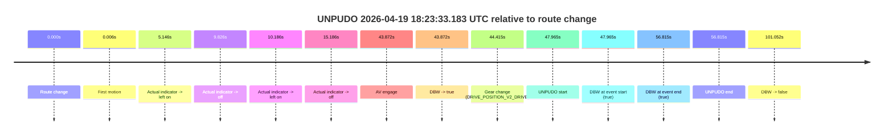
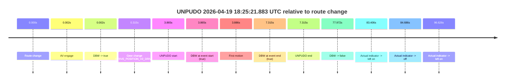
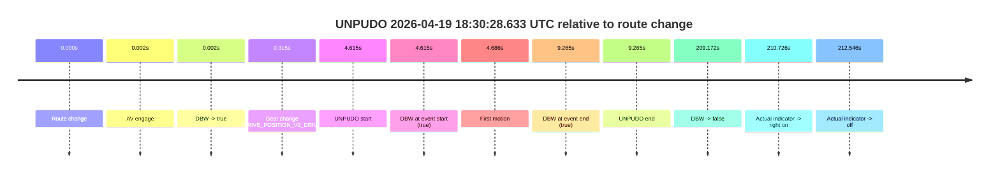
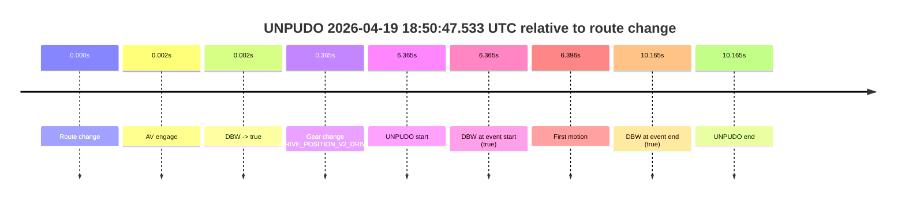
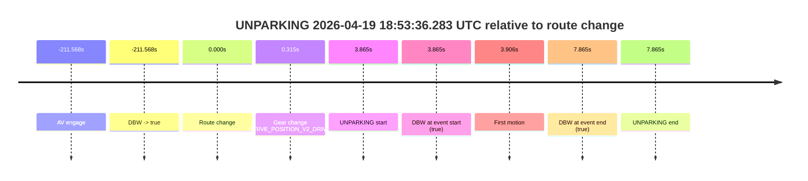

# Run Report: fme20002/2026-04-19--18-10-29--gen2-av-ff890ce9-c91f-4885-bbfb-00ccca5ca727

| Field | Value |
|---|---|
| Run ID | `fme20002/2026-04-19--18-10-29--gen2-av-ff890ce9-c91f-4885-bbfb-00ccca5ca727` |
| Date | `2026-04-19` |
| Model(s) | `eel-teal-outspoken` |
| Author | `zak` |
| Event count | `5` |

## unpudo 2026-04-19 18:23:33.183 UTC

| Field | Value |
|---|---|
| Model | `eel-teal-outspoken` |
| Author | `zak` |
| Run ID | `fme20002/2026-04-19--18-10-29--gen2-av-ff890ce9-c91f-4885-bbfb-00ccca5ca727` |
| Date | `2026-04-19` |
| Time (UTC) | `18:23:33.183` |
| Event type | `unpudo` |
| Disengagement type | `none observed` |
| Route change | `found` |
| Console | [run](https://console.sso.wayve.ai/run/fme20002/2026-04-19--18-10-29--gen2-av-ff890ce9-c91f-4885-bbfb-00ccca5ca727?id=&time-unixus=1776623013183311) |
| Foxglove | [segment](https://app.foxglove.dev/wayve-on-prem/p/prj_0dX18KZdVHg1fmmI/view?ds=foxglove-stream&ds.deviceName=fme20002&ds.start=2026-04-19T18%3A22%3A35.218258Z&ds.end=2026-04-19T18%3A24%3A36.270368Z&layoutId=lay_0e7VD4WIKDQGU73Y&time=2026-04-19T18%3A23%3A33.183311Z) |

### Event card: pass

- Pass: AV owns the credited unpudo from route change through the official unpudo window, the gear state is aligned at the anchor, and the vehicle moves without driver accelerator help in AV.

| Event | Time (UTC) | Delta from route change |
|---|---:|---:|
| Route change | 2026-04-19 18:22:45.218 | `0.000s` |
| First motion | 2026-04-19 18:22:45.224 | `0.006s` |
| Actual indicator -> left on | 2026-04-19 18:22:50.364 | `5.146s` |
| Actual indicator -> off | 2026-04-19 18:22:55.044 | `9.826s` |
| Actual indicator -> left on | 2026-04-19 18:22:55.404 | `10.186s` |
| Actual indicator -> off | 2026-04-19 18:23:00.404 | `15.186s` |
| AV engage | 2026-04-19 18:23:29.090 | `43.872s` |
| DBW -> true | 2026-04-19 18:23:29.090 | `43.872s` |
| Gear change (DRIVE_POSITION_V2_DRIVE) | 2026-04-19 18:23:29.633 | `44.415s` |
| UNPUDO start | 2026-04-19 18:23:33.183 | `47.965s` |
| DBW at event start (true) | 2026-04-19 18:23:33.183 | `47.965s` |
| DBW at event end (true) | 2026-04-19 18:23:42.033 | `56.815s` |
| UNPUDO end | 2026-04-19 18:23:42.033 | `56.815s` |
| DBW -> false | 2026-04-19 18:24:26.270 | `101.052s` |

| Metric | Value |
|---|---|
| Outcome | `pass` |
| Effective failure type | `none` |
| Route change status | `found` |
| DBW at event start | `true` |
| DBW at event end | `true` |
| Predicted gear at AV start | `DRIVE_POSITION_V2_DRIVE` |
| Actual gear at AV start | `DRIVE_POSITION_V2_PARK` |
| Predicted gear at event start | `DRIVE_POSITION_V2_DRIVE` |
| Actual gear at event start | `DRIVE_POSITION_V2_DRIVE` |
| Planned indicator direction | `INDICATORS_STATE_V2_OFF` |
| Controller indicator direction | `INDICATORS_STATE_V2_OFF` |
| Actual indicator direction | `INDICATORS_STATE_V2_OFF` |
| Actual indicator at maneuver end | `INDICATORS_STATE_V2_OFF` |
| Driver accel help in AV | `false` |
| Driver accel help timestamp | `n/a` |
| Max accel pedal pct in AV | `0.0%` |
| Max brake pedal pct in AV | `8.0%` |
| Max speed mps in AV | `3.111` |
| Success timing baseline | `route change` |
| Route -> AV | `43.872s` |
| AV -> event start | `4.093s` |
| AV -> first motion | `-43.866s` |
| Success baseline -> event start | `47.965s` |
| Success baseline -> first motion | `0.006s` |
| AV duration before disengagement | `57.180s` |
| Trajectory waypoint count | `37` |
| Driving-plan step count | `11` |

The scored portion starts from the AV-owned window, not from the pre-AV setup. Route-change search in the stopped pre-event segment was `found`, with the baseline therefore set to route change. At the event anchor the model predicts `DRIVE_POSITION_V2_DRIVE` and the actual gear is `DRIVE_POSITION_V2_DRIVE`. The effective model outcome is `pass` because `the credited unpudo stays AV-owned through the official unpudo window.`

### Resolution

| Field | Value |
|---|---|
| Final outcome | `pass` |
| Do we agree with this label? | `yes` |
| Source disengagement type | `none observed` |
| Resolved effective failure type | `none` |
| Confidence | `high` |

## unpudo 2026-04-19 18:25:21.883 UTC

| Field | Value |
|---|---|
| Model | `eel-teal-outspoken` |
| Author | `zak` |
| Run ID | `fme20002/2026-04-19--18-10-29--gen2-av-ff890ce9-c91f-4885-bbfb-00ccca5ca727` |
| Date | `2026-04-19` |
| Time (UTC) | `18:25:21.883` |
| Event type | `unpudo` |
| Disengagement type | `none observed` |
| Route change | `found` |
| Console | [run](https://console.sso.wayve.ai/run/fme20002/2026-04-19--18-10-29--gen2-av-ff890ce9-c91f-4885-bbfb-00ccca5ca727?id=&time-unixus=1776623121883317) |
| Foxglove | [segment](https://app.foxglove.dev/wayve-on-prem/p/prj_0dX18KZdVHg1fmmI/view?ds=foxglove-stream&ds.deviceName=fme20002&ds.start=2026-04-19T18%3A25%3A08.018373Z&ds.end=2026-04-19T18%3A26%3A45.990429Z&layoutId=lay_0e7VD4WIKDQGU73Y&time=2026-04-19T18%3A25%3A21.883317Z) |

### Event card: pass

- Pass: AV owns the credited unpudo from route change through the official unpudo window, the gear state is aligned at the anchor, and the vehicle moves without driver accelerator help in AV.

| Event | Time (UTC) | Delta from route change |
|---|---:|---:|
| Route change | 2026-04-19 18:25:18.018 | `0.000s` |
| AV engage | 2026-04-19 18:25:18.020 | `0.002s` |
| DBW -> true | 2026-04-19 18:25:18.020 | `0.002s` |
| Gear change (DRIVE_POSITION_V2_DRIVE) | 2026-04-19 18:25:18.333 | `0.315s` |
| UNPUDO start | 2026-04-19 18:25:21.883 | `3.865s` |
| DBW at event start (true) | 2026-04-19 18:25:21.883 | `3.865s` |
| First motion | 2026-04-19 18:25:21.904 | `3.886s` |
| DBW at event end (true) | 2026-04-19 18:25:25.333 | `7.315s` |
| UNPUDO end | 2026-04-19 18:25:25.333 | `7.315s` |
| DBW -> false | 2026-04-19 18:26:35.990 | `77.972s` |
| Actual indicator -> left on | 2026-04-19 18:26:41.424 | `83.406s` |
| Actual indicator -> off | 2026-04-19 18:26:42.704 | `84.686s` |
| Actual indicator -> left on | 2026-04-19 18:26:54.643 | `96.626s` |

| Metric | Value |
|---|---|
| Outcome | `pass` |
| Effective failure type | `none` |
| Route change status | `found` |
| DBW at event start | `true` |
| DBW at event end | `true` |
| Predicted gear at AV start | `DRIVE_POSITION_V2_PARK` |
| Actual gear at AV start | `DRIVE_POSITION_V2_PARK` |
| Predicted gear at event start | `DRIVE_POSITION_V2_DRIVE` |
| Actual gear at event start | `DRIVE_POSITION_V2_DRIVE` |
| Planned indicator direction | `INDICATORS_STATE_V2_RIGHT_ON` |
| Controller indicator direction | `INDICATORS_STATE_V2_RIGHT_ON` |
| Actual indicator direction | `INDICATORS_STATE_V2_OFF` |
| Actual indicator at maneuver end | `INDICATORS_STATE_V2_OFF` |
| Driver accel help in AV | `false` |
| Driver accel help timestamp | `n/a` |
| Max accel pedal pct in AV | `0.0%` |
| Max brake pedal pct in AV | `8.0%` |
| Max speed mps in AV | `4.878` |
| Success timing baseline | `route change` |
| Route -> AV | `0.002s` |
| AV -> event start | `3.863s` |
| AV -> first motion | `3.884s` |
| Success baseline -> event start | `3.865s` |
| Success baseline -> first motion | `3.886s` |
| AV duration before disengagement | `77.970s` |
| Trajectory waypoint count | `37` |
| Driving-plan step count | `11` |

The scored portion starts from the AV-owned window, not from the pre-AV setup. Route-change search in the stopped pre-event segment was `found`, with the baseline therefore set to route change. At the event anchor the model predicts `DRIVE_POSITION_V2_DRIVE` and the actual gear is `DRIVE_POSITION_V2_DRIVE`. The effective model outcome is `pass` because `the credited unpudo stays AV-owned through the official unpudo window.`

### Resolution

| Field | Value |
|---|---|
| Final outcome | `pass` |
| Do we agree with this label? | `yes` |
| Source disengagement type | `none observed` |
| Resolved effective failure type | `none` |
| Confidence | `high` |

## unpudo 2026-04-19 18:30:28.633 UTC

| Field | Value |
|---|---|
| Model | `eel-teal-outspoken` |
| Author | `zak` |
| Run ID | `fme20002/2026-04-19--18-10-29--gen2-av-ff890ce9-c91f-4885-bbfb-00ccca5ca727` |
| Date | `2026-04-19` |
| Time (UTC) | `18:30:28.633` |
| Event type | `unpudo` |
| Disengagement type | `none observed` |
| Route change | `found` |
| Console | [run](https://console.sso.wayve.ai/run/fme20002/2026-04-19--18-10-29--gen2-av-ff890ce9-c91f-4885-bbfb-00ccca5ca727?id=&time-unixus=1776623428633316) |
| Foxglove | [segment](https://app.foxglove.dev/wayve-on-prem/p/prj_0dX18KZdVHg1fmmI/view?ds=foxglove-stream&ds.deviceName=fme20002&ds.start=2026-04-19T18%3A30%3A14.018272Z&ds.end=2026-04-19T18%3A34%3A03.190344Z&layoutId=lay_0e7VD4WIKDQGU73Y&time=2026-04-19T18%3A30%3A28.633316Z) |

### Event card: pass

- Pass: AV owns the credited unpudo from route change through the official unpudo window, the gear state is aligned at the anchor, and the vehicle moves without driver accelerator help in AV.

| Event | Time (UTC) | Delta from route change |
|---|---:|---:|
| Route change | 2026-04-19 18:30:24.018 | `0.000s` |
| AV engage | 2026-04-19 18:30:24.020 | `0.002s` |
| DBW -> true | 2026-04-19 18:30:24.020 | `0.002s` |
| Gear change (DRIVE_POSITION_V2_DRIVE) | 2026-04-19 18:30:24.333 | `0.315s` |
| UNPUDO start | 2026-04-19 18:30:28.633 | `4.615s` |
| DBW at event start (true) | 2026-04-19 18:30:28.633 | `4.615s` |
| First motion | 2026-04-19 18:30:28.703 | `4.686s` |
| DBW at event end (true) | 2026-04-19 18:30:33.283 | `9.265s` |
| UNPUDO end | 2026-04-19 18:30:33.283 | `9.265s` |
| DBW -> false | 2026-04-19 18:33:53.190 | `209.172s` |
| Actual indicator -> right on | 2026-04-19 18:33:54.743 | `210.726s` |
| Actual indicator -> off | 2026-04-19 18:33:56.563 | `212.546s` |

| Metric | Value |
|---|---|
| Outcome | `pass` |
| Effective failure type | `none` |
| Route change status | `found` |
| DBW at event start | `true` |
| DBW at event end | `true` |
| Predicted gear at AV start | `DRIVE_POSITION_V2_PARK` |
| Actual gear at AV start | `DRIVE_POSITION_V2_PARK` |
| Predicted gear at event start | `DRIVE_POSITION_V2_DRIVE` |
| Actual gear at event start | `DRIVE_POSITION_V2_DRIVE` |
| Planned indicator direction | `INDICATORS_STATE_V2_RIGHT_ON` |
| Controller indicator direction | `INDICATORS_STATE_V2_RIGHT_ON` |
| Actual indicator direction | `INDICATORS_STATE_V2_OFF` |
| Actual indicator at maneuver end | `INDICATORS_STATE_V2_OFF` |
| Driver accel help in AV | `false` |
| Driver accel help timestamp | `n/a` |
| Max accel pedal pct in AV | `0.0%` |
| Max brake pedal pct in AV | `8.0%` |
| Max speed mps in AV | `4.636` |
| Success timing baseline | `route change` |
| Route -> AV | `0.002s` |
| AV -> event start | `4.613s` |
| AV -> first motion | `4.683s` |
| Success baseline -> event start | `4.615s` |
| Success baseline -> first motion | `4.686s` |
| AV duration before disengagement | `209.170s` |
| Trajectory waypoint count | `38` |
| Driving-plan step count | `11` |

The scored portion starts from the AV-owned window, not from the pre-AV setup. Route-change search in the stopped pre-event segment was `found`, with the baseline therefore set to route change. At the event anchor the model predicts `DRIVE_POSITION_V2_DRIVE` and the actual gear is `DRIVE_POSITION_V2_DRIVE`. The effective model outcome is `pass` because `the credited unpudo stays AV-owned through the official unpudo window.`

### Resolution

| Field | Value |
|---|---|
| Final outcome | `pass` |
| Do we agree with this label? | `yes` |
| Source disengagement type | `none observed` |
| Resolved effective failure type | `none` |
| Confidence | `high` |

## unpudo 2026-04-19 18:50:47.533 UTC

| Field | Value |
|---|---|
| Model | `eel-teal-outspoken` |
| Author | `zak` |
| Run ID | `fme20002/2026-04-19--18-10-29--gen2-av-ff890ce9-c91f-4885-bbfb-00ccca5ca727` |
| Date | `2026-04-19` |
| Time (UTC) | `18:50:47.533` |
| Event type | `unpudo` |
| Disengagement type | `none observed` |
| Route change | `found` |
| Console | [run](https://console.sso.wayve.ai/run/fme20002/2026-04-19--18-10-29--gen2-av-ff890ce9-c91f-4885-bbfb-00ccca5ca727?id=&time-unixus=1776624647533315) |
| Foxglove | [segment](https://app.foxglove.dev/wayve-on-prem/p/prj_0dX18KZdVHg1fmmI/view?ds=foxglove-stream&ds.deviceName=fme20002&ds.start=2026-04-19T18%3A50%3A31.168295Z&ds.end=2026-04-19T18%3A51%3A01.333312Z&layoutId=lay_0e7VD4WIKDQGU73Y&time=2026-04-19T18%3A50%3A47.533315Z) |

### Event card: pass

- Pass: AV owns the credited unpudo from route change through the official unpudo window, the gear state is aligned at the anchor, and the vehicle moves without driver accelerator help in AV.

| Event | Time (UTC) | Delta from route change |
|---|---:|---:|
| Route change | 2026-04-19 18:50:41.168 | `0.000s` |
| AV engage | 2026-04-19 18:50:41.170 | `0.002s` |
| DBW -> true | 2026-04-19 18:50:41.170 | `0.002s` |
| Gear change (DRIVE_POSITION_V2_DRIVE) | 2026-04-19 18:50:41.533 | `0.365s` |
| UNPUDO start | 2026-04-19 18:50:47.533 | `6.365s` |
| DBW at event start (true) | 2026-04-19 18:50:47.533 | `6.365s` |
| First motion | 2026-04-19 18:50:47.564 | `6.396s` |
| DBW at event end (true) | 2026-04-19 18:50:51.333 | `10.165s` |
| UNPUDO end | 2026-04-19 18:50:51.333 | `10.165s` |

| Metric | Value |
|---|---|
| Outcome | `pass` |
| Effective failure type | `none` |
| Route change status | `found` |
| DBW at event start | `true` |
| DBW at event end | `true` |
| Predicted gear at AV start | `DRIVE_POSITION_V2_PARK` |
| Actual gear at AV start | `DRIVE_POSITION_V2_PARK` |
| Predicted gear at event start | `DRIVE_POSITION_V2_DRIVE` |
| Actual gear at event start | `DRIVE_POSITION_V2_DRIVE` |
| Planned indicator direction | `INDICATORS_STATE_V2_RIGHT_ON` |
| Controller indicator direction | `INDICATORS_STATE_V2_RIGHT_ON` |
| Actual indicator direction | `INDICATORS_STATE_V2_OFF` |
| Actual indicator at maneuver end | `INDICATORS_STATE_V2_OFF` |
| Driver accel help in AV | `false` |
| Driver accel help timestamp | `n/a` |
| Max accel pedal pct in AV | `0.0%` |
| Max brake pedal pct in AV | `8.0%` |
| Max speed mps in AV | `4.564` |
| Success timing baseline | `route change` |
| Route -> AV | `0.002s` |
| AV -> event start | `6.363s` |
| AV -> first motion | `6.394s` |
| Success baseline -> event start | `6.365s` |
| Success baseline -> first motion | `6.396s` |
| AV duration before disengagement | `n/a` |
| Trajectory waypoint count | `38` |
| Driving-plan step count | `11` |

The scored portion starts from the AV-owned window, not from the pre-AV setup. Route-change search in the stopped pre-event segment was `found`, with the baseline therefore set to route change. At the event anchor the model predicts `DRIVE_POSITION_V2_DRIVE` and the actual gear is `DRIVE_POSITION_V2_DRIVE`. The effective model outcome is `pass` because `the credited unpudo stays AV-owned through the official unpudo window.`

### Resolution

| Field | Value |
|---|---|
| Final outcome | `pass` |
| Do we agree with this label? | `yes` |
| Source disengagement type | `none observed` |
| Resolved effective failure type | `none` |
| Confidence | `high` |

## unparking 2026-04-19 18:53:36.283 UTC

| Field | Value |
|---|---|
| Model | `eel-teal-outspoken` |
| Author | `zak` |
| Run ID | `fme20002/2026-04-19--18-10-29--gen2-av-ff890ce9-c91f-4885-bbfb-00ccca5ca727` |
| Date | `2026-04-19` |
| Time (UTC) | `18:53:36.283` |
| Event type | `unparking` |
| Disengagement type | `none observed` |
| Route change | `found` |
| Console | [run](https://console.sso.wayve.ai/run/fme20002/2026-04-19--18-10-29--gen2-av-ff890ce9-c91f-4885-bbfb-00ccca5ca727?id=&time-unixus=1776624816283299) |
| Foxglove | [segment](https://app.foxglove.dev/wayve-on-prem/p/prj_0dX18KZdVHg1fmmI/view?ds=foxglove-stream&ds.deviceName=fme20002&ds.start=2026-04-19T18%3A49%3A50.850646Z&ds.end=2026-04-19T18%3A53%3A50.283293Z&layoutId=lay_0e7VD4WIKDQGU73Y&time=2026-04-19T18%3A53%3A36.283299Z) |

### Event card: pass

- Pass: AV owns the credited unparking through the official event window, the gear state is aligned at the anchor, and the vehicle moves without driver accelerator help in AV.

| Event | Time (UTC) | Delta from route change |
|---|---:|---:|
| AV engage | 2026-04-19 18:50:00.850 | `-211.568s` |
| DBW -> true | 2026-04-19 18:50:00.850 | `-211.568s` |
| Route change | 2026-04-19 18:53:32.418 | `0.000s` |
| Gear change (DRIVE_POSITION_V2_DRIVE) | 2026-04-19 18:53:32.733 | `0.315s` |
| UNPARKING start | 2026-04-19 18:53:36.283 | `3.865s` |
| DBW at event start (true) | 2026-04-19 18:53:36.283 | `3.865s` |
| First motion | 2026-04-19 18:53:36.323 | `3.906s` |
| DBW at event end (true) | 2026-04-19 18:53:40.283 | `7.865s` |
| UNPARKING end | 2026-04-19 18:53:40.283 | `7.865s` |

| Metric | Value |
|---|---|
| Outcome | `pass` |
| Effective failure type | `none` |
| Route change status | `found` |
| DBW at event start | `true` |
| DBW at event end | `true` |
| Predicted gear at AV start | `DRIVE_POSITION_V2_DRIVE` |
| Actual gear at AV start | `DRIVE_POSITION_V2_DRIVE` |
| Predicted gear at event start | `DRIVE_POSITION_V2_DRIVE` |
| Actual gear at event start | `DRIVE_POSITION_V2_DRIVE` |
| Planned indicator direction | `INDICATORS_STATE_V2_RIGHT_ON` |
| Controller indicator direction | `INDICATORS_STATE_V2_RIGHT_ON` |
| Actual indicator direction | `INDICATORS_STATE_V2_OFF` |
| Actual indicator at maneuver end | `INDICATORS_STATE_V2_OFF` |
| Driver accel help in AV | `false` |
| Driver accel help timestamp | `n/a` |
| Max accel pedal pct in AV | `0.0%` |
| Max brake pedal pct in AV | `0.0%` |
| Max speed mps in AV | `4.789` |
| Success timing baseline | `AV start` |
| Route -> AV | `-211.568s` |
| AV -> event start | `215.433s` |
| AV -> first motion | `215.473s` |
| Success baseline -> event start | `215.433s` |
| Success baseline -> first motion | `215.473s` |
| AV duration before disengagement | `n/a` |
| Trajectory waypoint count | `37` |
| Driving-plan step count | `11` |

The scored portion starts from the AV-owned window, not from the pre-AV setup. Route-change search in the stopped pre-event segment was `found`, with the baseline therefore set to route change. At the event anchor the model predicts `DRIVE_POSITION_V2_DRIVE` and the actual gear is `DRIVE_POSITION_V2_DRIVE`. The effective model outcome is `pass` because `the credited maneuver stays AV-owned through the official event end.`

### Resolution

| Field | Value |
|---|---|
| Final outcome | `pass` |
| Do we agree with this label? | `yes` |
| Source disengagement type | `none observed` |
| Resolved effective failure type | `none` |
| Confidence | `high` |
