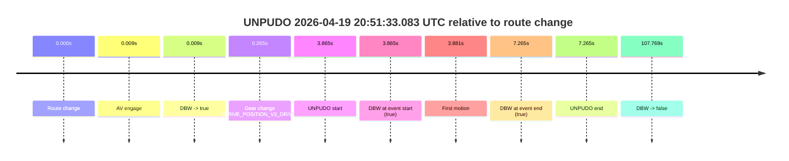
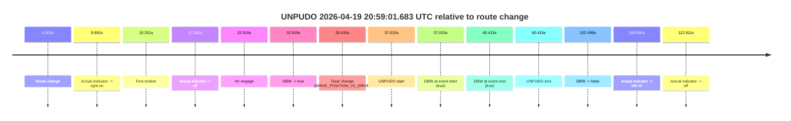
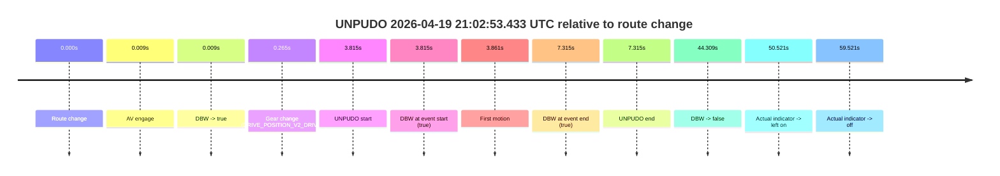
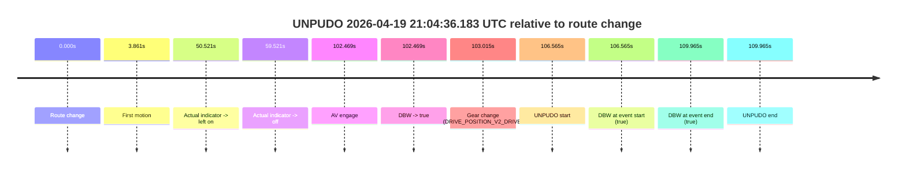

# Run Report: fme20002/2026-04-19--20-25-20--gen2-av-8d078d92-7894-4afb-90a1-90390c47c2ed

| Field | Value |
|---|---|
| Run ID | `fme20002/2026-04-19--20-25-20--gen2-av-8d078d92-7894-4afb-90a1-90390c47c2ed` |
| Date | `2026-04-19` |
| Model(s) | `eel-teal-outspoken` |
| Author | `zak` |
| Event count | `4` |

## unpudo 2026-04-19 20:51:33.083 UTC

| Field | Value |
|---|---|
| Model | `eel-teal-outspoken` |
| Author | `zak` |
| Run ID | `fme20002/2026-04-19--20-25-20--gen2-av-8d078d92-7894-4afb-90a1-90390c47c2ed` |
| Date | `2026-04-19` |
| Time (UTC) | `20:51:33.083` |
| Event type | `unpudo` |
| Disengagement type | `none observed` |
| Route change | `found` |
| Console | [run](https://console.sso.wayve.ai/run/fme20002/2026-04-19--20-25-20--gen2-av-8d078d92-7894-4afb-90a1-90390c47c2ed?id=&time-unixus=1776631893083300) |
| Foxglove | [segment](https://app.foxglove.dev/wayve-on-prem/p/prj_0dX18KZdVHg1fmmI/view?ds=foxglove-stream&ds.deviceName=fme20002&ds.start=2026-04-19T20%3A51%3A19.218398Z&ds.end=2026-04-19T20%3A53%3A26.987387Z&layoutId=lay_0e7VD4WIKDQGU73Y&time=2026-04-19T20%3A51%3A33.083300Z) |

### Event card: pass

- Pass: AV owns the credited unpudo from route change through the official unpudo window, the gear state is aligned at the anchor, and the vehicle moves without driver accelerator help in AV.

| Event | Time (UTC) | Delta from route change |
|---|---:|---:|
| Route change | 2026-04-19 20:51:29.218 | `0.000s` |
| AV engage | 2026-04-19 20:51:29.227 | `0.009s` |
| DBW -> true | 2026-04-19 20:51:29.227 | `0.009s` |
| Gear change (DRIVE_POSITION_V2_DRIVE) | 2026-04-19 20:51:29.483 | `0.265s` |
| UNPUDO start | 2026-04-19 20:51:33.083 | `3.865s` |
| DBW at event start (true) | 2026-04-19 20:51:33.083 | `3.865s` |
| First motion | 2026-04-19 20:51:33.099 | `3.881s` |
| DBW at event end (true) | 2026-04-19 20:51:36.483 | `7.265s` |
| UNPUDO end | 2026-04-19 20:51:36.483 | `7.265s` |
| DBW -> false | 2026-04-19 20:53:16.987 | `107.769s` |

| Metric | Value |
|---|---|
| Outcome | `pass` |
| Effective failure type | `none` |
| Route change status | `found` |
| DBW at event start | `true` |
| DBW at event end | `true` |
| Predicted gear at AV start | `DRIVE_POSITION_V2_PARK` |
| Actual gear at AV start | `DRIVE_POSITION_V2_PARK` |
| Predicted gear at event start | `DRIVE_POSITION_V2_DRIVE` |
| Actual gear at event start | `DRIVE_POSITION_V2_DRIVE` |
| Planned indicator direction | `INDICATORS_STATE_V2_RIGHT_ON` |
| Controller indicator direction | `INDICATORS_STATE_V2_RIGHT_ON` |
| Actual indicator direction | `INDICATORS_STATE_V2_OFF` |
| Actual indicator at maneuver end | `INDICATORS_STATE_V2_OFF` |
| Driver accel help in AV | `false` |
| Driver accel help timestamp | `n/a` |
| Max accel pedal pct in AV | `0.0%` |
| Max brake pedal pct in AV | `8.0%` |
| Max speed mps in AV | `4.947` |
| Success timing baseline | `route change` |
| Route -> AV | `0.009s` |
| AV -> event start | `3.856s` |
| AV -> first motion | `3.872s` |
| Success baseline -> event start | `3.865s` |
| Success baseline -> first motion | `3.881s` |
| AV duration before disengagement | `107.760s` |
| Trajectory waypoint count | `36` |
| Driving-plan step count | `11` |

The scored portion starts from the AV-owned window, not from the pre-AV setup. Route-change search in the stopped pre-event segment was `found`, with the baseline therefore set to route change. At the event anchor the model predicts `DRIVE_POSITION_V2_DRIVE` and the actual gear is `DRIVE_POSITION_V2_DRIVE`. The effective model outcome is `pass` because `the credited unpudo stays AV-owned through the official unpudo window.`

### Resolution

| Field | Value |
|---|---|
| Final outcome | `pass` |
| Do we agree with this label? | `yes` |
| Source disengagement type | `none observed` |
| Resolved effective failure type | `none` |
| Confidence | `high` |

## unpudo 2026-04-19 20:59:01.683 UTC

| Field | Value |
|---|---|
| Model | `eel-teal-outspoken` |
| Author | `zak` |
| Run ID | `fme20002/2026-04-19--20-25-20--gen2-av-8d078d92-7894-4afb-90a1-90390c47c2ed` |
| Date | `2026-04-19` |
| Time (UTC) | `20:59:01.683` |
| Event type | `unpudo` |
| Disengagement type | `none observed` |
| Route change | `found` |
| Console | [run](https://console.sso.wayve.ai/run/fme20002/2026-04-19--20-25-20--gen2-av-8d078d92-7894-4afb-90a1-90390c47c2ed?id=&time-unixus=1776632341683320) |
| Foxglove | [segment](https://app.foxglove.dev/wayve-on-prem/p/prj_0dX18KZdVHg1fmmI/view?ds=foxglove-stream&ds.deviceName=fme20002&ds.start=2026-04-19T20%3A58%3A14.668291Z&ds.end=2026-04-19T21%3A00%3A17.167450Z&layoutId=lay_0e7VD4WIKDQGU73Y&time=2026-04-19T20%3A59%3A01.683320Z) |

### Event card: pass

- Pass: AV owns the credited unpudo from route change through the official unpudo window, the gear state is aligned at the anchor, and the vehicle moves without driver accelerator help in AV.

| Event | Time (UTC) | Delta from route change |
|---|---:|---:|
| Route change | 2026-04-19 20:58:24.668 | `0.000s` |
| Actual indicator -> right on | 2026-04-19 20:58:34.559 | `9.891s` |
| First motion | 2026-04-19 20:58:34.919 | `10.251s` |
| Actual indicator -> off | 2026-04-19 20:58:42.199 | `17.531s` |
| AV engage | 2026-04-19 20:58:57.587 | `32.919s` |
| DBW -> true | 2026-04-19 20:58:57.587 | `32.919s` |
| Gear change (DRIVE_POSITION_V2_DRIVE) | 2026-04-19 20:58:58.083 | `33.415s` |
| UNPUDO start | 2026-04-19 20:59:01.683 | `37.015s` |
| DBW at event start (true) | 2026-04-19 20:59:01.683 | `37.015s` |
| DBW at event end (true) | 2026-04-19 20:59:05.083 | `40.415s` |
| UNPUDO end | 2026-04-19 20:59:05.083 | `40.415s` |
| DBW -> false | 2026-04-19 21:00:07.167 | `102.499s` |
| Actual indicator -> left on | 2026-04-19 21:00:09.259 | `104.591s` |
| Actual indicator -> off | 2026-04-19 21:00:17.579 | `112.911s` |

| Metric | Value |
|---|---|
| Outcome | `pass` |
| Effective failure type | `none` |
| Route change status | `found` |
| DBW at event start | `true` |
| DBW at event end | `true` |
| Predicted gear at AV start | `DRIVE_POSITION_V2_DRIVE` |
| Actual gear at AV start | `DRIVE_POSITION_V2_PARK` |
| Predicted gear at event start | `DRIVE_POSITION_V2_DRIVE` |
| Actual gear at event start | `DRIVE_POSITION_V2_DRIVE` |
| Planned indicator direction | `INDICATORS_STATE_V2_RIGHT_ON` |
| Controller indicator direction | `INDICATORS_STATE_V2_RIGHT_ON` |
| Actual indicator direction | `INDICATORS_STATE_V2_OFF` |
| Actual indicator at maneuver end | `INDICATORS_STATE_V2_OFF` |
| Driver accel help in AV | `false` |
| Driver accel help timestamp | `n/a` |
| Max accel pedal pct in AV | `0.0%` |
| Max brake pedal pct in AV | `8.0%` |
| Max speed mps in AV | `5.258` |
| Success timing baseline | `route change` |
| Route -> AV | `32.919s` |
| AV -> event start | `4.096s` |
| AV -> first motion | `-22.669s` |
| Success baseline -> event start | `37.015s` |
| Success baseline -> first motion | `10.251s` |
| AV duration before disengagement | `69.580s` |
| Trajectory waypoint count | `36` |
| Driving-plan step count | `11` |

The scored portion starts from the AV-owned window, not from the pre-AV setup. Route-change search in the stopped pre-event segment was `found`, with the baseline therefore set to route change. At the event anchor the model predicts `DRIVE_POSITION_V2_DRIVE` and the actual gear is `DRIVE_POSITION_V2_DRIVE`. The effective model outcome is `pass` because `the credited unpudo stays AV-owned through the official unpudo window.`

### Resolution

| Field | Value |
|---|---|
| Final outcome | `pass` |
| Do we agree with this label? | `yes` |
| Source disengagement type | `none observed` |
| Resolved effective failure type | `none` |
| Confidence | `high` |

## unpudo 2026-04-19 21:02:53.433 UTC

| Field | Value |
|---|---|
| Model | `eel-teal-outspoken` |
| Author | `zak` |
| Run ID | `fme20002/2026-04-19--20-25-20--gen2-av-8d078d92-7894-4afb-90a1-90390c47c2ed` |
| Date | `2026-04-19` |
| Time (UTC) | `21:02:53.433` |
| Event type | `unpudo` |
| Disengagement type | `none observed` |
| Route change | `found` |
| Console | [run](https://console.sso.wayve.ai/run/fme20002/2026-04-19--20-25-20--gen2-av-8d078d92-7894-4afb-90a1-90390c47c2ed?id=&time-unixus=1776632573433299) |
| Foxglove | [segment](https://app.foxglove.dev/wayve-on-prem/p/prj_0dX18KZdVHg1fmmI/view?ds=foxglove-stream&ds.deviceName=fme20002&ds.start=2026-04-19T21%3A02%3A39.618250Z&ds.end=2026-04-19T21%3A03%3A43.927535Z&layoutId=lay_0e7VD4WIKDQGU73Y&time=2026-04-19T21%3A02%3A53.433299Z) |

### Event card: pass

- Pass: AV owns the credited unpudo from route change through the official unpudo window, the gear state is aligned at the anchor, and the vehicle moves without driver accelerator help in AV.

| Event | Time (UTC) | Delta from route change |
|---|---:|---:|
| Route change | 2026-04-19 21:02:49.618 | `0.000s` |
| AV engage | 2026-04-19 21:02:49.627 | `0.009s` |
| DBW -> true | 2026-04-19 21:02:49.627 | `0.009s` |
| Gear change (DRIVE_POSITION_V2_DRIVE) | 2026-04-19 21:02:49.883 | `0.265s` |
| UNPUDO start | 2026-04-19 21:02:53.433 | `3.815s` |
| DBW at event start (true) | 2026-04-19 21:02:53.433 | `3.815s` |
| First motion | 2026-04-19 21:02:53.479 | `3.861s` |
| DBW at event end (true) | 2026-04-19 21:02:56.933 | `7.315s` |
| UNPUDO end | 2026-04-19 21:02:56.933 | `7.315s` |
| DBW -> false | 2026-04-19 21:03:33.927 | `44.309s` |
| Actual indicator -> left on | 2026-04-19 21:03:40.139 | `50.521s` |
| Actual indicator -> off | 2026-04-19 21:03:49.139 | `59.521s` |

| Metric | Value |
|---|---|
| Outcome | `pass` |
| Effective failure type | `none` |
| Route change status | `found` |
| DBW at event start | `true` |
| DBW at event end | `true` |
| Predicted gear at AV start | `DRIVE_POSITION_V2_PARK` |
| Actual gear at AV start | `DRIVE_POSITION_V2_PARK` |
| Predicted gear at event start | `DRIVE_POSITION_V2_DRIVE` |
| Actual gear at event start | `DRIVE_POSITION_V2_DRIVE` |
| Planned indicator direction | `INDICATORS_STATE_V2_RIGHT_ON` |
| Controller indicator direction | `INDICATORS_STATE_V2_RIGHT_ON` |
| Actual indicator direction | `INDICATORS_STATE_V2_OFF` |
| Actual indicator at maneuver end | `INDICATORS_STATE_V2_OFF` |
| Driver accel help in AV | `false` |
| Driver accel help timestamp | `n/a` |
| Max accel pedal pct in AV | `0.0%` |
| Max brake pedal pct in AV | `8.0%` |
| Max speed mps in AV | `4.353` |
| Success timing baseline | `route change` |
| Route -> AV | `0.009s` |
| AV -> event start | `3.806s` |
| AV -> first motion | `3.851s` |
| Success baseline -> event start | `3.815s` |
| Success baseline -> first motion | `3.861s` |
| AV duration before disengagement | `44.300s` |
| Trajectory waypoint count | `37` |
| Driving-plan step count | `11` |

The scored portion starts from the AV-owned window, not from the pre-AV setup. Route-change search in the stopped pre-event segment was `found`, with the baseline therefore set to route change. At the event anchor the model predicts `DRIVE_POSITION_V2_DRIVE` and the actual gear is `DRIVE_POSITION_V2_DRIVE`. The effective model outcome is `pass` because `the credited unpudo stays AV-owned through the official unpudo window.`

### Resolution

| Field | Value |
|---|---|
| Final outcome | `pass` |
| Do we agree with this label? | `yes` |
| Source disengagement type | `none observed` |
| Resolved effective failure type | `none` |
| Confidence | `high` |

## unpudo 2026-04-19 21:04:36.183 UTC

| Field | Value |
|---|---|
| Model | `eel-teal-outspoken` |
| Author | `zak` |
| Run ID | `fme20002/2026-04-19--20-25-20--gen2-av-8d078d92-7894-4afb-90a1-90390c47c2ed` |
| Date | `2026-04-19` |
| Time (UTC) | `21:04:36.183` |
| Event type | `unpudo` |
| Disengagement type | `none observed` |
| Route change | `found` |
| Console | [run](https://console.sso.wayve.ai/run/fme20002/2026-04-19--20-25-20--gen2-av-8d078d92-7894-4afb-90a1-90390c47c2ed?id=&time-unixus=1776632676183297) |
| Foxglove | [segment](https://app.foxglove.dev/wayve-on-prem/p/prj_0dX18KZdVHg1fmmI/view?ds=foxglove-stream&ds.deviceName=fme20002&ds.start=2026-04-19T21%3A02%3A39.618250Z&ds.end=2026-04-19T21%3A04%3A49.583316Z&layoutId=lay_0e7VD4WIKDQGU73Y&time=2026-04-19T21%3A04%3A36.183297Z) |

### Event card: pass

- Pass: AV owns the credited unpudo from route change through the official unpudo window, the gear state is aligned at the anchor, and the vehicle moves without driver accelerator help in AV.

| Event | Time (UTC) | Delta from route change |
|---|---:|---:|
| Route change | 2026-04-19 21:02:49.618 | `0.000s` |
| First motion | 2026-04-19 21:02:53.479 | `3.861s` |
| Actual indicator -> left on | 2026-04-19 21:03:40.139 | `50.521s` |
| Actual indicator -> off | 2026-04-19 21:03:49.139 | `59.521s` |
| AV engage | 2026-04-19 21:04:32.087 | `102.469s` |
| DBW -> true | 2026-04-19 21:04:32.087 | `102.469s` |
| Gear change (DRIVE_POSITION_V2_DRIVE) | 2026-04-19 21:04:32.633 | `103.015s` |
| UNPUDO start | 2026-04-19 21:04:36.183 | `106.565s` |
| DBW at event start (true) | 2026-04-19 21:04:36.183 | `106.565s` |
| DBW at event end (true) | 2026-04-19 21:04:39.583 | `109.965s` |
| UNPUDO end | 2026-04-19 21:04:39.583 | `109.965s` |

| Metric | Value |
|---|---|
| Outcome | `pass` |
| Effective failure type | `none` |
| Route change status | `found` |
| DBW at event start | `true` |
| DBW at event end | `true` |
| Predicted gear at AV start | `DRIVE_POSITION_V2_DRIVE` |
| Actual gear at AV start | `DRIVE_POSITION_V2_PARK` |
| Predicted gear at event start | `DRIVE_POSITION_V2_DRIVE` |
| Actual gear at event start | `DRIVE_POSITION_V2_DRIVE` |
| Planned indicator direction | `INDICATORS_STATE_V2_RIGHT_ON` |
| Controller indicator direction | `INDICATORS_STATE_V2_RIGHT_ON` |
| Actual indicator direction | `INDICATORS_STATE_V2_OFF` |
| Actual indicator at maneuver end | `INDICATORS_STATE_V2_OFF` |
| Driver accel help in AV | `false` |
| Driver accel help timestamp | `n/a` |
| Max accel pedal pct in AV | `0.0%` |
| Max brake pedal pct in AV | `8.7%` |
| Max speed mps in AV | `4.914` |
| Success timing baseline | `route change` |
| Route -> AV | `102.469s` |
| AV -> event start | `4.096s` |
| AV -> first motion | `-98.608s` |
| Success baseline -> event start | `106.565s` |
| Success baseline -> first motion | `3.861s` |
| AV duration before disengagement | `n/a` |
| Trajectory waypoint count | `36` |
| Driving-plan step count | `11` |

The scored portion starts from the AV-owned window, not from the pre-AV setup. Route-change search in the stopped pre-event segment was `found`, with the baseline therefore set to route change. At the event anchor the model predicts `DRIVE_POSITION_V2_DRIVE` and the actual gear is `DRIVE_POSITION_V2_DRIVE`. The effective model outcome is `pass` because `the credited unpudo stays AV-owned through the official unpudo window.`

### Resolution

| Field | Value |
|---|---|
| Final outcome | `pass` |
| Do we agree with this label? | `yes` |
| Source disengagement type | `none observed` |
| Resolved effective failure type | `none` |
| Confidence | `high` |
