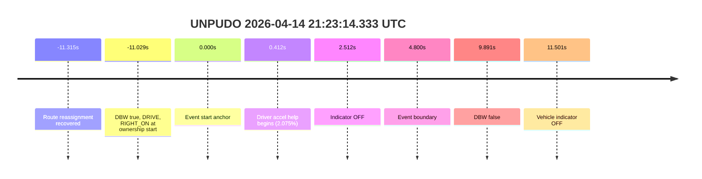
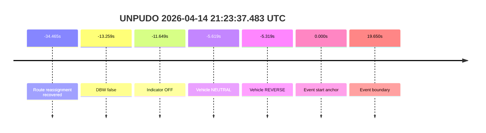

# Run Report: fme20007/2026-04-14--21-16-51--gen2-av-8394ba03-576c-4ae2-b5e9-aa5cb899de80

| Field | Value |
|---|---|
| Run ID | `fme20007/2026-04-14--21-16-51--gen2-av-8394ba03-576c-4ae2-b5e9-aa5cb899de80` |
| Date | `2026-04-14` |
| Model(s) | `lively-orange-horse` |
| Author | `guy.geva` |
| Event count | `2` |
| Run window | `2026-04-14T21:21:14.333Z` to `2026-04-14T21:23:44.217Z` |
| Foxglove | [segment](https://app.foxglove.dev/wayve-on-prem/p/prj_0dX18KZdVHg1fmmI/view?ds=foxglove-stream&ds.deviceName=fme20007&ds.end=2026-04-14T21%3A23%3A44.217Z&ds.start=2026-04-14T21%3A21%3A14.333Z&layoutId=lay_0e7VD4WIKDQGU73Y&time=2026-04-14T21%3A21%3A14.333Z) |

## unpudo 2026-04-14 21:23:14.333 UTC

| Field | Value |
|---|---|
| Model | `lively-orange-horse` |
| Author | `guy.geva` |
| Run ID | `fme20007/2026-04-14--21-16-51--gen2-av-8394ba03-576c-4ae2-b5e9-aa5cb899de80` |
| Date | `2026-04-14` |
| Time (UTC) | `21:23:14.333` |
| Event type | `unpudo` |
| Disengagement type | `none` |
| Console | [run](https://console.sso.wayve.ai/run/fme20007/2026-04-14--21-16-51--gen2-av-8394ba03-576c-4ae2-b5e9-aa5cb899de80?id=&time-unixus=1776201794333315) |

- Pass: the credited UNPUDO stays AV-owned through the event boundary. Route reassignment is recovered in the stopped pre-event segment, DBW remains on across the anchor, and the driver accelerator help stays limited.

### Event Table

| Event | Time (UTC) | Delta from event start | Scored? | Notes |
|---|---|---:|---|---|
| Route reassignment recovered | 2026-04-14 21:23:03.018 | `-11.315s` | `yes` | Step count `2 -> 5`; distance `254.0m -> 839.2m`; terminal instruction `You have arrived at your destination.` |
| Controller ownership start | 2026-04-14 21:23:03.304 | `-11.029s` | `yes` | DBW `true`, gear `DRIVE`, indicator `RIGHT_ON`; this state carries across the anchor. |
| Event start anchor | 2026-04-14 21:23:14.333 | `0.000s` | `yes` | AV-owned at anchor; vehicle state is still aligned with the plan. |
| Driver accel help begins | 2026-04-14 21:23:14.745 | `+0.412s` | `yes` | Accelerator pedal `2.075%`; max accel help in-window is `6.8%`. |
| Controller/plan indicator turns OFF | 2026-04-14 21:23:16.845 | `+2.512s` | `yes` | Indicator transitions from `RIGHT_ON` to `OFF` while DBW is still on. |
| Event boundary | 2026-04-14 21:23:19.133 | `+4.800s` | `yes` | Credited maneuver window ends here. |
| DBW drops to false | 2026-04-14 21:23:24.224 | `+9.891s` | `no` | Post-boundary context only. |
| Vehicle indicator OFF | 2026-04-14 21:23:25.834 | `+11.501s` | `no` | Post-boundary context only. |

### Metrics

| Metric | Value |
|---|---|
| Route-change status | `found` |
| Controller DBW at anchor | `true` |
| Predicted gear at event start | `DRIVE` |
| Actual gear at event start | `DRIVE` |
| Planned indicator at event start | `RIGHT_ON` |
| Actual indicator at event start | `RIGHT_ON` |
| Driver accel help in maneuver window | `yes` |
| Max accel pedal | `6.8%` |
| AV-owned duration before event end | `4.800s` |
| Source disengagement type | `none` |

### Summary

The cached evidence supports a clean AV-owned unpudo. The route was already updated before the maneuver, the controller stays in DBW through the scored window, and the only driver pedal input is light accelerator help rather than a takeover signal.

### Resolution

| Field | Value |
|---|---|
| Final outcome | `pass` |
| Route-change status | `found` |
| Source disengagement type | `none` |
| Resolved effective failure type | `n/a` |
| Confidence | `high` |

## unpudo 2026-04-14 21:23:37.483 UTC

| Field | Value |
|---|---|
| Model | `lively-orange-horse` |
| Author | `guy.geva` |
| Run ID | `fme20007/2026-04-14--21-16-51--gen2-av-8394ba03-576c-4ae2-b5e9-aa5cb899de80` |
| Date | `2026-04-14` |
| Time (UTC) | `21:23:37.483` |
| Event type | `unpudo` |
| Disengagement type | `failed_to_unpudo` |
| Console | [run](https://console.sso.wayve.ai/run/fme20007/2026-04-14--21-16-51--gen2-av-8394ba03-576c-4ae2-b5e9-aa5cb899de80?id=&time-unixus=1776201817483296) |

- Fail: the recovered route change is real, but the credited UNPUDO does not stay AV-owned. DBW has already dropped before the event anchor, so this cannot be scored as model performance.

### Event Table

| Event | Time (UTC) | Delta from event start | Scored? | Notes |
|---|---|---:|---|---|
| Route reassignment recovered | 2026-04-14 21:23:03.018 | `-34.465s` | `yes` | Step count `2 -> 5`; distance `254.0m -> 839.2m`; terminal instruction `You have arrived at your destination.` |
| DBW drops to false | 2026-04-14 21:23:24.224 | `-13.259s` | `yes` | Controller is already outside AV well before the anchor. |
| Indicator turns OFF | 2026-04-14 21:23:25.834 | `-11.649s` | `yes` | Controller/plan indicator is already `OFF`. |
| Vehicle enters NEUTRAL | 2026-04-14 21:23:31.864 | `-5.619s` | `yes` | Post-ownership context, still pre-anchor. |
| Vehicle enters REVERSE | 2026-04-14 21:23:32.164 | `-5.319s` | `yes` | Latest cached vehicle state before the anchor. |
| Event start anchor | 2026-04-14 21:23:37.483 | `0.000s` | `no` | Anchor is already outside AV; latest local state is DBW `false` with vehicle in `REVERSE`. |
| Event boundary | 2026-04-14 21:23:57.133 | `+19.650s` | `no` | Event window closes without AV ownership returning. |

### Metrics

| Metric | Value |
|---|---|
| Route-change status | `found` |
| Controller DBW at anchor | `false` |
| Predicted gear near anchor | `DRIVE` |
| Actual gear near anchor | `REVERSE` |
| Planned indicator near anchor | `OFF` |
| Actual indicator near anchor | `OFF` |
| Driver accel help in maneuver window | `no` |
| AV-owned duration before event end | `0.000s` |
| Source disengagement type | `failed_to_unpudo` |

### Summary

This is a model-performance failure on ownership, not on route recovery. The route change was present, but the vehicle was already outside DBW by the time the credited UNPUDO anchor arrives, so the maneuver cannot be attributed to the model.

### Resolution

| Field | Value |
|---|---|
| Final outcome | `fail` |
| Route-change status | `found` |
| Source disengagement type | `failed_to_unpudo` |
| Resolved effective failure type | `completed_outside_av` |
| Confidence | `high` |
