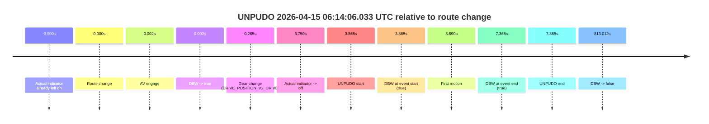
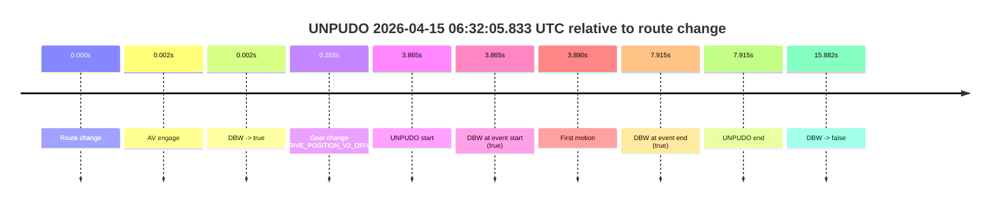
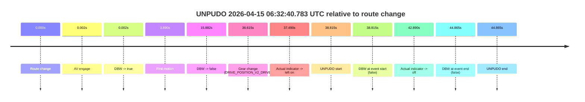
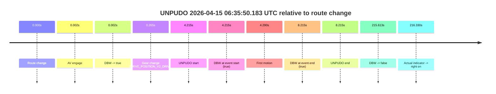
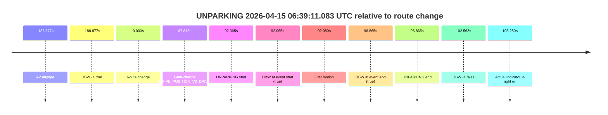

# Run Report: fme20007/2026-04-15--05-56-43--gen2-av-60deadf3-dc6c-41bc-8e4b-eca0f8903d7c

| Field | Value |
|---|---|
| Run ID | `fme20007/2026-04-15--05-56-43--gen2-av-60deadf3-dc6c-41bc-8e4b-eca0f8903d7c` |
| Date | `2026-04-15` |
| Model(s) | `eel-teal-outspoken` |
| Author | `zak` |
| Event count | `6` |

## unpudo 2026-04-15 06:14:06.033 UTC

| Field | Value |
|---|---|
| Model | `eel-teal-outspoken` |
| Author | `zak` |
| Run ID | `fme20007/2026-04-15--05-56-43--gen2-av-60deadf3-dc6c-41bc-8e4b-eca0f8903d7c` |
| Date | `2026-04-15` |
| Time (UTC) | `06:14:06.033` |
| Event type | `unpudo` |
| Disengagement type | `none observed` |
| Route change | `found` |
| Console | [run](https://console.sso.wayve.ai/run/fme20007/2026-04-15--05-56-43--gen2-av-60deadf3-dc6c-41bc-8e4b-eca0f8903d7c?id=&time-unixus=1776233646033302) |
| Foxglove | [segment](https://app.foxglove.dev/wayve-on-prem/p/prj_0dX18KZdVHg1fmmI/view?ds=foxglove-stream&ds.deviceName=fme20007&ds.start=2026-04-15T06%3A13%3A52.168248Z&ds.end=2026-04-15T06%3A27%3A45.180219Z&layoutId=lay_0e7VD4WIKDQGU73Y&time=2026-04-15T06%3A14%3A06.033302Z) |

### Event card: pass

- Pass: AV owns the credited unpudo from route change through the official unpudo window, the gear state is aligned at the anchor, and the vehicle moves without driver accelerator help in AV.

| Event | Time (UTC) | Delta from route change |
|---|---:|---:|
| Actual indicator already left on | 2026-04-15 06:13:52.177 | `-9.990s` |
| Route change | 2026-04-15 06:14:02.168 | `0.000s` |
| AV engage | 2026-04-15 06:14:02.170 | `0.002s` |
| DBW -> true | 2026-04-15 06:14:02.170 | `0.002s` |
| Gear change (DRIVE_POSITION_V2_DRIVE) | 2026-04-15 06:14:02.433 | `0.265s` |
| Actual indicator -> off | 2026-04-15 06:14:05.917 | `3.750s` |
| UNPUDO start | 2026-04-15 06:14:06.033 | `3.865s` |
| DBW at event start (true) | 2026-04-15 06:14:06.033 | `3.865s` |
| First motion | 2026-04-15 06:14:06.058 | `3.890s` |
| DBW at event end (true) | 2026-04-15 06:14:09.533 | `7.365s` |
| UNPUDO end | 2026-04-15 06:14:09.533 | `7.365s` |
| DBW -> false | 2026-04-15 06:27:35.180 | `813.012s` |

| Metric | Value |
|---|---|
| Outcome | `pass` |
| Effective failure type | `none` |
| Route change status | `found` |
| DBW at event start | `true` |
| DBW at event end | `true` |
| Predicted gear at AV start | `DRIVE_POSITION_V2_PARK` |
| Actual gear at AV start | `DRIVE_POSITION_V2_PARK` |
| Predicted gear at event start | `DRIVE_POSITION_V2_DRIVE` |
| Actual gear at event start | `DRIVE_POSITION_V2_DRIVE` |
| Planned indicator direction | `INDICATORS_STATE_V2_RIGHT_ON` |
| Controller indicator direction | `INDICATORS_STATE_V2_RIGHT_ON` |
| Actual indicator direction | `INDICATORS_STATE_V2_OFF` |
| Actual indicator at maneuver end | `INDICATORS_STATE_V2_OFF` |
| Driver accel help in AV | `false` |
| Driver accel help timestamp | `n/a` |
| Max accel pedal pct in AV | `0.0%` |
| Max brake pedal pct in AV | `8.0%` |
| Max speed mps in AV | `4.861` |
| Success timing baseline | `route change` |
| Route -> AV | `0.002s` |
| AV -> event start | `3.863s` |
| AV -> first motion | `3.888s` |
| Success baseline -> event start | `3.865s` |
| Success baseline -> first motion | `3.890s` |
| AV duration before disengagement | `813.010s` |
| Trajectory waypoint count | `38` |
| Driving-plan step count | `11` |

The scored portion starts from the AV-owned window, not from the pre-AV setup. Route-change search in the stopped pre-event segment was `found`, with the baseline therefore set to route change. At the event anchor the model predicts `DRIVE_POSITION_V2_DRIVE` and the actual gear is `DRIVE_POSITION_V2_DRIVE`. The effective model outcome is `pass` because `the credited unpudo stays AV-owned through the official unpudo window.`

### Resolution

| Field | Value |
|---|---|
| Final outcome | `pass` |
| Do we agree with this label? | `yes` |
| Source disengagement type | `none observed` |
| Resolved effective failure type | `none` |
| Confidence | `high` |

## unpudo 2026-04-15 06:23:45.383 UTC

| Field | Value |
|---|---|
| Model | `eel-teal-outspoken` |
| Author | `zak` |
| Run ID | `fme20007/2026-04-15--05-56-43--gen2-av-60deadf3-dc6c-41bc-8e4b-eca0f8903d7c` |
| Date | `2026-04-15` |
| Time (UTC) | `06:23:45.383` |
| Event type | `unpudo` |
| Disengagement type | `none observed` |
| Route change | `found` |
| Console | [run](https://console.sso.wayve.ai/run/fme20007/2026-04-15--05-56-43--gen2-av-60deadf3-dc6c-41bc-8e4b-eca0f8903d7c?id=&time-unixus=1776234225383321) |
| Foxglove | [segment](https://app.foxglove.dev/wayve-on-prem/p/prj_0dX18KZdVHg1fmmI/view?ds=foxglove-stream&ds.deviceName=fme20007&ds.start=2026-04-15T06%3A23%3A31.568314Z&ds.end=2026-04-15T06%3A27%3A45.180219Z&layoutId=lay_0e7VD4WIKDQGU73Y&time=2026-04-15T06%3A23%3A45.383321Z) |

### Event card: pass

- Pass: AV owns the credited unpudo from route change through the official unpudo window, the gear state is aligned at the anchor, and the vehicle moves without driver accelerator help in AV.

| Event | Time (UTC) | Delta from route change |
|---|---:|---:|
| Route change | 2026-04-15 06:23:41.568 | `0.000s` |
| AV engage | 2026-04-15 06:23:41.570 | `0.002s` |
| DBW -> true | 2026-04-15 06:23:41.570 | `0.002s` |
| Gear change (DRIVE_POSITION_V2_DRIVE) | 2026-04-15 06:23:41.833 | `0.265s` |
| UNPUDO start | 2026-04-15 06:23:45.383 | `3.815s` |
| DBW at event start (true) | 2026-04-15 06:23:45.383 | `3.815s` |
| First motion | 2026-04-15 06:23:45.417 | `3.850s` |
| DBW at event end (true) | 2026-04-15 06:23:48.733 | `7.165s` |
| UNPUDO end | 2026-04-15 06:23:48.733 | `7.165s` |
| DBW -> false | 2026-04-15 06:27:35.180 | `233.612s` |

| Metric | Value |
|---|---|
| Outcome | `pass` |
| Effective failure type | `none` |
| Route change status | `found` |
| DBW at event start | `true` |
| DBW at event end | `true` |
| Predicted gear at AV start | `DRIVE_POSITION_V2_PARK` |
| Actual gear at AV start | `DRIVE_POSITION_V2_PARK` |
| Predicted gear at event start | `DRIVE_POSITION_V2_DRIVE` |
| Actual gear at event start | `DRIVE_POSITION_V2_DRIVE` |
| Planned indicator direction | `INDICATORS_STATE_V2_RIGHT_ON` |
| Controller indicator direction | `INDICATORS_STATE_V2_RIGHT_ON` |
| Actual indicator direction | `INDICATORS_STATE_V2_OFF` |
| Actual indicator at maneuver end | `INDICATORS_STATE_V2_OFF` |
| Driver accel help in AV | `false` |
| Driver accel help timestamp | `n/a` |
| Max accel pedal pct in AV | `0.0%` |
| Max brake pedal pct in AV | `8.4%` |
| Max speed mps in AV | `5.108` |
| Success timing baseline | `route change` |
| Route -> AV | `0.002s` |
| AV -> event start | `3.813s` |
| AV -> first motion | `3.848s` |
| Success baseline -> event start | `3.815s` |
| Success baseline -> first motion | `3.850s` |
| AV duration before disengagement | `233.610s` |
| Trajectory waypoint count | `37` |
| Driving-plan step count | `11` |

The scored portion starts from the AV-owned window, not from the pre-AV setup. Route-change search in the stopped pre-event segment was `found`, with the baseline therefore set to route change. At the event anchor the model predicts `DRIVE_POSITION_V2_DRIVE` and the actual gear is `DRIVE_POSITION_V2_DRIVE`. The effective model outcome is `pass` because `the credited unpudo stays AV-owned through the official unpudo window.`

### Resolution

| Field | Value |
|---|---|
| Final outcome | `pass` |
| Do we agree with this label? | `yes` |
| Source disengagement type | `none observed` |
| Resolved effective failure type | `none` |
| Confidence | `high` |

## unpudo 2026-04-15 06:32:05.833 UTC

| Field | Value |
|---|---|
| Model | `eel-teal-outspoken` |
| Author | `zak` |
| Run ID | `fme20007/2026-04-15--05-56-43--gen2-av-60deadf3-dc6c-41bc-8e4b-eca0f8903d7c` |
| Date | `2026-04-15` |
| Time (UTC) | `06:32:05.833` |
| Event type | `unpudo` |
| Disengagement type | `none observed` |
| Route change | `found` |
| Console | [run](https://console.sso.wayve.ai/run/fme20007/2026-04-15--05-56-43--gen2-av-60deadf3-dc6c-41bc-8e4b-eca0f8903d7c?id=&time-unixus=1776234725833309) |
| Foxglove | [segment](https://app.foxglove.dev/wayve-on-prem/p/prj_0dX18KZdVHg1fmmI/view?ds=foxglove-stream&ds.deviceName=fme20007&ds.start=2026-04-15T06%3A31%3A51.968267Z&ds.end=2026-04-15T06%3A32%3A27.850311Z&layoutId=lay_0e7VD4WIKDQGU73Y&time=2026-04-15T06%3A32%3A05.833309Z) |

### Event card: pass

- Pass: AV owns the credited unpudo from route change through the official unpudo window, the gear state is aligned at the anchor, and the vehicle moves without driver accelerator help in AV.

| Event | Time (UTC) | Delta from route change |
|---|---:|---:|
| Route change | 2026-04-15 06:32:01.968 | `0.000s` |
| AV engage | 2026-04-15 06:32:01.970 | `0.002s` |
| DBW -> true | 2026-04-15 06:32:01.970 | `0.002s` |
| Gear change (DRIVE_POSITION_V2_DRIVE) | 2026-04-15 06:32:02.233 | `0.265s` |
| UNPUDO start | 2026-04-15 06:32:05.833 | `3.865s` |
| DBW at event start (true) | 2026-04-15 06:32:05.833 | `3.865s` |
| First motion | 2026-04-15 06:32:05.858 | `3.890s` |
| DBW at event end (true) | 2026-04-15 06:32:09.883 | `7.915s` |
| UNPUDO end | 2026-04-15 06:32:09.883 | `7.915s` |
| DBW -> false | 2026-04-15 06:32:17.850 | `15.882s` |

| Metric | Value |
|---|---|
| Outcome | `pass` |
| Effective failure type | `none` |
| Route change status | `found` |
| DBW at event start | `true` |
| DBW at event end | `true` |
| Predicted gear at AV start | `DRIVE_POSITION_V2_PARK` |
| Actual gear at AV start | `DRIVE_POSITION_V2_PARK` |
| Predicted gear at event start | `DRIVE_POSITION_V2_DRIVE` |
| Actual gear at event start | `DRIVE_POSITION_V2_DRIVE` |
| Planned indicator direction | `INDICATORS_STATE_V2_RIGHT_ON` |
| Controller indicator direction | `INDICATORS_STATE_V2_RIGHT_ON` |
| Actual indicator direction | `INDICATORS_STATE_V2_OFF` |
| Actual indicator at maneuver end | `INDICATORS_STATE_V2_OFF` |
| Driver accel help in AV | `false` |
| Driver accel help timestamp | `n/a` |
| Max accel pedal pct in AV | `0.0%` |
| Max brake pedal pct in AV | `8.0%` |
| Max speed mps in AV | `3.667` |
| Success timing baseline | `route change` |
| Route -> AV | `0.002s` |
| AV -> event start | `3.863s` |
| AV -> first motion | `3.888s` |
| Success baseline -> event start | `3.865s` |
| Success baseline -> first motion | `3.890s` |
| AV duration before disengagement | `15.880s` |
| Trajectory waypoint count | `38` |
| Driving-plan step count | `11` |

The scored portion starts from the AV-owned window, not from the pre-AV setup. Route-change search in the stopped pre-event segment was `found`, with the baseline therefore set to route change. At the event anchor the model predicts `DRIVE_POSITION_V2_DRIVE` and the actual gear is `DRIVE_POSITION_V2_DRIVE`. The effective model outcome is `pass` because `the credited unpudo stays AV-owned through the official unpudo window.`

### Resolution

| Field | Value |
|---|---|
| Final outcome | `pass` |
| Do we agree with this label? | `yes` |
| Source disengagement type | `none observed` |
| Resolved effective failure type | `none` |
| Confidence | `high` |

## unpudo 2026-04-15 06:32:40.783 UTC

| Field | Value |
|---|---|
| Model | `eel-teal-outspoken` |
| Author | `zak` |
| Run ID | `fme20007/2026-04-15--05-56-43--gen2-av-60deadf3-dc6c-41bc-8e4b-eca0f8903d7c` |
| Date | `2026-04-15` |
| Time (UTC) | `06:32:40.783` |
| Event type | `unpudo` |
| Disengagement type | `none observed` |
| Route change | `found` |
| Console | [run](https://console.sso.wayve.ai/run/fme20007/2026-04-15--05-56-43--gen2-av-60deadf3-dc6c-41bc-8e4b-eca0f8903d7c?id=&time-unixus=1776234760783316) |
| Foxglove | [segment](https://app.foxglove.dev/wayve-on-prem/p/prj_0dX18KZdVHg1fmmI/view?ds=foxglove-stream&ds.deviceName=fme20007&ds.start=2026-04-15T06%3A31%3A51.968267Z&ds.end=2026-04-15T06%3A32%3A56.833321Z&layoutId=lay_0e7VD4WIKDQGU73Y&time=2026-04-15T06%3A32%3A40.783316Z) |

### Event card: fail

- Fail: the credited unpudo does not stay AV-owned. The event window starts with DBW false, and the maneuver outcome lands outside a clean AV-owned segment.

| Event | Time (UTC) | Delta from route change |
|---|---:|---:|
| Route change | 2026-04-15 06:32:01.968 | `0.000s` |
| AV engage | 2026-04-15 06:32:01.970 | `0.002s` |
| DBW -> true | 2026-04-15 06:32:01.970 | `0.002s` |
| First motion | 2026-04-15 06:32:05.858 | `3.890s` |
| DBW -> false | 2026-04-15 06:32:17.850 | `15.882s` |
| Gear change (DRIVE_POSITION_V2_DRIVE) | 2026-04-15 06:32:38.583 | `36.615s` |
| Actual indicator -> left on | 2026-04-15 06:32:39.457 | `37.490s` |
| UNPUDO start | 2026-04-15 06:32:40.783 | `38.815s` |
| DBW at event start (false) | 2026-04-15 06:32:40.783 | `38.815s` |
| Actual indicator -> off | 2026-04-15 06:32:44.858 | `42.890s` |
| DBW at event end (false) | 2026-04-15 06:32:46.833 | `44.865s` |
| UNPUDO end | 2026-04-15 06:32:46.833 | `44.865s` |

| Metric | Value |
|---|---|
| Outcome | `fail` |
| Effective failure type | `not_av_owned` |
| Route change status | `found` |
| DBW at event start | `false` |
| DBW at event end | `false` |
| Predicted gear at AV start | `DRIVE_POSITION_V2_PARK` |
| Actual gear at AV start | `DRIVE_POSITION_V2_PARK` |
| Predicted gear at event start | `DRIVE_POSITION_V2_DRIVE` |
| Actual gear at event start | `DRIVE_POSITION_V2_DRIVE` |
| Planned indicator direction | `INDICATORS_STATE_V2_OFF` |
| Controller indicator direction | `INDICATORS_STATE_V2_OFF` |
| Actual indicator direction | `INDICATORS_STATE_V2_LEFT_ON` |
| Actual indicator at maneuver end | `INDICATORS_STATE_V2_OFF` |
| Driver accel help in AV | `false` |
| Driver accel help timestamp | `n/a` |
| Max accel pedal pct in AV | `0.0%` |
| Max brake pedal pct in AV | `8.0%` |
| Max speed mps in AV | `4.058` |
| Success timing baseline | `route change` |
| Route -> AV | `0.002s` |
| AV -> event start | `38.813s` |
| AV -> first motion | `3.888s` |
| Success baseline -> event start | `38.815s` |
| Success baseline -> first motion | `3.890s` |
| AV duration before disengagement | `15.880s` |
| Trajectory waypoint count | `37` |
| Driving-plan step count | `11` |

The scored portion starts from the AV-owned window, not from the pre-AV setup. Route-change search in the stopped pre-event segment was `found`, with the baseline therefore set to route change. At the event anchor the model predicts `DRIVE_POSITION_V2_DRIVE` and the actual gear is `DRIVE_POSITION_V2_DRIVE`. The effective model outcome is `fail` because `not_av_owned.`

### Resolution

| Field | Value |
|---|---|
| Final outcome | `fail` |
| Do we agree with this label? | `yes` |
| Source disengagement type | `none observed` |
| Resolved effective failure type | `not_av_owned` |
| Confidence | `high` |

## unpudo 2026-04-15 06:35:50.183 UTC

| Field | Value |
|---|---|
| Model | `eel-teal-outspoken` |
| Author | `zak` |
| Run ID | `fme20007/2026-04-15--05-56-43--gen2-av-60deadf3-dc6c-41bc-8e4b-eca0f8903d7c` |
| Date | `2026-04-15` |
| Time (UTC) | `06:35:50.183` |
| Event type | `unpudo` |
| Disengagement type | `none observed` |
| Route change | `found` |
| Console | [run](https://console.sso.wayve.ai/run/fme20007/2026-04-15--05-56-43--gen2-av-60deadf3-dc6c-41bc-8e4b-eca0f8903d7c?id=&time-unixus=1776234950183290) |
| Foxglove | [segment](https://app.foxglove.dev/wayve-on-prem/p/prj_0dX18KZdVHg1fmmI/view?ds=foxglove-stream&ds.deviceName=fme20007&ds.start=2026-04-15T06%3A35%3A35.968253Z&ds.end=2026-04-15T06%3A39%3A31.581373Z&layoutId=lay_0e7VD4WIKDQGU73Y&time=2026-04-15T06%3A35%3A50.183290Z) |

### Event card: pass

- Pass: AV owns the credited unpudo from route change through the official unpudo window, the gear state is aligned at the anchor, and the vehicle moves without driver accelerator help in AV.

| Event | Time (UTC) | Delta from route change |
|---|---:|---:|
| Route change | 2026-04-15 06:35:45.968 | `0.000s` |
| AV engage | 2026-04-15 06:35:45.970 | `0.002s` |
| DBW -> true | 2026-04-15 06:35:45.970 | `0.002s` |
| Gear change (DRIVE_POSITION_V2_DRIVE) | 2026-04-15 06:35:46.233 | `0.265s` |
| UNPUDO start | 2026-04-15 06:35:50.183 | `4.215s` |
| DBW at event start (true) | 2026-04-15 06:35:50.183 | `4.215s` |
| First motion | 2026-04-15 06:35:50.257 | `4.290s` |
| DBW at event end (true) | 2026-04-15 06:35:54.183 | `8.215s` |
| UNPUDO end | 2026-04-15 06:35:54.183 | `8.215s` |
| DBW -> false | 2026-04-15 06:39:21.581 | `215.613s` |
| Actual indicator -> right on | 2026-04-15 06:39:22.298 | `216.330s` |

| Metric | Value |
|---|---|
| Outcome | `pass` |
| Effective failure type | `none` |
| Route change status | `found` |
| DBW at event start | `true` |
| DBW at event end | `true` |
| Predicted gear at AV start | `DRIVE_POSITION_V2_PARK` |
| Actual gear at AV start | `DRIVE_POSITION_V2_PARK` |
| Predicted gear at event start | `DRIVE_POSITION_V2_DRIVE` |
| Actual gear at event start | `DRIVE_POSITION_V2_DRIVE` |
| Planned indicator direction | `INDICATORS_STATE_V2_LEFT_ON` |
| Controller indicator direction | `INDICATORS_STATE_V2_LEFT_ON` |
| Actual indicator direction | `INDICATORS_STATE_V2_OFF` |
| Actual indicator at maneuver end | `INDICATORS_STATE_V2_OFF` |
| Driver accel help in AV | `false` |
| Driver accel help timestamp | `n/a` |
| Max accel pedal pct in AV | `0.0%` |
| Max brake pedal pct in AV | `8.0%` |
| Max speed mps in AV | `4.803` |
| Success timing baseline | `route change` |
| Route -> AV | `0.002s` |
| AV -> event start | `4.213s` |
| AV -> first motion | `4.287s` |
| Success baseline -> event start | `4.215s` |
| Success baseline -> first motion | `4.290s` |
| AV duration before disengagement | `215.611s` |
| Trajectory waypoint count | `37` |
| Driving-plan step count | `11` |

The scored portion starts from the AV-owned window, not from the pre-AV setup. Route-change search in the stopped pre-event segment was `found`, with the baseline therefore set to route change. At the event anchor the model predicts `DRIVE_POSITION_V2_DRIVE` and the actual gear is `DRIVE_POSITION_V2_DRIVE`. The effective model outcome is `pass` because `the credited unpudo stays AV-owned through the official unpudo window.`

### Resolution

| Field | Value |
|---|---|
| Final outcome | `pass` |
| Do we agree with this label? | `yes` |
| Source disengagement type | `none observed` |
| Resolved effective failure type | `none` |
| Confidence | `high` |

## unparking 2026-04-15 06:39:11.083 UTC

| Field | Value |
|---|---|
| Model | `eel-teal-outspoken` |
| Author | `zak` |
| Run ID | `fme20007/2026-04-15--05-56-43--gen2-av-60deadf3-dc6c-41bc-8e4b-eca0f8903d7c` |
| Date | `2026-04-15` |
| Time (UTC) | `06:39:11.083` |
| Event type | `unparking` |
| Disengagement type | `none observed` |
| Route change | `found` |
| Console | [run](https://console.sso.wayve.ai/run/fme20007/2026-04-15--05-56-43--gen2-av-60deadf3-dc6c-41bc-8e4b-eca0f8903d7c?id=&time-unixus=1776235151083293) |
| Foxglove | [segment](https://app.foxglove.dev/wayve-on-prem/p/prj_0dX18KZdVHg1fmmI/view?ds=foxglove-stream&ds.deviceName=fme20007&ds.start=2026-04-15T06%3A34%3A20.141494Z&ds.end=2026-04-15T06%3A39%3A31.581373Z&layoutId=lay_0e7VD4WIKDQGU73Y&time=2026-04-15T06%3A39%3A11.083293Z) |

### Event card: pass

- Pass: AV owns the credited unparking through the official event window, the gear state is aligned at the anchor, and the vehicle moves without driver accelerator help in AV.

| Event | Time (UTC) | Delta from route change |
|---|---:|---:|
| AV engage | 2026-04-15 06:34:30.141 | `-188.877s` |
| DBW -> true | 2026-04-15 06:34:30.141 | `-188.877s` |
| Route change | 2026-04-15 06:37:39.018 | `0.000s` |
| Gear change (DRIVE_POSITION_V2_DRIVE) | 2026-04-15 06:39:06.833 | `87.815s` |
| UNPARKING start | 2026-04-15 06:39:11.083 | `92.065s` |
| DBW at event start (true) | 2026-04-15 06:39:11.083 | `92.065s` |
| First motion | 2026-04-15 06:39:11.098 | `92.080s` |
| DBW at event end (true) | 2026-04-15 06:39:15.883 | `96.865s` |
| UNPARKING end | 2026-04-15 06:39:15.883 | `96.865s` |
| DBW -> false | 2026-04-15 06:39:21.581 | `102.563s` |
| Actual indicator -> right on | 2026-04-15 06:39:22.298 | `103.280s` |

| Metric | Value |
|---|---|
| Outcome | `pass` |
| Effective failure type | `none` |
| Route change status | `found` |
| DBW at event start | `true` |
| DBW at event end | `true` |
| Predicted gear at AV start | `DRIVE_POSITION_V2_DRIVE` |
| Actual gear at AV start | `DRIVE_POSITION_V2_DRIVE` |
| Predicted gear at event start | `DRIVE_POSITION_V2_DRIVE` |
| Actual gear at event start | `DRIVE_POSITION_V2_DRIVE` |
| Planned indicator direction | `INDICATORS_STATE_V2_RIGHT_ON` |
| Controller indicator direction | `INDICATORS_STATE_V2_RIGHT_ON` |
| Actual indicator direction | `INDICATORS_STATE_V2_OFF` |
| Actual indicator at maneuver end | `INDICATORS_STATE_V2_OFF` |
| Driver accel help in AV | `false` |
| Driver accel help timestamp | `n/a` |
| Max accel pedal pct in AV | `0.0%` |
| Max brake pedal pct in AV | `0.0%` |
| Max speed mps in AV | `3.486` |
| Success timing baseline | `AV start` |
| Route -> AV | `-188.877s` |
| AV -> event start | `280.942s` |
| AV -> first motion | `280.957s` |
| Success baseline -> event start | `280.942s` |
| Success baseline -> first motion | `280.957s` |
| AV duration before disengagement | `291.440s` |
| Trajectory waypoint count | `37` |
| Driving-plan step count | `11` |

The scored portion starts from the AV-owned window, not from the pre-AV setup. Route-change search in the stopped pre-event segment was `found`, with the baseline therefore set to route change. At the event anchor the model predicts `DRIVE_POSITION_V2_DRIVE` and the actual gear is `DRIVE_POSITION_V2_DRIVE`. The effective model outcome is `pass` because `the credited maneuver stays AV-owned through the official event end.`

### Resolution

| Field | Value |
|---|---|
| Final outcome | `pass` |
| Do we agree with this label? | `yes` |
| Source disengagement type | `none observed` |
| Resolved effective failure type | `none` |
| Confidence | `high` |
