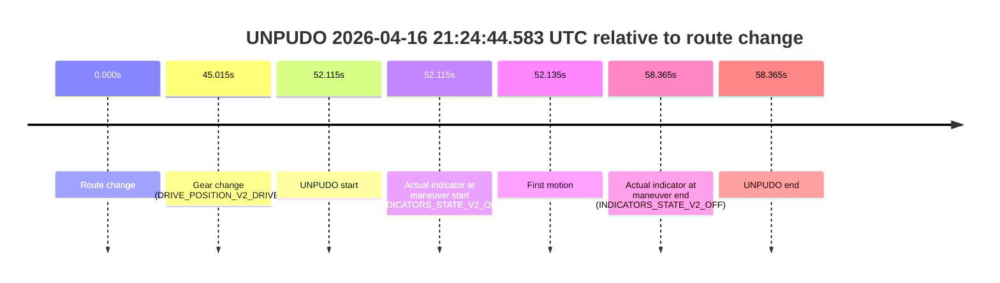
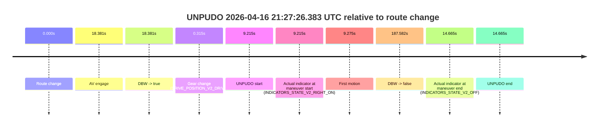
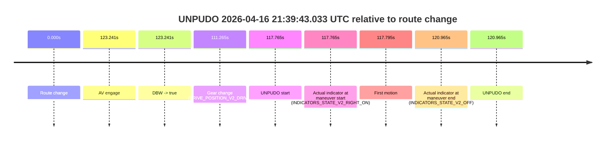

# Run Report: fme20007/2026-04-16--21-04-50--gen2-av-bda7e52e-7550-4f51-a6e5-7edfb97a026d

| Field | Value |
|---|---|
| Run ID | `fme20007/2026-04-16--21-04-50--gen2-av-bda7e52e-7550-4f51-a6e5-7edfb97a026d` |
| Date | `2026-04-16` |
| Model(s) | `apricot-crocodile-uproarious` |
| Author | `guy.geva` |
| Event count | `3` |

## unpudo 2026-04-16 21:24:44.583 UTC

| Field | Value |
|---|---|
| Model | `apricot-crocodile-uproarious` |
| Author | `guy.geva` |
| Run ID | `fme20007/2026-04-16--21-04-50--gen2-av-bda7e52e-7550-4f51-a6e5-7edfb97a026d` |
| Date | `2026-04-16` |
| Time (UTC) | `21:24:44.583` |
| Event type | `unpudo` |
| Disengagement type | `none observed` |
| Route change | `found` |
| Console | [run](https://console.sso.wayve.ai/run/fme20007/2026-04-16--21-04-50--gen2-av-bda7e52e-7550-4f51-a6e5-7edfb97a026d?id=&time-unixus=1776374684583307) |
| Foxglove | [segment](https://app.foxglove.dev/wayve-on-prem/p/prj_0dX18KZdVHg1fmmI/view?ds=foxglove-stream&ds.deviceName=fme20007&ds.start=2026-04-16T21%3A23%3A42.468392Z&ds.end=2026-04-16T21%3A25%3A00.833299Z&layoutId=lay_0e7VD4WIKDQGU73Y&time=2026-04-16T21%3A24%3A44.583307Z) |

### Event card: non-av

- Non-AV: there is no AV-owned portion anywhere inside the detected unpudo timeline, so it is kept for coverage but excluded from model success / failure scoring.

| Event | Time (UTC) | Delta from route change |
|---|---:|---:|
| Route change | 2026-04-16 21:23:52.468 | `0.000s` |
| Gear change (DRIVE_POSITION_V2_DRIVE) | 2026-04-16 21:24:37.483 | `45.015s` |
| UNPUDO start | 2026-04-16 21:24:44.583 | `52.115s` |
| Actual indicator at maneuver start (INDICATORS_STATE_V2_OFF) | 2026-04-16 21:24:44.583 | `52.115s` |
| First motion | 2026-04-16 21:24:44.603 | `52.135s` |
| Actual indicator at maneuver end (INDICATORS_STATE_V2_OFF) | 2026-04-16 21:24:50.833 | `58.365s` |
| UNPUDO end | 2026-04-16 21:24:50.833 | `58.365s` |

| Metric | Value |
|---|---|
| Outcome | `non-av` |
| Effective failure type | `none` |
| Route change status | `found` |
| DBW at event start | `false` |
| DBW at event end | `false` |
| Predicted gear at AV start | `n/a` |
| Actual gear at AV start | `n/a` |
| Predicted gear at event start | `DRIVE_POSITION_V2_DRIVE` |
| Actual gear at event start | `DRIVE_POSITION_V2_DRIVE` |
| Planned indicator direction | `INDICATORS_STATE_V2_LEFT_ON` |
| Controller indicator direction | `INDICATORS_STATE_V2_LEFT_ON` |
| Actual indicator direction | `INDICATORS_STATE_V2_OFF` |
| Actual indicator at maneuver end | `INDICATORS_STATE_V2_OFF` |
| Driver accel help in AV | `false` |
| Driver accel help timestamp | `n/a` |
| Max accel pedal pct in AV | `0.0%` |
| Max brake pedal pct in AV | `0.0%` |
| Max speed mps in AV | `0.000` |
| Route -> AV | `n/a` |
| AV -> event start | `n/a` |
| AV -> first motion | `n/a` |
| AV duration before disengagement | `n/a` |
| Trajectory waypoint count | `37` |
| Driving-plan step count | `11` |

The scored portion starts from the AV-owned window, not from the pre-AV setup. Route-change search in the stopped pre-event segment was `found`, with the baseline therefore set to route change. At the event anchor the model predicts `DRIVE_POSITION_V2_DRIVE` and the actual gear is `DRIVE_POSITION_V2_DRIVE`. The effective model outcome is `non-av` because `there is no AV-owned overlap inside the event timeline`.

### Resolution

| Field | Value |
|---|---|
| Final outcome | `non-av` |
| Do we agree with this label? | `yes` |
| Source disengagement type | `none observed` |
| Resolved effective failure type | `none` |
| Confidence | `high` |

## unpudo 2026-04-16 21:27:26.383 UTC

| Field | Value |
|---|---|
| Model | `apricot-crocodile-uproarious` |
| Author | `guy.geva` |
| Run ID | `fme20007/2026-04-16--21-04-50--gen2-av-bda7e52e-7550-4f51-a6e5-7edfb97a026d` |
| Date | `2026-04-16` |
| Time (UTC) | `21:27:26.383` |
| Event type | `unpudo` |
| Disengagement type | `none observed` |
| Route change | `found` |
| Console | [run](https://console.sso.wayve.ai/run/fme20007/2026-04-16--21-04-50--gen2-av-bda7e52e-7550-4f51-a6e5-7edfb97a026d?id=&time-unixus=1776374846383313) |
| Foxglove | [segment](https://app.foxglove.dev/wayve-on-prem/p/prj_0dX18KZdVHg1fmmI/view?ds=foxglove-stream&ds.deviceName=fme20007&ds.start=2026-04-16T21%3A27%3A07.168299Z&ds.end=2026-04-16T21%3A30%3A34.750531Z&layoutId=lay_0e7VD4WIKDQGU73Y&time=2026-04-16T21%3A27%3A26.383313Z) |

### Event card: non-av

- Non-AV: there is no AV-owned portion anywhere inside the detected unpudo timeline, so it is kept for coverage but excluded from model success / failure scoring.

| Event | Time (UTC) | Delta from route change |
|---|---:|---:|
| Route change | 2026-04-16 21:27:17.168 | `0.000s` |
| AV engage | 2026-04-16 21:27:35.549 | `18.381s` |
| DBW -> true | 2026-04-16 21:27:35.549 | `18.381s` |
| Gear change (DRIVE_POSITION_V2_DRIVE) | 2026-04-16 21:27:17.483 | `0.315s` |
| UNPUDO start | 2026-04-16 21:27:26.383 | `9.215s` |
| Actual indicator at maneuver start (INDICATORS_STATE_V2_RIGHT_ON) | 2026-04-16 21:27:26.383 | `9.215s` |
| First motion | 2026-04-16 21:27:26.443 | `9.275s` |
| DBW -> false | 2026-04-16 21:30:24.750 | `187.582s` |
| Actual indicator at maneuver end (INDICATORS_STATE_V2_OFF) | 2026-04-16 21:27:31.833 | `14.665s` |
| UNPUDO end | 2026-04-16 21:27:31.833 | `14.665s` |

| Metric | Value |
|---|---|
| Outcome | `non-av` |
| Effective failure type | `none` |
| Route change status | `found` |
| DBW at event start | `false` |
| DBW at event end | `false` |
| Predicted gear at AV start | `DRIVE_POSITION_V2_DRIVE` |
| Actual gear at AV start | `DRIVE_POSITION_V2_DRIVE` |
| Predicted gear at event start | `DRIVE_POSITION_V2_DRIVE` |
| Actual gear at event start | `DRIVE_POSITION_V2_DRIVE` |
| Planned indicator direction | `INDICATORS_STATE_V2_RIGHT_ON` |
| Controller indicator direction | `INDICATORS_STATE_V2_RIGHT_ON` |
| Actual indicator direction | `INDICATORS_STATE_V2_RIGHT_ON` |
| Actual indicator at maneuver end | `INDICATORS_STATE_V2_OFF` |
| Driver accel help in AV | `false` |
| Driver accel help timestamp | `n/a` |
| Max accel pedal pct in AV | `0.0%` |
| Max brake pedal pct in AV | `0.0%` |
| Max speed mps in AV | `0.000` |
| Route -> AV | `18.381s` |
| AV -> event start | `-9.166s` |
| AV -> first motion | `-9.106s` |
| AV duration before disengagement | `169.201s` |
| Trajectory waypoint count | `37` |
| Driving-plan step count | `11` |

The scored portion starts from the AV-owned window, not from the pre-AV setup. Route-change search in the stopped pre-event segment was `found`, with the baseline therefore set to route change. At the event anchor the model predicts `DRIVE_POSITION_V2_DRIVE` and the actual gear is `DRIVE_POSITION_V2_DRIVE`. The effective model outcome is `non-av` because `there is no AV-owned overlap inside the event timeline`.

### Resolution

| Field | Value |
|---|---|
| Final outcome | `non-av` |
| Do we agree with this label? | `yes` |
| Source disengagement type | `none observed` |
| Resolved effective failure type | `none` |
| Confidence | `high` |

## unpudo 2026-04-16 21:39:43.033 UTC

| Field | Value |
|---|---|
| Model | `apricot-crocodile-uproarious` |
| Author | `guy.geva` |
| Run ID | `fme20007/2026-04-16--21-04-50--gen2-av-bda7e52e-7550-4f51-a6e5-7edfb97a026d` |
| Date | `2026-04-16` |
| Time (UTC) | `21:39:43.033` |
| Event type | `unpudo` |
| Disengagement type | `none observed` |
| Route change | `found` |
| Console | [run](https://console.sso.wayve.ai/run/fme20007/2026-04-16--21-04-50--gen2-av-bda7e52e-7550-4f51-a6e5-7edfb97a026d?id=&time-unixus=1776375583033322) |
| Foxglove | [segment](https://app.foxglove.dev/wayve-on-prem/p/prj_0dX18KZdVHg1fmmI/view?ds=foxglove-stream&ds.deviceName=fme20007&ds.start=2026-04-16T21%3A37%3A35.268256Z&ds.end=2026-04-16T21%3A39%3A56.233298Z&layoutId=lay_0e7VD4WIKDQGU73Y&time=2026-04-16T21%3A39%3A43.033322Z) |

### Event card: non-av

- Non-AV: there is no AV-owned portion anywhere inside the detected unpudo timeline, so it is kept for coverage but excluded from model success / failure scoring.

| Event | Time (UTC) | Delta from route change |
|---|---:|---:|
| Route change | 2026-04-16 21:37:45.268 | `0.000s` |
| AV engage | 2026-04-16 21:39:48.509 | `123.241s` |
| DBW -> true | 2026-04-16 21:39:48.509 | `123.241s` |
| Gear change (DRIVE_POSITION_V2_DRIVE) | 2026-04-16 21:39:36.533 | `111.265s` |
| UNPUDO start | 2026-04-16 21:39:43.033 | `117.765s` |
| Actual indicator at maneuver start (INDICATORS_STATE_V2_RIGHT_ON) | 2026-04-16 21:39:43.033 | `117.765s` |
| First motion | 2026-04-16 21:39:43.063 | `117.795s` |
| Actual indicator at maneuver end (INDICATORS_STATE_V2_OFF) | 2026-04-16 21:39:46.233 | `120.965s` |
| UNPUDO end | 2026-04-16 21:39:46.233 | `120.965s` |

| Metric | Value |
|---|---|
| Outcome | `non-av` |
| Effective failure type | `none` |
| Route change status | `found` |
| DBW at event start | `false` |
| DBW at event end | `false` |
| Predicted gear at AV start | `DRIVE_POSITION_V2_DRIVE` |
| Actual gear at AV start | `DRIVE_POSITION_V2_DRIVE` |
| Predicted gear at event start | `DRIVE_POSITION_V2_DRIVE` |
| Actual gear at event start | `DRIVE_POSITION_V2_DRIVE` |
| Planned indicator direction | `INDICATORS_STATE_V2_RIGHT_ON` |
| Controller indicator direction | `INDICATORS_STATE_V2_RIGHT_ON` |
| Actual indicator direction | `INDICATORS_STATE_V2_RIGHT_ON` |
| Actual indicator at maneuver end | `INDICATORS_STATE_V2_OFF` |
| Driver accel help in AV | `false` |
| Driver accel help timestamp | `n/a` |
| Max accel pedal pct in AV | `0.0%` |
| Max brake pedal pct in AV | `0.0%` |
| Max speed mps in AV | `0.000` |
| Route -> AV | `123.241s` |
| AV -> event start | `-5.476s` |
| AV -> first motion | `-5.446s` |
| AV duration before disengagement | `n/a` |
| Trajectory waypoint count | `38` |
| Driving-plan step count | `11` |

The scored portion starts from the AV-owned window, not from the pre-AV setup. Route-change search in the stopped pre-event segment was `found`, with the baseline therefore set to route change. At the event anchor the model predicts `DRIVE_POSITION_V2_DRIVE` and the actual gear is `DRIVE_POSITION_V2_DRIVE`. The effective model outcome is `non-av` because `there is no AV-owned overlap inside the event timeline`.

### Resolution

| Field | Value |
|---|---|
| Final outcome | `non-av` |
| Do we agree with this label? | `yes` |
| Source disengagement type | `none observed` |
| Resolved effective failure type | `none` |
| Confidence | `high` |
