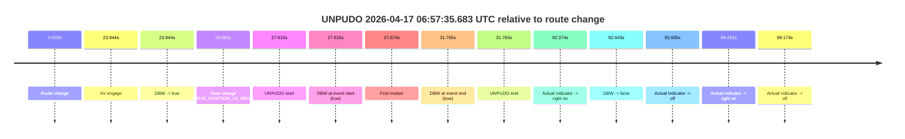
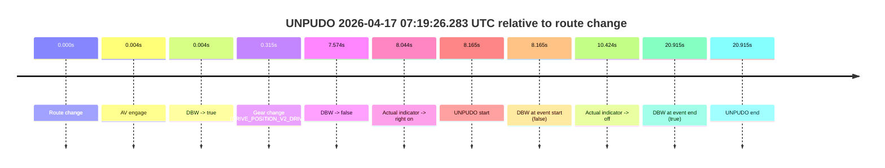
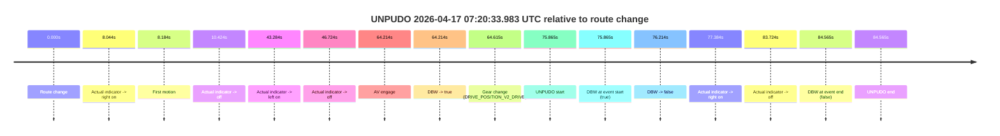
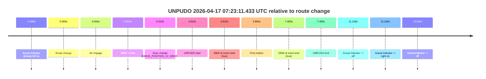

# Run Report: fme20007/2026-04-17--06-19-09--gen2-av-97407758-7b21-4aea-a06c-3e9c93e310b4

| Field | Value |
|---|---|
| Run ID | `fme20007/2026-04-17--06-19-09--gen2-av-97407758-7b21-4aea-a06c-3e9c93e310b4` |
| Date | `2026-04-17` |
| Model(s) | `eel-teal-outspoken` |
| Author | `zak` |
| Event count | `4` |

## unpudo 2026-04-17 06:57:35.683 UTC

| Field | Value |
|---|---|
| Model | `eel-teal-outspoken` |
| Author | `zak` |
| Run ID | `fme20007/2026-04-17--06-19-09--gen2-av-97407758-7b21-4aea-a06c-3e9c93e310b4` |
| Date | `2026-04-17` |
| Time (UTC) | `06:57:35.683` |
| Event type | `unpudo` |
| Disengagement type | `none observed` |
| Route change | `found` |
| Console | [run](https://console.sso.wayve.ai/run/fme20007/2026-04-17--06-19-09--gen2-av-97407758-7b21-4aea-a06c-3e9c93e310b4?id=&time-unixus=1776409055683296) |
| Foxglove | [segment](https://app.foxglove.dev/wayve-on-prem/p/prj_0dX18KZdVHg1fmmI/view?ds=foxglove-stream&ds.deviceName=fme20007&ds.start=2026-04-17T06%3A56%3A58.068310Z&ds.end=2026-04-17T06%3A58%3A50.711632Z&layoutId=lay_0e7VD4WIKDQGU73Y&time=2026-04-17T06%3A57%3A35.683296Z) |

### Event card: pass

- Pass: AV owns the credited unpudo from route change through the official unpudo window, the gear state is aligned at the anchor, and the vehicle moves without driver accelerator help in AV.

| Event | Time (UTC) | Delta from route change |
|---|---:|---:|
| Route change | 2026-04-17 06:57:08.068 | `0.000s` |
| AV engage | 2026-04-17 06:57:32.011 | `23.944s` |
| DBW -> true | 2026-04-17 06:57:32.011 | `23.944s` |
| Gear change (DRIVE_POSITION_V2_DRIVE) | 2026-04-17 06:57:32.133 | `24.065s` |
| UNPUDO start | 2026-04-17 06:57:35.683 | `27.615s` |
| DBW at event start (true) | 2026-04-17 06:57:35.683 | `27.615s` |
| First motion | 2026-04-17 06:57:35.742 | `27.674s` |
| DBW at event end (true) | 2026-04-17 06:57:39.833 | `31.765s` |
| UNPUDO end | 2026-04-17 06:57:39.833 | `31.765s` |
| Actual indicator -> right on | 2026-04-17 06:58:40.442 | `92.374s` |
| DBW -> false | 2026-04-17 06:58:40.711 | `92.643s` |
| Actual indicator -> off | 2026-04-17 06:58:42.003 | `93.935s` |
| Actual indicator -> right on | 2026-04-17 06:58:42.483 | `94.415s` |
| Actual indicator -> off | 2026-04-17 06:58:47.242 | `99.174s` |

| Metric | Value |
|---|---|
| Outcome | `pass` |
| Effective failure type | `none` |
| Route change status | `found` |
| DBW at event start | `true` |
| DBW at event end | `true` |
| Predicted gear at AV start | `DRIVE_POSITION_V2_DRIVE` |
| Actual gear at AV start | `DRIVE_POSITION_V2_PARK` |
| Predicted gear at event start | `DRIVE_POSITION_V2_DRIVE` |
| Actual gear at event start | `DRIVE_POSITION_V2_DRIVE` |
| Planned indicator direction | `INDICATORS_STATE_V2_RIGHT_ON` |
| Controller indicator direction | `INDICATORS_STATE_V2_RIGHT_ON` |
| Actual indicator direction | `INDICATORS_STATE_V2_OFF` |
| Actual indicator at maneuver end | `INDICATORS_STATE_V2_OFF` |
| Driver accel help in AV | `false` |
| Driver accel help timestamp | `n/a` |
| Max accel pedal pct in AV | `0.0%` |
| Max brake pedal pct in AV | `8.0%` |
| Max speed mps in AV | `4.533` |
| Success timing baseline | `route change` |
| Route -> AV | `23.944s` |
| AV -> event start | `3.671s` |
| AV -> first motion | `3.730s` |
| Success baseline -> event start | `27.615s` |
| Success baseline -> first motion | `27.674s` |
| AV duration before disengagement | `68.700s` |
| Trajectory waypoint count | `37` |
| Driving-plan step count | `11` |

The scored portion starts from the AV-owned window, not from the pre-AV setup. Route-change search in the stopped pre-event segment was `found`, with the baseline therefore set to route change. At the event anchor the model predicts `DRIVE_POSITION_V2_DRIVE` and the actual gear is `DRIVE_POSITION_V2_DRIVE`. The effective model outcome is `pass` because `the credited unpudo stays AV-owned through the official unpudo window.`

### Resolution

| Field | Value |
|---|---|
| Final outcome | `pass` |
| Do we agree with this label? | `yes` |
| Source disengagement type | `none observed` |
| Resolved effective failure type | `none` |
| Confidence | `high` |

## unpudo 2026-04-17 07:19:26.283 UTC

| Field | Value |
|---|---|
| Model | `eel-teal-outspoken` |
| Author | `zak` |
| Run ID | `fme20007/2026-04-17--06-19-09--gen2-av-97407758-7b21-4aea-a06c-3e9c93e310b4` |
| Date | `2026-04-17` |
| Time (UTC) | `07:19:26.283` |
| Event type | `unpudo` |
| Disengagement type | `failed_to_accelerate` |
| Route change | `found` |
| Console | [run](https://console.sso.wayve.ai/run/fme20007/2026-04-17--06-19-09--gen2-av-97407758-7b21-4aea-a06c-3e9c93e310b4?id=&time-unixus=1776410366283302) |
| Foxglove | [segment](https://app.foxglove.dev/wayve-on-prem/p/prj_0dX18KZdVHg1fmmI/view?ds=foxglove-stream&ds.deviceName=fme20007&ds.start=2026-04-17T07%3A19%3A08.118302Z&ds.end=2026-04-17T07%3A19%3A49.033323Z&layoutId=lay_0e7VD4WIKDQGU73Y&time=2026-04-17T07%3A19%3A26.283302Z) |

### Event card: fail

- Fail: AV owns part of the segment, but the event still resolves as a model-performance failure under the AV-only scoring rule.

| Event | Time (UTC) | Delta from route change |
|---|---:|---:|
| Route change | 2026-04-17 07:19:18.118 | `0.000s` |
| AV engage | 2026-04-17 07:19:18.121 | `0.004s` |
| DBW -> true | 2026-04-17 07:19:18.121 | `0.004s` |
| Gear change (DRIVE_POSITION_V2_DRIVE) | 2026-04-17 07:19:18.433 | `0.315s` |
| DBW -> false | 2026-04-17 07:19:25.692 | `7.574s` |
| Actual indicator -> right on | 2026-04-17 07:19:26.162 | `8.044s` |
| UNPUDO start | 2026-04-17 07:19:26.283 | `8.165s` |
| DBW at event start (false) | 2026-04-17 07:19:26.283 | `8.165s` |
| Actual indicator -> off | 2026-04-17 07:19:28.542 | `10.424s` |
| DBW at event end (true) | 2026-04-17 07:19:39.033 | `20.915s` |
| UNPUDO end | 2026-04-17 07:19:39.033 | `20.915s` |

| Metric | Value |
|---|---|
| Outcome | `fail` |
| Effective failure type | `failed_to_accelerate` |
| Route change status | `found` |
| DBW at event start | `false` |
| DBW at event end | `true` |
| Predicted gear at AV start | `DRIVE_POSITION_V2_PARK` |
| Actual gear at AV start | `DRIVE_POSITION_V2_PARK` |
| Predicted gear at event start | `DRIVE_POSITION_V2_DRIVE` |
| Actual gear at event start | `DRIVE_POSITION_V2_DRIVE` |
| Planned indicator direction | `INDICATORS_STATE_V2_RIGHT_ON` |
| Controller indicator direction | `INDICATORS_STATE_V2_RIGHT_ON` |
| Actual indicator direction | `INDICATORS_STATE_V2_RIGHT_ON` |
| Actual indicator at maneuver end | `INDICATORS_STATE_V2_OFF` |
| Driver accel help in AV | `false` |
| Driver accel help timestamp | `n/a` |
| Max accel pedal pct in AV | `0.0%` |
| Max brake pedal pct in AV | `8.0%` |
| Max speed mps in AV | `0.000` |
| Success timing baseline | `route change` |
| Route -> AV | `0.004s` |
| AV -> event start | `8.161s` |
| AV -> first motion | `n/a` |
| Success baseline -> event start | `8.165s` |
| Success baseline -> first motion | `n/a` |
| AV duration before disengagement | `7.571s` |
| Trajectory waypoint count | `37` |
| Driving-plan step count | `11` |

The scored portion starts from the AV-owned window, not from the pre-AV setup. Route-change search in the stopped pre-event segment was `found`, with the baseline therefore set to route change. At the event anchor the model predicts `DRIVE_POSITION_V2_DRIVE` and the actual gear is `DRIVE_POSITION_V2_DRIVE`. The effective model outcome is `fail` because `failed_to_accelerate.`

### Resolution

| Field | Value |
|---|---|
| Final outcome | `fail` |
| Do we agree with this label? | `yes` |
| Source disengagement type | `failed_to_accelerate` |
| Resolved effective failure type | `failed_to_accelerate` |
| Confidence | `high` |

## unpudo 2026-04-17 07:20:33.983 UTC

| Field | Value |
|---|---|
| Model | `eel-teal-outspoken` |
| Author | `zak` |
| Run ID | `fme20007/2026-04-17--06-19-09--gen2-av-97407758-7b21-4aea-a06c-3e9c93e310b4` |
| Date | `2026-04-17` |
| Time (UTC) | `07:20:33.983` |
| Event type | `unpudo` |
| Disengagement type | `failed_to_slow` |
| Route change | `found` |
| Console | [run](https://console.sso.wayve.ai/run/fme20007/2026-04-17--06-19-09--gen2-av-97407758-7b21-4aea-a06c-3e9c93e310b4?id=&time-unixus=1776410433983324) |
| Foxglove | [segment](https://app.foxglove.dev/wayve-on-prem/p/prj_0dX18KZdVHg1fmmI/view?ds=foxglove-stream&ds.deviceName=fme20007&ds.start=2026-04-17T07%3A19%3A08.118302Z&ds.end=2026-04-17T07%3A20%3A52.683315Z&layoutId=lay_0e7VD4WIKDQGU73Y&time=2026-04-17T07%3A20%3A33.983324Z) |

### Event card: fail

- Fail: AV owns part of the segment, but the event still resolves as a model-performance failure under the AV-only scoring rule.

| Event | Time (UTC) | Delta from route change |
|---|---:|---:|
| Route change | 2026-04-17 07:19:18.118 | `0.000s` |
| Actual indicator -> right on | 2026-04-17 07:19:26.162 | `8.044s` |
| First motion | 2026-04-17 07:19:26.302 | `8.184s` |
| Actual indicator -> off | 2026-04-17 07:19:28.542 | `10.424s` |
| Actual indicator -> left on | 2026-04-17 07:20:01.402 | `43.284s` |
| Actual indicator -> off | 2026-04-17 07:20:04.842 | `46.724s` |
| AV engage | 2026-04-17 07:20:22.331 | `64.214s` |
| DBW -> true | 2026-04-17 07:20:22.331 | `64.214s` |
| Gear change (DRIVE_POSITION_V2_DRIVE) | 2026-04-17 07:20:22.733 | `64.615s` |
| UNPUDO start | 2026-04-17 07:20:33.983 | `75.865s` |
| DBW at event start (true) | 2026-04-17 07:20:33.983 | `75.865s` |
| DBW -> false | 2026-04-17 07:20:34.331 | `76.214s` |
| Actual indicator -> right on | 2026-04-17 07:20:35.502 | `77.384s` |
| Actual indicator -> off | 2026-04-17 07:20:41.842 | `83.724s` |
| DBW at event end (false) | 2026-04-17 07:20:42.683 | `84.565s` |
| UNPUDO end | 2026-04-17 07:20:42.683 | `84.565s` |

| Metric | Value |
|---|---|
| Outcome | `fail` |
| Effective failure type | `failed_to_slow` |
| Route change status | `found` |
| DBW at event start | `true` |
| DBW at event end | `false` |
| Predicted gear at AV start | `DRIVE_POSITION_V2_DRIVE` |
| Actual gear at AV start | `DRIVE_POSITION_V2_PARK` |
| Predicted gear at event start | `DRIVE_POSITION_V2_DRIVE` |
| Actual gear at event start | `DRIVE_POSITION_V2_DRIVE` |
| Planned indicator direction | `INDICATORS_STATE_V2_RIGHT_ON` |
| Controller indicator direction | `INDICATORS_STATE_V2_RIGHT_ON` |
| Actual indicator direction | `INDICATORS_STATE_V2_OFF` |
| Actual indicator at maneuver end | `INDICATORS_STATE_V2_OFF` |
| Driver accel help in AV | `false` |
| Driver accel help timestamp | `n/a` |
| Max accel pedal pct in AV | `0.0%` |
| Max brake pedal pct in AV | `8.0%` |
| Max speed mps in AV | `0.922` |
| Success timing baseline | `route change` |
| Route -> AV | `64.214s` |
| AV -> event start | `11.651s` |
| AV -> first motion | `-56.030s` |
| Success baseline -> event start | `75.865s` |
| Success baseline -> first motion | `8.184s` |
| AV duration before disengagement | `12.000s` |
| Trajectory waypoint count | `37` |
| Driving-plan step count | `11` |

The scored portion starts from the AV-owned window, not from the pre-AV setup. Route-change search in the stopped pre-event segment was `found`, with the baseline therefore set to route change. At the event anchor the model predicts `DRIVE_POSITION_V2_DRIVE` and the actual gear is `DRIVE_POSITION_V2_DRIVE`. The effective model outcome is `fail` because `failed_to_slow.`

### Resolution

| Field | Value |
|---|---|
| Final outcome | `fail` |
| Do we agree with this label? | `yes` |
| Source disengagement type | `failed_to_slow` |
| Resolved effective failure type | `failed_to_slow` |
| Confidence | `high` |

## unpudo 2026-04-17 07:23:11.433 UTC

| Field | Value |
|---|---|
| Model | `eel-teal-outspoken` |
| Author | `zak` |
| Run ID | `fme20007/2026-04-17--06-19-09--gen2-av-97407758-7b21-4aea-a06c-3e9c93e310b4` |
| Date | `2026-04-17` |
| Time (UTC) | `07:23:11.433` |
| Event type | `unpudo` |
| Disengagement type | `none observed` |
| Route change | `found` |
| Console | [run](https://console.sso.wayve.ai/run/fme20007/2026-04-17--06-19-09--gen2-av-97407758-7b21-4aea-a06c-3e9c93e310b4?id=&time-unixus=1776410591433305) |
| Foxglove | [segment](https://app.foxglove.dev/wayve-on-prem/p/prj_0dX18KZdVHg1fmmI/view?ds=foxglove-stream&ds.deviceName=fme20007&ds.start=2026-04-17T07%3A22%3A57.518338Z&ds.end=2026-04-17T07%3A23%3A24.983318Z&layoutId=lay_0e7VD4WIKDQGU73Y&time=2026-04-17T07%3A23%3A11.433305Z) |

### Event card: pass

- Pass: AV owns the credited unpudo from route change through the official unpudo window, the gear state is aligned at the anchor, and the vehicle moves without driver accelerator help in AV.

| Event | Time (UTC) | Delta from route change |
|---|---:|---:|
| Actual indicator already left on | 2026-04-17 07:22:57.522 | `-9.996s` |
| Route change | 2026-04-17 07:23:07.518 | `0.000s` |
| AV engage | 2026-04-17 07:23:07.521 | `0.004s` |
| DBW -> true | 2026-04-17 07:23:07.521 | `0.004s` |
| Gear change (DRIVE_POSITION_V2_DRIVE) | 2026-04-17 07:23:07.833 | `0.315s` |
| UNPUDO start | 2026-04-17 07:23:11.433 | `3.915s` |
| DBW at event start (true) | 2026-04-17 07:23:11.433 | `3.915s` |
| First motion | 2026-04-17 07:23:11.482 | `3.964s` |
| DBW at event end (true) | 2026-04-17 07:23:14.983 | `7.465s` |
| UNPUDO end | 2026-04-17 07:23:14.983 | `7.465s` |
| Actual indicator -> off | 2026-04-17 07:23:18.622 | `11.104s` |
| Actual indicator -> right on | 2026-04-17 07:23:18.682 | `11.164s` |
| Actual indicator -> off | 2026-04-17 07:23:20.562 | `13.044s` |

| Metric | Value |
|---|---|
| Outcome | `pass` |
| Effective failure type | `none` |
| Route change status | `found` |
| DBW at event start | `true` |
| DBW at event end | `true` |
| Predicted gear at AV start | `DRIVE_POSITION_V2_PARK` |
| Actual gear at AV start | `DRIVE_POSITION_V2_PARK` |
| Predicted gear at event start | `DRIVE_POSITION_V2_DRIVE` |
| Actual gear at event start | `DRIVE_POSITION_V2_DRIVE` |
| Planned indicator direction | `INDICATORS_STATE_V2_RIGHT_ON` |
| Controller indicator direction | `INDICATORS_STATE_V2_RIGHT_ON` |
| Actual indicator direction | `INDICATORS_STATE_V2_LEFT_ON` |
| Actual indicator at maneuver end | `INDICATORS_STATE_V2_LEFT_ON` |
| Driver accel help in AV | `false` |
| Driver accel help timestamp | `n/a` |
| Max accel pedal pct in AV | `0.0%` |
| Max brake pedal pct in AV | `10.1%` |
| Max speed mps in AV | `5.406` |
| Success timing baseline | `route change` |
| Route -> AV | `0.004s` |
| AV -> event start | `3.911s` |
| AV -> first motion | `3.960s` |
| Success baseline -> event start | `3.915s` |
| Success baseline -> first motion | `3.964s` |
| AV duration before disengagement | `n/a` |
| Trajectory waypoint count | `38` |
| Driving-plan step count | `11` |

The scored portion starts from the AV-owned window, not from the pre-AV setup. Route-change search in the stopped pre-event segment was `found`, with the baseline therefore set to route change. At the event anchor the model predicts `DRIVE_POSITION_V2_DRIVE` and the actual gear is `DRIVE_POSITION_V2_DRIVE`. The effective model outcome is `pass` because `the credited unpudo stays AV-owned through the official unpudo window.`

### Resolution

| Field | Value |
|---|---|
| Final outcome | `pass` |
| Do we agree with this label? | `yes` |
| Source disengagement type | `none observed` |
| Resolved effective failure type | `none` |
| Confidence | `high` |
